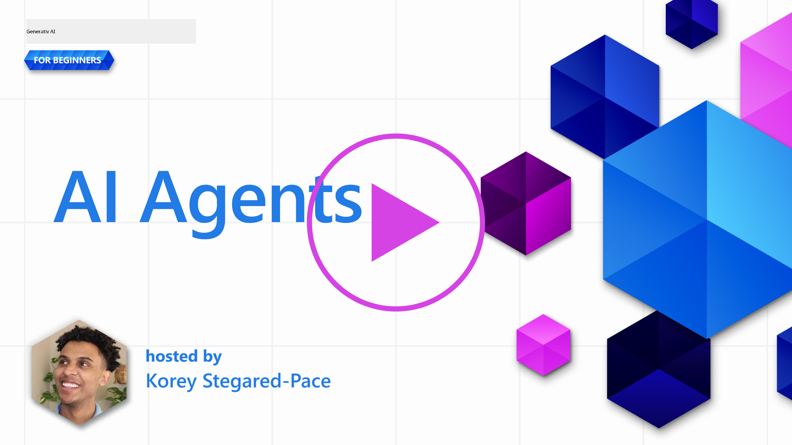
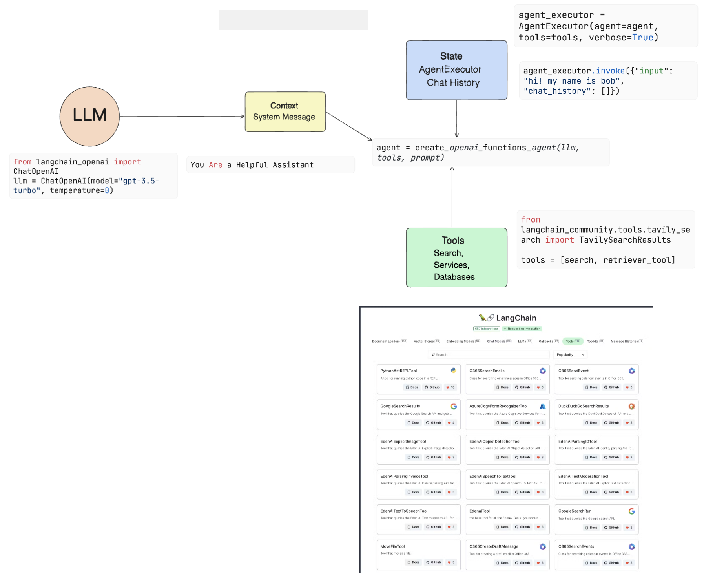

<!--
CO_OP_TRANSLATOR_METADATA:
{
  "original_hash": "11f03c81f190d9cbafd0f977dcbede6c",
  "translation_date": "2025-07-09T17:26:38+00:00",
  "source_file": "17-ai-agents/README.md",
  "language_code": "da"
}
-->
[](https://aka.ms/gen-ai-lesson17-gh?WT.mc_id=academic-105485-koreyst)

## Introduktion

AI Agents repræsenterer en spændende udvikling inden for Generative AI, hvor store sprogmodeller (LLMs) udvikler sig fra assistenter til agenter, der kan udføre handlinger. AI Agent-rammeværker gør det muligt for udviklere at skabe applikationer, der giver LLMs adgang til værktøjer og tilstandsadministration. Disse rammeværker øger også gennemsigtigheden, så brugere og udviklere kan overvåge de handlinger, LLMs planlægger, hvilket forbedrer oplevelsesstyringen.

Lektionens indhold vil omfatte følgende områder:

- Forstå, hvad en AI Agent er – Hvad er en AI Agent egentlig?
- Udforske fire forskellige AI Agent-rammeværker – Hvad gør dem unikke?
- Anvende disse AI Agents til forskellige brugsscenarier – Hvornår bør vi bruge AI Agents?

## Læringsmål

Efter at have gennemført denne lektion vil du kunne:

- Forklare, hvad AI Agents er, og hvordan de kan anvendes.
- Have en forståelse for forskellene mellem nogle af de populære AI Agent-rammeværker, og hvordan de adskiller sig.
- Forstå, hvordan AI Agents fungerer, så du kan bygge applikationer med dem.

## Hvad er AI Agents?

AI Agents er et meget spændende område inden for Generative AI. Med denne spænding følger også ofte forvirring omkring begreber og anvendelse. For at holde det enkelt og inkluderende for de fleste værktøjer, der omtaler AI Agents, bruger vi denne definition:

AI Agents giver store sprogmodeller (LLMs) mulighed for at udføre opgaver ved at give dem adgang til en **tilstand** og **værktøjer**.


Lad os definere disse begreber:

**Large Language Models** – Det er de modeller, der omtales gennem hele kurset, såsom GPT-3.5, GPT-4, Llama-2 osv.

**State** – Dette refererer til den kontekst, som LLM’en arbejder i. LLM’en bruger konteksten fra sine tidligere handlinger og den aktuelle kontekst til at styre beslutningstagningen for de næste handlinger. AI Agent-rammeværker gør det nemmere for udviklere at bevare denne kontekst.

**Tools** – For at fuldføre den opgave, som brugeren har bedt om, og som LLM’en har planlagt, har LLM’en brug for adgang til værktøjer. Eksempler på værktøjer kan være en database, et API, en ekstern applikation eller endda en anden LLM!

Disse definitioner vil forhåbentlig give dig et godt fundament, når vi ser på, hvordan de implementeres. Lad os udforske nogle forskellige AI Agent-rammeværker:

## LangChain Agents

[LangChain Agents](https://python.langchain.com/docs/how_to/#agents?WT.mc_id=academic-105485-koreyst) er en implementering af de ovenstående definitioner.

For at håndtere **state** bruger det en indbygget funktion kaldet `AgentExecutor`. Denne accepterer den definerede `agent` og de `tools`, der er tilgængelige for den.

`AgentExecutor` gemmer også chat-historikken for at give konteksten i samtalen.



LangChain tilbyder en [værktøjskatalog](https://integrations.langchain.com/tools?WT.mc_id=academic-105485-koreyst), som kan importeres til din applikation, og som LLM’en kan få adgang til. Disse er lavet af fællesskabet og LangChain-teamet.

Du kan derefter definere disse værktøjer og sende dem til `AgentExecutor`.

Gennemsigtighed er et andet vigtigt aspekt, når vi taler om AI Agents. Det er vigtigt for applikationsudviklere at forstå, hvilket værktøj LLM’en bruger, og hvorfor. Derfor har teamet bag LangChain udviklet LangSmith.

## AutoGen

Det næste AI Agent-rammeværk, vi vil gennemgå, er [AutoGen](https://microsoft.github.io/autogen/?WT.mc_id=academic-105485-koreyst). AutoGen fokuserer primært på samtaler. Agenter er både **samtalebaserede** og **tilpasselige**.

**Samtalebaserede –** LLM’er kan starte og fortsætte en samtale med en anden LLM for at fuldføre en opgave. Dette gøres ved at oprette `AssistantAgents` og give dem en specifik systembesked.

```python

autogen.AssistantAgent( name="Coder", llm_config=llm_config, ) pm = autogen.AssistantAgent( name="Product_manager", system_message="Creative in software product ideas.", llm_config=llm_config, )

```

**Tilpasselige** – Agenter kan defineres ikke kun som LLM’er, men også som en bruger eller et værktøj. Som udvikler kan du definere en `UserProxyAgent`, som er ansvarlig for at interagere med brugeren for at få feedback i forbindelse med opgaveløsningen. Denne feedback kan enten fortsætte udførelsen af opgaven eller stoppe den.

```python
user_proxy = UserProxyAgent(name="user_proxy")
```

### State og Tools

For at ændre og håndtere state genererer en assistant Agent Python-kode for at fuldføre opgaven.

Her er et eksempel på processen:


#### LLM defineret med en systembesked

```python
system_message="For weather related tasks, only use the functions you have been provided with. Reply TERMINATE when the task is done."
```

Denne systembesked instruerer denne specifikke LLM om, hvilke funktioner der er relevante for dens opgave. Husk, at med AutoGen kan du have flere definerede AssistantAgents med forskellige systembeskeder.

#### Chatten startes af brugeren

```python
user_proxy.initiate_chat( chatbot, message="I am planning a trip to NYC next week, can you help me pick out what to wear? ", )

```

Denne besked fra user_proxy (mennesket) er det, der starter processen, hvor Agenten undersøger de mulige funktioner, den skal udføre.

#### Funktion udføres

```bash
chatbot (to user_proxy):

***** Suggested tool Call: get_weather ***** Arguments: {"location":"New York City, NY","time_periond:"7","temperature_unit":"Celsius"} ******************************************************** --------------------------------------------------------------------------------

>>>>>>>> EXECUTING FUNCTION get_weather... user_proxy (to chatbot): ***** Response from calling function "get_weather" ***** 112.22727272727272 EUR ****************************************************************

```

Når den indledende chat er behandlet, sender Agenten det foreslåede værktøj til kald. I dette tilfælde er det en funktion kaldet `get_weather`. Afhængigt af din konfiguration kan denne funktion automatisk udføres og læses af Agenten eller udføres baseret på brugerinput.

Du kan finde en liste over [AutoGen kodeeksempler](https://microsoft.github.io/autogen/docs/Examples/?WT.mc_id=academic-105485-koreyst) for at udforske, hvordan du kommer i gang med at bygge.

## Taskweaver

Det næste agent-rammeværk, vi vil udforske, er [Taskweaver](https://microsoft.github.io/TaskWeaver/?WT.mc_id=academic-105485-koreyst). Det er kendt som en "code-first" agent, fordi det i stedet for kun at arbejde med `strings` kan arbejde med DataFrames i Python. Dette er særligt nyttigt til dataanalyse og generering af opgaver. Det kan være ting som at skabe grafer og diagrammer eller generere tilfældige tal.

### State og Tools

For at håndtere samtalens tilstand bruger TaskWeaver konceptet `Planner`. `Planner` er en LLM, der tager brugerens anmodning og kortlægger de opgaver, der skal udføres for at opfylde denne anmodning.

For at fuldføre opgaverne får `Planner` adgang til en samling af værktøjer kaldet `Plugins`. Det kan være Python-klasser eller en generel kodefortolker. Disse plugins gemmes som embeddings, så LLM’en bedre kan søge efter det rette plugin.


Her er et eksempel på et plugin til håndtering af anomali-detektion:

```python
class AnomalyDetectionPlugin(Plugin): def __call__(self, df: pd.DataFrame, time_col_name: str, value_col_name: str):
```

Koden verificeres, før den udføres. En anden funktion til at håndtere kontekst i Taskweaver er `experience`. Experience gør det muligt at gemme konteksten af en samtale over længere tid i en YAML-fil. Dette kan konfigureres, så LLM’en forbedres over tid i visse opgaver, forudsat at den udsættes for tidligere samtaler.

## JARVIS

Det sidste agent-rammeværk, vi vil udforske, er [JARVIS](https://github.com/microsoft/JARVIS?tab=readme-ov-file?WT.mc_id=academic-105485-koreyst). Det, der gør JARVIS unikt, er, at det bruger en LLM til at styre `state` i samtalen, mens `tools` er andre AI-modeller. Hver af disse AI-modeller er specialiserede modeller, der udfører bestemte opgaver som objektdetektion, transskription eller billedbeskrivelse.


LLM’en, som er en generel model, modtager brugerens anmodning og identificerer den specifikke opgave samt eventuelle argumenter/data, der er nødvendige for at fuldføre opgaven.

```python
[{"task": "object-detection", "id": 0, "dep": [-1], "args": {"image": "e1.jpg" }}]
```

LLM’en formaterer derefter anmodningen på en måde, som den specialiserede AI-model kan forstå, f.eks. JSON. Når AI-modellen har returneret sin forudsigelse baseret på opgaven, modtager LLM’en svaret.

Hvis flere modeller er nødvendige for at fuldføre opgaven, vil den også fortolke svarene fra disse modeller, før den samler dem for at generere svaret til brugeren.

Eksemplet nedenfor viser, hvordan dette fungerer, når en bruger anmoder om en beskrivelse og optælling af objekter i et billede:

## Opgave

For at fortsætte din læring om AI Agents kan du bygge med AutoGen:

- En applikation, der simulerer et forretningsmøde med forskellige afdelinger i en uddannelses-startup.
- Opret systembeskeder, der guider LLM’er i at forstå forskellige personas og prioriteter, og som gør det muligt for brugeren at præsentere en ny produktidé.
- LLM’en skal derefter generere opfølgende spørgsmål fra hver afdeling for at forfine og forbedre præsentationen og produktideen.

## Læringen stopper ikke her, fortsæt rejsen

Efter at have gennemført denne lektion, kan du tjekke vores [Generative AI Learning collection](https://aka.ms/genai-collection?WT.mc_id=academic-105485-koreyst) for at fortsætte med at udvikle din viden om Generative AI!

**Ansvarsfraskrivelse**:  
Dette dokument er blevet oversat ved hjælp af AI-oversættelsestjenesten [Co-op Translator](https://github.com/Azure/co-op-translator). Selvom vi bestræber os på nøjagtighed, bedes du være opmærksom på, at automatiserede oversættelser kan indeholde fejl eller unøjagtigheder. Det oprindelige dokument på dets oprindelige sprog bør betragtes som den autoritative kilde. For kritisk information anbefales professionel menneskelig oversættelse. Vi påtager os intet ansvar for misforståelser eller fejltolkninger, der opstår som følge af brugen af denne oversættelse.