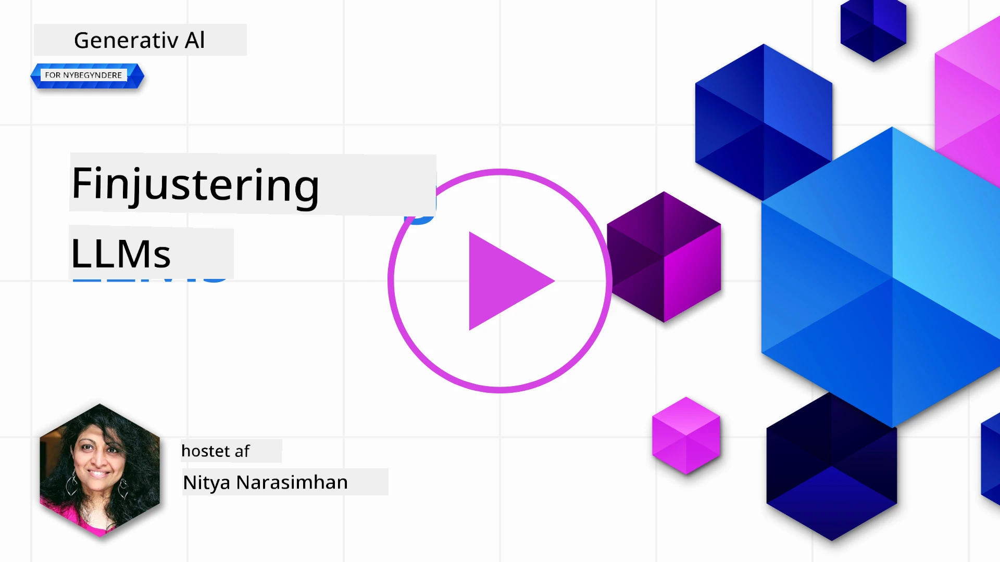
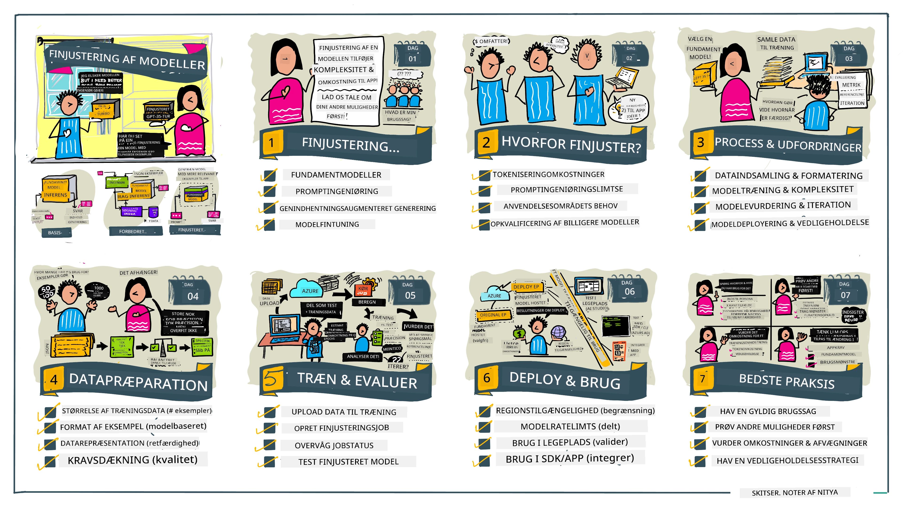

# Finjustering af dit LLM

Brugen af store sprogmodeller til at bygge generative AI-applikationer kommer med nye udfordringer. Et nøgleproblem er at sikre responskvaliteten (nøjagtighed og relevans) i det indhold, som modellen genererer til en given brugerforespørgsel. I tidligere lektioner har vi diskuteret teknikker som prompt engineering og retrieval-augmented generation, der forsøger at løse problemet ved at _ændre promptinputtet_ til den eksisterende model.

I dagens lektion diskuterer vi en tredje teknik, **finjustering**, som forsøger at adressere udfordringen ved at _genuddanne selve modellen_ med yderligere data. Lad os gå i detaljer.

## Læringsmål

Denne lektion introducerer konceptet finjustering for fortrænede sprogmodeller, udforsker fordelene og udfordringerne ved denne tilgang og giver vejledning om, hvornår og hvordan man bruger finjustering til at forbedre ydeevnen af dine generative AI-modeller.

Ved slutningen af denne lektion bør du kunne besvare følgende spørgsmål:

- Hvad er finjustering for sprogmodeller?
- Hvornår og hvorfor er finjustering nyttig?
- Hvordan kan jeg finjustere en fortrænet model?
- Hvad er begrænsningerne ved finjustering?

Klar? Lad os komme i gang.

## Illustreret guide

Vil du have overblikket over, hvad vi skal dække, inden vi dykker ned? Se denne illustrerede guide, der beskriver læringsrejsen for denne lektion – fra at lære kernekoncepter og motivation for finjustering til at forstå processen og bedste praksis for udførelse af finjusteringsopgaven. Dette er et fascinerende emne at udforske, så glem ikke at tjekke [Ressourcer](./RESOURCES.md?WT.mc_id=academic-105485-koreyst) siden for yderligere links, der støtter din selvstyrede læringsrejse!

## Hvad er finjustering for sprogmodeller?

Efter definition er store sprogmodeller _fortrænet_ på store mængder tekst hentet fra forskellige kilder, inklusive internettet. Som vi har lært i tidligere lektioner, har vi brug for teknikker som _prompt engineering_ og _retrieval-augmented generation_ for at forbedre kvaliteten af modellens svar på brugerens spørgsmål ("prompts").

En populær prompt-engineering teknik indebærer at give modellen mere vejledning om, hvad der forventes i svaret, enten ved at give _instruktioner_ (eksplicit vejledning) eller _give den nogle få eksempler_ (implicit vejledning). Dette kaldes _few-shot learning_, men det har to begrænsninger:

- Modellens token-grænser kan begrænse antallet af eksempler, du kan give, og dermed begrænse effektiviteten.
- Modellens token-omkostninger kan gøre det dyrt at tilføje eksempler til hver prompt og begrænse fleksibiliteten.

Finjustering er en almindelig praksis inden for maskinlæringssystemer, hvor vi tager en fortrænet model og genuddanner den med nye data for at forbedre dens ydeevne på en specifik opgave. I konteksten af sprogmodeller kan vi finjustere den fortrænede model _med et kurateret sæt eksempler til en given opgave eller anvendelsesområde_ for at skabe en **specialmodel**, som kan være mere nøjagtig og relevant for netop den opgave eller det domæne. En sidegevinst ved finjustering er, at det også kan reducere antallet af eksempler, der er nødvendige for few-shot learning – hvilket mindsker token-brug og relaterede omkostninger.

## Hvornår og hvorfor skal vi finjustere modeller?

I _denne_ kontekst, når vi taler om finjustering, refererer vi til **overvåget** finjustering, hvor genuddannelsen sker ved at **tilføje nye data**, som ikke var en del af det oprindelige træningsdatasæt. Dette adskiller sig fra en ikke-overvåget finjusteringsmetode, hvor modellen genuddannes på det oprindelige datasæt, men med forskellige hyperparametre.

Det vigtigste at huske er, at finjustering er en avanceret teknik, der kræver et vist niveau af ekspertise for at opnå de ønskede resultater. Hvis det udføres forkert, kan det undlade at give de forventede forbedringer og endda forringe modellens ydeevne for dit målrettede domæne.

Så inden du lærer "hvordan" man finjusterer sprogmodeller, skal du vide, "hvorfor" du skal vælge denne metode, og "hvornår" du skal starte finjusteringsprocessen. Start med at stille dig selv disse spørgsmål:

- **Use case**: Hvad er dit _brugsscenarie_ for finjustering? Hvilket aspekt af den nuværende fortrænede model ønsker du at forbedre?
- **Alternativer**: Har du prøvet _andre teknikker_ for at opnå de ønskede resultater? Brug dem som baseline til sammenligning.
  - Prompt engineering: Prøv teknikker som few-shot prompting med eksempler på relevante prompt-svar. Evaluer kvaliteten af svarene.
  - Retrieval Augmented Generation: Prøv at forstærke prompts med søgeresultater udvundet fra dine data. Evaluer kvaliteten af svarene.
- **Omkostninger**: Har du identificeret omkostningerne ved finjustering?
  - Justerbarhed – er den fortrænede model tilgængelig for finjustering?
  - Indsats – til forberedelse af træningsdata, evaluering og forfining af modellen.
  - Beregning – til kørsel af finjusteringsjob og implementering af finjusteret model.
  - Data – adgang til tilstrækkeligt kvalitets-eksempler for at få effekt af finjustering.
- **Fordele**: Har du bekræftet fordelene ved finjustering?
  - Kvalitet – overgik den finjusterede model baseline?
  - Omkostning – reducerer den token-brug ved at forenkle prompts?
  - Udvidelsesmulighed – kan du genanvende basismodellen til nye domæner?

Ved at besvare disse spørgsmål bør du kunne beslutte, om finjustering er den rette tilgang til dit brugsscenarie. Ideelt set er tilgangen kun gyldig, hvis fordelene opvejer omkostningerne. Når du beslutter at fortsætte, er det tid til at tænke på _hvordan_ du kan finjustere den fortrænede model.

Vil du have flere indsigter om beslutningsprocessen? Se [To fine-tune or not to fine-tune](https://www.youtube.com/watch?v=0Jo-z-MFxJs)

## Hvordan kan vi finjustere en fortrænet model?

For at finjustere en fortrænet model skal du have:

- en fortrænet model til finjustering
- et datasæt til brug ved finjustering
- et træningsmiljø til at køre finjusteringsjobbet
- et hostingmiljø til at implementere den finjusterede model

## Finjustering i praksis

Følgende ressourcer giver trin-for-trin vejledninger, der fører dig gennem et konkret eksempel med en udvalgt model og et kurateret datasæt. For at arbejde med disse vejledninger har du brug for en konto hos den specifikke udbyder samt adgang til den relevante model og datasæt.

| Udbyder     | Vejledning                                                                                                                                                                    | Beskrivelse                                                                                                                                                                                                                                                                                                                                                                                                                      |
| ------------ | ----------------------------------------------------------------------------------------------------------------------------------------------------------------------------- | -------------------------------------------------------------------------------------------------------------------------------------------------------------------------------------------------------------------------------------------------------------------------------------------------------------------------------------------------------------------------------------------------------------------------------- |
| OpenAI       | [How to fine-tune chat models](https://github.com/openai/openai-cookbook/blob/main/examples/How_to_finetune_chat_models.ipynb?WT.mc_id=academic-105485-koreyst)               | Lær at finjustere en `gpt-35-turbo` til et specifikt domæne ("recipe assistant") ved at forberede træningsdata, køre finjusteringsjobbet og bruge den finjusterede model til inferens.                                                                                                                                                                                                                                          |
| Azure OpenAI | [GPT 3.5 Turbo fine-tuning tutorial](https://learn.microsoft.com/azure/ai-services/openai/tutorials/fine-tune?tabs=python-new%2Ccommand-line?WT.mc_id=academic-105485-koreyst) | Lær at finjustere en `gpt-35-turbo-0613` model **på Azure** ved at tage skridt til at oprette og uploade træningsdata, køre finjusteringsjobbet. Implementer og brug den nye model.                                                                                                                                                                                                                                               |
| Hugging Face | [Fine-tuning LLMs with Hugging Face](https://www.philschmid.de/fine-tune-llms-in-2024-with-trl?WT.mc_id=academic-105485-koreyst)                                              | Dette blogindlæg guider dig gennem finjustering af en _åben LLM_ (f.eks. `CodeLlama 7B`) ved hjælp af [transformers](https://huggingface.co/docs/transformers/index?WT.mc_id=academic-105485-koreyst) biblioteket & [Transformer Reinforcement Learning (TRL)](https://huggingface.co/docs/trl/index?WT.mc_id=academic-105485-koreyst]) med åbne [datasæt](https://huggingface.co/docs/datasets/index?WT.mc_id=academic-105485-koreyst) på Hugging Face. |
|              |                                                                                                                                                                               |                                                                                                                                                                                                                                                                                                                                                                                                                                  |
| 🤗 AutoTrain | [Fine-tuning LLMs with AutoTrain](https://github.com/huggingface/autotrain-advanced/?WT.mc_id=academic-105485-koreyst)                                                          | AutoTrain (eller AutoTrain Advanced) er et python-bibliotek udviklet af Hugging Face, som muliggør finjustering for mange forskellige opgaver inklusive LLM finjustering. AutoTrain er en no-code løsning, og finjustering kan udføres i din egen cloud, på Hugging Face Spaces eller lokalt. Det understøtter både en webbaseret GUI, CLI og træning via yaml-konfigurationsfiler.                                                               |
|              |                                                                                                                                                                               |                                                                                                                                                                                                                                                                                                                                                                                                                                  |
| 🦥 Unsloth   | [Fine-tuning LLMs with Unsloth](https://github.com/unslothai/unsloth)                                                                                                          | Unsloth er et open-source framework, der understøtter LLM finjustering og reinforcement learning (RL). Unsloth strømliner lokal træning, evaluering og deployment med klar-til-brug [notebooks](https://github.com/unslothai/notebooks). Det understøtter også tekst-til-tale (TTS), BERT og multimodale modeller. For at komme i gang, læs deres trin-for-trin [Finjustering af LLM'er Guide](https://docs.unsloth.ai/get-started/fine-tuning-llms-guide).                            |
|              |                                                                                                                                                                               |                                                                                                                                                                                                                                                                                                                                                                                                                                  |
## Opgave

Vælg en af vejledningerne ovenfor og gennemgå den. _Vi kan kopiere en version af disse vejledninger i Jupyter Notebooks i dette repo som reference. Brug venligst de originale kilder direkte for at få de nyeste versioner_.

## Godt arbejde! Fortsæt din læring.

Efter at have gennemført denne lektion, kan du tjekke vores [Generative AI Learning collection](https://aka.ms/genai-collection?WT.mc_id=academic-105485-koreyst) for at fortsætte med at styrke din generative AI-viden!

Tillykke!! Du har gennemført den sidste lektion i v2-serien til dette kursus! Stop ikke med at lære og bygge videre. \*\*Tjek [RESSOURCER](RESOURCES.md?WT.mc_id=academic-105485-koreyst) siden for en liste over yderligere forslag til lige netop dette emne.

Vores v1-serie af lektioner er også blevet opdateret med flere opgaver og koncepter. Så tag et øjeblik til at friske din viden op – og del venligst [dine spørgsmål og feedback](https://github.com/microsoft/generative-ai-for-beginners/issues?WT.mc_id=academic-105485-koreyst) for at hjælpe os med at forbedre disse lektioner for fællesskabet.

---

<!-- CO-OP TRANSLATOR DISCLAIMER START -->
**Ansvarsfraskrivelse**:
Dette dokument er blevet oversat ved hjælp af AI-oversættelsestjenesten [Co-op Translator](https://github.com/Azure/co-op-translator). Selvom vi bestræber os på nøjagtighed, bedes du være opmærksom på, at automatiserede oversættelser kan indeholde fejl eller unøjagtigheder. Det originale dokument på dets oprindelige sprog bør betragtes som den autoritative kilde. For kritisk information anbefales professionel menneskelig oversættelse. Vi påtager os intet ansvar for misforståelser eller fejltolkninger, der opstår som følge af brugen af denne oversættelse.
<!-- CO-OP TRANSLATOR DISCLAIMER END -->