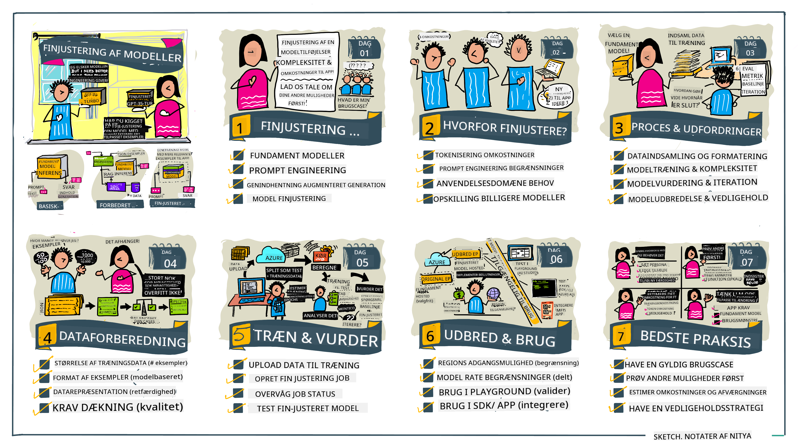

<!--
CO_OP_TRANSLATOR_METADATA:
{
  "original_hash": "68664f7e754a892ae1d8d5e2b7bd2081",
  "translation_date": "2025-07-09T17:44:24+00:00",
  "source_file": "18-fine-tuning/README.md",
  "language_code": "da"
}
-->

# Finjustering af dit LLM

Brugen af store sprogmodeller til at bygge generative AI-applikationer medfører nye udfordringer. En vigtig problemstilling er at sikre svarenes kvalitet (nøjagtighed og relevans) i det indhold, modellen genererer som svar på en given brugerforespørgsel. I tidligere lektioner har vi diskuteret teknikker som prompt engineering og retrieval-augmented generation, der forsøger at løse problemet ved at _ændre prompt-inputtet_ til den eksisterende model.

I dagens lektion ser vi på en tredje teknik, **finjustering**, som forsøger at tackle udfordringen ved at _genuddanne selve modellen_ med yderligere data. Lad os dykke ned i detaljerne.

## Læringsmål

Denne lektion introducerer konceptet finjustering af fortrænede sprogmodeller, udforsker fordelene og udfordringerne ved denne tilgang og giver vejledning i, hvornår og hvordan man kan bruge finjustering til at forbedre ydeevnen af dine generative AI-modeller.

Når du har gennemført denne lektion, bør du kunne besvare følgende spørgsmål:

- Hvad er finjustering af sprogmodeller?
- Hvornår og hvorfor er finjustering nyttigt?
- Hvordan kan jeg finjustere en fortrænet model?
- Hvad er begrænsningerne ved finjustering?

Klar? Lad os komme i gang.

## Illustreret guide

Vil du have et overblik over, hvad vi skal gennemgå, inden vi går i dybden? Se denne illustrerede guide, der beskriver læringsrejsen for denne lektion – fra at lære de grundlæggende begreber og motivationen for finjustering til at forstå processen og bedste praksis for at udføre finjusteringsopgaven. Det er et spændende emne at udforske, så glem ikke at tjekke [Ressourcer](./RESOURCES.md?WT.mc_id=academic-105485-koreyst) siden for yderligere links, der kan støtte din selvstyrede læringsrejse!

## Hvad er finjustering af sprogmodeller?

Per definition er store sprogmodeller _fortrænet_ på store mængder tekst hentet fra forskellige kilder, herunder internettet. Som vi har lært i tidligere lektioner, har vi brug for teknikker som _prompt engineering_ og _retrieval-augmented generation_ for at forbedre kvaliteten af modellens svar på brugerens spørgsmål ("prompter").

En populær prompt-engineering teknik indebærer at give modellen mere vejledning om, hvad der forventes i svaret, enten ved at give _instruktioner_ (eksplicit vejledning) eller _give den nogle få eksempler_ (implicit vejledning). Dette kaldes _few-shot learning_, men det har to begrænsninger:

- Modellens token-grænser kan begrænse antallet af eksempler, du kan give, og dermed begrænse effektiviteten.
- Omkostningerne ved tokens kan gøre det dyrt at tilføje eksempler til hver prompt og begrænse fleksibiliteten.

Finjustering er en almindelig praksis i maskinlæringssystemer, hvor man tager en fortrænet model og genuddanner den med nye data for at forbedre dens ydeevne på en specifik opgave. I forbindelse med sprogmodeller kan vi finjustere den fortrænede model _med et kurateret sæt eksempler til en given opgave eller anvendelsesområde_ for at skabe en **tilpasset model**, der kan være mere præcis og relevant for netop denne opgave eller domæne. En ekstra fordel ved finjustering er, at det også kan reducere antallet af eksempler, der er nødvendige for few-shot learning – hvilket mindsker tokenforbruget og de tilknyttede omkostninger.

## Hvornår og hvorfor bør vi finjustere modeller?

I _denne_ sammenhæng, når vi taler om finjustering, refererer vi til **superviseret** finjustering, hvor genuddannelsen sker ved at **tilføje nye data**, som ikke var en del af det oprindelige træningsdatasæt. Dette adskiller sig fra en usuperviseret finjusteringsmetode, hvor modellen genuddannes på de oprindelige data, men med forskellige hyperparametre.

Det vigtigste at huske er, at finjustering er en avanceret teknik, der kræver et vist niveau af ekspertise for at opnå de ønskede resultater. Hvis det gøres forkert, kan det ikke give de forventede forbedringer og kan endda forringe modellens ydeevne for dit målrettede domæne.

Så før du lærer "hvordan" man finjusterer sprogmodeller, skal du vide "hvorfor" du bør vælge denne vej, og "hvornår" du skal starte finjusteringsprocessen. Start med at stille dig selv disse spørgsmål:

- **Brugssag**: Hvad er din _brugssag_ for finjustering? Hvilket aspekt af den nuværende fortrænede model ønsker du at forbedre?
- **Alternativer**: Har du prøvet _andre teknikker_ for at opnå de ønskede resultater? Brug dem til at skabe en baseline til sammenligning.
  - Prompt engineering: Prøv teknikker som few-shot prompting med eksempler på relevante prompt-svar. Evaluer svarenes kvalitet.
  - Retrieval Augmented Generation: Prøv at supplere prompts med søgeresultater hentet fra dine data. Evaluer svarenes kvalitet.
- **Omkostninger**: Har du identificeret omkostningerne ved finjustering?
  - Mulighed for finjustering – er den fortrænede model tilgængelig for finjustering?
  - Arbejdsmængde – til forberedelse af træningsdata, evaluering og forbedring af modellen.
  - Beregning – til at køre finjusteringsjob og implementere den finjusterede model.
  - Data – adgang til tilstrækkeligt kvalitetsdata for at opnå effekt ved finjustering.
- **Fordele**: Har du bekræftet fordelene ved finjustering?
  - Kvalitet – overgik den finjusterede model baseline?
  - Omkostninger – reducerer det tokenforbruget ved at forenkle prompts?
  - Udvidelsesmuligheder – kan du genbruge basismodellen til nye domæner?

Ved at besvare disse spørgsmål bør du kunne afgøre, om finjustering er den rette tilgang for din brugssag. Ideelt set er tilgangen kun gyldig, hvis fordelene opvejer omkostningerne. Når du har besluttet dig for at fortsætte, er det tid til at tænke over _hvordan_ du kan finjustere den fortrænede model.

Vil du have flere indsigter om beslutningsprocessen? Se [To fine-tune or not to fine-tune](https://www.youtube.com/watch?v=0Jo-z-MFxJs)

## Hvordan kan vi finjustere en fortrænet model?

For at finjustere en fortrænet model skal du have:

- en fortrænet model, der kan finjusteres
- et datasæt til brug ved finjustering
- et træningsmiljø til at køre finjusteringsjobbet
- et hostingmiljø til at implementere den finjusterede model

## Finjustering i praksis

Følgende ressourcer giver trin-for-trin vejledninger, der guider dig gennem et konkret eksempel med en udvalgt model og et kurateret datasæt. For at arbejde med disse vejledninger skal du have en konto hos den specifikke udbyder samt adgang til den relevante model og datasæt.

| Udbyder     | Vejledning                                                                                                                                                                    | Beskrivelse                                                                                                                                                                                                                                                                                                                                                                                                                       |
| ----------- | ----------------------------------------------------------------------------------------------------------------------------------------------------------------------------- | --------------------------------------------------------------------------------------------------------------------------------------------------------------------------------------------------------------------------------------------------------------------------------------------------------------------------------------------------------------------------------------------------------------------------------- |
| OpenAI      | [How to fine-tune chat models](https://github.com/openai/openai-cookbook/blob/main/examples/How_to_finetune_chat_models.ipynb?WT.mc_id=academic-105485-koreyst)               | Lær at finjustere en `gpt-35-turbo` til et specifikt domæne ("recipe assistant") ved at forberede træningsdata, køre finjusteringsjobbet og bruge den finjusterede model til inferens.                                                                                                                                                                                                                                             |
| Azure OpenAI| [GPT 3.5 Turbo fine-tuning tutorial](https://learn.microsoft.com/azure/ai-services/openai/tutorials/fine-tune?tabs=python-new%2Ccommand-line?WT.mc_id=academic-105485-koreyst) | Lær at finjustere en `gpt-35-turbo-0613` model **på Azure** ved at oprette og uploade træningsdata, køre finjusteringsjobbet samt implementere og bruge den nye model.                                                                                                                                                                                                                                                             |
| Hugging Face| [Fine-tuning LLMs with Hugging Face](https://www.philschmid.de/fine-tune-llms-in-2024-with-trl?WT.mc_id=academic-105485-koreyst)                                              | Dette blogindlæg guider dig gennem finjustering af en _åben LLM_ (f.eks. `CodeLlama 7B`) ved hjælp af [transformers](https://huggingface.co/docs/transformers/index?WT.mc_id=academic-105485-koreyst) biblioteket og [Transformer Reinforcement Learning (TRL)](https://huggingface.co/docs/trl/index?WT.mc_id=academic-105485-koreyst) med åbne [datasæt](https://huggingface.co/docs/datasets/index?WT.mc_id=academic-105485-koreyst) på Hugging Face. |
|             |                                                                                                                                                                               |                                                                                                                                                                                                                                                                                                                                                                                                                                 |
| 🤗 AutoTrain| [Fine-tuning LLMs with AutoTrain](https://github.com/huggingface/autotrain-advanced/?WT.mc_id=academic-105485-koreyst)                                                        | AutoTrain (eller AutoTrain Advanced) er et python-bibliotek udviklet af Hugging Face, som muliggør finjustering for mange forskellige opgaver, herunder LLM finjustering. AutoTrain er en no-code løsning, og finjustering kan udføres i din egen cloud, på Hugging Face Spaces eller lokalt. Det understøtter både en webbaseret GUI, CLI og træning via yaml-konfigurationsfiler.                                                                                 |
|             |                                                                                                                                                                               |                                                                                                                                                                                                                                                                                                                                                                                                                                 |

## Opgave

Vælg en af vejledningerne ovenfor og gennemfør den. _Vi kan komme til at gengive en version af disse vejledninger i Jupyter Notebooks i dette repo som reference. Brug venligst de originale kilder direkte for at få de nyeste versioner_.

## Godt arbejde! Fortsæt din læring.

Efter at have gennemført denne lektion, kan du tjekke vores [Generative AI Learning collection](https://aka.ms/genai-collection?WT.mc_id=academic-105485-koreyst) for at fortsætte med at udvikle din viden om Generativ AI!

Tillykke!! Du har gennemført den sidste lektion i v2-serien for dette kursus! Stop ikke med at lære og bygge videre. \*\*Tjek [RESSOURCER](RESOURCES.md?WT.mc_id=academic-105485-koreyst) siden for en liste over yderligere forslag til netop dette emne.

Vores v1-serie af lektioner er også blevet opdateret med flere opgaver og koncepter. Så tag et øjeblik til at opfriske din viden – og del gerne [dine spørgsmål og feedback](https://github.com/microsoft/generative-ai-for-beginners/issues?WT.mc_id=academic-105485-koreyst) for at hjælpe os med at forbedre disse lektioner for fællesskabet.

**Ansvarsfraskrivelse**:  
Dette dokument er blevet oversat ved hjælp af AI-oversættelsestjenesten [Co-op Translator](https://github.com/Azure/co-op-translator). Selvom vi bestræber os på nøjagtighed, bedes du være opmærksom på, at automatiserede oversættelser kan indeholde fejl eller unøjagtigheder. Det oprindelige dokument på dets oprindelige sprog bør betragtes som den autoritative kilde. For kritisk information anbefales professionel menneskelig oversættelse. Vi påtager os intet ansvar for misforståelser eller fejltolkninger, der opstår som følge af brugen af denne oversættelse.