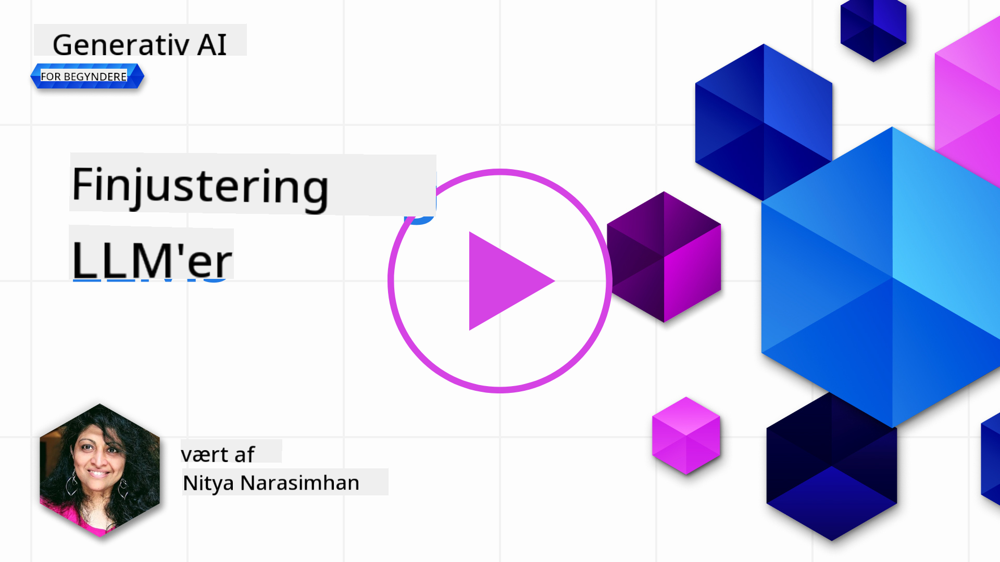

<!--
CO_OP_TRANSLATOR_METADATA:
{
  "original_hash": "68664f7e754a892ae1d8d5e2b7bd2081",
  "translation_date": "2025-05-20T07:50:13+00:00",
  "source_file": "18-fine-tuning/README.md",
  "language_code": "da"
}
-->

# Finjustering af din LLM

Brugen af store sprogmodeller til at bygge generative AI-applikationer kommer med nye udfordringer. Et centralt problem er at sikre kvaliteten af svarene (nøjagtighed og relevans) i indholdet, som modellen genererer for en given brugerforespørgsel. I tidligere lektioner har vi diskuteret teknikker som prompt engineering og retrieval-augmented generation, der forsøger at løse problemet ved at _ændre prompt input_ til den eksisterende model.

I dagens lektion diskuterer vi en tredje teknik, **finjustering**, som forsøger at imødegå udfordringen ved _at genoptræne selve modellen_ med yderligere data. Lad os dykke ned i detaljerne.

## Læringsmål

Denne lektion introducerer konceptet finjustering for forudtrænede sprogmodeller, udforsker fordelene og udfordringerne ved denne tilgang og giver vejledning om, hvornår og hvordan man bruger finjustering til at forbedre ydeevnen af dine generative AI-modeller.

Ved slutningen af denne lektion skal du kunne besvare følgende spørgsmål:

- Hvad er finjustering for sprogmodeller?
- Hvornår, og hvorfor, er finjustering nyttig?
- Hvordan kan jeg finjustere en forudtrænet model?
- Hvad er begrænsningerne ved finjustering?

Klar? Lad os komme i gang.

## Illustreret Guide

Vil du have det store billede af, hvad vi vil dække, før vi dykker ind? Se denne illustrerede guide, der beskriver læringsrejsen for denne lektion - fra at lære de grundlæggende begreber og motivationen for finjustering, til at forstå processen og bedste praksis for at udføre finjusteringsopgaven. Dette er et fascinerende emne at udforske, så glem ikke at tjekke [Ressourcer](./RESOURCES.md?WT.mc_id=academic-105485-koreyst) siden for yderligere links til at støtte din selvstyrede læringsrejse!

## Hvad er finjustering for sprogmodeller?

Per definition er store sprogmodeller _forudtrænede_ på store mængder tekst hentet fra diverse kilder, herunder internettet. Som vi har lært i tidligere lektioner, har vi brug for teknikker som _prompt engineering_ og _retrieval-augmented generation_ for at forbedre kvaliteten af modellens svar på brugerens spørgsmål ("prompts").

En populær prompt-engineering teknik involverer at give modellen mere vejledning om, hvad der forventes i svaret enten ved at give _instruktioner_ (eksplicit vejledning) eller _give den nogle eksempler_ (implicit vejledning). Dette kaldes _few-shot learning_, men det har to begrænsninger:

- Model token grænser kan begrænse antallet af eksempler, du kan give, og begrænse effektiviteten.
- Model token omkostninger kan gøre det dyrt at tilføje eksempler til hver prompt og begrænse fleksibiliteten.

Finjustering er en almindelig praksis i maskinlæringssystemer, hvor vi tager en forudtrænet model og genoptræner den med nye data for at forbedre dens ydeevne på en specifik opgave. I konteksten af sprogmodeller kan vi finjustere den forudtrænede model _med et kurateret sæt eksempler for en given opgave eller applikationsdomæne_ for at skabe en **custom model**, der måske er mere præcis og relevant for den specifikke opgave eller domæne. En sidefordel ved finjustering er, at det også kan reducere antallet af eksempler, der er nødvendige for few-shot learning - hvilket reducerer tokenbrug og relaterede omkostninger.

## Hvornår og hvorfor skal vi finjustere modeller?

I _denne_ kontekst, når vi taler om finjustering, henviser vi til **supervised** finjustering, hvor genoptræningen sker ved **tilføjelse af nye data**, der ikke var en del af det originale træningsdatasæt. Dette er forskelligt fra en unsupervised finjustering tilgang, hvor modellen genoptrænes på de originale data, men med forskellige hyperparametre.

Det vigtigste at huske er, at finjustering er en avanceret teknik, der kræver et vist niveau af ekspertise for at opnå de ønskede resultater. Hvis det gøres forkert, kan det måske ikke give de forventede forbedringer og kan endda forringe modellens ydeevne for dit målrettede domæne.

Så før du lærer "hvordan" man finjusterer sprogmodeller, skal du vide "hvorfor" du skal tage denne vej, og "hvornår" du skal starte processen med finjustering. Start med at stille dig selv disse spørgsmål:

- **Use Case**: Hvad er din _use case_ for finjustering? Hvilken aspekt af den nuværende forudtrænede model ønsker du at forbedre?
- **Alternatives**: Har du prøvet _andre teknikker_ for at opnå de ønskede resultater? Brug dem til at skabe en baseline til sammenligning.
  - Prompt engineering: Prøv teknikker som few-shot prompting med eksempler på relevante prompt svar. Evaluer kvaliteten af svarene.
  - Retrieval Augmented Generation: Prøv at udvide prompts med forespørgselsresultater hentet ved at søge i dine data. Evaluer kvaliteten af svarene.
- **Costs**: Har du identificeret omkostningerne ved finjustering?
  - Tunability - er den forudtrænede model tilgængelig for finjustering?
  - Effort - for at forberede træningsdata, evaluere & forfine model.
  - Compute - for at køre finjusteringsjob og implementere finjusteret model
  - Data - adgang til tilstrækkelige kvalitets eksempler for finjusteringspåvirkning
- **Benefits**: Har du bekræftet fordelene ved finjustering?
  - Quality - overgik den finjusterede model baseline?
  - Cost - reducerer det tokenbrug ved at forenkle prompts?
  - Extensibility - kan du genbruge basismodellen til nye domæner?

Ved at besvare disse spørgsmål bør du kunne beslutte, om finjustering er den rigtige tilgang for din use case. Ideelt set er tilgangen kun gyldig, hvis fordelene opvejer omkostningerne. Når du beslutter dig for at fortsætte, er det tid til at tænke over _hvordan_ du kan finjustere den forudtrænede model.

Vil du have flere indsigter i beslutningsprocessen? Se [To fine-tune or not to fine-tune](https://www.youtube.com/watch?v=0Jo-z-MFxJs)

## Hvordan kan vi finjustere en forudtrænet model?

For at finjustere en forudtrænet model skal du have:

- en forudtrænet model til finjustering
- et datasæt til brug for finjustering
- et træningsmiljø til at køre finjusteringsjobbet
- et hostingmiljø til at implementere den finjusterede model

## Finjustering i aktion

Følgende ressourcer giver trin-for-trin vejledninger til at guide dig gennem et reelt eksempel ved hjælp af en valgt model med et kurateret datasæt. For at arbejde gennem disse vejledninger skal du have en konto hos den specifikke udbyder, sammen med adgang til den relevante model og datasæt.

| Udbyder      | Tutorial                                                                                                                                                                       | Beskrivelse                                                                                                                                                                                                                                                                                                                                                                                                                        |
| ------------ | ------------------------------------------------------------------------------------------------------------------------------------------------------------------------------ | ---------------------------------------------------------------------------------------------------------------------------------------------------------------------------------------------------------------------------------------------------------------------------------------------------------------------------------------------------------------------------------------------------------------------------------- |
| OpenAI       | [How to fine-tune chat models](https://github.com/openai/openai-cookbook/blob/main/examples/How_to_finetune_chat_models.ipynb?WT.mc_id=academic-105485-koreyst)                | Lær at finjustere en `gpt-35-turbo` for et specifikt domæne ("recipe assistant") ved at forberede træningsdata, køre finjusteringsjobbet og bruge den finjusterede model til inferens.                                                                                                                                                                                                                                              |
| Azure OpenAI | [GPT 3.5 Turbo fine-tuning tutorial](https://learn.microsoft.com/azure/ai-services/openai/tutorials/fine-tune?tabs=python-new%2Ccommand-line?WT.mc_id=academic-105485-koreyst) | Lær at finjustere en `gpt-35-turbo-0613` model **på Azure** ved at tage skridt til at oprette & uploade træningsdata, køre finjusteringsjobbet. Implementer & brug den nye model.                                                                                                                                                                                                                                                                 |
| Hugging Face | [Fine-tuning LLMs with Hugging Face](https://www.philschmid.de/fine-tune-llms-in-2024-with-trl?WT.mc_id=academic-105485-koreyst)                                               | Dette blogindlæg guider dig i finjustering af en _open LLM_ (fx `CodeLlama 7B`) ved hjælp af [transformers](https://huggingface.co/docs/transformers/index?WT.mc_id=academic-105485-koreyst) biblioteket & [Transformer Reinforcement Learning (TRL)](https://huggingface.co/docs/trl/index?WT.mc_id=academic-105485-koreyst]) med åbne [datasets](https://huggingface.co/docs/datasets/index?WT.mc_id=academic-105485-koreyst) på Hugging Face. |
|              |                                                                                                                                                                                |                                                                                                                                                                                                                                                                                                                                                                                                                                    |
| 🤗 AutoTrain | [Fine-tuning LLMs with AutoTrain](https://github.com/huggingface/autotrain-advanced/?WT.mc_id=academic-105485-koreyst)                                                         | AutoTrain (eller AutoTrain Advanced) er et python-bibliotek udviklet af Hugging Face, der tillader finjustering for mange forskellige opgaver, inklusive LLM finjustering. AutoTrain er en no-code løsning, og finjustering kan gøres i din egen cloud, på Hugging Face Spaces eller lokalt. Det understøtter både en web-baseret GUI, CLI og træning via yaml konfigurationsfiler.                                                                               |
|              |                                                                                                                                                                                |                                                                                                                                                                                                                                                                                                                                                                                                                                    |

## Opgave

Vælg en af vejledningerne ovenfor og gennemgå dem. _Vi kan muligvis replikere en version af disse vejledninger i Jupyter Notebooks i dette repo kun til reference. Brug venligst de originale kilder direkte for at få de nyeste versioner_.

## Godt arbejde! Fortsæt din læring.

Efter at have afsluttet denne lektion, tjek vores [Generative AI Learning collection](https://aka.ms/genai-collection?WT.mc_id=academic-105485-koreyst) for at fortsætte med at opbygge din viden om Generativ AI!

Tillykke!! Du har gennemført den sidste lektion fra v2 serien for dette kursus! Stop ikke med at lære og bygge. \*\*Tjek [RESSOURCER](RESOURCES.md?WT.mc_id=academic-105485-koreyst) siden for en liste over yderligere forslag til netop dette emne.

Vores v1 serie af lektioner er også blevet opdateret med flere opgaver og koncepter. Så tag et øjeblik til at opfriske din viden - og venligst [del dine spørgsmål og feedback](https://github.com/microsoft/generative-ai-for-beginners/issues?WT.mc_id=academic-105485-koreyst) for at hjælpe os med at forbedre disse lektioner for fællesskabet.

**Ansvarsfraskrivelse**:  
Dette dokument er blevet oversat ved hjælp af AI-oversættelsestjenesten [Co-op Translator](https://github.com/Azure/co-op-translator). Mens vi bestræber os på at sikre nøjagtighed, bedes du være opmærksom på, at automatiserede oversættelser kan indeholde fejl eller unøjagtigheder. Det originale dokument på dets oprindelige sprog bør betragtes som den autoritative kilde. For kritisk information anbefales professionel menneskelig oversættelse. Vi er ikke ansvarlige for eventuelle misforståelser eller fejltolkninger, der måtte opstå ved brug af denne oversættelse.