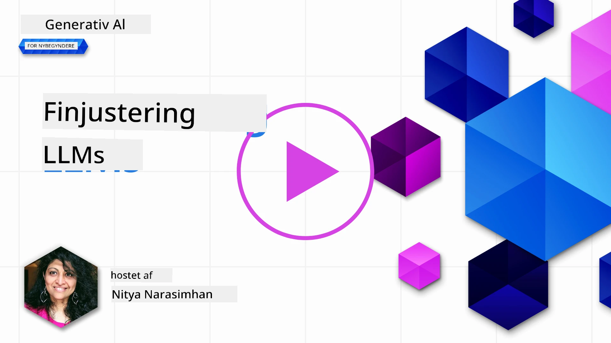
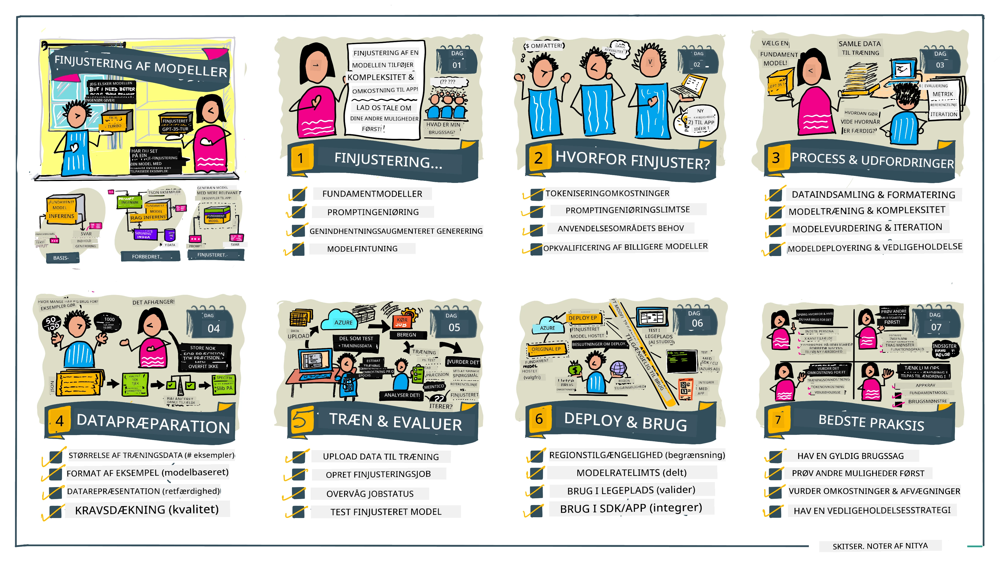

# Finjustering af din LLM

Brug af store sprogmodeller til at bygge generative AI-applikationer medfører nye udfordringer. Et centralt spørgsmål er at sikre svarens kvalitet (præcision og relevans) i det indhold, modellen genererer for en given brugerforespørgsel. I tidligere lektioner har vi diskuteret teknikker som prompt engineering og retrieval-augmented generation, der forsøger at løse problemet ved at _ændre prompt-inputtet_ til den eksisterende model.

I dagens lektion diskuterer vi en tredje teknik, **finjustering**, som forsøger at tackle udfordringen ved _at genuddanne selve modellen_ med yderligere data. Lad os dykke ned i detaljerne.

## Læringsmål

Denne lektion introducerer begrebet finjustering af fortrænede sprogmodeller, udforsker fordelene og udfordringerne ved denne tilgang, og giver vejledning om, hvornår og hvordan man bruger finjustering til at forbedre ydeevnen af dine generative AI-modeller.

Ved slutningen af denne lektion bør du kunne besvare følgende spørgsmål:

- Hvad er finjustering for sprogmodeller?
- Hvornår, og hvorfor, er finjustering nyttig?
- Hvordan kan jeg finjustere en fortrænet model?
- Hvad er begrænsningerne ved finjustering?

Klar? Lad os komme i gang.

## Illustreret guide

Vil du have et overblik over, hvad vi vil dække, inden vi går i gang? Tjek denne illustrerede guide, der beskriver læringsrejsen for denne lektion – fra kernen i begreberne og motivationen for finjustering til forståelse af processen og bedste praksis for udførelse af finjusteringsopgaven. Dette er et spændende emne for udforskning, så glem ikke at besøge [Ressourcesiden](./RESOURCES.md?WT.mc_id=academic-105485-koreyst) for yderligere links til at støtte din selvstyrede læringsrejse!

## Hvad er finjustering for sprogmodeller?

Efter definition er store sprogmodeller _fortrænede_ på store mængder tekst hentet fra forskellige kilder, inklusive internettet. Som vi har lært i tidligere lektioner, har vi brug for teknikker som _prompt engineering_ og _retrieval-augmented generation_ for at forbedre kvaliteten af modellens svar på brugerens spørgsmål ("prompter").

En populær prompt engineering teknik involverer at give modellen mere vejledning om, hvad der forventes i svaret, enten ved at give _instruktioner_ (eksplicit vejledning) eller _give den nogle få eksempler_ (implicit vejledning). Dette kaldes for _few-shot learning_, men det har to begrænsninger:

- Modeltokens grænser kan begrænse antallet af eksempler, du kan give, og begrænse effektiviteten.
- Modeltokens omkostninger kan gøre det dyrt at tilføje eksempler til hver prompt, og begrænse fleksibiliteten.

Finjustering er en almindelig praksis i maskinlæringssystemer, hvor vi tager en fortrænet model og genuddanner den med nye data for at forbedre dens præstation på en specifik opgave. I konteksten af sprogmodeller kan vi finjustere den fortrænede model _med et kurateret sæt eksempler til en given opgave eller anvendelsesdomæne_ for at skabe en **tilpasset model**, der kan være mere præcis og relevant for netop denne specifikke opgave eller domæne. En sidegevinst ved finjustering er, at det også kan reducere antallet af nødvendige eksempler ved few-shot learning – hvilket mindsker token-forbrug og de relaterede omkostninger.

## Hvornår og hvorfor skal vi finjustere modeller?

I _denne_ kontekst, når vi taler om finjustering, refererer vi til **superviseret** finjustering, hvor genuddannelsen sker ved **tilføjelse af nye data**, som ikke var del af det oprindelige træningsdatasæt. Dette adskiller sig fra en usuperviseret finjusteringsmetode, hvor modellen genuddannes på de oprindelige data, men med forskellige hyperparametre.

Det vigtigste at huske er, at finjustering er en avanceret teknik, som kræver et vist ekspertiseniveau for at opnå de ønskede resultater. Hvis det gøres forkert, giver det muligvis ikke de forventede forbedringer og kan endda forringe modellens ydeevne for dit specifikke domæne.

Så før du lærer "hvordan" man finjusterer sprogmodeller, skal du vide "hvorfor" du bør vælge denne vej, og "hvornår" du skal starte processen med finjustering. Start med at stille dig selv disse spørgsmål:

- **Use Case**: Hvad er dit _anvendelsestilfælde_ for finjustering? Hvilket aspekt af den nuværende fortrænede model ønsker du at forbedre?
- **Alternativer**: Har du prøvet _andre teknikker_ for at opnå de ønskede resultater? Brug dem til at skabe et referencepunkt for sammenligning.
  - Prompt engineering: Prøv teknikker som few-shot prompting med eksempler på relevante prompt-svar. Evaluer svarenes kvalitet.
  - Retrieval Augmented Generation: Prøv at forstærke prompts med resultatet fra forespørgsler, hentet ved at søge i dine data. Evaluer svarenes kvalitet.
- **Omkostninger**: Har du identificeret omkostningerne for finjustering?
  - Tilgængelighed – er den fortrænede model tilgængelig for finjustering?
  - Arbejdsindsats – til forberedelse af træningsdata, evaluering og forfining af model.
  - Computekraft – til at køre finjusteringsjob og implementere finjusteret model.
  - Data – adgang til tilstrækkeligt kvalitetsmateriale til at have effekt ved finjustering.
- **Fordele**: Har du bekræftet fordelene ved finjustering?
  - Kvalitet – overgik den finjusterede model referencepunktet?
  - Omkostning – kan det reducere tokenforbrug ved at forenkle prompts?
  - Udvidelsesmuligheder – kan du genbruge basismodellen til nye domæner?

Ved at besvare disse spørgsmål bør du kunne afgøre, om finjustering er den rette tilgang for dit anvendelsestilfælde. Ideelt set er tilgangen kun gyldig, hvis fordelene opvejer omkostningerne. Når du beslutter dig for at gå videre, er det tid til at tænke på _hvordan_ du kan finjustere den fortrænede model.

Vil du have flere indsigter i beslutningsprocessen? Se [To fine-tune or not to fine-tune](https://www.youtube.com/watch?v=0Jo-z-MFxJs)

## Hvordan kan vi finjustere en fortrænet model?

For at finjustere en fortrænet model skal du have:

- en fortrænet model til at finjustere
- et datasæt at bruge til finjustering
- et træningsmiljø til at køre finjusteringsjobbet
- et hostingmiljø for at implementere den finjusterede model

## Finjustering i praksis

Følgende ressourcer giver trin-for-trin tutorials, der guider dig igennem et reelt eksempel med en udvalgt model og et kurateret datasæt. For at gennemføre disse tutorials skal du have en konto hos den specifikke udbyder, samt adgang til de relevante modeller og datasæt.

| Udbyder     | Tutorial                                                                                                                                                                       | Beskrivelse                                                                                                                                                                                                                                                                                                                                                                                                                        |
| ------------ | ------------------------------------------------------------------------------------------------------------------------------------------------------------------------------ | ---------------------------------------------------------------------------------------------------------------------------------------------------------------------------------------------------------------------------------------------------------------------------------------------------------------------------------------------------------------------------------------------------------------------------------- |
| OpenAI       | [Sådan finjusteres chatmodeller](https://github.com/openai/openai-cookbook/blob/main/examples/How_to_finetune_chat_models.ipynb?WT.mc_id=academic-105485-koreyst)                | Lær at finjustere en `gpt-35-turbo` for et bestemt domæne ("recipe assistant") ved at forberede træningsdata, køre finjusteringsjobbet og bruge den finjusterede model til inferens.                                                                                                                                                                                                                                               |
| Azure OpenAI | [GPT 3.5 Turbo finjusteringsvejledning](https://learn.microsoft.com/azure/ai-services/openai/tutorials/fine-tune?tabs=python-new%2Ccommand-line&WT.mc_id=academic-105485-koreyst) | Lær at finjustere en `gpt-35-turbo-0613` model **på Azure** ved at følge trin til at oprette og uploade træningsdata, køre finjusteringsjobbet. Implementer og brug den nye model.                                                                                                                                                                                                                                                |
| Hugging Face | [Finjustering af LLMs med Hugging Face](https://www.philschmid.de/fine-tune-llms-in-2024-with-trl?WT.mc_id=academic-105485-koreyst)                                               | Dette blogindlæg viser dig, hvordan du finjusterer en _åben LLM_ (f.eks. `CodeLlama 7B`) ved brug af [transformers](https://huggingface.co/docs/transformers/index?WT.mc_id=academic-105485-koreyst) biblioteket & [Transformer Reinforcement Learning (TRL)](https://huggingface.co/docs/trl/index?WT.mc_id=academic-105485-koreyst) med åbne [datasets](https://huggingface.co/docs/datasets/index?WT.mc_id=academic-105485-koreyst) på Hugging Face. |
|              |                                                                                                                                                                                |                                                                                                                                                                                                                                                                                                                                                                                                                                    |
| 🤗 AutoTrain | [Finjustering af LLMs med AutoTrain](https://github.com/huggingface/autotrain-advanced/?WT.mc_id=academic-105485-koreyst)                                                         | AutoTrain (eller AutoTrain Advanced) er et Python-bibliotek udviklet af Hugging Face, der tillader finjustering for mange forskellige opgaver inklusive LLM finjustering. AutoTrain er en no-code løsning, og finjustering kan foretages i din egen cloud, på Hugging Face Spaces eller lokalt. Det understøtter både en webbaseret GUI, CLI og træning via yaml-konfigurationsfiler.                                                                     |
|              |                                                                                                                                                                                |                                                                                                                                                                                                                                                                                                                                                                                                                                    |
| 🦥 Unsloth | [Finjustering af LLMs med Unsloth](https://github.com/unslothai/unsloth)                                                         | Unsloth er et open source-rammeværk, som understøtter LLM finjustering og forstærkningslæring (RL). Unsloth strømliner lokal træning, evaluering og implementering med færdige [notebooks](https://github.com/unslothai/notebooks). Det understøtter også tekst-til-tale (TTS), BERT og multimodale modeller. For at komme i gang, læs deres trin-for-trin [Finjusteringsguide for LLMs](https://docs.unsloth.ai/get-started/fine-tuning-llms-guide).                                                      |
|              |                                                                                                                                                                                |                                                                                                                                                                                                                                                                                                                                                                                                                                    |
## Opgave

Vælg en af ovenstående tutorials og gennemfør den. _Vi kan muligvis reproducere en version af disse tutorials i Jupyter Notebooks i dette repositorium til reference. Brug venligst de originale kilder direkte for at få den nyeste version_.

## Godt arbejde! Fortsæt din læring.

Efter at have gennemført denne lektion, kan du tjekke vores [Generative AI Learning samling](https://aka.ms/genai-collection?WT.mc_id=academic-105485-koreyst) for at fortsætte med at udvikle din viden om Generativ AI!

Tillykke!! Du har gennemført den sidste lektion i v2-serien for dette kursus! Stop ikke med at lære og bygge videre. \*\*Tjek [RESSOURCERNE](RESOURCES.md?WT.mc_id=academic-105485-koreyst) for en liste med yderligere forslag netop til dette emne.

Vores v1-serie af lektioner er også blevet opdateret med flere opgaver og koncepter. Så tag et øjeblik til at friske din viden op - og del venligst [dine spørgsmål og feedback](https://github.com/microsoft/generative-ai-for-beginners/issues?WT.mc_id=academic-105485-koreyst) for at hjælpe os med at forbedre disse lektioner for fællesskabet.

---

<!-- CO-OP TRANSLATOR DISCLAIMER START -->
**Ansvarsfraskrivelse**:  
Dette dokument er blevet oversat ved hjælp af AI-oversættelsestjenesten [Co-op Translator](https://github.com/Azure/co-op-translator). Selvom vi bestræber os på nøjagtighed, bedes du være opmærksom på, at automatiske oversættelser kan indeholde fejl eller unøjagtigheder. Det oprindelige dokument på dets modersmål bør betragtes som den autoritative kilde. For kritisk information anbefales professionel menneskelig oversættelse. Vi påtager os intet ansvar for misforståelser eller fejltolkninger, der opstår som følge af brugen af denne oversættelse.
<!-- CO-OP TRANSLATOR DISCLAIMER END -->