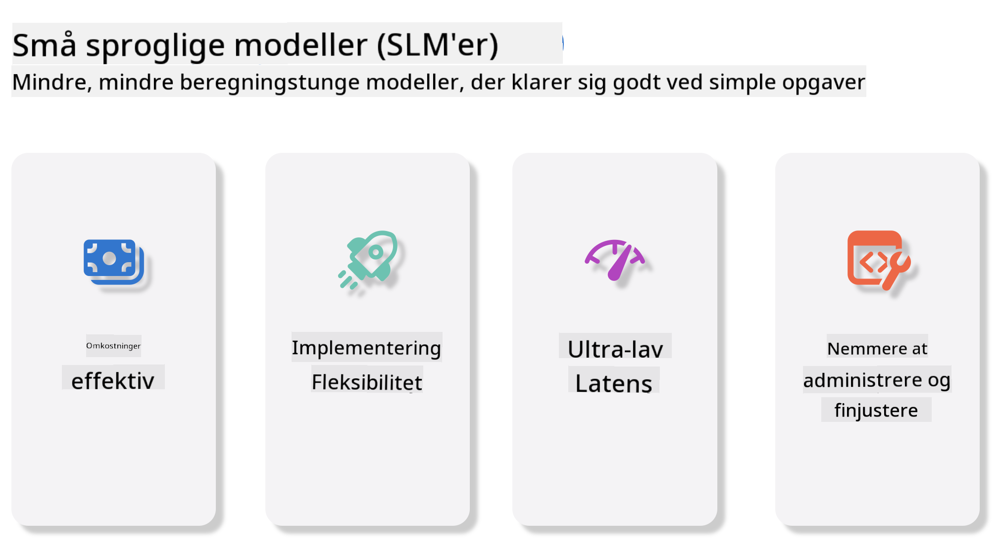
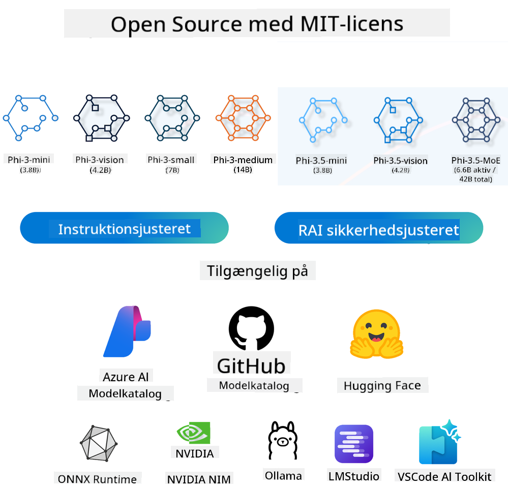
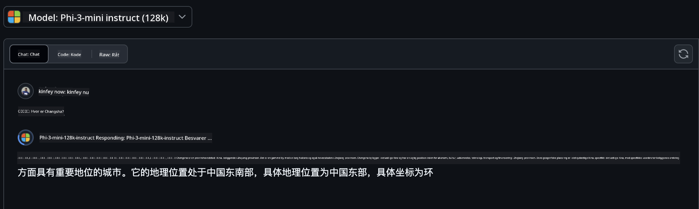
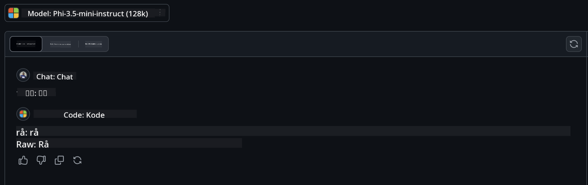

<!--
CO_OP_TRANSLATOR_METADATA:
{
  "original_hash": "124ad36cfe96f74038811b6e2bb93e9d",
  "translation_date": "2025-05-20T10:01:06+00:00",
  "source_file": "19-slm/README.md",
  "language_code": "da"
}
-->
# Introduktion til små sprogmodeller for generativ AI for begyndere Generativ AI er et fascinerende felt inden for kunstig intelligens, der fokuserer på at skabe systemer, der er i stand til at generere nyt indhold. Dette indhold kan variere fra tekst og billeder til musik og endda hele virtuelle miljøer. En af de mest spændende anvendelser af generativ AI er inden for området sprogmodeller. ## Hvad er små sprogmodeller? En lille sprogmodel (SLM) repræsenterer en nedskaleret variant af en stor sprogmodel (LLM), der udnytter mange af de arkitektoniske principper og teknikker fra LLM'er, mens den udviser en betydeligt reduceret beregningsmæssig fodaftryk. SLM'er er en undergruppe af sprogmodeller designet til at generere menneskelignende tekst. I modsætning til deres større modstykker, såsom GPT-4, er SLM'er mere kompakte og effektive, hvilket gør dem ideelle til applikationer, hvor beregningsressourcer er begrænsede. På trods af deres mindre størrelse kan de stadig udføre en række opgaver. Typisk konstrueres SLM'er ved at komprimere eller destillere LLM'er med det formål at bevare en væsentlig del af den oprindelige models funktionalitet og sproglige kapaciteter. Denne reduktion i modelstørrelse mindsker den samlede kompleksitet, hvilket gør SLM'er mere effektive med hensyn til både hukommelsesforbrug og beregningskrav. På trods af disse optimeringer kan SLM'er stadig udføre en bred vifte af naturlig sprogbehandling (NLP) opgaver: - Tekstgenerering: Skabe sammenhængende og kontekstmæssigt relevante sætninger eller afsnit. - Tekstfuldførelse: Forudsige og fuldføre sætninger baseret på en given prompt. - Oversættelse: Konvertere tekst fra et sprog til et andet. - Sammenfatning: Kondensering af lange tekststykker til kortere, mere fordøjelige resuméer. Dog med nogle kompromiser i ydeevne eller dybde af forståelse sammenlignet med deres større modstykker. ## Hvordan fungerer små sprogmodeller? SLM'er trænes på enorme mængder tekstdata. Under træning lærer de mønstrene og strukturerne i sproget, hvilket gør dem i stand til at generere tekst, der er både grammatisk korrekt og kontekstmæssigt passende. Træningsprocessen involverer: - Dataindsamling: Indsamling af store datasæt af tekst fra forskellige kilder. - Forbehandling: Rensning og organisering af dataene for at gøre dem egnede til træning. - Træning: Brug af maskinlæringsalgoritmer til at lære modellen at forstå og generere tekst. - Finjustering: Justering af modellen for at forbedre dens ydeevne på specifikke opgaver. Udviklingen af SLM'er er i tråd med det stigende behov for modeller, der kan implementeres i ressourcebegrænsede miljøer, såsom mobile enheder eller edge computing platforme, hvor fuldskala LLM'er kan være upraktiske på grund af deres tunge ressourcekrav. Ved at fokusere på effektivitet balancerer SLM'er ydeevne med tilgængelighed, hvilket muliggør bredere anvendelse på tværs af forskellige domæner.  ## Læringsmål I denne lektion håber vi at introducere viden om SLM og kombinere det med Microsoft Phi-3 for at lære forskellige scenarier inden for tekstindhold, vision og MoE. Ved slutningen af denne lektion bør du være i stand til at besvare følgende spørgsmål: - Hvad er SLM - Hvad er forskellen mellem SLM og LLM - Hvad er Microsoft Phi-3/3.5 Family - Hvordan man foretager inferens med Microsoft Phi-3/3.5 Family Klar? Lad os komme i gang. ## Forskellene mellem store sprogmodeller (LLM'er) og små sprogmodeller (SLM'er) Både LLM'er og SLM'er er bygget på grundlæggende principper for probabilistisk maskinlæring, og følger lignende tilgange i deres arkitektoniske design, træningsmetoder, datagenereringsprocesser og modelevalueringsteknikker. Dog adskiller flere nøglefaktorer disse to typer modeller. ## Anvendelser af små sprogmodeller SLM'er har en bred vifte af anvendelser, herunder: - Chatbots: Yde kundesupport og engagere sig med brugere på en samtaleorienteret måde. - Indholdsskabelse: Assistere skribenter ved at generere ideer eller endda udkast til hele artikler. - Uddannelse: Hjælpe studerende med skriveopgaver eller lære nye sprog. - Tilgængelighed: Oprettelse af værktøjer til personer med handicap, såsom tekst-til-tale-systemer. **Størrelse** En primær forskel mellem LLM'er og SLM'er ligger i modellernes skala. LLM'er, såsom ChatGPT (GPT-4), kan omfatte anslået 1,76 billioner parametre, mens open-source SLM'er som Mistral 7B er designet med betydeligt færre parametre - cirka 7 milliarder. Denne forskel skyldes primært forskelle i modelarkitektur og træningsprocesser. For eksempel anvender ChatGPT en selvopmærksomhedsmekanisme inden for en encoder-decoder ramme, hvorimod Mistral 7B bruger sliding window attention, som muliggør mere effektiv træning inden for en decoder-only model. Denne arkitektoniske variation har dybtgående konsekvenser for kompleksiteten og ydeevnen af disse modeller. **Forståelse** SLM'er er typisk optimeret til ydeevne inden for specifikke domæner, hvilket gør dem meget specialiserede, men potentielt begrænsede i deres evne til at give bred kontekstuel forståelse på tværs af flere vidensfelter. I kontrast sigter LLM'er mod at simulere menneskelignende intelligens på et mere omfattende niveau. Trænet på store, diverse datasæt er LLM'er designet til at præstere godt på tværs af en række domæner, hvilket tilbyder større alsidighed og tilpasningsevne. Følgelig er LLM'er mere egnede til en bredere vifte af downstream opgaver, såsom naturlig sprogbehandling og programmering. **Computing** Træningen og implementeringen af LLM'er er ressourceintensive processer, der ofte kræver betydelig beregningsinfrastruktur, herunder store GPU-klynger. For eksempel kan træning af en model som ChatGPT fra bunden kræve tusindvis af GPU'er over længere perioder. I kontrast er SLM'er med deres mindre parameterantal mere tilgængelige med hensyn til beregningsressourcer. Modeller som Mistral 7B kan trænes og køres på lokale maskiner udstyret med moderate GPU kapaciteter, selvom træning stadig kræver flere timers arbejde på tværs af flere GPU'er. **Bias** Bias er et kendt problem i LLM'er, primært på grund af træningsdataens natur. Disse modeller er ofte afhængige af rå, åbent tilgængelige data fra internettet, som kan underrepræsentere eller misrepræsentere visse grupper, introducere fejlagtig mærkning, eller afspejle sproglige bias påvirket af dialekt, geografiske variationer og grammatiske regler. Derudover kan kompleksiteten af LLM arkitekturer utilsigtet forværre bias, som kan gå ubemærket hen uden omhyggelig finjustering. På den anden side er SLM'er, der trænes på mere begrænsede, domænespecifikke datasæt, i sagens natur mindre modtagelige for sådanne bias, selvom de ikke er immune over for dem. **Inferens** Den reducerede størrelse af SLM'er giver dem en betydelig fordel med hensyn til inferenshastighed, hvilket gør det muligt for dem at generere output effektivt på lokal hardware uden behov for omfattende parallel behandling. I kontrast kræver LLM'er, på grund af deres størrelse og kompleksitet, ofte betydelige parallelle beregningsressourcer for at opnå acceptable inferenstider. Tilstedeværelsen af flere samtidige brugere yderligere forsinker LLM'ers svartider, især når de implementeres i stor skala. Sammenfattende, selvom både LLM'er og SLM'er deler et grundlæggende fundament i maskinlæring, adskiller de sig betydeligt med hensyn til modelstørrelse, ressourcekrav, kontekstuel forståelse, modtagelighed for bias og inferenshastighed. Disse forskelle afspejler deres respektive egnethed til forskellige anvendelsesområder, hvor LLM'er er mere alsidige men ressourcekrævende, og SLM'er tilbyder mere domænespecifik effektivitet med reducerede beregningskrav. ***Bemærk: I dette kapitel vil vi introducere SLM ved hjælp af Microsoft Phi-3 / 3.5 som et eksempel.*** ## Introduktion af Phi-3 / Phi-3.5 Family Phi-3 / 3.5 Family sigter primært mod tekst-, vision- og agent (MoE) applikationsscenarier: ### Phi-3 / 3.5 Instruct Primært til tekstgenerering, chatfuldførelse og indholdsinformationsekstraktion osv. **Phi-3-mini** Den 3.8B sprogmodel er tilgængelig på Microsoft Azure AI Studio, Hugging Face og Ollama. Phi-3 modeller overgår betydeligt sprogmodeller af samme og større størrelse på nøgle benchmarks (se benchmark numre nedenfor, højere numre er bedre). Phi-3-mini overgår modeller dobbelt så store som sig selv, mens Phi-3-small og Phi-3-medium overgår større modeller, inklusive GPT-3.5 **Phi-3-small & medium** Med kun 7B parametre overgår Phi-3-small GPT-3.5T på en række sprog-, ræsonnerings-, kodnings- og matematik benchmarks. Phi-3-medium med 14B parametre fortsætter denne trend og overgår Gemini 1.0 Pro. **Phi-3.5-mini** Vi kan betragte det som en opgradering af Phi-3-mini. Mens parametrene forbliver uændrede, forbedrer det evnen til at understøtte flere sprog (Understøtter 20+ sprog: Arabisk, Kinesisk, Tjekkisk, Dansk, Hollandsk, Engelsk, Finsk, Fransk, Tysk, Hebraisk, Ungarsk, Italiensk, Japansk, Koreansk, Norsk, Polsk, Portugisisk, Russisk, Spansk, Svensk, Thai, Tyrkisk, Ukrainsk) og tilføjer stærkere støtte til lang kontekst. Phi-3.5-mini med 3.8B parametre overgår sprogmodeller af samme størrelse og er på niveau med modeller dobbelt så store som sig selv. ### Phi-3 / 3.5 Vision Vi kan betragte Phi-3/3.5 Instruct modellen som Phis evne til at forstå, og Vision er det, der giver Phi øjne til at forstå verden. **Phi-3-Vision** Phi-3-vision, med kun 4.2B parametre, fortsætter denne trend og overgår større modeller såsom Claude-3 Haiku og Gemini 1.0 Pro V på generelle visuelle ræsonneringsopgaver, OCR og tabel- og diagramforståelsesopgaver. **Phi-3.5-Vision** Phi-3.5-Vision er også en opgradering af Phi-3-Vision, der tilføjer støtte til flere billeder. Du kan betragte det som en forbedring i vision, ikke kun kan du se billeder, men også videoer. Phi-3.5-vision overgår større modeller såsom Claude-3.5 Sonnet og Gemini 1.5 Flash på tværs af OCR, tabel- og diagramforståelsesopgaver og er på niveau på generelle visuelle vidensræsonneringsopgaver. Understøtter multi-frame input, dvs. udfører ræsonnering på flere inputbilleder ### Phi-3.5-MoE ***Mixture of Experts (MoE)*** gør det muligt for modeller at blive prætrænet med langt mindre beregning, hvilket betyder, at du dramatisk kan skalere op model- eller datasætstørrelsen med samme beregningsbudget som en tæt model. Specifikt bør en MoE model opnå samme kvalitet som dens tætte modstykke meget hurtigere under prætræning. Phi-3.5-MoE omfatter 16x3.8B ekspertmoduler. Phi-3.5-MoE med kun 6.6B aktive parametre opnår et lignende niveau af ræsonnering, sprogforståelse og matematik som langt større modeller Vi kan bruge Phi-3/3.5 Family modellen baseret på forskellige scenarier. I modsætning til LLM, kan du implementere Phi-3/3.5-mini eller Phi-3/3.5-Vision på edge enheder. ## Hvordan man bruger Phi-3/3.5 Family modeller Vi håber at bruge Phi-3/3.5 i forskellige scenarier. Næste, vil vi bruge Phi-3/3.5 baseret på forskellige scenarier.  ### Inferens forskel Cloud's API **GitHub Models** GitHub
Modeller er den mest direkte måde. Du kan hurtigt få adgang til Phi-3/3.5-Instruct-modellen gennem GitHub Models. Kombineret med Azure AI Inference SDK / OpenAI SDK kan du få adgang til API'en gennem kode for at fuldføre Phi-3/3.5-Instruct-kaldet. Du kan også teste forskellige effekter gennem Playground. - Demo: Sammenligning af effekterne af Phi-3-mini og Phi-3.5-mini i kinesiske scenarier   **Azure AI Studio** Eller hvis vi vil bruge vision- og MoE-modellerne, kan du bruge Azure AI Studio til at fuldføre kaldet. Hvis du er interesseret, kan du læse Phi-3 Cookbook for at lære, hvordan man kalder Phi-3/3.5 Instruct, Vision, MoE gennem Azure AI Studio [Klik på dette link](https://github.com/microsoft/Phi-3CookBook/blob/main/md/02.QuickStart/AzureAIStudio_QuickStart.md?WT.mc_id=academic-105485-koreyst) **NVIDIA NIM** Udover de cloud-baserede Model Catalog-løsninger leveret af Azure og GitHub, kan du også bruge [Nivida NIM](https://developer.nvidia.com/nim?WT.mc_id=academic-105485-koreyst) til at fuldføre relaterede kald. Du kan besøge NIVIDA NIM for at fuldføre API-kald af Phi-3/3.5-familien. NVIDIA NIM (NVIDIA Inference Microservices) er et sæt accelererede inference-mikrotjenester designet til at hjælpe udviklere med at implementere AI-modeller effektivt på tværs af forskellige miljøer, herunder skyer, datacentre og arbejdsstationer. Her er nogle nøglefunktioner i NVIDIA NIM: - **Let implementering:** NIM tillader implementering af AI-modeller med en enkelt kommando, hvilket gør det ligetil at integrere i eksisterende arbejdsgange. - **Optimeret ydeevne:** Det udnytter NVIDIAs forudoptimerede inference-motorer, såsom TensorRT og TensorRT-LLM, for at sikre lav latenstid og høj gennemstrømning. - **Skalerbarhed:** NIM understøtter autoskalering på Kubernetes, hvilket gør det muligt at håndtere varierende arbejdsbelastninger effektivt. - **Sikkerhed og kontrol:** Organisationer kan opretholde kontrol over deres data og applikationer ved at selv-hoste NIM-mikrotjenester på deres egen administrerede infrastruktur. - **Standard-API'er:** NIM leverer industristandard-API'er, hvilket gør det nemt at bygge og integrere AI-applikationer som chatbots, AI-assistenter og mere. NIM er en del af NVIDIA AI Enterprise, som sigter mod at forenkle implementeringen og operationaliseringen af AI-modeller, hvilket sikrer, at de kører effektivt på NVIDIA GPU'er. - Demo: Brug af Nividia NIM til at kalde Phi-3.5-Vision-API [[Klik på dette link](../../../19-slm/python/Phi-3-Vision-Nividia-NIM.ipynb)] ### Inference Phi-3/3.5 i lokal miljø Inference i relation til Phi-3, eller enhver sprogmodel som GPT-3, refererer til processen med at generere svar eller forudsigelser baseret på den input, den modtager. Når du giver en prompt eller et spørgsmål til Phi-3, bruger den sit trænede neurale netværk til at udlede det mest sandsynlige og relevante svar ved at analysere mønstre og relationer i de data, den blev trænet på. **Hugging Face Transformer** Hugging Face Transformers er et kraftfuldt bibliotek designet til naturlig sprogbehandling (NLP) og andre maskinlæringsopgaver. Her er nogle nøglepunkter om det: 1. **Fortrænede modeller**: Det tilbyder tusindvis af fortrænede modeller, der kan bruges til forskellige opgaver såsom tekstklassifikation, navngiven enhedsgenkendelse, spørgsmål-besvarelse, opsummering, oversættelse og tekstgenerering. 2. **Ramme-interoperabilitet**: Biblioteket understøtter flere dybe læringsrammer, herunder PyTorch, TensorFlow og JAX. Dette giver dig mulighed for at træne en model i en ramme og bruge den i en anden. 3. **Multimodale kapaciteter**: Udover NLP understøtter Hugging Face Transformers også opgaver inden for computervision (f.eks. billedklassifikation, objektgenkendelse) og lydbehandling (f.eks. talegenkendelse, lydklassifikation). 4. **Brugervenlighed**: Biblioteket tilbyder API'er og værktøjer til nemt at downloade og finjustere modeller, hvilket gør det tilgængeligt for både begyndere og eksperter. 5. **Fællesskab og ressourcer**: Hugging Face har et levende fællesskab og omfattende dokumentation, tutorials og vejledninger til at hjælpe brugere med at komme i gang og få mest muligt ud af biblioteket. [officiel dokumentation](https://huggingface.co/docs/transformers/index?WT.mc_id=academic-105485-koreyst) eller deres [GitHub-repository](https://github.com/huggingface/transformers?WT.mc_id=academic-105485-koreyst). Dette er den mest almindeligt anvendte metode, men det kræver også GPU-acceleration. Trods alt kræver scener som Vision og MoE mange beregninger, hvilket vil være meget begrænset i CPU'en, hvis de ikke kvantificeres. - Demo: Brug af Transformer til at kalde Phi-3.5-Instruct [Klik på dette link](../../../19-slm/python/phi35-instruct-demo.ipynb) - Demo: Brug af Transformer til at kalde Phi-3.5-Vision[Klik på dette link](../../../19-slm/python/phi35-vision-demo.ipynb) - Demo: Brug af Transformer til at kalde Phi-3.5-MoE[Klik på dette link](../../../19-slm/python/phi35_moe_demo.ipynb) **Ollama** [Ollama](https://ollama.com/?WT.mc_id=academic-105485-koreyst) er en platform designet til at gøre det lettere at køre store sprogmodeller (LLM'er) lokalt på din maskine. Den understøtter forskellige modeller som Llama 3.1, Phi 3, Mistral og Gemma 2, blandt andre. Platformen forenkler processen ved at samle modelvægte, konfiguration og data i en enkelt pakke, hvilket gør det mere tilgængeligt for brugere at tilpasse og skabe deres egne modeller. Ollama er tilgængelig for macOS, Linux og Windows. Det er et fantastisk værktøj, hvis du ønsker at eksperimentere med eller implementere LLM'er uden at stole på cloud-tjenester. Ollama er den mest direkte måde, du skal blot udføre følgende erklæring. ```bash

ollama run phi3.5

``` **ONNX Runtime for GenAI** [ONNX Runtime](https://github.com/microsoft/onnxruntime-genai?WT.mc_id=academic-105485-koreyst) er en tværplatforms inferens- og træningsmaskinlæringsaccelerator. ONNX Runtime for Generative AI (GENAI) er et kraftfuldt værktøj, der hjælper dig med at køre generative AI-modeller effektivt på tværs af forskellige platforme. ## Hvad er ONNX Runtime? ONNX Runtime er et open-source projekt, der muliggør højtydende inferens af maskinlæringsmodeller. Det understøtter modeller i Open Neural Network Exchange (ONNX)-formatet, som er en standard for repræsentation af maskinlæringsmodeller.ONNX Runtime-inferens kan muliggøre hurtigere kundeoplevelser og lavere omkostninger, der understøtter modeller fra dybe læringsrammer såsom PyTorch og TensorFlow/Keras samt klassiske maskinlæringsbiblioteker såsom scikit-learn, LightGBM, XGBoost osv. ONNX Runtime er kompatibel med forskelligt hardware, drivere og operativsystemer og giver optimal ydeevne ved at udnytte hardware-acceleratorer, hvor det er relevant, sammen med grafoptimeringer og transformationer ## Hvad er generativ AI? Generativ AI henviser til AI-systemer, der kan generere nyt indhold, såsom tekst, billeder eller musik, baseret på de data, de er blevet trænet på. Eksempler inkluderer sprogmodeller som GPT-3 og billedgenereringsmodeller som Stable Diffusion. ONNX Runtime for GenAI-biblioteket leverer den generative AI-loop for ONNX-modeller, herunder inferens med ONNX Runtime, logits-behandling, søgning og sampling og KV-cachehåndtering. ## ONNX Runtime for GENAI ONNX Runtime for GENAI udvider kapabiliteterne af ONNX Runtime til at understøtte generative AI-modeller. Her er nogle nøglefunktioner: - **Bred platformunderstøttelse:** Det fungerer på forskellige platforme, herunder Windows, Linux, macOS, Android og iOS. - **Modelunderstøttelse:** Det understøtter mange populære generative AI-modeller, såsom LLaMA, GPT-Neo, BLOOM og mere. - **Ydelsesoptimering:** Det inkluderer optimeringer for forskellige hardware-acceleratorer som NVIDIA GPU'er, AMD GPU'er og mere. - **Brugervenlighed:** Det tilbyder API'er til nem integration i applikationer, så du kan generere tekst, billeder og andet indhold med minimal kode - Brugere kan kalde en høj-niveau generate()-metode eller køre hver iteration af modellen i en loop, generere en token ad gangen og valgfrit opdatere generationsparametre inde i loop'en. - ONNX runtime har også understøttelse for grådig/strålesøgning og TopP, TopK-sampling til at generere token-sekvenser og indbygget logits-behandling som gentagelsesstraffe. Du kan også nemt tilføje brugerdefineret scoring. ## Kom godt i gang For at komme i gang med ONNX Runtime for GENAI kan du følge disse trin: ### Installer ONNX Runtime: ```Python
pip install onnxruntime
``` ### Installer de generative AI-udvidelser: ```Python
pip install onnxruntime-genai
``` ### Kør en model: Her er et simpelt eksempel i Python: ```Python
import onnxruntime_genai as og

model = og.Model('path_to_your_model.onnx')

tokenizer = og.Tokenizer(model)

input_text = "Hello, how are you?"

input_tokens = tokenizer.encode(input_text)

output_tokens = model.generate(input_tokens)

output_text = tokenizer.decode(output_tokens)

print(output_text) 
``` ### Demo: Brug af ONNX Runtime GenAI til at kalde Phi-3.5-Vision ```python

import onnxruntime_genai as og

model_path = './Your Phi-3.5-vision-instruct ONNX Path'

img_path = './Your Image Path'

model = og.Model(model_path)

processor = model.create_multimodal_processor()

tokenizer_stream = processor.create_stream()

text = "Your Prompt"

prompt = "<|user|>\n"

prompt += "<|image_1|>\n"

prompt += f"{text}<|end|>\n"

prompt += "<|assistant|>\n"

image = og.Images.open(img_path)

inputs = processor(prompt, images=image)

params = og.GeneratorParams(model)

params.set_inputs(inputs)

params.set_search_options(max_length=3072)

generator = og.Generator(model, params)

while not generator.is_done():

    generator.compute_logits()
    
    generator.generate_next_token()

    new_token = generator.get_next_tokens()[0]
    
    code += tokenizer_stream.decode(new_token)
    
    print(tokenizer_stream.decode(new_token), end='', flush=True)

``` **Andre** Ud over ONNX Runtime og Ollama-referencemetoder kan vi også fuldføre referencen af kvantitative modeller baseret på de modelreferencemetoder, der leveres af forskellige producenter. Såsom Apple MLX-framework med Apple Metal, Qualcomm QNN med NPU, Intel OpenVINO med CPU/GPU osv. Du kan også få mere indhold fra [Phi-3 Cookbook](https://github.com/microsoft/phi-3cookbook?WT.mc_id=academic-105485-koreyst) ## Mere Vi har lært det grundlæggende om Phi-3/3.5-familien, men for at lære mere om SLM har vi brug for mere viden. Du kan finde svarene i Phi-3 Cookbook. Hvis du vil lære mere, besøg venligst [Phi-3 Cookbook](https://github.com/microsoft/phi-3cookbook?WT.mc_id=academic-105485-koreyst).

**Ansvarsfraskrivelse**:  
Dette dokument er blevet oversat ved hjælp af AI-oversættelsestjenesten [Co-op Translator](https://github.com/Azure/co-op-translator). Mens vi bestræber os på nøjagtighed, skal du være opmærksom på, at automatiserede oversættelser kan indeholde fejl eller unøjagtigheder. Det originale dokument på dets oprindelige sprog bør betragtes som den autoritative kilde. For kritisk information anbefales professionel menneskelig oversættelse. Vi er ikke ansvarlige for eventuelle misforståelser eller fejltolkninger, der måtte opstå ved brug af denne oversættelse.