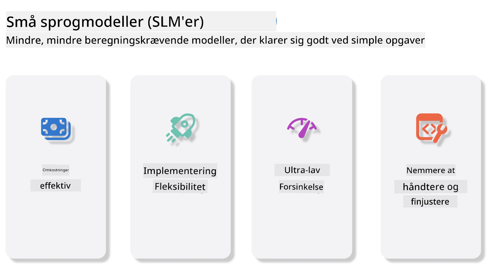
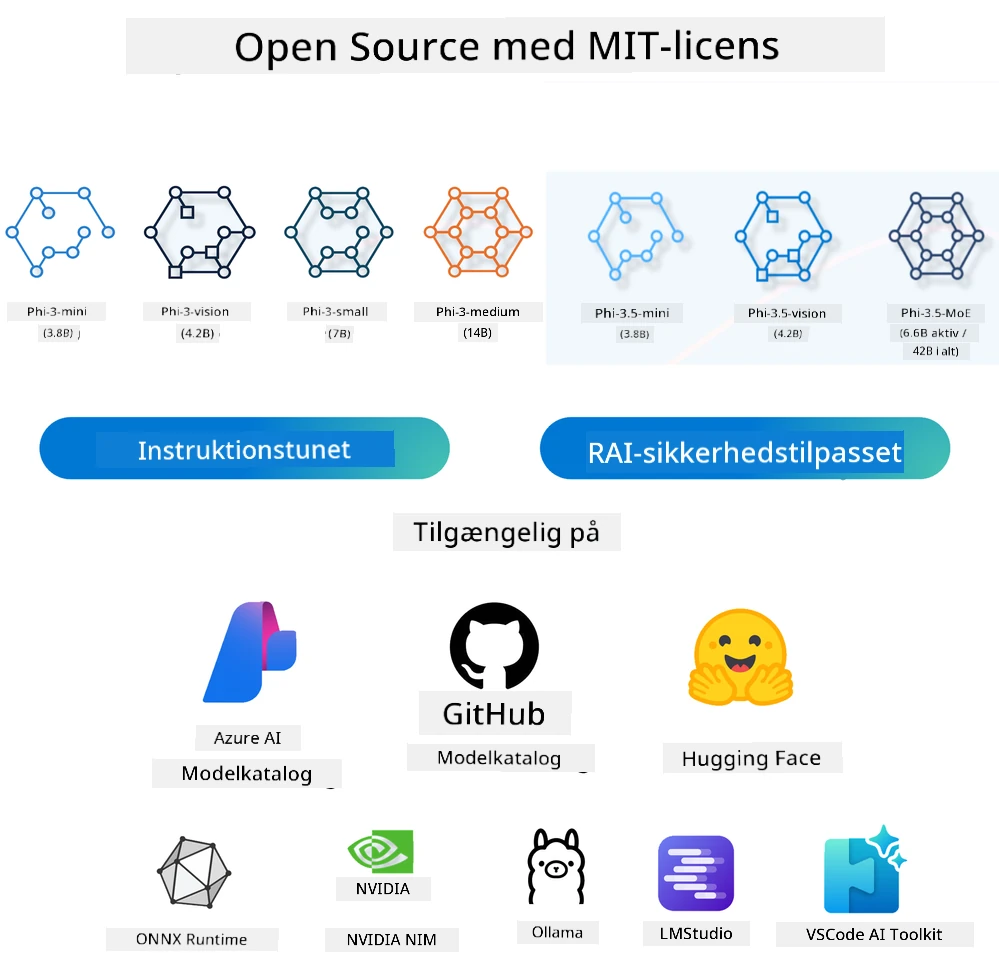
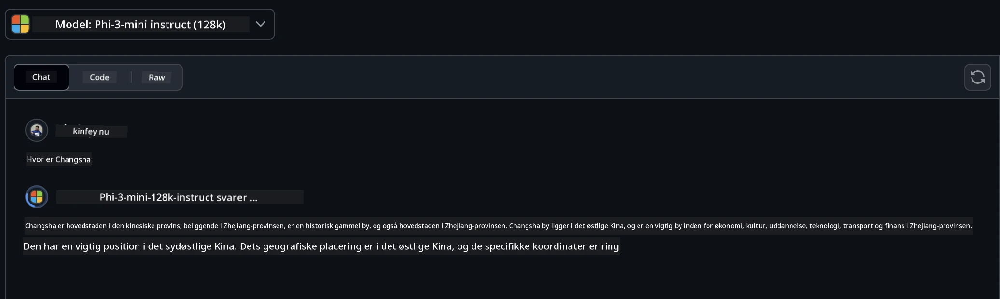
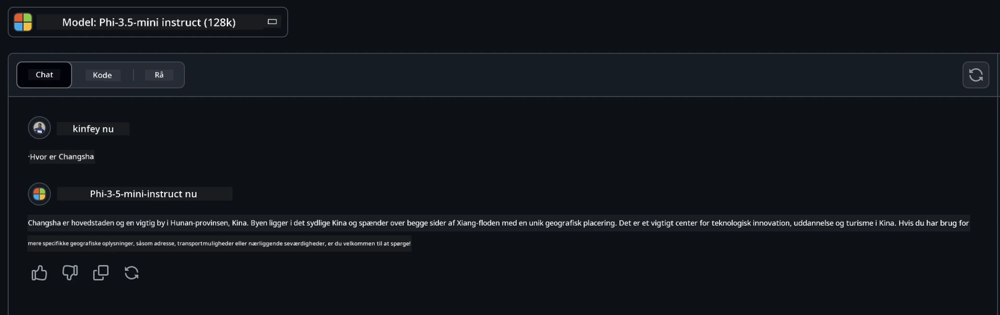

# Introduktion til Små Sprogmodeller for Generativ AI for Begyndere
Generativ AI er et fascinerende felt inden for kunstig intelligens, der fokuserer på at skabe systemer, der er i stand til at generere nyt indhold. Dette indhold kan spænde fra tekst og billeder til musik og endda hele virtuelle miljøer. En af de mest spændende anvendelser af generativ AI er inden for sprogmodeller.

## Hvad er Små Sprogmodeller?

En Lille Sprogmodel (SLM) repræsenterer en nedskaleret variant af en stor sprogmodel (LLM), som udnytter mange af LLM'ernes arkitektoniske principper og teknikker, mens den har et væsentligt reduceret beregningsmæssigt fodaftryk. 

SLM'er er en underkategori af sprogmodeller designet til at generere menneskelignende tekst. I modsætning til deres større modstykker, såsom GPT-4, er SLM'er mere kompakte og effektive, hvilket gør dem ideelle til anvendelser, hvor beregningsressourcer er begrænsede. På trods af deres mindre størrelse kan de stadig udføre en række opgaver. Typisk konstrueres SLM'er ved at komprimere eller destillere LLM'er med det formål at bevare en væsentlig del af den originale models funktionalitet og sproglige evner. Denne reduktion i modelstørrelse mindsker den samlede kompleksitet, hvilket gør SLM'er mere effektive med hensyn til både hukommelsesbrug og beregningskrav. Trods disse optimeringer kan SLM'er stadig udføre en bred vifte af opgaver inden for naturlig sprogbehandling (NLP):

- Tekstgenerering: Skabe sammenhængende og kontekstuelt relevante sætninger eller afsnit.
- Tekstfuldførelse: Forudsige og færdiggøre sætninger baseret på et givent prompt.
- Oversættelse: Omforme tekst fra ét sprog til et andet.
- Resume: Kondensering af lange tekststykker til kortere, mere fordøjelige sammenfatninger.

Dog med visse kompromiser i ydelse eller forståelsens dybde sammenlignet med deres større modstykker. 

## Hvordan Fungerer Små Sprogmodeller?
SLM'er trænes på store mængder tekstdata. Under træningen lærer de sprogets mønstre og strukturer, hvilket gør dem i stand til at generere tekst, der både er grammatisk korrekt og kontekstuelt passende. Træningsprocessen involverer:

- Dataindsamling: Indsamling af store datasæt af tekst fra forskellige kilder.
- Forbehandling: Rensning og organisering af dataene for at gøre dem egnede til træning.
- Træning: Anvendelse af maskinlæringsalgoritmer til at lære modellen at forstå og generere tekst.
- Finjustering: Justering af modellen for at forbedre dens præstation på specifikke opgaver.

Udviklingen af SLM'er stemmer overens med det stigende behov for modeller, der kan implementeres i ressourcebegrænsede miljøer, såsom mobile enheder eller edge computing-platforme, hvor fuldskala LLM'er kan være upraktiske på grund af deres store ressourcekrav. Ved at fokusere på effektivitet balancerer SLM'er ydelse med tilgængelighed og muliggør bredere anvendelse på tværs af forskellige domæner.



## Læringsmål

I denne lektion håber vi at introducere kendskabet til SLM og kombinere det med Microsoft Phi-3 for at lære om forskellige scenarier inden for tekstindhold, syn og MoE.

Ved afslutningen af denne lektion bør du kunne besvare følgende spørgsmål:

- Hvad er SLM?
- Hvad er forskellen mellem SLM og LLM?
- Hvad er Microsoft Phi-3/3.5-familien?
- Hvordan kører man inferens med Microsoft Phi-3/3.5-familien?

Klar? Lad os komme i gang.

## Forskellene mellem Store Sprogmodeller (LLMs) og Små Sprogmodeller (SLMs)

Både LLM'er og SLM'er er bygget på grundlæggende principper for probabilistisk maskinlæring og følger lignende tilgange i deres arkitektoniske design, træningsmetoder, data-genereringsprocesser og modelvurderingsteknikker. Dog adskiller flere nøglefaktorer disse to typer modeller.

## Anvendelser af Små Sprogmodeller

SLM'er har et bredt udvalg af anvendelser, herunder:

- Chatbots: Yde kundesupport og engagere brugere i en samtalemæssig form.
- Indholdsskabelse: Hjælpe forfattere ved at generere idéer eller endda udarbejde hele artikler.
- Uddannelse: Støtte elever med skriveopgaver eller sprogindlæring.
- Tilgængelighed: Skabe værktøjer til personer med handicap, såsom tekst-til-tale-systemer.

**Størrelse**
  
En primær forskel mellem LLM'er og SLM'er ligger i modellernes skala. LLM'er, såsom ChatGPT (GPT-4), kan indeholde anslået 1,76 billioner parametre, hvorimod open source SLM'er som Mistral 7B er designet med væsentligt færre parametre—ca. 7 milliarder. Denne forskel skyldes primært variationer i modelarkitektur og træningsprocesser. For eksempel anvender ChatGPT en selvopmærksomhedsmekanisme inden for en encoder-decoder-ramme, mens Mistral 7B bruger sliding window attention, hvilket muliggør mere effektiv træning i en ren decoder-model. Denne arkitektoniske forskel har dybtgående konsekvenser for modellernes kompleksitet og ydelse.

**Forståelse**

SLM'er optimeres typisk for præstation inden for specifikke domæner, hvilket gør dem meget specialiserede, men potentielt begrænsede i deres evne til at levere bred kontekstuel forståelse på tværs af flere vidensfelter. I modsætning hertil søger LLM'er at simulere menneskelig intelligens på et mere omfattende niveau. Trænet på store, forskellige datasæt er LLM'er designet til at klare sig godt på tværs af mange domæner og tilbyde større alsidighed og tilpasningsevne. Følgelig er LLM'er mere velegnede til en bred vifte af downstream-opgaver som naturlig sprogbehandling og programmering.

**Beregning**

Træning og implementering af LLM'er er ressourcekrævende processer, der ofte kræver betydelig beregningsinfrastruktur, herunder store GPU-klynger. For eksempel kan træning af en model som ChatGPT fra bunden kræve tusindvis af GPU'er over længere perioder. I modsætning hertil er SLM'er, med deres færre parametre, mere tilgængelige med hensyn til beregningsressourcer. Modeller som Mistral 7B kan trænes og køre på lokale maskiner udstyret med moderate GPU-kapaciteter, selvom træningen stadig kan tage flere timer på tværs af flere GPU'er.

**Bias**

Bias er et kendt problem i LLM'er, primært på grund af træningsdataenes karakter. Disse modeller er ofte afhængige af rå, åbent tilgængelige data fra internettet, som kan underrepræsentere eller fejlagtigt repræsentere visse grupper, introducere fejlagtige mærkninger eller afspejle sproglige bias påvirket af dialekter, geografiske variationer og grammatiske regler. Derudover kan LLM'ers komplekse arkitekturer utilsigtet forværre bias, som kan gå ubemærket hen uden omhyggelig finjustering. På den anden side, da SLM'er trænes på mere begrænsede, domænespecifikke datasæt, er de iboende mindre modtagelige for sådanne biases, selvom de ikke er immune.

**Inferens**

Den reducerede størrelse af SLM'er giver dem en betydelig fordel i forhold til inferenshastighed, hvilket gør det muligt for dem effektivt at generere output på lokal hardware uden behov for omfattende parallel behandling. I modsætning hertil kræver LLM'er på grund af deres størrelse og kompleksitet ofte betydelige parallelle beregningsressourcer for at opnå acceptable inferenstider. Tilstedeværelsen af flere samtidige brugere sænker yderligere responstiden for LLM'er, især ved implementering i stor skala.

Sammenfattende deler både LLM'er og SLM'er en grundlæggende basis i maskinlæring, men de adskiller sig markant i modelstørrelse, ressourcekrav, kontekstuel forståelse, modtagelighed for bias og inferenshastighed. Disse forskelle afspejler deres respektive egnethed til forskellige brugstilfælde, hvor LLM'er er mere alsidige, men ressourcekrævende, mens SLM'er tilbyder mere domænespecifik effektivitet med reducerede beregningskrav.

***Bemærk: I denne lektion vil vi introducere SLM ved brug af Microsoft Phi-3 / 3.5 som eksempel.***

## Introduktion til Phi-3 / Phi-3.5-familien

Phi-3 / 3.5-familien sigter hovedsageligt mod tekst-, syns- og Agent (MoE) applikationsscenarier:

### Phi-3 / 3.5 Instruct

Primært til tekstgenerering, chatfuldførelse og indholdsinformationsudtrækning m.m.

**Phi-3-mini**

Den 3,8 milliarder parametre store sprogmodel er tilgængelig på Microsoft Azure AI Studio, Hugging Face og Ollama. Phi-3-modeller overgår markant sprogmodeller af samme og større størrelser på centrale benchmarks (se benchmark-tal nedenfor, højere tal er bedre). Phi-3-mini overgår modeller med dobbelt størrelse, mens Phi-3-small og Phi-3-medium overgår større modeller, herunder GPT-3.5.

**Phi-3-small & medium**

Med blot 7 milliarder parametre slår Phi-3-small GPT-3.5T på en række benchmarks inden for sprog, ræsonnering, kodning og matematik.

Phi-3-medium med 14 milliarder parametre fortsætter denne tendens og overgår Gemini 1.0 Pro.

**Phi-3.5-mini**

Dette kan ses som en opgradering af Phi-3-mini. Mens parametrene forbliver uændrede, forbedres evnen til at understøtte flere sprog (understøtter 20+ sprog: arabisk, kinesisk, tjekkisk, dansk, hollandsk, engelsk, finsk, fransk, tysk, hebraisk, ungarsk, italiensk, japansk, koreansk, norsk, polsk, portugisisk, russisk, spansk, svensk, thai, tyrkisk, ukrainsk) ​​og tilføjer stærkere understøttelse af lange kontekster.

Phi-3.5-mini med 3,8 milliarder parametre overgår sprogmodeller af samme størrelse og er på niveau med modeller dobbelt så store.

### Phi-3 / 3.5 Vision

Instruct-modellen af Phi-3/3.5 kan betragtes som Phis evne til at forstå, og Vision er det, der giver Phi øjne til at forstå verden.

**Phi-3-Vision**

Phi-3-vision, med kun 4,2 milliarder parametre, fortsætter denne tendens og overgår større modeller såsom Claude-3 Haiku og Gemini 1.0 Pro V på generelle visuelle ræsonneringsopgaver, OCR samt forståelse af tabeller og diagrammer.

**Phi-3.5-Vision**

Phi-3.5-Vision er også en opgradering af Phi-3-Vision, og den tilføjer understøttelse af flere billeder. Det kan ses som en forbedring inden for syn, hvor du ikke kun kan se billeder, men også videoer.

Phi-3.5-vision overgår større modeller såsom Claude-3.5 Sonnet og Gemini 1.5 Flash på OCR, tabel- og diagramforståelsesopgaver og er på niveau inden for generel visuel vidensræsonnering. Den understøtter multi-frame input, dvs. ræsonnering på flere inputbilleder.

### Phi-3.5-MoE

***Mixture of Experts (MoE)*** tillader, at modeller kan fortrænes med langt mindre compute, hvilket betyder, at du dramatisk kan skalere model- eller datasætstørrelsen med samme compute-budget som en dens model. Især bør en MoE-model opnå samme kvalitet som dens tætte modstykke meget hurtigere under fortræning.

Phi-3.5-MoE består af 16x3,8B ekspertmoduler. Phi-3.5-MoE med kun 6,6 milliarder aktive parametre opnår et lignende niveau af ræsonnering, sprogforståelse og matematik som langt større modeller.

Vi kan bruge Phi-3/3.5-familien baseret på forskellige scenarier. I modsætning til LLM kan du implementere Phi-3/3.5-mini eller Phi-3/3.5-Vision på edge-enheder.

## Hvordan man bruger Phi-3/3.5-familiemodeller

Vi håber at kunne bruge Phi-3/3.5 i forskellige scenarier. Næste trin vil være at bruge Phi-3/3.5 baseret på forskellige scenarier.



### Inferens via Cloud APIs

**GitHub-modeller**

GitHub Models er den mest direkte måde. Du kan hurtigt få adgang til Phi-3/3.5-Instruct-modellen via GitHub Models. Kombineret med Azure AI Inference SDK / OpenAI SDK kan du tilgå API'en gennem kode for at udføre Phi-3/3.5-Instruct kald. Du kan også teste forskellige effekter via Playground.

- Demo: Sammenligning af effekterne af Phi-3-mini og Phi-3.5-mini i kinesiske scenarier






**Azure AI Studio**

Eller hvis vi ønsker at bruge syns- og MoE-modellerne, kan du bruge Azure AI Studio til at udføre kald. Hvis du er interesseret, kan du læse Phi-3 Cookbook for at lære, hvordan du kalder Phi-3/3.5 Instruct, Vision, MoE gennem Azure AI Studio [Klik på dette link](https://github.com/microsoft/Phi-3CookBook/blob/main/md/02.QuickStart/AzureAIStudio_QuickStart.md?WT.mc_id=academic-105485-koreyst)


**NVIDIA NIM**

Ud over de cloud-baserede Model Catalog-løsninger, som Azure og GitHub tilbyder, kan du også bruge [NVIDIA NIM](https://developer.nvidia.com/nim?WT.mc_id=academic-105485-koreyst) til at fuldføre relaterede kald. Du kan besøge NVIDIA NIM for at udføre API-kald fra Phi-3/3.5-familien. NVIDIA NIM (NVIDIA Inference Microservices) er et sæt accelererede inferens-mikrotjenester designet til at hjælpe udviklere med effektivt at implementere AI-modeller på tværs af forskellige miljøer, herunder cloud, datacentre og arbejdsstationer.

Her er nogle nøglefunktioner ved NVIDIA NIM:
- **Nem udrulning:** NIM tillader udrulning af AI-modeller med en enkelt kommando, hvilket gør det enkelt at integrere i eksisterende arbejdsprocesser.
- **Optimeret ydeevne:** Det udnytter NVIDIA’s forudoptimerede inferensmotorer, såsom TensorRT og TensorRT-LLM, for at sikre lav latenstid og høj gennemløbshastighed.
- **Skalerbarhed:** NIM understøtter autoskalering på Kubernetes, hvilket gør det muligt at håndtere varierede arbejdsbelastninger effektivt.
- **Sikkerhed og kontrol:** Organisationer kan bevare kontrollen over deres data og applikationer ved at selvhoste NIM-mikrotjenester på deres egen administrerede infrastruktur.
- **Standard-API'er:** NIM leverer branche-standard API'er, hvilket gør det nemt at bygge og integrere AI-applikationer som chatbots, AI-assistenter og mere.

NIM er en del af NVIDIA AI Enterprise, som har til formål at forenkle udrulning og operationel anvendelse af AI-modeller og sikre, at de kører effektivt på NVIDIA GPU'er.

- Demo: Brug af NVIDIA NIM til at kalde Phi-3.5-Vision-API [[Klik på dette link](./python/Phi-3-Vision-Nividia-NIM.ipynb?WT.mc_id=academic-105485-koreyst)]


### Kør Phi-3/3.5 lokalt
Inferens i relation til Phi-3, eller enhver sprogmodel som GPT-3, henviser til processen med at generere svar eller forudsigelser baseret på den input, den modtager. Når du giver en prompt eller et spørgsmål til Phi-3, bruger den sit trænede neurale netværk til at udlede det mest sandsynlige og relevante svar ved at analysere mønstre og relationer i de data, den er trænet på.

**Hugging Face Transformer**
Hugging Face Transformers er et kraftfuldt bibliotek designet til naturlig sprogbehandling (NLP) og andre maskinlæringsopgaver. Her er nogle nøglepunkter om det:

1. **Fortrænede modeller:** Det tilbyder tusindvis af fortrænede modeller, som kan bruges til forskellige opgaver som tekstklassificering, navngiven enhedsgenkendelse, spørgsmålssvar, opsummering, oversættelse og tekstgenerering.

2. **Framework-interoperabilitet:** Biblioteket understøtter flere dybdelæringsframeworks, herunder PyTorch, TensorFlow og JAX. Dette gør det muligt at træne en model i ét framework og bruge den i et andet.

3. **Multimodale evner:** Udover NLP understøtter Hugging Face Transformers også opgaver inden for computer vision (f.eks. billedklassificering, objektgenkendelse) og lydbehandling (f.eks. talegenkendelse, lydklassificering).

4. **Brugervenlighed:** Biblioteket tilbyder API'er og værktøjer til nemt at downloade og finjustere modeller, hvilket gør det tilgængeligt for både begyndere og eksperter.

5. **Fællesskab og ressourcer:** Hugging Face har et levende fællesskab og omfattende dokumentation, tutorials og vejledninger, der hjælper brugere med at komme i gang og få mest muligt ud af biblioteket.
[officiel dokumentation](https://huggingface.co/docs/transformers/index?WT.mc_id=academic-105485-koreyst) eller deres [GitHub-arkiv](https://github.com/huggingface/transformers?WT.mc_id=academic-105485-koreyst).

Dette er den mest anvendte metode, men den kræver også GPU-acceleration. Scenarier som Vision og MoE kræver nemlig mange beregninger, som vil være meget langsomme på CPU, hvis de ikke er kvantiserede.


- Demo: Brug af Transformer til at kalde Phi-3.5-Instruct [Klik på dette link](./python/phi35-instruct-demo.ipynb?WT.mc_id=academic-105485-koreyst)

- Demo: Brug af Transformer til at kalde Phi-3.5-Vision [Klik på dette link](./python/phi35-vision-demo.ipynb?WT.mc_id=academic-105485-koreyst)

- Demo: Brug af Transformer til at kalde Phi-3.5-MoE [Klik på dette link](./python/phi35_moe_demo.ipynb?WT.mc_id=academic-105485-koreyst)

**Ollama**
[Ollama](https://ollama.com/?WT.mc_id=academic-105485-koreyst) er en platform designet til at gøre det lettere at køre store sprogmodeller (LLM'er) lokalt på din maskine. Den understøtter forskellige modeller som Llama 3.1, Phi 3, Mistral og Gemma 2 blandt andre. Platformen forenkler processen ved at samle modelvægte, konfiguration og data i en enkelt pakke, hvilket gør det mere tilgængeligt for brugere at tilpasse og skabe deres egne modeller. Ollama er tilgængelig for macOS, Linux og Windows. Det er et glimrende værktøj, hvis du ønsker at eksperimentere med eller udrulle LLM'er uden at være afhængig af cloud-tjenester. Ollama er den mest direkte metode, du skal bare køre følgende kommando.


```bash

ollama run phi3.5

```


**ONNX Runtime til GenAI**

[ONNX Runtime](https://github.com/microsoft/onnxruntime-genai?WT.mc_id=academic-105485-koreyst) er en tværplatform maskinlæringsaccelerator til inferens og træning. ONNX Runtime for Generative AI (GENAI) er et kraftfuldt værktøj, der hjælper dig med at køre generative AI-modeller effektivt på tværs af forskellige platforme.

## Hvad er ONNX Runtime?
ONNX Runtime er et open source-projekt, der muliggør højt ydende inferens af maskinlæringsmodeller. Det understøtter modeller i Open Neural Network Exchange (ONNX) formatet, som er en standard til repræsentation af maskinlæringsmodeller. ONNX Runtime-inferens kan muliggøre hurtigere kundeoplevelser og lavere omkostninger, med support til modeller fra dybdelæringsframeworks som PyTorch og TensorFlow/Keras samt klassiske maskinlæringsbiblioteker som scikit-learn, LightGBM, XGBoost osv. ONNX Runtime er kompatibel med forskelligt hardware, drivere og operativsystemer, og leverer optimal ydeevne ved at udnytte hardwareacceleratorer, hvor det er relevant, sammen med grafoptimeringer og transformationer.

## Hvad er Generative AI?
Generative AI refererer til AI-systemer, der kan generere nyt indhold, såsom tekst, billeder eller musik, baseret på de data, de er trænet på. Eksempler inkluderer sprogmodeller som GPT-3 og billedgenereringsmodeller som Stable Diffusion. ONNX Runtime for GenAI biblioteket tilbyder den generative AI-loop til ONNX-modeller, inklusive inferens med ONNX Runtime, logits-behandling, søgning og sampling samt KV-cache håndtering.

## ONNX Runtime for GENAI
ONNX Runtime for GENAI udvider ONNX Runtimes kapaciteter til at understøtte generative AI-modeller. Her er nogle nøglefunktioner:

- **Bred platformssupport:** Det fungerer på forskellige platforme, herunder Windows, Linux, macOS, Android og iOS.
- **Modelsupport:** Det understøtter mange populære generative AI-modeller som LLaMA, GPT-Neo, BLOOM og flere.
- **Ydeevneoptimering:** Det inkluderer optimeringer til forskelligt hardwareacceleratorer som NVIDIA GPU'er, AMD GPU'er og mere2.
- **Brugervenlighed:** Det tilbyder API'er til nem integration i applikationer, så du kan generere tekst, billeder og andet indhold med minimal kode.
- Brugere kan kalde en høj-niveau generate()-metode, eller køre hver iteration af modellen i en løkke, hvor den genererer ét token ad gangen, og eventuelt opdatere genereringsparametre inde i løkken.
- ONNX runtime understøtter også greedy/beam search og TopP, TopK sampling til at generere token-sekvenser samt indbygget logits-behandling som repetitionsstraf. Du kan også nemt tilføje brugerdefineret scoring.

## Kom godt i gang
For at komme i gang med ONNX Runtime for GENAI kan du følge disse trin:

### Installer ONNX Runtime:
```Python
pip install onnxruntime
```
### Installer Generative AI-udvidelserne:
```Python
pip install onnxruntime-genai
```

### Kør en model: Her er et simpelt eksempel i Python:
```Python
import onnxruntime_genai as og

model = og.Model('path_to_your_model.onnx')

tokenizer = og.Tokenizer(model)

input_text = "Hello, how are you?"

input_tokens = tokenizer.encode(input_text)

output_tokens = model.generate(input_tokens)

output_text = tokenizer.decode(output_tokens)

print(output_text) 
```
### Demo: Brug af ONNX Runtime GenAI til at kalde Phi-3.5-Vision


```python

import onnxruntime_genai as og

model_path = './Your Phi-3.5-vision-instruct ONNX Path'

img_path = './Your Image Path'

model = og.Model(model_path)

processor = model.create_multimodal_processor()

tokenizer_stream = processor.create_stream()

text = "Your Prompt"

prompt = "<|user|>\n"

prompt += "<|image_1|>\n"

prompt += f"{text}<|end|>\n"

prompt += "<|assistant|>\n"

image = og.Images.open(img_path)

inputs = processor(prompt, images=image)

params = og.GeneratorParams(model)

params.set_inputs(inputs)

params.set_search_options(max_length=3072)

generator = og.Generator(model, params)

while not generator.is_done():

    generator.compute_logits()
    
    generator.generate_next_token()

    new_token = generator.get_next_tokens()[0]
    
    output = tokenizer_stream.decode(new_token)
    
    print(tokenizer_stream.decode(new_token), end='', flush=True)

```


**Andre**

Udover ONNX Runtime og Ollama-referencemetoderne kan vi også udfylde referencen for kvantitative modeller baseret på modelreferencemetoder leveret af forskellige producenter. Såsom Apple MLX framework med Apple Metal, Qualcomm QNN med NPU, Intel OpenVINO med CPU/GPU osv. Du kan også få mere indhold fra [Phi-3 Cookbook](https://github.com/microsoft/phi-3cookbook?WT.mc_id=academic-105485-koreyst)


## Mere

Vi har lært det grundlæggende om Phi-3/3.5 familien, men for at lære mere om SLM har vi brug for mere viden. Du kan finde svarene i Phi-3 Cookbook. Hvis du vil lære mere, besøg venligst [Phi-3 Cookbook](https://github.com/microsoft/phi-3cookbook?WT.mc_id=academic-105485-koreyst).

---

<!-- CO-OP TRANSLATOR DISCLAIMER START -->
**Ansvarsfraskrivelse**:  
Dette dokument er blevet oversat ved hjælp af AI-oversættelsestjenesten [Co-op Translator](https://github.com/Azure/co-op-translator). Selvom vi stræber efter nøjagtighed, bedes du være opmærksom på, at automatiske oversættelser kan indeholde fejl eller unøjagtigheder. Det oprindelige dokument på dets oprindelige sprog bør betragtes som den autoritative kilde. For kritisk information anbefales professionel menneskelig oversættelse. Vi påtager os intet ansvar for misforståelser eller fejltolkninger, der opstår som følge af brugen af denne oversættelse.
<!-- CO-OP TRANSLATOR DISCLAIMER END -->