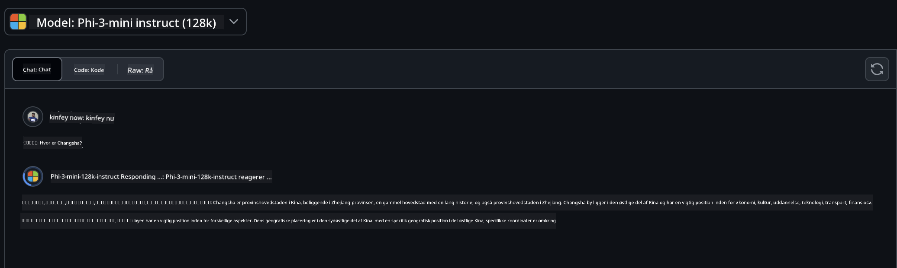
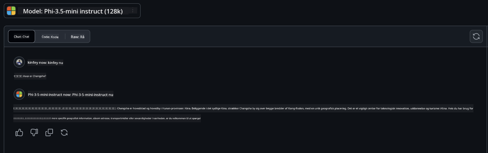

<!--
CO_OP_TRANSLATOR_METADATA:
{
  "original_hash": "124ad36cfe96f74038811b6e2bb93e9d",
  "translation_date": "2025-06-26T02:24:40+00:00",
  "source_file": "19-slm/README.md",
  "language_code": "da"
}
-->

Modeller er den mest direkte måde. Du kan hurtigt få adgang til Phi-3/3.5-Instruct-modellen gennem GitHub Modeller. Kombineret med Azure AI Inference SDK / OpenAI SDK kan du få adgang til API'en gennem kode for at fuldføre Phi-3/3.5-Instruct-kaldet. Du kan også teste forskellige effekter gennem Playground. - Demo: Sammenligning af effekterne af Phi-3-mini og Phi-3.5-mini i kinesiske scenarier   **Azure AI Studio** Eller hvis vi ønsker at bruge vision- og MoE-modellerne, kan du bruge Azure AI Studio til at fuldføre kaldet. Hvis du er interesseret, kan du læse Phi-3 Cookbook for at lære, hvordan du kalder Phi-3/3.5 Instruct, Vision, MoE gennem Azure AI Studio [Klik på dette link](https://github.com/microsoft/Phi-3CookBook/blob/main/md/02.QuickStart/AzureAIStudio_QuickStart.md?WT.mc_id=academic-105485-koreyst) **NVIDIA NIM** Ud over de cloud-baserede Model Catalog-løsninger, der leveres af Azure og GitHub, kan du også bruge [Nivida NIM](https://developer.nvidia.com/nim?WT.mc_id=academic-105485-koreyst) til at fuldføre relaterede kald. Du kan besøge NIVIDA NIM for at fuldføre API-kald til Phi-3/3.5 Family. NVIDIA NIM (NVIDIA Inference Microservices) er et sæt accelererede inferencemikrotjenester designet til at hjælpe udviklere med effektivt at implementere AI-modeller på tværs af forskellige miljøer, herunder skyer, datacentre og arbejdsstationer. Her er nogle nøglefunktioner ved NVIDIA NIM: - **Lethed ved implementering:** NIM tillader implementering af AI-modeller med en enkelt kommando, hvilket gør det nemt at integrere i eksisterende arbejdsgange. - **Optimeret ydeevne:** Det udnytter NVIDIAs forudoptimerede inferencemotorer, såsom TensorRT og TensorRT-LLM, for at sikre lav latenstid og høj gennemstrømning. - **Skalerbarhed:** NIM understøtter autoskalering på Kubernetes, hvilket gør det i stand til effektivt at håndtere varierende arbejdsbelastninger. - **Sikkerhed og kontrol:** Organisationer kan opretholde kontrol over deres data og applikationer ved at selvhoste NIM-mikrotjenester på deres egen administrerede infrastruktur. - **Standard-API'er:** NIM leverer industristandard-API'er, hvilket gør det nemt at bygge og integrere AI-applikationer som chatbots, AI-assistenter og mere. NIM er en del af NVIDIA AI Enterprise, der har til formål at forenkle implementeringen og operationen af AI-modeller, hvilket sikrer, at de kører effektivt på NVIDIA GPU'er. - Demo: Brug af Nividia NIM til at kalde Phi-3.5-Vision-API [[Klik på dette link](../../../19-slm/python/Phi-3-Vision-Nividia-NIM.ipynb)] ### Inferens Phi-3/3.5 i lokal miljø Inferens i forhold til Phi-3, eller enhver sprogmodel som GPT-3, refererer til processen med at generere svar eller forudsigelser baseret på den input, den modtager. Når du giver en prompt eller et spørgsmål til Phi-3, bruger den sit trænede neurale netværk til at udlede det mest sandsynlige og relevante svar ved at analysere mønstre og relationer i de data, den blev trænet på. **Hugging Face Transformer** Hugging Face Transformers er et kraftfuldt bibliotek designet til naturlig sprogbehandling (NLP) og andre maskinlæringsopgaver. Her er nogle nøglepunkter om det: 1. **Forudtrænede modeller**: Det leverer tusindvis af forudtrænede modeller, der kan bruges til forskellige opgaver såsom tekstklassifikation, navngiven enhedsgenkendelse, spørgsmål-svar, opsummering, oversættelse og tekstgenerering. 2. **Rammeinteroperabilitet**: Biblioteket understøtter flere dyb læringsrammer, herunder PyTorch, TensorFlow og JAX. Dette giver dig mulighed for at træne en model i en ramme og bruge den i en anden. 3. **Multimodale kapaciteter**: Udover NLP understøtter Hugging Face Transformers også opgaver inden for computer vision (f.eks. billedklassifikation, objektdetektion) og lydbehandling (f.eks. talegenkendelse, lydklassifikation). 4. **Lethed ved brug**: Biblioteket tilbyder API'er og værktøjer til nemt at downloade og finjustere modeller, hvilket gør det tilgængeligt for både begyndere og eksperter. 5. **Fællesskab og ressourcer**: Hugging Face har et levende fællesskab og omfattende dokumentation, tutorials og vejledninger til at hjælpe brugere med at komme i gang og få mest muligt ud af biblioteket. [officiel dokumentation](https://huggingface.co/docs/transformers/index?WT.mc_id=academic-105485-koreyst) eller deres [GitHub-repository](https://github.com/huggingface/transformers?WT.mc_id=academic-105485-koreyst). Dette er den mest almindeligt anvendte metode, men det kræver også GPU-acceleration. Trods alt kræver scener som Vision og MoE mange beregninger, som vil være meget begrænsede i CPU'en, hvis de ikke er kvantificerede. - Demo: Brug af Transformer til at kalde Phi-3.5-Instuct [Klik på dette link](../../../19-slm/python/phi35-instruct-demo.ipynb) - Demo: Brug af Transformer til at kalde Phi-3.5-Vision[Klik på dette link](../../../19-slm/python/phi35-vision-demo.ipynb) - Demo: Brug af Transformer til at kalde Phi-3.5-MoE[Klik på dette link](../../../19-slm/python/phi35_moe_demo.ipynb) **Ollama** [Ollama](https://ollama.com/?WT.mc_id=academic-105485-koreyst) er en platform designet til at gøre det nemmere at køre store sprogmodeller (LLM'er) lokalt på din maskine. Det understøtter forskellige modeller som Llama 3.1, Phi 3, Mistral og Gemma 2, blandt andre. Platformen forenkler processen ved at pakke modelvægte, konfiguration og data i en enkelt pakke, hvilket gør det mere tilgængeligt for brugere at tilpasse og skabe deres egne modeller. Ollama er tilgængelig for macOS, Linux og Windows. Det er et godt værktøj, hvis du ønsker at eksperimentere med eller implementere LLM'er uden at stole på cloud-tjenester. Ollama er den mest direkte måde, du behøver kun at udføre følgende erklæring. ```bash

ollama run phi3.5

``` **ONNX Runtime for GenAI** [ONNX Runtime](https://github.com/microsoft/onnxruntime-genai?WT.mc_id=academic-105485-koreyst) er en tværplatforms inferens- og træningsmaskinlæringsaccelerator. ONNX Runtime for Generative AI (GENAI) er et kraftfuldt værktøj, der hjælper dig med at køre generative AI-modeller effektivt på tværs af forskellige platforme. ## Hvad er ONNX Runtime? ONNX Runtime er et open-source-projekt, der muliggør højtydende inferens af maskinlæringsmodeller. Det understøtter modeller i Open Neural Network Exchange (ONNX)-formatet, som er en standard til repræsentation af maskinlæringsmodeller.ONNX Runtime inferens kan muliggøre hurtigere kundeoplevelser og lavere omkostninger, understøtte modeller fra dyb læringsrammer som PyTorch og TensorFlow/Keras samt klassiske maskinlæringsbiblioteker som scikit-learn, LightGBM, XGBoost osv. ONNX Runtime er kompatibel med forskelligt hardware, drivere og operativsystemer og leverer optimal ydeevne ved at udnytte hardwareacceleratorer, hvor det er relevant, sammen med grafoptimeringer og transformationer ## Hvad er Generative AI? Generative AI refererer til AI-systemer, der kan generere nyt indhold, såsom tekst, billeder eller musik, baseret på de data, de er blevet trænet på. Eksempler inkluderer sprogmodeller som GPT-3 og billedgenereringsmodeller som Stable Diffusion. ONNX Runtime for GenAI-biblioteket leverer den generative AI-loop for ONNX-modeller, herunder inferens med ONNX Runtime, logits-behandling, søgning og sampling og KV-cache-administration. ## ONNX Runtime for GENAI ONNX Runtime for GENAI udvider kapaciteterne af ONNX Runtime til at understøtte generative AI-modeller. Her er nogle nøglefunktioner: - **Bred platformunderstøttelse:** Det fungerer på forskellige platforme, herunder Windows, Linux, macOS, Android og iOS. - **Modelunderstøttelse:** Det understøtter mange populære generative AI-modeller, såsom LLaMA, GPT-Neo, BLOOM og mere. - **Ydelsesoptimering:** Det inkluderer optimeringer for forskellige hardwareacceleratorer som NVIDIA GPU'er, AMD GPU'er og mere2. - **Lethed ved brug:** Det leverer API'er til nem integration i applikationer, hvilket giver dig mulighed for at generere tekst, billeder og andet indhold med minimal kode - Brugere kan kalde en høj niveau generate()-metode eller køre hver iteration af modellen i en loop, generere en token ad gangen og valgfrit opdatere generationsparametre inde i loopen. - ONNX runtime har også understøttelse af grådig/bjælkesøgning og TopP, TopK-sampling til at generere token-sekvenser og indbygget logits-behandling som gentagelsesstraffe. Du kan også nemt tilføje brugerdefineret scoring. ## Kom godt i gang For at komme i gang med ONNX Runtime for GENAI kan du følge disse trin: ### Installer ONNX Runtime: ```Python
pip install onnxruntime
``` ### Installer de generative AI-udvidelser: ```Python
pip install onnxruntime-genai
``` ### Kør en model: Her er et simpelt eksempel i Python: ```Python
import onnxruntime_genai as og

model = og.Model('path_to_your_model.onnx')

tokenizer = og.Tokenizer(model)

input_text = "Hello, how are you?"

input_tokens = tokenizer.encode(input_text)

output_tokens = model.generate(input_tokens)

output_text = tokenizer.decode(output_tokens)

print(output_text) 
``` ### Demo: Brug af ONNX Runtime GenAI til at kalde Phi-3.5-Vision ```python

import onnxruntime_genai as og

model_path = './Your Phi-3.5-vision-instruct ONNX Path'

img_path = './Your Image Path'

model = og.Model(model_path)

processor = model.create_multimodal_processor()

tokenizer_stream = processor.create_stream()

text = "Your Prompt"

prompt = "<|user|>\n"

prompt += "<|image_1|>\n"

prompt += f"{text}<|end|>\n"

prompt += "<|assistant|>\n"

image = og.Images.open(img_path)

inputs = processor(prompt, images=image)

params = og.GeneratorParams(model)

params.set_inputs(inputs)

params.set_search_options(max_length=3072)

generator = og.Generator(model, params)

while not generator.is_done():

    generator.compute_logits()
    
    generator.generate_next_token()

    new_token = generator.get_next_tokens()[0]
    
    code += tokenizer_stream.decode(new_token)
    
    print(tokenizer_stream.decode(new_token), end='', flush=True)

``` **Andre** Ud over ONNX Runtime og Ollama-referencemetoderne kan vi også fuldføre referencen af kvantitative modeller baseret på modelreferencemetoderne leveret af forskellige producenter. Såsom Apple MLX-rammen med Apple Metal, Qualcomm QNN med NPU, Intel OpenVINO med CPU/GPU osv. Du kan også få mere indhold fra [Phi-3 Cookbook](https://github.com/microsoft/phi-3cookbook?WT.mc_id=academic-105485-koreyst) ## Mere Vi har lært det grundlæggende om Phi-3/3.5 Family, men for at lære mere om SLM har vi brug for mere viden. Du kan finde svarene i Phi-3 Cookbook. Hvis du vil lære mere, besøg venligst [Phi-3 Cookbook](https://github.com/microsoft/phi-3cookbook?WT.mc_id=academic-105485-koreyst).

**Ansvarsfraskrivelse**:  
Dette dokument er blevet oversat ved hjælp af AI-oversættelsestjenesten [Co-op Translator](https://github.com/Azure/co-op-translator). Selvom vi bestræber os på nøjagtighed, skal du være opmærksom på, at automatiserede oversættelser kan indeholde fejl eller unøjagtigheder. Det originale dokument på dets oprindelige sprog bør betragtes som den autoritative kilde. For kritisk information anbefales professionel menneskelig oversættelse. Vi er ikke ansvarlige for eventuelle misforståelser eller fejltolkninger som følge af brugen af denne oversættelse.