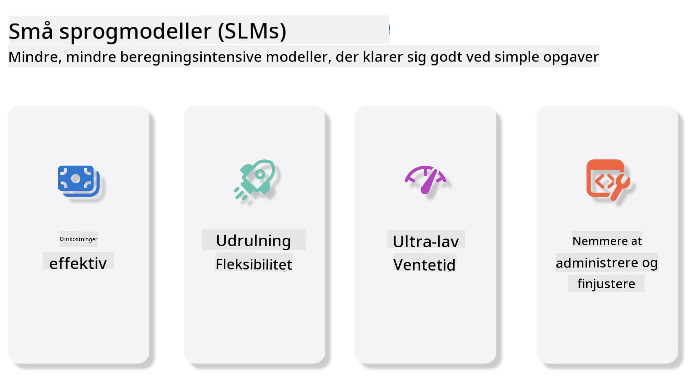
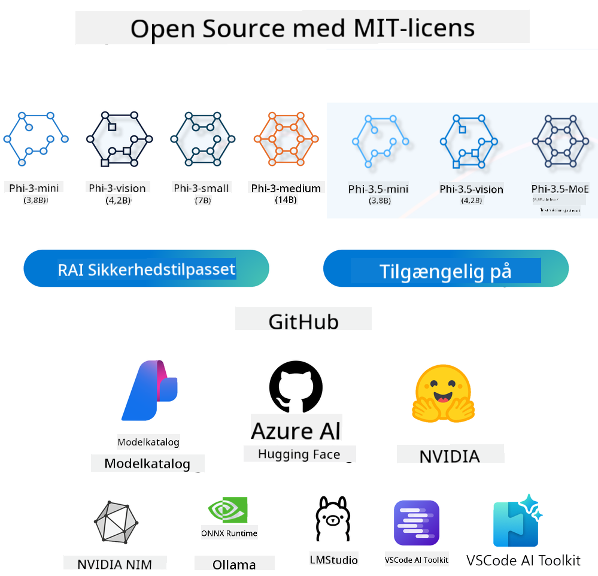
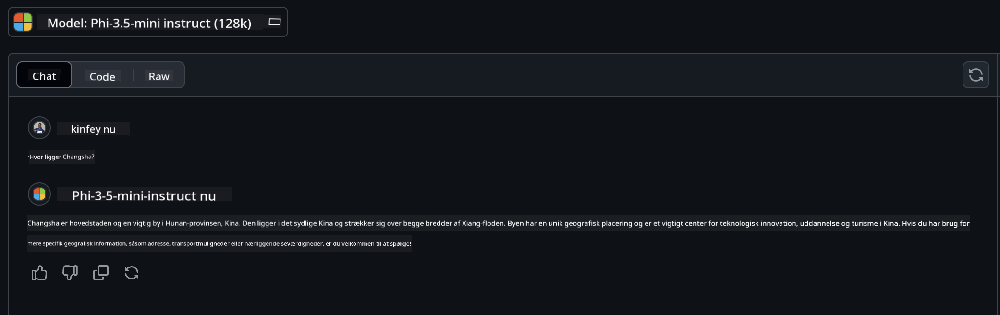

<!--
CO_OP_TRANSLATOR_METADATA:
{
  "original_hash": "124ad36cfe96f74038811b6e2bb93e9d",
  "translation_date": "2025-07-09T18:37:11+00:00",
  "source_file": "19-slm/README.md",
  "language_code": "da"
}
-->
# Introduktion til Små Sprogmodeller for Generativ AI for Begyndere  
Generativ AI er et fascinerende område inden for kunstig intelligens, der fokuserer på at skabe systemer, som kan generere nyt indhold. Dette indhold kan spænde fra tekst og billeder til musik og endda hele virtuelle miljøer. En af de mest spændende anvendelser af generativ AI er inden for sprogmodeller.

## Hvad er Små Sprogmodeller?  

En Small Language Model (SLM) er en nedskaleret version af en stor sprogmodel (LLM), som benytter mange af de samme arkitektoniske principper og teknikker som LLM’er, men med et betydeligt mindre beregningsmæssigt fodaftryk.  

SLM’er er en underkategori af sprogmodeller designet til at generere menneskelignende tekst. I modsætning til deres større modstykker, som GPT-4, er SLM’er mere kompakte og effektive, hvilket gør dem ideelle til anvendelser, hvor ressourcerne er begrænsede. På trods af deres mindre størrelse kan de stadig udføre en række opgaver. Typisk konstrueres SLM’er ved at komprimere eller destillere LLM’er med det formål at bevare en stor del af den oprindelige models funktionalitet og sproglige evner. Denne reduktion i modelstørrelse mindsker den samlede kompleksitet, hvilket gør SLM’er mere effektive både med hensyn til hukommelsesforbrug og beregningskrav. På trods af disse optimeringer kan SLM’er stadig udføre mange forskellige opgaver inden for naturlig sprogbehandling (NLP):

- Tekstgenerering: Skabe sammenhængende og kontekstuelt relevante sætninger eller afsnit.  
- Tekstfuldførelse: Forudsige og fuldføre sætninger baseret på en given prompt.  
- Oversættelse: Omforme tekst fra ét sprog til et andet.  
- Opsummering: Forkorte lange tekster til kortere, mere overskuelige resuméer.  

Dog med visse kompromiser i ydeevne eller dybde af forståelse sammenlignet med deres større modstykker.

## Hvordan fungerer Små Sprogmodeller?  
SLM’er trænes på enorme mængder tekstdata. Under træningen lærer de sprogets mønstre og strukturer, hvilket gør dem i stand til at generere tekst, der både er grammatisk korrekt og kontekstuelt passende. Træningsprocessen involverer:

- Dataindsamling: Indsamling af store tekstdatasæt fra forskellige kilder.  
- Forbehandling: Rensning og organisering af data for at gøre det egnet til træning.  
- Træning: Brug af maskinlæringsalgoritmer til at lære modellen at forstå og generere tekst.  
- Finjustering: Justering af modellen for at forbedre dens præstation på specifikke opgaver.  

Udviklingen af SLM’er matcher det stigende behov for modeller, der kan implementeres i miljøer med begrænsede ressourcer, såsom mobile enheder eller edge computing-platforme, hvor fuldskala LLM’er kan være upraktiske på grund af deres store ressourceforbrug. Ved at fokusere på effektivitet balancerer SLM’er ydeevne med tilgængelighed, hvilket muliggør bredere anvendelse på tværs af forskellige domæner.



## Læringsmål  

I denne lektion håber vi at introducere viden om SLM og kombinere det med Microsoft Phi-3 for at lære om forskellige scenarier inden for tekstindhold, vision og MoE.

Ved slutningen af denne lektion bør du kunne besvare følgende spørgsmål:

- Hvad er SLM  
- Hvad er forskellen på SLM og LLM  
- Hvad er Microsoft Phi-3/3.5-familien  
- Hvordan foretages inferens med Microsoft Phi-3/3.5-familien  

Klar? Lad os komme i gang.

## Forskellene mellem Store Sprogmodeller (LLMs) og Små Sprogmodeller (SLMs)  

Både LLM’er og SLM’er bygger på grundlæggende principper inden for probabilistisk maskinlæring og følger lignende tilgange i deres arkitektur, træningsmetoder, data-genereringsprocesser og modelvurderingsteknikker. Dog adskiller flere nøglefaktorer disse to typer modeller.

## Anvendelser af Små Sprogmodeller  

SLM’er har et bredt anvendelsesområde, herunder:

- Chatbots: Yde kundesupport og engagere brugere i samtaler.  
- Indholdsskabelse: Hjælpe forfattere med at generere idéer eller endda skrive hele artikler.  
- Uddannelse: Assistere elever med skriveopgaver eller sprogindlæring.  
- Tilgængelighed: Skabe værktøjer til personer med handicap, såsom tekst-til-tale-systemer.  

**Størrelse**  

En væsentlig forskel mellem LLM’er og SLM’er ligger i modellernes skala. LLM’er som ChatGPT (GPT-4) kan have omkring 1,76 billioner parametre, mens open source SLM’er som Mistral 7B er designet med betydeligt færre parametre – cirka 7 milliarder. Denne forskel skyldes primært variationer i modelarkitektur og træningsprocesser. For eksempel anvender ChatGPT en selvopmærksomhedsmekanisme inden for en encoder-decoder-ramme, mens Mistral 7B bruger sliding window attention, hvilket muliggør mere effektiv træning i en decoder-only model. Denne arkitektoniske forskel har stor betydning for modellernes kompleksitet og ydeevne.

**Forståelse**  

SLM’er er typisk optimeret til ydeevne inden for specifikke domæner, hvilket gør dem meget specialiserede, men potentielt begrænsede i deres evne til at give bred kontekstuel forståelse på tværs af flere vidensområder. LLM’er derimod sigter mod at simulere menneskelig intelligens på et mere omfattende niveau. Trænet på enorme, varierede datasæt er LLM’er designet til at klare sig godt på tværs af mange domæner, hvilket giver større alsidighed og tilpasningsevne. Derfor er LLM’er mere velegnede til et bredere udvalg af efterfølgende opgaver, såsom naturlig sprogbehandling og programmering.

**Beregning**  

Træning og implementering af LLM’er er ressourcekrævende processer, som ofte kræver betydelig beregningsinfrastruktur, herunder store GPU-klynger. For eksempel kan træning af en model som ChatGPT fra bunden kræve tusindvis af GPU’er over længere tid. SLM’er, med deres færre parametre, er derimod mere tilgængelige med hensyn til beregningsressourcer. Modeller som Mistral 7B kan trænes og køres på lokale maskiner med moderate GPU-kapaciteter, selvom træningen stadig kræver flere timer på tværs af flere GPU’er.

**Bias**  

Bias er et kendt problem i LLM’er, primært på grund af træningsdataenes natur. Disse modeller baserer sig ofte på rå, offentligt tilgængelige data fra internettet, som kan underrepræsentere eller fejlagtigt repræsentere visse grupper, indeholde fejlagtig mærkning eller afspejle sproglige bias påvirket af dialekter, geografiske variationer og grammatiske regler. Derudover kan den komplekse arkitektur i LLM’er utilsigtet forstærke bias, som kan gå ubemærket hen uden omhyggelig finjustering. SLM’er, derimod, trænes ofte på mere begrænsede, domænespecifikke datasæt og er derfor mindre modtagelige for sådanne bias, selvom de ikke er immune.

**Inferens**  

Den reducerede størrelse af SLM’er giver dem en betydelig fordel i inferenshastighed, hvilket gør det muligt at generere output effektivt på lokal hardware uden behov for omfattende parallel behandling. LLM’er kræver derimod ofte store parallelle beregningsressourcer for at opnå acceptable inferenstider på grund af deres størrelse og kompleksitet. Flere samtidige brugere kan yderligere sænke LLM’ers svartider, især ved storskala implementering.

Sammenfattende, selvom både LLM’er og SLM’er deler en grundlæggende maskinlæringsmæssig basis, adskiller de sig markant i modelstørrelse, ressourcebehov, kontekstuel forståelse, modtagelighed for bias og inferenshastighed. Disse forskelle afspejler deres respektive egnethed til forskellige anvendelsestilfælde, hvor LLM’er er mere alsidige, men ressourcekrævende, mens SLM’er tilbyder mere domænespecifik effektivitet med lavere beregningskrav.

***Note：I dette kapitel vil vi introducere SLM ved hjælp af Microsoft Phi-3 / 3.5 som eksempel.***

## Introduktion til Phi-3 / Phi-3.5-familien  

Phi-3 / 3.5-familien retter sig primært mod tekst-, vision- og Agent (MoE) applikationsscenarier:

### Phi-3 / 3.5 Instruct  

Hovedsageligt til tekstgenerering, chatfuldførelse og indholdsinformationsudtrækning mv.

**Phi-3-mini**  

Den 3,8 milliarder parametre store sprogmodel er tilgængelig på Microsoft Azure AI Studio, Hugging Face og Ollama. Phi-3-modeller overgår markant sprogmodeller af samme og større størrelse på nøglebenchmarks (se benchmarktal nedenfor, højere tal er bedre). Phi-3-mini overgår modeller, der er dobbelt så store, mens Phi-3-small og Phi-3-medium overgår større modeller, inklusive GPT-3.5.

**Phi-3-small & medium**  

Med blot 7 milliarder parametre slår Phi-3-small GPT-3.5T på en række benchmarks inden for sprog, ræsonnering, kodning og matematik.

Phi-3-medium med 14 milliarder parametre fortsætter denne tendens og overgår Gemini 1.0 Pro.

**Phi-3.5-mini**  

Kan betragtes som en opgradering af Phi-3-mini. Selvom antallet af parametre er uændret, forbedrer den evnen til at understøtte flere sprog (understøtter 20+ sprog: Arabisk, Kinesisk, Tjekkisk, Dansk, Hollandsk, Engelsk, Finsk, Fransk, Tysk, Hebraisk, Ungarsk, Italiensk, Japansk, Koreansk, Norsk, Polsk, Portugisisk, Russisk, Spansk, Svensk, Thai, Tyrkisk, Ukrainsk) og tilføjer stærkere understøttelse af lange kontekster.

Phi-3.5-mini med 3,8 milliarder parametre overgår sprogmodeller af samme størrelse og er på niveau med modeller, der er dobbelt så store.

### Phi-3 / 3.5 Vision  

Vi kan tænke på Instruct-modellen i Phi-3/3.5 som Phis evne til at forstå, og Vision er det, der giver Phi øjne til at forstå verden.

**Phi-3-Vision**  

Phi-3-vision, med kun 4,2 milliarder parametre, fortsætter denne tendens og overgår større modeller som Claude-3 Haiku og Gemini 1.0 Pro V i generelle visuelle ræsonneringsopgaver, OCR samt tabel- og diagramforståelse.

**Phi-3.5-Vision**  

Phi-3.5-Vision er også en opgradering af Phi-3-Vision, der tilføjer understøttelse af flere billeder. Du kan tænke på det som en forbedring inden for vision – ikke kun kan du se billeder, men også videoer.

Phi-3.5-vision overgår større modeller som Claude-3.5 Sonnet og Gemini 1.5 Flash på OCR, tabel- og diagramforståelsesopgaver og er på niveau med dem i generel visuel viden og ræsonnering. Understøtter multi-frame input, dvs. ræsonnering på flere inputbilleder.

### Phi-3.5-MoE  

***Mixture of Experts (MoE)*** gør det muligt at fortræne modeller med langt mindre beregning, hvilket betyder, at du dramatisk kan skalere model- eller datasætstørrelsen med samme beregningsbudget som en tæt model. Især bør en MoE-model opnå samme kvalitet som sin tætte modpart meget hurtigere under fortræning.

Phi-3.5-MoE består af 16x3,8 milliarder ekspertmoduler. Phi-3.5-MoE med kun 6,6 milliarder aktive parametre opnår et lignende niveau af ræsonnering, sprogforståelse og matematik som langt større modeller.

Vi kan bruge Phi-3/3.5-familien baseret på forskellige scenarier. I modsætning til LLM kan du implementere Phi-3/3.5-mini eller Phi-3/3.5-Vision på edge-enheder.

## Sådan bruger du Phi-3/3.5-familiemodeller  

Vi håber at bruge Phi-3/3.5 i forskellige scenarier. Næste vil vi anvende Phi-3/3.5 baseret på forskellige scenarier.



### Inferensforskel Cloud’s API  

**GitHub Models**  

GitHub Models er den mest direkte måde. Du kan hurtigt få adgang til Phi-3/3.5-Instruct-modellen via GitHub Models. Kombineret med Azure AI Inference SDK / OpenAI SDK kan du tilgå API’en via kode for at udføre Phi-3/3.5-Instruct-kald. Du kan også teste forskellige resultater via Playground.

- Demo: Sammenligning af effekterne af Phi-3-mini og Phi-3.5-mini i kinesiske scenarier




**Azure AI Studio**  

Hvis vi ønsker at bruge vision- og MoE-modellerne, kan du bruge Azure AI Studio til at udføre kald. Hvis du er interesseret, kan du læse Phi-3 Cookbook for at lære, hvordan du kalder Phi-3/3.5 Instruct, Vision, MoE gennem Azure AI Studio [Klik på dette link](https://github.com/microsoft/Phi-3CookBook/blob/main/md/02.QuickStart/AzureAIStudio_QuickStart.md?WT.mc_id=academic-105485-koreyst)

**NVIDIA NIM**  

Ud over de cloud-baserede Model Catalog-løsninger fra Azure og GitHub kan du også bruge [NVIDIA NIM](https://developer.nvidia.com/nim?WT.mc_id=academic-105485-koreyst) til at udføre relaterede kald. Du kan besøge NVIDIA NIM for at udføre API-kald for Phi-3/3.5-familien. NVIDIA NIM (NVIDIA Inference Microservices) er et sæt accelererede inferens-mikrotjenester designet til at hjælpe udviklere med effektivt at implementere AI-modeller på tværs af forskellige miljøer, herunder cloud, datacentre og arbejdsstationer.

Her er nogle nøglefunktioner ved NVIDIA NIM:

- **Nem implementering:** NIM tillader implementering af AI-modeller med en enkelt kommando, hvilket gør det let at integrere i eksisterende arbejdsgange.  
- **Optimeret ydeevne:** Det udnytter NVIDIA’s forudoptimerede inferensmotorer, såsom TensorRT og TensorRT-LLM, for at sikre lav latenstid og høj gennemstrømning.  
- **Skalerbarhed:** NIM understøtter autoskalering på Kubernetes, hvilket gør det i stand til effektivt at håndtere varierende arbejdsbelastninger.
- **Sikkerhed og kontrol:** Organisationer kan bevare kontrollen over deres data og applikationer ved selv at hoste NIM-mikrotjenester på deres egen administrerede infrastruktur.  
- **Standard-API’er:** NIM tilbyder branchestandard API’er, hvilket gør det nemt at bygge og integrere AI-applikationer som chatbots, AI-assistenter og mere.

NIM er en del af NVIDIA AI Enterprise, som har til formål at forenkle implementeringen og driften af AI-modeller og sikre, at de kører effektivt på NVIDIA GPU’er.

- Demo: Brug af Nvidia NIM til at kalde Phi-3.5-Vision-API [[Klik på dette link](../../../19-slm/python/Phi-3-Vision-Nividia-NIM.ipynb)]


### Inference Phi-3/3.5 i lokal miljø  
Inference i relation til Phi-3, eller enhver sprogmodel som GPT-3, refererer til processen med at generere svar eller forudsigelser baseret på den input, den modtager. Når du giver en prompt eller et spørgsmål til Phi-3, bruger den sit trænede neurale netværk til at udlede det mest sandsynlige og relevante svar ved at analysere mønstre og sammenhænge i de data, den er trænet på.

**Hugging Face Transformer**  
Hugging Face Transformers er et kraftfuldt bibliotek designet til naturlig sprogbehandling (NLP) og andre maskinlæringsopgaver. Her er nogle nøglepunkter om det:

1. **Fortrænede modeller:** Det tilbyder tusindvis af fortrænede modeller, som kan bruges til forskellige opgaver som tekstklassificering, navngiven entitetsgenkendelse, spørgsmål-svar, opsummering, oversættelse og tekstgenerering.

2. **Framework-interoperabilitet:** Biblioteket understøtter flere dybdelæringsframeworks, herunder PyTorch, TensorFlow og JAX. Det gør det muligt at træne en model i ét framework og bruge den i et andet.

3. **Multimodale muligheder:** Udover NLP understøtter Hugging Face Transformers også opgaver inden for computer vision (f.eks. billedklassificering, objektgenkendelse) og lydbehandling (f.eks. talegenkendelse, lydklassificering).

4. **Brugervenlighed:** Biblioteket tilbyder API’er og værktøjer til nemt at downloade og finjustere modeller, hvilket gør det tilgængeligt for både begyndere og eksperter.

5. **Fællesskab og ressourcer:** Hugging Face har et levende fællesskab samt omfattende dokumentation, tutorials og vejledninger, der hjælper brugere i gang og får mest muligt ud af biblioteket.  
[officiel dokumentation](https://huggingface.co/docs/transformers/index?WT.mc_id=academic-105485-koreyst) eller deres [GitHub repository](https://github.com/huggingface/transformers?WT.mc_id=academic-105485-koreyst).

Dette er den mest anvendte metode, men den kræver også GPU-acceleration. Scenarier som Vision og MoE kræver mange beregninger, som vil være meget begrænsede på CPU, hvis de ikke er kvantiserede.


- Demo: Brug af Transformer til at kalde Phi-3.5-Instruct [Klik på dette link](../../../19-slm/python/phi35-instruct-demo.ipynb)

- Demo: Brug af Transformer til at kalde Phi-3.5-Vision [Klik på dette link](../../../19-slm/python/phi35-vision-demo.ipynb)

- Demo: Brug af Transformer til at kalde Phi-3.5-MoE [Klik på dette link](../../../19-slm/python/phi35_moe_demo.ipynb)

**Ollama**  
[Ollama](https://ollama.com/?WT.mc_id=academic-105485-koreyst) er en platform designet til at gøre det nemmere at køre store sprogmodeller (LLM’er) lokalt på din maskine. Den understøtter forskellige modeller som Llama 3.1, Phi 3, Mistral og Gemma 2 blandt andre. Platformen forenkler processen ved at samle modelvægte, konfiguration og data i en enkelt pakke, hvilket gør det mere tilgængeligt for brugere at tilpasse og skabe deres egne modeller. Ollama findes til macOS, Linux og Windows. Det er et fremragende værktøj, hvis du ønsker at eksperimentere med eller implementere LLM’er uden at være afhængig af cloud-tjenester. Ollama er den mest direkte metode, du skal blot køre følgende kommando.


```bash

ollama run phi3.5

```


**ONNX Runtime for GenAI**

[ONNX Runtime](https://github.com/microsoft/onnxruntime-genai?WT.mc_id=academic-105485-koreyst) er en platformuafhængig accelerator til inferens og træning af maskinlæringsmodeller. ONNX Runtime for Generative AI (GENAI) er et kraftfuldt værktøj, der hjælper dig med at køre generative AI-modeller effektivt på tværs af forskellige platforme.

## Hvad er ONNX Runtime?  
ONNX Runtime er et open source-projekt, der muliggør højtydende inferens af maskinlæringsmodeller. Det understøtter modeller i Open Neural Network Exchange (ONNX)-formatet, som er en standard til repræsentation af maskinlæringsmodeller. ONNX Runtime inferens kan give hurtigere kundeoplevelser og lavere omkostninger, og understøtter modeller fra dybdelæringsframeworks som PyTorch og TensorFlow/Keras samt klassiske maskinlæringsbiblioteker som scikit-learn, LightGBM, XGBoost osv. ONNX Runtime er kompatibel med forskelligt hardware, drivere og operativsystemer og leverer optimal ydeevne ved at udnytte hardwareacceleratorer, hvor det er muligt, sammen med grafoptimeringer og transformationer.

## Hvad er Generative AI?  
Generative AI refererer til AI-systemer, der kan generere nyt indhold, såsom tekst, billeder eller musik, baseret på de data, de er trænet på. Eksempler inkluderer sprogmodeller som GPT-3 og billedgenereringsmodeller som Stable Diffusion. ONNX Runtime for GenAI-biblioteket leverer den generative AI-løkke for ONNX-modeller, inklusive inferens med ONNX Runtime, logits-behandling, søgning og sampling samt KV-cache-håndtering.

## ONNX Runtime for GENAI  
ONNX Runtime for GENAI udvider ONNX Runtimes funktioner til at understøtte generative AI-modeller. Her er nogle nøglefunktioner:

- **Bred platformunderstøttelse:** Den fungerer på forskellige platforme, herunder Windows, Linux, macOS, Android og iOS.  
- **Modelunderstøttelse:** Den understøtter mange populære generative AI-modeller som LLaMA, GPT-Neo, BLOOM og flere.  
- **Ydelsesoptimering:** Den inkluderer optimeringer til forskellige hardwareacceleratorer som NVIDIA GPU’er, AMD GPU’er og flere.  
- **Brugervenlighed:** Den tilbyder API’er til nem integration i applikationer, så du kan generere tekst, billeder og andet indhold med minimal kode.  
- Brugere kan kalde en højniveau generate()-metode eller køre hver iteration af modellen i en løkke, hvor der genereres et token ad gangen, og eventuelt opdatere genereringsparametre inde i løkken.  
- ONNX Runtime understøtter også greedy/beam search og TopP, TopK sampling til at generere token-sekvenser samt indbygget logits-behandling som gentagelsesstraffe. Du kan også nemt tilføje brugerdefineret scoring.

## Kom godt i gang  
For at komme i gang med ONNX Runtime for GENAI kan du følge disse trin:

### Installer ONNX Runtime:  
```Python
pip install onnxruntime
```  
### Installer Generative AI Extensions:  
```Python
pip install onnxruntime-genai
```

### Kør en model: Her er et simpelt eksempel i Python:  
```Python
import onnxruntime_genai as og

model = og.Model('path_to_your_model.onnx')

tokenizer = og.Tokenizer(model)

input_text = "Hello, how are you?"

input_tokens = tokenizer.encode(input_text)

output_tokens = model.generate(input_tokens)

output_text = tokenizer.decode(output_tokens)

print(output_text) 
```  
### Demo: Brug af ONNX Runtime GenAI til at kalde Phi-3.5-Vision


```python

import onnxruntime_genai as og

model_path = './Your Phi-3.5-vision-instruct ONNX Path'

img_path = './Your Image Path'

model = og.Model(model_path)

processor = model.create_multimodal_processor()

tokenizer_stream = processor.create_stream()

text = "Your Prompt"

prompt = "<|user|>\n"

prompt += "<|image_1|>\n"

prompt += f"{text}<|end|>\n"

prompt += "<|assistant|>\n"

image = og.Images.open(img_path)

inputs = processor(prompt, images=image)

params = og.GeneratorParams(model)

params.set_inputs(inputs)

params.set_search_options(max_length=3072)

generator = og.Generator(model, params)

while not generator.is_done():

    generator.compute_logits()
    
    generator.generate_next_token()

    new_token = generator.get_next_tokens()[0]
    
    code += tokenizer_stream.decode(new_token)
    
    print(tokenizer_stream.decode(new_token), end='', flush=True)

```


**Andre**

Ud over ONNX Runtime og Ollama referencemetoder kan vi også fuldføre referencen for kvantitative modeller baseret på modelreferencemetoder leveret af forskellige producenter. Såsom Apple MLX framework med Apple Metal, Qualcomm QNN med NPU, Intel OpenVINO med CPU/GPU osv. Du kan også finde mere indhold i [Phi-3 Cookbook](https://github.com/microsoft/phi-3cookbook?WT.mc_id=academic-105485-koreyst)


## Mere

Vi har lært det grundlæggende om Phi-3/3.5-familien, men for at lære mere om SLM har vi brug for mere viden. Du kan finde svarene i Phi-3 Cookbook. Hvis du vil lære mere, besøg venligst [Phi-3 Cookbook](https://github.com/microsoft/phi-3cookbook?WT.mc_id=academic-105485-koreyst).

**Ansvarsfraskrivelse**:  
Dette dokument er blevet oversat ved hjælp af AI-oversættelsestjenesten [Co-op Translator](https://github.com/Azure/co-op-translator). Selvom vi bestræber os på nøjagtighed, bedes du være opmærksom på, at automatiserede oversættelser kan indeholde fejl eller unøjagtigheder. Det oprindelige dokument på dets oprindelige sprog bør betragtes som den autoritative kilde. For kritisk information anbefales professionel menneskelig oversættelse. Vi påtager os intet ansvar for misforståelser eller fejltolkninger, der opstår som følge af brugen af denne oversættelse.