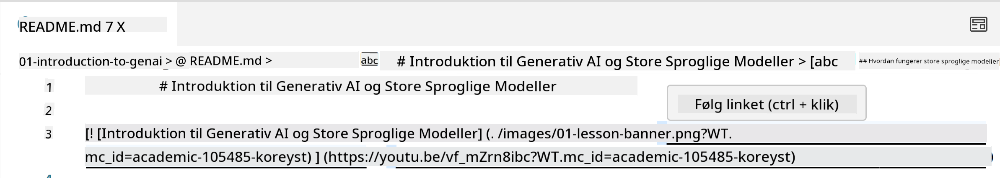
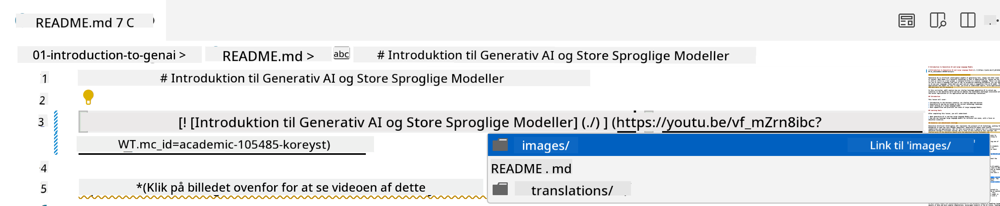
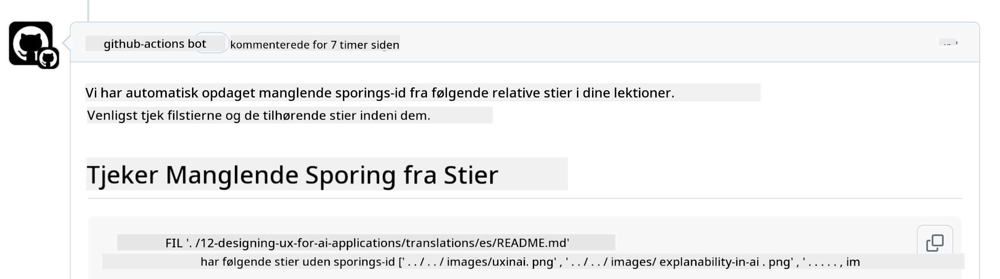
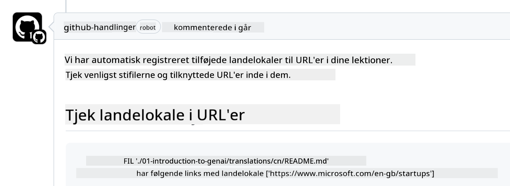

<!--
CO_OP_TRANSLATOR_METADATA:
{
  "original_hash": "57c41f2af71001a2cff9d8eb797cb843",
  "translation_date": "2025-05-19T11:18:03+00:00",
  "source_file": "CONTRIBUTING.md",
  "language_code": "da"
}
-->
# Bidrag

Dette projekt byder bidrag og forslag velkommen. De fleste bidrag kræver, at du accepterer en Contributor License Agreement (CLA), der erklærer, at du har ret til, og faktisk gør, give os rettighederne til at bruge dit bidrag. For detaljer, besøg <https://cla.microsoft.com>.

> Vigtigt: når du oversætter tekst i dette repo, skal du sikre dig, at du ikke bruger maskinoversættelse. Vi vil verificere oversættelser via fællesskabet, så meld dig kun til oversættelser på sprog, hvor du er dygtig.

Når du indsender en pull request, vil en CLA-bot automatisk afgøre, om du skal afgive en CLA og dekorere PR'en passende (f.eks. label, kommentar). Følg blot de instruktioner, som botten giver. Du behøver kun at gøre dette én gang på tværs af alle repositories, der bruger vores CLA.

## Adfærdskodeks

Dette projekt har vedtaget [Microsoft Open Source Code of Conduct](https://opensource.microsoft.com/codeofconduct/?WT.mc_id=academic-105485-koreyst).
For mere information læs [Code of Conduct FAQ](https://opensource.microsoft.com/codeofconduct/faq/?WT.mc_id=academic-105485-koreyst) eller kontakt [opencode@microsoft.com](mailto:opencode@microsoft.com) med eventuelle yderligere spørgsmål eller kommentarer.

## Spørgsmål eller problem?

Åbn venligst ikke GitHub issues for generelle supportspørgsmål, da GitHub-listen bør bruges til funktionsanmodninger og fejlrapporter. På denne måde kan vi lettere spore faktiske problemer eller fejl fra koden og holde den generelle diskussion adskilt fra selve koden.

## Tastefejl, problemer, fejl og bidrag

Når du indsender ændringer til Generative AI for Beginners-repositoriet, bedes du følge disse anbefalinger.

* Altid fork repositoryet til din egen konto, før du foretager dine ændringer
* Kombiner ikke flere ændringer i én pull request. For eksempel, indsend enhver fejlrettelse og dokumentationsopdateringer ved hjælp af separate PR'er
* Hvis din pull request viser sammenfletningskonflikter, skal du sørge for at opdatere din lokale main til at være et spejl af, hvad der er i hoved-repositoriet, før du foretager dine ændringer
* Hvis du indsender en oversættelse, bedes du oprette én PR for alle de oversatte filer, da vi ikke accepterer delvise oversættelser af indholdet
* Hvis du indsender en tastefejl eller dokumentationsrettelse, kan du kombinere ændringer til en enkelt PR, hvor det er passende

## Generelle retningslinjer for skrivning

- Sørg for, at alle dine URLs er indrammet i kantede parenteser efterfulgt af en parentes uden ekstra mellemrum omkring dem eller indeni dem ``.
- Sørg for, at ethvert relativt link (dvs. links til andre filer og mapper i repositoryet) starter med en `./`, der henviser til en fil eller en mappe placeret i den nuværende arbejdskatalog eller en `../`, der henviser til en fil eller en mappe placeret i et overordnet arbejdskatalog.
- Sørg for, at ethvert relativt link (dvs. links til andre filer og mapper i repositoryet) har en tracking ID (dvs. `?` eller `&` derefter `wt.mc_id=` eller `WT.mc_id=`) i slutningen af det.
- Sørg for, at enhver URL fra følgende domæner _github.com, microsoft.com, visualstudio.com, aka.ms, og azure.com_ har en tracking ID (dvs. `?` eller `&` derefter `wt.mc_id=` eller `WT.mc_id=`) i slutningen af det.
- Sørg for, at dine links ikke har landespecifik lokalitet i dem (dvs. `/en-us/` eller `/en/`).
- Sørg for, at alle billeder er gemt i `./images`-mappen.
- Sørg for, at billederne har beskrivende navne ved hjælp af engelske tegn, tal og bindestreger i navnet på dit billede.

## GitHub Workflows

Når du indsender en pull request, vil fire forskellige workflows blive udløst for at validere de tidligere regler.
Følg blot instruktionerne her for at bestå workflow-kontrollerne.

- [Check Broken Relative Paths](../..)
- [Check Paths Have Tracking](../..)
- [Check URLs Have Tracking](../..)
- [Check URLs Don't Have Locale](../..)

### Check Broken Relative Paths

Denne workflow sikrer, at enhver relativ sti i dine filer fungerer.
Dette repository er udrullet til GitHub pages, så du skal være meget forsigtig, når du skriver de links, der binder det hele sammen, for ikke at lede nogen til det forkerte sted.

For at sikre, at dine links fungerer korrekt, skal du blot bruge VS code til at kontrollere det.

For eksempel, når du holder musen over et link i dine filer, vil du blive bedt om at følge linket ved at trykke på **ctrl + klik**

Hvis du klikker på et link, og det ikke virker lokalt, vil det helt sikkert udløse workflowen og ikke virke på GitHub.

For at løse dette problem skal du prøve at skrive linket med hjælp fra VS code.

Når du skriver `./` eller `../`, vil VS code bede dig om at vælge mellem de tilgængelige muligheder i henhold til, hvad du skrev.

Følg stien ved at klikke på den ønskede fil eller mappe, og du vil være sikker på, at din sti ikke er brudt.

Når du har tilføjet den korrekte relative sti, gem og skub dine ændringer, vil workflowen blive udløst igen for at verificere dine ændringer.
Hvis du består kontrollen, er du klar til at gå videre.

### Check Paths Have Tracking

Denne workflow sikrer, at enhver relativ sti har tracking i sig.
Dette repository er udrullet til GitHub pages, så vi skal spore bevægelsen mellem de forskellige filer og mapper.

For at sikre, at dine relative stier har tracking i sig, skal du blot kontrollere for følgende tekst `?wt.mc_id=` i slutningen af stien.
Hvis det er tilføjet til dine relative stier, vil du bestå denne kontrol.

Hvis ikke, kan du få følgende fejl.

For at løse dette problem, prøv at åbne filstien, som workflowen fremhævede, og tilføj tracking ID til slutningen af de relative stier.

Når du har tilføjet tracking ID, gem og skub dine ændringer, vil workflowen blive udløst igen for at verificere dine ændringer.
Hvis du består kontrollen, er du klar til at gå videre.

### Check URLs Have Tracking

Denne workflow sikrer, at enhver web-URL har tracking i sig.
Dette repository er tilgængeligt for alle, så du skal sørge for at spore adgangen for at vide, hvor trafikken kommer fra.

For at sikre, at dine URLs har tracking i sig, skal du blot kontrollere for følgende tekst `?wt.mc_id=` i slutningen af URL'en.
Hvis det er tilføjet til dine URLs, vil du bestå denne kontrol.

Hvis ikke, kan du få følgende fejl.

For at løse dette problem, prøv at åbne filstien, som workflowen fremhævede, og tilføj tracking ID til slutningen af URLs.

Når du har tilføjet tracking ID, gem og skub dine ændringer, vil workflowen blive udløst igen for at verificere dine ændringer.
Hvis du består kontrollen, er du klar til at gå videre.

### Check URLs Don't Have Locale

Denne workflow sikrer, at enhver web-URL ikke har landespecifik lokalitet i sig.
Dette repository er tilgængeligt for alle rundt om i verden, så du skal sørge for ikke at inkludere dit lands lokalitet i URLs.

For at sikre, at dine URLs ikke har landelokalitet i sig, skal du blot kontrollere for følgende tekst `/en-us/` eller `/en/` eller en hvilken som helst anden sprog-lokalitet hvor som helst i URL'en.
Hvis det ikke er til stede i dine URLs, vil du bestå denne kontrol.

Hvis ikke, kan du få følgende fejl.

For at løse dette problem, prøv at åbne filstien, som workflowen fremhævede, og fjern landelokaliteten fra URLs.

Når du har fjernet landelokaliteten, gem og skub dine ændringer, vil workflowen blive udløst igen for at verificere dine ændringer.
Hvis du består kontrollen, er du klar til at gå videre.

Tillykke! Vi vender tilbage til dig så hurtigt som muligt med feedback om dit bidrag.

**Ansvarsfraskrivelse**:  
Dette dokument er blevet oversat ved hjælp af AI-oversættelsestjenesten [Co-op Translator](https://github.com/Azure/co-op-translator). Selvom vi bestræber os på at sikre nøjagtighed, skal du være opmærksom på, at automatiserede oversættelser kan indeholde fejl eller unøjagtigheder. Det originale dokument på dets oprindelige sprog bør betragtes som den autoritative kilde. For kritisk information anbefales professionel menneskelig oversættelse. Vi er ikke ansvarlige for misforståelser eller fejltolkninger, der måtte opstå som følge af brugen af denne oversættelse.