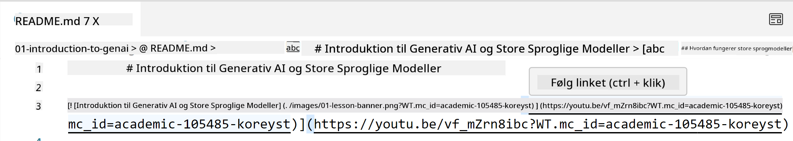
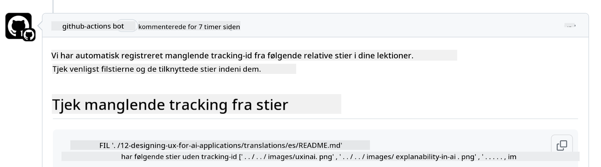

<!--
CO_OP_TRANSLATOR_METADATA:
{
  "original_hash": "57c41f2af71001a2cff9d8eb797cb843",
  "translation_date": "2025-07-09T06:08:01+00:00",
  "source_file": "CONTRIBUTING.md",
  "language_code": "da"
}
-->
# Bidrag

Dette projekt byder velkommen til bidrag og forslag. De fleste bidrag kræver, at du accepterer en Contributor License Agreement (CLA), der erklærer, at du har ret til, og faktisk giver os rettighederne til at bruge dit bidrag. For detaljer, besøg <https://cla.microsoft.com>.

> Vigtigt: når du oversætter tekst i dette repo, skal du sikre dig, at du ikke bruger maskinoversættelse. Vi vil verificere oversættelser via fællesskabet, så vær venlig kun at melde dig til oversættelser på sprog, du mestrer.

Når du indsender en pull request, vil en CLA-bot automatisk afgøre, om du skal levere en CLA og mærke PR’en passende (f.eks. label, kommentar). Følg blot instruktionerne fra botten. Du skal kun gøre dette én gang på tværs af alle repositories, der bruger vores CLA.

## Adfærdskodeks

Dette projekt har vedtaget [Microsoft Open Source Code of Conduct](https://opensource.microsoft.com/codeofconduct/?WT.mc_id=academic-105485-koreyst).  
For mere information læs [Code of Conduct FAQ](https://opensource.microsoft.com/codeofconduct/faq/?WT.mc_id=academic-105485-koreyst) eller kontakt [opencode@microsoft.com](mailto:opencode@microsoft.com) med eventuelle yderligere spørgsmål eller kommentarer.

## Spørgsmål eller problem?

Åbn venligst ikke GitHub issues for generelle supportspørgsmål, da GitHub-listen bør bruges til funktionsønsker og fejlrapporter. På den måde kan vi lettere holde styr på faktiske problemer eller fejl i koden og holde den generelle diskussion adskilt fra den faktiske kode.

## Tastefejl, problemer, fejl og bidrag

Når du indsender ændringer til Generative AI for Beginners-repositoriet, bedes du følge disse anbefalinger.

* Fork altid repositoriet til din egen konto, før du laver dine ændringer  
* Kombiner ikke flere ændringer i én pull request. For eksempel, indsend fejlrettelser og dokumentationsopdateringer som separate PR’er  
* Hvis din pull request viser merge-konflikter, skal du sørge for at opdatere din lokale main, så den spejler hovedrepositoriet, før du laver dine ændringer  
* Hvis du indsender en oversættelse, bedes du lave én PR for alle de oversatte filer, da vi ikke accepterer delvise oversættelser af indholdet  
* Hvis du indsender en tastefejl eller dokumentationsrettelse, kan du kombinere ændringer i én PR, hvor det er passende

## Generelle retningslinjer for skrivning

- Sørg for, at alle dine URL’er er indkapslet i firkantede parenteser efterfulgt af en parentes uden ekstra mellemrum ``.  
- Sørg for, at ethvert relativt link (dvs. links til andre filer og mapper i repositoriet) starter med `./` for en fil eller mappe i den aktuelle arbejdsmappe eller `../` for en fil eller mappe i en overordnet mappe.  
- Sørg for, at ethvert relativt link har en tracking-ID (dvs. `?` eller `&` efterfulgt af `wt.mc_id=` eller `WT.mc_id=`) i slutningen.  
- Sørg for, at URL’er fra følgende domæner _github.com, microsoft.com, visualstudio.com, aka.ms og azure.com_ har en tracking-ID i slutningen.  
- Sørg for, at dine links ikke indeholder landespecifikke lokaliteter (f.eks. `/en-us/` eller `/en/`).  
- Sørg for, at alle billeder er gemt i `./images`-mappen.  
- Sørg for, at billederne har beskrivende navne med engelske tegn, tal og bindestreger.

## GitHub Workflows

Når du indsender en pull request, vil fire forskellige workflows blive udløst for at validere de tidligere regler.  
Følg blot instruktionerne herunder for at bestå workflow-tjek.

- [Check Broken Relative Paths](../..)  
- [Check Paths Have Tracking](../..)  
- [Check URLs Have Tracking](../..)  
- [Check URLs Don't Have Locale](../..)

### Check Broken Relative Paths

Denne workflow sikrer, at alle relative stier i dine filer fungerer.  
Dette repository er deployeret til GitHub Pages, så du skal være meget opmærksom, når du skriver links, så ingen bliver ledt til forkerte steder.

For at sikre, at dine links fungerer korrekt, kan du bruge VS Code til at tjekke det.

For eksempel, når du holder musen over et link i dine filer, får du mulighed for at følge linket ved at trykke på **ctrl + klik**

Hvis du klikker på et link, og det ikke virker lokalt, vil det med sikkerhed også udløse workflowet og ikke virke på GitHub.

For at løse dette problem, prøv at skrive linket med hjælp fra VS Code.

Når du skriver `./` eller `../`, vil VS Code foreslå tilgængelige muligheder baseret på det, du har skrevet.

Følg stien ved at klikke på den ønskede fil eller mappe, og du kan være sikker på, at din sti ikke er brudt.

Når du har tilføjet den korrekte relative sti, gem og push dine ændringer, så vil workflowet blive udløst igen for at verificere dine ændringer.  
Hvis du består tjekket, er du klar til at gå videre.

### Check Paths Have Tracking

Denne workflow sikrer, at alle relative stier indeholder tracking.  
Dette repository er deployeret til GitHub Pages, så vi skal kunne spore bevægelsen mellem de forskellige filer og mapper.

For at sikre, at dine relative stier har tracking, skal du blot tjekke, at teksten `?wt.mc_id=` står i slutningen af stien.  
Hvis det er tilføjet til dine relative stier, vil du bestå dette tjek.

Hvis ikke, kan du få følgende fejl.

For at løse dette problem, prøv at åbne den filsti, som workflowet har fremhævet, og tilføj tracking-ID’et til slutningen af de relative stier.

Når du har tilføjet tracking-ID’et, gem og push dine ændringer, så vil workflowet blive udløst igen for at verificere dine ændringer.  
Hvis du består tjekket, er du klar til at gå videre.

### Check URLs Have Tracking

Denne workflow sikrer, at alle web-URL’er indeholder tracking.  
Dette repository er tilgængeligt for alle, så du skal sikre, at vi kan spore trafikken og vide, hvor den kommer fra.

For at sikre, at dine URL’er har tracking, skal du blot tjekke, at teksten `?wt.mc_id=` står i slutningen af URL’en.  
Hvis det er tilføjet til dine URL’er, vil du bestå dette tjek.

Hvis ikke, kan du få følgende fejl.

For at løse dette problem, prøv at åbne den filsti, som workflowet har fremhævet, og tilføj tracking-ID’et til slutningen af URL’erne.

Når du har tilføjet tracking-ID’et, gem og push dine ændringer, så vil workflowet blive udløst igen for at verificere dine ændringer.  
Hvis du består tjekket, er du klar til at gå videre.

### Check URLs Don't Have Locale

Denne workflow sikrer, at ingen web-URL’er indeholder landespecifikke lokaliteter.  
Dette repository er tilgængeligt for alle i hele verden, så du skal sikre, at du ikke inkluderer dit lands lokalitet i URL’erne.

For at sikre, at dine URL’er ikke indeholder landelokalitet, skal du blot tjekke, at teksten `/en-us/` eller `/en/` eller andre sproglokaliteter ikke findes i URL’en.  
Hvis det ikke er til stede i dine URL’er, vil du bestå dette tjek.

Hvis ikke, kan du få følgende fejl.

For at løse dette problem, prøv at åbne den filsti, som workflowet har fremhævet, og fjern landelokaliteten fra URL’erne.

Når du har fjernet landelokaliteten, gem og push dine ændringer, så vil workflowet blive udløst igen for at verificere dine ændringer.  
Hvis du består tjekket, er du klar til at gå videre.

Tillykke! Vi vender tilbage til dig så hurtigt som muligt med feedback på dit bidrag.

**Ansvarsfraskrivelse**:  
Dette dokument er blevet oversat ved hjælp af AI-oversættelsestjenesten [Co-op Translator](https://github.com/Azure/co-op-translator). Selvom vi bestræber os på nøjagtighed, bedes du være opmærksom på, at automatiserede oversættelser kan indeholde fejl eller unøjagtigheder. Det oprindelige dokument på dets oprindelige sprog bør betragtes som den autoritative kilde. For kritisk information anbefales professionel menneskelig oversættelse. Vi påtager os intet ansvar for misforståelser eller fejltolkninger, der opstår som følge af brugen af denne oversættelse.