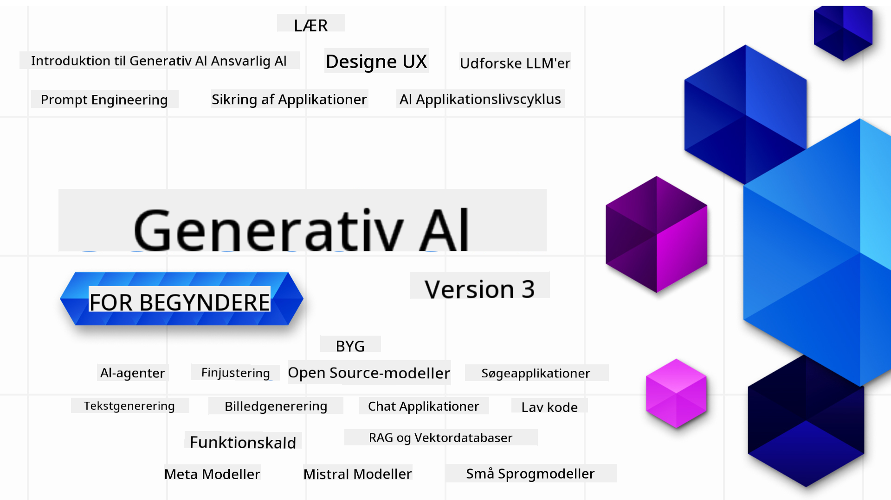

<!--
CO_OP_TRANSLATOR_METADATA:
{
  "original_hash": "c2ee25895ebbfa1a52868bb6eab686fc",
  "translation_date": "2025-05-19T11:47:22+00:00",
  "source_file": "README.md",
  "language_code": "da"
}
-->

### 21 Lektioner, der lærer dig alt, hvad du behøver at vide for at begynde at bygge Generative AI-applikationer

### 🌐 Flersproget Support

#### Understøttet via GitHub Action (Automatiseret & Altid Opdateret)
[Fransk](../fr/README.md) | [Spansk](../es/README.md) | [Tysk](../de/README.md) | [Russisk](../ru/README.md) | [Arabisk](../ar/README.md) | [Persisk (Farsi)](../fa/README.md) | [Urdu](../ur/README.md) | [Kinesisk (Forenklet)](../zh/README.md) | [Kinesisk (Traditionel, Macau)](../mo/README.md) | [Kinesisk (Traditionel, Hong Kong)](../hk/README.md) | [Kinesisk (Traditionel, Taiwan)](../tw/README.md) | [Japansk](../ja/README.md) | [Koreansk](../ko/README.md) | [Hindi](../hi/README.md) | [Bengali](../bn/README.md) | [Marathi](../mr/README.md) | [Nepali](../ne/README.md) | [Punjabi (Gurmukhi)](../pa/README.md) | [Portugisisk (Portugal)](../pt/README.md) | [Portugisisk (Brasilien)](../br/README.md) | [Italiensk](../it/README.md) | [Polsk](../pl/README.md) | [Tyrkisk](../tr/README.md) | [Græsk](../el/README.md) | [Thai](../th/README.md) | [Svensk](../sv/README.md) | [Dansk](./README.md) | [Norsk](../no/README.md) | [Finsk](../fi/README.md) | [Hollandsk](../nl/README.md) | [Hebraisk](../he/README.md) | [Vietnamesisk](../vi/README.md) | [Indonesisk](../id/README.md) | [Malajisk](../ms/README.md) | [Tagalog (Filippinsk)](../tl/README.md) | [Swahili](../sw/README.md) | [Ungarsk](../hu/README.md) | [Tjekkisk](../cs/README.md) | [Slovakisk](../sk/README.md) | [Rumænsk](../ro/README.md) | [Bulgarsk](../bg/README.md) | [Serbisk (Kyrillisk)](../sr/README.md) | [Kroatisk](../hr/README.md) | [Slovensk](../sl/README.md)
# Generativ AI for Begyndere (Version 3) - Et Kursus

Lær grundlæggende principper for at bygge Generativ AI-applikationer med vores omfattende kursus på 21 lektioner af Microsoft Cloud Advocates.

## 🌱 Kom i Gang

Dette kursus har 21 lektioner. Hver lektion dækker sit eget emne, så start hvor du vil!

Lektionerne er enten mærket som "Lær"-lektioner, der forklarer et Generativ AI-koncept, eller "Byg"-lektioner, der forklarer et koncept og kodeeksempler i både **Python** og **TypeScript**, når det er muligt.

For .NET-udviklere, tjek [Generativ AI for Begyndere (.NET Edition)](https://github.com/microsoft/Generative-AI-for-beginners-dotnet?WT.mc_id=academic-105485-koreyst)!

Hver lektion inkluderer også en "Fortsæt med at Lære"-sektion med yderligere læringsværktøjer.

## Hvad Du Behøver
### For at køre koden i dette kursus kan du bruge enten:
- [Azure OpenAI Service](https://aka.ms/genai-beginners/azure-open-ai?WT.mc_id=academic-105485-koreyst) - **Lektioner:** "aoai-assignment"
- [GitHub Marketplace Model Catalog](https://aka.ms/genai-beginners/gh-models?WT.mc_id=academic-105485-koreyst) - **Lektioner:** "githubmodels"
- [OpenAI API](https://aka.ms/genai-beginners/open-ai?WT.mc_id=academic-105485-koreyst) - **Lektioner:** "oai-assignment"

- Grundlæggende kendskab til Python eller TypeScript er nyttigt - \*For absolutte begyndere, tjek disse [Python](https://aka.ms/genai-beginners/python?WT.mc_id=academic-105485-koreyst) og [TypeScript](https://aka.ms/genai-beginners/typescript?WT.mc_id=academic-105485-koreyst) kurser
- En GitHub-konto for at [forke hele dette repo](https://aka.ms/genai-beginners/github?WT.mc_id=academic-105485-koreyst) til din egen GitHub-konto

Vi har lavet en **[Kursusopsætning](./00-course-setup/README.md?WT.mc_id=academic-105485-koreyst)** lektion for at hjælpe dig med at opsætte dit udviklingsmiljø.

Glem ikke at [stjerne (🌟) dette repo](https://docs.github.com/en/get-started/exploring-projects-on-github/saving-repositories-with-stars?WT.mc_id=academic-105485-koreyst) for nemmere at finde det senere.

## 🧠 Klar til Udrulning?

Hvis du leder efter mere avancerede kodeeksempler, så tjek vores [samling af Generativ AI kodeeksempler](https://aka.ms/genai-beg-code?WT.mc_id=academic-105485-koreyst) i både **Python** og **TypeScript**.

## 🗣️ Mød Andre Lærende, Få Support

Deltag i vores [officielle Azure AI Foundry Discord server](https://aka.ms/genai-discord?WT.mc_id=academic-105485-koreyst) for at møde og netværke med andre lærende, der tager dette kursus, og få support.

Stil spørgsmål eller del produktfeedback i vores [Azure AI Foundry Developer Forum](https://aka.ms/azureaifoundry/forum) på Github.

## 🚀 Bygger du en Startup?

Tilmeld dig [Microsoft for Startups Founders Hub](https://aka.ms/genai-foundershub?WT.mc_id=academic-105485-koreyst) for at modtage **gratis OpenAI credits** og op til **$150k i Azure credits for at få adgang til OpenAI modeller gennem Azure OpenAI Services**.

## 🙏 Vil du hjælpe?

Har du forslag eller fundet stave- eller kodefejl? [Rejs en sag](https://github.com/microsoft/generative-ai-for-beginners/issues?WT.mc_id=academic-105485-koreyst) eller [Opret en pull request](https://github.com/microsoft/generative-ai-for-beginners/pulls?WT.mc_id=academic-105485-koreyst)

## 📂 Hver lektion inkluderer:

- En kort videointroduktion til emnet
- En skriftlig lektion placeret i README
- Python og TypeScript kodeeksempler, der understøtter Azure OpenAI og OpenAI API
- Links til ekstra ressourcer for at fortsætte din læring

## 🗃️ Lektioner

| #   | **Lektionslink**                                                                                                                              | **Beskrivelse**                                                                                 | **Video**                                                                   | **Ekstra Læring**                                                             |
| --- | -------------------------------------------------------------------------------------------------------------------------------------------- | ----------------------------------------------------------------------------------------------- | --------------------------------------------------------------------------- | ------------------------------------------------------------------------------ |
| 00  | [Kursusopsætning](./00-course-setup/README.md?WT.mc_id=academic-105485-koreyst)                                                                 | **Lær:** Hvordan du opsætter dit udviklingsmiljø                                            | Video Kommer Snart                                                                 | [Lær Mere](https://aka.ms/genai-collection?WT.mc_id=academic-105485-koreyst) |
| 01  | [Introduktion til Generativ AI og LLMs](./01-introduction-to-genai/README.md?WT.mc_id=academic-105485-koreyst)                              | **Lær:** Forstå hvad Generativ AI er, og hvordan Store Sproglige Modeller (LLMs) fungerer.       | [Video](https://aka.ms/gen-ai-lesson-1-gh?WT.mc_id=academic-105485-koreyst) | [Lær Mere](https://aka.ms/genai-collection?WT.mc_id=academic-105485-koreyst) |
| 02  | [Udforske og sammenligne forskellige LLMs](./02-exploring-and-comparing-different-llms/README.md?WT.mc_id=academic-105485-koreyst)             | **Lær:** Hvordan du vælger den rigtige model til din brugssag                                      | [Video](https://aka.ms/gen-ai-lesson2-gh?WT.mc_id=academic-105485-koreyst)  | [Lær Mere](https://aka.ms/genai-collection?WT.mc_id=academic-105485-koreyst) |
| 03  | [Brug af Generativ AI Ansvarligt](./03-using-generative-ai-responsibly/README.md?WT.mc_id=academic-105485-koreyst)                           | **Lær:** Hvordan du bygger Generativ AI Applikationer ansvarligt                                  | [Video](https://aka.ms/gen-ai-lesson3-gh?WT.mc_id=academic-105485-koreyst)  | [Lær Mere](https://aka.ms/genai-collection?WT.mc_id=academic-105485-koreyst) |
| 04  | [Forståelse af Prompt Engineering Grundprincipper](./04-prompt-engineering-fundamentals/README.md?WT.mc_id=academic-105485-koreyst)             | **Lær:** Praktiske Prompt Engineering Bedste Praksis                                           | [Video](https://aka.ms/gen-ai-lesson4-gh?WT.mc_id=academic-105485-koreyst)  | [Lær Mere](https://aka.ms/genai-collection?WT.mc_id=academic-105485-koreyst) |
| 05  | [Oprettelse af avancerede prompts](./05-advanced-prompts/README.md?WT.mc_id=academic-105485-koreyst)                                                | **Lær:** Hvordan man anvender prompt engineering teknikker, der forbedrer resultatet af dine prompts. | [Video](https://aka.ms/gen-ai-lesson5-gh?WT.mc_id=academic-105485-koreyst)  | [Lær mere](https://aka.ms/genai-collection?WT.mc_id=academic-105485-koreyst) |
| 06  | [Bygning af tekstgenereringsapplikationer](./06-text-generation-apps/README.md?WT.mc_id=academic-105485-koreyst)                                | **Byg:** En tekstgenereringsapp ved hjælp af Azure OpenAI / OpenAI API                                | [Video](https://aka.ms/gen-ai-lesson6-gh?WT.mc_id=academic-105485-koreyst)  | [Lær mere](https://aka.ms/genai-collection?WT.mc_id=academic-105485-koreyst) |
| 07  | [Bygning af chatapplikationer](./07-building-chat-applications/README.md?WT.mc_id=academic-105485-koreyst)                                     | **Byg:** Teknikker til effektivt at bygge og integrere chatapplikationer.               | [Video](https://aka.ms/gen-ai-lessons7-gh?WT.mc_id=academic-105485-koreyst) | [Lær mere](https://aka.ms/genai-collection?WT.mc_id=academic-105485-koreyst) |
| 08  | [Bygning af søgeapps med vektordatabaser](./08-building-search-applications/README.md?WT.mc_id=academic-105485-koreyst)                        | **Byg:** En søgeapplikation, der bruger Embeddings til at søge efter data.                        | [Video](https://aka.ms/gen-ai-lesson8-gh?WT.mc_id=academic-105485-koreyst)  | [Lær mere](https://aka.ms/genai-collection?WT.mc_id=academic-105485-koreyst) |
| 09  | [Bygning af billedgenereringsapplikationer](./09-building-image-applications/README.md?WT.mc_id=academic-105485-koreyst)                        | **Byg:** En billedgenereringsapplikation                                                       | [Video](https://aka.ms/gen-ai-lesson9-gh?WT.mc_id=academic-105485-koreyst)  | [Lær mere](https://aka.ms/genai-collection?WT.mc_id=academic-105485-koreyst) |
| 10  | [Bygning af lavkode AI-applikationer](./10-building-low-code-ai-applications/README.md?WT.mc_id=academic-105485-koreyst)                       | **Byg:** En generativ AI-applikation ved hjælp af lavkodeværktøjer                                     | [Video](https://aka.ms/gen-ai-lesson10-gh?WT.mc_id=academic-105485-koreyst) | [Lær mere](https://aka.ms/genai-collection?WT.mc_id=academic-105485-koreyst) |
| 11  | [Integration af eksterne applikationer med funktion kald](./11-integrating-with-function-calling/README.md?WT.mc_id=academic-105485-koreyst) | **Byg:** Hvad funktion kald er, og dets anvendelsesmuligheder for applikationer                          | [Video](https://aka.ms/gen-ai-lesson11-gh?WT.mc_id=academic-105485-koreyst) | [Lær mere](https://aka.ms/genai-collection?WT.mc_id=academic-105485-koreyst) |
| 12  | [Design af UX til AI-applikationer](./12-designing-ux-for-ai-applications/README.md?WT.mc_id=academic-105485-koreyst)                         | **Lær:** Hvordan man anvender UX designprincipper, når man udvikler generative AI-applikationer         | [Video](https://aka.ms/gen-ai-lesson12-gh?WT.mc_id=academic-105485-koreyst) | [Lær mere](https://aka.ms/genai-collection?WT.mc_id=academic-105485-koreyst) |
| 13  | [Sikring af dine generative AI-applikationer](./13-securing-ai-applications/README.md?WT.mc_id=academic-105485-koreyst)                         | **Lær:** Truslerne og risiciene for AI-systemer og metoder til at sikre disse systemer.             | [Video](https://aka.ms/gen-ai-lesson13-gh?WT.mc_id=academic-105485-koreyst) | [Lær mere](https://aka.ms/genai-collection?WT.mc_id=academic-105485-koreyst) |
| 14  | [Livscyklussen for generative AI-applikationer](./14-the-generative-ai-application-lifecycle/README.md?WT.mc_id=academic-105485-koreyst)           | **Lær:** Værktøjerne og metrikkerne til at styre LLM livscyklus og LLMOps                         | [Video](https://aka.ms/gen-ai-lesson14-gh?WT.mc_id=academic-105485-koreyst) | [Lær mere](https://aka.ms/genai-collection?WT.mc_id=academic-105485-koreyst) |
| 15  | [Retrieval Augmented Generation (RAG) og Vektor Databaser](./15-rag-and-vector-databases/README.md?WT.mc_id=academic-105485-koreyst)        | **Byg:** En applikation ved hjælp af en RAG-ramme til at hente embeddings fra en Vektor Database  | [Video](https://aka.ms/gen-ai-lesson15-gh?WT.mc_id=academic-105485-koreyst) | [Lær Mere](https://aka.ms/genai-collection?WT.mc_id=academic-105485-koreyst) |
| 16  | [Open Source Modeller og Hugging Face](./16-open-source-models/README.md?WT.mc_id=academic-105485-koreyst)                                    | **Byg:** En applikation ved hjælp af open source modeller tilgængelige på Hugging Face                    | [Video](https://aka.ms/gen-ai-lesson16-gh?WT.mc_id=academic-105485-koreyst) | [Lær Mere](https://aka.ms/genai-collection?WT.mc_id=academic-105485-koreyst) |
| 17  | [AI Agenter](./17-ai-agents/README.md?WT.mc_id=academic-105485-koreyst)                                                                       | **Byg:** En applikation ved hjælp af en AI Agent Framework                                           | [Video](https://aka.ms/gen-ai-lesson17-gh?WT.mc_id=academic-105485-koreyst) | [Lær Mere](https://aka.ms/genai-collection?WT.mc_id=academic-105485-koreyst) |
| 18  | [Finjustering af LLMs](./18-fine-tuning/README.md?WT.mc_id=academic-105485-koreyst)                                                              | **Lær:** Hvad, hvorfor og hvordan af finjustering af LLMs                                            | [Video](https://aka.ms/gen-ai-lesson18-gh?WT.mc_id=academic-105485-koreyst) | [Lær Mere](https://aka.ms/genai-collection?WT.mc_id=academic-105485-koreyst) |
| 19  | [Byg med SLMs](./19-slm/README.md?WT.mc_id=academic-105485-koreyst)                                                              | **Lær:** Fordelene ved at bygge med Små Sprogmodeller                                            | Video Kommer Snart | [Lær Mere](https://aka.ms/genai-collection?WT.mc_id=academic-105485-koreyst) |
| 20  | [Byg med Mistral Modeller](./20-mistral/README.md?WT.mc_id=academic-105485-koreyst)                                                              | **Lær:** Funktionerne og forskellene ved Mistral Familie Modeller                                           | Video Kommer Snart | [Lær Mere](https://aka.ms/genai-collection?WT.mc_id=academic-105485-koreyst) |
| 21  | [Byg med Meta Modeller](./21-meta/README.md?WT.mc_id=academic-105485-koreyst)                                                              | **Lær:** Funktionerne og forskellene ved Meta Familie Modeller                                           | Video Kommer Snart | [Lær Mere](https://aka.ms/genai-collection?WT.mc_id=academic-105485-koreyst) |

### 🌟 Særlig tak

Særlig tak til [**John Aziz**](https://www.linkedin.com/in/john0isaac/) for at skabe alle GitHub Actions og workflows

[**Bernhard Merkle**](https://www.linkedin.com/in/bernhard-merkle-738b73/) for at lave vigtige bidrag til hver lektion for at forbedre lærings- og kodeoplevelsen.

## 🎒 Andre Kurser

Vores team producerer andre kurser! Tjek:

- [**NY** AI Agenter for Begyndere](https://github.com/microsoft/ai-agents-for-beginners?WT.mc_id=academic-105485-koreyst)
- [**NY** Generativ AI for Begyndere ved hjælp af .NET](https://github.com/microsoft/Generative-AI-for-beginners-dotnet?WT.mc_id=academic-105485-koreyst)
- [**NY** Generativ AI for Begyndere ved hjælp af JavaScript](https://aka.ms/genai-js-course?WT.mc_id=academic-105485-koreyst)
- [ML for Begyndere](https://aka.ms/ml-beginners?WT.mc_id=academic-105485-koreyst)
- [Data Science for Begyndere](https://aka.ms/datascience-beginners?WT.mc_id=academic-105485-koreyst)
- [AI for Begyndere](https://aka.ms/ai-beginners?WT.mc_id=academic-105485-koreyst)
- [Cybersikkerhed for Begyndere](https://github.com/microsoft/Security-101??WT.mc_id=academic-96948-sayoung)
- [Webudvikling for Begyndere](https://aka.ms/webdev-beginners?WT.mc_id=academic-105485-koreyst)
- [IoT for Begyndere](https://aka.ms/iot-beginners?WT.mc_id=academic-105485-koreyst)
- [XR Udvikling for Begyndere](https://github.com/microsoft/xr-development-for-beginners?WT.mc_id=academic-105485-koreyst)
- [Mestre GitHub Copilot til AI-parprogrammering](https://aka.ms/GitHubCopilotAI?WT.mc_id=academic-105485-koreyst)
- [Mestre GitHub Copilot til C#/.NET udviklere](https://github.com/microsoft/mastering-github-copilot-for-dotnet-csharp-developers?WT.mc_id=academic-105485-koreyst)
- [Vælg dit eget Copilot-eventyr](https://github.com/microsoft/CopilotAdventures?WT.mc_id=academic-105485-koreyst)

**Ansvarsfraskrivelse**:  
Dette dokument er blevet oversat ved hjælp af AI-oversættelsestjenesten [Co-op Translator](https://github.com/Azure/co-op-translator). Selvom vi bestræber os på nøjagtighed, skal du være opmærksom på, at automatiserede oversættelser kan indeholde fejl eller unøjagtigheder. Det originale dokument på dets oprindelige sprog bør betragtes som den autoritative kilde. For kritisk information anbefales professionel menneskelig oversættelse. Vi er ikke ansvarlige for eventuelle misforståelser eller fejltolkninger, der måtte opstå som følge af brugen af denne oversættelse.