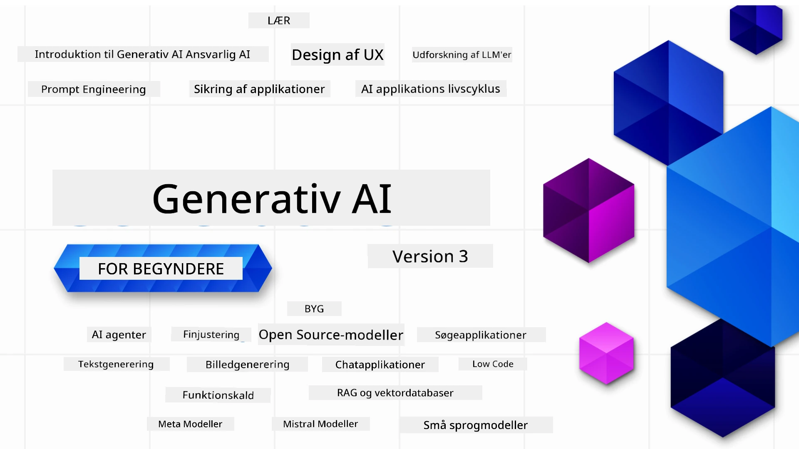

### 21 lektioner, der lærer dig alt, hvad du behøver at vide for at begynde at bygge Generative AI-applikationer

[](https://github.com/microsoft/Generative-AI-For-Beginners/blob/master/LICENSE?WT.mc_id=academic-105485-koreyst)
[](https://GitHub.com/microsoft/Generative-AI-For-Beginners/graphs/contributors/?WT.mc_id=academic-105485-koreyst)
[](https://GitHub.com/microsoft/Generative-AI-For-Beginners/issues/?WT.mc_id=academic-105485-koreyst)
[](https://GitHub.com/microsoft/Generative-AI-For-Beginners/pulls/?WT.mc_id=academic-105485-koreyst)
[](http://makeapullrequest.com?WT.mc_id=academic-105485-koreyst)

[](https://GitHub.com/microsoft/Generative-AI-For-Beginners/watchers/?WT.mc_id=academic-105485-koreyst)
[](https://GitHub.com/microsoft/Generative-AI-For-Beginners/network/?WT.mc_id=academic-105485-koreyst)
[](https://GitHub.com/microsoft/Generative-AI-For-Beginners/stargazers/?WT.mc_id=academic-105485-koreyst)

[](https://discord.gg/nTYy5BXMWG)

### 🌐 Multisproget support

#### Understøttet via GitHub Action (Automatiseret & Altid Opdateret)

<!-- CO-OP TRANSLATOR LANGUAGES TABLE START -->
[Arabic](../ar/README.md) | [Bengali](../bn/README.md) | [Bulgarian](../bg/README.md) | [Burmese (Myanmar)](../my/README.md) | [Chinese (Simplified)](../zh-CN/README.md) | [Chinese (Traditional, Hong Kong)](../zh-HK/README.md) | [Chinese (Traditional, Macau)](../zh-MO/README.md) | [Chinese (Traditional, Taiwan)](../zh-TW/README.md) | [Croatian](../hr/README.md) | [Czech](../cs/README.md) | [Danish](./README.md) | [Dutch](../nl/README.md) | [Estonian](../et/README.md) | [Finnish](../fi/README.md) | [French](../fr/README.md) | [German](../de/README.md) | [Greek](../el/README.md) | [Hebrew](../he/README.md) | [Hindi](../hi/README.md) | [Hungarian](../hu/README.md) | [Indonesian](../id/README.md) | [Italian](../it/README.md) | [Japanese](../ja/README.md) | [Kannada](../kn/README.md) | [Korean](../ko/README.md) | [Lithuanian](../lt/README.md) | [Malay](../ms/README.md) | [Malayalam](../ml/README.md) | [Marathi](../mr/README.md) | [Nepali](../ne/README.md) | [Nigerian Pidgin](../pcm/README.md) | [Norwegian](../no/README.md) | [Persian (Farsi)](../fa/README.md) | [Polish](../pl/README.md) | [Portuguese (Brazil)](../pt-BR/README.md) | [Portuguese (Portugal)](../pt-PT/README.md) | [Punjabi (Gurmukhi)](../pa/README.md) | [Romanian](../ro/README.md) | [Russian](../ru/README.md) | [Serbian (Cyrillic)](../sr/README.md) | [Slovak](../sk/README.md) | [Slovenian](../sl/README.md) | [Spanish](../es/README.md) | [Swahili](../sw/README.md) | [Swedish](../sv/README.md) | [Tagalog (Filipino)](../tl/README.md) | [Tamil](../ta/README.md) | [Telugu](../te/README.md) | [Thai](../th/README.md) | [Turkish](../tr/README.md) | [Ukrainian](../uk/README.md) | [Urdu](../ur/README.md) | [Vietnamese](../vi/README.md)

> **Foretrækker du at klone lokalt?**

> Dette repository indeholder 50+ sprogoversættelser, hvilket øger download-størrelsen betydeligt. For at klone uden oversættelser, brug spars checkout:
> ```bash
> git clone --filter=blob:none --sparse https://github.com/microsoft/generative-ai-for-beginners.git
> cd generative-ai-for-beginners
> git sparse-checkout set --no-cone '/*' '!translations' '!translated_images'
> ```
> Dette giver dig alt, hvad du behøver for at gennemføre kurset med en meget hurtigere download.
<!-- CO-OP TRANSLATOR LANGUAGES TABLE END -->

# Generativ AI for begyndere (Version 3) - Et kursus

Lær grundlæggende om at bygge Generative AI-applikationer med vores 21-lektions omfattende kursus af Microsoft Cloud Advocates.

## 🌱 Kom godt i gang

Dette kursus har 21 lektioner. Hver lektion dækker sit eget emne, så start hvor som helst du vil!

Lektionerne er mærket enten som "Learn" lektioner, der forklarer et Generative AI-koncept, eller "Build" lektioner, der forklarer et koncept og kodeeksempler i både **Python** og **TypeScript**, når det er muligt.

For .NET-udviklere se [Generative AI for Beginners (.NET Edition)](https://github.com/microsoft/Generative-AI-for-beginners-dotnet?WT.mc_id=academic-105485-koreyst)!

Hver lektion inkluderer også en "Keep Learning" sektion med yderligere læringsværktøjer.

## Hvad du behøver
### For at køre koden i dette kursus kan du bruge enten:
 - [Azure OpenAI Service](https://aka.ms/genai-beginners/azure-open-ai?WT.mc_id=academic-105485-koreyst) - **Lektioner:** "aoai-assignment"
 - [GitHub Marketplace Model Catalog](https://aka.ms/genai-beginners/gh-models?WT.mc_id=academic-105485-koreyst) - **Lektioner:** "githubmodels"
 - [OpenAI API](https://aka.ms/genai-beginners/open-ai?WT.mc_id=academic-105485-koreyst) - **Lektioner:** "oai-assignment"
   
- Grundlæggende kendskab til Python eller TypeScript er nyttigt - \*For absolutte begyndere se disse [Python](https://aka.ms/genai-beginners/python?WT.mc_id=academic-105485-koreyst) og [TypeScript](https://aka.ms/genai-beginners/typescript?WT.mc_id=academic-105485-koreyst) kurser
- En GitHub-konto til at [forke hele dette repo](https://aka.ms/genai-beginners/github?WT.mc_id=academic-105485-koreyst) til din egen GitHub-konto

Vi har lavet en **[Kursusopsætning](./00-course-setup/README.md?WT.mc_id=academic-105485-koreyst)** lektion til at hjælpe dig med at opsætte dit udviklingsmiljø.

Glem ikke at [stjerne (🌟) dette repo](https://docs.github.com/en/get-started/exploring-projects-on-github/saving-repositories-with-stars?WT.mc_id=academic-105485-koreyst) for at finde det nemmere senere.

## 🧠 Klar til at udrulle?

Hvis du søger mere avancerede kodeeksempler, så tjek vores [samling af Generative AI-kodeeksempler](https://aka.ms/genai-beg-code?WT.mc_id=academic-105485-koreyst) i både **Python** og **TypeScript**.

## 🗣️ Mød andre lærende, få støtte

Deltag i vores [officielle Azure AI Foundry Discord-server](https://aka.ms/genai-discord?WT.mc_id=academic-105485-koreyst) for at møde og netværke med andre, der tager dette kursus, og få support.

Stil spørgsmål eller del produktfeedback i vores [Azure AI Foundry Developer Forum](https://aka.ms/azureaifoundry/forum) på Github.

## 🚀 Bygger du en startup?

Besøg [Microsoft for Startups](https://www.microsoft.com/startups) for at finde ud af, hvordan du kommer i gang med at bygge med Azure-kreditter i dag.

## 🙏 Vil du hjælpe?

Har du forslag eller fundet stave- eller kodefejl? [Opret en issue](https://github.com/microsoft/generative-ai-for-beginners/issues?WT.mc_id=academic-105485-koreyst) eller [Lav en pull request](https://github.com/microsoft/generative-ai-for-beginners/pulls?WT.mc_id=academic-105485-koreyst)

## 📂 Hver lektion inkluderer:

- En kort video introduktion til emnet
- En skreven lektion placeret i README
- Python og TypeScript kodeeksempler, der understøtter Azure OpenAI og OpenAI API
- Links til ekstra ressourcer til at fortsætte din læring

## 🗃️ Lektioner

| #   | **Lektionslink**                                                                                                                             | **Beskrivelse**                                                                                  | **Video**                                                                   | **Ekstra læring**                                                              |
| --- | -------------------------------------------------------------------------------------------------------------------------------------------- | ----------------------------------------------------------------------------------------------- | --------------------------------------------------------------------------- | ------------------------------------------------------------------------------ |
| 00  | [Kursusopsætning](./00-course-setup/README.md?WT.mc_id=academic-105485-koreyst)                                                               | **Lær:** Hvordan du opsætter dit udviklingsmiljø                                              | Video kommer snart                                                           | [Lær mere](https://aka.ms/genai-collection?WT.mc_id=academic-105485-koreyst)   |
| 01  | [Introduktion til Generativ AI og LLMs](./01-introduction-to-genai/README.md?WT.mc_id=academic-105485-koreyst)                                | **Lær:** Forstå, hvad Generativ AI er, og hvordan store sprogmodeller (LLMs) fungerer.          | [Video](https://aka.ms/gen-ai-lesson-1-gh?WT.mc_id=academic-105485-koreyst) | [Lær mere](https://aka.ms/genai-collection?WT.mc_id=academic-105485-koreyst)   |
| 02  | [Undersøgelse og sammenligning af forskellige LLMs](./02-exploring-and-comparing-different-llms/README.md?WT.mc_id=academic-105485-koreyst)    | **Lær:** Hvordan du vælger den rette model til din anvendelse                                  | [Video](https://aka.ms/gen-ai-lesson2-gh?WT.mc_id=academic-105485-koreyst)  | [Lær mere](https://aka.ms/genai-collection?WT.mc_id=academic-105485-koreyst)   |
| 03  | [Brug af Generativ AI ansvarligt](./03-using-generative-ai-responsibly/README.md?WT.mc_id=academic-105485-koreyst)                             | **Lær:** Hvordan man bygger Generative AI-applikationer ansvarligt                             | [Video](https://aka.ms/gen-ai-lesson3-gh?WT.mc_id=academic-105485-koreyst)  | [Lær mere](https://aka.ms/genai-collection?WT.mc_id=academic-105485-koreyst)   |
| 04  | [Forstå Grundlæggende Prompt Engineering](./04-prompt-engineering-fundamentals/README.md?WT.mc_id=academic-105485-koreyst)                  | **Lær:** Praktiske bedste metoder til Prompt Engineering                                       | [Video](https://aka.ms/gen-ai-lesson4-gh?WT.mc_id=academic-105485-koreyst)  | [Lær Mere](https://aka.ms/genai-collection?WT.mc_id=academic-105485-koreyst) |
| 05  | [Oprettelse af Avancerede Prompts](./05-advanced-prompts/README.md?WT.mc_id=academic-105485-koreyst)                                            | **Lær:** Hvordan man anvender prompt engineering teknikker, der forbedrer resultatet af dine prompts. | [Video](https://aka.ms/gen-ai-lesson5-gh?WT.mc_id=academic-105485-koreyst)  | [Lær Mere](https://aka.ms/genai-collection?WT.mc_id=academic-105485-koreyst) |
| 06  | [Opbygning af Tekstgenereringsapplikationer](./06-text-generation-apps/README.md?WT.mc_id=academic-105485-koreyst)                              | **Byg:** En tekstgenereringsapp ved hjælp af Azure OpenAI / OpenAI API                       | [Video](https://aka.ms/gen-ai-lesson6-gh?WT.mc_id=academic-105485-koreyst)  | [Lær Mere](https://aka.ms/genai-collection?WT.mc_id=academic-105485-koreyst) |
| 07  | [Opbygning af Chat-applikationer](./07-building-chat-applications/README.md?WT.mc_id=academic-105485-koreyst)                                   | **Byg:** Teknikker til effektivt at bygge og integrere chat-applikationer.                   | [Video](https://aka.ms/gen-ai-lessons7-gh?WT.mc_id=academic-105485-koreyst) | [Lær Mere](https://aka.ms/genai-collection?WT.mc_id=academic-105485-koreyst) |
| 08  | [Opbygning af Søgeapps med Vektordatabaser](./08-building-search-applications/README.md?WT.mc_id=academic-105485-koreyst)                        | **Byg:** En søgeapplikation, der bruger indlejringer til at søge efter data.                  | [Video](https://aka.ms/gen-ai-lesson8-gh?WT.mc_id=academic-105485-koreyst)  | [Lær Mere](https://aka.ms/genai-collection?WT.mc_id=academic-105485-koreyst) |
| 09  | [Opbygning af Billedgenereringsapplikationer](./09-building-image-applications/README.md?WT.mc_id=academic-105485-koreyst)                      | **Byg:** En billedgenereringsapplikation                                                  | [Video](https://aka.ms/gen-ai-lesson9-gh?WT.mc_id=academic-105485-koreyst)  | [Lær Mere](https://aka.ms/genai-collection?WT.mc_id=academic-105485-koreyst) |
| 10  | [Opbygning af Low Code AI-applikationer](./10-building-low-code-ai-applications/README.md?WT.mc_id=academic-105485-koreyst)                     | **Byg:** En Generativ AI-applikation ved hjælp af Low Code-værktøjer                        | [Video](https://aka.ms/gen-ai-lesson10-gh?WT.mc_id=academic-105485-koreyst) | [Lær Mere](https://aka.ms/genai-collection?WT.mc_id=academic-105485-koreyst) |
| 11  | [Integration af Eksterne Applikationer med Funktionskald](./11-integrating-with-function-calling/README.md?WT.mc_id=academic-105485-koreyst)     | **Byg:** Hvad er funktionskald og dets brugstilfælde for applikationer                      | [Video](https://aka.ms/gen-ai-lesson11-gh?WT.mc_id=academic-105485-koreyst) | [Lær Mere](https://aka.ms/genai-collection?WT.mc_id=academic-105485-koreyst) |
| 12  | [Design af UX til AI-applikationer](./12-designing-ux-for-ai-applications/README.md?WT.mc_id=academic-105485-koreyst)                           | **Lær:** Hvordan man anvender UX designprincipper ved udvikling af Generative AI-applikationer | [Video](https://aka.ms/gen-ai-lesson12-gh?WT.mc_id=academic-105485-koreyst) | [Lær Mere](https://aka.ms/genai-collection?WT.mc_id=academic-105485-koreyst) |
| 13  | [Sikring af Dine Generative AI-applikationer](./13-securing-ai-applications/README.md?WT.mc_id=academic-105485-koreyst)                         | **Lær:** Truslerne og risiciene mod AI-systemer og metoder til at sikre disse systemer.     | [Video](https://aka.ms/gen-ai-lesson13-gh?WT.mc_id=academic-105485-koreyst) | [Lær Mere](https://aka.ms/genai-collection?WT.mc_id=academic-105485-koreyst) |
| 14  | [Livscyklus for Generative AI-applikationer](./14-the-generative-ai-application-lifecycle/README.md?WT.mc_id=academic-105485-koreyst)           | **Lær:** Værktøjer og målinger til at styre LLM-livscyklussen og LLMOps                    | [Video](https://aka.ms/gen-ai-lesson14-gh?WT.mc_id=academic-105485-koreyst) | [Lær Mere](https://aka.ms/genai-collection?WT.mc_id=academic-105485-koreyst) |
| 15  | [Retrieval Augmented Generation (RAG) og Vektordatabaser](./15-rag-and-vector-databases/README.md?WT.mc_id=academic-105485-koreyst)              | **Byg:** En applikation, der bruger et RAG-rammeværk til at hente indlejringer fra en vektordatabaser | [Video](https://aka.ms/gen-ai-lesson15-gh?WT.mc_id=academic-105485-koreyst) | [Lær Mere](https://aka.ms/genai-collection?WT.mc_id=academic-105485-koreyst) |
| 16  | [Open Source-modeller og Hugging Face](./16-open-source-models/README.md?WT.mc_id=academic-105485-koreyst)                                        | **Byg:** En applikation, der bruger open source-modeller tilgængelige på Hugging Face       | [Video](https://aka.ms/gen-ai-lesson16-gh?WT.mc_id=academic-105485-koreyst) | [Lær Mere](https://aka.ms/genai-collection?WT.mc_id=academic-105485-koreyst) |
| 17  | [AI-agenter](./17-ai-agents/README.md?WT.mc_id=academic-105485-koreyst)                                                                       | **Byg:** En applikation, der bruger et AI Agent-rammeværk                                   | [Video](https://aka.ms/gen-ai-lesson17-gh?WT.mc_id=academic-105485-koreyst) | [Lær Mere](https://aka.ms/genai-collection?WT.mc_id=academic-105485-koreyst) |
| 18  | [Finjustering af LLM'er](./18-fine-tuning/README.md?WT.mc_id=academic-105485-koreyst)                                                          | **Lær:** Hvad, hvorfor og hvordan man finjusterer LLM'er                                    | [Video](https://aka.ms/gen-ai-lesson18-gh?WT.mc_id=academic-105485-koreyst) | [Lær Mere](https://aka.ms/genai-collection?WT.mc_id=academic-105485-koreyst) |
| 19  | [Opbygning med SLM'er](./19-slm/README.md?WT.mc_id=academic-105485-koreyst)                                                                    | **Lær:** Fordelene ved at bygge med Små Sprogmodeller                                      | Video Kommer Snart | [Lær Mere](https://aka.ms/genai-collection?WT.mc_id=academic-105485-koreyst) |
| 20  | [Opbygning med Mistral-modeller](./20-mistral/README.md?WT.mc_id=academic-105485-koreyst)                                                      | **Lær:** Funktionerne og forskellene ved Mistral-familie modeller                          | Video Kommer Snart | [Lær Mere](https://aka.ms/genai-collection?WT.mc_id=academic-105485-koreyst) |
| 21  | [Opbygning med Meta-modeller](./21-meta/README.md?WT.mc_id=academic-105485-koreyst)                                                            | **Lær:** Funktionerne og forskellene ved Meta-familie modeller                             | Video Kommer Snart | [Lær Mere](https://aka.ms/genai-collection?WT.mc_id=academic-105485-koreyst) |

### 🌟 Særlige tak

Særlige tak til [**John Aziz**](https://www.linkedin.com/in/john0isaac/) for at skabe alle GitHub Actions og workflows

[**Bernhard Merkle**](https://www.linkedin.com/in/bernhard-merkle-738b73/) for at bidrage væsentligt til hver lektion for at forbedre lærings- og kodeoplevelsen.

## 🎒 Andre Kurser

Vores team producerer andre kurser! Se her:

<!-- CO-OP TRANSLATOR OTHER COURSES START -->
### LangChain
[](https://aka.ms/langchain4j-for-beginners)
[](https://aka.ms/langchainjs-for-beginners?WT.mc_id=m365-94501-dwahlin)
[](https://github.com/microsoft/langchain-for-beginners?WT.mc_id=m365-94501-dwahlin)
---

### Azure / Edge / MCP / Agenter
[](https://github.com/microsoft/AZD-for-beginners?WT.mc_id=academic-105485-koreyst)
[](https://github.com/microsoft/edgeai-for-beginners?WT.mc_id=academic-105485-koreyst)
[](https://github.com/microsoft/mcp-for-beginners?WT.mc_id=academic-105485-koreyst)
[](https://github.com/microsoft/ai-agents-for-beginners?WT.mc_id=academic-105485-koreyst)

---
 
### Generative AI Serie
[](https://github.com/microsoft/generative-ai-for-beginners?WT.mc_id=academic-105485-koreyst)
[-9333EA?style=for-the-badge&labelColor=E5E7EB&color=9333EA)](https://github.com/microsoft/Generative-AI-for-beginners-dotnet?WT.mc_id=academic-105485-koreyst)
[-C084FC?style=for-the-badge&labelColor=E5E7EB&color=C084FC)](https://github.com/microsoft/generative-ai-for-beginners-java?WT.mc_id=academic-105485-koreyst)
[-E879F9?style=for-the-badge&labelColor=E5E7EB&color=E879F9)](https://github.com/microsoft/generative-ai-with-javascript?WT.mc_id=academic-105485-koreyst)

---
 
### Kerne Læring
[](https://aka.ms/ml-beginners?WT.mc_id=academic-105485-koreyst)
[](https://aka.ms/datascience-beginners?WT.mc_id=academic-105485-koreyst)
[](https://aka.ms/ai-beginners?WT.mc_id=academic-105485-koreyst)
[](https://github.com/microsoft/Security-101?WT.mc_id=academic-96948-sayoung)
[](https://aka.ms/webdev-beginners?WT.mc_id=academic-105485-koreyst)
[](https://aka.ms/iot-beginners?WT.mc_id=academic-105485-koreyst)
[](https://github.com/microsoft/xr-development-for-beginners?WT.mc_id=academic-105485-koreyst)

---
 
### Copilot Serie
[](https://aka.ms/GitHubCopilotAI?WT.mc_id=academic-105485-koreyst)
[](https://github.com/microsoft/mastering-github-copilot-for-dotnet-csharp-developers?WT.mc_id=academic-105485-koreyst)
[](https://github.com/microsoft/CopilotAdventures?WT.mc_id=academic-105485-koreyst)
<!-- CO-OP TRANSLATOR OTHER COURSES END -->

## Få Hjælp

Hvis du sidder fast eller har spørgsmål om at bygge AI-apps. Deltag sammen med andre lærende og erfarne udviklere i diskussioner om MCP. Det er et støttende fællesskab, hvor spørgsmål er velkomne, og viden deles frit.

[](https://discord.gg/nTYy5BXMWG)

Hvis du har produktfeedback eller fejl under udvikling, besøg:

[](https://aka.ms/foundry/forum)

---

<!-- CO-OP TRANSLATOR DISCLAIMER START -->
**Ansvarsfraskrivelse**:
Dette dokument er oversat ved hjælp af AI-oversættelsestjenesten [Co-op Translator](https://github.com/Azure/co-op-translator). Selvom vi bestræber os på nøjagtighed, skal du være opmærksom på, at automatiserede oversættelser kan indeholde fejl eller unøjagtigheder. Det oprindelige dokument på dets modersmål skal betragtes som den autoritative kilde. For vigtig information anbefales professionel menneskelig oversættelse. Vi påtager os ikke ansvar for misforståelser eller fejltolkninger, der opstår som følge af brugen af denne oversættelse.
<!-- CO-OP TRANSLATOR DISCLAIMER END -->