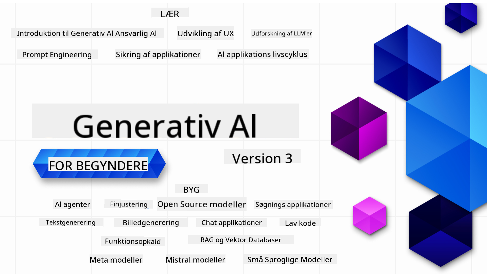

<!--
CO_OP_TRANSLATOR_METADATA:
{
  "original_hash": "6e3f4c8a4f323b8eab1cf11ded304b0f",
  "translation_date": "2025-06-25T08:00:32+00:00",
  "source_file": "README.md",
  "language_code": "da"
}
-->

### 21 Lektioner der lærer dig alt, hvad du behøver at vide for at begynde at bygge generative AI-applikationer

### 🌐 Understøttelse af flere sprog

#### Understøttet via GitHub Action (Automatisk & Altid Opdateret)

# Generativ AI for Begyndere (Version 3) - Et Kursus

Lær det grundlæggende i at bygge Generative AI-applikationer med vores omfattende 21-lektioners kursus af Microsoft Cloud Advocates.

## 🌱 Kom i gang

Dette kursus har 21 lektioner. Hver lektion dækker sit eget emne, så start hvor du vil!

Lektioner er enten mærket som "Lær" lektioner, der forklarer et Generativ AI-koncept, eller "Byg" lektioner, der forklarer et koncept og kodeeksempler i både **Python** og **TypeScript**, når det er muligt.

For .NET-udviklere, tjek [Generativ AI for Begyndere (.NET Edition)](https://github.com/microsoft/Generative-AI-for-beginners-dotnet?WT.mc_id=academic-105485-koreyst)!

Hver lektion inkluderer også en "Fortsæt med at lære" sektion med yderligere læringsværktøjer.

## Hvad du har brug for
### For at køre koden i dette kursus, kan du bruge enten:
- [Azure OpenAI Service](https://aka.ms/genai-beginners/azure-open-ai?WT.mc_id=academic-105485-koreyst) - **Lektioner:** "aoai-assignment"
- [GitHub Marketplace Model Catalog](https://aka.ms/genai-beginners/gh-models?WT.mc_id=academic-105485-koreyst) - **Lektioner:** "githubmodels"
- [OpenAI API](https://aka.ms/genai-beginners/open-ai?WT.mc_id=academic-105485-koreyst) - **Lektioner:** "oai-assignment"

- Grundlæggende kendskab til Python eller TypeScript er nyttigt - \*For absolutte begyndere, tjek disse [Python](https://aka.ms/genai-beginners/python?WT.mc_id=academic-105485-koreyst) og [TypeScript](https://aka.ms/genai-beginners/typescript?WT.mc_id=academic-105485-koreyst) kurser
- En GitHub-konto for at [forke dette hele repo](https://aka.ms/genai-beginners/github?WT.mc_id=academic-105485-koreyst) til din egen GitHub-konto

Vi har oprettet en **[Kursusopsætning](./00-course-setup/README.md?WT.mc_id=academic-105485-koreyst)** lektion for at hjælpe dig med at opsætte dit udviklingsmiljø.

Glem ikke at [stjerne (🌟) dette repo](https://docs.github.com/en/get-started/exploring-projects-on-github/saving-repositories-with-stars?WT.mc_id=academic-105485-koreyst) for at finde det lettere senere.

## 🧠 Klar til at implementere?

Hvis du leder efter mere avancerede kodeeksempler, så tjek vores [samling af Generative AI-kodeeksempler](https://aka.ms/genai-beg-code?WT.mc_id=academic-105485-koreyst) i både **Python** og **TypeScript**.

## 🗣️ Mød andre elever, få support

Deltag i vores [officielle Azure AI Foundry Discord-server](https://aka.ms/genai-discord?WT.mc_id=academic-105485-koreyst) for at møde og netværke med andre elever, der tager dette kursus, og få support.

Stil spørgsmål eller del produktfeedback i vores [Azure AI Foundry Developer Forum](https://aka.ms/azureaifoundry/forum) på Github.

## 🚀 Bygger du en startup?

Tilmeld dig [Microsoft for Startups Founders Hub](https://aka.ms/genai-foundershub?WT.mc_id=academic-105485-koreyst) for at modtage **gratis OpenAI-kreditter** og op til **$150k mod Azure-kreditter for at få adgang til OpenAI-modeller gennem Azure OpenAI Services**.

## 🙏 Vil du hjælpe?

Har du forslag eller fundet stavefejl eller kodefejl? [Opret et issue](https://github.com/microsoft/generative-ai-for-beginners/issues?WT.mc_id=academic-105485-koreyst) eller [Opret en pull request](https://github.com/microsoft/generative-ai-for-beginners/pulls?WT.mc_id=academic-105485-koreyst)

## 📂 Hver lektion inkluderer:

- En kort videointroduktion til emnet
- En skriftlig lektion placeret i README
- Python og TypeScript kodeeksempler, der understøtter Azure OpenAI og OpenAI API
- Links til ekstra ressourcer for at fortsætte din læring

## 🗃️ Lektioner

| #   | **Lektionslink**                                                                                                                              | **Beskrivelse**                                                                                 | **Video**                                                                   | **Ekstra læring**                                                             |
| --- | -------------------------------------------------------------------------------------------------------------------------------------------- | ----------------------------------------------------------------------------------------------- | --------------------------------------------------------------------------- | ------------------------------------------------------------------------------ |
| 00  | [Kursusopsætning](./00-course-setup/README.md?WT.mc_id=academic-105485-koreyst)                                                                 | **Lær:** Hvordan du opsætter dit udviklingsmiljø                                            | Video kommer snart                                                                 | [Lær mere](https://aka.ms/genai-collection?WT.mc_id=academic-105485-koreyst) |
| 01  | [Introduktion til Generativ AI og LLMs](./01-introduction-to-genai/README.md?WT.mc_id=academic-105485-koreyst)                              | **Lær:** Forståelse af hvad Generativ AI er, og hvordan Store Sproglige Modeller (LLMs) fungerer       | [Video](https://aka.ms/gen-ai-lesson-1-gh?WT.mc_id=academic-105485-koreyst) | [Lær mere](https://aka.ms/genai-collection?WT.mc_id=academic-105485-koreyst) |
| 02  | [Udforskning og sammenligning af forskellige LLMs](./02-exploring-and-comparing-different-llms/README.md?WT.mc_id=academic-105485-koreyst)             | **Lær:** Hvordan man vælger den rigtige model til din brugssag                                      | [Video](https://aka.ms/gen-ai-lesson2-gh?WT.mc_id=academic-105485-koreyst)  | [Lær mere](https://aka.ms/genai-collection?WT.mc_id=academic-105485-koreyst) |
| 03  | [Brug af Generativ AI Ansvarligt](./03-using-generative-ai-responsibly/README.md?WT.mc_id=academic-105485-koreyst)                           | **Lær:** Hvordan man bygger Generativ AI-applikationer ansvarligt                                  | [Video](https://aka.ms/gen-ai-lesson3-gh?WT.mc_id=academic-105485-koreyst)  | [Lær mere](https://aka.ms/genai-collection?WT.mc_id=academic-105485-koreyst) |
| 04  | [Forståelse af Grundlæggende Prompt Engineering](./04-prompt-engineering-fundamentals/README.md?WT.mc_id=academic-105485-koreyst)             | **Lær:** Praktiske bedste praksis for Prompt Engineering                                           | [Video](https://aka.ms/gen-ai-lesson4-gh?WT.mc_id=academic-105485-koreyst)  | [Lær mere](https://aka.ms/genai-collection?WT.mc_id=academic-105485-koreyst) |
| 05  | [Oprettelse af Avancerede Prompts](./05-advanced-prompts/README.md?WT.mc_id=academic-105485-koreyst)                                                | **Lær:** Hvordan man anvender prompt engineering-teknikker, der forbedrer resultatet af dine prompts. | [Video](https://aka.ms/gen-ai-lesson5-gh?WT.mc_id=academic-105485-koreyst)  | [Lær Mere](https://aka.ms/genai-collection?WT.mc_id=academic-105485-koreyst) |
| 06  | [Bygning af Tekstgenereringsapplikationer](./06-text-generation-apps/README.md?WT.mc_id=academic-105485-koreyst)                                | **Byg:** En tekstgenereringsapp ved hjælp af Azure OpenAI / OpenAI API                                | [Video](https://aka.ms/gen-ai-lesson6-gh?WT.mc_id=academic-105485-koreyst)  | [Lær Mere](https://aka.ms/genai-collection?WT.mc_id=academic-105485-koreyst) |
| 07  | [Bygning af Chatapplikationer](./07-building-chat-applications/README.md?WT.mc_id=academic-105485-koreyst)                                     | **Byg:** Teknikker til effektivt at bygge og integrere chatapplikationer.               | [Video](https://aka.ms/gen-ai-lessons7-gh?WT.mc_id=academic-105485-koreyst) | [Lær Mere](https://aka.ms/genai-collection?WT.mc_id=academic-105485-koreyst) |
| 08  | [Bygning af Søgeapps med Vektordatabaser](./08-building-search-applications/README.md?WT.mc_id=academic-105485-koreyst)                        | **Byg:** En søgeapplikation, der bruger Embeddings til at søge efter data.                        | [Video](https://aka.ms/gen-ai-lesson8-gh?WT.mc_id=academic-105485-koreyst)  | [Lær Mere](https://aka.ms/genai-collection?WT.mc_id=academic-105485-koreyst) |
| 09  | [Bygning af Billedgenereringsapplikationer](./09-building-image-applications/README.md?WT.mc_id=academic-105485-koreyst)                        | **Byg:** En billedgenereringsapplikation                                                       | [Video](https://aka.ms/gen-ai-lesson9-gh?WT.mc_id=academic-105485-koreyst)  | [Lær Mere](https://aka.ms/genai-collection?WT.mc_id=academic-105485-koreyst) |
| 10  | [Bygning af Low Code AI Applikationer](./10-building-low-code-ai-applications/README.md?WT.mc_id=academic-105485-koreyst)                       | **Byg:** En Generativ AI-applikation ved hjælp af Low Code værktøjer                                     | [Video](https://aka.ms/gen-ai-lesson10-gh?WT.mc_id=academic-105485-koreyst) | [Lær Mere](https://aka.ms/genai-collection?WT.mc_id=academic-105485-koreyst) |
| 11  | [Integration af Eksterne Applikationer med Funktionskald](./11-integrating-with-function-calling/README.md?WT.mc_id=academic-105485-koreyst) | **Byg:** Hvad er funktionskald og dets anvendelsesmuligheder for applikationer                          | [Video](https://aka.ms/gen-ai-lesson11-gh?WT.mc_id=academic-105485-koreyst) | [Lær Mere](https://aka.ms/genai-collection?WT.mc_id=academic-105485-koreyst) |
| 12  | [Design af UX til AI Applikationer](./12-designing-ux-for-ai-applications/README.md?WT.mc_id=academic-105485-koreyst)                         | **Lær:** Hvordan man anvender UX-designprincipper, når man udvikler Generative AI Applikationer         | [Video](https://aka.ms/gen-ai-lesson12-gh?WT.mc_id=academic-105485-koreyst) | [Lær Mere](https://aka.ms/genai-collection?WT.mc_id=academic-105485-koreyst) |
| 13  | [Sikring af Dine Generative AI Applikationer](./13-securing-ai-applications/README.md?WT.mc_id=academic-105485-koreyst)                         | **Lær:** Truslerne og risiciene for AI-systemer og metoder til at sikre disse systemer.             | [Video](https://aka.ms/gen-ai-lesson13-gh?WT.mc_id=academic-105485-koreyst) | [Lær Mere](https://aka.ms/genai-collection?WT.mc_id=academic-105485-koreyst) |
| 14  | [Livscyklussen for Generative AI Applikationer](./14-the-generative-ai-application-lifecycle/README.md?WT.mc_id=academic-105485-koreyst)           | **Lær:** Værktøjerne og målingerne til at håndtere LLM Livscyklus og LLMOps                         | [Video](https://aka.ms/gen-ai-lesson14-gh?WT.mc_id=academic-105485-koreyst) | [Lær Mere](https://aka.ms/genai-collection?WT.mc_id=academic-105485-koreyst) |
| 15  | [Retrieval Augmented Generation (RAG) og Vektordatabaser](./15-rag-and-vector-databases/README.md?WT.mc_id=academic-105485-koreyst)        | **Byg:** En applikation ved hjælp af en RAG-ramme til at hente indlejringer fra en vektordatabase  | [Video](https://aka.ms/gen-ai-lesson15-gh?WT.mc_id=academic-105485-koreyst) | [Lær Mere](https://aka.ms/genai-collection?WT.mc_id=academic-105485-koreyst) |
| 16  | [Open Source Modeller og Hugging Face](./16-open-source-models/README.md?WT.mc_id=academic-105485-koreyst)                                    | **Byg:** En applikation ved hjælp af open source-modeller tilgængelige på Hugging Face                    | [Video](https://aka.ms/gen-ai-lesson16-gh?WT.mc_id=academic-105485-koreyst) | [Lær Mere](https://aka.ms/genai-collection?WT.mc_id=academic-105485-koreyst) |
| 17  | [AI Agenter](./17-ai-agents/README.md?WT.mc_id=academic-105485-koreyst)                                                                       | **Byg:** En applikation ved hjælp af en AI-agentramme                                           | [Video](https://aka.ms/gen-ai-lesson17-gh?WT.mc_id=academic-105485-koreyst) | [Lær Mere](https://aka.ms/genai-collection?WT.mc_id=academic-105485-koreyst) |
| 18  | [Finjustering af LLMs](./18-fine-tuning/README.md?WT.mc_id=academic-105485-koreyst)                                                              | **Lær:** Hvad, hvorfor og hvordan man finjusterer LLMs                                            | [Video](https://aka.ms/gen-ai-lesson18-gh?WT.mc_id=academic-105485-koreyst) | [Lær Mere](https://aka.ms/genai-collection?WT.mc_id=academic-105485-koreyst) |
| 19  | [Byg med SLMs](./19-slm/README.md?WT.mc_id=academic-105485-koreyst)                                                              | **Lær:** Fordelene ved at bygge med små sprogmodeller                                            | Video Kommer Snart | [Lær Mere](https://aka.ms/genai-collection?WT.mc_id=academic-105485-koreyst) |
| 20  | [Byg med Mistral Modeller](./20-mistral/README.md?WT.mc_id=academic-105485-koreyst)                                                              | **Lær:** Egenskaberne og forskellene ved Mistral-familie modeller                                           | Video Kommer Snart | [Lær Mere](https://aka.ms/genai-collection?WT.mc_id=academic-105485-koreyst) |
| 21  | [Byg med Meta Modeller](./21-meta/README.md?WT.mc_id=academic-105485-koreyst)                                                              | **Lær:** Egenskaberne og forskellene ved Meta-familie modeller                                           | Video Kommer Snart | [Lær Mere](https://aka.ms/genai-collection?WT.mc_id=academic-105485-koreyst) |

### 🌟 Speciel tak

Speciel tak til [**John Aziz**](https://www.linkedin.com/in/john0isaac/) for at skabe alle GitHub Actions og workflows

[**Bernhard Merkle**](https://www.linkedin.com/in/bernhard-merkle-738b73/) for at lave vigtige bidrag til hver lektion for at forbedre lærings- og kodeoplevelsen. 

## 🎒 Andre Kurser

Vores team producerer andre kurser! Tjek:

- [**NY** Model Context Protocol for Begyndere](https://github.com/microsoft/mcp-for-beginners?WT.mc_id=academic-105485-koreyst)
- [AI Agenter for Begyndere](https://github.com/microsoft/ai-agents-for-beginners?WT.mc_id=academic-105485-koreyst)
- [Generativ AI for Begyndere ved hjælp af .NET](https://github.com/microsoft/Generative-AI-for-beginners-dotnet?WT.mc_id=academic-105485-koreyst)
- [Generativ AI for Begyndere ved hjælp af JavaScript](https://aka.ms/genai-js-course?WT.mc_id=academic-105485-koreyst)
- [ML for Begyndere](https://aka.ms/ml-beginners?WT.mc_id=academic-105485-koreyst)
- [Data Science for Begyndere](https://aka.ms/datascience-beginners?WT.mc_id=academic-105485-koreyst)
- [AI for Begyndere](https://aka.ms/ai-beginners?WT.mc_id=academic-105485-koreyst)
- [Cybersikkerhed for Begyndere](https://github.com/microsoft/Security-101??WT.mc_id=academic-96948-sayoung)
- [Webudvikling for Begyndere](https://aka.ms/webdev-beginners?WT.mc_id=academic-105485-koreyst)
- [IoT for Begyndere](https://aka.ms/iot-beginners?WT.mc_id=academic-105485-koreyst)
- [XR Udvikling for Begyndere](https://github.com/microsoft/xr-development-for-beginners?WT.mc_id=academic-105485-koreyst)
- [Mestre GitHub Copilot til AI Parprogrammering](https://aka.ms/GitHubCopilotAI?WT.mc_id=academic-105485-koreyst)
- [Mestre GitHub Copilot til C#/.NET Udviklere](https://github.com/microsoft/mastering-github-copilot-for-dotnet-csharp-developers?WT.mc_id=academic-105485-koreyst)
- [Vælg Dit Eget Copilot Eventyr](https://github.com/microsoft/CopilotAdventures?WT.mc_id=academic-105485-koreyst)

**Ansvarsfraskrivelse**:  
Dette dokument er blevet oversat ved hjælp af AI-oversættelsestjenesten [Co-op Translator](https://github.com/Azure/co-op-translator). Mens vi stræber efter nøjagtighed, bedes du være opmærksom på, at automatiserede oversættelser kan indeholde fejl eller unøjagtigheder. Det originale dokument på dets oprindelige sprog bør betragtes som den autoritative kilde. For kritisk information anbefales professionel menneskelig oversættelse. Vi er ikke ansvarlige for eventuelle misforståelser eller fejltolkninger, der opstår som følge af brugen af denne oversættelse.