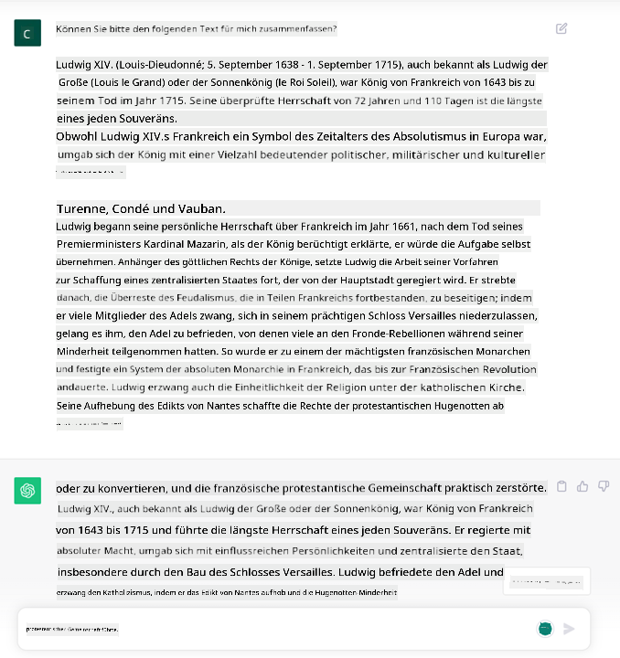
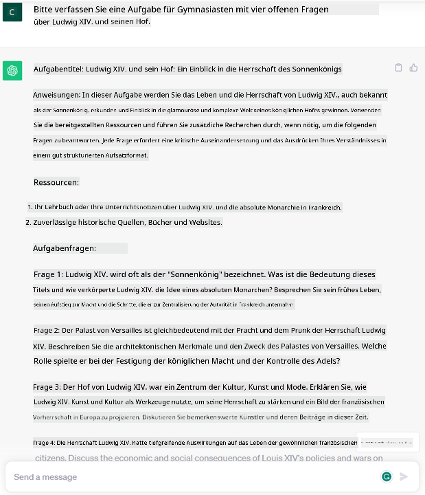
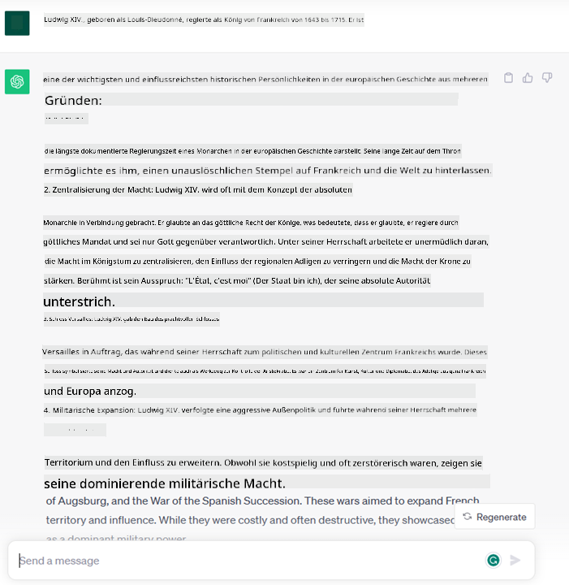
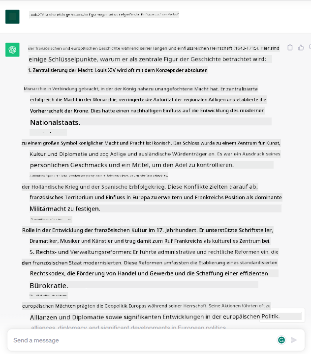
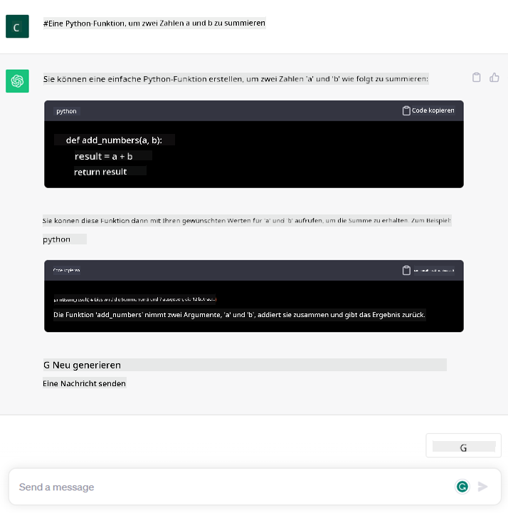

<!--
CO_OP_TRANSLATOR_METADATA:
{
  "original_hash": "f53ba0fa49164f9323043f1c6b11f2b1",
  "translation_date": "2025-05-19T09:12:42+00:00",
  "source_file": "01-introduction-to-genai/README.md",
  "language_code": "de"
}
-->
# Einführung in Generative KI und große Sprachmodelle

_(Klicken Sie auf das Bild oben, um das Video dieser Lektion anzusehen)_

Generative KI ist künstliche Intelligenz, die in der Lage ist, Text, Bilder und andere Arten von Inhalten zu erzeugen. Was sie zu einer fantastischen Technologie macht, ist, dass sie KI demokratisiert; jeder kann sie mit so wenig wie einem Text-Prompt nutzen, einem Satz in natürlicher Sprache. Es ist nicht nötig, eine Sprache wie Java oder SQL zu lernen, um etwas Bedeutendes zu erreichen. Alles, was Sie brauchen, ist Ihre Sprache zu verwenden, zu sagen, was Sie wollen, und heraus kommt ein Vorschlag von einem KI-Modell. Die Anwendungen und Auswirkungen davon sind enorm; Sie können Berichte schreiben oder verstehen, Anwendungen erstellen und vieles mehr, alles in Sekundenschnelle.

In diesem Lehrplan werden wir erkunden, wie unser Startup generative KI nutzt, um neue Szenarien in der Bildungswelt zu erschließen und wie wir die unvermeidlichen Herausforderungen im Zusammenhang mit den sozialen Auswirkungen ihrer Anwendung und den technologischen Einschränkungen angehen.

## Einführung

Diese Lektion behandelt:

- Einführung in das Geschäftsszenario: unsere Startup-Idee und Mission.
- Generative KI und wie wir in der aktuellen Technologielandschaft gelandet sind.
- Inneres Funktionieren eines großen Sprachmodells.
- Hauptfähigkeiten und praktische Anwendungsfälle von großen Sprachmodellen.

## Lernziele

Nach Abschluss dieser Lektion werden Sie verstehen:

- Was generative KI ist und wie große Sprachmodelle funktionieren.
- Wie Sie große Sprachmodelle für verschiedene Anwendungsfälle nutzen können, mit Schwerpunkt auf Bildungsszenarien.

## Szenario: unser Bildungs-Startup

Generative Künstliche Intelligenz (KI) repräsentiert den Höhepunkt der KI-Technologie und erweitert die Grenzen dessen, was einst als unmöglich galt. Generative KI-Modelle haben mehrere Fähigkeiten und Anwendungen, aber für diesen Lehrplan werden wir erkunden, wie sie die Bildung durch ein fiktives Startup revolutionieren. Wir werden dieses Startup als _unser Startup_ bezeichnen. Unser Startup arbeitet im Bildungsbereich mit der ehrgeizigen Mission,

> _die Zugänglichkeit beim Lernen auf globaler Ebene zu verbessern, einen gerechten Zugang zur Bildung zu gewährleisten und personalisierte Lernerfahrungen für jeden Lernenden entsprechend seinen Bedürfnissen zu bieten_.

Unser Startup-Team ist sich bewusst, dass wir dieses Ziel nicht ohne den Einsatz eines der mächtigsten Werkzeuge der modernen Zeit erreichen können – große Sprachmodelle (LLMs).

Generative KI wird voraussichtlich die Art und Weise revolutionieren, wie wir heute lernen und lehren, mit Schülern, die virtuelle Lehrer 24 Stunden am Tag zur Verfügung haben, die große Mengen an Informationen und Beispielen bereitstellen, und Lehrern, die innovative Werkzeuge nutzen können, um ihre Schüler zu bewerten und Feedback zu geben.

Um zu beginnen, lassen Sie uns einige grundlegende Konzepte und Begriffe definieren, die wir im gesamten Lehrplan verwenden werden.

## Wie haben wir Generative KI erhalten?

Trotz des außergewöhnlichen _Hypes_, der kürzlich durch die Ankündigung generativer KI-Modelle entstanden ist, ist diese Technologie seit Jahrzehnten in der Entwicklung, mit den ersten Forschungsbemühungen, die bis in die 60er Jahre zurückreichen. Wir sind jetzt an einem Punkt, an dem KI über menschliche kognitive Fähigkeiten verfügt, wie das Gespräch, wie es beispielsweise durch [OpenAI ChatGPT](https://openai.com/chatgpt) oder [Bing Chat](https://www.microsoft.com/edge/features/bing-chat?WT.mc_id=academic-105485-koreyst) gezeigt wird, das auch ein GPT-Modell für die Websuche Bing-Gespräche verwendet.

Ein wenig zurückblickend, bestanden die allerersten Prototypen der KI aus geschriebenen Chatbots, die auf einer Wissensbasis basierten, die aus einer Gruppe von Experten extrahiert und in einen Computer übertragen wurde. Die Antworten in der Wissensbasis wurden durch Schlüsselwörter ausgelöst, die im Eingabetext erscheinen.
Es wurde jedoch schnell klar, dass ein solcher Ansatz, der geschriebene Chatbots verwendet, nicht gut skalierbar war.

### Ein statistischer Ansatz zur KI: Maschinelles Lernen

Ein Wendepunkt kam in den 90er Jahren mit der Anwendung eines statistischen Ansatzes zur Textanalyse. Dies führte zur Entwicklung neuer Algorithmen – bekannt als maschinelles Lernen – die Muster aus Daten lernen konnten, ohne explizit programmiert zu werden. Dieser Ansatz ermöglicht es Maschinen, das Verständnis menschlicher Sprache zu simulieren: Ein statistisches Modell wird auf Text-Label-Paarungen trainiert, sodass das Modell unbekannten Eingabetext mit einem vordefinierten Label klassifizieren kann, das die Absicht der Nachricht darstellt.

### Neuronale Netze und moderne virtuelle Assistenten

In den letzten Jahren hat die technologische Entwicklung von Hardware, die größere Datenmengen und komplexere Berechnungen verarbeiten kann, die Forschung in der KI gefördert und zur Entwicklung fortschrittlicher maschineller Lernalgorithmen geführt, die als neuronale Netze oder Deep-Learning-Algorithmen bekannt sind.

Neuronale Netze (und insbesondere rekurrente neuronale Netze – RNNs) haben die Verarbeitung natürlicher Sprache erheblich verbessert, indem sie die Bedeutung von Text auf eine sinnvollere Weise darstellen und den Kontext eines Wortes in einem Satz wertschätzen.

Dies ist die Technologie, die die virtuellen Assistenten angetrieben hat, die im ersten Jahrzehnt des neuen Jahrhunderts geboren wurden, sehr geschickt darin, menschliche Sprache zu interpretieren, ein Bedürfnis zu identifizieren und eine Handlung auszuführen, um es zu befriedigen – wie zum Beispiel mit einem vordefinierten Skript zu antworten oder einen Drittanbieterdienst zu nutzen.

### Gegenwart, Generative KI

So sind wir heute zur generativen KI gekommen, die als Teilmenge des Deep Learning betrachtet werden kann.

Nach Jahrzehnten der Forschung im KI-Bereich hat eine neue Modellarchitektur – genannt _Transformer_ – die Grenzen der RNNs überwunden, indem sie viel längere Textsequenzen als Eingabe verarbeiten kann. Transformer basieren auf dem Aufmerksamkeitsmechanismus, der es dem Modell ermöglicht, den Eingaben, die es erhält, unterschiedliche Gewichtungen zu geben und dort „mehr Aufmerksamkeit“ zu schenken, wo die relevantesten Informationen konzentriert sind, unabhängig von ihrer Reihenfolge in der Textsequenz.

Die meisten der jüngsten generativen KI-Modelle – auch bekannt als große Sprachmodelle (LLMs), da sie mit Textinputs und -outputs arbeiten – basieren tatsächlich auf dieser Architektur. Was an diesen Modellen interessant ist – trainiert auf einer enormen Menge an unbeschrifteten Daten aus verschiedenen Quellen wie Büchern, Artikeln und Websites – ist, dass sie an eine Vielzahl von Aufgaben angepasst werden können und grammatisch korrekten Text mit einem Anschein von Kreativität erzeugen können. So haben sie nicht nur die Fähigkeit einer Maschine, einen Eingabetext zu „verstehen“, unglaublich verbessert, sondern auch ihre Fähigkeit, eine originelle Antwort in menschlicher Sprache zu erzeugen.

## Wie funktionieren große Sprachmodelle?

Im nächsten Kapitel werden wir verschiedene Arten von generativen KI-Modellen erkunden, aber lassen Sie uns zunächst einen Blick darauf werfen, wie große Sprachmodelle funktionieren, mit einem Fokus auf OpenAI GPT (Generative Pre-trained Transformer) Modelle.

- **Tokenizer, Text zu Zahlen**: Große Sprachmodelle erhalten einen Text als Eingabe und erzeugen einen Text als Ausgabe. Da sie jedoch statistische Modelle sind, arbeiten sie viel besser mit Zahlen als mit Textsequenzen. Deshalb wird jede Eingabe in das Modell vor der Verwendung durch das Kernmodell von einem Tokenizer verarbeitet. Ein Token ist ein Textstück – bestehend aus einer variablen Anzahl von Zeichen, sodass die Hauptaufgabe des Tokenizers darin besteht, die Eingabe in ein Array von Tokens zu unterteilen. Dann wird jedes Token mit einem Token-Index abgebildet, der die ganzzahlige Kodierung des ursprünglichen Textstücks ist.

- **Vorhersage von Ausgabetokens**: Gegeben n Tokens als Eingabe (mit maximal n, das von einem Modell zum anderen variiert), kann das Modell ein Token als Ausgabe vorhersagen. Dieses Token wird dann in die Eingabe der nächsten Iteration aufgenommen, in einem sich erweiternden Fenster-Muster, was eine bessere Benutzererfahrung ermöglicht, eine (oder mehrere) Sätze als Antwort zu erhalten. Dies erklärt, warum, wenn Sie jemals mit ChatGPT gespielt haben, Sie möglicherweise bemerkt haben, dass es manchmal mitten in einem Satz zu stoppen scheint.

- **Auswahlprozess, Wahrscheinlichkeitsverteilung**: Das Ausgabetoken wird vom Modell entsprechend seiner Wahrscheinlichkeit ausgewählt, nach der aktuellen Textsequenz aufzutreten. Dies liegt daran, dass das Modell eine Wahrscheinlichkeitsverteilung über alle möglichen „nächsten Tokens“ vorhersagt, die auf seinem Training basiert berechnet wird. Jedoch wird nicht immer das Token mit der höchsten Wahrscheinlichkeit aus der resultierenden Verteilung ausgewählt. Ein Grad an Zufälligkeit wird dieser Wahl hinzugefügt, sodass das Modell nicht-deterministisch handelt - wir erhalten nicht jedes Mal genau dieselbe Ausgabe für dieselbe Eingabe. Dieser Grad an Zufälligkeit wird hinzugefügt, um den Prozess des kreativen Denkens zu simulieren und kann mit einem Modellparameter namens Temperatur eingestellt werden.

## Wie kann unser Startup große Sprachmodelle nutzen?

Jetzt, da wir ein besseres Verständnis für das innere Funktionieren eines großen Sprachmodells haben, lassen Sie uns einige praktische Beispiele der häufigsten Aufgaben sehen, die sie ziemlich gut ausführen können, mit einem Auge auf unser Geschäftsszenario.
Wir haben gesagt, dass die Hauptfähigkeit eines großen Sprachmodells darin besteht, _einen Text von Grund auf zu erzeugen, beginnend mit einem Textinput, der in natürlicher Sprache geschrieben ist_.

Aber welche Art von Textinput und -output?
Der Input eines großen Sprachmodells ist als Prompt bekannt, während der Output als Completion bekannt ist, ein Begriff, der sich auf den Mechanismus des Modells bezieht, den nächsten Token zu erzeugen, um den aktuellen Input zu vervollständigen. Wir werden tief in das Thema eintauchen, was ein Prompt ist und wie man es gestaltet, um das Beste aus unserem Modell herauszuholen. Aber für jetzt, lassen Sie uns einfach sagen, dass ein Prompt Folgendes enthalten kann:

- Eine **Anweisung**, die die Art des Outputs spezifiziert, den wir vom Modell erwarten. Diese Anweisung kann manchmal einige Beispiele oder zusätzliche Daten enthalten.

  1. Zusammenfassung eines Artikels, Buches, Produktbewertungen und mehr, zusammen mit der Extraktion von Erkenntnissen aus unstrukturierten Daten.
    
    
  
  2. Kreative Ideenfindung und Gestaltung eines Artikels, Essays, einer Aufgabe oder mehr.
      
     

- Eine **Frage**, gestellt in Form eines Gesprächs mit einem Agenten.
  
  

- Ein Stück **Text zum Vervollständigen**, das implizit eine Bitte um Schreibunterstützung ist.
  
  

- Ein Stück **Code** zusammen mit der Bitte, ihn zu erklären und zu dokumentieren, oder ein Kommentar, der darum bittet, ein Stück Code zu erzeugen, das eine bestimmte Aufgabe erfüllt.
  
  

Die oben genannten Beispiele sind ziemlich einfach und sollen keine umfassende Demonstration der Fähigkeiten von großen Sprachmodellen sein. Sie sollen das Potenzial der Nutzung generativer KI zeigen, insbesondere aber nicht ausschließlich in Bildungskontexten.

Außerdem ist der Output eines generativen KI-Modells nicht perfekt und manchmal kann die Kreativität des Modells gegen es arbeiten, was zu einem Output führt, der eine Kombination von Worten ist, die der menschliche Benutzer als Mystifikation der Realität interpretieren kann, oder es kann beleidigend sein. Generative KI ist nicht intelligent – zumindest nicht im umfassenderen Sinne von Intelligenz, einschließlich kritischem und kreativem Denken oder emotionaler Intelligenz; sie ist nicht deterministisch und nicht vertrauenswürdig, da Fälschungen, wie fehlerhafte Referenzen, Inhalte und Aussagen, mit korrekten Informationen kombiniert und auf eine überzeugende und selbstbewusste Weise präsentiert werden können. In den folgenden Lektionen werden wir uns mit all diesen Einschränkungen auseinandersetzen und sehen, was wir tun können, um sie zu mildern.

## Aufgabe

Ihre Aufgabe ist es, mehr über [generative KI](https://en.wikipedia.org/wiki/Generative_artificial_intelligence?WT.mc_id=academic-105485-koreyst) zu lesen und zu versuchen, einen Bereich zu identifizieren, in dem Sie heute generative KI hinzufügen würden, die sie nicht hat. Wie wäre der Einfluss anders als auf die "alte Weise", können Sie etwas tun, was Sie vorher nicht konnten, oder sind Sie schneller? Schreiben Sie eine 300-Wort-Zusammenfassung darüber, wie Ihr Traum-KI-Startup aussehen würde und fügen Sie Überschriften wie "Problem", "Wie ich KI nutzen würde", "Auswirkungen" und optional einen Geschäftsplan hinzu.

Wenn Sie diese Aufgabe erledigt haben, könnten Sie sogar bereit sein, sich bei Microsofts Inkubator zu bewerben, [Microsoft für Startups Founders Hub](https://www.microsoft.com/startups?WT.mc_id=academic-105485-koreyst) wir bieten Credits für Azure, OpenAI, Mentoring und vieles mehr, schauen Sie es sich an!

## Wissensüberprüfung

Was ist wahr über große Sprachmodelle?

1. Sie erhalten jedes Mal genau dieselbe Antwort.
1. Es macht alles perfekt, großartig beim Addieren von Zahlen, produziert funktionierenden Code usw.
1. Die Antwort kann variieren, obwohl derselbe Prompt verwendet wird. Es ist auch großartig darin, Ihnen einen ersten Entwurf von etwas zu geben, sei es Text oder Code. Aber Sie müssen die Ergebnisse verbessern.

A: 3, ein LLM ist nicht-deterministisch, die Antwort variiert, jedoch können Sie seine Varianz über eine Temperatureinstellung steuern. Sie sollten auch nicht erwarten, dass es Dinge perfekt macht, es ist hier, um die schwere Arbeit für Sie zu erledigen, was oft bedeutet, dass Sie einen guten ersten Versuch bekommen, den Sie schrittweise verbessern müssen.

## Gute Arbeit! Setzen Sie die Reise fort

Nachdem Sie diese Lektion abgeschlossen haben, schauen Sie sich unsere [Generative KI Lernsammlung](https://aka.ms/genai-collection?WT.mc_id=academic-105485-koreyst) an, um Ihr Wissen über Generative KI weiter zu vertiefen!

Gehen Sie zu Lektion 2, wo wir uns ansehen, wie man [verschiedene LLM-Typen erkundet und vergleicht](../02-exploring-and-comparing-different-llms/README.md?WT.mc_id=academic-105485-koreyst)!

**Haftungsausschluss**:  
Dieses Dokument wurde mit dem KI-Übersetzungsdienst [Co-op Translator](https://github.com/Azure/co-op-translator) übersetzt. Obwohl wir uns um Genauigkeit bemühen, beachten Sie bitte, dass automatisierte Übersetzungen Fehler oder Ungenauigkeiten enthalten können. Das Originaldokument in seiner ursprünglichen Sprache sollte als maßgebliche Quelle betrachtet werden. Für kritische Informationen wird eine professionelle menschliche Übersetzung empfohlen. Wir haften nicht für Missverständnisse oder Fehlinterpretationen, die sich aus der Verwendung dieser Übersetzung ergeben.