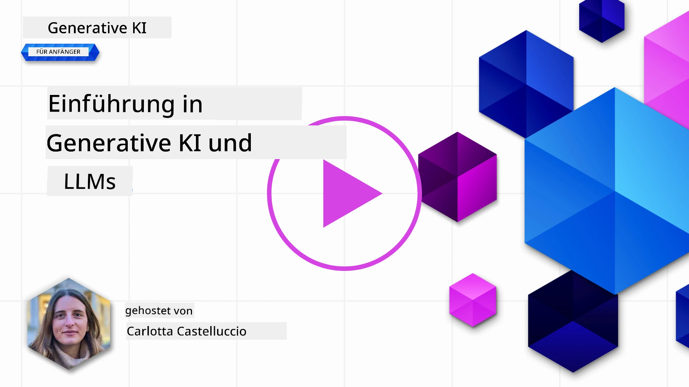
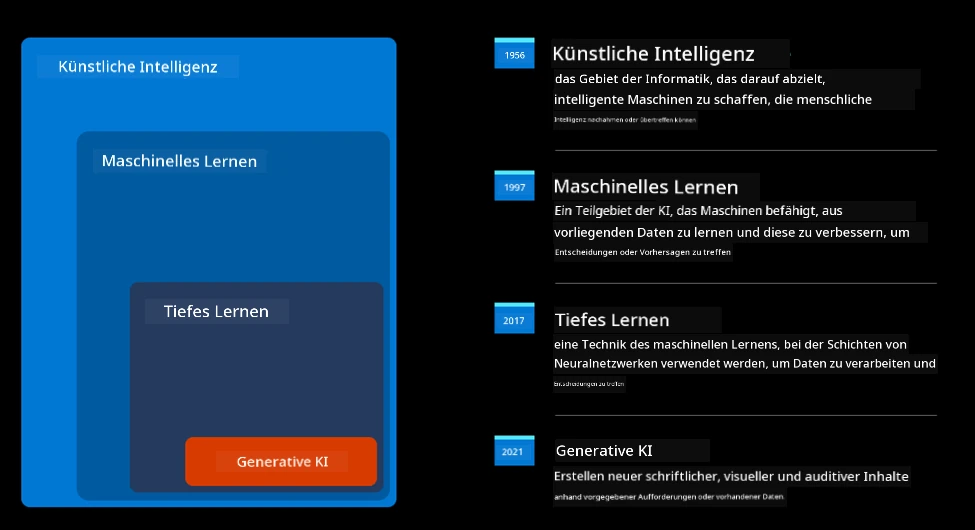
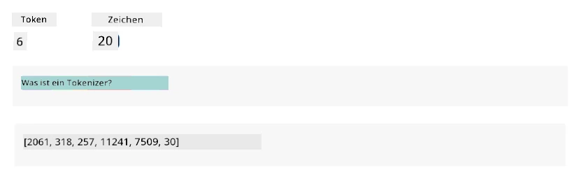
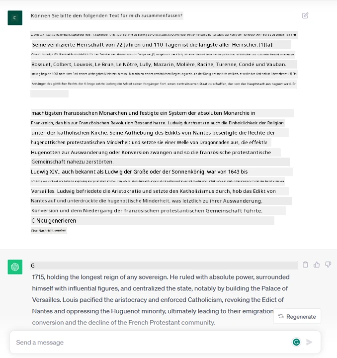
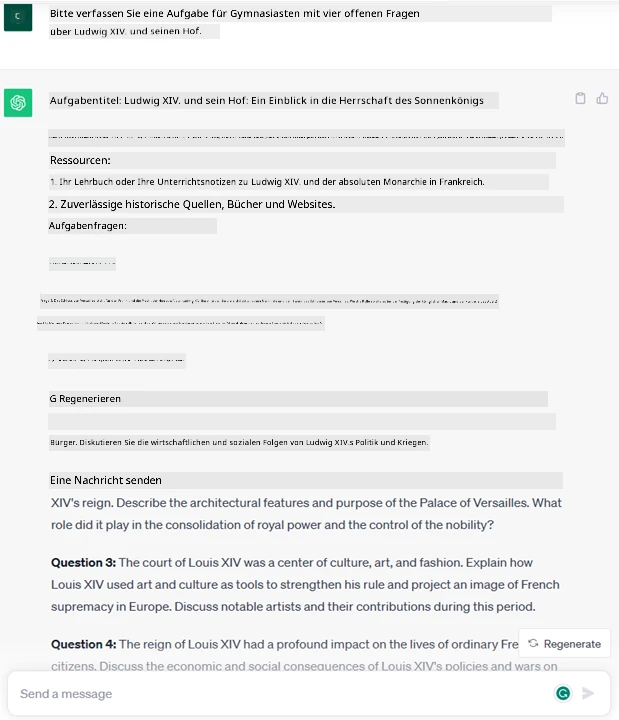
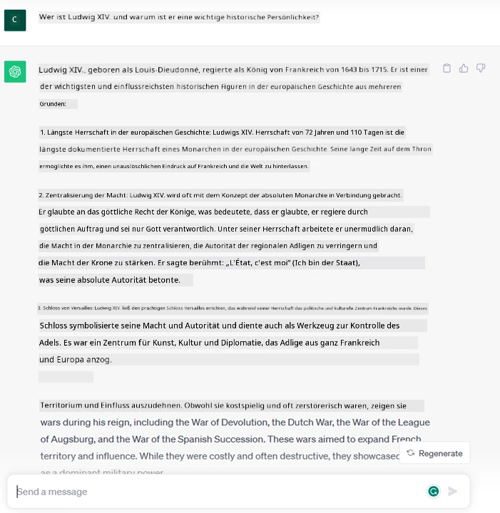
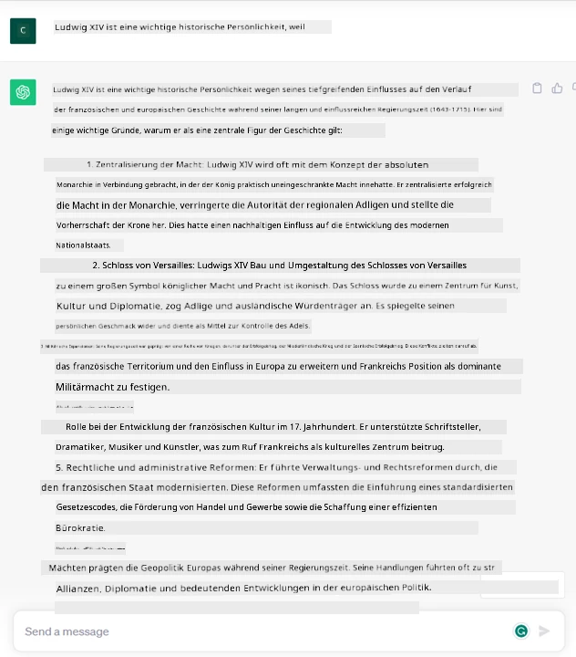
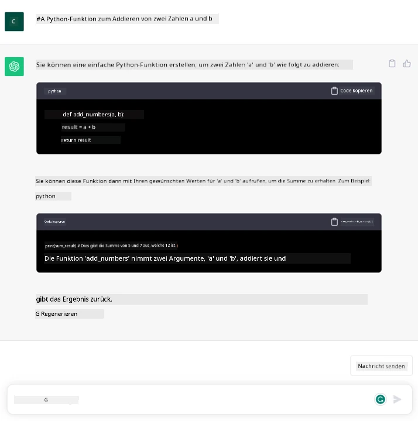

# Einführung in Generative KI und Große Sprachmodelle

_(Klicken Sie auf das Bild oben, um das Video zu dieser Lektion anzusehen)_

Generative KI ist künstliche Intelligenz, die in der Lage ist, Texte, Bilder und andere Arten von Inhalten zu erzeugen. Was sie zu einer fantastischen Technologie macht, ist, dass sie KI demokratisiert: Jeder kann sie mit nur einer Texteingabe, einem Satz in einer natürlichen Sprache, nutzen. Es ist nicht nötig, Sprachen wie Java oder SQL zu lernen, um etwas Wertvolles zu schaffen, alles was Sie brauchen, ist Ihre Sprache zu verwenden, anzugeben, was Sie wollen, und es erscheint ein Vorschlag von einem KI-Modell. Die Anwendungen und Auswirkungen sind enorm: Sie schreiben oder verstehen Berichte, erstellen Bewerbungen und vieles mehr – alles in Sekunden.

In diesem Lehrplan werden wir erforschen, wie unser Startup generative KI nutzt, um neue Szenarien im Bildungsbereich zu erschließen und wie wir die unvermeidlichen Herausforderungen im Zusammenhang mit den sozialen Implikationen ihrer Anwendung und den technologischen Begrenzungen angehen.

## Einführung

Diese Lektion umfasst:

- Einführung in das Geschäftsszenario: unsere Startup-Idee und Mission.
- Generative KI und wie wir zur aktuellen Technologielandschaft gelangt sind.
- Funktionsweise eines großen Sprachmodells.
- Hauptfähigkeiten und praktische Anwendungsfälle großer Sprachmodelle.

## Lernziele

Nach Abschluss dieser Lektion werden Sie verstehen:

- Was generative KI ist und wie große Sprachmodelle funktionieren.
- Wie Sie große Sprachmodelle für verschiedene Anwendungsfälle nutzen können, mit Schwerpunkt auf Bildungsszenarien.

## Szenario: unser Bildungs-Startup

Generative Künstliche Intelligenz (KI) stellt den Höhepunkt der KI-Technologie dar und verschiebt die Grenzen dessen, was einst für unmöglich gehalten wurde. Generative KI-Modelle haben zahlreiche Fähigkeiten und Anwendungen, aber in diesem Lehrplan werden wir untersuchen, wie sie das Bildungswesen durch ein fiktives Startup revolutioniert. Wir nennen dieses Startup _unser Startup_. Unser Startup arbeitet im Bildungsbereich mit der ehrgeizigen Mission:

> _die Zugänglichkeit zum Lernen global zu verbessern, Chancengleichheit im Bildungswesen zu gewährleisten und jedem Lernenden personalisierte Lernerfahrungen entsprechend seinen Bedürfnissen zu bieten_.

Unser Startup-Team weiß, dass wir dieses Ziel nicht ohne die Nutzung eines der mächtigsten Werkzeuge der modernen Zeit erreichen können – große Sprachmodelle (LLMs).

Es wird erwartet, dass generative KI die Art und Weise, wie wir heute lernen und lehren, revolutioniert, wobei Schüler rund um die Uhr virtuelle Lehrer zur Verfügung haben, die große Mengen an Informationen und Beispielen liefern, und Lehrkräfte innovative Werkzeuge nutzen können, um ihre Schüler zu bewerten und Feedback zu geben.

Beginnen wir damit, einige grundlegende Konzepte und Begriffe zu definieren, die wir im Verlauf des Lehrplans verwenden werden.

## Wie kamen wir zur Generativen KI?

Trotz des außerordentlichen _Hypes_, der zuletzt durch die Ankündigung generativer KI-Modelle entstanden ist, ist diese Technologie Jahrzehnte in Entwicklung, mit den ersten Forschungsbemühungen, die bis in die 60er Jahre zurückreichen. Wir befinden uns heute an einem Punkt, an dem KI menschliche kognitive Fähigkeiten besitzt, wie Konversation, gezeigt beispielsweise durch [OpenAI ChatGPT](https://openai.com/chatgpt) oder [Microsoft Copilot](https://copilot.microsoft.com/?WT.mc_id=academic-105485-koreyst), das ebenfalls ein GPT-Modell für seine konversationelle Websucherfahrung nutzt.

Noch einmal zurück: Die allerersten Prototypen von KI bestanden aus geschriebenen Chatbots, die auf einer Wissensbasis beruhten, die von einer Expertengruppe extrahiert und in einem Computer repräsentiert wurde. Die Antworten in der Wissensbasis wurden durch Schlüsselwörter ausgelöst, die im Eingabetext auftauchten.
Es wurde jedoch schnell klar, dass ein solcher Ansatz mit geschriebenen Chatbots nicht gut skalierte.

### Ein statistischer Ansatz zur KI: Maschinelles Lernen

Ein Wendepunkt kam in den 90er Jahren mit der Anwendung eines statistischen Ansatzes zur Textanalyse. Dies führte zur Entwicklung neuer Algorithmen – bekannt als Machine Learning – die in der Lage sind, Muster aus Daten zu lernen, ohne explizit programmiert zu sein. Dieser Ansatz erlaubt Maschinen, das Verständnis von menschlicher Sprache zu simulieren: Ein statistisches Modell wird auf Text-Label-Paaren trainiert, sodass das Modell unbekannten Eingabetext mit einem vorgegebenen Label klassifizieren kann, das die Absicht der Nachricht repräsentiert.

### Neuronale Netze und moderne virtuelle Assistenten

In den letzten Jahren förderte die technologische Weiterentwicklung der Hardware, die größere Datenmengen und komplexere Berechnungen bewältigen kann, die KI-Forschung. Dies führte zur Entwicklung fortschrittlicher Machine-Learning-Algorithmen, bekannt als neuronale Netze oder Deep-Learning-Algorithmen.

Neuronale Netze (insbesondere Recurrent Neural Networks – RNNs) verbesserten die natürliche Sprachverarbeitung erheblich, da sie die Bedeutung von Text auf sinnvollere Weise darstellen können, indem sie den Kontext eines Wortes im Satz berücksichtigen.

Dies ist die Technologie, die die virtuellen Assistenten unterstützt, die in der ersten Dekade des neuen Jahrhunderts entstanden sind. Diese sind sehr kompetent darin, menschliche Sprache zu interpretieren, einen Bedarf zu erkennen und eine Handlung auszuführen – etwa durch vordefinierte Skripte oder Nutzung eines Drittanbieterdienstes.

### Heutzutage: Generative KI

So kamen wir heute zur Generativen KI, die als ein Teilbereich des Deep Learning gesehen werden kann.

Nach Jahrzehnten der Forschung im Bereich KI überwand eine neue Modellarchitektur – genannt _Transformer_ – die Grenzen der RNNs, indem sie deutlich längere Textsequenzen als Eingabe verarbeiten kann. Transformer basieren auf dem Aufmerksamkeitsmechanismus, der es dem Modell ermöglicht, den empfangenen Eingaben unterschiedliche Gewichtungen zu geben, indem es dort „mehr Aufmerksamkeit schenkt“, wo die relevantesten Informationen konzentriert sind, unabhängig von ihrer Reihenfolge in der Textsequenz.

Die meisten der aktuellen generativen KI-Modelle – auch bekannt als Große Sprachmodelle (LLMs), da sie mit textuellen Ein- und Ausgaben arbeiten – basieren tatsächlich auf dieser Architektur. Interessant an diesen Modellen ist, dass sie auf einer riesigen Menge unbeschrifteter Daten aus diversen Quellen wie Büchern, Artikeln und Webseiten trainiert wurden und sich auf eine Vielzahl von Aufgaben anpassen lassen und grammatikalisch korrekten Text mit einem Anschein von Kreativität erzeugen können. Sie haben also nicht nur die Fähigkeit einer Maschine, Eingabetext zu „verstehen“, enorm verbessert, sondern auch ihre Fähigkeit, eine originelle Antwort in menschlicher Sprache zu generieren.

## Wie funktionieren große Sprachmodelle?

Im nächsten Kapitel werden wir verschiedene Arten generativer KI-Modelle erkunden, aber zunächst betrachten wir, wie große Sprachmodelle funktionieren, mit einem Fokus auf OpenAI GPT (Generative Pre-trained Transformer) Modelle.

- **Tokenizer, Text zu Zahlen**: Große Sprachmodelle erhalten Text als Eingabe und erzeugen Text als Ausgabe. Da sie jedoch statistische Modelle sind, arbeiten sie viel besser mit Zahlen als mit Textsequenzen. Deshalb wird jede Eingabe vom Modell zuerst von einem Tokenizer verarbeitet, bevor sie vom Kernmodell genutzt wird. Ein Token ist ein Textabschnitt – bestehend aus einer variablen Anzahl an Zeichen, daher besteht die Hauptaufgabe des Tokenizers darin, die Eingabe in ein Array von Tokens zu zerlegen. Danach wird jedem Token ein Tokenindex zugeordnet, der die ganzzahlige Kodierung des ursprünglichen Textabschnitts darstellt.

- **Vorhersage von Ausgabetokens**: Bei n Tokens als Eingabe (mit variiertem maximalem n je nach Modell) ist das Modell in der Lage, ein Token als Ausgabe vorherzusagen. Dieses Token wird dann in die Eingabe der nächsten Iteration eingebaut, in einem expandierenden Fenster, was ein besseres Nutzungserlebnis ermöglicht, indem eine oder mehrere Sätze als Antwort entstehen. Das erklärt, warum, wenn Sie jemals mit ChatGPT gespielt haben, manchmal der Eindruck entsteht, dass es mitten in einem Satz aufhört.

- **Auswahlprozess, Wahrscheinlichkeitsverteilung**: Das Ausgabetoken wird vom Modell entsprechend seiner Wahrscheinlichkeit gewählt, nach der aktuellen Textsequenz aufzutreten. Dies beruht darauf, dass das Modell eine Wahrscheinlichkeitsverteilung für alle möglichen „nächsten Tokens“ prognostiziert, basierend auf seinem Training. Dabei wird jedoch nicht immer das Token mit der höchsten Wahrscheinlichkeit ausgewählt. Dem Auswahlprozess wird ein Grad an Zufälligkeit hinzugefügt, sodass das Modell nicht-deterministisch agiert – die gleiche Eingabe erzeugt nicht exakt die gleiche Ausgabe. Diese Zufälligkeit soll den kreativen Denkprozess simulieren und kann mithilfe des Modellparameters „Temperatur“ gesteuert werden.

## Wie kann unser Startup Große Sprachmodelle nutzen?

Jetzt, wo wir ein besseres Verständnis der Funktionsweise großer Sprachmodelle haben, sehen wir uns einige praktische Beispiele für die häufigsten Aufgaben an, die sie sehr gut ausführen können, mit Blick auf unser Geschäftsszenario.
Wir sagten, die Hauptfähigkeit eines großen Sprachmodells bestehe darin, _einen Text von Grund auf zu generieren, ausgehend von einer Texteingabe in natürlicher Sprache_.

Aber welche Art von Texteingabe und -ausgabe?
Die Eingabe eines großen Sprachmodells wird als Prompt bezeichnet, während die Ausgabe Completion genannt wird, ein Begriff, der sich auf den Mechanismus des Modells bezieht, das nächste Token zu generieren, um die aktuelle Eingabe zu vervollständigen. Wir werden uns eingehend damit beschäftigen, was ein Prompt ist und wie man ihn gestaltet, um das Maximum aus unserem Modell herauszuholen. Aber vorerst sagen wir einfach, ein Prompt kann enthalten:

- Eine **Anweisung**, die angibt, welche Art von Ausgabe wir vom Modell erwarten. Diese Anweisung kann manchmal Beispiele oder zusätzliche Daten enthalten.

  1. Zusammenfassung eines Artikels, Buches, Produktbewertungen und mehr, sowie Extrahieren von Erkenntnissen aus unstrukturierten Daten.
    
    
  
  2. Kreative Ideenfindung und Gestaltung eines Artikels, Essays, einer Hausarbeit oder mehr.
      
     

- Eine **Frage**, gestellt in Form eines Gesprächs mit einem Agenten.
  
  

- Ein Abschnitt von **Text zur Vervollständigung**, der implizit eine Anfrage nach Schreibunterstützung darstellt.
  
  

- Ein Abschnitt von **Code** mit der Bitte, ihn zu erklären und zu dokumentieren oder ein Kommentar mit der Aufforderung, ein Stück Code zu erzeugen, das eine bestimmte Aufgabe ausführt.
  
  

Die obigen Beispiele sind recht einfach und sollen keine umfassende Darstellung der Fähigkeiten großer Sprachmodelle sein. Sie dienen dazu, das Potenzial generativer KI, speziell aber nicht ausschließlich im Bildungsbereich, zu zeigen.

Außerdem ist die Ausgabe eines generativen KI-Modells nicht perfekt, und manchmal kann die Kreativität des Modells gegen es wirken, was zu einer Ausgabe führt, die der menschliche Nutzer als Verzerrung der Realität interpretieren kann oder gar als beleidigend. Generative KI ist nicht intelligent – zumindest nicht im umfassenderen Sinn von Intelligenz, die kritisches und kreatives Denken oder emotionale Intelligenz einschließt; sie ist nicht deterministisch und nicht vertrauenswürdig, da Fehlinformationen wie falsche Quellenangaben, Inhalte und Aussagen mit korrekten Informationen vermischt und überzeugend präsentiert werden können. In den folgenden Lektionen werden wir uns mit all diesen Einschränkungen befassen und sehen, was wir tun können, um sie zu mildern.

## Aufgabe

Ihre Aufgabe ist es, sich weiter über [generative KI](https://en.wikipedia.org/wiki/Generative_artificial_intelligence?WT.mc_id=academic-105485-koreyst) zu informieren und einen Bereich zu identifizieren, in dem Sie heute generative KI hinzufügen würden, wo sie noch nicht vorhanden ist. Wie würde sich der Einfluss gegenüber der „alten“ Methode unterscheiden? Können Sie etwas tun, was vorher nicht möglich war, oder sind Sie schneller? Schreiben Sie eine 300-Wörter-Zusammenfassung darüber, wie Ihr Traum-KI-Startup aussehen würde, und fügen Sie Überschriften wie „Problem“, „Wie ich KI nutzen würde“, „Auswirkung“ und optional einen Geschäftsplan hinzu.

Wenn Sie diese Aufgabe gemacht haben, könnten Sie sogar bereit sein, sich für Microsofts Inkubator zu bewerben, [Microsoft for Startups Founders Hub](https://www.microsoft.com/startups?WT.mc_id=academic-105485-koreyst) – wir bieten Credits für Azure, OpenAI, Mentoring und vieles mehr, schauen Sie dort vorbei!

## Wissenscheck

Was trifft auf große Sprachmodelle zu?

1. Sie erhalten jedes Mal genau dieselbe Antwort.
1. Sie machen alles perfekt, sind großartig im Addieren von Zahlen, produzieren funktionierenden Code usw.
1. Die Antwort kann trotz der gleichen Eingabe variieren. Sie sind auch sehr gut darin, Ihnen einen ersten Entwurf von etwas zu geben, sei es Text oder Code. Aber Sie müssen das Ergebnis verbessern.

A: 3, ein LLM ist nicht-deterministisch, die Antwort variiert, allerdings kann man deren Varianz über den Temperatur-Parameter steuern. Man sollte auch nicht erwarten, dass es alles perfekt macht, es übernimmt die schwere Arbeit und liefert meist einen guten ersten Versuch, den Sie nach und nach verbessern können.

## Toll gemacht! Setzen Sie Ihren Weg fort

Nach Abschluss dieser Lektion sehen Sie sich unsere [Generative AI Learning collection](https://aka.ms/genai-collection?WT.mc_id=academic-105485-koreyst) an, um Ihr Wissen über Generative KI weiter zu vertiefen!

Gehen Sie zu Lektion 2, in der wir uns ansehen, wie man [verschiedene LLM-Typen erkundet und vergleicht](../02-exploring-and-comparing-different-llms/README.md?WT.mc_id=academic-105485-koreyst)!

---

<!-- CO-OP TRANSLATOR DISCLAIMER START -->
**Haftungsausschluss**:
Dieses Dokument wurde mit dem KI-Übersetzungsdienst [Co-op Translator](https://github.com/Azure/co-op-translator) übersetzt. Obwohl wir uns um Genauigkeit bemühen, beachten Sie bitte, dass automatisierte Übersetzungen Fehler oder Ungenauigkeiten enthalten können. Das Originaldokument in seiner Ursprungssprache gilt als maßgebliche Quelle. Bei kritischen Informationen wird eine professionelle menschliche Übersetzung empfohlen. Wir übernehmen keine Haftung für Missverständnisse oder Fehlinterpretationen, die aus der Verwendung dieser Übersetzung entstehen.
<!-- CO-OP TRANSLATOR DISCLAIMER END -->