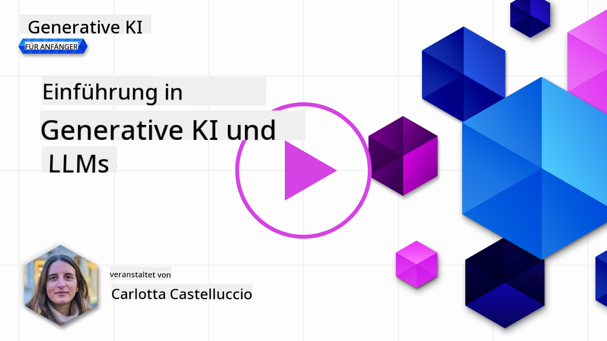
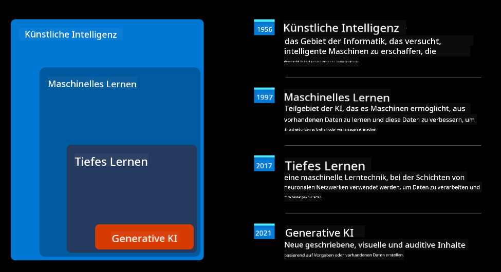
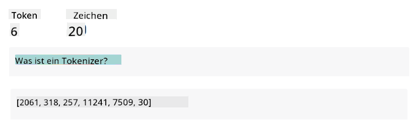
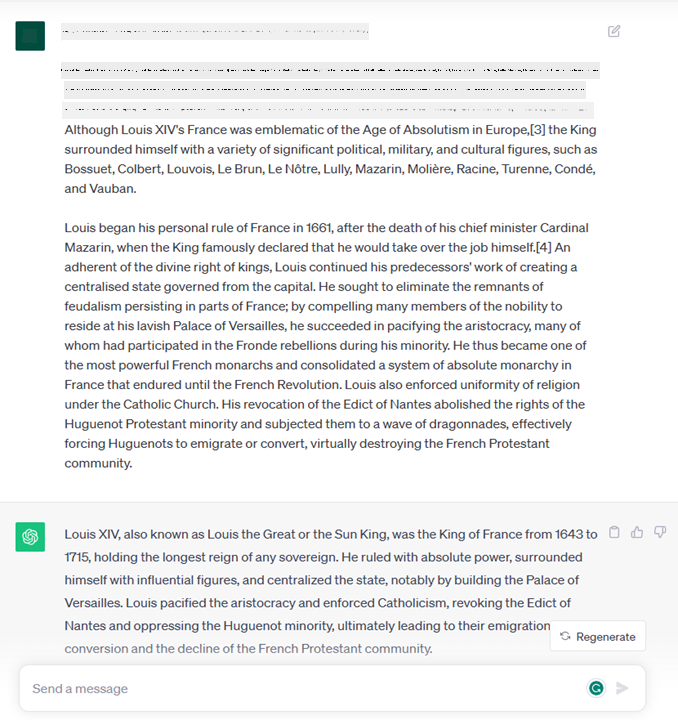
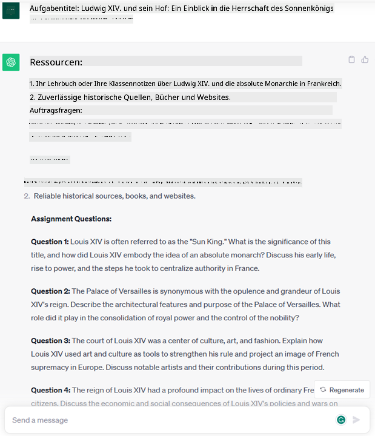
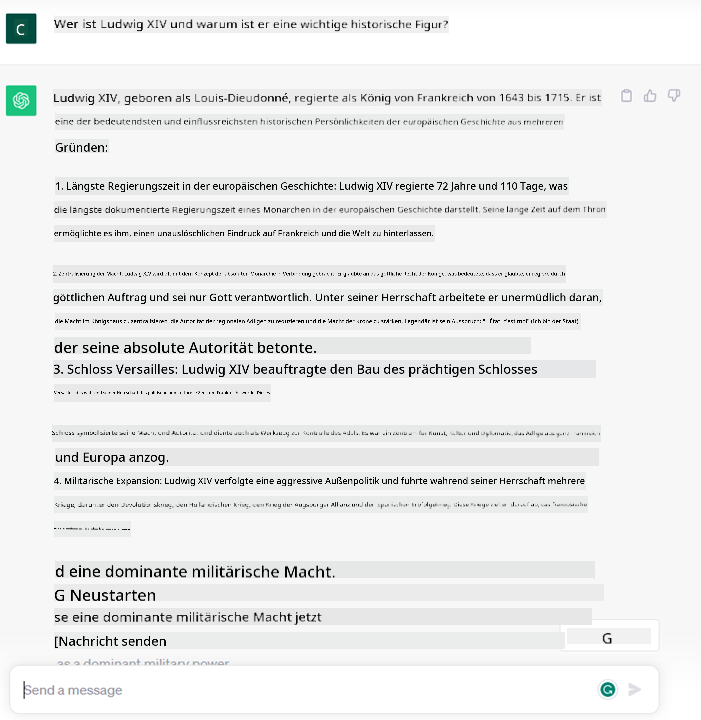
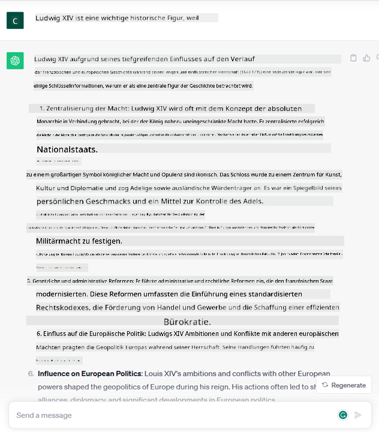
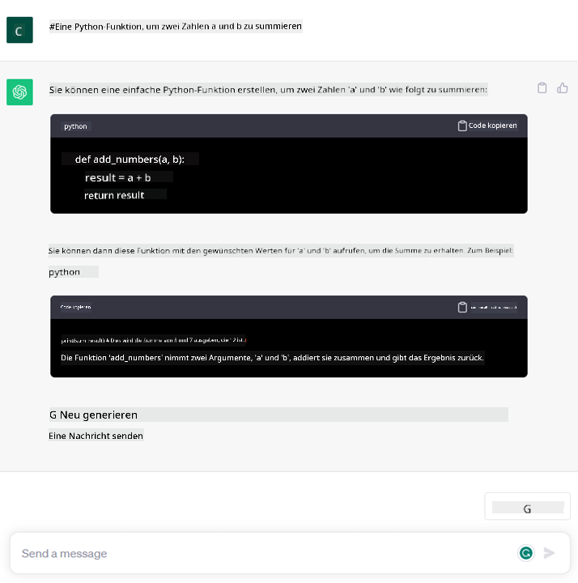

<!--
CO_OP_TRANSLATOR_METADATA:
{
  "original_hash": "f53ba0fa49164f9323043f1c6b11f2b1",
  "translation_date": "2025-06-25T09:35:50+00:00",
  "source_file": "01-introduction-to-genai/README.md",
  "language_code": "de"
}
-->
# Einführung in Generative KI und Große Sprachmodelle

_(Klicken Sie auf das obige Bild, um das Video zu dieser Lektion anzusehen)_

Generative KI ist eine künstliche Intelligenz, die in der Lage ist, Texte, Bilder und andere Arten von Inhalten zu erzeugen. Was diese Technologie so fantastisch macht, ist, dass sie KI demokratisiert: Jeder kann sie mit einem einfachen Textbefehl nutzen, einem Satz in natürlicher Sprache. Es ist nicht nötig, eine Sprache wie Java oder SQL zu lernen, um etwas Wertvolles zu erreichen. Alles, was Sie brauchen, ist Ihre Sprache, um auszudrücken, was Sie wollen, und ein KI-Modell gibt einen Vorschlag. Die Anwendungen und Auswirkungen davon sind enorm: Sie können Berichte schreiben oder verstehen, Anwendungen erstellen und vieles mehr, alles in Sekundenschnelle.

In diesem Lehrplan werden wir untersuchen, wie unser Startup generative KI nutzt, um neue Szenarien in der Bildungswelt zu erschließen und wie wir die unvermeidlichen Herausforderungen im Zusammenhang mit den sozialen Implikationen ihrer Anwendung und den technologischen Einschränkungen angehen.

## Einführung

Diese Lektion wird Folgendes abdecken:

- Einführung in das Geschäftsszenario: unsere Startup-Idee und Mission.
- Generative KI und wie wir zur aktuellen Technologielandschaft gekommen sind.
- Funktionsweise eines großen Sprachmodells.
- Hauptfähigkeiten und praktische Anwendungsfälle von Großen Sprachmodellen.

## Lernziele

Nach Abschluss dieser Lektion werden Sie verstehen:

- Was generative KI ist und wie Große Sprachmodelle funktionieren.
- Wie Sie Große Sprachmodelle für verschiedene Anwendungsfälle nutzen können, mit Fokus auf Bildungsszenarien.

## Szenario: unser Bildungs-Startup

Generative Künstliche Intelligenz (KI) stellt den Höhepunkt der KI-Technologie dar und überschreitet die Grenzen dessen, was einst für unmöglich gehalten wurde. Generative KI-Modelle haben mehrere Fähigkeiten und Anwendungen, aber in diesem Lehrplan werden wir untersuchen, wie sie die Bildung durch ein fiktives Startup revolutioniert. Wir werden dieses Startup als _unser Startup_ bezeichnen. Unser Startup arbeitet im Bildungsbereich mit der ehrgeizigen Mission,

> _die Zugänglichkeit beim Lernen weltweit zu verbessern, den gleichberechtigten Zugang zur Bildung sicherzustellen und jedem Lernenden personalisierte Lernerfahrungen entsprechend seinen Bedürfnissen zu bieten_.

Unser Startup-Team ist sich bewusst, dass wir dieses Ziel nicht erreichen können, ohne eines der mächtigsten Werkzeuge der modernen Zeit zu nutzen – Große Sprachmodelle (LLMs).

Generative KI wird voraussichtlich die Art und Weise, wie wir heute lernen und lehren, revolutionieren. Schüler haben rund um die Uhr Zugang zu virtuellen Lehrern, die große Mengen an Informationen und Beispielen bereitstellen, und Lehrer können innovative Werkzeuge nutzen, um ihre Schüler zu bewerten und Feedback zu geben.

Beginnen wir damit, einige grundlegende Konzepte und Begriffe zu definieren, die wir im gesamten Lehrplan verwenden werden.

## Wie haben wir generative KI bekommen?

Trotz des außergewöhnlichen _Hypes_, der kürzlich durch die Ankündigung generativer KI-Modelle erzeugt wurde, ist diese Technologie seit Jahrzehnten in der Entwicklung, wobei die ersten Forschungsbemühungen bis in die 60er Jahre zurückreichen. Wir sind jetzt an einem Punkt angelangt, an dem KI menschliche kognitive Fähigkeiten hat, wie z.B. Konversation, wie sie z.B. von [OpenAI ChatGPT](https://openai.com/chatgpt) oder [Bing Chat](https://www.microsoft.com/edge/features/bing-chat?WT.mc_id=academic-105485-koreyst) gezeigt wird, das ebenfalls ein GPT-Modell für die Websuche von Bing-Konversationen verwendet.

Wenn wir ein wenig zurückblicken, bestanden die allerersten Prototypen von KI aus schriftlichen Chatbots, die auf einer Wissensbasis basierten, die aus einer Expertengruppe extrahiert und in einem Computer dargestellt wurde. Die Antworten in der Wissensbasis wurden durch Schlüsselwörter im Eingabetext ausgelöst. Es wurde jedoch schnell klar, dass ein solcher Ansatz mit schriftlichen Chatbots nicht gut skalierte.

### Ein statistischer Ansatz zur KI: Maschinelles Lernen

Ein Wendepunkt kam in den 90er Jahren mit der Anwendung eines statistischen Ansatzes zur Textanalyse. Dies führte zur Entwicklung neuer Algorithmen – bekannt als Maschinelles Lernen – die in der Lage waren, Muster aus Daten zu lernen, ohne explizit programmiert zu werden. Dieser Ansatz ermöglicht es Maschinen, das menschliche Sprachverständnis zu simulieren: Ein statistisches Modell wird auf Text-Label-Paarungen trainiert, wodurch das Modell unbekannten Eingabetext mit einem vordefinierten Label klassifizieren kann, das die Absicht der Nachricht darstellt.

### Neuronale Netze und moderne virtuelle Assistenten

In den letzten Jahren hat die technologische Entwicklung von Hardware, die in der Lage ist, größere Datenmengen und komplexere Berechnungen zu verarbeiten, die Forschung im Bereich der KI gefördert und zur Entwicklung fortschrittlicher maschineller Lernalgorithmen geführt, die als neuronale Netze oder Deep-Learning-Algorithmen bekannt sind.

Neuronale Netze (und insbesondere Rekurrente Neuronale Netze – RNNs) haben die Verarbeitung natürlicher Sprache erheblich verbessert, indem sie die Bedeutung von Text auf eine bedeutungsvollere Weise darstellen und den Kontext eines Wortes in einem Satz bewerten.

Dies ist die Technologie, die die virtuellen Assistenten antrieb, die im ersten Jahrzehnt des neuen Jahrhunderts entstanden sind und sehr geschickt darin waren, menschliche Sprache zu interpretieren, ein Bedürfnis zu erkennen und eine Aktion auszuführen, um es zu erfüllen – wie z.B. mit einem vordefinierten Skript zu antworten oder einen Drittanbieter-Dienst zu nutzen.

### Gegenwart, Generative KI

So sind wir heute zur Generativen KI gekommen, die als Teilbereich des Deep Learning angesehen werden kann.

Nach jahrzehntelanger Forschung im KI-Bereich überwand eine neue Modellarchitektur – genannt _Transformer_ – die Grenzen der RNNs, indem sie viel längere Textsequenzen als Eingabe verarbeiten konnte. Transformer basieren auf dem Aufmerksamkeitsmechanismus, der es dem Modell ermöglicht, den Eingaben, die es erhält, unterschiedliche Gewichtungen zu geben, und sich auf die Stellen zu konzentrieren, an denen die relevantesten Informationen konzentriert sind, unabhängig von ihrer Reihenfolge in der Textsequenz.

Die meisten der neuesten generativen KI-Modelle – auch bekannt als Große Sprachmodelle (LLMs), da sie mit textuellen Eingaben und Ausgaben arbeiten – basieren tatsächlich auf dieser Architektur. Interessant an diesen Modellen – die auf einer großen Menge unbeschrifteter Daten aus verschiedenen Quellen wie Büchern, Artikeln und Websites trainiert wurden – ist, dass sie an eine Vielzahl von Aufgaben angepasst werden können und grammatikalisch korrekten Text mit einem Anschein von Kreativität erzeugen können. Sie haben nicht nur die Fähigkeit einer Maschine, einen Eingabetext zu „verstehen“, erheblich verbessert, sondern auch ihre Fähigkeit, eine originelle Antwort in menschlicher Sprache zu generieren.

## Wie funktionieren große Sprachmodelle?

Im nächsten Kapitel werden wir verschiedene Arten von Generativen KI-Modellen erkunden, aber schauen wir uns zunächst an, wie große Sprachmodelle funktionieren, mit einem Fokus auf die OpenAI GPT (Generative Pre-trained Transformer) Modelle.

- **Tokenizer, Text zu Zahlen**: Große Sprachmodelle erhalten einen Text als Eingabe und erzeugen einen Text als Ausgabe. Da es sich jedoch um statistische Modelle handelt, arbeiten sie mit Zahlen besser als mit Textsequenzen. Deshalb wird jede Eingabe in das Modell von einem Tokenizer verarbeitet, bevor sie vom Kernmodell verwendet wird. Ein Token ist ein Textstück – bestehend aus einer variablen Anzahl von Zeichen, sodass die Hauptaufgabe des Tokenizers darin besteht, die Eingabe in ein Array von Tokens zu zerlegen. Dann wird jedes Token mit einem Token-Index abgebildet, der die ganzzahlige Codierung des ursprünglichen Textstücks ist.

- **Vorhersage von Ausgabetokens**: Gegeben n Tokens als Eingabe (mit maximal n variierend von einem Modell zum anderen), ist das Modell in der Lage, ein Token als Ausgabe vorherzusagen. Dieses Token wird dann in die Eingabe der nächsten Iteration integriert, in einem sich erweiternden Fenster, was eine bessere Benutzererfahrung ermöglicht, indem eine (oder mehrere) Sätze als Antwort erhalten werden. Das erklärt, warum, wenn Sie jemals mit ChatGPT gespielt haben, es manchmal so aussieht, als würde es mitten in einem Satz aufhören.

- **Auswahlprozess, Wahrscheinlichkeitsverteilung**: Das Ausgabetoken wird vom Modell entsprechend seiner Wahrscheinlichkeit ausgewählt, nach der aktuellen Textsequenz zu erscheinen. Das liegt daran, dass das Modell eine Wahrscheinlichkeitsverteilung über alle möglichen „nächsten Tokens“ vorhersagt, die auf seinem Training basiert. Allerdings wird nicht immer das Token mit der höchsten Wahrscheinlichkeit aus der resultierenden Verteilung ausgewählt. Ein Grad an Zufälligkeit wird dieser Wahl hinzugefügt, sodass das Modell nicht-deterministisch handelt - wir erhalten nicht jedes Mal die gleiche Ausgabe für die gleiche Eingabe. Dieser Grad an Zufälligkeit wird hinzugefügt, um den kreativen Denkprozess zu simulieren, und kann mit einem Modellparameter namens Temperatur eingestellt werden.

## Wie kann unser Startup Große Sprachmodelle nutzen?

Jetzt, da wir ein besseres Verständnis der Funktionsweise eines großen Sprachmodells haben, lassen Sie uns einige praktische Beispiele der häufigsten Aufgaben sehen, die sie ziemlich gut ausführen können, mit einem Blick auf unser Geschäftsszenario. Wir sagten, dass die Hauptfähigkeit eines großen Sprachmodells darin besteht, _einen Text von Grund auf zu erzeugen, beginnend mit einer textuellen Eingabe, die in natürlicher Sprache geschrieben ist_.

Aber welche Art von textueller Eingabe und Ausgabe?
Die Eingabe eines großen Sprachmodells ist als Prompt bekannt, während die Ausgabe als Completion bekannt ist, ein Begriff, der sich auf den Mechanismus des Modells bezieht, das nächste Token zu generieren, um die aktuelle Eingabe zu vervollständigen. Wir werden tief in die Frage eintauchen, was ein Prompt ist und wie man es so gestaltet, dass man das Beste aus unserem Modell herausholt. Aber für den Moment sei gesagt, dass ein Prompt Folgendes enthalten kann:

- Eine **Anweisung**, die den Typ der Ausgabe spezifiziert, die wir vom Modell erwarten. Diese Anweisung kann manchmal einige Beispiele oder zusätzliche Daten einbetten.

  1. Zusammenfassung eines Artikels, Buches, Produktbewertungen und mehr, zusammen mit der Extraktion von Erkenntnissen aus unstrukturierten Daten.
    
    
  
  2. Kreative Ideenfindung und Gestaltung eines Artikels, Essays, Auftrags oder mehr.
      
     

- Eine **Frage**, gestellt in Form eines Gesprächs mit einem Agenten.
  
  

- Ein Textstück, das **vervollständigt** werden soll, was implizit eine Bitte um Schreibunterstützung ist.
  
  

- Ein **Codeabschnitt** zusammen mit der Bitte, ihn zu erklären und zu dokumentieren, oder ein Kommentar, der darum bittet, ein Stück Code zu generieren, das eine bestimmte Aufgabe erfüllt.
  
  

Die obigen Beispiele sind recht einfach und sollen keine umfassende Demonstration der Fähigkeiten von Großen Sprachmodellen sein. Sie sollen das Potenzial der Nutzung generativer KI aufzeigen, insbesondere, aber nicht ausschließlich, in Bildungskontexten.

Auch ist die Ausgabe eines generativen KI-Modells nicht perfekt und manchmal kann die Kreativität des Modells gegen es arbeiten, was zu einer Ausgabe führt, die eine Kombination von Wörtern ist, die der menschliche Benutzer als Mystifikation der Realität interpretieren kann, oder sie kann beleidigend sein. Generative KI ist nicht intelligent - zumindest nicht in der umfassenderen Definition von Intelligenz, einschließlich kritischem und kreativem Denken oder emotionaler Intelligenz; sie ist nicht deterministisch und sie ist nicht vertrauenswürdig, da Erfindungen, wie fehlerhafte Referenzen, Inhalte und Aussagen, mit korrekten Informationen kombiniert und in überzeugender und selbstbewusster Weise präsentiert werden können. In den folgenden Lektionen werden wir uns mit all diesen Einschränkungen befassen und sehen, was wir tun können, um sie zu mildern.

## Aufgabe

Ihre Aufgabe besteht darin, mehr über [generative KI](https://de.wikipedia.org/wiki/Generative_artificial_intelligence?WT.mc_id=academic-105485-koreyst) zu lesen und zu versuchen, einen Bereich zu identifizieren, in dem Sie heute generative KI hinzufügen würden, der sie noch nicht hat. Wie wäre der Unterschied im Vergleich zur "alten Methode", können Sie etwas tun, was Sie vorher nicht konnten, oder sind Sie schneller? Schreiben Sie eine 300-Wörter-Zusammenfassung darüber, wie Ihr Traum-KI-Startup aussehen würde, und fügen Sie Überschriften wie "Problem", "Wie ich KI nutzen würde", "Auswirkungen" und optional einen Geschäftsplan hinzu.

Wenn Sie diese Aufgabe erledigt haben, könnten Sie sogar bereit sein, sich bei Microsofts Inkubator, [Microsoft for Startups Founders Hub](https://www.microsoft.com/startups?WT.mc_id=academic-105485-koreyst) zu bewerben. Wir bieten Credits für Azure, OpenAI, Mentoring und vieles mehr an, schauen Sie es sich an!

## Wissensüberprüfung

Was stimmt über große Sprachmodelle?

1. Sie erhalten jedes Mal genau die gleiche Antwort.
2. Es macht alles perfekt, großartig im Addieren von Zahlen, Erzeugen von funktionierendem Code usw.
3. Die Antwort kann variieren, obwohl derselbe Prompt verwendet wird. Es ist auch großartig, um Ihnen einen ersten Entwurf von etwas zu geben, sei es Text oder Code. Aber Sie müssen die Ergebnisse verbessern.

A: 3, ein LLM ist nicht-deterministisch, die Antwort variiert, jedoch können Sie seine Varianz über eine Temperatureinstellung steuern. Sie sollten auch nicht erwarten, dass es Dinge perfekt macht, es ist hier, um die schwere Arbeit für Sie zu übernehmen, was oft bedeutet, dass Sie einen guten ersten Versuch bei etwas erhalten, das Sie schrittweise verbessern müssen.

## Großartige Arbeit! Setzen Sie die Reise fort

Nach Abschluss dieser Lektion schauen Sie sich unsere [Generative KI-Lernsammlung](https://aka.ms/genai-collection?WT.mc_id=academic-105485-koreyst) an, um Ihr Wissen über Generative KI weiter zu vertiefen!

Gehen Sie zu Lektion 2, wo wir uns ansehen, wie man [verschiedene LLM-Typen erkundet und vergleicht](../02-exploring-and-comparing-different-llms/README.md?WT.mc_id=academic-105485-koreyst)!

**Haftungsausschluss**:  
Dieses Dokument wurde mit dem KI-Übersetzungsdienst [Co-op Translator](https://github.com/Azure/co-op-translator) übersetzt. Obwohl wir uns um Genauigkeit bemühen, beachten Sie bitte, dass automatisierte Übersetzungen Fehler oder Ungenauigkeiten enthalten können. Das Originaldokument in seiner ursprünglichen Sprache sollte als maßgebliche Quelle betrachtet werden. Für kritische Informationen wird eine professionelle menschliche Übersetzung empfohlen. Wir übernehmen keine Haftung für Missverständnisse oder Fehlinterpretationen, die sich aus der Verwendung dieser Übersetzung ergeben.