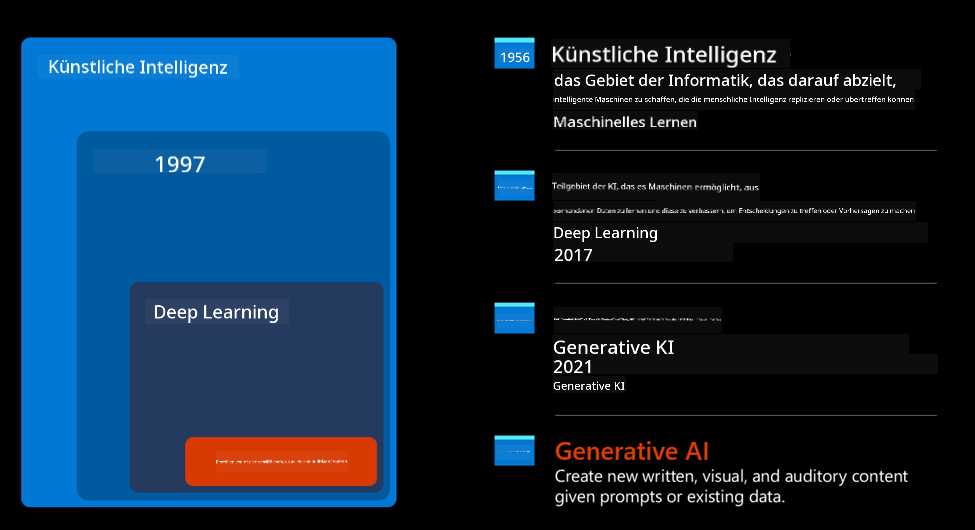
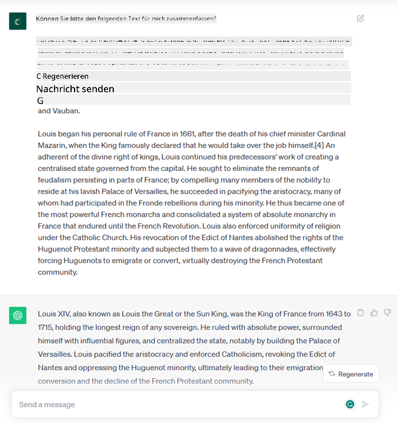

<!--
CO_OP_TRANSLATOR_METADATA:
{
  "original_hash": "bfb7901bdbece1ba3e9f35c400ca33e8",
  "translation_date": "2025-10-17T22:59:15+00:00",
  "source_file": "01-introduction-to-genai/README.md",
  "language_code": "de"
}
-->
# Einführung in Generative KI und große Sprachmodelle

_(Klicken Sie auf das Bild oben, um das Video zu dieser Lektion anzusehen)_

Generative KI ist eine künstliche Intelligenz, die in der Lage ist, Texte, Bilder und andere Arten von Inhalten zu generieren. Was diese Technologie so fantastisch macht, ist, dass sie KI demokratisiert: Jeder kann sie mit nur einem Textbefehl nutzen, einem Satz, der in natürlicher Sprache geschrieben ist. Es ist nicht notwendig, eine Programmiersprache wie Java oder SQL zu lernen, um etwas Wertvolles zu erreichen. Alles, was Sie tun müssen, ist, Ihre Sprache zu verwenden, zu sagen, was Sie möchten, und ein KI-Modell liefert Ihnen einen Vorschlag. Die Anwendungen und Auswirkungen sind enorm: Berichte schreiben oder verstehen, Anwendungen erstellen und vieles mehr – alles in Sekundenschnelle.

In diesem Lehrplan werden wir untersuchen, wie unser Startup generative KI nutzt, um neue Szenarien in der Bildungswelt zu erschließen, und wie wir die unvermeidlichen Herausforderungen im Zusammenhang mit den sozialen Auswirkungen ihrer Anwendung und den technologischen Einschränkungen angehen.

## Einführung

Diese Lektion behandelt:

- Einführung in das Geschäftsszenario: unsere Startup-Idee und Mission.
- Generative KI und wie wir zur aktuellen Technologielandschaft gelangt sind.
- Funktionsweise eines großen Sprachmodells.
- Hauptfähigkeiten und praktische Anwendungsfälle von großen Sprachmodellen.

## Lernziele

Nach Abschluss dieser Lektion werden Sie verstehen:

- Was generative KI ist und wie große Sprachmodelle funktionieren.
- Wie Sie große Sprachmodelle für verschiedene Anwendungsfälle nutzen können, mit einem Schwerpunkt auf Bildungsszenarien.

## Szenario: unser Bildungs-Startup

Generative Künstliche Intelligenz (KI) stellt den Höhepunkt der KI-Technologie dar und erweitert die Grenzen dessen, was einst als unmöglich galt. Generative KI-Modelle haben zahlreiche Fähigkeiten und Anwendungen, aber in diesem Lehrplan werden wir untersuchen, wie sie die Bildung durch ein fiktives Startup revolutionieren. Wir werden dieses Startup als _unser Startup_ bezeichnen. Unser Startup arbeitet im Bildungsbereich mit der ehrgeizigen Mission:

> _die Zugänglichkeit des Lernens weltweit zu verbessern, einen gerechten Zugang zur Bildung zu gewährleisten und jedem Lernenden personalisierte Lernerfahrungen entsprechend seinen Bedürfnissen zu bieten_.

Unser Startup-Team ist sich bewusst, dass wir dieses Ziel nicht ohne die Nutzung eines der mächtigsten Werkzeuge der heutigen Zeit – große Sprachmodelle (LLMs) – erreichen können.

Generative KI wird voraussichtlich die Art und Weise, wie wir heute lernen und lehren, revolutionieren. Schüler haben rund um die Uhr virtuelle Lehrer zur Verfügung, die ihnen eine Fülle von Informationen und Beispielen bieten, und Lehrer können innovative Werkzeuge nutzen, um ihre Schüler zu bewerten und Feedback zu geben.

Beginnen wir damit, einige grundlegende Konzepte und Begriffe zu definieren, die wir im gesamten Lehrplan verwenden werden.

## Wie entstand Generative KI?

Trotz des außergewöhnlichen _Hypes_, der in letzter Zeit durch die Ankündigung generativer KI-Modelle ausgelöst wurde, ist diese Technologie seit Jahrzehnten in Entwicklung, wobei die ersten Forschungsbemühungen bis in die 60er Jahre zurückreichen. Wir befinden uns jetzt an einem Punkt, an dem KI über menschliche kognitive Fähigkeiten verfügt, wie z. B. Konversation, wie sie beispielsweise von [OpenAI ChatGPT](https://openai.com/chatgpt) oder [Bing Chat](https://www.microsoft.com/edge/features/bing-chat?WT.mc_id=academic-105485-koreyst) gezeigt wird, das ebenfalls ein GPT-Modell für die Websuche und Bing-Gespräche verwendet.

Wenn wir ein wenig zurückblicken, bestanden die allerersten Prototypen von KI aus schriftlichen Chatbots, die auf einer Wissensbasis basierten, die aus einer Gruppe von Experten extrahiert und in einem Computer dargestellt wurde. Die Antworten in der Wissensbasis wurden durch Schlüsselwörter ausgelöst, die im Eingabetext erschienen.
Es wurde jedoch schnell klar, dass ein solcher Ansatz mit schriftlichen Chatbots nicht gut skalierbar war.

### Ein statistischer Ansatz für KI: Maschinelles Lernen

Ein Wendepunkt kam in den 90er Jahren mit der Anwendung eines statistischen Ansatzes zur Textanalyse. Dies führte zur Entwicklung neuer Algorithmen – bekannt als maschinelles Lernen –, die in der Lage waren, Muster aus Daten zu lernen, ohne explizit programmiert zu werden. Dieser Ansatz ermöglicht es Maschinen, das menschliche Sprachverständnis zu simulieren: Ein statistisches Modell wird mit Text-Label-Paaren trainiert, wodurch das Modell unbekannten Eingabetext mit einem vordefinierten Label klassifizieren kann, das die Absicht der Nachricht repräsentiert.

### Neuronale Netze und moderne virtuelle Assistenten

In den letzten Jahren hat die technologische Entwicklung von Hardware, die größere Datenmengen und komplexere Berechnungen verarbeiten kann, die Forschung in der KI vorangetrieben und zur Entwicklung fortschrittlicher maschineller Lernalgorithmen geführt, die als neuronale Netze oder Deep-Learning-Algorithmen bekannt sind.

Neuronale Netze (insbesondere rekurrente neuronale Netze – RNNs) haben die Verarbeitung natürlicher Sprache erheblich verbessert, indem sie die Bedeutung von Text auf eine sinnvollere Weise darstellen und den Kontext eines Wortes in einem Satz berücksichtigen.

Diese Technologie hat die virtuellen Assistenten ermöglicht, die im ersten Jahrzehnt des neuen Jahrhunderts entstanden sind und sehr geschickt darin sind, menschliche Sprache zu interpretieren, ein Bedürfnis zu erkennen und eine Aktion auszuführen, um dieses Bedürfnis zu erfüllen – wie das Beantworten mit einem vordefinierten Skript oder die Nutzung eines Drittanbieterdienstes.

### Heute: Generative KI

So sind wir heute bei der Generativen KI angekommen, die als Teilbereich des Deep Learning betrachtet werden kann.

Nach Jahrzehnten der Forschung im Bereich der KI hat eine neue Modellarchitektur – genannt _Transformer_ – die Grenzen der RNNs überwunden, indem sie viel längere Textsequenzen als Eingabe verarbeiten kann. Transformer basieren auf dem Attention-Mechanismus, der es dem Modell ermöglicht, den Eingaben, die es erhält, unterschiedliche Gewichtungen zuzuweisen und „mehr Aufmerksamkeit“ dort zu schenken, wo die relevantesten Informationen konzentriert sind, unabhängig von ihrer Reihenfolge in der Textsequenz.

Die meisten der aktuellen generativen KI-Modelle – auch bekannt als große Sprachmodelle (LLMs), da sie mit textuellen Eingaben und Ausgaben arbeiten – basieren tatsächlich auf dieser Architektur. Interessant an diesen Modellen – die auf einer riesigen Menge an nicht gekennzeichneten Daten aus verschiedenen Quellen wie Büchern, Artikeln und Websites trainiert wurden – ist, dass sie an eine Vielzahl von Aufgaben angepasst werden können und grammatikalisch korrekten Text mit einem Anschein von Kreativität generieren können. Sie haben nicht nur die Fähigkeit einer Maschine, einen Eingabetext zu „verstehen“, erheblich verbessert, sondern auch ihre Fähigkeit, eine originelle Antwort in menschlicher Sprache zu generieren.

## Wie funktionieren große Sprachmodelle?

Im nächsten Kapitel werden wir verschiedene Arten von generativen KI-Modellen untersuchen, aber vorerst werfen wir einen Blick darauf, wie große Sprachmodelle funktionieren, mit einem Fokus auf die OpenAI GPT (Generative Pre-trained Transformer) Modelle.

- **Tokenizer, Text in Zahlen umwandeln**: Große Sprachmodelle erhalten einen Text als Eingabe und generieren einen Text als Ausgabe. Da es sich jedoch um statistische Modelle handelt, arbeiten sie viel besser mit Zahlen als mit Textsequenzen. Deshalb wird jede Eingabe in das Modell vor der Verwendung durch den Kern des Modells von einem Tokenizer verarbeitet. Ein Token ist ein Textstück – bestehend aus einer variablen Anzahl von Zeichen, sodass die Hauptaufgabe des Tokenizers darin besteht, die Eingabe in ein Array von Tokens aufzuteilen. Dann wird jedes Token mit einem Token-Index verknüpft, der die Ganzzahlkodierung des ursprünglichen Textstücks darstellt.

- **Vorhersage von Ausgabetokens**: Angenommen, n Tokens werden als Eingabe gegeben (wobei das maximale n von Modell zu Modell variiert), kann das Modell ein Token als Ausgabe vorhersagen. Dieses Token wird dann in die Eingabe der nächsten Iteration integriert, in einem sich erweiternden Fenster-Muster, das eine bessere Benutzererfahrung ermöglicht, indem eine (oder mehrere) Sätze als Antwort geliefert werden. Das erklärt, warum Sie, wenn Sie jemals mit ChatGPT gespielt haben, möglicherweise bemerkt haben, dass es manchmal mitten in einem Satz zu stoppen scheint.

- **Auswahlprozess, Wahrscheinlichkeitsverteilung**: Das Ausgabetoken wird vom Modell basierend auf seiner Wahrscheinlichkeit ausgewählt, nach der aktuellen Textsequenz aufzutreten. Dies liegt daran, dass das Modell eine Wahrscheinlichkeitsverteilung über alle möglichen „nächsten Tokens“ vorhersagt, die auf seinem Training basieren. Es wird jedoch nicht immer das Token mit der höchsten Wahrscheinlichkeit aus der resultierenden Verteilung ausgewählt. Ein Grad an Zufälligkeit wird dieser Auswahl hinzugefügt, sodass das Modell auf nicht-deterministische Weise handelt – wir erhalten nicht jedes Mal die exakt gleiche Ausgabe für die gleiche Eingabe. Dieser Grad an Zufälligkeit wird hinzugefügt, um den Prozess des kreativen Denkens zu simulieren, und er kann mithilfe eines Modellparameters namens Temperatur angepasst werden.

## Wie kann unser Startup große Sprachmodelle nutzen?

Jetzt, da wir ein besseres Verständnis für die Funktionsweise eines großen Sprachmodells haben, sehen wir uns einige praktische Beispiele für die häufigsten Aufgaben an, die sie ziemlich gut ausführen können, mit einem Blick auf unser Geschäftsszenario.
Wir haben gesagt, dass die Hauptfähigkeit eines großen Sprachmodells darin besteht, _einen Text von Grund auf zu generieren, beginnend mit einer textuellen Eingabe, die in natürlicher Sprache geschrieben ist_.

Aber welche Art von textueller Eingabe und Ausgabe?
Die Eingabe eines großen Sprachmodells wird als Prompt bezeichnet, während die Ausgabe als Completion bekannt ist, ein Begriff, der sich auf den Mechanismus des Modells bezieht, das nächste Token zu generieren, um die aktuelle Eingabe zu vervollständigen. Wir werden uns eingehend damit beschäftigen, was ein Prompt ist und wie man ihn so gestaltet, dass man das Beste aus unserem Modell herausholt. Aber vorerst sagen wir einfach, dass ein Prompt Folgendes enthalten kann:

- Eine **Anweisung**, die die Art der Ausgabe spezifiziert, die wir vom Modell erwarten. Diese Anweisung kann manchmal einige Beispiele oder zusätzliche Daten enthalten.

  1. Zusammenfassung eines Artikels, Buches, Produktbewertungen und mehr, zusammen mit der Extraktion von Erkenntnissen aus unstrukturierten Daten.
    
    
  
  2. Kreative Ideenfindung und Gestaltung eines Artikels, Essays, einer Aufgabe oder mehr.
      
     

- Eine **Frage**, die in Form eines Gesprächs mit einem Agenten gestellt wird.
  
  

- Ein Textstück zur **Vervollständigung**, das implizit eine Bitte um Schreibunterstützung darstellt.
  
  

- Ein Stück **Code** zusammen mit der Bitte, es zu erklären und zu dokumentieren, oder ein Kommentar, der darum bittet, ein Stück Code zu generieren, das eine bestimmte Aufgabe ausführt.
  
  

Die obigen Beispiele sind ziemlich einfach und sollen keine umfassende Demonstration der Fähigkeiten großer Sprachmodelle darstellen. Sie sollen das Potenzial der Nutzung generativer KI zeigen, insbesondere, aber nicht ausschließlich, in Bildungskontexten.

Außerdem ist die Ausgabe eines generativen KI-Modells nicht perfekt, und manchmal kann die Kreativität des Modells gegen es arbeiten, was zu einer Ausgabe führt, die eine Kombination von Wörtern ist, die der menschliche Benutzer als Verfälschung der Realität interpretieren kann, oder sie kann beleidigend sein. Generative KI ist nicht intelligent – zumindest nicht im umfassenderen Sinne von Intelligenz, einschließlich kritischem und kreativem Denken oder emotionaler Intelligenz; sie ist nicht deterministisch und nicht vertrauenswürdig, da Erfindungen wie fehlerhafte Referenzen, Inhalte und Aussagen mit korrekten Informationen kombiniert und auf überzeugende und selbstbewusste Weise präsentiert werden können. In den folgenden Lektionen werden wir uns mit all diesen Einschränkungen befassen und sehen, was wir tun können, um sie zu mildern.

## Aufgabe

Ihre Aufgabe ist es, mehr über [generative KI](https://en.wikipedia.org/wiki/Generative_artificial_intelligence?WT.mc_id=academic-105485-koreyst) zu lesen und zu versuchen, einen Bereich zu identifizieren, in dem Sie heute generative KI hinzufügen würden, die sie noch nicht hat. Wie würde sich der Einfluss im Vergleich zur "alten Methode" unterscheiden, könnten Sie etwas tun, was vorher nicht möglich war, oder wären Sie schneller? Schreiben Sie eine 300-Wort-Zusammenfassung darüber, wie Ihr Traum-KI-Startup aussehen würde, und fügen Sie Überschriften wie "Problem", "Wie ich KI nutzen würde", "Auswirkung" und optional einen Geschäftsplan hinzu.

Wenn Sie diese Aufgabe erledigt haben, könnten Sie sogar bereit sein, sich bei Microsofts Inkubator [Microsoft for Startups Founders Hub](https://www.microsoft.com/startups?WT.mc_id=academic-105485-koreyst) zu bewerben. Wir bieten Credits für Azure, OpenAI, Mentoring und vieles mehr – schauen Sie es sich an!

## Wissensüberprüfung

Was stimmt über große Sprachmodelle?

1. Sie erhalten jedes Mal genau die gleiche Antwort.
1. Es macht alles perfekt, ist großartig beim Addieren von Zahlen, produziert funktionierenden Code usw.
1. Die Antwort kann variieren, obwohl derselbe Prompt verwendet wird. Es ist auch großartig darin, Ihnen einen ersten Entwurf von etwas zu geben, sei es Text oder Code. Aber Sie müssen die Ergebnisse verbessern.

A: 3, ein LLM ist nicht-deterministisch, die Antwort variiert, jedoch können Sie seine Variabilität über eine Temperatureinstellung steuern. Sie sollten auch nicht erwarten, dass es alles perfekt macht – es ist dazu da, die schwere Arbeit für Sie zu erledigen, was oft bedeutet, dass Sie einen guten ersten Versuch erhalten, den Sie schrittweise verbessern müssen.

## Großartige Arbeit! Setzen Sie die Reise fort

Nachdem Sie diese Lektion abgeschlossen haben, schauen Sie sich unsere [Generative AI Learning Collection](https://aka.ms/genai-collection?WT.mc_id=academic-105485-koreyst) an, um Ihr Wissen über generative KI weiter zu vertiefen!
Gehen Sie zu Lektion 2, wo wir uns ansehen, wie man [verschiedene LLM-Typen erkundet und vergleicht](../02-exploring-and-comparing-different-llms/README.md?WT.mc_id=academic-105485-koreyst)!

---

**Haftungsausschluss**:  
Dieses Dokument wurde mit dem KI-Übersetzungsdienst [Co-op Translator](https://github.com/Azure/co-op-translator) übersetzt. Obwohl wir uns um Genauigkeit bemühen, beachten Sie bitte, dass automatisierte Übersetzungen Fehler oder Ungenauigkeiten enthalten können. Das Originaldokument in seiner ursprünglichen Sprache sollte als maßgebliche Quelle betrachtet werden. Für kritische Informationen wird eine professionelle menschliche Übersetzung empfohlen. Wir übernehmen keine Haftung für Missverständnisse oder Fehlinterpretationen, die sich aus der Nutzung dieser Übersetzung ergeben.