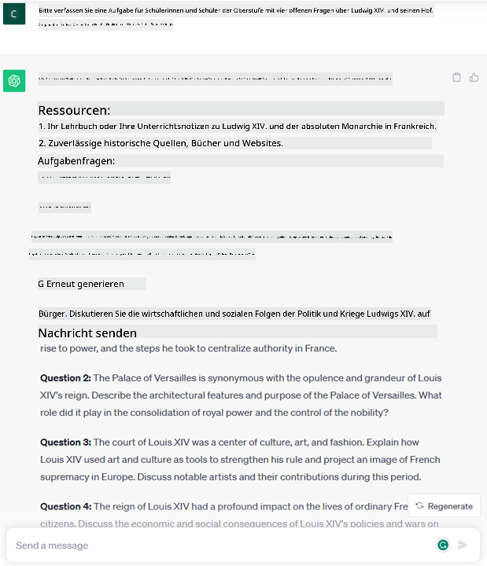
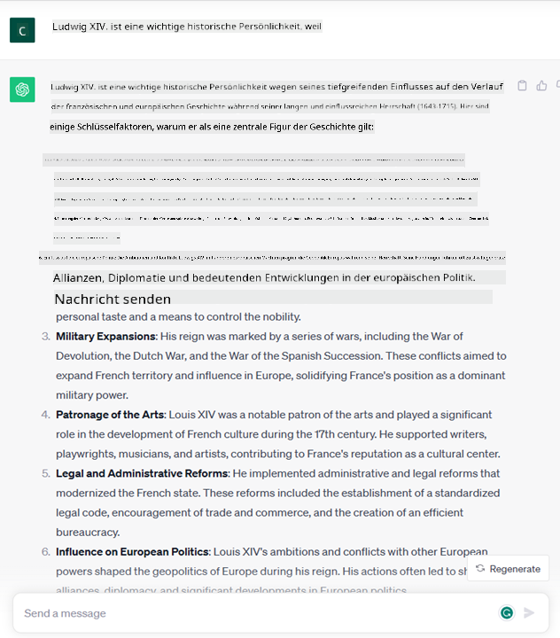

<!--
CO_OP_TRANSLATOR_METADATA:
{
  "original_hash": "f53ba0fa49164f9323043f1c6b11f2b1",
  "translation_date": "2025-07-09T07:41:15+00:00",
  "source_file": "01-introduction-to-genai/README.md",
  "language_code": "de"
}
-->
# Einführung in Generative KI und Große Sprachmodelle

_(Klicken Sie auf das Bild oben, um das Video zu dieser Lektion anzusehen)_

Generative KI ist künstliche Intelligenz, die in der Lage ist, Texte, Bilder und andere Arten von Inhalten zu erzeugen. Was diese Technologie so großartig macht, ist, dass sie KI demokratisiert – jeder kann sie mit nur einem kurzen Texteingabeaufforderung, einem Satz in natürlicher Sprache, nutzen. Es ist nicht nötig, eine Programmiersprache wie Java oder SQL zu lernen, um etwas Sinnvolles zu erreichen. Alles, was Sie brauchen, ist Ihre Sprache zu verwenden, zu sagen, was Sie möchten, und Sie erhalten einen Vorschlag von einem KI-Modell. Die Anwendungen und Auswirkungen sind enorm: Sie können Berichte schreiben oder verstehen, Anwendungen erstellen und vieles mehr – und das alles in Sekundenschnelle.

In diesem Lehrplan werden wir untersuchen, wie unser Startup generative KI nutzt, um neue Szenarien im Bildungsbereich zu erschließen, und wie wir die unvermeidlichen Herausforderungen im Zusammenhang mit den sozialen Auswirkungen der Anwendung und den technologischen Grenzen angehen.

## Einführung

Diese Lektion behandelt:

- Einführung in das Geschäftsszenario: unsere Startup-Idee und Mission.
- Generative KI und wie wir zur aktuellen Technologielandschaft gelangt sind.
- Funktionsweise eines großen Sprachmodells.
- Hauptfähigkeiten und praktische Anwendungsfälle von Großen Sprachmodellen.

## Lernziele

Nach Abschluss dieser Lektion werden Sie verstehen:

- Was generative KI ist und wie Große Sprachmodelle funktionieren.
- Wie Sie Große Sprachmodelle für verschiedene Anwendungsfälle nutzen können, mit Schwerpunkt auf Bildungsszenarien.

## Szenario: unser Bildungs-Startup

Generative Künstliche Intelligenz (KI) stellt den Höhepunkt der KI-Technologie dar und verschiebt die Grenzen dessen, was einst für unmöglich gehalten wurde. Generative KI-Modelle haben viele Fähigkeiten und Anwendungen, aber in diesem Lehrplan werden wir untersuchen, wie sie die Bildung durch ein fiktives Startup revolutioniert. Wir nennen dieses Startup _unser Startup_. Unser Startup arbeitet im Bildungsbereich mit der ehrgeizigen Mission:

> _die Zugänglichkeit zum Lernen weltweit zu verbessern, einen gerechten Zugang zur Bildung zu gewährleisten und jedem Lernenden personalisierte Lernerfahrungen entsprechend seinen Bedürfnissen zu bieten_.

Unser Startup-Team ist sich bewusst, dass wir dieses Ziel nicht erreichen können, ohne eines der mächtigsten Werkzeuge der modernen Zeit zu nutzen – Große Sprachmodelle (LLMs).

Generative KI wird voraussichtlich die Art und Weise, wie wir heute lernen und lehren, revolutionieren, indem Schüler rund um die Uhr virtuelle Lehrer zur Verfügung haben, die eine Fülle von Informationen und Beispielen bieten, und Lehrer innovative Werkzeuge nutzen können, um ihre Schüler zu bewerten und Feedback zu geben.

Beginnen wir damit, einige grundlegende Konzepte und Begriffe zu definieren, die wir im gesamten Lehrplan verwenden werden.

## Wie entstand Generative KI?

Trotz des enormen _Hypes_, der kürzlich durch die Ankündigung generativer KI-Modelle entstanden ist, ist diese Technologie Jahrzehnte in der Entwicklung, mit den ersten Forschungsbemühungen, die bis in die 60er Jahre zurückreichen. Heute sind wir an einem Punkt, an dem KI menschliche kognitive Fähigkeiten besitzt, wie zum Beispiel Konversation, gezeigt durch [OpenAI ChatGPT](https://openai.com/chatgpt) oder [Bing Chat](https://www.microsoft.com/edge/features/bing-chat?WT.mc_id=academic-105485-koreyst), das ebenfalls ein GPT-Modell für die Bing-Websuche verwendet.

Ein kurzer Rückblick: Die allerersten KI-Prototypen bestanden aus getippten Chatbots, die auf einer Wissensbasis beruhten, die von einer Gruppe von Experten erstellt und in einem Computer abgebildet wurde. Die Antworten in der Wissensbasis wurden durch Schlüsselwörter im Eingabetext ausgelöst. Es wurde jedoch schnell klar, dass ein solcher Ansatz mit getippten Chatbots nicht gut skalierte.

### Ein statistischer Ansatz für KI: Maschinelles Lernen

Ein Wendepunkt kam in den 90er Jahren mit der Anwendung eines statistischen Ansatzes zur Textanalyse. Dies führte zur Entwicklung neuer Algorithmen – bekannt als maschinelles Lernen – die Muster aus Daten lernen können, ohne explizit programmiert zu werden. Dieser Ansatz ermöglicht es Maschinen, das menschliche Sprachverständnis zu simulieren: Ein statistisches Modell wird mit Text-Label-Paaren trainiert, sodass es unbekannten Eingabetext mit einem vordefinierten Label klassifizieren kann, das die Absicht der Nachricht repräsentiert.

### Neuronale Netze und moderne virtuelle Assistenten

In den letzten Jahren hat die technologische Weiterentwicklung der Hardware, die größere Datenmengen und komplexere Berechnungen bewältigen kann, die KI-Forschung vorangetrieben und zur Entwicklung fortschrittlicher maschineller Lernalgorithmen geführt, die als neuronale Netze oder Deep-Learning-Algorithmen bekannt sind.

Neuronale Netze (insbesondere Recurrent Neural Networks – RNNs) haben die Verarbeitung natürlicher Sprache erheblich verbessert, indem sie die Bedeutung von Text auf eine sinnvollere Weise darstellen und den Kontext eines Wortes im Satz berücksichtigen.

Diese Technologie ermöglichte die virtuellen Assistenten, die in den ersten Jahren des neuen Jahrhunderts entstanden sind, sehr geschickt darin, menschliche Sprache zu interpretieren, Bedürfnisse zu erkennen und eine Aktion auszuführen, um diese zu erfüllen – wie das Antworten mit vordefinierten Skripten oder die Nutzung eines Drittanbieterdienstes.

### Heutige Zeit: Generative KI

So sind wir zur heutigen Generativen KI gekommen, die als Teilbereich des Deep Learning betrachtet werden kann.

Nach Jahrzehnten der Forschung im Bereich KI hat eine neue Modellarchitektur – der _Transformer_ – die Grenzen der RNNs überwunden, indem sie viel längere Textsequenzen als Eingabe verarbeiten kann. Transformer basieren auf dem Aufmerksamkeitsmechanismus (Attention Mechanism), der es dem Modell ermöglicht, den Eingaben unterschiedliche Gewichtungen zu geben und „mehr Aufmerksamkeit“ dort zu schenken, wo die relevantesten Informationen konzentriert sind, unabhängig von ihrer Reihenfolge in der Textsequenz.

Die meisten aktuellen generativen KI-Modelle – auch bekannt als Große Sprachmodelle (LLMs), da sie mit Text als Ein- und Ausgabe arbeiten – basieren tatsächlich auf dieser Architektur. Interessant an diesen Modellen ist, dass sie auf einer riesigen Menge unbeschrifteter Daten aus verschiedenen Quellen wie Büchern, Artikeln und Webseiten trainiert wurden und sich für eine Vielzahl von Aufgaben anpassen lassen. Sie erzeugen grammatikalisch korrekten Text mit einem Anschein von Kreativität. Sie haben also nicht nur die Fähigkeit einer Maschine, einen Eingabetext „zu verstehen“, enorm verbessert, sondern auch ihre Fähigkeit, eine originelle Antwort in menschlicher Sprache zu generieren.

## Wie funktionieren Große Sprachmodelle?

Im nächsten Kapitel werden wir verschiedene Arten von Generativen KI-Modellen untersuchen, aber zunächst werfen wir einen Blick darauf, wie Große Sprachmodelle funktionieren, mit Fokus auf OpenAI GPT (Generative Pre-trained Transformer) Modelle.

- **Tokenizer, Text in Zahlen umwandeln**: Große Sprachmodelle erhalten Text als Eingabe und erzeugen Text als Ausgabe. Da es sich jedoch um statistische Modelle handelt, arbeiten sie viel besser mit Zahlen als mit Textsequenzen. Deshalb wird jeder Eingabetext vor der Verwendung im Kernmodell von einem Tokenizer verarbeitet. Ein Token ist ein Textabschnitt – bestehend aus einer variablen Anzahl von Zeichen. Die Hauptaufgabe des Tokenizers ist es, die Eingabe in ein Array von Tokens zu zerlegen. Anschließend wird jedem Token ein Token-Index zugeordnet, der die Ganzzahldarstellung des ursprünglichen Textabschnitts ist.

- **Vorhersage von Ausgabetokens**: Bei n Tokens als Eingabe (wobei das Maximum je nach Modell variiert) kann das Modell ein Token als Ausgabe vorhersagen. Dieses Token wird dann in die Eingabe der nächsten Iteration aufgenommen, in einem sich erweiternden Fenster, was eine bessere Nutzererfahrung ermöglicht, indem man eine oder mehrere Sätze als Antwort erhält. Das erklärt, warum es bei ChatGPT manchmal so wirkt, als würde es mitten im Satz aufhören.

- **Auswahlprozess, Wahrscheinlichkeitsverteilung**: Das Ausgabetoken wird vom Modell entsprechend seiner Wahrscheinlichkeit ausgewählt, nach der aktuellen Textsequenz aufzutreten. Das Modell sagt eine Wahrscheinlichkeitsverteilung über alle möglichen „nächsten Tokens“ voraus, basierend auf seinem Training. Allerdings wird nicht immer das Token mit der höchsten Wahrscheinlichkeit gewählt. Es wird eine gewisse Zufälligkeit hinzugefügt, sodass das Modell nicht-deterministisch agiert – man erhält nicht immer dieselbe Ausgabe für dieselbe Eingabe. Diese Zufälligkeit simuliert kreatives Denken und kann über einen Modellparameter namens Temperatur gesteuert werden.

## Wie kann unser Startup Große Sprachmodelle nutzen?

Jetzt, wo wir die Funktionsweise eines Großen Sprachmodells besser verstehen, sehen wir uns einige praktische Beispiele der häufigsten Aufgaben an, die sie ziemlich gut erledigen können, mit Blick auf unser Geschäftsszenario. Wir haben gesagt, dass die Hauptfähigkeit eines Großen Sprachmodells darin besteht, _einen Text von Grund auf zu generieren, ausgehend von einer Texteingabe in natürlicher Sprache_.

Aber welche Art von Texteingabe und -ausgabe?
Die Eingabe eines Großen Sprachmodells wird als Prompt bezeichnet, während die Ausgabe als Completion bekannt ist – ein Begriff, der sich auf den Mechanismus des Modells bezieht, das nächste Token zu generieren, um die aktuelle Eingabe zu vervollständigen. Wir werden uns noch ausführlich damit beschäftigen, was ein Prompt ist und wie man ihn so gestaltet, dass man das Beste aus dem Modell herausholt. Aber vorerst sei gesagt, dass ein Prompt Folgendes enthalten kann:

- Eine **Anweisung**, die angibt, welche Art von Ausgabe wir vom Modell erwarten. Diese Anweisung kann manchmal Beispiele oder zusätzliche Daten enthalten.

  1. Zusammenfassung eines Artikels, Buchs, Produktbewertungen und mehr, sowie das Extrahieren von Erkenntnissen aus unstrukturierten Daten.
    
    
  
  2. Kreative Ideenfindung und Gestaltung eines Artikels, Essays, einer Aufgabe oder mehr.
      
     

- Eine **Frage**, gestellt in Form eines Gesprächs mit einem Agenten.
  
  

- Ein Textabschnitt, der **vervollständigt** werden soll, was implizit eine Bitte um Schreibunterstützung ist.
  
  

- Ein Codeabschnitt zusammen mit der Bitte, ihn zu erklären und zu dokumentieren, oder ein Kommentar, der darum bittet, ein Stück Code zu generieren, das eine bestimmte Aufgabe erfüllt.
  
  

Die obigen Beispiele sind recht einfach und sollen keine vollständige Demonstration der Fähigkeiten von Großen Sprachmodellen sein. Sie sollen das Potenzial der Nutzung generativer KI zeigen, insbesondere, aber nicht ausschließlich, im Bildungsbereich.

Außerdem ist die Ausgabe eines generativen KI-Modells nicht perfekt, und manchmal kann die Kreativität des Modells gegen es arbeiten, was zu einer Ausgabe führt, die der menschliche Nutzer als Verzerrung der Realität interpretieren kann oder die sogar anstößig sein kann. Generative KI ist nicht intelligent – zumindest nicht im umfassenderen Sinne von Intelligenz, die kritisches und kreatives Denken oder emotionale Intelligenz einschließt; sie ist nicht deterministisch und nicht immer vertrauenswürdig, da Fälschungen wie fehlerhafte Referenzen, Inhalte und Aussagen mit korrekten Informationen kombiniert und überzeugend sowie selbstbewusst präsentiert werden können. In den folgenden Lektionen werden wir uns mit all diesen Einschränkungen beschäftigen und sehen, wie wir sie mildern können.

## Aufgabe

Ihre Aufgabe ist es, sich weiter über [generative KI](https://en.wikipedia.org/wiki/Generative_artificial_intelligence?WT.mc_id=academic-105485-koreyst) zu informieren und einen Bereich zu identifizieren, in dem Sie heute generative KI einsetzen würden, der sie bisher nicht nutzt. Wie würde sich die Auswirkung im Vergleich zur „alten Methode“ unterscheiden? Können Sie etwas tun, was vorher nicht möglich war, oder sind Sie schneller? Schreiben Sie eine Zusammenfassung von 300 Wörtern darüber, wie Ihr Traum-KI-Startup aussehen würde, und fügen Sie Überschriften wie „Problem“, „Wie ich KI nutzen würde“, „Auswirkung“ und optional einen Geschäftsplan hinzu.

Wenn Sie diese Aufgabe erledigt haben, sind Sie vielleicht sogar bereit, sich bei Microsofts Inkubator, dem [Microsoft for Startups Founders Hub](https://www.microsoft.com/startups?WT.mc_id=academic-105485-koreyst), zu bewerben. Wir bieten Credits für Azure, OpenAI, Mentoring und vieles mehr – schauen Sie vorbei!

## Wissenscheck

Was trifft auf Große Sprachmodelle zu?

1. Sie erhalten jedes Mal die exakt gleiche Antwort.
1. Sie machen alles perfekt, sind großartig im Rechnen, erzeugen funktionierenden Code usw.
1. Die Antwort kann trotz gleicher Eingabe variieren. Sie sind auch gut darin, Ihnen einen ersten Entwurf von etwas zu liefern, sei es Text oder Code. Aber Sie müssen die Ergebnisse noch verbessern.

A: 3, ein LLM ist nicht-deterministisch, die Antwort variiert, allerdings können Sie die Varianz über die Temperatureinstellung steuern. Sie sollten auch nicht erwarten, dass es alles perfekt macht – es soll Ihnen die schwere Arbeit abnehmen, was oft bedeutet, dass Sie einen guten ersten Versuch erhalten, den Sie nach und nach verbessern müssen.

## Gute Arbeit! Setzen Sie die Reise fort

Nach Abschluss dieser Lektion sehen Sie sich unsere [Generative AI Learning collection](https://aka.ms/genai-collection?WT.mc_id=academic-105485-koreyst) an, um Ihr Wissen über Generative KI weiter zu vertiefen!
Gehe zu Lektion 2, in der wir uns ansehen, wie man [verschiedene LLM-Typen erkundet und vergleicht](../02-exploring-and-comparing-different-llms/README.md?WT.mc_id=academic-105485-koreyst)!

**Haftungsausschluss**:  
Dieses Dokument wurde mit dem KI-Übersetzungsdienst [Co-op Translator](https://github.com/Azure/co-op-translator) übersetzt. Obwohl wir uns um Genauigkeit bemühen, beachten Sie bitte, dass automatisierte Übersetzungen Fehler oder Ungenauigkeiten enthalten können. Das Originaldokument in seiner Ursprungssprache gilt als maßgebliche Quelle. Für wichtige Informationen wird eine professionelle menschliche Übersetzung empfohlen. Wir übernehmen keine Haftung für Missverständnisse oder Fehlinterpretationen, die aus der Nutzung dieser Übersetzung entstehen.