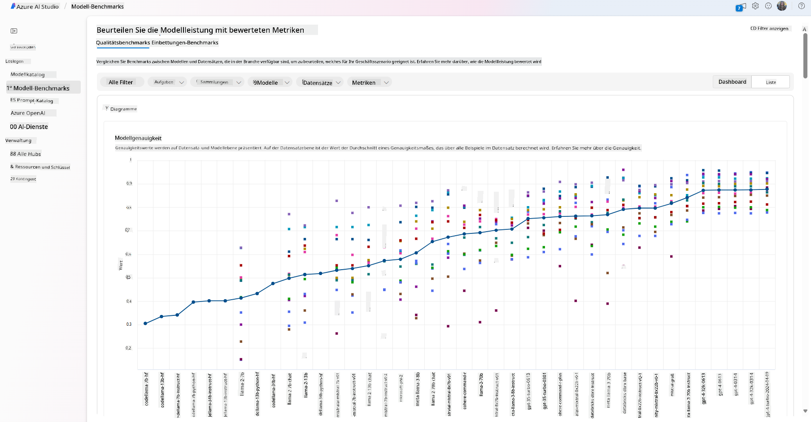
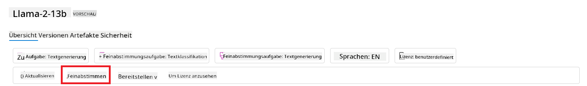
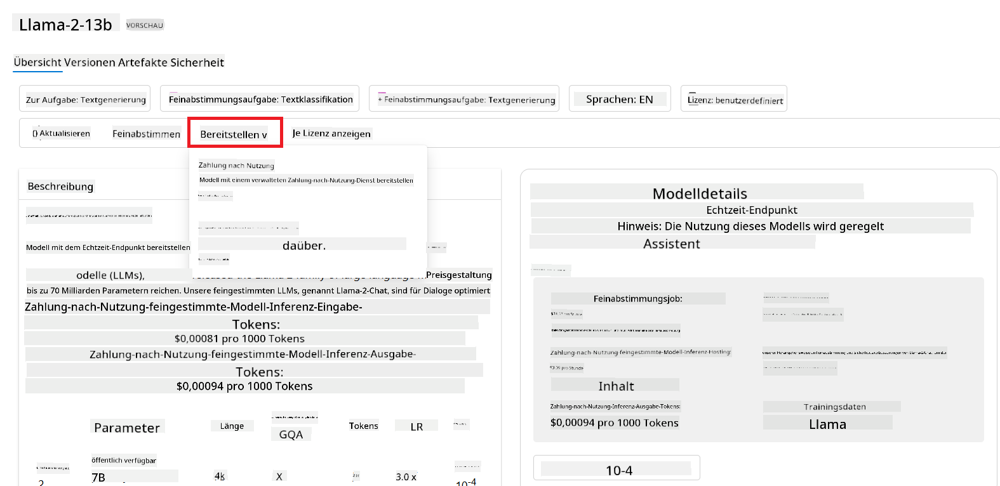

<!--
CO_OP_TRANSLATOR_METADATA:
{
  "original_hash": "e2f686f2eb794941761252ac5e8e090b",
  "translation_date": "2025-05-19T09:22:18+00:00",
  "source_file": "02-exploring-and-comparing-different-llms/README.md",
  "language_code": "de"
}
-->
# Erkundung und Vergleich verschiedener LLMs

> _Klicken Sie auf das Bild oben, um das Video zu dieser Lektion anzusehen_

Mit der vorherigen Lektion haben wir gesehen, wie Generative KI die Technologielandschaft verändert, wie Große Sprachmodelle (LLMs) funktionieren und wie ein Unternehmen - wie unser Startup - sie auf seine Anwendungsfälle anwenden und wachsen kann! In diesem Kapitel wollen wir verschiedene Arten von großen Sprachmodellen (LLMs) vergleichen, um ihre Vor- und Nachteile zu verstehen.

Der nächste Schritt auf der Reise unseres Startups besteht darin, die aktuelle Landschaft der LLMs zu erkunden und zu verstehen, welche für unseren Anwendungsfall geeignet sind.

## Einführung

Diese Lektion behandelt:

- Verschiedene Arten von LLMs in der aktuellen Landschaft.
- Testen, Iterieren und Vergleichen verschiedener Modelle für Ihren Anwendungsfall in Azure.
- Wie man ein LLM bereitstellt.

## Lernziele

Nach Abschluss dieser Lektion werden Sie in der Lage sein:

- Das richtige Modell für Ihren Anwendungsfall auszuwählen.
- Zu verstehen, wie Sie die Leistung Ihres Modells testen, iterieren und verbessern können.
- Zu wissen, wie Unternehmen Modelle bereitstellen.

## Verschiedene Arten von LLMs verstehen

LLMs können basierend auf ihrer Architektur, ihren Trainingsdaten und ihrem Anwendungsfall in verschiedene Kategorien unterteilt werden. Das Verständnis dieser Unterschiede wird unserem Startup helfen, das richtige Modell für das Szenario auszuwählen und zu verstehen, wie man die Leistung testet, iteriert und verbessert.

Es gibt viele verschiedene Arten von LLM-Modellen, Ihre Wahl hängt davon ab, wofür Sie sie verwenden möchten, welche Daten Sie haben, wie viel Sie bereit sind zu zahlen und mehr.

Je nachdem, ob Sie die Modelle für Text-, Audio-, Video-, Bilderzeugung usw. verwenden möchten, könnten Sie sich für eine andere Art von Modell entscheiden.

- **Audio- und Spracherkennung**. Für diesen Zweck sind Whisper-Modelle eine ausgezeichnete Wahl, da sie universell einsetzbar sind und auf Spracherkennung abzielen. Sie sind auf vielfältige Audioinhalte trainiert und können mehrsprachige Spracherkennung durchführen. Erfahren Sie mehr über [Whisper-Modelle hier](https://platform.openai.com/docs/models/whisper?WT.mc_id=academic-105485-koreyst).

- **Bildgenerierung**. Für die Bildgenerierung sind DALL-E und Midjourney zwei sehr bekannte Optionen. DALL-E wird von Azure OpenAI angeboten. [Lesen Sie mehr über DALL-E hier](https://platform.openai.com/docs/models/dall-e?WT.mc_id=academic-105485-koreyst) und auch in Kapitel 9 dieses Lehrplans.

- **Textgenerierung**. Die meisten Modelle sind auf Textgenerierung trainiert und Sie haben eine große Auswahl von GPT-3.5 bis GPT-4. Sie kommen zu unterschiedlichen Kosten, wobei GPT-4 das teuerste ist. Es lohnt sich, den [Azure OpenAI Playground](https://oai.azure.com/portal/playground?WT.mc_id=academic-105485-koreyst) zu erkunden, um zu bewerten, welche Modelle am besten zu Ihren Bedürfnissen in Bezug auf Fähigkeiten und Kosten passen.

- **Multi-Modality**. Wenn Sie mehrere Arten von Daten in Eingabe und Ausgabe verarbeiten möchten, könnten Sie sich Modelle wie [gpt-4 turbo mit Vision oder gpt-4o](https://learn.microsoft.com/azure/ai-services/openai/concepts/models#gpt-4-and-gpt-4-turbo-models?WT.mc_id=academic-105485-koreyst) ansehen - die neuesten Veröffentlichungen von OpenAI-Modellen - die in der Lage sind, natürliche Sprachverarbeitung mit visueller Wahrnehmung zu kombinieren und Interaktionen über multimodale Schnittstellen zu ermöglichen.

Die Auswahl eines Modells bedeutet, dass Sie einige grundlegende Fähigkeiten erhalten, die jedoch möglicherweise nicht ausreichen. Oft haben Sie unternehmensspezifische Daten, die Sie dem LLM irgendwie mitteilen müssen. Es gibt einige verschiedene Möglichkeiten, wie Sie dies angehen können, mehr dazu in den kommenden Abschnitten.

### Foundation Models versus LLMs

Der Begriff Foundation Model wurde von [Stanford-Forschern geprägt](https://arxiv.org/abs/2108.07258?WT.mc_id=academic-105485-koreyst) und definiert als ein KI-Modell, das einige Kriterien erfüllt, wie zum Beispiel:

- **Sie werden mit unüberwachtem Lernen oder selbstüberwachtem Lernen trainiert**, das bedeutet, dass sie auf unbeschrifteten multimodalen Daten trainiert werden und keine menschliche Annotation oder Beschriftung der Daten für ihren Trainingsprozess benötigen.
- **Sie sind sehr große Modelle**, basierend auf sehr tiefen neuronalen Netzwerken, die auf Milliarden von Parametern trainiert sind.
- **Sie sollen normalerweise als ‚Fundament‘ für andere Modelle dienen**, das bedeutet, dass sie als Ausgangspunkt für andere Modelle verwendet werden können, die darauf aufgebaut werden können, was durch Feinabstimmung geschehen kann.

Um diese Unterscheidung weiter zu klären, nehmen wir ChatGPT als Beispiel. Um die erste Version von ChatGPT zu erstellen, diente ein Modell namens GPT-3.5 als Foundation Model. Das bedeutet, dass OpenAI einige chat-spezifische Daten verwendet hat, um eine abgestimmte Version von GPT-3.5 zu erstellen, die darauf spezialisiert war, in Konversationsszenarien, wie Chatbots, gut zu funktionieren.

### Open Source versus Proprietary Models

Eine weitere Möglichkeit, LLMs zu kategorisieren, ist, ob sie Open Source oder proprietär sind.

Open-Source-Modelle sind Modelle, die der Öffentlichkeit zugänglich gemacht werden und von jedem genutzt werden können. Sie werden oft von dem Unternehmen, das sie erstellt hat, oder von der Forschungsgemeinschaft zur Verfügung gestellt. Diese Modelle dürfen inspiziert, modifiziert und für die verschiedenen Anwendungsfälle in LLMs angepasst werden. Sie sind jedoch nicht immer für den Produktionseinsatz optimiert und möglicherweise nicht so leistungsfähig wie proprietäre Modelle. Außerdem kann die Finanzierung für Open-Source-Modelle begrenzt sein, und sie werden möglicherweise nicht langfristig gewartet oder mit den neuesten Forschungsergebnissen aktualisiert. Beispiele für beliebte Open-Source-Modelle sind [Alpaca](https://crfm.stanford.edu/2023/03/13/alpaca.html?WT.mc_id=academic-105485-koreyst), [Bloom](https://huggingface.co/bigscience/bloom) und [LLaMA](https://llama.meta.com).

Proprietäre Modelle sind Modelle, die einem Unternehmen gehören und nicht der Öffentlichkeit zugänglich gemacht werden. Diese Modelle sind oft für den Produktionseinsatz optimiert. Sie dürfen jedoch nicht inspiziert, modifiziert oder für verschiedene Anwendungsfälle angepasst werden. Außerdem sind sie nicht immer kostenlos verfügbar und können ein Abonnement oder eine Zahlung erfordern. Außerdem haben Benutzer keine Kontrolle über die Daten, die zum Trainieren des Modells verwendet werden, was bedeutet, dass sie dem Modelleigentümer vertrauen sollten, dass er sich zur Datensicherheit und zum verantwortungsvollen Einsatz von KI verpflichtet. Beispiele für beliebte proprietäre Modelle sind [OpenAI-Modelle](https://platform.openai.com/docs/models/overview?WT.mc_id=academic-105485-koreyst), [Google Bard](https://sapling.ai/llm/bard?WT.mc_id=academic-105485-koreyst) oder [Claude 2](https://www.anthropic.com/index/claude-2?WT.mc_id=academic-105485-koreyst).

### Embedding versus Bildgenerierung versus Text- und Codegenerierung

LLMs können auch nach dem Output kategorisiert werden, den sie erzeugen.

Embeddings sind eine Gruppe von Modellen, die Text in eine numerische Form umwandeln können, genannt Embedding, was eine numerische Darstellung des Eingabetextes ist. Embeddings erleichtern es Maschinen, die Beziehungen zwischen Wörtern oder Sätzen zu verstehen und können als Eingaben von anderen Modellen, wie Klassifikationsmodellen oder Clustermodellen, die eine bessere Leistung bei numerischen Daten haben, verwendet werden. Embedding-Modelle werden oft für Transferlernen verwendet, bei dem ein Modell für eine Ersatzaufgabe erstellt wird, für die es eine Fülle von Daten gibt, und dann die Modellgewichte (Embeddings) für andere nachgelagerte Aufgaben wiederverwendet werden. Ein Beispiel für diese Kategorie ist [OpenAI embeddings](https://platform.openai.com/docs/models/embeddings?WT.mc_id=academic-105485-koreyst).

Bildgenerierungsmodelle sind Modelle, die Bilder erzeugen. Diese Modelle werden oft für Bildbearbeitung, Bildsynthese und Bildübersetzung verwendet. Bildgenerierungsmodelle werden oft auf großen Datensätzen von Bildern trainiert, wie [LAION-5B](https://laion.ai/blog/laion-5b/?WT.mc_id=academic-105485-koreyst), und können verwendet werden, um neue Bilder zu erzeugen oder bestehende Bilder mit Inpainting-, Superauflösungs- und Kolorierungstechniken zu bearbeiten. Beispiele sind [DALL-E-3](https://openai.com/dall-e-3?WT.mc_id=academic-105485-koreyst) und [Stable Diffusion Modelle](https://github.com/Stability-AI/StableDiffusion?WT.mc_id=academic-105485-koreyst).

Text- und Codegenerierungsmodelle sind Modelle, die Text oder Code erzeugen. Diese Modelle werden oft für Textzusammenfassung, Übersetzung und Fragenbeantwortung verwendet. Textgenerierungsmodelle werden oft auf großen Datensätzen von Texten trainiert, wie [BookCorpus](https://www.cv-foundation.org/openaccess/content_iccv_2015/html/Zhu_Aligning_Books_and_ICCV_2015_paper.html?WT.mc_id=academic-105485-koreyst), und können verwendet werden, um neuen Text zu erzeugen oder Fragen zu beantworten. Codegenerierungsmodelle, wie [CodeParrot](https://huggingface.co/codeparrot?WT.mc_id=academic-105485-koreyst), werden oft auf großen Datensätzen von Code, wie GitHub, trainiert und können verwendet werden, um neuen Code zu erzeugen oder Fehler in bestehendem Code zu beheben.

### Encoder-Decoder versus Decoder-only

Um über die verschiedenen Arten von Architekturen von LLMs zu sprechen, verwenden wir eine Analogie.

Stellen Sie sich vor, Ihr Manager hat Ihnen die Aufgabe gegeben, ein Quiz für die Schüler zu schreiben. Sie haben zwei Kollegen; einer ist für die Erstellung des Inhalts verantwortlich und der andere für die Überprüfung.

Der Inhaltsersteller ist wie ein Decoder-only Modell, er kann sich das Thema ansehen und sehen, was Sie bereits geschrieben haben, und dann einen Kurs darauf basierend schreiben. Sie sind sehr gut darin, ansprechende und informative Inhalte zu schreiben, aber sie sind nicht sehr gut darin, das Thema und die Lernziele zu verstehen. Einige Beispiele für Decoder-Modelle sind GPT-Familienmodelle, wie GPT-3.

Der Prüfer ist wie ein Encoder-only Modell, er schaut sich den geschriebenen Kurs und die Antworten an, bemerkt die Beziehung zwischen ihnen und versteht den Kontext, aber er ist nicht gut darin, Inhalte zu erzeugen. Ein Beispiel für ein Encoder-only Modell wäre BERT.

Stellen Sie sich vor, wir könnten auch jemanden haben, der das Quiz erstellen und überprüfen könnte, dies ist ein Encoder-Decoder Modell. Einige Beispiele wären BART und T5.

### Service versus Modell

Nun, lassen Sie uns über den Unterschied zwischen einem Service und einem Modell sprechen. Ein Service ist ein Produkt, das von einem Cloud-Dienstanbieter angeboten wird und oft eine Kombination aus Modellen, Daten und anderen Komponenten ist. Ein Modell ist die Kernkomponente eines Services und ist oft ein Foundation Model, wie ein LLM.

Services sind oft für den Produktionseinsatz optimiert und oft einfacher zu verwenden als Modelle, über eine grafische Benutzeroberfläche. Allerdings sind Services nicht immer kostenlos verfügbar und können ein Abonnement oder eine Zahlung erfordern, im Austausch dafür, dass die Ausrüstung und Ressourcen des Serviceanbieters genutzt werden, was die Kosten optimiert und eine einfache Skalierung ermöglicht. Ein Beispiel für einen Service ist [Azure OpenAI Service](https://learn.microsoft.com/azure/ai-services/openai/overview?WT.mc_id=academic-105485-koreyst), der einen Pay-as-you-go-Tarifplan bietet, was bedeutet, dass Benutzer proportional zu ihrer Nutzung des Services belastet werden. Außerdem bietet der Azure OpenAI Service Sicherheit auf Unternehmensniveau und einen verantwortungsvollen KI-Rahmen zusätzlich zu den Fähigkeiten der Modelle.

Modelle sind nur das neuronale Netzwerk, mit den Parametern, Gewichten und anderen. Unternehmen können sie lokal ausführen, müssten jedoch Ausrüstung kaufen, eine Struktur zum Skalieren aufbauen und eine Lizenz erwerben oder ein Open-Source-Modell verwenden. Ein Modell wie LLaMA ist verfügbar zur Nutzung und erfordert Rechenleistung, um das Modell auszuführen.

## Wie man mit verschiedenen Modellen testet und iteriert, um die Leistung in Azure zu verstehen

Sobald unser Team die aktuelle LLM-Landschaft erkundet und einige gute Kandidaten für ihre Szenarien identifiziert hat, besteht der nächste Schritt darin, sie auf ihren Daten und ihrer Arbeitslast zu testen. Dies ist ein iterativer Prozess, der durch Experimente und Messungen durchgeführt wird.
Die meisten der Modelle, die wir in den vorherigen Absätzen erwähnt haben (OpenAI-Modelle, Open-Source-Modelle wie Llama2 und Hugging Face Transformers), sind im [Model Catalog](https://learn.microsoft.com/azure/ai-studio/how-to/model-catalog-overview?WT.mc_id=academic-105485-koreyst) im [Azure AI Studio](https://ai.azure.com/?WT.mc_id=academic-105485-koreyst) verfügbar.

[Azure AI Studio](https://learn.microsoft.com/azure/ai-studio/what-is-ai-studio?WT.mc_id=academic-105485-koreyst) ist eine Cloud-Plattform, die für Entwickler entwickelt wurde, um generative KI-Anwendungen zu erstellen und den gesamten Entwicklungslebenszyklus zu verwalten - von Experimenten bis zur Bewertung - indem alle Azure AI-Dienste in einem einzigen Hub mit einer praktischen Benutzeroberfläche kombiniert werden. Der Model Catalog im Azure AI Studio ermöglicht es dem Benutzer:

- Finden Sie das Foundation Model von Interesse im Katalog - entweder proprietär oder Open Source, gefiltert nach Aufgabe, Lizenz oder Name. Um die Suchbarkeit zu verbessern, sind die Modelle in Sammlungen organisiert, wie Azure OpenAI-Sammlung, Hugging Face-Sammlung und mehr.

- Überprüfen Sie die Modellkarte, einschließlich einer detaillierten Beschreibung der beabsichtigten Verwendung und Trainingsdaten, Codebeispiele und Bewertungsergebnisse in der internen Bewertungsbibliothek.
- Vergleichen Sie Benchmarks zwischen Modellen und Datensätzen, die in der Branche verfügbar sind, um zu beurteilen, welches den Geschäftsszenarien entspricht, über das [Model Benchmarks](https://learn.microsoft.com/azure/ai-studio/how-to/model-benchmarks?WT.mc_id=academic-105485-koreyst) Fenster.

- Passen Sie das Modell mit benutzerdefinierten Trainingsdaten an, um die Modellleistung in einer bestimmten Arbeitslast zu verbessern, und nutzen Sie die Experimentier- und Nachverfolgungsmöglichkeiten von Azure AI Studio.

- Setzen Sie das ursprüngliche vortrainierte Modell oder die feinabgestimmte Version für eine Remote-Echtzeit-Inferenz - verwaltete Berechnung - oder einen serverlosen API-Endpunkt - [pay-as-you-go](https://learn.microsoft.com/azure/ai-studio/how-to/model-catalog-overview#model-deployment-managed-compute-and-serverless-api-pay-as-you-go?WT.mc_id=academic-105485-koreyst) - ein, um Anwendungen den Zugriff darauf zu ermöglichen.

> [!NOTE]
> Nicht alle Modelle im Katalog sind derzeit für Feineinstellungen und/oder Pay-as-you-go-Bereitstellungen verfügbar. Überprüfen Sie die Modellkarte für Details zu den Fähigkeiten und Einschränkungen des Modells.

## Verbesserung der LLM-Ergebnisse

Wir haben mit unserem Startup-Team verschiedene Arten von LLMs und eine Cloud-Plattform (Azure Machine Learning) erkundet, die es uns ermöglicht, verschiedene Modelle zu vergleichen, sie auf Testdaten zu evaluieren, die Leistung zu verbessern und sie auf Inferenzendpunkten bereitzustellen.

Aber wann sollten sie in Betracht ziehen, ein Modell zu verfeinern, anstatt ein vortrainiertes zu verwenden? Gibt es andere Ansätze, um die Modellleistung bei bestimmten Arbeitslasten zu verbessern?

Es gibt mehrere Ansätze, die ein Unternehmen nutzen kann, um die gewünschten Ergebnisse von einem LLM zu erzielen. Sie können verschiedene Arten von Modellen mit unterschiedlichen Trainingsgraden auswählen, wenn Sie ein LLM in der Produktion einsetzen, mit unterschiedlichen Komplexitäts-, Kosten- und Qualitätsniveaus. Hier sind einige verschiedene Ansätze:

- **Prompt-Engineering mit Kontext**. Die Idee ist, beim Prompten genügend Kontext bereitzustellen, um sicherzustellen, dass Sie die benötigten Antworten erhalten.

- **Retrieval Augmented Generation, RAG**. Ihre Daten könnten beispielsweise in einer Datenbank oder einem Web-Endpunkt existieren. Um sicherzustellen, dass diese Daten oder ein Teil davon zum Zeitpunkt des Promptens enthalten sind, können Sie die relevanten Daten abrufen und Teil des Benutzer-Prompts machen.

- **Feinabgestimmtes Modell**. Hier haben Sie das Modell weiter mit Ihren eigenen Daten trainiert, was dazu führte, dass das Modell genauer und reaktionsfähiger auf Ihre Bedürfnisse ist, aber möglicherweise kostspielig.

Bildquelle: [Four Ways that Enterprises Deploy LLMs | Fiddler AI Blog](https://www.fiddler.ai/blog/four-ways-that-enterprises-deploy-llms?WT.mc_id=academic-105485-koreyst)

### Prompt-Engineering mit Kontext

Vortrainierte LLMs funktionieren sehr gut bei allgemeinen Aufgaben der natürlichen Sprachverarbeitung, selbst wenn sie mit einem kurzen Prompt aufgerufen werden, wie einem Satz zum Vervollständigen oder einer Frage – das sogenannte „Zero-Shot“-Lernen.

Je mehr der Benutzer jedoch seine Anfrage mit einer detaillierten Anfrage und Beispielen – dem Kontext – umrahmen kann, desto genauer und näher an den Erwartungen des Benutzers wird die Antwort sein. In diesem Fall sprechen wir von „One-Shot“-Lernen, wenn der Prompt nur ein Beispiel enthält, und „Few-Shot“-Lernen, wenn er mehrere Beispiele enthält. Prompt-Engineering mit Kontext ist der kosteneffektivste Ansatz für den Einstieg.

### Retrieval Augmented Generation (RAG)

LLMs haben die Einschränkung, dass sie nur die Daten verwenden können, die während ihres Trainings verwendet wurden, um eine Antwort zu generieren. Das bedeutet, dass sie nichts über die Fakten wissen, die nach ihrem Trainingsprozess passiert sind, und sie können nicht auf nicht-öffentliche Informationen (wie Unternehmensdaten) zugreifen. Dies kann durch RAG überwunden werden, eine Technik, die den Prompt mit externen Daten in Form von Dokumentenstücken ergänzt, wobei die Prompt-Längenbeschränkungen berücksichtigt werden. Dies wird durch Vektordatenbank-Tools (wie [Azure Vector Search](https://learn.microsoft.com/azure/search/vector-search-overview?WT.mc_id=academic-105485-koreyst)) unterstützt, die die nützlichen Stücke aus verschiedenen vordefinierten Datenquellen abrufen und dem Prompt-Kontext hinzufügen.

Diese Technik ist sehr hilfreich, wenn ein Unternehmen nicht genügend Daten, Zeit oder Ressourcen hat, um ein LLM feinabzustimmen, aber dennoch die Leistung bei einer bestimmten Arbeitslast verbessern und das Risiko von Fälschungen, d. h. Mystifikationen der Realität oder schädlichen Inhalten, reduzieren möchte.

### Feinabgestimmtes Modell

Feinabstimmung ist ein Prozess, der Transferlernen nutzt, um das Modell an eine nachgelagerte Aufgabe anzupassen oder ein spezifisches Problem zu lösen. Anders als Few-Shot-Lernen und RAG führt dies zu einem neuen Modell mit aktualisierten Gewichten und Verzerrungen. Es erfordert eine Reihe von Trainingsbeispielen, die aus einem einzelnen Input (dem Prompt) und dem zugehörigen Output (der Vervollständigung) bestehen. Dies wäre der bevorzugte Ansatz, wenn:

- **Verwendung feinabgestimmter Modelle**. Ein Unternehmen möchte weniger leistungsfähige feinabgestimmte Modelle (wie Einbettungsmodelle) anstelle von Hochleistungsmodellen verwenden, was zu einer kostengünstigeren und schnelleren Lösung führt.

- **Berücksichtigung der Latenz**. Latenz ist wichtig für einen bestimmten Anwendungsfall, daher ist es nicht möglich, sehr lange Prompts zu verwenden oder die Anzahl der Beispiele, die vom Modell gelernt werden sollen, passt nicht zu den Prompt-Längenbeschränkungen.

- **Auf dem neuesten Stand bleiben**. Ein Unternehmen verfügt über viele hochwertige Daten und Ground-Truth-Labels sowie die Ressourcen, um diese Daten im Laufe der Zeit aktuell zu halten.

### Trainiertes Modell

Das Training eines LLM von Grund auf ist ohne Zweifel der schwierigste und komplexeste Ansatz, der massive Datenmengen, qualifizierte Ressourcen und angemessene Rechenleistung erfordert. Diese Option sollte nur in einem Szenario in Betracht gezogen werden, in dem ein Unternehmen einen domänenspezifischen Anwendungsfall und eine große Menge domänenzentrierter Daten hat.

## Wissenstest

Was könnte ein guter Ansatz sein, um die Ergebnisse der LLM-Vervollständigung zu verbessern?

1. Prompt-Engineering mit Kontext
2. RAG
3. Feinabgestimmtes Modell

A:3, wenn Sie die Zeit und Ressourcen sowie hochwertige Daten haben, ist die Feinabstimmung die bessere Option, um auf dem neuesten Stand zu bleiben. Wenn Sie jedoch Dinge verbessern möchten und Ihnen die Zeit fehlt, lohnt es sich, zunächst RAG in Betracht zu ziehen.

## 🚀 Herausforderung

Lesen Sie mehr darüber, wie Sie [RAG verwenden können](https://learn.microsoft.com/azure/search/retrieval-augmented-generation-overview?WT.mc_id=academic-105485-koreyst) für Ihr Unternehmen.

## Gute Arbeit, setzen Sie Ihr Lernen fort

Nachdem Sie diese Lektion abgeschlossen haben, schauen Sie sich unsere [Generative AI Learning Sammlung](https://aka.ms/genai-collection?WT.mc_id=academic-105485-koreyst) an, um Ihr Wissen über Generative AI weiter zu vertiefen!

Gehen Sie zu Lektion 3, wo wir uns ansehen, wie man [verantwortungsbewusst mit Generative AI arbeitet](../03-using-generative-ai-responsibly/README.md?WT.mc_id=academic-105485-koreyst)!

**Haftungsausschluss**:  
Dieses Dokument wurde mit dem KI-Übersetzungsdienst [Co-op Translator](https://github.com/Azure/co-op-translator) übersetzt. Obwohl wir uns um Genauigkeit bemühen, beachten Sie bitte, dass automatisierte Übersetzungen Fehler oder Ungenauigkeiten enthalten können. Das Originaldokument in seiner ursprünglichen Sprache sollte als maßgebliche Quelle betrachtet werden. Für kritische Informationen wird eine professionelle menschliche Übersetzung empfohlen. Wir haften nicht für Missverständnisse oder Fehlinterpretationen, die sich aus der Nutzung dieser Übersetzung ergeben.