<!--
CO_OP_TRANSLATOR_METADATA:
{
  "original_hash": "e2f686f2eb794941761252ac5e8e090b",
  "translation_date": "2025-07-09T08:08:47+00:00",
  "source_file": "02-exploring-and-comparing-different-llms/README.md",
  "language_code": "de"
}
-->
# Erforschung und Vergleich verschiedener LLMs

[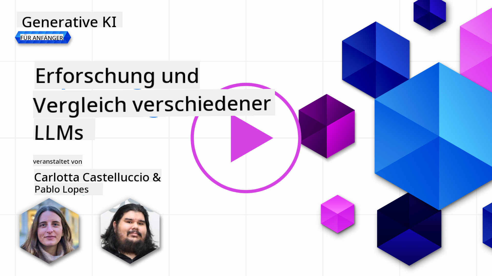](https://aka.ms/gen-ai-lesson2-gh?WT.mc_id=academic-105485-koreyst)

> _Klicken Sie auf das Bild oben, um das Video zu dieser Lektion anzusehen_

In der vorherigen Lektion haben wir gesehen, wie Generative KI die Technologielandschaft verändert, wie Large Language Models (LLMs) funktionieren und wie ein Unternehmen – wie unser Startup – diese für ihre Anwendungsfälle nutzen und wachsen kann! In diesem Kapitel wollen wir verschiedene Arten von Large Language Models (LLMs) vergleichen, um ihre Vor- und Nachteile zu verstehen.

Der nächste Schritt auf der Reise unseres Startups ist es, die aktuelle Landschaft der LLMs zu erkunden und herauszufinden, welche für unseren Anwendungsfall geeignet sind.

## Einführung

Diese Lektion behandelt:

- Verschiedene Arten von LLMs in der aktuellen Landschaft.
- Testen, Iterieren und Vergleichen verschiedener Modelle für Ihren Anwendungsfall in Azure.
- Wie man ein LLM bereitstellt.

## Lernziele

Nach Abschluss dieser Lektion werden Sie in der Lage sein:

- Das richtige Modell für Ihren Anwendungsfall auszuwählen.
- Zu verstehen, wie man ein Modell testet, iteriert und dessen Leistung verbessert.
- Zu wissen, wie Unternehmen Modelle bereitstellen.

## Verschiedene Arten von LLMs verstehen

LLMs können auf Basis ihrer Architektur, Trainingsdaten und Anwendungsfälle unterschiedlich kategorisiert werden. Diese Unterschiede zu verstehen hilft unserem Startup, das passende Modell für das Szenario auszuwählen und zu wissen, wie man testet, iteriert und die Leistung verbessert.

Es gibt viele verschiedene Arten von LLM-Modellen. Ihre Wahl hängt davon ab, wofür Sie sie einsetzen möchten, welche Daten Sie haben, wie viel Sie bereit sind zu investieren und mehr.

Je nachdem, ob Sie die Modelle für Text, Audio, Video, Bildgenerierung usw. verwenden möchten, wählen Sie möglicherweise einen anderen Modelltyp.

- **Audio- und Spracherkennung**. Für diesen Zweck sind Whisper-Modelle eine gute Wahl, da sie universell einsetzbar und auf Spracherkennung ausgelegt sind. Sie sind auf vielfältigen Audiodaten trainiert und können mehrsprachige Spracherkennung durchführen. Erfahren Sie mehr über [Whisper-Modelle hier](https://platform.openai.com/docs/models/whisper?WT.mc_id=academic-105485-koreyst).

- **Bildgenerierung**. Für die Bildgenerierung sind DALL-E und Midjourney zwei sehr bekannte Optionen. DALL-E wird von Azure OpenAI angeboten. [Mehr zu DALL-E hier](https://platform.openai.com/docs/models/dall-e?WT.mc_id=academic-105485-koreyst) und auch in Kapitel 9 dieses Curriculums.

- **Textgenerierung**. Die meisten Modelle sind auf Textgenerierung trainiert, und Sie haben eine große Auswahl von GPT-3.5 bis GPT-4. Diese Modelle haben unterschiedliche Kosten, wobei GPT-4 das teuerste ist. Es lohnt sich, den [Azure OpenAI Playground](https://oai.azure.com/portal/playground?WT.mc_id=academic-105485-koreyst) zu nutzen, um zu prüfen, welche Modelle am besten zu Ihren Anforderungen in Bezug auf Fähigkeiten und Kosten passen.

- **Multimodalität**. Wenn Sie mehrere Datentypen als Ein- und Ausgabe verarbeiten möchten, sollten Sie Modelle wie [gpt-4 turbo mit Vision oder gpt-4o](https://learn.microsoft.com/azure/ai-services/openai/concepts/models#gpt-4-and-gpt-4-turbo-models?WT.mc_id=academic-105485-koreyst) in Betracht ziehen – die neuesten OpenAI-Modelle –, die natürliche Sprachverarbeitung mit visueller Erkennung kombinieren und so Interaktionen über multimodale Schnittstellen ermöglichen.

Die Auswahl eines Modells bedeutet, dass Sie grundlegende Fähigkeiten erhalten, die jedoch oft nicht ausreichen. Häufig gibt es unternehmensspezifische Daten, die dem LLM irgendwie vermittelt werden müssen. Es gibt verschiedene Ansätze dafür, mehr dazu in den folgenden Abschnitten.

### Foundation Models versus LLMs

Der Begriff Foundation Model wurde von [Stanford-Forschern geprägt](https://arxiv.org/abs/2108.07258?WT.mc_id=academic-105485-koreyst) und definiert als ein KI-Modell, das bestimmte Kriterien erfüllt, wie zum Beispiel:

- **Sie werden mit unüberwachtem oder selbstüberwachtem Lernen trainiert**, das heißt, sie werden auf unlabeled multimodalen Daten trainiert und benötigen keine menschliche Annotation oder Kennzeichnung der Daten für den Trainingsprozess.
- **Sie sind sehr große Modelle**, basierend auf sehr tiefen neuronalen Netzen, die auf Milliarden von Parametern trainiert wurden.
- **Sie sind normalerweise als „Grundlage“ für andere Modelle gedacht**, das heißt, sie können als Ausgangspunkt für den Aufbau weiterer Modelle dienen, was durch Feinabstimmung (Fine-Tuning) erfolgen kann.

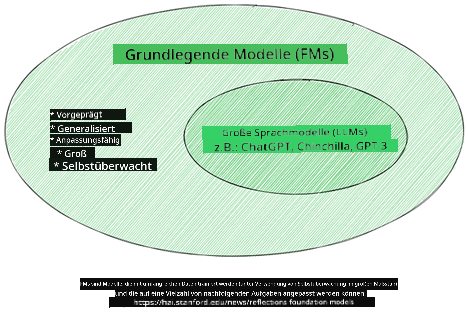

Bildquelle: [Essential Guide to Foundation Models and Large Language Models | von Babar M Bhatti | Medium](https://thebabar.medium.com/essential-guide-to-foundation-models-and-large-language-models-27dab58f7404)

Um diese Unterscheidung weiter zu verdeutlichen, nehmen wir ChatGPT als Beispiel. Für die erste Version von ChatGPT diente ein Modell namens GPT-3.5 als Foundation Model. Das bedeutet, dass OpenAI einige chat-spezifische Daten nutzte, um eine angepasste Version von GPT-3.5 zu erstellen, die speziell darauf ausgelegt ist, in Konversationsszenarien wie Chatbots gut zu funktionieren.

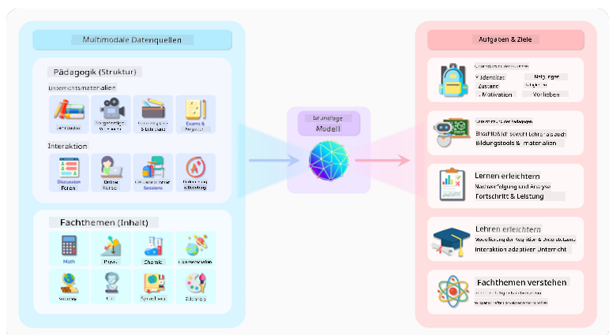

Bildquelle: [2108.07258.pdf (arxiv.org)](https://arxiv.org/pdf/2108.07258.pdf?WT.mc_id=academic-105485-koreyst)

### Open Source versus Proprietäre Modelle

Eine weitere Möglichkeit, LLMs zu kategorisieren, ist die Unterscheidung zwischen Open Source und proprietären Modellen.

Open-Source-Modelle sind Modelle, die der Öffentlichkeit zugänglich gemacht werden und von jedem genutzt werden können. Sie werden oft von der Firma, die sie entwickelt hat, oder von der Forschungsgemeinschaft bereitgestellt. Diese Modelle dürfen eingesehen, verändert und für verschiedene Anwendungsfälle angepasst werden. Allerdings sind sie nicht immer für den Produktionseinsatz optimiert und können in der Leistung hinter proprietären Modellen zurückbleiben. Zudem ist die Finanzierung von Open-Source-Modellen oft begrenzt, weshalb sie möglicherweise nicht langfristig gepflegt oder mit den neuesten Forschungsergebnissen aktualisiert werden. Beispiele für beliebte Open-Source-Modelle sind [Alpaca](https://crfm.stanford.edu/2023/03/13/alpaca.html?WT.mc_id=academic-105485-koreyst), [Bloom](https://huggingface.co/bigscience/bloom) und [LLaMA](https://llama.meta.com).

Proprietäre Modelle sind Modelle, die einem Unternehmen gehören und nicht öffentlich zugänglich sind. Diese Modelle sind oft für den Produktionseinsatz optimiert. Sie dürfen jedoch nicht eingesehen, verändert oder für verschiedene Anwendungsfälle angepasst werden. Außerdem sind sie nicht immer kostenlos verfügbar und erfordern möglicherweise ein Abonnement oder eine Zahlung. Nutzer haben zudem keine Kontrolle über die Daten, mit denen das Modell trainiert wurde, weshalb sie dem Modellbesitzer vertrauen müssen, dass Datenschutz und verantwortungsvoller KI-Einsatz gewährleistet sind. Beispiele für beliebte proprietäre Modelle sind [OpenAI-Modelle](https://platform.openai.com/docs/models/overview?WT.mc_id=academic-105485-koreyst), [Google Bard](https://sapling.ai/llm/bard?WT.mc_id=academic-105485-koreyst) oder [Claude 2](https://www.anthropic.com/index/claude-2?WT.mc_id=academic-105485-koreyst).

### Embedding versus Bildgenerierung versus Text- und Codegenerierung

LLMs können auch nach der Art der Ausgabe kategorisiert werden.

Embeddings sind Modelle, die Text in eine numerische Form umwandeln, das sogenannte Embedding, eine numerische Darstellung des Eingabetextes. Embeddings erleichtern es Maschinen, die Beziehungen zwischen Wörtern oder Sätzen zu verstehen, und können als Eingaben für andere Modelle verwendet werden, wie Klassifikations- oder Clustering-Modelle, die mit numerischen Daten besser arbeiten. Embedding-Modelle werden oft für Transfer Learning eingesetzt, bei dem ein Modell für eine Ersatzaufgabe mit vielen Daten trainiert wird und die Modellgewichte (Embeddings) dann für andere Folgeaufgaben wiederverwendet werden. Ein Beispiel für diese Kategorie sind [OpenAI Embeddings](https://platform.openai.com/docs/models/embeddings?WT.mc_id=academic-105485-koreyst).

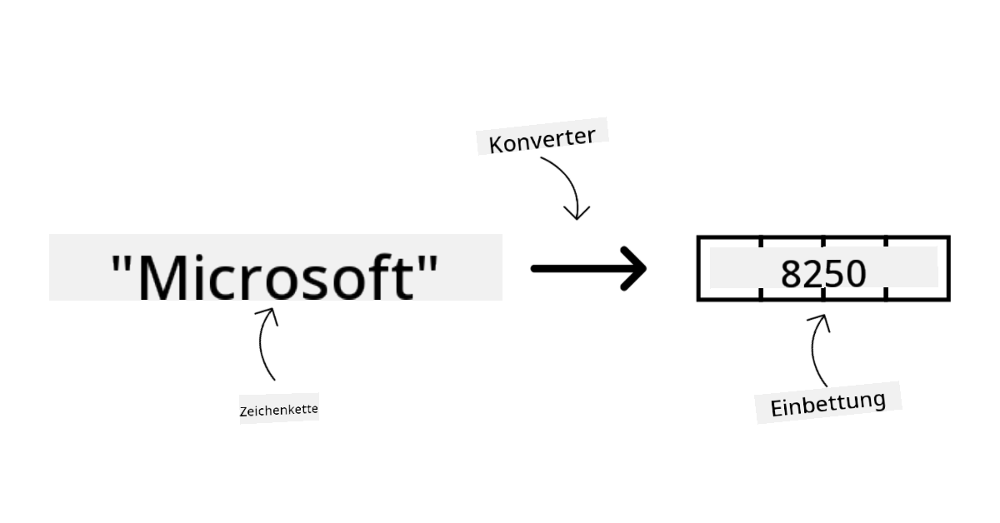

Bildgenerierungsmodelle erzeugen Bilder. Diese Modelle werden oft für Bildbearbeitung, Bildsynthese und Bildübersetzung verwendet. Sie werden häufig auf großen Bilddatensätzen wie [LAION-5B](https://laion.ai/blog/laion-5b/?WT.mc_id=academic-105485-koreyst) trainiert und können neue Bilder generieren oder bestehende Bilder mit Techniken wie Inpainting, Super-Resolution und Kolorierung bearbeiten. Beispiele sind [DALL-E-3](https://openai.com/dall-e-3?WT.mc_id=academic-105485-koreyst) und [Stable Diffusion Modelle](https://github.com/Stability-AI/StableDiffusion?WT.mc_id=academic-105485-koreyst).

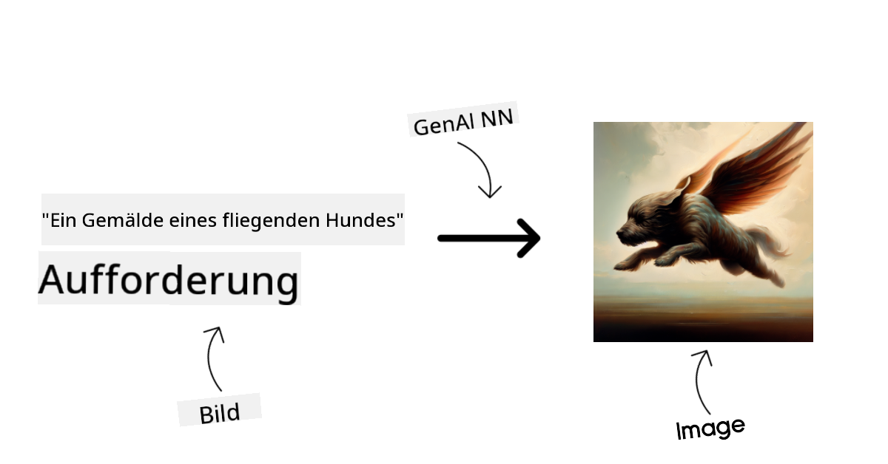

Text- und Codegenerierungsmodelle erzeugen Text oder Code. Diese Modelle werden oft für Textzusammenfassung, Übersetzung und Beantwortung von Fragen eingesetzt. Textgenerierungsmodelle werden häufig auf großen Textdatensätzen wie [BookCorpus](https://www.cv-foundation.org/openaccess/content_iccv_2015/html/Zhu_Aligning_Books_and_ICCV_2015_paper.html?WT.mc_id=academic-105485-koreyst) trainiert und können neuen Text generieren oder Fragen beantworten. Codegenerierungsmodelle, wie [CodeParrot](https://huggingface.co/codeparrot?WT.mc_id=academic-105485-koreyst), werden oft auf großen Code-Datensätzen wie GitHub trainiert und können neuen Code generieren oder Fehler im bestehenden Code beheben.

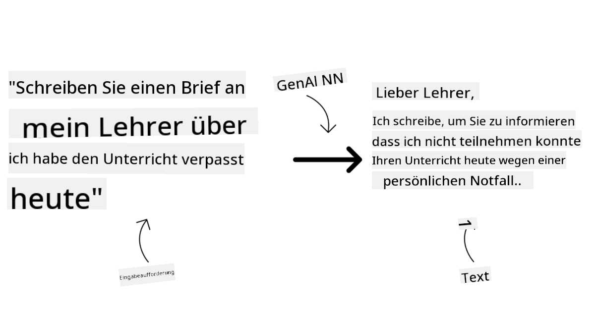

### Encoder-Decoder versus Decoder-only

Um die verschiedenen Architekturtypen von LLMs zu erklären, verwenden wir eine Analogie.

Stellen Sie sich vor, Ihr Vorgesetzter gibt Ihnen die Aufgabe, ein Quiz für die Schüler zu erstellen. Sie haben zwei Kollegen: Einer ist für die Erstellung der Inhalte zuständig, der andere für die Überprüfung.

Der Inhaltsersteller ist wie ein Decoder-only Modell: Er schaut sich das Thema an und sieht, was Sie bereits geschrieben haben, und kann darauf basierend einen Kurs erstellen. Sie sind sehr gut darin, ansprechende und informative Inhalte zu schreiben, aber nicht so gut darin, das Thema und die Lernziele zu verstehen. Beispiele für Decoder-Modelle sind die GPT-Familie, wie GPT-3.

Der Prüfer ist wie ein Encoder-only Modell: Er schaut sich den geschriebenen Kurs und die Antworten an, erkennt die Zusammenhänge und versteht den Kontext, ist aber nicht gut darin, Inhalte zu generieren. Ein Beispiel für ein Encoder-only Modell ist BERT.

Stellen Sie sich vor, es gäbe jemanden, der sowohl erstellen als auch prüfen kann – das ist ein Encoder-Decoder Modell. Beispiele dafür sind BART und T5.

### Service versus Modell

Kommen wir nun zum Unterschied zwischen einem Service und einem Modell. Ein Service ist ein Produkt, das von einem Cloud-Service-Anbieter angeboten wird und oft eine Kombination aus Modellen, Daten und anderen Komponenten darstellt. Ein Modell ist die Kernkomponente eines Services und oft ein Foundation Model, wie ein LLM.

Services sind oft für den Produktionseinsatz optimiert und über eine grafische Benutzeroberfläche leichter zu nutzen als Modelle. Allerdings sind Services nicht immer kostenlos verfügbar und erfordern möglicherweise ein Abonnement oder eine Zahlung, im Gegenzug dafür, dass Nutzer die Infrastruktur und Ressourcen des Service-Anbieters nutzen, Kosten optimieren und Skalierung erleichtern können. Ein Beispiel für einen Service ist der [Azure OpenAI Service](https://learn.microsoft.com/azure/ai-services/openai/overview?WT.mc_id=academic-105485-koreyst), der ein nutzungsbasiertes Preismodell anbietet, bei dem Nutzer proportional zur Nutzung zahlen. Zudem bietet Azure OpenAI Service Unternehmenssicherheit und einen verantwortungsvollen KI-Rahmen zusätzlich zu den Modellfähigkeiten.

Modelle sind nur das neuronale Netzwerk mit Parametern, Gewichten und mehr. Unternehmen können diese lokal betreiben, müssten dafür aber Hardware anschaffen, eine Infrastruktur zum Skalieren aufbauen und eine Lizenz erwerben oder ein Open-Source-Modell verwenden. Ein Modell wie LLaMA steht zur Nutzung bereit, benötigt aber Rechenleistung, um betrieben zu werden.

## Wie man verschiedene Modelle testet und iteriert, um die Leistung in Azure zu verstehen

Sobald unser Team die aktuelle LLM-Landschaft erkundet und einige vielversprechende Kandidaten für ihre Szenarien identifiziert hat, besteht der nächste Schritt darin, diese mit ihren Daten und ihrer Arbeitslast zu testen. Dies ist ein iterativer Prozess, der durch Experimente und Messungen erfolgt.
Die meisten der in den vorherigen Abschnitten erwähnten Modelle (OpenAI-Modelle, Open-Source-Modelle wie Llama2 und Hugging Face Transformer) sind im [Model Catalog](https://learn.microsoft.com/azure/ai-studio/how-to/model-catalog-overview?WT.mc_id=academic-105485-koreyst) in [Azure AI Studio](https://ai.azure.com/?WT.mc_id=academic-105485-koreyst) verfügbar.

[Azure AI Studio](https://learn.microsoft.com/azure/ai-studio/what-is-ai-studio?WT.mc_id=academic-105485-koreyst) ist eine Cloud-Plattform, die Entwicklern ermöglicht, generative KI-Anwendungen zu erstellen und den gesamten Entwicklungszyklus – von der Experimentierung bis zur Bewertung – zu verwalten, indem alle Azure AI-Dienste in einem einzigen Hub mit einer benutzerfreundlichen GUI kombiniert werden. Der Model Catalog in Azure AI Studio ermöglicht es dem Nutzer:

- Das gewünschte Foundation Model im Katalog zu finden – entweder proprietär oder Open Source, gefiltert nach Aufgabe, Lizenz oder Name. Um die Suche zu erleichtern, sind die Modelle in Sammlungen organisiert, wie z. B. Azure OpenAI Collection, Hugging Face Collection und weitere.

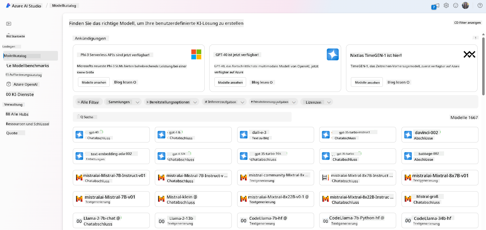

- Die Model Card einzusehen, die eine detaillierte Beschreibung der vorgesehenen Nutzung und der Trainingsdaten, Codebeispiele sowie Bewertungsergebnisse aus der internen Evaluationsbibliothek enthält.

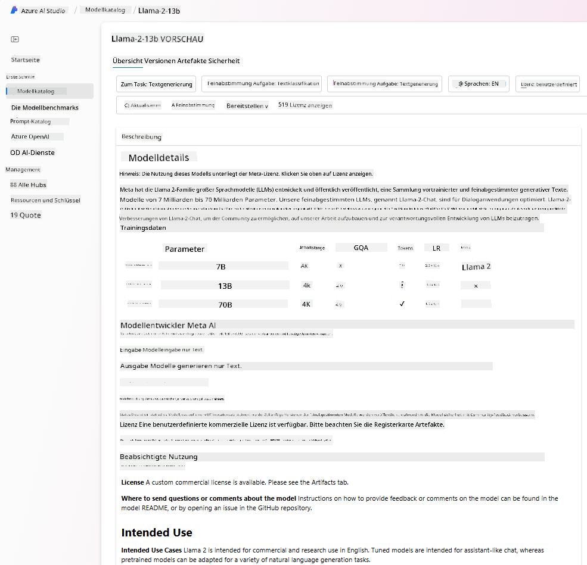

- Benchmarks verschiedener Modelle und Datensätze aus der Branche zu vergleichen, um zu beurteilen, welches Modell am besten zum jeweiligen Geschäftsszenario passt, über das [Model Benchmarks](https://learn.microsoft.com/azure/ai-studio/how-to/model-benchmarks?WT.mc_id=academic-105485-koreyst)-Fenster.

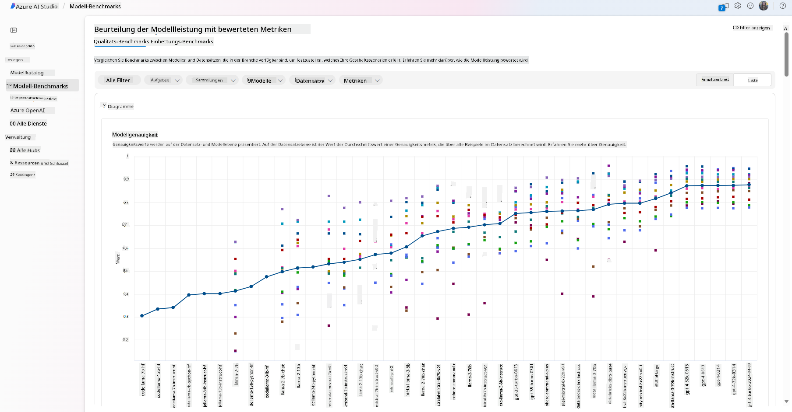

- Das Modell mit eigenen Trainingsdaten feinabzustimmen, um die Leistung bei einer spezifischen Aufgabe zu verbessern, und dabei die Experimentier- und Tracking-Funktionen von Azure AI Studio zu nutzen.

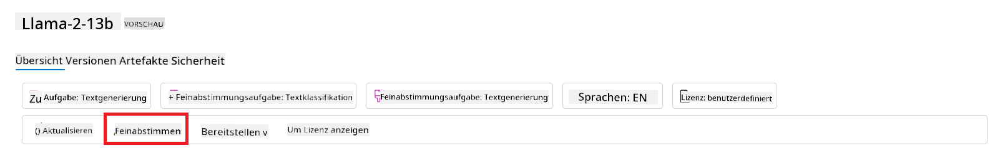

- Das ursprüngliche vortrainierte Modell oder die feinabgestimmte Version auf einem entfernten Echtzeit-Inferenz-Managed-Compute- oder serverlosen API-Endpunkt bereitzustellen – [pay-as-you-go](https://learn.microsoft.com/azure/ai-studio/how-to/model-catalog-overview#model-deployment-managed-compute-and-serverless-api-pay-as-you-go?WT.mc_id=academic-105485-koreyst) –, damit Anwendungen darauf zugreifen können.

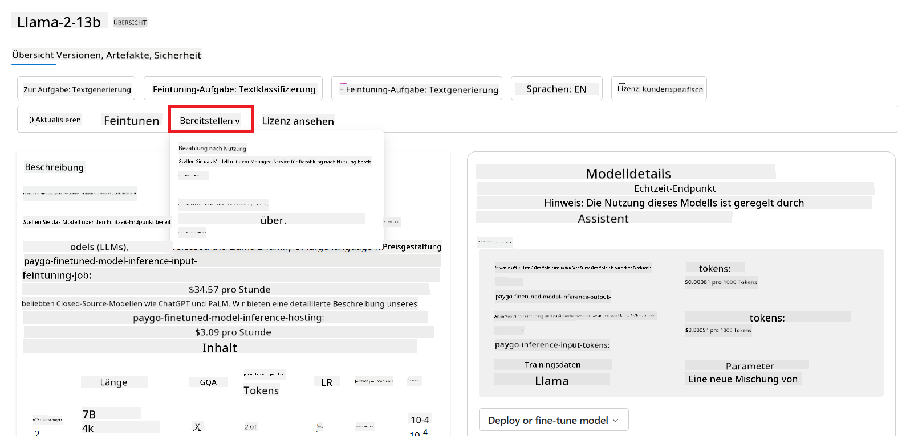

> [!NOTE]
> Nicht alle Modelle im Katalog sind derzeit für Fine-Tuning und/oder Pay-as-you-go-Bereitstellung verfügbar. Details zu den Fähigkeiten und Einschränkungen des Modells finden Sie in der Model Card.

## Verbesserung der LLM-Ergebnisse

Unser Startup-Team hat verschiedene Arten von LLMs und eine Cloud-Plattform (Azure Machine Learning) ausprobiert, die es uns ermöglicht, verschiedene Modelle zu vergleichen, sie mit Testdaten zu bewerten, die Leistung zu verbessern und sie auf Inferenz-Endpunkten bereitzustellen.

Aber wann sollte man ein Modell feinabstimmen, anstatt ein vortrainiertes Modell zu verwenden? Gibt es andere Ansätze, um die Modellleistung bei spezifischen Aufgaben zu verbessern?

Ein Unternehmen kann verschiedene Ansätze nutzen, um die gewünschten Ergebnisse von einem LLM zu erhalten. Beim Einsatz eines LLM in der Produktion kann man unterschiedliche Modelltypen mit verschiedenen Trainingsgraden auswählen, die sich in Komplexität, Kosten und Qualität unterscheiden. Hier einige Ansätze:

- **Prompt Engineering mit Kontext**. Die Idee ist, beim Prompt genügend Kontext zu liefern, um die gewünschten Antworten zu erhalten.

- **Retrieval Augmented Generation, RAG**. Ihre Daten könnten z. B. in einer Datenbank oder einem Web-Endpunkt vorliegen. Um sicherzustellen, dass diese Daten oder ein Teil davon beim Prompt berücksichtigt werden, können Sie die relevanten Daten abrufen und in den Prompt des Nutzers einfügen.

- **Feinabgestimmtes Modell**. Hier wird das Modell mit eigenen Daten weiter trainiert, was zu präziseren und besser auf die Bedürfnisse abgestimmten Ergebnissen führt, aber auch kostenintensiver sein kann.

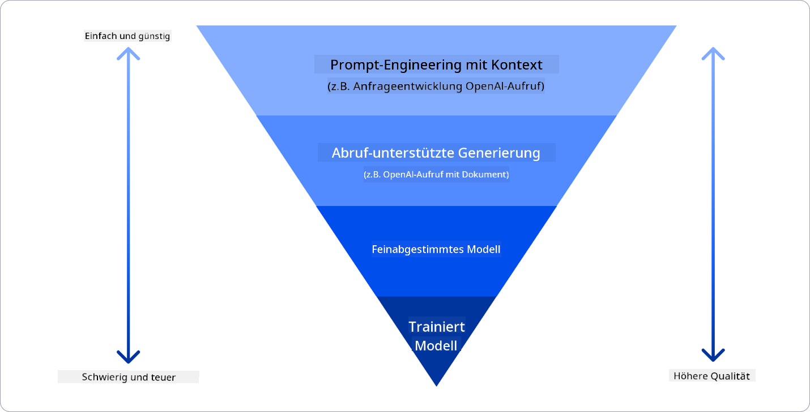

Bildquelle: [Four Ways that Enterprises Deploy LLMs | Fiddler AI Blog](https://www.fiddler.ai/blog/four-ways-that-enterprises-deploy-llms?WT.mc_id=academic-105485-koreyst)

### Prompt Engineering mit Kontext

Vortrainierte LLMs funktionieren sehr gut bei allgemeinen Aufgaben der natürlichen Sprache, selbst wenn man sie nur mit einem kurzen Prompt anspricht, wie einem Satz, der vervollständigt werden soll, oder einer Frage – das sogenannte „Zero-Shot“-Lernen.

Je mehr der Nutzer seine Anfrage jedoch mit einer detaillierten Beschreibung und Beispielen – dem Kontext – umrahmt, desto genauer und näher an den Erwartungen des Nutzers wird die Antwort sein. Man spricht von „One-Shot“-Lernen, wenn der Prompt nur ein Beispiel enthält, und von „Few-Shot“-Lernen, wenn mehrere Beispiele enthalten sind.
Prompt Engineering mit Kontext ist der kosteneffizienteste Ansatz, um zu starten.

### Retrieval Augmented Generation (RAG)

LLMs haben die Einschränkung, dass sie nur die Daten verwenden können, die während ihres Trainings genutzt wurden, um eine Antwort zu generieren. Das bedeutet, dass sie keine Kenntnisse über Ereignisse nach dem Training haben und keinen Zugriff auf nicht-öffentliche Informationen (wie Firmendaten) besitzen.
Dies kann durch RAG überwunden werden, eine Technik, die den Prompt mit externen Daten in Form von Dokumentenabschnitten erweitert, wobei die Längenbegrenzung des Prompts berücksichtigt wird. Unterstützt wird dies durch Vektor-Datenbank-Tools (wie [Azure Vector Search](https://learn.microsoft.com/azure/search/vector-search-overview?WT.mc_id=academic-105485-koreyst)), die nützliche Abschnitte aus verschiedenen vordefinierten Datenquellen abrufen und dem Prompt-Kontext hinzufügen.

Diese Technik ist besonders hilfreich, wenn ein Unternehmen nicht genügend Daten, Zeit oder Ressourcen für ein Fine-Tuning eines LLM hat, aber dennoch die Leistung bei einer spezifischen Aufgabe verbessern und das Risiko von Falschaussagen, also der Verzerrung der Realität oder schädlichen Inhalten, reduzieren möchte.

### Feinabgestimmtes Modell

Fine-Tuning ist ein Prozess, der Transfer Learning nutzt, um das Modell an eine nachgelagerte Aufgabe anzupassen oder ein spezifisches Problem zu lösen. Im Gegensatz zu Few-Shot-Lernen und RAG entsteht dabei ein neues Modell mit aktualisierten Gewichten und Biases. Es erfordert einen Satz von Trainingsbeispielen, die aus einem Eingabewert (dem Prompt) und der zugehörigen Ausgabe (der Vervollständigung) bestehen.
Dies ist der bevorzugte Ansatz, wenn:

- **Feinabgestimmte Modelle verwendet werden sollen**. Ein Unternehmen möchte lieber feinabgestimmte, weniger leistungsfähige Modelle (wie Embedding-Modelle) nutzen als hochleistungsfähige Modelle, um eine kostengünstigere und schnellere Lösung zu erhalten.

- **Latenz eine Rolle spielt**. Die Latenz ist für einen bestimmten Anwendungsfall wichtig, sodass sehr lange Prompts oder eine große Anzahl von Beispielen, von denen das Modell lernen soll, nicht möglich sind, da sie die Längenbegrenzung des Prompts überschreiten würden.

- **Aktualität wichtig ist**. Ein Unternehmen verfügt über viele hochwertige Daten und Ground-Truth-Labels sowie die Ressourcen, diese Daten über die Zeit aktuell zu halten.

### Trainiertes Modell

Ein LLM von Grund auf neu zu trainieren ist zweifellos der schwierigste und komplexeste Ansatz, der enorme Datenmengen, qualifizierte Ressourcen und entsprechende Rechenleistung erfordert. Diese Option sollte nur in Betracht gezogen werden, wenn ein Unternehmen einen domänenspezifischen Anwendungsfall und eine große Menge domänenspezifischer Daten hat.

## Wissensüberprüfung

Was könnte ein guter Ansatz sein, um die Ergebnisse eines LLM zu verbessern?

1. Prompt Engineering mit Kontext  
1. RAG  
1. Feinabgestimmtes Modell

A:3, wenn Sie Zeit, Ressourcen und hochwertige Daten haben, ist Fine-Tuning die bessere Option, um aktuell zu bleiben. Wenn Sie jedoch schnell Verbesserungen erzielen möchten und wenig Zeit haben, lohnt es sich, zunächst RAG in Betracht zu ziehen.

## 🚀 Herausforderung

Informieren Sie sich näher darüber, wie Sie [RAG](https://learn.microsoft.com/azure/search/retrieval-augmented-generation-overview?WT.mc_id=academic-105485-koreyst) für Ihr Unternehmen nutzen können.

## Großartige Arbeit, Lernen Sie weiter

Nach Abschluss dieser Lektion sehen Sie sich unsere [Generative AI Learning Collection](https://aka.ms/genai-collection?WT.mc_id=academic-105485-koreyst) an, um Ihr Wissen über Generative KI weiter zu vertiefen!

Gehen Sie zu Lektion 3, in der wir uns ansehen, wie man [Generative AI verantwortungsvoll einsetzt](../03-using-generative-ai-responsibly/README.md?WT.mc_id=academic-105485-koreyst)!

**Haftungsausschluss**:  
Dieses Dokument wurde mit dem KI-Übersetzungsdienst [Co-op Translator](https://github.com/Azure/co-op-translator) übersetzt. Obwohl wir uns um Genauigkeit bemühen, beachten Sie bitte, dass automatisierte Übersetzungen Fehler oder Ungenauigkeiten enthalten können. Das Originaldokument in seiner Ursprungssprache ist als maßgebliche Quelle zu betrachten. Für wichtige Informationen wird eine professionelle menschliche Übersetzung empfohlen. Wir übernehmen keine Haftung für Missverständnisse oder Fehlinterpretationen, die aus der Nutzung dieser Übersetzung entstehen.