# Erforschung und Vergleich verschiedener LLMs

[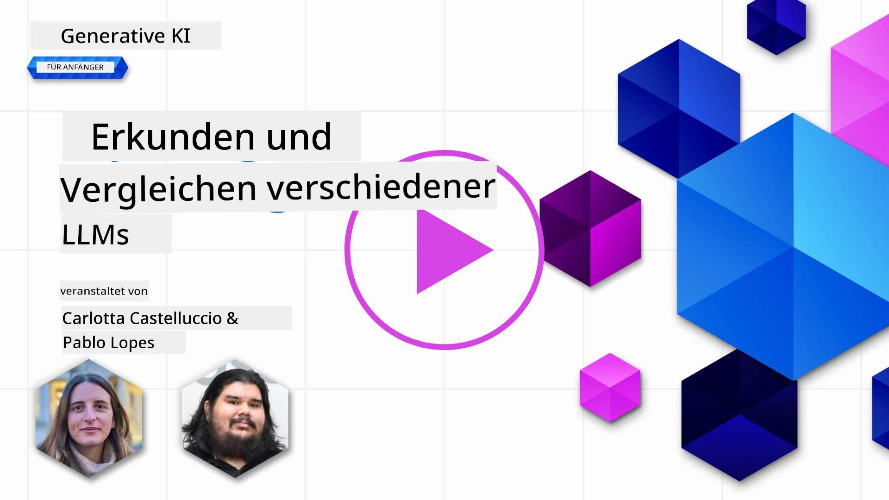](https://youtu.be/KIRUeDKscfI?si=8BHX1zvwzQBn-PlK)

> _Klicken Sie auf das obige Bild, um das Video zu dieser Lektion anzusehen_

In der vorherigen Lektion haben wir gesehen, wie Generative KI die Technologielandschaft verändert, wie Large Language Models (LLMs) funktionieren und wie ein Unternehmen – wie unser Startup – diese auf seine Anwendungsfälle anwenden und wachsen kann! In diesem Kapitel wollen wir verschiedene Arten von großen Sprachmodellen (LLMs) vergleichen und gegenüberstellen, um ihre Vor- und Nachteile zu verstehen.

Der nächste Schritt auf der Reise unseres Startups ist es, die aktuelle Landschaft der LLMs zu erkunden und zu verstehen, welche für unseren Anwendungsfall geeignet sind.

## Einführung

Diese Lektion behandelt:

- Verschiedene Typen von LLMs in der aktuellen Landschaft.
- Testen, Iterieren und Vergleichen verschiedener Modelle für Ihren Anwendungsfall in Azure.
- Wie man ein LLM bereitstellt.

## Lernziele

Nach Abschluss dieser Lektion werden Sie in der Lage sein:

- Das richtige Modell für Ihren Anwendungsfall auszuwählen.
- Zu verstehen, wie man die Leistung seines Modells testet, iteriert und verbessert.
- Zu wissen, wie Unternehmen Modelle bereitstellen.

## Unterschiedliche Arten von LLMs verstehen

LLMs können basierend auf ihrer Architektur, ihren Trainingsdaten und Anwendungsfällen in verschiedene Kategorien eingeteilt werden. Diese Unterschiede zu verstehen hilft unserem Startup, das richtige Modell für die jeweilige Situation auszuwählen und zu wissen, wie man testet, iteriert und die Leistung verbessert.

Es gibt viele verschiedene Arten von LLM-Modellen, Ihre Wahl hängt davon ab, wofür Sie sie einsetzen möchten, Ihre Daten, wie viel Sie bereit sind zu zahlen, und weiteren Faktoren.

Je nachdem, ob Sie die Modelle für Text-, Audio-, Video-, Bildgenerierung und ähnliches einsetzen möchten, wählen Sie möglicherweise einen anderen Modelltyp.

- **Audio- und Spracherkennung**. Whisper-ähnliche Modelle sind nach wie vor nützliche Allzweck-Spracherkennungsmodelle, aber Produktionsentscheidungen beinhalten jetzt auch neuere Speech-to-Text-Modelle wie `gpt-4o-transcribe`, `gpt-4o-mini-transcribe` und Diarisierungsvarianten. Bewerten Sie die Sprachabdeckung, Diarisierung, Echtzeitunterstützung, Latenz und Kosten für Ihren Anwendungsfall. Weitere Informationen finden Sie in der [OpenAI Speech-to-Text-Dokumentation](https://platform.openai.com/docs/guides/speech-to-text?WT.mc_id=academic-105485-koreyst).

- **Bildgenerierung**. DALL-E und Midjourney sind bekannte Optionen für die Bildgenerierung, aber aktuelle OpenAI-Bild-APIs konzentrieren sich auf GPT-Bildmodelle wie `gpt-image-2`, während Stable Diffusion, Imagen, Flux und andere Modellfamilien ebenfalls gebräuchliche Wahlmöglichkeiten sind. Vergleichen Sie Aufforderungstreue, Bearbeitungsunterstützung, Stilkontrolle, Sicherheitsanforderungen und Lizenzierung. Weitere Informationen finden Sie im [OpenAI Image Generation Guide](https://platform.openai.com/docs/guides/images?WT.mc_id=academic-105485-koreyst) und Kapitel 9 dieses Curriculums.

- **Textgenerierung**. Textmodelle umfassen jetzt Spitzenmodelle, Reasoning-Modelle, kleinere Low-Latency-Modelle und Open-Weight-Modelle. Aktuelle Beispiele sind OpenAI GPT-5.x-Modelle, Anthropic Claude 4.x-Modelle, Google Gemini 3.x-Modelle, Meta Llama 4-Modelle und Mistral-Modelle. Wählen Sie nicht nur nach Veröffentlichungsdatum oder Preis; vergleichen Sie Aufgabenqualität, Latenz, Kontextfenster, Werkzeugnutzung, Sicherheitsverhalten, regionale Verfügbarkeit und Gesamtkosten. Der [Microsoft Foundry Modellkatalog](https://ai.azure.com/catalog?WT.mc_id=academic-105485-koreyst) ist ein guter Ort, um Modelle zu vergleichen, die auf Azure verfügbar sind.

- **Multimodalität**. Viele aktuelle Modelle können mehr als nur Text verarbeiten. Einige akzeptieren Bild-, Audio- oder Videoeingaben; einige können Werkzeuge aufrufen; und spezialisierte Modelle können Bilder, Audio oder Video generieren. Beispielsweise unterstützen aktuelle OpenAI-Modelle Text- und Bildeingaben, Gemini-Modelle können je nach Variante Text, Code, Bild, Audio und Video-Eingaben unterstützen, und Llama 4 Scout und Maverick sind Open-Weight nativ multimodale Modelle. Überprüfen Sie stets jede Modellkarte auf unterstützte Ein- und Ausgabe-Modi, bevor Sie einen Workflow darum herum aufbauen.

Die Auswahl eines Modells bedeutet, dass Sie einige Grundfähigkeiten erhalten, die aber möglicherweise nicht ausreichen. Häufig haben Sie unternehmensspezifische Daten, über die das LLM irgendwie informiert werden muss. Es gibt einige verschiedene Möglichkeiten, wie man das angehen kann, mehr dazu in den kommenden Abschnitten.

### Foundation Models im Vergleich zu LLMs

Der Begriff Foundation Model wurde von [Stanford-Forschern geprägt](https://arxiv.org/abs/2108.07258?WT.mc_id=academic-105485-koreyst) und definiert als ein KI-Modell, das bestimmten Kriterien folgt, wie z.B.:

- **Sie werden mittels unüberwachtem oder selbstüberwachtem Lernen trainiert**, das heißt, sie werden mit unlabeled multimodalen Daten trainiert und benötigen keine menschliche Annotation oder Kennzeichnung der Daten für ihren Trainingsprozess.
- **Sie sind sehr große Modelle**, basierend auf sehr tiefen neuronalen Netzen, die auf Milliarden von Parametern trainiert sind.
- **Sie sind normalerweise dazu gedacht, als „Grundlage“ für andere Modelle zu dienen**, das heißt, sie können als Ausgangspunkt für den Aufbau anderer Modelle verwendet werden, was durch Feinabstimmung erfolgen kann.

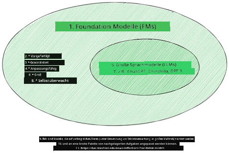

Bildquelle: [Essential Guide to Foundation Models and Large Language Models | von Babar M Bhatti | Medium
](https://thebabar.medium.com/essential-guide-to-foundation-models-and-large-language-models-27dab58f7404)

Um diese Unterscheidung weiter zu verdeutlichen, nehmen wir ChatGPT als historisches Beispiel. Frühere Versionen von ChatGPT verwendeten GPT-3.5 als Foundation Model. OpenAI nutzte dann chat-spezifische Daten und Ausrichtungstechniken, um eine abgestimmte Version zu erstellen, die in Konversationsszenarien, wie Chatbots, besser abschnitt. Moderne KI-Dienste leiten häufig zwischen mehreren Modellvarianten um, sodass der Dienstname und der zugrundeliegende Modellname nicht immer dasselbe sind.

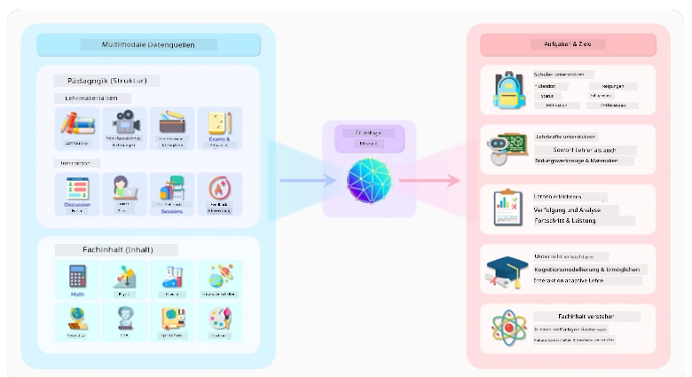

Bildquelle: [2108.07258.pdf (arxiv.org)](https://arxiv.org/pdf/2108.07258.pdf?WT.mc_id=academic-105485-koreyst)

### Open-Weight/Open-Source versus proprietäre Modelle

Eine weitere Möglichkeit, LLMs zu kategorisieren, ist, ob sie Open-Weight, Open-Source oder proprietär sind.

Open-Source- und Open-Weight-Modelle machen Modul-Artefakte zur Inspektion, zum Download oder zur Anpassung verfügbar, jedoch unterscheiden sich ihre Lizenzen. Einige sind vollständig Open Source, während andere Open-Weight-Modelle mit Nutzungsbeschränkungen sind. Sie können nützlich sein, wenn ein Unternehmen mehr Kontrolle über Bereitstellung, Datenlokalität, Kosten oder Anpassung benötigt. Teams müssen jedoch weiterhin Lizenzbedingungen, Servierkosten, Wartung, Sicherheitsupdates und Bewertungsqualität prüfen, bevor sie sie in der Produktion verwenden. Beispiele sind [Meta Llama 4](https://ai.meta.com/blog/llama-4-multimodal-intelligence/?WT.mc_id=academic-105485-koreyst), einige [Mistral-Modelle](https://docs.mistral.ai/models/overview?WT.mc_id=academic-105485-koreyst) und viele Modelle, die auf [Hugging Face](https://huggingface.co/models?WT.mc_id=academic-105485-koreyst) gehostet werden.

Proprietäre Modelle sind Eigentum eines Anbieters und werden von diesem gehostet. Diese Modelle sind oft für ihre Verwendung in verwalteter Produktion optimiert und können starken Support, Sicherheitssysteme, Werkzeugintegration und Skalierung bieten. Allerdings können Kunden in der Regel die Modellgewichte nicht einsehen oder ändern, und sie müssen die Bedingungen des Anbieters in Bezug auf Datenschutz, Aufbewahrung, Compliance und akzeptable Verwendung prüfen. Beispiele sind [OpenAI-Modelle](https://platform.openai.com/docs/models?WT.mc_id=academic-105485-koreyst), [Google Gemini](https://deepmind.google/models/gemini/pro/?WT.mc_id=academic-105485-koreyst) und [Anthropic Claude](https://platform.claude.com/docs/en/about-claude/models/overview?WT.mc_id=academic-105485-koreyst).

### Embedding versus Bildgenerierung versus Text- und Codegenerierung

LLMs können auch nach dem ausgegebenen Typ kategorisiert werden.

Embeddings sind eine Gruppe von Modellen, die Text in eine numerische Form umwandeln können, genannt Embedding, eine numerische Repräsentation des Eingangstextes. Embeddings erleichtern Maschinen das Verständnis der Beziehungen zwischen Wörtern oder Sätzen und können als Eingaben von anderen Modellen, wie Klassifikationsmodellen oder Clustermodellen, die auf numerischen Daten besser performen, genutzt werden. Embedding-Modelle werden häufig für Transfer Learning verwendet, bei dem ein Modell für eine Ersatzaufgabe mit großen Datenmengen gebaut wird und dann die Modellgewichte (Embeddings) für andere nachgelagerte Aufgaben wiederverwendet werden. Ein Beispiel für diese Kategorie sind [OpenAI Embeddings](https://platform.openai.com/docs/models/embeddings?WT.mc_id=academic-105485-koreyst).

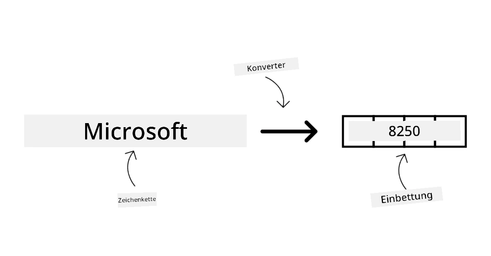

Bildgenerierungsmodelle sind Modelle, die Bilder generieren. Diese Modelle werden oft für Bildbearbeitung, Bildsynthese und Bildübersetzung verwendet. Bildgenerierungsmodelle werden häufig mit großen Datensätzen von Bildern trainiert, wie z.B. [LAION-5B](https://laion.ai/blog/laion-5b/?WT.mc_id=academic-105485-koreyst), und können verwendet werden, um neue Bilder zu erzeugen oder bestehende Bilder mit Inpainting-, Superauflösungs- und Kolorierungstechniken zu bearbeiten. Beispiele sind [GPT Bildmodelle](https://platform.openai.com/docs/guides/images?WT.mc_id=academic-105485-koreyst), [Stable Diffusion Modelle](https://github.com/Stability-AI/StableDiffusion?WT.mc_id=academic-105485-koreyst) und Imagen-Modelle.

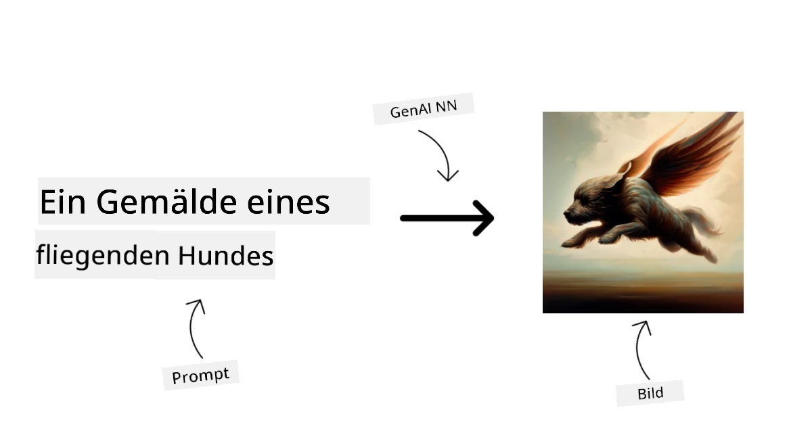

Text- und Codegenerierungsmodelle sind Modelle, die Text oder Code generieren. Diese Modelle werden oft für Textzusammenfassung, Übersetzung und Fragebeantwortung verwendet. Textgenerierungsmodelle werden häufig auf großen Textdatensätzen wie [BookCorpus](https://www.cv-foundation.org/openaccess/content_iccv_2015/html/Zhu_Aligning_Books_and_ICCV_2015_paper.html?WT.mc_id=academic-105485-koreyst) trainiert und können verwendet werden, um neuen Text zu generieren oder Fragen zu beantworten. Codegenerierungsmodelle, wie [CodeParrot](https://huggingface.co/codeparrot?WT.mc_id=academic-105485-koreyst), werden oft auf großen Code-Datensätzen wie GitHub trainiert und können neuen Code generieren oder Bugs im bestehenden Code beheben.

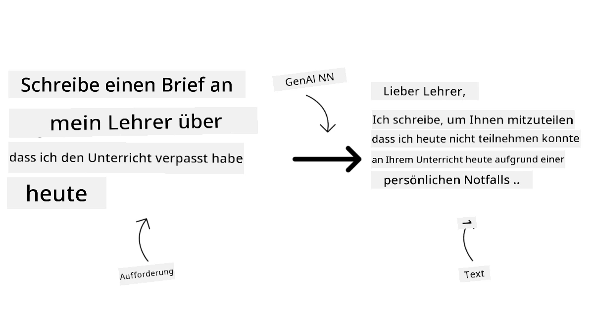

### Encoder-Decoder versus Decoder-only

Um die verschiedenen Architekturtypen von LLMs zu erläutern, verwenden wir eine Analogie.

Stellen Sie sich vor, Ihr Manager gibt Ihnen die Aufgabe, ein Quiz für die Schüler zu schreiben. Sie haben zwei Kollegen; einer überwacht die Erstellung des Inhalts und der andere überprüft sie.

Der Inhaltsersteller ist wie ein Decoder-only-Modell: Er kann sich das Thema anschauen, sehen, was Sie bereits geschrieben haben, und dann basierend auf diesem Kontext weiteren Inhalt generieren. Sie sind sehr gut darin, ansprechenden und informativen Inhalt zu erstellen, aber nicht immer die beste Wahl, wenn die Aufgabe nur darin besteht, zu klassifizieren, abzurufen oder Informationen zu kodieren. Beispiele für Decoder-only-Modellfamilien sind GPT- und Llama-Modelle.

Der Prüfer ist wie ein Encoder-only-Modell: Er betrachtet den geschriebenen Kurs und die Antworten, erkennt die Beziehung zwischen ihnen und versteht den Kontext, ist aber nicht gut im Generieren von Inhalten. Ein Beispiel für ein Encoder-only-Modell wäre BERT.

Stellen Sie sich vor, wir könnten auch jemanden haben, der sowohl das Quiz erstellt als auch überprüft, das ist ein Encoder-Decoder-Modell. Beispiele hierfür sind BART und T5.

### Dienst versus Modell

Kommen wir nun zum Unterschied zwischen einem Dienst und einem Modell. Ein Dienst ist ein Produkt, das von einem Cloud-Service-Provider angeboten wird und oft eine Kombination aus Modellen, Daten und anderen Komponenten darstellt. Ein Modell ist die zentrale Komponente eines Dienstes und ist oft ein Foundation Model wie ein LLM.

Dienste sind häufig für den Produktionseinsatz optimiert und sind oft über eine grafische Benutzeroberfläche einfacher zu nutzen als Modelle. Dienste sind jedoch nicht immer kostenlos verfügbar und können ein Abonnement oder eine Zahlung erfordern, im Gegenzug für die Nutzung der Ausrüstung und Ressourcen des Dienstanbieters, Optimierung der Ausgaben und einfache Skalierung. Ein Beispiel für einen Dienst ist der [Azure OpenAI Service](https://learn.microsoft.com/azure/ai-services/openai/overview?WT.mc_id=academic-105485-koreyst), der ein Pay-as-you-go-Tarifmodell anbietet, was bedeutet, dass Benutzer proportional zur Nutzung des Dienstes abgerechnet werden. Azure OpenAI Service bietet auch Unternehmenssicherheit und ein verantwortungsbewusstes KI-Rahmenwerk zusätzlich zu den Fähigkeiten der Modelle.

Modelle sind die neuronalen Netzwerk-Artefakte: Parameter, Gewichte, Architektur, Tokenizer und unterstützende Konfiguration. Ein Modell lokal oder in einer privaten Umgebung auszuführen, erfordert geeignete Hardware, Bereitstellungsinfrastruktur, Überwachung und entweder eine kompatible Open-Source/Open-Weight-Lizenz oder eine kommerzielle Lizenz. Open-Weight-Modelle wie Llama 4 oder Mistral-Modelle können selbst gehostet werden, erfordern aber weiterhin Rechenleistung und operatives Know-how.

## Wie man mit verschiedenen Modellen testet und iteriert, um die Leistung auf Azure zu verstehen

Sobald unser Team die aktuelle LLM-Landschaft erkundet und einige geeignete Kandidaten für ihre Szenarien identifiziert hat, besteht der nächste Schritt darin, diese anhand ihrer Daten und ihrer Arbeitslast zu testen. Dies ist ein iterativer Prozess, der mittels Experimenten und Messungen durchgeführt wird.
Die meisten der in den vorherigen Absätzen genannten Modelle (OpenAI-Modelle, offene Gewichtsmodelle wie Llama 4 und Mistral sowie Hugging Face-Modelle) sind in [Microsoft Foundry Models](https://learn.microsoft.com/azure/foundry/concepts/foundry-models-overview?WT.mc_id=academic-105485-koreyst) verfügbar.

[Microsoft Foundry](https://learn.microsoft.com/azure/foundry/what-is-foundry?WT.mc_id=academic-105485-koreyst), ehemals Azure AI Studio/Azure AI Foundry, ist eine einheitliche Azure-Plattform zum Erstellen von KI-Anwendungen und -Agenten. Sie unterstützt Entwickler beim gesamten Lebenszyklus von Experimentierung und Bewertung bis hin zu Bereitstellung, Überwachung und Governance. Der Modellkatalog in Microsoft Foundry ermöglicht dem Benutzer:

- Das gewünschte Basismodell im Katalog zu finden, einschließlich Modelle, die von Azure verkauft werden, sowie Modelle von Partnern und Community-Anbietern. Benutzer können nach Aufgabe, Anbieter, Lizenz, Bereitstellungsoption oder Name filtern.

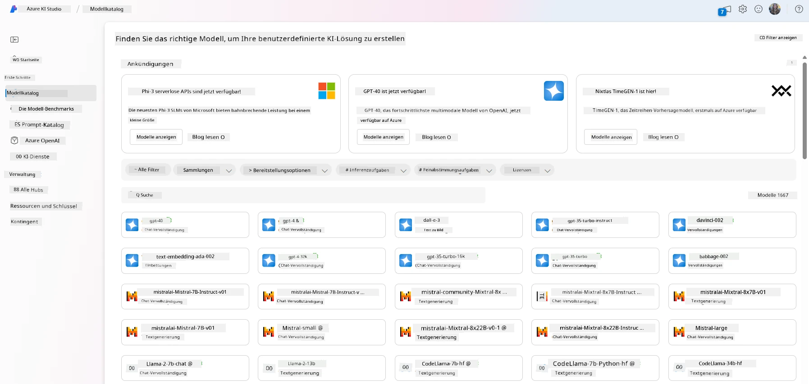

- Eine Modellkarte zu überprüfen, die eine ausführliche Beschreibung der beabsichtigten Nutzung und der Trainingsdaten, Codebeispiele und Bewertungsergebnisse aus der internen Evaluationsbibliothek enthält.

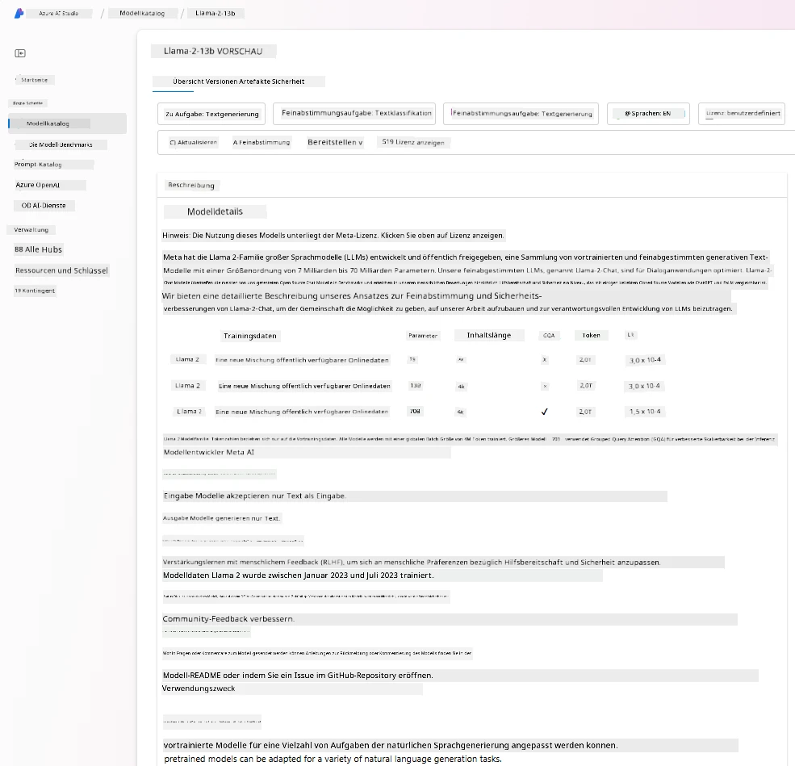

- Benchmark-Ergebnisse über Modelle und Datensätze aus der Branche zu vergleichen, um zu beurteilen, welches Modell das Geschäftsszenario am besten erfüllt, über das [Model Benchmarks](https://learn.microsoft.com/azure/ai-studio/how-to/model-benchmarks?WT.mc_id=academic-105485-koreyst) Panel.

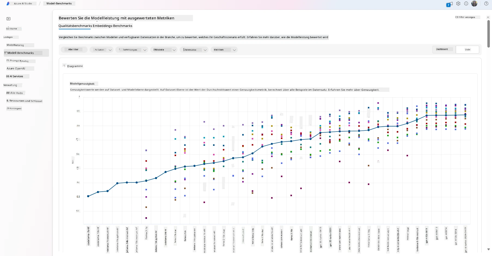

- Unterstützte Modelle an eigenen Trainingsdaten feinabzustimmen, um die Modellleistung in einer spezifischen Arbeitslast zu verbessern, unter Nutzung der Experimentier- und Nachverfolgungsfunktionen von Microsoft Foundry.

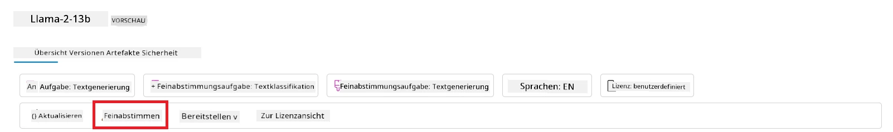

- Das original vortrainierte Modell oder die feinabgestimmte Version an einem entfernten Echtzeit-Inferenzendpunkt bereitzustellen, unter Verwendung von verwalteten Compute- oder serverlosen Bereitstellungsoptionen, damit Anwendungen darauf zugreifen können.

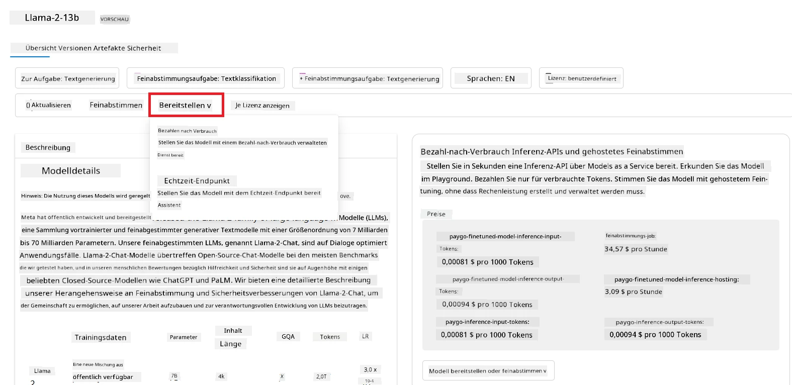

> [!NOTE]
> Nicht alle Modelle im Katalog sind derzeit für Feinabstimmung und/oder nutzungsbasierte Bereitstellung verfügbar. Überprüfen Sie die Modellkarte für Details zu den Fähigkeiten und Einschränkungen des Modells.

## Verbesserung der LLM-Ergebnisse

Unser Startup-Team hat verschiedene Arten von LLMs und eine Cloud-Plattform (Microsoft Foundry) erkundet, die es uns ermöglicht, verschiedene Modelle zu vergleichen, sie auf Testdaten zu bewerten, die Leistung zu verbessern und sie an Inferenzendpunkten bereitzustellen.

Aber wann sollte man ein Modell feinabstimmen anstatt ein vortrainiertes Modell zu verwenden? Gibt es andere Ansätze, um die Modellleistung bei spezifischen Arbeitslasten zu verbessern?

Ein Unternehmen kann verschiedene Ansätze nutzen, um die gewünschten Ergebnisse aus einem LLM zu erzielen. Beim Einsatz eines LLM in der Produktion können Sie verschiedene Modelltypen mit unterschiedlichen Trainingsgraden auswählen, die unterschiedliche Komplexitäts-, Kosten- und Qualitätsstufen aufweisen. Hier sind einige verschiedene Ansätze:

- **Prompt Engineering mit Kontext**. Die Idee ist, beim Prompten genügend Kontext bereitzustellen, um die benötigten Antworten zu erhalten.

- **Retrieval Augmented Generation, RAG**. Ihre Daten könnten z. B. in einer Datenbank oder an einem Web-Endpunkt vorliegen; um sicherzustellen, dass diese Daten oder ein Teil davon zum Zeitpunkt des Promptings berücksichtigt werden, können Sie die relevanten Daten abrufen und als Teil des Benutzerprompts einfügen.

- **Feinabgestimmtes Modell**. Hier haben Sie das Modell weiter auf eigenen Daten trainiert, was dazu führt, dass das Modell genauer und reaktionsschneller auf Ihre Bedürfnisse reagiert, jedoch möglicherweise kostenintensiv ist.

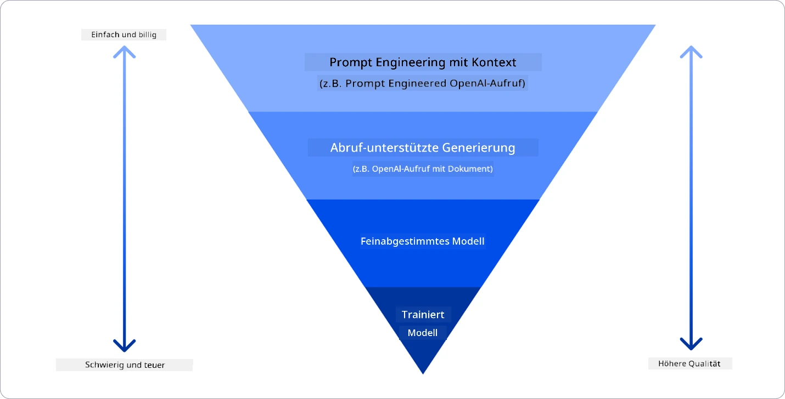

Bildquelle: [Four Ways that Enterprises Deploy LLMs | Fiddler AI Blog](https://www.fiddler.ai/blog/four-ways-that-enterprises-deploy-llms?WT.mc_id=academic-105485-koreyst)

### Prompt Engineering mit Kontext

Vorgefertigte LLMs funktionieren sehr gut bei generalisierten Aufgaben der natürlichen Sprache, sogar mit einem kurzen Prompt, wie einem Satz, den es zu vervollständigen gilt, oder einer Frage – dem sogenannten „Zero-Shot“-Lernen.

Je mehr der Benutzer jedoch seine Anfrage mit einer detaillierten Anforderung und Beispielen – dem Kontext – rahmen kann, desto genauer und näher an den Erwartungen des Benutzers wird die Antwort sein. In diesem Fall sprechen wir von „One-Shot“-Lernen, wenn der Prompt nur ein Beispiel enthält, und von „Few-Shot“-Lernen, wenn mehrere Beispiele enthalten sind.
Prompt Engineering mit Kontext ist der kosteneffektivste Ansatz, um zu starten.

### Retrieval Augmented Generation (RAG)

LLMs haben die Einschränkung, dass sie nur die Daten verwenden können, die während ihres Trainings verwendet wurden, um eine Antwort zu generieren. Das bedeutet, dass sie nichts über Fakten wissen, die nach ihrem Trainingsprozess passiert sind, und keinen Zugriff auf nicht öffentliche Informationen (wie Firmendaten) haben.
Dieses Problem kann durch RAG überwunden werden, eine Technik, die den Prompt mit externen Daten in Form von Dokumentauszügen erweitert, unter Berücksichtigung der Grenzen der Prompt-Länge. Dies wird unterstützt durch Vektordatenbank-Tools (wie [Azure Vector Search](https://learn.microsoft.com/azure/search/vector-search-overview?WT.mc_id=academic-105485-koreyst)), die nützliche Ausschnitte aus verschiedenen vordefinierten Datenquellen abrufen und dem Kontext des Prompts hinzufügen.

Diese Technik ist besonders hilfreich, wenn ein Unternehmen nicht genügend Daten, Zeit oder Ressourcen hat, um ein LLM feinabzustimmen, aber dennoch die Leistung bei einer spezifischen Arbeitslast verbessern und Risiken von halluzinierten, veralteten oder nicht unterstützten Antworten reduzieren möchte.

### Feinabgestimmtes Modell

Feinabstimmung ist ein Prozess, der Transferlernen nutzt, um das Modell an eine nachgelagerte Aufgabe oder zur Lösung eines spezifischen Problems „anzupassen“. Anders als beim Few-Shot-Lernen und RAG resultiert dies in einem neuen Modell mit aktualisierten Gewichten und Biases. Es erfordert einen Satz von Trainingsbeispielen, die aus einer einzelnen Eingabe (dem Prompt) und der zugehörigen Ausgabe (der Vervollständigung) bestehen.
Dies wäre der bevorzugte Ansatz, wenn:

- **Kleinere, spezifische Modelle verwenden**. Ein Unternehmen möchte ein kleineres Modell für eine enge Aufgabe feinabstimmen, anstatt wiederholt einen größeren Frontier-Modell zu prompten, was zu einer kostengünstigeren und schnelleren Lösung führt.

- **Latenz berücksichtigen**. Die Latenz ist für einen spezifischen Anwendungsfall wichtig, sodass es nicht möglich ist, sehr lange Prompts oder eine hohe Anzahl von Beispielen zu verwenden, die das Modell lernen soll und die nicht mit der Prompt-Längenbegrenzung kompatibel sind.

- **Stabiles Verhalten anpassen**. Ein Unternehmen hat viele hochwertige Beispiele und möchte, dass das Modell konsequent einem Aufgabenmuster, einem Ausgabeformat, einem Ton oder einem domänenspezifischen Stil folgt. Wenn das Hauptproblem neue Fakten oder private Kenntnisse sind, die sich oft ändern, verwenden Sie RAG anstelle sich nur auf Feinabstimmung zu verlassen.

### Trainiertes Modell

Ein LLM von Grund auf zu trainieren ist zweifellos der schwierigste und komplexeste Ansatz, der enorme Datenmengen, qualifizierte Ressourcen und angemessene Rechenleistung erfordert. Diese Option sollte nur in Betracht gezogen werden, wenn ein Unternehmen einen domänenspezifischen Anwendungsfall und eine große Menge domänenzentrischer Daten hat.

## Wissenskontrolle

Was könnte ein guter Ansatz sein, um LLM-Ergebnisse zu verbessern?

1. Prompt Engineering mit Kontext
1. RAG
1. Feinabgestimmtes Modell

A: Alle drei können helfen. Beginnen Sie mit Prompt Engineering und Kontext für schnelle Verbesserungen und verwenden Sie RAG, wenn das Modell aktuelle Fakten oder private Geschäftsdaten benötigt. Wählen Sie Feinabstimmung, wenn Sie genügend hochwertige Beispiele haben und das Modell konsequent einer Aufgabe, einem Format, einem Ton oder einem Domänenmuster folgen soll.

## 🚀 Herausforderung

Lesen Sie weiter, wie Sie [RAG](https://learn.microsoft.com/azure/search/retrieval-augmented-generation-overview?WT.mc_id=academic-105485-koreyst) für Ihr Unternehmen einsetzen können.

## Großartige Arbeit, setzen Sie Ihr Lernen fort

Nach Abschluss dieser Lektion schauen Sie sich unsere [Generative AI Learning collection](https://aka.ms/genai-collection?WT.mc_id=academic-105485-koreyst) an, um Ihr Wissen über Generative KI weiter zu vertiefen!

Gehen Sie weiter zu Lektion 3, in der wir betrachten, wie man [verantwortungsvoll mit Generativer KI entwickelt](../03-using-generative-ai-responsibly/README.md?WT.mc_id=academic-105485-koreyst)!

---

<!-- CO-OP TRANSLATOR DISCLAIMER START -->
**Haftungsausschluss**:
Dieses Dokument wurde mit dem KI-Übersetzungsdienst [Co-op Translator](https://github.com/Azure/co-op-translator) übersetzt. Obwohl wir uns um Genauigkeit bemühen, beachten Sie bitte, dass automatisierte Übersetzungen Fehler oder Ungenauigkeiten enthalten können. Das Originaldokument in seiner Ursprungssprache gilt als maßgebliche Quelle. Bei kritischen Informationen wird eine professionelle menschliche Übersetzung empfohlen. Wir übernehmen keine Haftung für Missverständnisse oder Fehlinterpretationen, die aus der Verwendung dieser Übersetzung entstehen.
<!-- CO-OP TRANSLATOR DISCLAIMER END -->