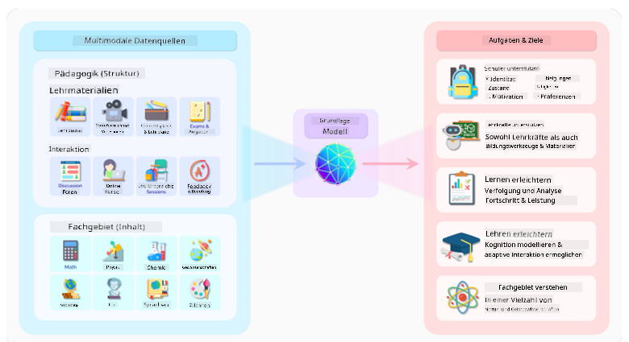
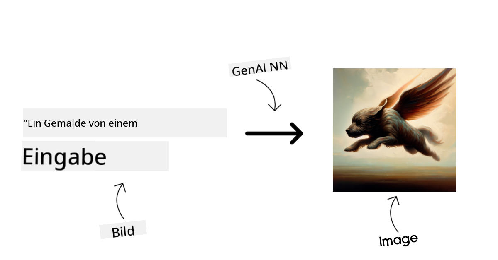
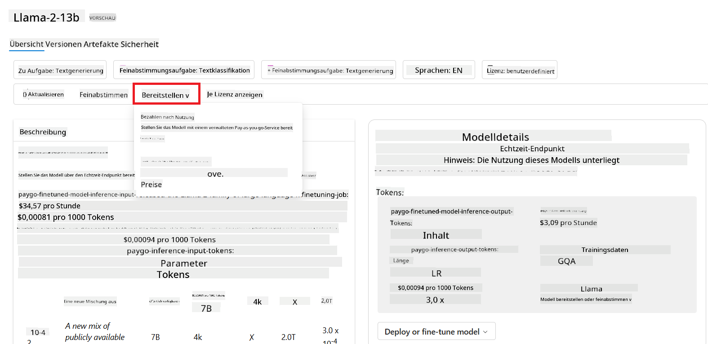

<!--
CO_OP_TRANSLATOR_METADATA:
{
  "original_hash": "6b7629b8ee4d7d874a27213e903d86a7",
  "translation_date": "2025-10-17T22:56:27+00:00",
  "source_file": "02-exploring-and-comparing-different-llms/README.md",
  "language_code": "de"
}
-->
# Erkundung und Vergleich verschiedener LLMs

> _Klicken Sie auf das Bild oben, um das Video zu dieser Lektion anzusehen_

In der vorherigen Lektion haben wir gesehen, wie Generative KI die Technologielandschaft verändert, wie Large Language Models (LLMs) funktionieren und wie ein Unternehmen – wie unser Startup – sie für seine Anwendungsfälle nutzen und wachsen kann! In diesem Kapitel wollen wir verschiedene Arten von großen Sprachmodellen (LLMs) vergleichen, um ihre Vor- und Nachteile zu verstehen.

Der nächste Schritt auf der Reise unseres Startups besteht darin, die aktuelle Landschaft der LLMs zu erkunden und zu verstehen, welche für unseren Anwendungsfall geeignet sind.

## Einführung

Diese Lektion behandelt:

- Verschiedene Arten von LLMs in der aktuellen Landschaft.
- Testen, Iterieren und Vergleichen verschiedener Modelle für Ihren Anwendungsfall in Azure.
- Wie man ein LLM bereitstellt.

## Lernziele

Nach Abschluss dieser Lektion können Sie:

- Das richtige Modell für Ihren Anwendungsfall auswählen.
- Verstehen, wie Sie die Leistung Ihres Modells testen, iterieren und verbessern können.
- Wissen, wie Unternehmen Modelle bereitstellen.

## Verschiedene Arten von LLMs verstehen

LLMs können basierend auf ihrer Architektur, ihren Trainingsdaten und ihrem Anwendungsfall in verschiedene Kategorien eingeteilt werden. Das Verständnis dieser Unterschiede hilft unserem Startup, das richtige Modell für das Szenario auszuwählen und zu verstehen, wie man testet, iteriert und die Leistung verbessert.

Es gibt viele verschiedene Arten von LLM-Modellen, und Ihre Wahl hängt davon ab, wofür Sie sie verwenden möchten, welche Daten Sie haben, wie viel Sie bereit sind zu zahlen und mehr.

Je nachdem, ob Sie die Modelle für Text-, Audio-, Video-, Bildgenerierung usw. verwenden möchten, könnten Sie sich für eine andere Art von Modell entscheiden.

- **Audio- und Spracherkennung**. Für diesen Zweck sind Modelle vom Typ Whisper eine ausgezeichnete Wahl, da sie universell einsetzbar und auf Spracherkennung ausgerichtet sind. Sie sind auf vielfältige Audiodaten trainiert und können mehrsprachige Spracherkennung durchführen. Erfahren Sie mehr über [Whisper-Modelle hier](https://platform.openai.com/docs/models/whisper?WT.mc_id=academic-105485-koreyst).

- **Bildgenerierung**. Für die Bildgenerierung sind DALL-E und Midjourney zwei sehr bekannte Optionen. DALL-E wird von Azure OpenAI angeboten. [Lesen Sie hier mehr über DALL-E](https://platform.openai.com/docs/models/dall-e?WT.mc_id=academic-105485-koreyst) und auch in Kapitel 9 dieses Lehrplans.

- **Textgenerierung**. Die meisten Modelle sind auf Textgenerierung trainiert, und es gibt eine große Auswahl von GPT-3.5 bis GPT-4. Sie haben unterschiedliche Kosten, wobei GPT-4 am teuersten ist. Es lohnt sich, einen Blick auf den [Azure OpenAI Playground](https://oai.azure.com/portal/playground?WT.mc_id=academic-105485-koreyst) zu werfen, um zu beurteilen, welche Modelle am besten zu Ihren Anforderungen in Bezug auf Fähigkeiten und Kosten passen.

- **Multimodalität**. Wenn Sie mehrere Arten von Daten in Eingabe und Ausgabe verarbeiten möchten, sollten Sie Modelle wie [gpt-4 turbo mit Vision oder gpt-4o](https://learn.microsoft.com/azure/ai-services/openai/concepts/models#gpt-4-and-gpt-4-turbo-models?WT.mc_id=academic-105485-koreyst) in Betracht ziehen – die neuesten Veröffentlichungen von OpenAI-Modellen – die in der Lage sind, natürliche Sprachverarbeitung mit visueller Wahrnehmung zu kombinieren und Interaktionen über multimodale Schnittstellen zu ermöglichen.

Die Auswahl eines Modells bedeutet, dass Sie einige grundlegende Funktionen erhalten, die jedoch möglicherweise nicht ausreichen. Oft haben Sie unternehmensspezifische Daten, die Sie dem LLM irgendwie mitteilen müssen. Es gibt verschiedene Ansätze, wie man dies angehen kann, mehr dazu in den kommenden Abschnitten.

### Foundation Models versus LLMs

Der Begriff Foundation Model wurde von [Stanford-Forschern geprägt](https://arxiv.org/abs/2108.07258?WT.mc_id=academic-105485-koreyst) und als ein KI-Modell definiert, das bestimmte Kriterien erfüllt, wie:

- **Sie werden mit unüberwachtem Lernen oder selbstüberwachtem Lernen trainiert**, was bedeutet, dass sie auf nicht gekennzeichneten multimodalen Daten trainiert werden und keine menschliche Annotation oder Kennzeichnung von Daten für ihren Trainingsprozess benötigen.
- **Es handelt sich um sehr große Modelle**, die auf sehr tiefen neuronalen Netzwerken basieren und auf Milliarden von Parametern trainiert werden.
- **Sie sind normalerweise dazu gedacht, als „Grundlage“ für andere Modelle zu dienen**, was bedeutet, dass sie als Ausgangspunkt für andere Modelle verwendet werden können, die darauf aufbauen, was durch Feinabstimmung erfolgen kann.

Bildquelle: [Essential Guide to Foundation Models and Large Language Models | von Babar M Bhatti | Medium
](https://thebabar.medium.com/essential-guide-to-foundation-models-and-large-language-models-27dab58f7404)

Um diesen Unterschied weiter zu verdeutlichen, nehmen wir ChatGPT als Beispiel. Um die erste Version von ChatGPT zu erstellen, diente ein Modell namens GPT-3.5 als Foundation Model. Das bedeutet, dass OpenAI einige chat-spezifische Daten verwendet hat, um eine abgestimmte Version von GPT-3.5 zu erstellen, die darauf spezialisiert ist, in Konversationsszenarien wie Chatbots gut zu funktionieren.

Bildquelle: [2108.07258.pdf (arxiv.org)](https://arxiv.org/pdf/2108.07258.pdf?WT.mc_id=academic-105485-koreyst)

### Open Source versus Proprietäre Modelle

Eine weitere Möglichkeit, LLMs zu kategorisieren, ist, ob sie Open Source oder proprietär sind.

Open-Source-Modelle sind Modelle, die der Öffentlichkeit zugänglich gemacht werden und von jedem genutzt werden können. Sie werden oft von dem Unternehmen, das sie erstellt hat, oder von der Forschungsgemeinschaft bereitgestellt. Diese Modelle können inspiziert, modifiziert und für verschiedene Anwendungsfälle angepasst werden. Sie sind jedoch nicht immer für den Produktionseinsatz optimiert und möglicherweise nicht so leistungsfähig wie proprietäre Modelle. Außerdem kann die Finanzierung für Open-Source-Modelle begrenzt sein, und sie werden möglicherweise nicht langfristig gepflegt oder mit den neuesten Forschungsergebnissen aktualisiert. Beispiele für beliebte Open-Source-Modelle sind [Alpaca](https://crfm.stanford.edu/2023/03/13/alpaca.html?WT.mc_id=academic-105485-koreyst), [Bloom](https://huggingface.co/bigscience/bloom) und [LLaMA](https://llama.meta.com).

Proprietäre Modelle sind Modelle, die einem Unternehmen gehören und der Öffentlichkeit nicht zugänglich gemacht werden. Diese Modelle sind oft für den Produktionseinsatz optimiert. Sie dürfen jedoch nicht inspiziert, modifiziert oder für verschiedene Anwendungsfälle angepasst werden. Außerdem sind sie nicht immer kostenlos verfügbar und erfordern möglicherweise ein Abonnement oder eine Zahlung für die Nutzung. Nutzer haben auch keine Kontrolle über die Daten, die zum Trainieren des Modells verwendet werden, was bedeutet, dass sie dem Modellbesitzer vertrauen müssen, dass er sich zur Einhaltung des Datenschutzes und der verantwortungsvollen Nutzung von KI verpflichtet. Beispiele für beliebte proprietäre Modelle sind [OpenAI-Modelle](https://platform.openai.com/docs/models/overview?WT.mc_id=academic-105485-koreyst), [Google Bard](https://sapling.ai/llm/bard?WT.mc_id=academic-105485-koreyst) oder [Claude 2](https://www.anthropic.com/index/claude-2?WT.mc_id=academic-105485-koreyst).

### Embedding versus Bildgenerierung versus Text- und Codegenerierung

LLMs können auch nach dem Output kategorisiert werden, den sie generieren.

Embeddings sind eine Gruppe von Modellen, die Text in eine numerische Form umwandeln können, die als Embedding bezeichnet wird und eine numerische Darstellung des Eingabetextes darstellt. Embeddings erleichtern Maschinen das Verständnis der Beziehungen zwischen Wörtern oder Sätzen und können als Eingaben von anderen Modellen wie Klassifikationsmodellen oder Clustermodellen verwendet werden, die bei numerischen Daten eine bessere Leistung erzielen. Embedding-Modelle werden häufig für Transfer-Learning verwendet, bei dem ein Modell für eine Ersatzaufgabe erstellt wird, für die es eine Fülle von Daten gibt, und dann die Modellgewichte (Embeddings) für andere nachgelagerte Aufgaben wiederverwendet werden. Ein Beispiel für diese Kategorie ist [OpenAI Embeddings](https://platform.openai.com/docs/models/embeddings?WT.mc_id=academic-105485-koreyst).

Bildgenerierungsmodelle sind Modelle, die Bilder generieren. Diese Modelle werden häufig für Bildbearbeitung, Bildsynthese und Bildübersetzung verwendet. Bildgenerierungsmodelle werden oft auf großen Bilddatensätzen wie [LAION-5B](https://laion.ai/blog/laion-5b/?WT.mc_id=academic-105485-koreyst) trainiert und können verwendet werden, um neue Bilder zu generieren oder bestehende Bilder mit Techniken wie Inpainting, Super-Resolution und Kolorierung zu bearbeiten. Beispiele sind [DALL-E-3](https://openai.com/dall-e-3?WT.mc_id=academic-105485-koreyst) und [Stable Diffusion Modelle](https://github.com/Stability-AI/StableDiffusion?WT.mc_id=academic-105485-koreyst).

Text- und Codegenerierungsmodelle sind Modelle, die Text oder Code generieren. Diese Modelle werden häufig für Textzusammenfassungen, Übersetzungen und Fragebeantwortung verwendet. Textgenerierungsmodelle werden oft auf großen Textdatensätzen wie [BookCorpus](https://www.cv-foundation.org/openaccess/content_iccv_2015/html/Zhu_Aligning_Books_and_ICCV_2015_paper.html?WT.mc_id=academic-105485-koreyst) trainiert und können verwendet werden, um neuen Text zu generieren oder Fragen zu beantworten. Codegenerierungsmodelle wie [CodeParrot](https://huggingface.co/codeparrot?WT.mc_id=academic-105485-koreyst) werden oft auf großen Code-Datensätzen wie GitHub trainiert und können verwendet werden, um neuen Code zu generieren oder Fehler in bestehendem Code zu beheben.

### Encoder-Decoder versus Decoder-only

Um die verschiedenen Arten von Architekturen von LLMs zu erklären, verwenden wir eine Analogie.

Stellen Sie sich vor, Ihr Vorgesetzter gibt Ihnen die Aufgabe, ein Quiz für die Schüler zu erstellen. Sie haben zwei Kollegen; einer ist für die Erstellung des Inhalts zuständig und der andere für die Überprüfung.

Der Inhaltsersteller ist wie ein Decoder-only-Modell, er kann sich das Thema ansehen und sehen, was Sie bereits geschrieben haben, und dann basierend darauf einen Kurs schreiben. Sie sind sehr gut darin, ansprechende und informative Inhalte zu schreiben, aber sie sind nicht sehr gut darin, das Thema und die Lernziele zu verstehen. Einige Beispiele für Decoder-Modelle sind die GPT-Familie, wie GPT-3.

Der Prüfer ist wie ein Encoder-only-Modell, er schaut sich den geschriebenen Kurs und die Antworten an, erkennt die Beziehung zwischen ihnen und versteht den Kontext, aber er ist nicht gut darin, Inhalte zu generieren. Ein Beispiel für ein Encoder-only-Modell wäre BERT.

Stellen Sie sich vor, wir hätten jemanden, der sowohl das Quiz erstellen als auch überprüfen könnte, das wäre ein Encoder-Decoder-Modell. Einige Beispiele wären BART und T5.

### Service versus Modell

Nun sprechen wir über den Unterschied zwischen einem Service und einem Modell. Ein Service ist ein Produkt, das von einem Cloud-Service-Anbieter angeboten wird und oft eine Kombination aus Modellen, Daten und anderen Komponenten ist. Ein Modell ist die Kernkomponente eines Services und ist oft ein Foundation Model, wie ein LLM.

Services sind oft für den Produktionseinsatz optimiert und über eine grafische Benutzeroberfläche einfacher zu nutzen als Modelle. Allerdings sind Services nicht immer kostenlos verfügbar und erfordern möglicherweise ein Abonnement oder eine Zahlung für die Nutzung, im Austausch für die Nutzung der Ausrüstung und Ressourcen des Serviceanbieters, die Optimierung der Kosten und die einfache Skalierung. Ein Beispiel für einen Service ist [Azure OpenAI Service](https://learn.microsoft.com/azure/ai-services/openai/overview?WT.mc_id=academic-105485-koreyst), der einen Pay-as-you-go-Tarifplan anbietet, was bedeutet, dass Nutzer proportional zu ihrer Nutzung des Services abgerechnet werden. Außerdem bietet der Azure OpenAI Service Sicherheit auf Unternehmensniveau und ein verantwortungsvolles KI-Framework zusätzlich zu den Fähigkeiten der Modelle.

Modelle sind lediglich das neuronale Netzwerk mit den Parametern, Gewichten und anderen Komponenten. Sie ermöglichen es Unternehmen, lokal zu arbeiten, erfordern jedoch den Kauf von Ausrüstung, den Aufbau einer Struktur zur Skalierung und den Kauf einer Lizenz oder die Nutzung eines Open-Source-Modells. Ein Modell wie LLaMA ist verfügbar und kann verwendet werden, erfordert jedoch Rechenleistung, um das Modell auszuführen.

## Wie man verschiedene Modelle testet und iteriert, um die Leistung auf Azure zu verstehen

Sobald unser Team die aktuelle LLM-Landschaft erkundet und einige gute Kandidaten für ihre Szenarien identifiziert hat, besteht der nächste Schritt darin, sie mit ihren Daten und Arbeitslasten zu testen. Dies ist ein iterativer Prozess, der durch Experimente und Messungen durchgeführt wird.
Die meisten der Modelle, die wir in den vorherigen Absätzen erwähnt haben (OpenAI-Modelle, Open-Source-Modelle wie Llama2 und Hugging Face Transformers), sind im [Model Catalog](https://learn.microsoft.com/azure/ai-studio/how-to/model-catalog-overview?WT.mc_id=academic-105485-koreyst) in [Azure AI Studio](https://ai.azure.com/?WT.mc_id=academic-105485-koreyst) verfügbar.

[Azure AI Studio](https://learn.microsoft.com/azure/ai-studio/what-is-ai-studio?WT.mc_id=academic-105485-koreyst) ist eine Cloud-Plattform, die für Entwickler konzipiert wurde, um generative KI-Anwendungen zu erstellen und den gesamten Entwicklungszyklus – von der Experimentierung bis zur Bewertung – zu verwalten, indem alle Azure AI-Dienste in einem einzigen Hub mit einer benutzerfreundlichen grafischen Oberfläche kombiniert werden. Der Model Catalog in Azure AI Studio ermöglicht es dem Benutzer:

- Das gewünschte Foundation Model im Katalog zu finden – entweder proprietär oder Open Source – und nach Aufgabe, Lizenz oder Name zu filtern. Um die Suchbarkeit zu verbessern, sind die Modelle in Sammlungen organisiert, wie die Azure OpenAI Collection, Hugging Face Collection und mehr.

- Die Modellkarte zu überprüfen, einschließlich einer detaillierten Beschreibung der vorgesehenen Verwendung und der Trainingsdaten, Codebeispiele und Bewertungsergebnisse aus der internen Evaluierungsbibliothek.

- Benchmarks zwischen Modellen und Datensätzen vergleichen, die in der Branche verfügbar sind, um zu beurteilen, welches Modell am besten zum Geschäftsszenario passt, über die [Model Benchmarks](https://learn.microsoft.com/azure/ai-studio/how-to/model-benchmarks?WT.mc_id=academic-105485-koreyst)-Ansicht.

- Das Modell mit benutzerdefinierten Trainingsdaten feinabstimmen, um die Leistung des Modells in einer bestimmten Arbeitslast zu verbessern, und dabei die Experimentier- und Verfolgungsfunktionen von Azure AI Studio nutzen.

- Das ursprüngliche vortrainierte Modell oder die feinabgestimmte Version für eine Remote-Echtzeitinferenz – verwaltete Berechnung – oder einen serverlosen API-Endpunkt – [pay-as-you-go](https://learn.microsoft.com/azure/ai-studio/how-to/model-catalog-overview#model-deployment-managed-compute-and-serverless-api-pay-as-you-go?WT.mc_id=academic-105485-koreyst) – bereitstellen, um Anwendungen die Nutzung zu ermöglichen.

> [!NOTE]
> Nicht alle Modelle im Katalog sind derzeit für Feinabstimmung und/oder Pay-as-you-go-Bereitstellung verfügbar. Überprüfen Sie die Modellkarte, um Details zu den Fähigkeiten und Einschränkungen des Modells zu erfahren.

## Verbesserung der Ergebnisse von LLMs

Wir haben mit unserem Startup-Team verschiedene Arten von LLMs und eine Cloud-Plattform (Azure Machine Learning) untersucht, die es uns ermöglicht, verschiedene Modelle zu vergleichen, sie mit Testdaten zu bewerten, die Leistung zu verbessern und sie auf Inferenzendpunkten bereitzustellen.

Aber wann sollte man ein Modell feinabstimmen, anstatt ein vortrainiertes zu verwenden? Gibt es andere Ansätze, um die Leistung eines Modells für spezifische Arbeitslasten zu verbessern?

Es gibt mehrere Ansätze, die ein Unternehmen nutzen kann, um die gewünschten Ergebnisse von einem LLM zu erzielen. Sie können verschiedene Arten von Modellen mit unterschiedlichen Trainingsgraden auswählen, wenn Sie ein LLM in der Produktion einsetzen, mit unterschiedlichen Komplexitäts-, Kosten- und Qualitätsstufen. Hier sind einige Ansätze:

- **Prompt Engineering mit Kontext**. Die Idee ist, beim Prompting genügend Kontext bereitzustellen, um die gewünschten Antworten zu erhalten.

- **Retrieval Augmented Generation, RAG**. Ihre Daten könnten beispielsweise in einer Datenbank oder einem Web-Endpunkt existieren. Um sicherzustellen, dass diese Daten oder ein Teil davon zum Zeitpunkt des Promptings einbezogen werden, können Sie die relevanten Daten abrufen und in den Prompt einfügen.

- **Feinabgestimmtes Modell**. Hier wird das Modell weiter auf Ihre eigenen Daten trainiert, was dazu führt, dass das Modell genauer und besser auf Ihre Bedürfnisse reagiert, aber möglicherweise kostspielig ist.

Bildquelle: [Four Ways that Enterprises Deploy LLMs | Fiddler AI Blog](https://www.fiddler.ai/blog/four-ways-that-enterprises-deploy-llms?WT.mc_id=academic-105485-koreyst)

### Prompt Engineering mit Kontext

Vortrainierte LLMs funktionieren sehr gut bei allgemeinen Aufgaben der natürlichen Sprachverarbeitung, selbst wenn sie mit einem kurzen Prompt aufgerufen werden, wie einem Satz, der vervollständigt werden soll, oder einer Frage – dem sogenannten „Zero-Shot“-Lernen.

Je genauer der Benutzer jedoch seine Anfrage formulieren kann, mit einer detaillierten Anfrage und Beispielen – dem Kontext – desto präziser und näher an den Erwartungen des Benutzers wird die Antwort sein. In diesem Fall sprechen wir von „One-Shot“-Lernen, wenn der Prompt nur ein Beispiel enthält, und von „Few-Shot-Lernen“, wenn er mehrere Beispiele enthält. Prompt Engineering mit Kontext ist der kosteneffektivste Ansatz, um zu beginnen.

### Retrieval Augmented Generation (RAG)

LLMs haben die Einschränkung, dass sie nur die Daten verwenden können, die während ihres Trainings verwendet wurden, um eine Antwort zu generieren. Das bedeutet, dass sie nichts über Ereignisse wissen, die nach ihrem Trainingsprozess stattgefunden haben, und sie können nicht auf nicht-öffentliche Informationen (wie Unternehmensdaten) zugreifen. 

Dies kann durch RAG überwunden werden, eine Technik, die den Prompt mit externen Daten in Form von Dokumentenfragmenten erweitert, wobei die Längenbeschränkungen des Prompts berücksichtigt werden. Dies wird durch Vektordatenbank-Tools (wie [Azure Vector Search](https://learn.microsoft.com/azure/search/vector-search-overview?WT.mc_id=academic-105485-koreyst)) unterstützt, die die nützlichen Fragmente aus verschiedenen vordefinierten Datenquellen abrufen und dem Prompt-Kontext hinzufügen.

Diese Technik ist sehr hilfreich, wenn ein Unternehmen nicht über genügend Daten, Zeit oder Ressourcen verfügt, um ein LLM feinabzustimmen, aber dennoch die Leistung für eine bestimmte Arbeitslast verbessern und das Risiko von Falschinformationen, d. h. Verfälschung der Realität oder schädlichen Inhalten, reduzieren möchte.

### Feinabgestimmtes Modell

Feinabstimmung ist ein Prozess, der Transferlernen nutzt, um das Modell an eine nachgelagerte Aufgabe anzupassen oder ein spezifisches Problem zu lösen. Im Gegensatz zum Few-Shot-Lernen und RAG führt dies zur Erstellung eines neuen Modells mit aktualisierten Gewichten und Biases. Es erfordert eine Reihe von Trainingsbeispielen, die aus einem einzelnen Input (dem Prompt) und dem zugehörigen Output (der Vervollständigung) bestehen. 

Dies wäre der bevorzugte Ansatz, wenn:

- **Verwendung von feinabgestimmten Modellen**. Ein Unternehmen möchte weniger leistungsfähige, aber feinabgestimmte Modelle (wie Einbettungsmodelle) verwenden, anstatt hochleistungsfähige Modelle, was zu einer kostengünstigeren und schnelleren Lösung führt.

- **Berücksichtigung der Latenz**. Die Latenz ist für einen bestimmten Anwendungsfall wichtig, sodass es nicht möglich ist, sehr lange Prompts zu verwenden oder die Anzahl der Beispiele, die vom Modell gelernt werden sollen, nicht mit der Längenbeschränkung des Prompts übereinstimmt.

- **Aktualität bewahren**. Ein Unternehmen verfügt über viele hochwertige Daten und Ground-Truth-Labels sowie die Ressourcen, um diese Daten im Laufe der Zeit aktuell zu halten.

### Trainiertes Modell

Das Training eines LLM von Grund auf ist zweifellos der schwierigste und komplexeste Ansatz, der massive Datenmengen, qualifizierte Ressourcen und geeignete Rechenleistung erfordert. Diese Option sollte nur in einem Szenario in Betracht gezogen werden, in dem ein Unternehmen einen domänenspezifischen Anwendungsfall und eine große Menge an domänenspezifischen Daten hat.

## Wissenstest

Was könnte ein guter Ansatz sein, um die Ergebnisse der LLM-Vervollständigung zu verbessern?

1. Prompt Engineering mit Kontext  
1. RAG  
1. Feinabgestimmtes Modell  

A: 3, wenn Sie die Zeit, Ressourcen und hochwertige Daten haben, ist die Feinabstimmung die bessere Option, um auf dem neuesten Stand zu bleiben. Wenn Sie jedoch Verbesserungen anstreben und keine Zeit haben, lohnt es sich, zuerst RAG in Betracht zu ziehen.

## 🚀 Herausforderung

Lesen Sie mehr darüber, wie Sie [RAG nutzen können](https://learn.microsoft.com/azure/search/retrieval-augmented-generation-overview?WT.mc_id=academic-105485-koreyst) für Ihr Unternehmen.

## Großartige Arbeit, setzen Sie Ihr Lernen fort

Nachdem Sie diese Lektion abgeschlossen haben, sehen Sie sich unsere [Generative AI Learning Collection](https://aka.ms/genai-collection?WT.mc_id=academic-105485-koreyst) an, um Ihr Wissen über generative KI weiter zu vertiefen!

Gehen Sie zu Lektion 3, in der wir uns ansehen, wie man [verantwortungsvoll mit generativer KI arbeitet](../03-using-generative-ai-responsibly/README.md?WT.mc_id=academic-105485-koreyst)!

---

**Haftungsausschluss**:  
Dieses Dokument wurde mit dem KI-Übersetzungsdienst [Co-op Translator](https://github.com/Azure/co-op-translator) übersetzt. Obwohl wir uns um Genauigkeit bemühen, beachten Sie bitte, dass automatisierte Übersetzungen Fehler oder Ungenauigkeiten enthalten können. Das Originaldokument in seiner ursprünglichen Sprache sollte als maßgebliche Quelle betrachtet werden. Für kritische Informationen wird eine professionelle menschliche Übersetzung empfohlen. Wir übernehmen keine Haftung für Missverständnisse oder Fehlinterpretationen, die sich aus der Nutzung dieser Übersetzung ergeben.