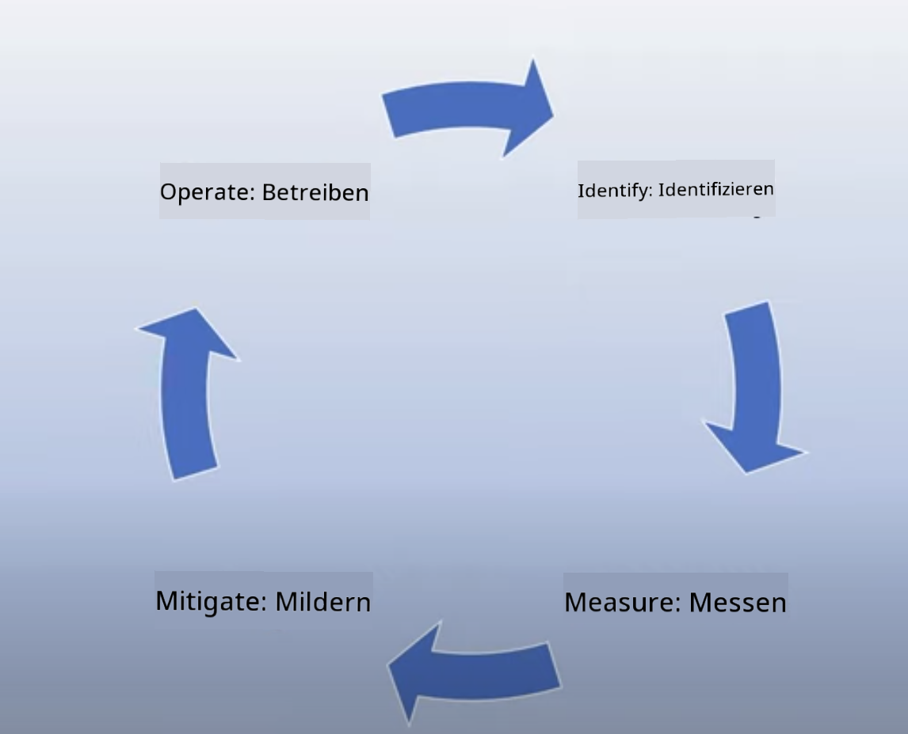
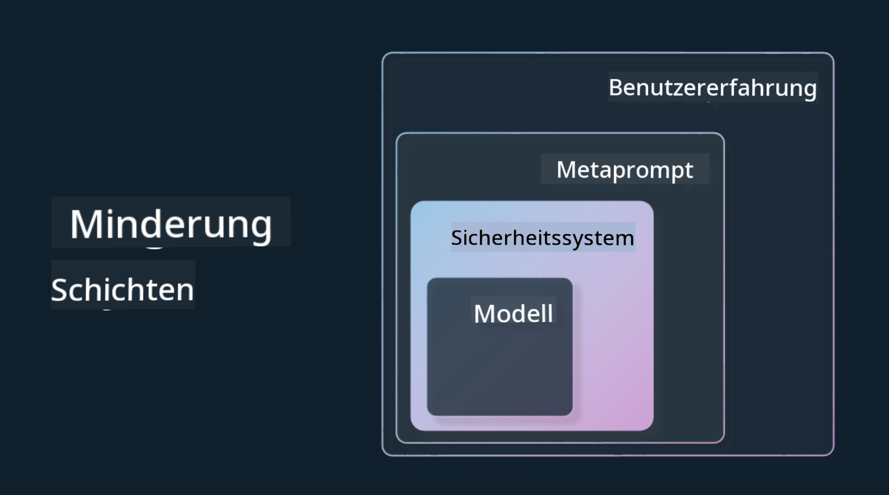

<!--
CO_OP_TRANSLATOR_METADATA:
{
  "original_hash": "7f8f4c11f8c1cb6e1794442dead414ea",
  "translation_date": "2025-07-09T08:46:43+00:00",
  "source_file": "03-using-generative-ai-responsibly/README.md",
  "language_code": "de"
}
-->
# Generative KI verantwortungsvoll nutzen

> _Klicke auf das Bild oben, um das Video zu dieser Lektion anzusehen_

Es ist leicht, von KI und insbesondere generativer KI fasziniert zu sein, aber man muss bedenken, wie man sie verantwortungsvoll einsetzt. Dabei gilt es zu überlegen, wie man sicherstellt, dass die Ergebnisse fair, ungefährlich und mehr sind. Dieses Kapitel soll dir den nötigen Kontext geben, worauf du achten solltest und wie du aktiv Schritte unternehmen kannst, um deinen KI-Einsatz zu verbessern.

## Einführung

Diese Lektion behandelt:

- Warum du bei der Entwicklung generativer KI-Anwendungen verantwortungsvolle KI priorisieren solltest.
- Die Kernprinzipien verantwortungsvoller KI und wie sie sich auf generative KI beziehen.
- Wie du diese Prinzipien durch Strategie und Werkzeuge in die Praxis umsetzt.

## Lernziele

Nach Abschluss dieser Lektion wirst du wissen:

- Wie wichtig verantwortungsvolle KI beim Aufbau generativer KI-Anwendungen ist.
- Wann du die Kernprinzipien verantwortungsvoller KI beim Entwickeln generativer KI-Anwendungen bedenken und anwenden solltest.
- Welche Werkzeuge und Strategien dir zur Verfügung stehen, um das Konzept verantwortungsvoller KI umzusetzen.

## Prinzipien verantwortungsvoller KI

Die Begeisterung für generative KI war noch nie so groß. Diese Begeisterung hat viele neue Entwickler, Aufmerksamkeit und Finanzierung in diesen Bereich gebracht. Das ist sehr positiv für alle, die Produkte und Unternehmen mit generativer KI aufbauen wollen, aber es ist auch wichtig, verantwortungsvoll vorzugehen.

Im Verlauf dieses Kurses konzentrieren wir uns darauf, unser Startup und unser KI-Bildungsprodukt aufzubauen. Wir verwenden die Prinzipien verantwortungsvoller KI: Fairness, Inklusivität, Zuverlässigkeit/Sicherheit, Schutz & Privatsphäre, Transparenz und Verantwortlichkeit. Anhand dieser Prinzipien untersuchen wir, wie sie sich auf unseren Einsatz generativer KI in unseren Produkten beziehen.

## Warum solltest du verantwortungsvolle KI priorisieren?

Beim Aufbau eines Produkts führt ein menschenzentrierter Ansatz, bei dem das Wohl der Nutzer im Mittelpunkt steht, zu den besten Ergebnissen.

Das Besondere an generativer KI ist ihre Fähigkeit, hilfreiche Antworten, Informationen, Anleitungen und Inhalte für Nutzer zu erstellen. Dies kann ohne viele manuelle Schritte geschehen und zu beeindruckenden Ergebnissen führen. Ohne sorgfältige Planung und Strategien kann es jedoch leider auch zu schädlichen Ergebnissen für deine Nutzer, dein Produkt und die Gesellschaft insgesamt kommen.

Schauen wir uns einige (aber nicht alle) dieser potenziell schädlichen Ergebnisse an:

### Halluzinationen

Halluzinationen sind ein Begriff, der beschreibt, wenn ein LLM Inhalte erzeugt, die entweder völlig unsinnig sind oder von denen wir wissen, dass sie auf Grundlage anderer Informationsquellen faktisch falsch sind.

Nehmen wir zum Beispiel an, wir bauen eine Funktion für unser Startup, die es Studierenden ermöglicht, historische Fragen an ein Modell zu stellen. Ein Student fragt: `Wer war der einzige Überlebende der Titanic?`

Das Modell liefert eine Antwort wie die folgende:

> _(Quelle: [Flying bisons](https://flyingbisons.com?WT.mc_id=academic-105485-koreyst))_

Das ist eine sehr selbstbewusste und ausführliche Antwort. Leider ist sie falsch. Schon mit minimaler Recherche würde man feststellen, dass es mehr als einen Überlebenden des Titanic-Unglücks gab. Für einen Studenten, der gerade erst mit der Recherche zu diesem Thema beginnt, kann diese Antwort überzeugend genug sein, um nicht hinterfragt zu werden und als Fakt behandelt zu werden. Die Folgen können sein, dass das KI-System als unzuverlässig wahrgenommen wird und der Ruf unseres Startups Schaden nimmt.

Mit jeder neuen Version eines LLM haben wir Verbesserungen bei der Minimierung von Halluzinationen gesehen. Trotzdem müssen wir als Entwickler und Nutzer uns dieser Einschränkungen stets bewusst bleiben.

### Schädliche Inhalte

Im vorherigen Abschnitt haben wir behandelt, wenn ein LLM falsche oder unsinnige Antworten liefert. Ein weiteres Risiko ist, wenn ein Modell schädliche Inhalte ausgibt.

Schädliche Inhalte können definiert werden als:

- Anleitungen oder Aufforderungen zu Selbstverletzung oder Gewalt gegen bestimmte Gruppen.
- Hassvolle oder erniedrigende Inhalte.
- Anleitungen zur Planung von Angriffen oder Gewalttaten.
- Anleitungen, wie man illegale Inhalte findet oder illegale Handlungen begeht.
- Darstellung sexuell expliziter Inhalte.

Für unser Startup wollen wir sicherstellen, dass wir die richtigen Werkzeuge und Strategien haben, um zu verhindern, dass solche Inhalte von Studierenden gesehen werden.

### Mangelnde Fairness

Fairness bedeutet, „dass ein KI-System frei von Vorurteilen und Diskriminierung ist und alle fair und gleich behandelt.“ Im Bereich der generativen KI wollen wir sicherstellen, dass ausschließende Weltanschauungen gegenüber marginalisierten Gruppen nicht durch die Ausgabe des Modells verstärkt werden.

Solche Ausgaben sind nicht nur schädlich für positive Produkterfahrungen unserer Nutzer, sondern verursachen auch gesellschaftlichen Schaden. Als Entwickler sollten wir immer eine breite und vielfältige Nutzerbasis im Blick haben, wenn wir Lösungen mit generativer KI entwickeln.

## Wie man generative KI verantwortungsvoll nutzt

Nachdem wir die Bedeutung verantwortungsvoller generativer KI erkannt haben, schauen wir uns 4 Schritte an, mit denen wir unsere KI-Lösungen verantwortungsvoll gestalten können:

### Potenzielle Schäden messen

Beim Softwaretest prüfen wir die erwarteten Aktionen eines Nutzers in einer Anwendung. Ähnlich ist es sinnvoll, eine vielfältige Auswahl an Eingaben zu testen, die Nutzer wahrscheinlich verwenden, um potenzielle Schäden zu messen.

Da unser Startup ein Bildungsprodukt entwickelt, wäre es sinnvoll, eine Liste bildungsbezogener Eingaben vorzubereiten. Diese könnten bestimmte Fächer, historische Fakten und Fragen zum Studentenleben abdecken.

### Potenzielle Schäden mindern

Jetzt geht es darum, Wege zu finden, wie wir potenzielle Schäden durch das Modell und seine Antworten verhindern oder begrenzen können. Wir betrachten dies auf 4 verschiedenen Ebenen:

- **Modell**. Die Wahl des richtigen Modells für den jeweiligen Anwendungsfall. Größere und komplexere Modelle wie GPT-4 bergen ein höheres Risiko für schädliche Inhalte, wenn sie auf kleinere und spezifischere Anwendungsfälle angewendet werden. Das Feintuning mit eigenen Trainingsdaten reduziert ebenfalls das Risiko schädlicher Inhalte.

- **Sicherheitssystem**. Ein Sicherheitssystem ist eine Sammlung von Werkzeugen und Einstellungen auf der Plattform, die das Modell bereitstellt und hilft, Schäden zu mindern. Ein Beispiel ist das Content-Filtering-System im Azure OpenAI Service. Systeme sollten auch Jailbreak-Angriffe und unerwünschte Aktivitäten wie Bot-Anfragen erkennen.

- **Metaprompt**. Metaprompts und Grounding sind Methoden, mit denen wir das Modell anhand bestimmter Verhaltensweisen und Informationen steuern oder einschränken können. Das kann durch Systemeingaben geschehen, die bestimmte Grenzen für das Modell definieren. Außerdem können Ausgaben erzeugt werden, die besser zum Anwendungsbereich oder zur Domäne passen.

Es können auch Techniken wie Retrieval Augmented Generation (RAG) eingesetzt werden, damit das Modell Informationen nur aus einer Auswahl vertrauenswürdiger Quellen zieht. In einer späteren Lektion dieses Kurses geht es um [den Aufbau von Suchanwendungen](../08-building-search-applications/README.md?WT.mc_id=academic-105485-koreyst).

- **Nutzererlebnis**. Die letzte Ebene ist die direkte Interaktion des Nutzers mit dem Modell über die Benutzeroberfläche unserer Anwendung. Hier können wir die UI/UX so gestalten, dass die Nutzer bei den Eingaben eingeschränkt werden und auch die angezeigten Texte oder Bilder kontrolliert werden. Beim Einsatz der KI-Anwendung müssen wir außerdem transparent kommunizieren, was unsere generative KI-Anwendung kann und was nicht.

Wir haben eine ganze Lektion zum Thema [UX-Design für KI-Anwendungen](../12-designing-ux-for-ai-applications/README.md?WT.mc_id=academic-105485-koreyst).

- **Modell bewerten**. Die Arbeit mit LLMs ist herausfordernd, da wir nicht immer Kontrolle über die Trainingsdaten des Modells haben. Trotzdem sollten wir die Leistung und Ausgaben des Modells stets bewerten. Es ist wichtig, die Genauigkeit, Ähnlichkeit, Fundiertheit und Relevanz der Ausgaben zu messen. Das schafft Transparenz und Vertrauen bei Stakeholdern und Nutzern.

### Eine verantwortungsvolle generative KI-Lösung betreiben

Der Aufbau eines operativen Prozesses rund um deine KI-Anwendungen ist die letzte Phase. Dazu gehört die Zusammenarbeit mit anderen Bereichen unseres Startups wie Recht und Sicherheit, um die Einhaltung aller regulatorischen Vorgaben sicherzustellen. Vor dem Start sollten wir außerdem Pläne für die Auslieferung, das Handling von Vorfällen und Rollbacks erstellen, um Schäden für unsere Nutzer zu vermeiden.

## Werkzeuge

Auch wenn die Entwicklung verantwortungsvoller KI-Lösungen aufwendig erscheint, lohnt sich die Arbeit. Mit dem Wachstum des Bereichs generative KI werden immer mehr Werkzeuge verfügbar, die Entwickler dabei unterstützen, Verantwortung effizient in ihre Arbeitsabläufe zu integrieren. Zum Beispiel kann der [Azure AI Content Safety](https://learn.microsoft.com/azure/ai-services/content-safety/overview?WT.mc_id=academic-105485-koreyst) schädliche Inhalte und Bilder über eine API-Anfrage erkennen.

## Wissenscheck

Worauf musst du achten, um eine verantwortungsvolle Nutzung von KI sicherzustellen?

1. Dass die Antwort korrekt ist.  
1. Schädliche Nutzung, dass KI nicht für kriminelle Zwecke verwendet wird.  
1. Sicherstellen, dass die KI frei von Vorurteilen und Diskriminierung ist.

A: 2 und 3 sind richtig. Verantwortungsvolle KI hilft dir, schädliche Auswirkungen, Vorurteile und mehr zu mindern.

## 🚀 Herausforderung

Informiere dich über [Azure AI Content Safety](https://learn.microsoft.com/azure/ai-services/content-safety/overview?WT.mc_id=academic-105485-koreyst) und prüfe, was du für deinen Einsatz übernehmen kannst.

## Gute Arbeit, mach weiter mit deinem Lernen

Nach Abschluss dieser Lektion schau dir unsere [Generative AI Learning collection](https://aka.ms/genai-collection?WT.mc_id=academic-105485-koreyst) an, um dein Wissen über generative KI weiter auszubauen!

Gehe weiter zu Lektion 4, in der wir uns mit den [Grundlagen des Prompt Engineerings](../04-prompt-engineering-fundamentals/README.md?WT.mc_id=academic-105485-koreyst) beschäftigen!

**Haftungsausschluss**:  
Dieses Dokument wurde mit dem KI-Übersetzungsdienst [Co-op Translator](https://github.com/Azure/co-op-translator) übersetzt. Obwohl wir uns um Genauigkeit bemühen, beachten Sie bitte, dass automatisierte Übersetzungen Fehler oder Ungenauigkeiten enthalten können. Das Originaldokument in seiner Ursprungssprache ist als maßgebliche Quelle zu betrachten. Für wichtige Informationen wird eine professionelle menschliche Übersetzung empfohlen. Wir übernehmen keine Haftung für Missverständnisse oder Fehlinterpretationen, die aus der Nutzung dieser Übersetzung entstehen.