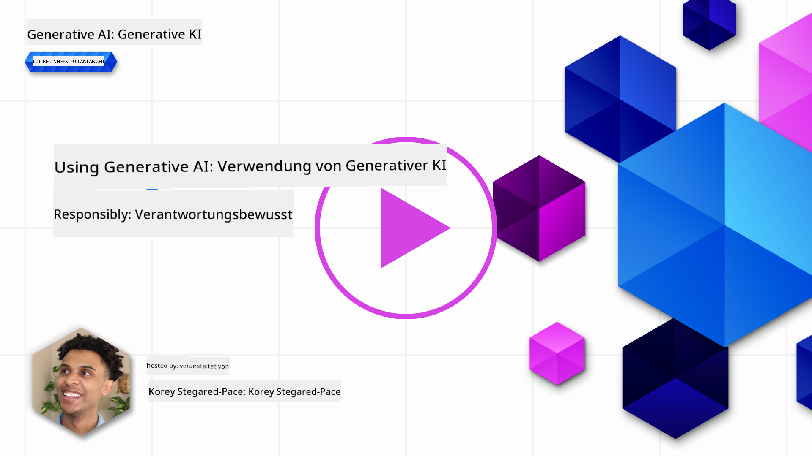
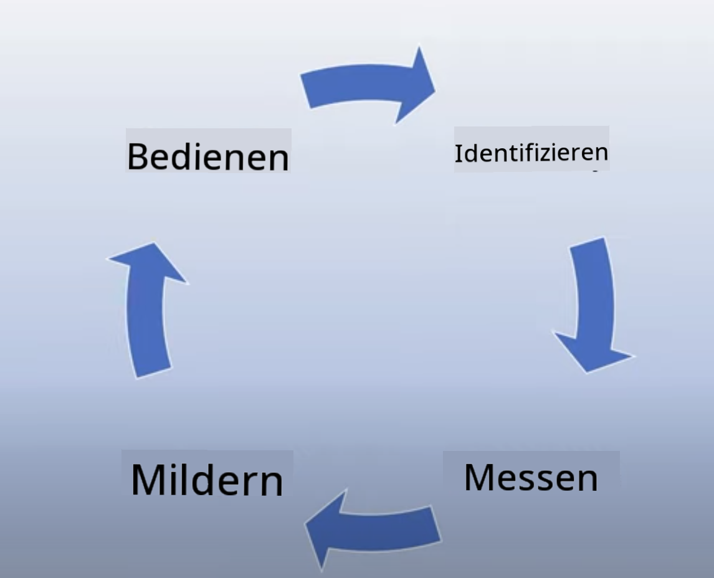

<!--
CO_OP_TRANSLATOR_METADATA:
{
  "original_hash": "13084c6321a2092841b9a081b29497ba",
  "translation_date": "2025-05-19T09:29:21+00:00",
  "source_file": "03-using-generative-ai-responsibly/README.md",
  "language_code": "de"
}
-->
# Verantwortungsvoller Einsatz von generativer KI

> _Klicken Sie auf das Bild oben, um das Video zu dieser Lektion anzusehen_

Es ist leicht, von KI und insbesondere generativer KI fasziniert zu sein, aber man muss berücksichtigen, wie man sie verantwortungsvoll einsetzen würde. Man muss Dinge wie die Gewährleistung fairer und nicht schädlicher Ergebnisse berücksichtigen. Dieses Kapitel soll Ihnen den genannten Kontext bieten, was zu beachten ist und wie Sie aktive Schritte unternehmen können, um Ihre KI-Nutzung zu verbessern.

## Einführung

Diese Lektion behandelt:

- Warum Sie verantwortungsvolle KI priorisieren sollten, wenn Sie generative KI-Anwendungen entwickeln.
- Kernprinzipien der verantwortungsvollen KI und wie sie sich auf generative KI beziehen.
- Wie man diese Prinzipien der verantwortungsvollen KI durch Strategie und Werkzeuge in die Praxis umsetzt.

## Lernziele

Nach Abschluss dieser Lektion wissen Sie:

- Die Bedeutung von verantwortungsvoller KI beim Bau von generativen KI-Anwendungen.
- Wann man die Kernprinzipien der verantwortungsvollen KI beim Bau von generativen KI-Anwendungen bedenken und anwenden sollte.
- Welche Werkzeuge und Strategien Ihnen zur Verfügung stehen, um das Konzept der verantwortungsvollen KI in die Praxis umzusetzen.

## Prinzipien der verantwortungsvollen KI

Die Begeisterung für generative KI war nie größer. Diese Begeisterung hat viele neue Entwickler, Aufmerksamkeit und Finanzierung in diesen Bereich gebracht. Während dies für alle, die Produkte und Unternehmen mit generativer KI aufbauen möchten, sehr positiv ist, ist es auch wichtig, dass wir verantwortungsvoll vorgehen.

Im Verlauf dieses Kurses konzentrieren wir uns darauf, unser Startup und unser KI-Bildungsprodukt aufzubauen. Wir werden die Prinzipien der verantwortungsvollen KI verwenden: Fairness, Inklusivität, Zuverlässigkeit/Sicherheit, Sicherheit & Privatsphäre, Transparenz und Verantwortlichkeit. Mit diesen Prinzipien werden wir erkunden, wie sie sich auf unsere Nutzung von generativer KI in unseren Produkten beziehen.

## Warum sollten Sie verantwortungsvolle KI priorisieren?

Beim Bau eines Produkts führt ein menschenzentrierter Ansatz, der das beste Interesse des Nutzers im Auge behält, zu den besten Ergebnissen.

Die Einzigartigkeit der generativen KI liegt in ihrer Fähigkeit, hilfreiche Antworten, Informationen, Anleitungen und Inhalte für Benutzer zu erstellen. Dies kann ohne viele manuelle Schritte erfolgen, was zu sehr beeindruckenden Ergebnissen führen kann. Ohne ordnungsgemäße Planung und Strategien kann es jedoch leider auch zu einigen schädlichen Ergebnissen für Ihre Benutzer, Ihr Produkt und die Gesellschaft insgesamt führen.

Schauen wir uns einige (aber nicht alle) dieser potenziell schädlichen Ergebnisse an:

### Halluzinationen

Halluzinationen sind ein Begriff, der verwendet wird, um zu beschreiben, wenn ein LLM Inhalte produziert, die entweder völlig unsinnig sind oder von denen wir wissen, dass sie auf anderen Informationsquellen faktisch falsch sind.

Nehmen wir zum Beispiel an, wir entwickeln eine Funktion für unser Startup, die es Studenten ermöglicht, historische Fragen an ein Modell zu stellen. Ein Student stellt die Frage `Who was the sole survivor of Titanic?`

Das Modell produziert eine Antwort wie die untenstehende:

> _(Quelle: [Flying bisons](https://flyingbisons.com?WT.mc_id=academic-105485-koreyst))_

Dies ist eine sehr selbstbewusste und ausführliche Antwort. Leider ist sie falsch. Selbst mit einer minimalen Menge an Forschung würde man herausfinden, dass es mehr als einen Überlebenden des Titanic-Unglücks gab. Für einen Studenten, der gerade erst beginnt, dieses Thema zu erforschen, kann diese Antwort überzeugend genug sein, um nicht hinterfragt und als Tatsache behandelt zu werden. Die Konsequenzen daraus können dazu führen, dass das KI-System unzuverlässig wird und den Ruf unseres Startups negativ beeinflusst.

Mit jeder Iteration eines gegebenen LLM haben wir Leistungsverbesserungen bei der Minimierung von Halluzinationen gesehen. Selbst mit dieser Verbesserung müssen wir als Anwendungsentwickler und Benutzer weiterhin auf diese Einschränkungen achten.

### Schädliche Inhalte

Wir haben im vorherigen Abschnitt behandelt, wenn ein LLM falsche oder unsinnige Antworten produziert. Ein weiteres Risiko, das wir beachten müssen, ist, wenn ein Modell mit schädlichen Inhalten antwortet.

Schädliche Inhalte können definiert werden als:

- Bereitstellung von Anweisungen oder Ermutigung zu Selbstverletzung oder Schaden für bestimmte Gruppen.
- Hassvolle oder herabwürdigende Inhalte.
- Planung jeder Art von Angriff oder gewalttätigen Handlungen.
- Bereitstellung von Anweisungen, wie man illegale Inhalte findet oder illegale Handlungen begeht.
- Anzeige sexuell expliziter Inhalte.

Für unser Startup möchten wir sicherstellen, dass wir die richtigen Werkzeuge und Strategien haben, um zu verhindern, dass diese Art von Inhalten von Studenten gesehen wird.

### Mangel an Fairness

Fairness wird definiert als „Gewährleistung, dass ein KI-System frei von Vorurteilen und Diskriminierung ist und dass es jeden fair und gleich behandelt.“ In der Welt der generativen KI möchten wir sicherstellen, dass ausschließende Weltanschauungen marginalisierter Gruppen nicht durch die Ausgabe des Modells verstärkt werden.

Diese Arten von Ausgaben sind nicht nur destruktiv für den Aufbau positiver Produkterfahrungen für unsere Benutzer, sondern verursachen auch weiteren gesellschaftlichen Schaden. Als Anwendungsentwickler sollten wir immer eine breite und diverse Benutzerbasis im Auge behalten, wenn wir Lösungen mit generativer KI entwickeln.

## Wie man generative KI verantwortungsvoll nutzt

Jetzt, da wir die Bedeutung von verantwortungsvoller generativer KI identifiziert haben, schauen wir uns 4 Schritte an, die wir unternehmen können, um unsere KI-Lösungen verantwortungsvoll zu gestalten:

### Potenzielle Schäden messen

Beim Softwaretest testen wir die erwarteten Aktionen eines Benutzers auf einer Anwendung. Ebenso ist das Testen einer Vielzahl von Eingabeaufforderungen, die Benutzer wahrscheinlich verwenden werden, eine gute Möglichkeit, potenzielle Schäden zu messen.

Da unser Startup ein Bildungsprodukt entwickelt, wäre es gut, eine Liste von bildungsbezogenen Eingabeaufforderungen vorzubereiten. Dies könnte dazu dienen, ein bestimmtes Fach, historische Fakten und Eingabeaufforderungen zum Studentenleben abzudecken.

### Potenzielle Schäden mindern

Es ist nun an der Zeit, Wege zu finden, wie wir den potenziellen Schaden, der durch das Modell und seine Antworten verursacht wird, verhindern oder begrenzen können. Wir können dies in 4 verschiedenen Schichten betrachten:

- **Modell**. Das richtige Modell für den richtigen Anwendungsfall wählen. Größere und komplexere Modelle wie GPT-4 können mehr Risiko für schädliche Inhalte verursachen, wenn sie auf kleinere und spezifischere Anwendungsfälle angewendet werden. Die Feinabstimmung mit Ihren Trainingsdaten reduziert auch das Risiko schädlicher Inhalte.

- **Sicherheitssystem**. Ein Sicherheitssystem ist eine Reihe von Werkzeugen und Konfigurationen auf der Plattform, die das Modell bereitstellt, um Schaden zu mindern. Ein Beispiel dafür ist das Inhaltsfiltersystem im Azure OpenAI-Dienst. Systeme sollten auch Jailbreak-Angriffe und unerwünschte Aktivitäten wie Anfragen von Bots erkennen.

- **Metaprompt**. Metaprompts und Grounding sind Möglichkeiten, wie wir das Modell basierend auf bestimmten Verhaltensweisen und Informationen steuern oder einschränken können. Dies könnte die Verwendung von Systemeingaben sein, um bestimmte Grenzen des Modells zu definieren. Darüber hinaus können Ausgaben bereitgestellt werden, die relevanter für den Umfang oder das Domänensystem sind.

Es kann auch Techniken wie Retrieval Augmented Generation (RAG) verwendet werden, um das Modell nur Informationen aus einer Auswahl vertrauenswürdiger Quellen abrufen zu lassen. Es gibt später in diesem Kurs eine Lektion zum [Aufbau von Suchanwendungen](../08-building-search-applications/README.md?WT.mc_id=academic-105485-koreyst)

- **Benutzererfahrung**. Die letzte Schicht ist dort, wo der Benutzer direkt mit dem Modell über die Benutzeroberfläche unserer Anwendung interagiert. Auf diese Weise können wir das UI/UX so gestalten, dass der Benutzer in den Arten von Eingaben, die er an das Modell senden kann, sowie den Texten oder Bildern, die dem Benutzer angezeigt werden, eingeschränkt wird. Bei der Bereitstellung der KI-Anwendung müssen wir auch transparent darüber sein, was unsere generative KI-Anwendung kann und nicht kann.

Wir haben eine ganze Lektion, die sich dem [Entwerfen von UX für KI-Anwendungen](../12-designing-ux-for-ai-applications/README.md?WT.mc_id=academic-105485-koreyst) widmet.

- **Modell evaluieren**. Die Arbeit mit LLMs kann herausfordernd sein, weil wir nicht immer Kontrolle über die Daten haben, auf denen das Modell trainiert wurde. Trotzdem sollten wir immer die Leistung und Ausgaben des Modells evaluieren. Es ist immer noch wichtig, die Genauigkeit, Ähnlichkeit, Fundiertheit und Relevanz der Ausgabe des Modells zu messen. Dies hilft, Transparenz und Vertrauen bei Stakeholdern und Benutzern zu schaffen.

### Eine verantwortungsvolle generative KI-Lösung betreiben

Der Aufbau einer betrieblichen Praxis rund um Ihre KI-Anwendungen ist die letzte Stufe. Dazu gehört die Zusammenarbeit mit anderen Teilen unseres Startups wie Recht und Sicherheit, um sicherzustellen, dass wir alle regulatorischen Richtlinien einhalten. Vor dem Start möchten wir auch Pläne für die Bereitstellung, den Umgang mit Vorfällen und das Rollback entwickeln, um jeglichen Schaden für unsere Benutzer zu vermeiden.

## Werkzeuge

Obwohl die Entwicklung von verantwortungsvollen KI-Lösungen viel Arbeit zu sein scheint, ist es eine Arbeit, die sich lohnt. Während der Bereich der generativen KI wächst, werden mehr Werkzeuge entwickelt, um Entwicklern zu helfen, Verantwortung effizient in ihre Arbeitsabläufe zu integrieren. Zum Beispiel kann [Azure AI Content Safety](https://learn.microsoft.com/azure/ai-services/content-safety/overview?WT.mc_id=academic-105485-koreyst) helfen, schädliche Inhalte und Bilder über eine API-Anfrage zu erkennen.

## Wissenstest

Worauf müssen Sie achten, um eine verantwortungsvolle Nutzung von KI sicherzustellen?

1. Dass die Antwort korrekt ist.
1. Schädliche Nutzung, dass KI nicht für kriminelle Zwecke verwendet wird.
1. Sicherstellen, dass die KI frei von Vorurteilen und Diskriminierung ist.

A: 2 und 3 sind korrekt. Verantwortungsvolle KI hilft Ihnen, zu überlegen, wie Sie schädliche Auswirkungen und Vorurteile mindern können und mehr.

## 🚀 Herausforderung

Lesen Sie mehr über [Azure AI Content Safety](https://learn.microsoft.com/azure/ai-services/content-safety/overview?WT.mc_id=academic-105485-koreyst) und sehen Sie, was Sie für Ihre Nutzung übernehmen können.

## Großartige Arbeit, setzen Sie Ihr Lernen fort

Nachdem Sie diese Lektion abgeschlossen haben, schauen Sie sich unsere [Generative AI Learning Collection](https://aka.ms/genai-collection?WT.mc_id=academic-105485-koreyst) an, um Ihr Wissen über generative KI weiter zu vertiefen!

Gehen Sie zu Lektion 4, wo wir uns die [Grundlagen des Prompt Engineering](../04-prompt-engineering-fundamentals/README.md?WT.mc_id=academic-105485-koreyst) ansehen!

**Haftungsausschluss**:  
Dieses Dokument wurde mit dem KI-Übersetzungsdienst [Co-op Translator](https://github.com/Azure/co-op-translator) übersetzt. Obwohl wir uns um Genauigkeit bemühen, beachten Sie bitte, dass automatisierte Übersetzungen Fehler oder Ungenauigkeiten enthalten können. Das Originaldokument in seiner ursprünglichen Sprache sollte als maßgebliche Quelle betrachtet werden. Für wichtige Informationen wird eine professionelle menschliche Übersetzung empfohlen. Wir übernehmen keine Haftung für Missverständnisse oder Fehlinterpretationen, die sich aus der Verwendung dieser Übersetzung ergeben.