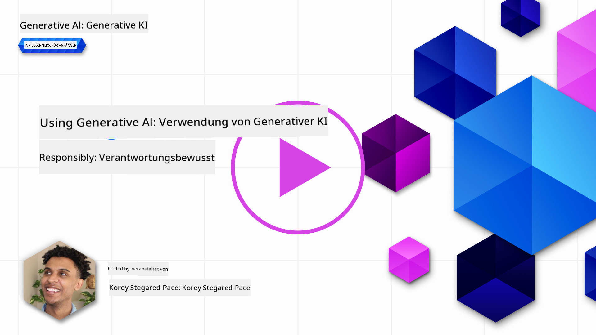
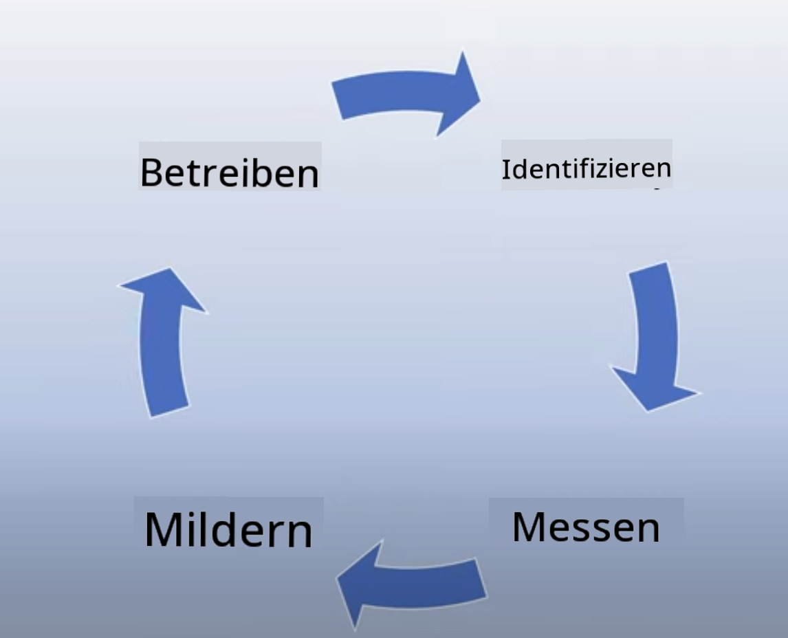
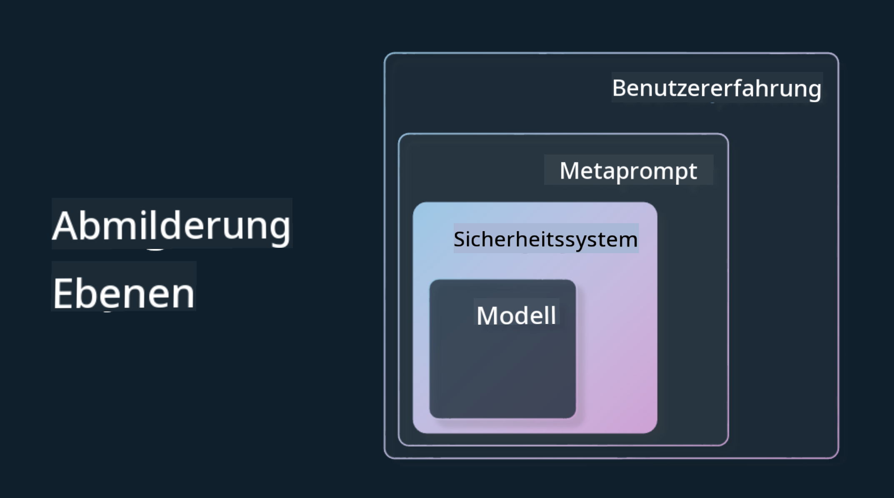

<!--
CO_OP_TRANSLATOR_METADATA:
{
  "original_hash": "13084c6321a2092841b9a081b29497ba",
  "translation_date": "2025-06-25T11:11:05+00:00",
  "source_file": "03-using-generative-ai-responsibly/README.md",
  "language_code": "de"
}
-->
# Verantwortungsbewusster Umgang mit generativer KI

> _Klicken Sie auf das obige Bild, um das Video zu dieser Lektion anzusehen_

Es ist leicht, von KI und insbesondere generativer KI fasziniert zu sein, aber man muss sich überlegen, wie man sie verantwortungsbewusst nutzen kann. Man sollte Dinge wie die Gewährleistung fairer und unschädlicher Ergebnisse in Betracht ziehen. Dieses Kapitel soll Ihnen den genannten Kontext, Überlegungen und aktive Schritte zur Verbesserung Ihrer KI-Nutzung bieten.

## Einführung

Diese Lektion behandelt:

- Warum Sie verantwortungsbewusste KI priorisieren sollten, wenn Sie generative KI-Anwendungen entwickeln.
- Grundprinzipien der verantwortungsbewussten KI und deren Beziehung zur generativen KI.
- Wie man diese Prinzipien der verantwortungsbewussten KI durch Strategie und Tools in die Praxis umsetzt.

## Lernziele

Nach Abschluss dieser Lektion wissen Sie:

- Die Bedeutung von verantwortungsbewusster KI beim Aufbau generativer KI-Anwendungen.
- Wann man die Grundprinzipien der verantwortungsbewussten KI bei der Entwicklung generativer KI-Anwendungen anwenden sollte.
- Welche Tools und Strategien Ihnen zur Verfügung stehen, um das Konzept der verantwortungsbewussten KI in die Praxis umzusetzen.

## Prinzipien der verantwortungsbewussten KI

Die Begeisterung für generative KI war noch nie so groß. Diese Begeisterung hat viele neue Entwickler, Aufmerksamkeit und Finanzierung in diesen Bereich gebracht. Während dies sehr positiv für alle ist, die Produkte und Unternehmen mit generativer KI entwickeln möchten, ist es auch wichtig, verantwortungsbewusst vorzugehen.

Im Laufe dieses Kurses konzentrieren wir uns auf den Aufbau unseres Startups und unseres KI-Bildungsprodukts. Wir werden die Prinzipien der verantwortungsbewussten KI verwenden: Fairness, Inklusivität, Zuverlässigkeit/Sicherheit, Schutz & Privatsphäre, Transparenz und Verantwortlichkeit. Mit diesen Prinzipien werden wir erkunden, wie sie sich auf unsere Nutzung von generativer KI in unseren Produkten beziehen.

## Warum sollten Sie verantwortungsbewusste KI priorisieren?

Beim Aufbau eines Produkts führt ein menschzentrierter Ansatz, bei dem die besten Interessen Ihrer Nutzer im Vordergrund stehen, zu den besten Ergebnissen.

Die Einzigartigkeit der generativen KI liegt in ihrer Fähigkeit, hilfreiche Antworten, Informationen, Anleitungen und Inhalte für Benutzer zu erstellen. Dies kann ohne viele manuelle Schritte geschehen, was zu sehr beeindruckenden Ergebnissen führen kann. Ohne ordnungsgemäße Planung und Strategien kann dies jedoch leider auch zu schädlichen Ergebnissen für Ihre Nutzer, Ihr Produkt und die Gesellschaft insgesamt führen.

Schauen wir uns einige (aber nicht alle) dieser potenziell schädlichen Ergebnisse an:

### Halluzinationen

Halluzinationen sind ein Begriff, der verwendet wird, um zu beschreiben, wenn ein LLM Inhalte produziert, die entweder völlig unsinnig oder nach anderen Informationsquellen nachweislich falsch sind.

Nehmen wir zum Beispiel an, wir entwickeln eine Funktion für unser Startup, die es Studenten ermöglicht, historische Fragen an ein Modell zu stellen. Ein Student stellt die Frage `Who was the sole survivor of Titanic?`

Das Modell erzeugt eine Antwort wie die untenstehende:

> _(Quelle: [Flying bisons](https://flyingbisons.com?WT.mc_id=academic-105485-koreyst))_

Dies ist eine sehr selbstbewusste und gründliche Antwort. Leider ist sie falsch. Selbst mit einer minimalen Menge an Recherche würde man entdecken, dass es mehr als einen Überlebenden der Titanic-Katastrophe gab. Für einen Studenten, der gerade erst beginnt, dieses Thema zu recherchieren, kann diese Antwort überzeugend genug sein, um nicht hinterfragt und als Tatsache behandelt zu werden. Die Folgen davon können dazu führen, dass das KI-System unzuverlässig wird und den Ruf unseres Startups negativ beeinflusst.

Mit jeder Iteration eines gegebenen LLM haben wir Leistungsverbesserungen bei der Minimierung von Halluzinationen gesehen. Selbst mit dieser Verbesserung müssen wir als Anwendungsentwickler und Nutzer weiterhin auf diese Einschränkungen achten.

### Schädliche Inhalte

Wir haben im vorherigen Abschnitt behandelt, wenn ein LLM falsche oder unsinnige Antworten produziert. Ein weiteres Risiko, dessen wir uns bewusst sein müssen, ist, wenn ein Modell mit schädlichen Inhalten antwortet.

Schädliche Inhalte können definiert werden als:

- Anweisungen geben oder Selbstverletzung oder Schaden für bestimmte Gruppen fördern.
- Hasserfüllte oder herabwürdigende Inhalte.
- Planung jeglicher Art von Angriffen oder Gewalttaten leiten.
- Anweisungen geben, wie man illegale Inhalte findet oder illegale Handlungen begeht.
- Anzeige sexuell expliziter Inhalte.

Für unser Startup wollen wir sicherstellen, dass wir die richtigen Tools und Strategien haben, um zu verhindern, dass diese Art von Inhalten von Studenten gesehen wird.

### Mangel an Fairness

Fairness wird definiert als „Sicherstellen, dass ein KI-System frei von Vorurteilen und Diskriminierung ist und dass es alle Menschen fair und gleich behandelt.“ In der Welt der generativen KI wollen wir sicherstellen, dass ausschließende Weltanschauungen marginalisierter Gruppen nicht durch die Ausgabe des Modells verstärkt werden.

Diese Arten von Ausgaben sind nicht nur destruktiv für den Aufbau positiver Produkterfahrungen für unsere Nutzer, sondern verursachen auch weiteren gesellschaftlichen Schaden. Als Anwendungsentwickler sollten wir immer eine breite und vielfältige Benutzerbasis im Auge behalten, wenn wir Lösungen mit generativer KI entwickeln.

## Wie man generative KI verantwortungsbewusst nutzt

Da wir nun die Bedeutung von verantwortungsbewusster generativer KI erkannt haben, schauen wir uns 4 Schritte an, die wir unternehmen können, um unsere KI-Lösungen verantwortungsbewusst zu entwickeln:

### Potenzielle Schäden messen

Beim Software-Testing testen wir die erwarteten Aktionen eines Benutzers auf einer Anwendung. Ähnlich ist das Testen einer vielfältigen Reihe von Eingabeaufforderungen, die Benutzer wahrscheinlich verwenden werden, eine gute Möglichkeit, potenziellen Schaden zu messen.

Da unser Startup ein Bildungsprodukt entwickelt, wäre es gut, eine Liste von bildungsbezogenen Eingabeaufforderungen vorzubereiten. Dies könnte ein bestimmtes Fach, historische Fakten und Eingabeaufforderungen über das Studentenleben abdecken.

### Potenzielle Schäden mindern

Es ist nun an der Zeit, Wege zu finden, wie wir den potenziellen Schaden, den das Modell und seine Antworten verursachen können, verhindern oder begrenzen können. Wir können dies in 4 verschiedenen Ebenen betrachten:

- **Modell**. Das richtige Modell für den richtigen Anwendungsfall auswählen. Größere und komplexere Modelle wie GPT-4 können mehr Risiko für schädliche Inhalte verursachen, wenn sie auf kleinere und spezifischere Anwendungsfälle angewendet werden. Die Verwendung Ihrer Trainingsdaten zur Feinabstimmung reduziert auch das Risiko schädlicher Inhalte.

- **Sicherheitssystem**. Ein Sicherheitssystem ist eine Reihe von Tools und Konfigurationen auf der Plattform, die das Modell bereitstellt, um Schaden zu mindern. Ein Beispiel dafür ist das Inhaltsfiltersystem auf dem Azure OpenAI-Dienst. Systeme sollten auch Jailbreak-Angriffe und unerwünschte Aktivitäten wie Anfragen von Bots erkennen.

- **Metaprompt**. Metaprompts und Grounding sind Möglichkeiten, wie wir das Modell basierend auf bestimmten Verhaltensweisen und Informationen lenken oder einschränken können. Dies könnte die Verwendung von Systemeingaben sein, um bestimmte Grenzen des Modells zu definieren. Zusätzlich dazu, Ausgaben bereitzustellen, die relevanter für den Umfang oder das Fachgebiet des Systems sind.

Es kann auch die Verwendung von Techniken wie Retrieval Augmented Generation (RAG) sein, um das Modell nur Informationen aus einer Auswahl vertrauenswürdiger Quellen abrufen zu lassen. Es gibt eine Lektion später in diesem Kurs zum [Erstellen von Suchanwendungen](../08-building-search-applications/README.md?WT.mc_id=academic-105485-koreyst)

- **Benutzererfahrung**. Die letzte Ebene ist, wo der Benutzer direkt über die Schnittstelle unserer Anwendung mit dem Modell interagiert. Auf diese Weise können wir die UI/UX so gestalten, dass der Benutzer auf die Arten von Eingaben, die er an das Modell senden kann, sowie auf den Text oder die Bilder, die dem Benutzer angezeigt werden, beschränkt wird. Beim Bereitstellen der KI-Anwendung müssen wir auch transparent darüber sein, was unsere generative KI-Anwendung kann und nicht kann.

Wir haben eine ganze Lektion, die sich mit dem [Design von UX für KI-Anwendungen](../12-designing-ux-for-ai-applications/README.md?WT.mc_id=academic-105485-koreyst) befasst.

- **Modell bewerten**. Mit LLMs zu arbeiten kann herausfordernd sein, da wir nicht immer die Kontrolle über die Daten haben, mit denen das Modell trainiert wurde. Ungeachtet dessen sollten wir immer die Leistung und Ausgaben des Modells bewerten. Es ist weiterhin wichtig, die Genauigkeit, Ähnlichkeit, Fundiertheit und Relevanz der Ausgabe des Modells zu messen. Dies hilft, Transparenz und Vertrauen für Stakeholder und Benutzer zu schaffen.

### Eine verantwortungsbewusste generative KI-Lösung betreiben

Der Aufbau einer operativen Praxis rund um Ihre KI-Anwendungen ist die letzte Stufe. Dies umfasst die Zusammenarbeit mit anderen Teilen unseres Startups wie Recht und Sicherheit, um sicherzustellen, dass wir alle regulatorischen Richtlinien einhalten. Vor der Markteinführung wollen wir auch Pläne für die Bereitstellung, den Umgang mit Vorfällen und das Rollback erstellen, um zu verhindern, dass unseren Nutzern Schaden entsteht.

## Werkzeuge

Obwohl die Entwicklung verantwortungsbewusster KI-Lösungen wie viel Arbeit erscheinen mag, ist es eine Arbeit, die sich lohnt. Da der Bereich der generativen KI wächst, werden mehr Tools zur Verfügung stehen, um Entwicklern effizient zu helfen, Verantwortung in ihre Arbeitsabläufe zu integrieren. Zum Beispiel kann die [Azure AI Content Safety](https://learn.microsoft.com/azure/ai-services/content-safety/overview?WT.mc_id=academic-105485-koreyst) helfen, schädliche Inhalte und Bilder über eine API-Anfrage zu erkennen.

## Wissensüberprüfung

Welche Dinge müssen Sie beachten, um eine verantwortungsvolle KI-Nutzung sicherzustellen?

1. Dass die Antwort korrekt ist.
1. Schädliche Nutzung, dass KI nicht für kriminelle Zwecke verwendet wird.
1. Sicherstellen, dass die KI frei von Vorurteilen und Diskriminierung ist.

A: 2 und 3 sind korrekt. Verantwortungsvolle KI hilft Ihnen, darüber nachzudenken, wie man schädliche Effekte und Vorurteile mindert und mehr.

## 🚀 Herausforderung

Lesen Sie über [Azure AI Content Safety](https://learn.microsoft.com/azure/ai-services/content-safety/overview?WT.mc_id=academic-105485-koreyst) und sehen Sie, was Sie für Ihre Nutzung übernehmen können.

## Großartige Arbeit, setzen Sie Ihr Lernen fort

Nach Abschluss dieser Lektion werfen Sie einen Blick auf unsere [Generative AI Learning Sammlung](https://aka.ms/genai-collection?WT.mc_id=academic-105485-koreyst), um Ihr Wissen über generative KI weiter zu vertiefen!

Gehen Sie zu Lektion 4, wo wir uns mit den [Grundlagen des Prompt-Engineering](../04-prompt-engineering-fundamentals/README.md?WT.mc_id=academic-105485-koreyst) befassen!

**Haftungsausschluss**:  
Dieses Dokument wurde mit dem KI-Übersetzungsdienst [Co-op Translator](https://github.com/Azure/co-op-translator) übersetzt. Obwohl wir uns um Genauigkeit bemühen, beachten Sie bitte, dass automatisierte Übersetzungen Fehler oder Ungenauigkeiten enthalten können. Das Originaldokument in seiner ursprünglichen Sprache sollte als maßgebliche Quelle betrachtet werden. Für wichtige Informationen wird eine professionelle menschliche Übersetzung empfohlen. Wir haften nicht für Missverständnisse oder Fehlinterpretationen, die sich aus der Nutzung dieser Übersetzung ergeben.