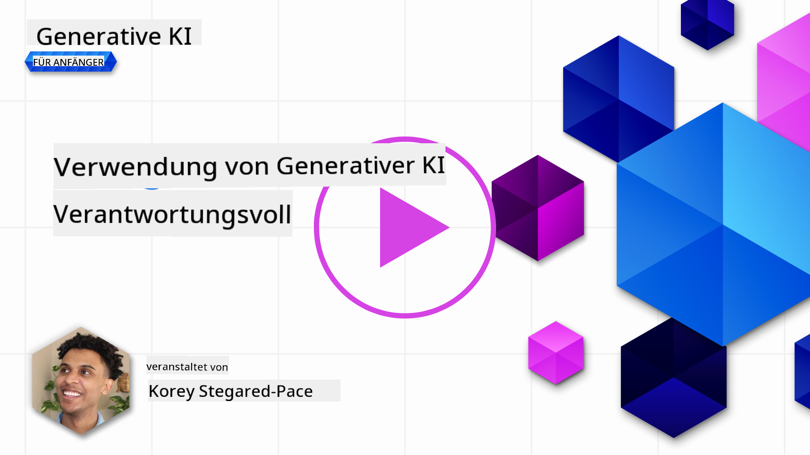
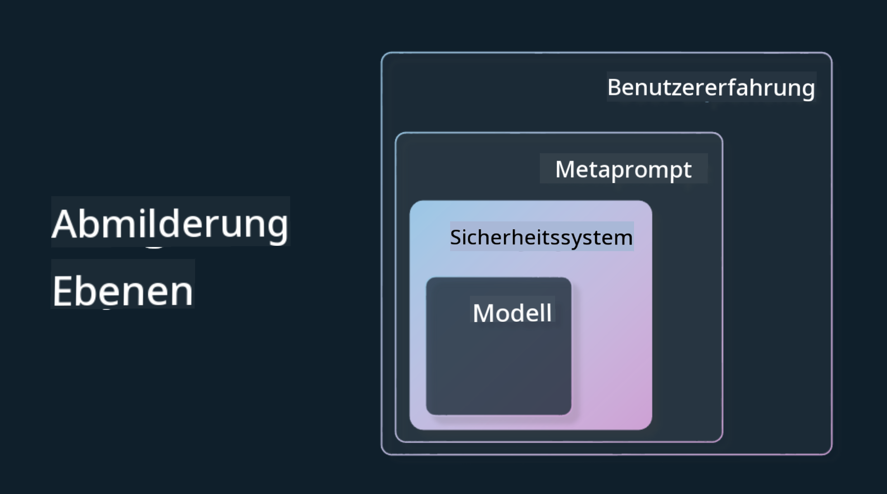

<!--
CO_OP_TRANSLATOR_METADATA:
{
  "original_hash": "4d57fad773cbeb69c5dd62e65c34200d",
  "translation_date": "2025-10-17T22:55:23+00:00",
  "source_file": "03-using-generative-ai-responsibly/README.md",
  "language_code": "de"
}
-->
# Verantwortungsbewusster Einsatz von generativer KI

> _Klicken Sie auf das Bild oben, um das Video zu dieser Lektion anzusehen_

Es ist leicht, von KI und insbesondere generativer KI fasziniert zu sein, aber es ist wichtig, darüber nachzudenken, wie man sie verantwortungsvoll einsetzen kann. Sie müssen Aspekte wie Fairness, Schadensvermeidung und mehr berücksichtigen. Dieses Kapitel soll Ihnen den entsprechenden Kontext bieten, worauf Sie achten sollten und wie Sie aktiv Schritte unternehmen können, um Ihre Nutzung der KI zu verbessern.

## Einführung

Diese Lektion behandelt:

- Warum Sie verantwortungsvolle KI priorisieren sollten, wenn Sie Anwendungen mit generativer KI entwickeln.
- Grundprinzipien der verantwortungsvollen KI und deren Bezug zur generativen KI.
- Wie Sie diese Prinzipien der verantwortungsvollen KI durch Strategien und Tools in die Praxis umsetzen können.

## Lernziele

Nach Abschluss dieser Lektion wissen Sie:

- Warum verantwortungsvolle KI beim Entwickeln von Anwendungen mit generativer KI wichtig ist.
- Wann Sie die Grundprinzipien der verantwortungsvollen KI berücksichtigen und anwenden sollten, wenn Sie Anwendungen mit generativer KI entwickeln.
- Welche Tools und Strategien Ihnen zur Verfügung stehen, um das Konzept der verantwortungsvollen KI in die Praxis umzusetzen.

## Prinzipien der verantwortungsvollen KI

Die Begeisterung für generative KI war noch nie so groß wie heute. Diese Begeisterung hat viele neue Entwickler, Aufmerksamkeit und Finanzierung in diesen Bereich gebracht. Während dies für alle, die Produkte und Unternehmen mit generativer KI entwickeln möchten, sehr positiv ist, ist es auch wichtig, verantwortungsvoll vorzugehen.

Im Verlauf dieses Kurses konzentrieren wir uns darauf, unser Startup und unser Bildungsprodukt für KI aufzubauen. Wir werden die Prinzipien der verantwortungsvollen KI anwenden: Fairness, Inklusivität, Zuverlässigkeit/Sicherheit, Datenschutz, Transparenz und Verantwortlichkeit. Mit diesen Prinzipien werden wir untersuchen, wie sie sich auf die Nutzung der generativen KI in unseren Produkten beziehen.

## Warum sollten Sie verantwortungsvolle KI priorisieren?

Wenn Sie ein Produkt entwickeln, führt ein menschenzentrierter Ansatz, bei dem Sie die Interessen Ihrer Nutzer im Blick behalten, zu den besten Ergebnissen.

Die Einzigartigkeit der generativen KI liegt in ihrer Fähigkeit, hilfreiche Antworten, Informationen, Anleitungen und Inhalte für Nutzer zu erstellen. Dies kann ohne viele manuelle Schritte erfolgen, was zu beeindruckenden Ergebnissen führen kann. Ohne angemessene Planung und Strategien kann dies jedoch leider auch zu schädlichen Ergebnissen für Ihre Nutzer, Ihr Produkt und die Gesellschaft insgesamt führen.

Schauen wir uns einige (aber nicht alle) dieser potenziell schädlichen Ergebnisse an:

### Halluzinationen

Halluzinationen sind ein Begriff, der verwendet wird, um zu beschreiben, wenn ein LLM Inhalte erzeugt, die entweder völlig unsinnig sind oder nach anderen Informationsquellen nachweislich falsch sind.

Nehmen wir an, wir entwickeln eine Funktion für unser Startup, die es Schülern ermöglicht, historische Fragen an ein Modell zu stellen. Ein Schüler stellt die Frage: `Wer war der einzige Überlebende der Titanic?`

Das Modell gibt eine Antwort wie die folgende:

> _(Quelle: [Flying bisons](https://flyingbisons.com?WT.mc_id=academic-105485-koreyst))_

Dies ist eine sehr selbstbewusste und ausführliche Antwort. Leider ist sie falsch. Selbst mit minimaler Recherche würde man herausfinden, dass es mehr als einen Überlebenden der Titanic-Katastrophe gab. Für einen Schüler, der gerade erst beginnt, dieses Thema zu erforschen, kann diese Antwort überzeugend genug sein, um nicht hinterfragt zu werden und als Tatsache behandelt zu werden. Die Konsequenzen daraus können dazu führen, dass das KI-System unzuverlässig ist und den Ruf unseres Startups negativ beeinflusst.

Mit jeder Iteration eines bestimmten LLM haben wir Leistungsverbesserungen bei der Minimierung von Halluzinationen gesehen. Selbst mit diesen Verbesserungen müssen wir als Anwendungsentwickler und Nutzer weiterhin auf diese Einschränkungen achten.

### Schädliche Inhalte

Wir haben im vorherigen Abschnitt behandelt, wenn ein LLM falsche oder unsinnige Antworten erzeugt. Ein weiteres Risiko, das wir beachten müssen, ist, wenn ein Modell mit schädlichen Inhalten antwortet.

Schädliche Inhalte können definiert werden als:

- Anweisungen geben oder Selbstverletzung oder Schaden an bestimmten Gruppen fördern.
- Hasserfüllte oder herabwürdigende Inhalte.
- Anleitung zur Planung jeglicher Art von Angriffen oder Gewalttaten.
- Anweisungen geben, wie man illegale Inhalte findet oder illegale Handlungen begeht.
- Anzeige sexuell expliziter Inhalte.

Für unser Startup möchten wir sicherstellen, dass wir die richtigen Tools und Strategien haben, um zu verhindern, dass diese Art von Inhalten von Schülern gesehen wird.

### Mangel an Fairness

Fairness wird definiert als „Sicherstellen, dass ein KI-System frei von Vorurteilen und Diskriminierung ist und alle Menschen fair und gleich behandelt.“ In der Welt der generativen KI möchten wir sicherstellen, dass ausschließende Weltanschauungen marginalisierter Gruppen nicht durch die Ausgaben des Modells verstärkt werden.

Diese Arten von Ausgaben sind nicht nur schädlich für den Aufbau positiver Produkterfahrungen für unsere Nutzer, sondern verursachen auch weiteren gesellschaftlichen Schaden. Als Anwendungsentwickler sollten wir immer eine breite und diverse Nutzerbasis im Blick behalten, wenn wir Lösungen mit generativer KI entwickeln.

## Wie man generative KI verantwortungsvoll einsetzt

Nachdem wir die Bedeutung von verantwortungsvoller generativer KI identifiziert haben, schauen wir uns 4 Schritte an, die wir unternehmen können, um unsere KI-Lösungen verantwortungsvoll zu entwickeln:

### Potenzielle Schäden messen

Beim Softwaretest testen wir die erwarteten Aktionen eines Nutzers in einer Anwendung. Ebenso ist das Testen einer vielfältigen Reihe von Eingabeaufforderungen, die Nutzer höchstwahrscheinlich verwenden werden, eine gute Möglichkeit, potenzielle Schäden zu messen.

Da unser Startup ein Bildungsprodukt entwickelt, wäre es sinnvoll, eine Liste von bildungsbezogenen Eingabeaufforderungen vorzubereiten. Dies könnte ein bestimmtes Fachgebiet, historische Fakten und Eingabeaufforderungen zum Studentenleben abdecken.

### Potenzielle Schäden mindern

Es ist nun an der Zeit, Wege zu finden, wie wir den potenziellen Schaden, der durch das Modell und seine Antworten verursacht wird, verhindern oder begrenzen können. Wir können dies in 4 verschiedenen Ebenen betrachten:

- **Modell**. Das richtige Modell für den richtigen Anwendungsfall auswählen. Größere und komplexere Modelle wie GPT-4 können ein höheres Risiko für schädliche Inhalte darstellen, wenn sie auf kleinere und spezifischere Anwendungsfälle angewendet werden. Die Verwendung Ihrer Trainingsdaten zur Feinabstimmung reduziert ebenfalls das Risiko schädlicher Inhalte.

- **Sicherheitssystem**. Ein Sicherheitssystem ist eine Reihe von Tools und Konfigurationen auf der Plattform, die das Modell bereitstellt und dabei hilft, Schäden zu mindern. Ein Beispiel hierfür ist das Inhaltsfiltersystem im Azure OpenAI-Dienst. Systeme sollten auch Jailbreak-Angriffe und unerwünschte Aktivitäten wie Anfragen von Bots erkennen.

- **Metaprompt**. Metaprompts und Grounding sind Möglichkeiten, wie wir das Modell basierend auf bestimmten Verhaltensweisen und Informationen lenken oder einschränken können. Dies könnte die Verwendung von Systemeingaben sein, um bestimmte Grenzen des Modells zu definieren. Darüber hinaus können Ausgaben bereitgestellt werden, die relevanter für den Umfang oder das Fachgebiet des Systems sind.

Es könnte auch die Verwendung von Techniken wie Retrieval Augmented Generation (RAG) sein, um das Modell nur Informationen aus einer Auswahl vertrauenswürdiger Quellen abrufen zu lassen. Es gibt später in diesem Kurs eine Lektion zum [Erstellen von Suchanwendungen](../08-building-search-applications/README.md?WT.mc_id=academic-105485-koreyst).

- **Benutzererfahrung**. Die letzte Ebene ist dort, wo der Nutzer direkt über die Schnittstelle unserer Anwendung mit dem Modell interagiert. Auf diese Weise können wir die UI/UX so gestalten, dass der Nutzer in den Arten von Eingaben, die er an das Modell senden kann, sowie in den Texten oder Bildern, die dem Nutzer angezeigt werden, eingeschränkt wird. Beim Einsatz der KI-Anwendung müssen wir auch transparent darüber sein, was unsere generative KI-Anwendung kann und was nicht.

Wir haben eine ganze Lektion, die sich dem [Design von UX für KI-Anwendungen](../12-designing-ux-for-ai-applications/README.md?WT.mc_id=academic-105485-koreyst) widmet.

- **Modell bewerten**. Mit LLMs zu arbeiten kann herausfordernd sein, da wir nicht immer Kontrolle über die Daten haben, auf denen das Modell trainiert wurde. Trotzdem sollten wir immer die Leistung und Ausgaben des Modells bewerten. Es ist weiterhin wichtig, die Genauigkeit, Ähnlichkeit, Fundiertheit und Relevanz der Ausgaben des Modells zu messen. Dies hilft, Transparenz und Vertrauen bei Stakeholdern und Nutzern zu schaffen.

### Eine verantwortungsvolle generative KI-Lösung betreiben

Der Aufbau einer operativen Praxis rund um Ihre KI-Anwendungen ist die letzte Phase. Dazu gehört die Zusammenarbeit mit anderen Teilen unseres Startups wie Recht und Sicherheit, um sicherzustellen, dass wir alle regulatorischen Richtlinien einhalten. Vor dem Start möchten wir auch Pläne für die Bereitstellung, den Umgang mit Vorfällen und das Rollback erstellen, um zu verhindern, dass unseren Nutzern Schaden zugefügt wird.

## Tools

Auch wenn die Entwicklung verantwortungsvoller KI-Lösungen nach viel Arbeit klingt, ist diese Arbeit die Mühe wert. Mit dem Wachstum des Bereichs der generativen KI werden auch die Tools reifen, die Entwicklern helfen, Verantwortung effizient in ihre Arbeitsabläufe zu integrieren. Zum Beispiel kann [Azure AI Content Safety](https://learn.microsoft.com/azure/ai-services/content-safety/overview?WT.mc_id=academic-105485-koreyst) dabei helfen, schädliche Inhalte und Bilder über eine API-Anfrage zu erkennen.

## Wissenstest

Worauf müssen Sie achten, um eine verantwortungsvolle Nutzung von KI sicherzustellen?

1. Dass die Antwort korrekt ist.
1. Schädliche Nutzung, dass KI nicht für kriminelle Zwecke verwendet wird.
1. Sicherstellen, dass die KI frei von Vorurteilen und Diskriminierung ist.

A: 2 und 3 sind korrekt. Verantwortungsvolle KI hilft Ihnen, darüber nachzudenken, wie schädliche Auswirkungen und Vorurteile gemindert werden können und mehr.

## 🚀 Herausforderung

Lesen Sie mehr über [Azure AI Content Safety](https://learn.microsoft.com/azure/ai-services/content-safety/overview?WT.mc_id=academic-105485-koreyst) und sehen Sie, was Sie für Ihre Nutzung übernehmen können.

## Großartige Arbeit, setzen Sie Ihr Lernen fort

Nachdem Sie diese Lektion abgeschlossen haben, schauen Sie sich unsere [Generative AI Learning Collection](https://aka.ms/genai-collection?WT.mc_id=academic-105485-koreyst) an, um Ihr Wissen über generative KI weiter zu vertiefen!

Gehen Sie weiter zu Lektion 4, in der wir uns mit den [Grundlagen des Prompt Engineering](../04-prompt-engineering-fundamentals/README.md?WT.mc_id=academic-105485-koreyst) beschäftigen!

---

**Haftungsausschluss**:  
Dieses Dokument wurde mit dem KI-Übersetzungsdienst [Co-op Translator](https://github.com/Azure/co-op-translator) übersetzt. Obwohl wir uns um Genauigkeit bemühen, beachten Sie bitte, dass automatisierte Übersetzungen Fehler oder Ungenauigkeiten enthalten können. Das Originaldokument in seiner ursprünglichen Sprache sollte als maßgebliche Quelle betrachtet werden. Für kritische Informationen wird eine professionelle menschliche Übersetzung empfohlen. Wir übernehmen keine Haftung für Missverständnisse oder Fehlinterpretationen, die sich aus der Nutzung dieser Übersetzung ergeben.