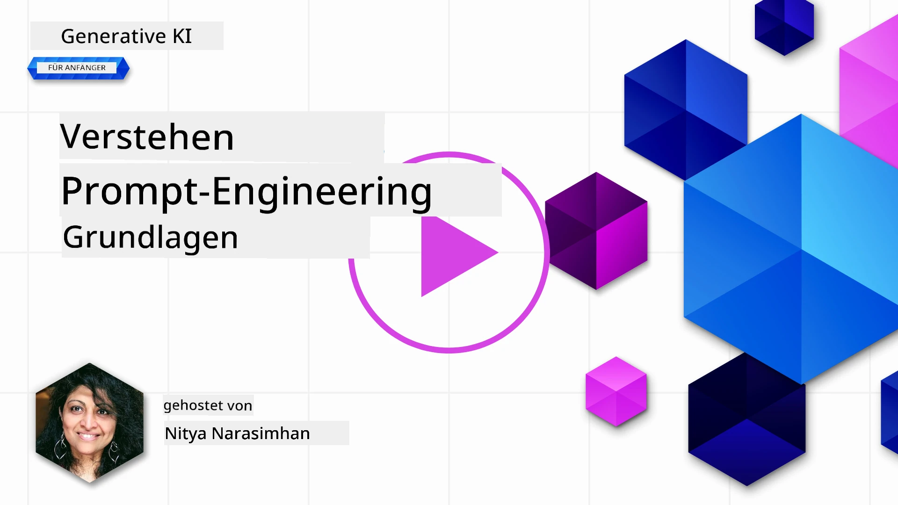
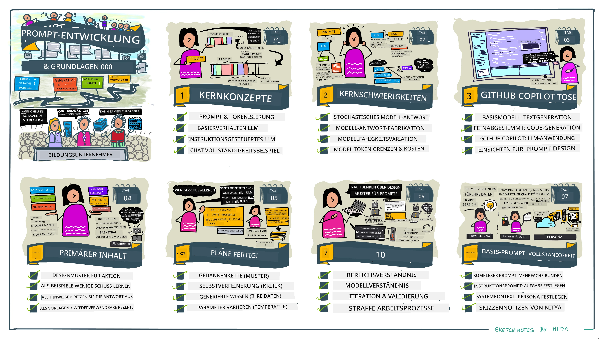
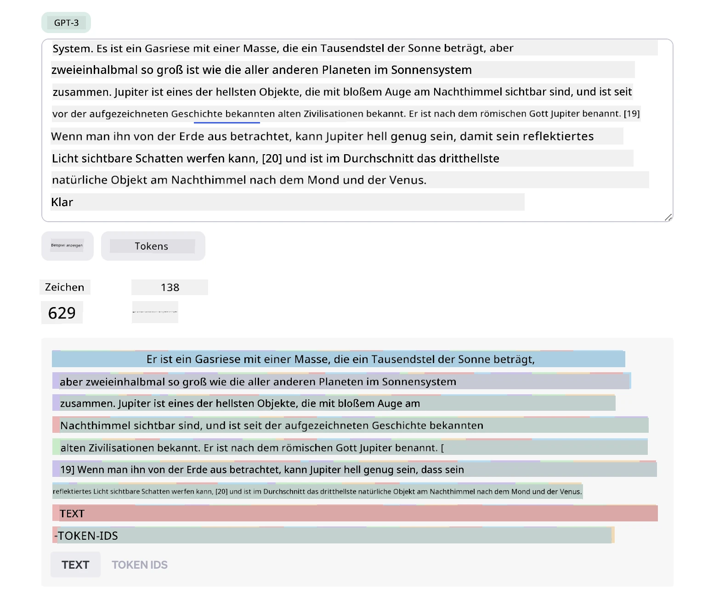
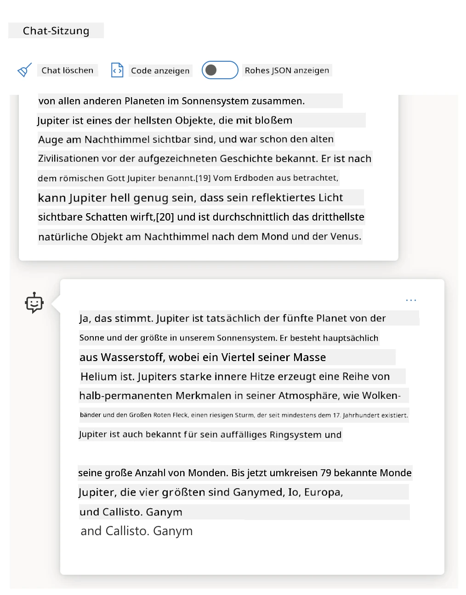
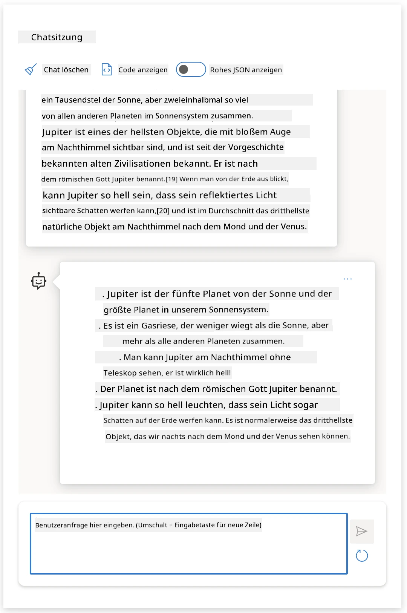
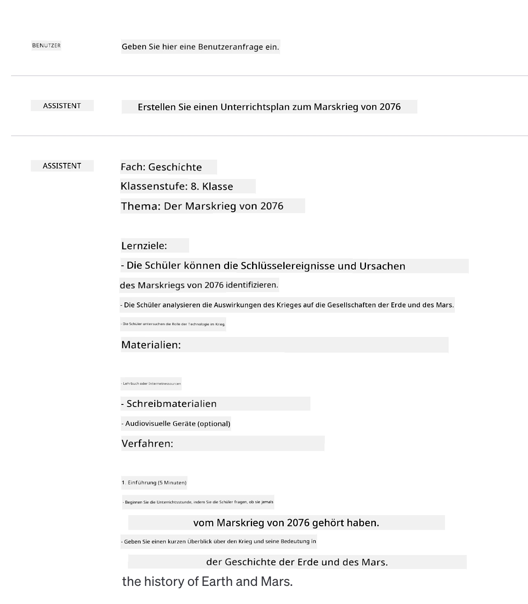
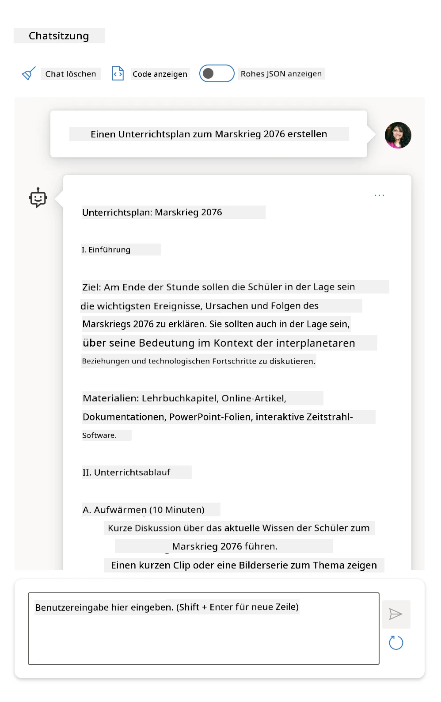
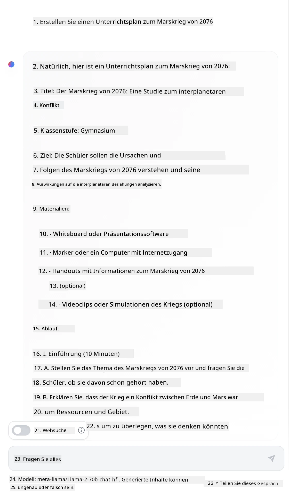

# Grundlagen des Prompt Engineerings

[](https://youtu.be/GElCu2kUlRs?si=qrXsBvXnCW12epb8)

## Einführung
Dieses Modul behandelt wesentliche Konzepte und Techniken zur Erstellung effektiver Prompts für generative KI-Modelle. Die Art und Weise, wie Sie Ihren Prompt an ein LLM schreiben, ist ebenfalls wichtig. Ein sorgfältig gestalteter Prompt kann eine bessere Antwortqualität erzielen. Aber was bedeuten Begriffe wie _Prompt_ und _Prompt Engineering_ genau? Und wie verbessere ich den Prompt-_Input_, den ich an das LLM sende? Diese Fragen versuchen wir im Rahmen dieses Kapitels und des nächsten zu beantworten.

_Generative KI_ ist in der Lage, neue Inhalte (z. B. Text, Bilder, Audio, Code usw.) als Antwort auf Benutzeranfragen zu erstellen. Dies wird mit Hilfe von _Large Language Models_ wie der GPT-Serie von OpenAI („Generative Pre-trained Transformer“) erreicht, die für die Verwendung von natürlicher Sprache und Code trainiert wurden.

Benutzer können jetzt mit diesen Modellen über vertraute Paradigmen wie Chat interagieren, ohne technische Kenntnisse oder Schulungen zu benötigen. Die Modelle sind _promptbasiert_ – Benutzer senden eine Texteingabe (Prompt) und erhalten eine KI-Antwort (Completion) zurück. Sie können dann iterativ „mit der KI chatten“ in mehrstufigen Gesprächen und ihren Prompt so lange verfeinern, bis die Antwort ihren Erwartungen entspricht.

„Prompts“ werden nun zur primären _Programmierschnittstelle_ für generative KI-Anwendungen, da sie den Modellen mitteilen, was zu tun ist, und die Qualität der zurückgegebenen Antworten beeinflussen. „Prompt Engineering“ ist ein schnell wachsendes Forschungsfeld, das sich auf die _Gestaltung und Optimierung_ von Prompts konzentriert, um konsistente und qualitativ hochwertige Antworten in großem Maßstab zu liefern.

## Lernziele

In dieser Lektion lernen wir, was Prompt Engineering ist, warum es wichtig ist und wie wir effektivere Prompts für ein gegebenes Modell und Anwendungsziel erstellen können. Wir werden grundlegende Konzepte und Best Practices für das Prompt Engineering verstehen – und lernen eine interaktive Jupyter-Notebook-„Sandbox“ kennen, in der wir diese Konzepte an realen Beispielen sehen können.

Am Ende dieser Lektion können wir:

1. Erklären, was Prompt Engineering ist und warum es wichtig ist.
2. Die Bestandteile eines Prompts beschreiben und wie sie verwendet werden.
3. Beste Praktiken und Techniken für Prompt Engineering erlernen.
4. Erlernte Techniken mit realen Beispielen anwenden, unter Nutzung eines OpenAI-Endpunkts.

## Schlüsselbegriffe

Prompt Engineering: Die Praxis, Eingaben so zu gestalten und zu verfeinern, dass KI-Modelle gewünschte Ausgaben liefern.
Tokenisierung: Der Prozess der Umwandlung von Text in kleinere Einheiten, sogenannte Tokens, die ein Modell verstehen und verarbeiten kann.
Instruction-Tuned LLMs: Große Sprachmodelle (LLMs), die mit spezifischen Anweisungen feinabgestimmt wurden, um ihre Antwortgenauigkeit und Relevanz zu verbessern.

## Lern-Sandbox

Prompt Engineering ist derzeit mehr Kunst als Wissenschaft. Der beste Weg, unsere Intuition dafür zu verbessern, besteht darin, _mehr zu üben_ und einen Trial-and-Error-Ansatz zu verfolgen, der fachliches Anwendungswissen mit empfohlenen Techniken und modellspezifischen Optimierungen kombiniert.

Das zur Lektion begleitende Jupyter-Notebook bietet eine _Sandbox_-Umgebung, in der du das Gelernte ausprobieren kannst – entweder direkt oder als Teil der Code-Herausforderung am Ende. Um die Übungen auszuführen, benötigst du:

1. **Einen Azure OpenAI API-Schlüssel** – den Service-Endpunkt für ein bereitgestelltes LLM.
2. **Eine Python Runtime** – in der das Notebook ausgeführt werden kann.
3. **Lokale Umgebungsvariablen** – _führe jetzt die [SETUP](./../00-course-setup/02-setup-local.md?WT.mc_id=academic-105485-koreyst) Schritte aus, um bereit zu sein_.

Das Notebook enthält _Starter_-Übungen – aber du bist eingeladen, eigene _Markdown_- (Beschreibungen) und _Code_- (Prompt-Anfragen) Abschnitte hinzuzufügen, um weitere Beispiele oder Ideen zu erproben und deine Intuition für die Prompt-Gestaltung zu stärken.

## Illustrierter Leitfaden

Möchtest du vor dem Eintauchen einen Überblick darüber, was diese Lektion abdeckt? Sieh dir diesen illustrierten Leitfaden an, der dir ein Gefühl für die Hauptthemen und die wichtigsten Erkenntnisse gibt, über die du jeweils nachdenken kannst. Die Lesson-Roadmap führt dich vom Verständnis der Kernkonzepte und Herausforderungen bis zu deren Lösung mit relevanten Prompt-Engineering-Techniken und Best Practices. Beachte, dass sich der Abschnitt „Erweiterte Techniken“ in diesem Guide auf Inhalte bezieht, die im _nächsten_ Kapitel dieses Curriculums behandelt werden.



## Unser Startup

Kommen wir nun dazu, wie _dieses Thema_ mit unserer Startup-Mission zur [Förderung von KI-Innovationen im Bildungsbereich](https://educationblog.microsoft.com/2023/06/collaborating-to-bring-ai-innovation-to-education?WT.mc_id=academic-105485-koreyst) zusammenhängt. Wir wollen KI-gestützte Anwendungen für _personalisiertes Lernen_ entwickeln – also denken wir darüber nach, wie verschiedene Nutzer unserer Anwendung „Prompts gestalten“ könnten:

- **Administratoren** könnten die KI bitten, _Lehrplandaten zu analysieren, um Lücken in der Abdeckung zu identifizieren_. Die KI kann Ergebnisse zusammenfassen oder durch Code visualisieren.
- **Lehrkräfte** könnten die KI bitten, _einen Unterrichtsplan für eine bestimmte Zielgruppe und ein Thema zu erstellen_. Die KI kann den personalisierten Plan in einem angegebenen Format erstellen.
- **Schüler*innen** könnten die KI bitten, _sie in einem schwierigen Fach zu unterrichten_. Die KI kann die Lernenden nun mit Lektionen, Hinweisen und Beispielen auf ihrem Niveau anleiten.

Das ist nur die Spitze des Eisbergs. Schau dir [Prompts For Education](https://github.com/microsoft/prompts-for-edu/tree/main?WT.mc_id=academic-105485-koreyst) an – eine Open-Source-Prompt-Bibliothek, kuratiert von Bildungsexperten –, um ein breiteres Spektrum an Möglichkeiten kennenzulernen! _Probiere einige dieser Prompts in der Sandbox oder im OpenAI Playground aus, um zu sehen, was passiert!_

<!--
LESSON TEMPLATE:
This unit should cover core concept #1.
Reinforce the concept with examples and references.

CONCEPT #1:
Prompt Engineering.
Define it and explain why it is needed.
-->

## Was ist Prompt Engineering?

Wir begannen diese Lektion mit der Definition von **Prompt Engineering** als dem Prozess des _Gestaltens und Optimierens_ von Texteingaben (Prompts), um für ein gegebenes Anwendungsziel und Modell konsistente und qualitativ hochwertige Antworten (Completions) zu liefern. Man kann dies als einen 2-Schritte-Prozess sehen:

- den initialen Prompt für ein bestimmtes Modell und Ziel _entwerfen_
- den Prompt iterativ _verfeinern_, um die Antwortqualität zu verbessern

Dies ist notwendigerweise ein Trial-and-Error-Prozess, der Nutzerintuition und Aufwand erfordert, um optimale Ergebnisse zu erzielen. Aber warum ist das wichtig? Um diese Frage zu beantworten, müssen wir zunächst drei Konzepte verstehen:

- _Tokenisierung_ = wie das Modell den Prompt „sieht“
- _Basis-LLMs_ = wie das Foundation-Modell einen Prompt „verarbeitet“
- _Instruction-Tuned LLMs_ = wie das Modell jetzt „Aufgaben“ erkennen kann

### Tokenisierung

Ein LLM betrachtet Prompts als _Sequenz von Tokens_, wobei verschiedene Modelle (oder Versionen desselben Modells) denselben Prompt unterschiedlich tokenisieren können. Da LLMs auf Tokens (und nicht auf Rohtext) trainiert sind, wirkt sich die Art der Tokenisierung direkt auf die Qualität der erzeugten Antwort aus.

Um ein Gefühl dafür zu bekommen, wie Tokenisierung funktioniert, probiere Tools wie den [OpenAI Tokenizer](https://platform.openai.com/tokenizer?WT.mc_id=academic-105485-koreyst) aus, der unten gezeigt wird. Kopiere deinen Prompt hinein – und sieh, wie dieser in Tokens umgewandelt wird, achte darauf, wie Leerzeichenzeichen und Satzzeichen behandelt werden. Beachte, dass dieses Beispiel ein älteres LLM (GPT-3) zeigt – bei neueren Modellen kann das Ergebnis abweichen.



### Konzept: Foundation-Modelle

Nachdem ein Prompt tokenisiert wurde, besteht die Hauptfunktion des ["Base LLM"](https://blog.gopenai.com/an-introduction-to-base-and-instruction-tuned-large-language-models-8de102c785a6?WT.mc_id=academic-105485-koreyst) (oder Foundation-Modells) darin, das nächste Token in der Sequenz vorherzusagen. Da LLMs auf massiven Textdatensätzen trainiert sind, haben sie ein gutes Verständnis der statistischen Beziehungen zwischen Tokens und können diese Vorhersage mit gewisser Sicherheit treffen. Beachte, dass sie die _Bedeutung_ der Wörter im Prompt oder Token nicht verstehen; sie erkennen nur ein Muster, das sie durch die nächste Vorhersage „vervollständigen“ können. Sie können diese Vorhersage fortsetzen, bis der Prozess durch Benutzerintervention oder eine vorgegebene Bedingung gestoppt wird.

Möchtest du sehen, wie prompt-basierte Vervollständigungen funktionieren? Gib den oben genannten Prompt im Azure OpenAI Studio [_Chat Playground_](https://oai.azure.com/playground?WT.mc_id=academic-105485-koreyst) mit den Standardeinstellungen ein. Das System ist so konfiguriert, dass Prompts als Informationsanfragen behandelt werden – du solltest also eine Completion sehen, die zu diesem Kontext passt.

Aber was, wenn der Benutzer etwas Spezifisches sehen möchte, das bestimmte Kriterien oder eine Aufgabenstellung erfüllt? Hier kommen _instruction-tuned_ LLMs ins Spiel.



### Konzept: Instruction-Tuned LLMs

Ein [Instruction Tuned LLM](https://blog.gopenai.com/an-introduction-to-base-and-instruction-tuned-large-language-models-8de102c785a6?WT.mc_id=academic-105485-koreyst) baut auf dem Foundation-Modell auf und wird mit Beispielen oder Input/Output-Paaren (z. B. mehrstufigen „Nachrichten“) feinabgestimmt, die klare Anweisungen enthalten können – und die Antwort der KI versucht, dieser Anweisung zu folgen.

Dies nutzt Techniken wie Reinforcement Learning mit menschlichem Feedback (RLHF), die das Modell darin trainieren, _Anweisungen zu befolgen_ und _aus Feedback zu lernen_, sodass es Antworten produziert, die besser für praktische Anwendungen geeignet und relevanter für Benutzerziele sind.

Probieren wir es aus – nimm den obigen Prompt und ändere nun die _Systemnachricht_, sodass die folgende Anweisung als Kontext bereitgestellt wird:

> _Fasse den bereitgestellten Inhalt für eine*n Zweitklässler*in zusammen. Halte das Ergebnis in einem Absatz mit 3-5 Aufzählungspunkten._

Siehst du, wie das Ergebnis nun auf das gewünschte Ziel und Format abgestimmt ist? Eine Lehrkraft kann diese Antwort direkt in ihren Folien für die Klasse verwenden.



## Warum brauchen wir Prompt Engineering?

Nachdem wir nun wissen, wie Prompts von LLMs verarbeitet werden, sprechen wir darüber, _warum_ wir Prompt Engineering brauchen. Die Antwort liegt darin, dass aktuelle LLMs einige Herausforderungen mit sich bringen, die _zuverlässige und konsistente Completions_ ohne Aufwand bei der Prompt-Gestaltung und -Optimierung erschweren. Zum Beispiel:

1. **Modellantworten sind stochastisch.** Derselbe Prompt erzeugt wahrscheinlich unterschiedliche Antworten mit verschiedenen Modellen oder Modellversionen. Und er kann sogar zu unterschiedlichen Zeitpunkten mit _dem gleichen Modell_ verschiedene Ergebnisse liefern. _Prompt Engineering-Techniken können helfen, diese Variationen zu minimieren, indem sie bessere Leitplanken schaffen_.

1. **Modelle können Antworten erfinden.** Modelle werden mit _großen, aber endlichen_ Datensätzen vortrainiert, was bedeutet, dass sie keine Kenntnisse über Konzepte außerhalb dieses Trainings besitzen. Deshalb können sie Antworten erzeugen, die ungenau, erfunden oder direkt im Widerspruch zu bekannten Fakten stehen. _Prompt Engineering-Techniken helfen Nutzern, solche Erfindungen zu erkennen und zu mindern, z. B. indem die KI nach Quellenangaben oder Begründungen gefragt wird_.

1. **Modellfähigkeiten variieren.** Neue Modelle oder Modellgenerationen haben komplexere Fähigkeiten, bringen aber auch eigenständige Eigenheiten und Kompromisse bei Kosten und Komplexität mit sich. _Prompt Engineering kann helfen, Best Practices und Workflows zu entwickeln, die Unterschiede abstrahieren und sich skalierbar und nahtlos an modellspezifische Anforderungen anpassen_.

Schauen wir uns das im OpenAI- oder Azure OpenAI-Playground an:

- Verwende denselben Prompt mit verschiedenen LLM-Bereitstellungen (z. B. OpenAI, Azure OpenAI, Hugging Face) – hast du Variationen gesehen?
- Verwende denselben Prompt wiederholt mit _derselben_ LLM-Bereitstellung (z. B. Azure OpenAI Playground) – wie unterschieden sich diese Variationen?

### Beispiel für Erfindungen

In diesem Kurs verwenden wir den Begriff **„Erfindung“** für das Phänomen, dass LLMs manchmal faktisch falsche Informationen generieren aufgrund von Beschränkungen in ihrem Training oder anderen Einschränkungen. Du hast diesen Sachverhalt vielleicht auch als _„Halluzinationen“_ in populären Artikeln oder Forschungsarbeiten gehört. Wir empfehlen jedoch ausdrücklich, den Begriff _„Erfindung“_ zu verwenden, um zu vermeiden, dass wir das Verhalten vermenschlichen, indem wir einer maschinell erzeugten Antwort menschliche Eigenschaften zuschreiben. Dies unterstützt auch die [Verantwortlichen KI-Richtlinien](https://www.microsoft.com/ai/responsible-ai?WT.mc_id=academic-105485-koreyst) aus sprachlicher Sicht und vermeidet Begriffe, die in manchen Kontexten als anstößig oder nicht inklusiv angesehen werden können.

Möchtest du eine Vorstellung davon bekommen, wie Erfindungen entstehen? Denke an einen Prompt, der die KI anweist, Inhalte zu einem nicht existierenden Thema zu generieren (um sicherzustellen, dass es im Trainingsdatensatz nicht vorkommt). Zum Beispiel habe ich diesen Prompt ausprobiert:

> **Prompt:** Erstelle einen Unterrichtsplan zum Marskrieg von 2076.
Eine Websuche zeigte mir, dass es fiktionale Berichte (z. B. Fernsehserien oder Bücher) über Marskriege gab – aber keine im Jahr 2076. Der gesunde Menschenverstand sagt auch, dass 2076 _in der Zukunft_ liegt und daher keinem realen Ereignis zugeordnet werden kann.

Was passiert also, wenn wir diese Eingabeaufforderung bei verschiedenen LLM-Anbietern ausführen?

> **Antwort 1**: OpenAI Playground (GPT-35)



> **Antwort 2**: Azure OpenAI Playground (GPT-35)



> **Antwort 3**: : Hugging Face Chat Playground (LLama-2)



Wie erwartet erzeugt jedes Modell (oder jede Modellversion) durch das stochastische Verhalten und Unterschiede in den Modellfähigkeiten leicht unterschiedliche Antworten. Zum Beispiel richtet sich ein Modell an ein Publikum der 8. Klasse, während das andere von einem Schüler der Oberstufe ausgeht. Aber alle drei Modelle generierten Antworten, die einen uninformierten Nutzer davon überzeugen könnten, dass das Ereignis real sei.

Techniken des Prompt-Engineerings wie _Metaprompting_ und _Temperaturkonfiguration_ können Modell-Erfindungen bis zu einem gewissen Grad reduzieren. Neue Prompt-Engineering-_Architekturen_ integrieren auch nahtlos neue Werkzeuge und Techniken in den Prompt-Ablauf, um einige dieser Effekte zu mildern oder zu verringern.

## Fallstudie: GitHub Copilot

Wir schließen diesen Abschnitt ab, indem wir uns ansehen, wie Prompt-Engineering in realen Lösungen verwendet wird, anhand einer Fallstudie: [GitHub Copilot](https://github.com/features/copilot?WT.mc_id=academic-105485-koreyst).

GitHub Copilot ist dein „KI-Paarprogrammierer“ – es wandelt Texteingaben in Codeergänzungen um und ist in deine Entwicklungsumgebung (z. B. Visual Studio Code) integriert, um ein nahtloses Nutzererlebnis zu bieten. Wie in den unten stehenden Blog-Serien dokumentiert, basierte die erste Version auf dem OpenAI Codex-Modell – wobei die Entwickler schnell erkannten, dass das Modell feinjustiert und bessere Prompt-Engineering-Techniken entwickelt werden müssen, um die Codequalität zu verbessern. Im Juli stellten sie [ein verbessertes KI-Modell vor, das über Codex hinausgeht](https://github.blog/2023-07-28-smarter-more-efficient-coding-github-copilot-goes-beyond-codex-with-improved-ai-model/?WT.mc_id=academic-105485-koreyst) und noch schnellere Vorschläge liefert.

Lies die Beiträge der Reihe nach, um ihre Lernreise nachzuvollziehen.

- **Mai 2023** | [GitHub Copilot versteht Ihren Code immer besser](https://github.blog/2023-05-17-how-github-copilot-is-getting-better-at-understanding-your-code/?WT.mc_id=academic-105485-koreyst)
- **Mai 2023** | [Inside GitHub: Arbeit mit den LLMs hinter GitHub Copilot](https://github.blog/2023-05-17-inside-github-working-with-the-llms-behind-github-copilot/?WT.mc_id=academic-105485-koreyst)
- **Jun 2023** | [Wie man bessere Prompts für GitHub Copilot schreibt](https://github.blog/2023-06-20-how-to-write-better-prompts-for-github-copilot/?WT.mc_id=academic-105485-koreyst)
- **Jul 2023** | [GitHub Copilot geht mit verbessertem KI-Modell über Codex hinaus](https://github.blog/2023-07-28-smarter-more-efficient-coding-github-copilot-goes-beyond-codex-with-improved-ai-model/?WT.mc_id=academic-105485-koreyst)
- **Jul 2023** | [Ein Entwicklerleitfaden für Prompt Engineering und LLMs](https://github.blog/2023-07-17-prompt-engineering-guide-generative-ai-llms/?WT.mc_id=academic-105485-koreyst)
- **Sep 2023** | [Wie man eine Enterprise-LLM-App baut: Lektionen von GitHub Copilot](https://github.blog/2023-09-06-how-to-build-an-enterprise-llm-application-lessons-from-github-copilot/?WT.mc_id=academic-105485-koreyst)

Du kannst auch ihren [Engineering-Blog](https://github.blog/category/engineering/?WT.mc_id=academic-105485-koreyst) für weitere Beiträge wie [diesen hier](https://github.blog/2023-09-27-how-i-used-github-copilot-chat-to-build-a-reactjs-gallery-prototype/?WT.mc_id=academic-105485-koreyst) durchsuchen, der zeigt, wie diese Modelle und Techniken für reale Anwendungen _eingesetzt_ werden.

---

<!--
LESSON TEMPLATE:
This unit should cover core concept #2.
Reinforce the concept with examples and references.

CONCEPT #2:
Prompt Design.
Illustrated with examples.
-->

## Prompt-Erstellung

Wir haben gesehen, warum Prompt-Engineering wichtig ist – jetzt wollen wir verstehen, wie Prompts _konstuiert_ werden, um verschiedene Techniken für ein effektiveres Prompt-Design bewerten zu können.

### Einfacher Prompt

Fangen wir mit dem einfachen Prompt an: eine Texteingabe, die ohne weiteren Kontext an das Modell gesendet wird. Hier ein Beispiel – wenn wir die ersten Wörter der US-Nationalhymne an die OpenAI [Completion API](https://platform.openai.com/docs/api-reference/completions?WT.mc_id=academic-105485-koreyst) schicken, _ergänzt_ sie sofort die nächsten Zeilen, was das grundlegende Vorhersageverhalten illustriert.

| Prompt (Eingabe)    | Ergänzung (Ausgabe)                                                                                                                           |
| :------------------ | :--------------------------------------------------------------------------------------------------------------------------------------------- |
| Oh say can you see  | Es klingt, als begännest du mit dem Liedtext von „The Star-Spangled Banner“, der Nationalhymne der Vereinigten Staaten. Der vollständige Text lautet ... |

### Komplexer Prompt

Jetzt fügen wir Kontext und Anweisungen zu diesem einfachen Prompt hinzu. Die [Chat Completion API](https://learn.microsoft.com/azure/ai-services/openai/how-to/chatgpt?WT.mc_id=academic-105485-koreyst) erlaubt es uns, einen komplexen Prompt als Sammlung von _Nachrichten_ zu erstellen mit:

- Eingabe/Ausgabe-Paaren, die die _User_-Eingabe und _Assistant_-Antwort widerspiegeln.
- Systemnachricht, die den Kontext für das Verhalten oder die Persönlichkeit des Assistenten festlegt.

Die Anfrage hat nun die unten gezeigte Form, bei der die _Tokenisierung_ relevante Informationen aus dem Kontext und dem Gespräch effektiv erfasst. Das Ändern des Systemkontexts kann sich dabei auf die Qualität der Ergänzungen genauso stark auswirken wie die vom Nutzer gegebenen Eingaben.

```python
response = openai.chat.completions.create(
    model="gpt-3.5-turbo",
    messages=[
        {"role": "system", "content": "You are a helpful assistant."},
        {"role": "user", "content": "Who won the world series in 2020?"},
        {"role": "assistant", "content": "The Los Angeles Dodgers won the World Series in 2020."},
        {"role": "user", "content": "Where was it played?"}
    ]
)
```

### Instruktions-Prompt

In den obigen Beispielen war der User-Prompt eine einfache Textanfrage, die als Informationsabfrage interpretiert werden kann. Mit _Instruktions_-Prompts können wir diesen Text verwenden, um eine Aufgabe detaillierter zu spezifizieren und der KI bessere Anweisungen zu geben. Hier ein Beispiel:

| Prompt (Eingabe)                                                                                                                                                                                                                         | Ergänzung (Ausgabe)                                                                                                  | Anweisungstyp     |
| :------------------------------------------------------------------------------------------------------------------------------------------------------------------------------------------------------------------------------------- | :------------------------------------------------------------------------------------------------------------------- | :---------------- |
| Schreibe eine Beschreibung des Bürgerkriegs                                                                                                                                                                                           | _gab einen einfachen Absatz zurück_                                                                                   | Einfach           |
| Schreibe eine Beschreibung des Bürgerkriegs. Gib wichtige Daten und Ereignisse an und beschreibe deren Bedeutung                                                                                                                    | _gab einen Absatz mit anschließender Liste wichtiger Ereignisse mit Beschreibungen zurück_                            | Komplex           |
| Schreibe eine Beschreibung des Bürgerkriegs in 1 Absatz. Gib 3 Stichpunkte mit Schlüsseldaten und deren Bedeutung. Gib 3 weitere Stichpunkte mit wichtigen historischen Persönlichkeiten und deren Beitrag. Gib die Ausgabe als JSON-Datei zurück | _gibt umfangreichere Details in einem Textfeld zurück, formatiert als JSON, das kopiert und validiert werden kann_    | Komplex. Formatiert|

## Primärer Inhalt

In den obigen Beispielen war der Prompt noch recht offen, sodass das LLM entscheiden konnte, welcher Teil seines vortrainierten Datensatzes relevant ist. Mit dem Designmuster _primärer Inhalt_ wird der Eingabetext in zwei Teile gegliedert:

- eine Anweisung (Aktion)
- relevanter Inhalt (der die Aktion beeinflusst)

Hier ein Beispiel, bei dem die Anweisung lautet, „fasse dies in 2 Sätzen zusammen“.

| Prompt (Eingabe)                                                                                                                                                                                                                                                                                                                                                                                                                                                                                                                                                                                                                                                                                    | Ergänzung (Ausgabe)                                                                                                                                                                                                                                                               |
| :------------------------------------------------------------------------------------------------------------------------------------------------------------------------------------------------------------------------------------------------------------------------------------------------------------------------------------------------------------------------------------------------------------------------------------------------------------------------------------------------------------------------------------------------------------------------------------------------------------------------------------------------------------------------------------------------ | :-------------------------------------------------------------------------------------------------------------------------------------------------------------------------------------------------------------------------------------------------------------------------------- |
| Jupiter ist der fünfte Planet von der Sonne und der größte im Sonnensystem. Er ist ein Gasriese mit einer Masse von einem Tausendstel der Sonne, aber zweieinhalbmal so groß wie alle anderen Planeten des Sonnensystems zusammen. Jupiter ist eines der hellsten Objekte, die man mit bloßem Auge am Nachthimmel sehen kann, und war schon alten Zivilisationen vor der schriftlichen Überlieferung bekannt. Er ist nach dem römischen Gott Jupiter benannt.[19] Von der Erde aus betrachtet kann Jupiter hell genug sein, um sichtbare Schatten zu werfen,[20] und ist im Durchschnitt das dritthellste natürliche Objekt am Nachthimmel nach Mond und Venus. <br/> **Fasse dies in 2 kurzen Sätzen zusammen** | Jupiter, der fünfte Planet von der Sonne, ist der größte im Sonnensystem und bekannt als eines der hellsten Objekte am Nachthimmel. Er ist nach dem römischen Gott Jupiter benannt, ein Gasriese mit einer Masse, die zweieinhalbmal so groß ist wie die aller anderen Planeten des Sonnensystems zusammen. |

Das Segment für den primären Inhalt kann auf verschiedene Weise genutzt werden, um wirkungsvollere Anweisungen zu geben:

- **Beispiele** – Anstatt dem Modell durch eine explizite Anweisung zu sagen, was es tun soll, gibt man ihm Beispiele, was zu tun ist, und lässt es das Muster ableiten.
- **Hinweise** – Auf die Anweisung folgt ein „Hinweis“, der die Ergänzung vorbereitet und das Modell auf relevantere Antworten lenkt.
- **Vorlagen** – Das sind wiederholbare „Rezepte“ für Prompts mit Platzhaltern (Variablen), die mit Daten für spezifische Anwendungsfälle angepasst werden können.

Lass uns diese in der Praxis betrachten.

### Verwendung von Beispielen

Dies ist eine Methode, bei der du dem Modell mit dem primären Inhalt einige Beispiele für die gewünschte Ausgabe zur Verfügung stellst, und es das Muster für die erwünschte Ausgabe ableitet. Je nach Anzahl der Beispiele spricht man von Zero-Shot-Prompting, One-Shot-Prompting, Few-Shot-Prompting usw.

Der Prompt besteht nun aus drei Komponenten:

- Einer Aufgabenbeschreibung
- Ein paar Beispielen der gewünschten Ausgabe
- Dem Beginn eines neuen Beispiels (was zur impliziten Aufgabenbeschreibung wird)

| Lernart       | Prompt (Eingabe)                                                                                                                                              | Ergänzung (Ausgabe)            |
| :------------ | :---------------------------------------------------------------------------------------------------------------------------------------------------------- | :------------------------------ |
| Zero-shot     | „The Sun is Shining“. Übersetze ins Spanische                                                                                                              | „El Sol está brillando“.        |
| One-shot      | „The Sun is Shining“ => „El Sol está brillando“. <br> „It's a Cold and Windy Day“ =>                                                                       | „Es un día frío y ventoso“.     |
| Few-shot      | Der Spieler lief die Bases ab => Baseball <br/> Der Spieler spielte ein Ass => Tennis <br/> Der Spieler schlug eine Six => Cricket <br/> Der Spieler machte einen Dunk => | Basketball                     |
|               |                                                                                                                                                             |                                |

Beachte, dass wir beim Zero-Shot-Prompting eine explizite Anweisung („Übersetze ins Spanische“) geben mussten, die aber beim One-Shot-Prompting-Beispiel implizit wurde. Das Few-Shot-Beispiel zeigt, dass durch zusätzliche Beispiele Modelle noch genauere Ableitungen ohne zusätzliche Anweisungen treffen können.

### Prompt-Hinweise

Eine weitere Technik mit primärem Inhalt ist es, _Hinweise_ statt Beispiele zu geben. Dabei bekommt das Modell einen Anstoß in die richtige Richtung, indem es mit einem Textabschnitt beginnt, der das gewünschte Antwortformat widerspiegelt. Das Modell „nimmt den Hinweis auf“ und führt die Antwort entsprechend fort.

| Anzahl der Hinweise | Prompt (Eingabe)                                                                                                                                                                                                                                                                                                                                                                                                                     | Ergänzung (Ausgabe)                                                                                                                                                                                                                                                                                                                                                 |
| :------------------ | :--------------------------------------------------------------------------------------------------------------------------------------------------------------------------------------------------------------------------------------------------------------------------------------------------------------------------------------------------------------------------------------------------------------------------------- | :----------------------------------------------------------------------------------------------------------------------------------------------------------------------------------------------------------------------------------------------------------------------------------------------------------------------------------------------------------------- |
| 0                   | Jupiter ist der fünfte Planet von der Sonne und der größte im Sonnensystem. Er ist ein Gasriese mit einer Masse von einem Tausendstel der Sonne, aber zweieinhalbmal so groß wie alle anderen Planeten des Sonnensystems zusammen. Jupiter ist eines der hellsten Objekte, die man mit bloßem Auge am Nachthimmel sehen kann, und war schon alten Zivilisationen vor der schriftlichen Überlieferung bekannt. <br/>**Fasse dies zusammen**                       | Jupiter ist der größte Planet in unserem Sonnensystem und der fünfte von der Sonne aus. Er ist ein Gasriese mit einer Masse von 1/1000 der Sonnenmasse, aber schwerer als alle anderen Planeten zusammen. Alte Zivilisationen kennen Jupiter schon lange, und er ist leicht am Nachthimmel zu sehen.                                                                                                       |
| 1              | Jupiter ist der fünfte Planet von der Sonne und der größte im Sonnensystem. Es ist ein Gasriese mit einer Masse von einem Tausendstel der Sonne, aber zweieinhalbmal so groß wie alle anderen Planeten im Sonnensystem zusammen. Jupiter ist eines der hellsten Objekte, die mit bloßem Auge im Nachthimmel sichtbar sind, und ist seit der Vorgeschichte alten Zivilisationen bekannt. <br/>**Fasse dies zusammen** <br/> Was wir gelernt haben, ist, dass Jupiter | der fünfte Planet von der Sonne und der größte im Sonnensystem ist. Es ist ein Gasriese mit einer Masse von einem Tausendstel der Sonne, aber zweieinhalbmal so groß wie alle anderen Planeten zusammen. Er ist mit bloßem Auge leicht sichtbar und seit der Antike bekannt.                        |
| 2              | Jupiter ist der fünfte Planet von der Sonne und der größte im Sonnensystem. Es ist ein Gasriese mit einer Masse von einem Tausendstel der Sonne, aber zweieinhalbmal so groß wie alle anderen Planeten im Sonnensystem zusammen. Jupiter ist eines der hellsten Objekte, die mit bloßem Auge im Nachthimmel sichtbar sind, und ist seit der Vorgeschichte alten Zivilisationen bekannt. <br/>**Fasse dies zusammen** <br/> Die Top 3 Fakten, die wir gelernt haben:         | 1. Jupiter ist der fünfte Planet von der Sonne und der größte im Sonnensystem. <br/> 2. Es ist ein Gasriese mit einer Masse von einem Tausendstel der Sonne...<br/> 3. Jupiter ist seit der Antike mit bloßem Auge sichtbar ...                                                                       |
|                |                                                                                                                                                                                                                                                                                                                                                                                                                                                              |                                                                                                                                                                                                                                                                                                           |

### Prompt-Vorlagen

Eine Prompt-Vorlage ist ein _vordefiniertes Rezept für einen Prompt_, das bei Bedarf gespeichert und wiederverwendet werden kann, um konsistentere Benutzererfahrungen im großen Maßstab zu ermöglichen. In seiner einfachsten Form ist es einfach eine Sammlung von Prompt-Beispielen wie [dieses von OpenAI](https://platform.openai.com/examples?WT.mc_id=academic-105485-koreyst), das sowohl die interaktiven Prompt-Komponenten (Benutzer- und Systemnachrichten) als auch das API-gesteuerte Anfrageformat bereitstellt – zur Unterstützung der Wiederverwendung.

In einer komplexeren Form wie [dieses Beispiel von LangChain](https://python.langchain.com/docs/concepts/prompt_templates/?WT.mc_id=academic-105485-koreyst) enthält es _Platzhalter_, die mit Daten aus verschiedenen Quellen (Benutzereingabe, Systemkontext, externe Datenquellen usw.) dynamisch ersetzt werden können, um einen Prompt zu erzeugen. Dies ermöglicht uns, eine Bibliothek von wiederverwendbaren Prompts zu erstellen, die zur programmgesteuerten Förderung konsistenter Benutzererfahrungen im großen Maßstab genutzt werden können.

Der tatsächliche Wert von Vorlagen liegt schließlich in der Möglichkeit, _Prompt-Bibliotheken_ für vertikale Anwendungsbereiche zu erstellen und zu veröffentlichen – bei denen die Prompt-Vorlage nun _optimiert_ ist, um spezifischen Anwendungskontext oder Beispiele widerzuspiegeln, die die Antworten für die Zielgruppe relevanter und genauer machen. Das [Prompts For Edu](https://github.com/microsoft/prompts-for-edu?WT.mc_id=academic-105485-koreyst) Repository ist ein hervorragendes Beispiel für diesen Ansatz, das eine Bibliothek von Prompts für den Bildungsbereich mit Schwerpunkt auf Schlüsselzielen wie Unterrichtsplanung, Curriculum-Design, Schülerbetreuung usw. kuratiert.

## Unterstützender Inhalt

Wenn wir an die Konstruktion von Prompts denken als eine Anweisung (Aufgabe) und ein Ziel (Primärinhalt), ist _sekundärer Inhalt_ wie zusätzlicher Kontext, den wir bereitstellen, um die Ausgabe in irgendeiner Weise zu **beeinflussen**. Es könnten Einstellungsparameter, Formatierungsanweisungen, Themen-Taxonomien usw. sein, die dem Modell helfen, seine Antwort besser an die gewünschten Benutzerziele oder Erwartungen _anzupassen_.

Zum Beispiel: Angenommen, wir haben einen Kurskatalog mit umfangreichen Metadaten (Name, Beschreibung, Niveau, Metadaten-Tags, Dozent usw.) aller verfügbaren Kurse im Curriculum:

- Wir können eine Anweisung definieren, den Kurskatalog für Herbst 2023 „zusammenzufassen“.
- Den Primärinhalt verwenden wir, um einige Beispiele des gewünschten Outputs bereitzustellen.
- Den sekundären Inhalt setzen wir ein, um die Top 5 „Tags“ von Interesse zu identifizieren.

Nun kann das Modell eine Zusammenfassung in dem durch die Beispiele gezeigten Format liefern – aber wenn ein Ergebnis mehrere Tags hat, kann es die im sekundären Inhalt identifizierten fünf Tags priorisieren.

---

<!--
LESSON TEMPLATE:
Diese Einheit sollte Kernkonzept #1 abdecken.
Verstärken Sie das Konzept mit Beispielen und Verweisen.

KONZEPT #3:
Techniken des Prompt Engineerings.
Was sind einige grundlegende Techniken des Prompt Engineerings?
Veranschaulichen Sie es mit einigen Übungen.
-->

## Best Practices beim Prompting

Jetzt, da wir wissen, wie Prompts _konstruiert_ werden können, können wir anfangen, darüber nachzudenken, wie man sie _designt_, um bewährte Praktiken widerzuspiegeln. Wir können das in zwei Teile zerlegen – die richtige _Einstellung_ zu haben und die richtigen _Techniken_ anzuwenden.

### Prompt Engineering Einstellung

Prompt Engineering ist ein Prozess des Versuch-und-Irrtum, daher behalten Sie drei breite Leitfaktoren im Kopf:

1. **Domänenverständnis ist wichtig.** Die Genauigkeit und Relevanz der Antwort hängt von der _Domäne_ ab, in der die Anwendung oder der Benutzer tätig ist. Wenden Sie Ihre Intuition und Domänenexpertise an, um **Techniken weiter anzupassen**. Definieren Sie z.B. _domänenspezifische Persönlichkeiten_ in Ihren Systemprompts oder nutzen Sie _domänenspezifische Vorlagen_ in Benutzermeldungen. Stellen Sie sekundäre Inhalte bereit, die domänenspezifische Kontexte widerspiegeln, oder verwenden Sie _domänenspezifische Hinweise und Beispiele_, um das Modell zu gewohnten Mustern zu führen.

2. **Modellverständnis ist wichtig.** Wir wissen, dass Modelle naturgemäß stochastisch sind. Aber Implementierungen des Modells können auch hinsichtlich des Trainingsdatensatzes (vortrainiertes Wissen), der bereitgestellten Funktionen (z.B. API oder SDK) und der Art der optimierten Inhalte (z.B. Code vs. Bilder vs. Text) variieren. Verstehen Sie die Stärken und Grenzen des genutzten Modells und verwenden Sie dieses Wissen, um _Aufgaben zu priorisieren_ oder _angepasste Vorlagen_ zu erstellen, die auf die Fähigkeiten des Modells optimiert sind.

3. **Iteration & Validierung sind wichtig.** Modelle entwickeln sich schnell weiter, ebenso die Techniken des Prompt Engineerings. Als Domänenexperte haben Sie möglicherweise weitere Kontexte oder Kriterien für _Ihre_ spezifische Anwendung, die für die größere Gemeinschaft nicht gelten. Nutzen Sie Tools und Techniken des Prompt Engineerings, um die Konstruktion von Prompts „anzuwerfen“, dann iterieren und validieren Sie die Ergebnisse mit Ihrer eigenen Intuition und Domänenexpertise. Dokumentieren Sie Ihre Erkenntnisse und erstellen Sie eine **Wissensdatenbank** (z.B. Prompt-Bibliotheken), die andere als neue Ausgangsbasis für schnellere Iterationen verwenden können.

## Best Practices

Sehen wir uns nun gängige Best Practices an, die von [OpenAI](https://help.openai.com/en/articles/6654000-best-practices-for-prompt-engineering-with-openai-api?WT.mc_id=academic-105485-koreyst) und [Azure OpenAI](https://learn.microsoft.com/azure/ai-services/openai/concepts/prompt-engineering#best-practices?WT.mc_id=academic-105485-koreyst) empfohlen werden.

| Was                              | Warum                                                                                                                                                                                                                                               |
| :-------------------------------- | :------------------------------------------------------------------------------------------------------------------------------------------------------------------------------------------------------------------------------------------------ |
| Bewerten Sie die neuesten Modelle | Neue Modellgenerationen haben wahrscheinlich verbesserte Funktionen und Qualität – können aber auch höhere Kosten verursachen. Bewerten Sie sie hinsichtlich Einfluss und treffen Sie dann Migrationsentscheidungen.                              |
| Trennen Sie Anweisungen & Kontext | Prüfen Sie, ob Ihr Modell/Anbieter _Trennzeichen_ definiert, um Anweisungen, primären und sekundären Inhalt besser zu unterscheiden. Dies kann dem Modell helfen, Token genauer zu gewichten.                                                      |
| Seien Sie spezifisch und klar      | Geben Sie mehr Details zum gewünschten Kontext, Ergebnis, Länge, Format, Stil usw. Dies verbessert sowohl Qualität als auch Konsistenz der Antworten. Legen Sie Rezepte in wiederverwendbaren Vorlagen fest.                                        |
| Seien Sie beschreibend, nutzen Sie Beispiele | Modelle reagieren oft besser auf einen „Show and Tell“-Ansatz. Beginnen Sie mit einem `Zero-Shot`-Ansatz, bei dem Sie nur eine Anweisung geben (aber keine Beispiele), und verfeinern Sie dann mit `Few-Shot`, indem Sie einige Beispiele der gewünschten Ausgabe geben. Verwenden Sie Analogien. |
| Nutzen Sie Hinweise, um Antworten anzustoßen | Lenken Sie das Modell zu einem gewünschten Ergebnis, indem Sie ihm einige Anfangswörter oder -phrasen geben, die es als Ausgangspunkt für die Antwort verwenden kann.                                                                              |
| Verstärken Sie                      | Manchmal müssen Sie sich gegenüber dem Modell wiederholen. Geben Sie Anweisungen vor und nach Ihrem Primärinhalt, verwenden Sie eine Anweisung und einen Hinweis etc. Iterieren und validieren Sie, was am besten funktioniert.                      |
| Reihenfolge ist wichtig             | Die Reihenfolge, in der Sie Informationen dem Modell präsentieren, kann die Ausgabe beeinflussen, auch bei Lernbeispielen, aufgrund von Neuheits-Bias. Probieren Sie verschiedene Optionen aus, um das beste Ergebnis zu finden.                     |
| Geben Sie dem Modell eine „Ausweichmöglichkeit“ | Geben Sie dem Modell eine _Fallback_-Antwort, die es geben kann, wenn es die Aufgabe aus irgendeinem Grund nicht erfüllen kann. Dies verringert die Wahrscheinlichkeit, dass Modelle falsche oder erfundene Antworten erzeugen.                    |
|                                   |                                                                                                                                                                                                                                                   |

Wie bei jeder Best Practice gilt: _Ihre Erfahrungen können je nach Modell, Aufgabe und Domäne variieren_. Nutzen Sie diese als Ausgangspunkt und iterieren Sie, um herauszufinden, was für Sie am besten funktioniert. Bewerten Sie Ihren Prompt Engineering-Prozess ständig neu, wenn neue Modelle und Werkzeuge verfügbar werden, mit Fokus auf Skalierbarkeit des Prozesses und Qualität der Antworten.

<!--
LESSON TEMPLATE:
Diese Einheit sollte eine Code-Herausforderung bieten, falls zutreffend.

HERAUSFORDERUNG:
Link zu einem Jupyter Notebook mit nur Code-Kommentaren in den Anweisungen (Codeabschnitte sind leer).

LÖSUNG:
Link zu einer Kopie dieses Notebooks mit ausgefüllten und ausgeführten Prompts, die ein Beispiel zeigen.
-->

## Aufgabe

Herzlichen Glückwunsch! Sie haben das Ende der Lektion erreicht! Nun ist es Zeit, einige dieser Konzepte und Techniken mit echten Beispielen zu testen!

Für unsere Aufgabe verwenden wir ein Jupyter Notebook mit Übungen, die Sie interaktiv durchführen können. Sie können das Notebook auch mit eigenen Markdown- und Codezellen erweitern, um Ideen und Techniken eigenständig zu erkunden.

### Zum Starten, forken Sie das Repository und dann

- (Empfohlen) Starten Sie GitHub Codespaces
- (Alternativ) Klonen Sie das Repository auf Ihr lokales Gerät und verwenden Sie es mit Docker Desktop
- (Alternativ) Öffnen Sie das Notebook mit Ihrer bevorzugten Notebook-Laufzeitumgebung.

### Als Nächstes konfigurieren Sie Ihre Umgebungsvariablen

- Kopieren Sie die Datei `.env.copy` im Stammverzeichnis des Repos nach `.env` und füllen Sie die Werte für `AZURE_OPENAI_API_KEY`, `AZURE_OPENAI_ENDPOINT` und `AZURE_OPENAI_DEPLOYMENT` aus. Gehen Sie dann zurück zum [Learning Sandbox Abschnitt](../../../04-prompt-engineering-fundamentals), um zu lernen, wie das geht.

### Danach öffnen Sie das Jupyter Notebook

- Wählen Sie den Laufzeit-Kernel. Wenn Sie Option 1 oder 2 verwenden, wählen Sie einfach den standardmäßig vom Dev-Container bereitgestellten Python 3.10.x Kernel aus.

Sie sind bereit, die Übungen durchzuführen. Beachten Sie, dass es hier keine _richtigen oder falschen_ Antworten gibt – es geht darum, Optionen durch Versuch und Irrtum zu erkunden und Intuition dafür zu entwickeln, was bei einem bestimmten Modell und Anwendungsbereich funktioniert.

_Aus diesem Grund gibt es in dieser Lektion keine Code-Lösungsteile. Stattdessen enthält das Notebook Markdown-Zellen mit dem Titel "Meine Lösung:", die ein Beispielergebnis zur Referenz zeigen._

 <!--
LESSON TEMPLATE:
Fassen Sie den Abschnitt mit einer Zusammenfassung und Ressourcen für selbstgesteuertes Lernen zusammen.
-->

## Wissenscheck

Welche der folgenden Prompts folgt einigen vernünftigen Best Practices?

1. Zeige mir ein Bild eines roten Autos
2. Zeige mir ein Bild eines roten Autos der Marke Volvo und Modell XC90, das an einer Klippe mit Sonnenuntergang geparkt ist
3. Zeige mir ein Bild eines roten Autos der Marke Volvo und Modell XC90

A: 2, es ist der beste Prompt, da er Details zum „Was“ liefert und ins Spezifische geht (nicht einfach irgendein Auto, sondern eine bestimmte Marke und Modell) und zudem die Umgebung beschreibt. 3 ist das nächstbeste, da es auch viele Beschreibungen enthält.

## 🚀 Herausforderung

Versuchen Sie, die „Hinweis“-Technik mit dem Prompt zu nutzen: Vervollständige den Satz "Zeige mir ein Bild eines roten Autos der Marke Volvo und ". Womit antwortet es, und wie würden Sie es verbessern?

## Großartige Arbeit! Fahren Sie mit Ihrem Lernen fort

Möchten Sie mehr über verschiedene Konzepte des Prompt Engineerings lernen? Gehen Sie zur [Seite für weiterführendes Lernen](https://aka.ms/genai-collection?WT.mc_id=academic-105485-koreyst), um weitere großartige Ressourcen zu diesem Thema zu finden.

Gehen Sie weiter zu Lektion 5, in der wir uns [fortgeschrittene Prompting-Techniken](../05-advanced-prompts/README.md?WT.mc_id=academic-105485-koreyst) ansehen!

---

<!-- CO-OP TRANSLATOR DISCLAIMER START -->
**Haftungsausschluss**:  
Dieses Dokument wurde mit dem KI-Übersetzungsdienst [Co-op Translator](https://github.com/Azure/co-op-translator) übersetzt. Obwohl wir auf Genauigkeit achten, bitten wir zu beachten, dass automatisierte Übersetzungen Fehler oder Ungenauigkeiten enthalten können. Das ursprüngliche Dokument in seiner Originalsprache ist als maßgebliche Quelle zu betrachten. Für wichtige Informationen wird eine professionelle menschliche Übersetzung empfohlen. Wir übernehmen keine Haftung für Missverständnisse oder Fehlinterpretationen, die aus der Nutzung dieser Übersetzung entstehen.
<!-- CO-OP TRANSLATOR DISCLAIMER END -->