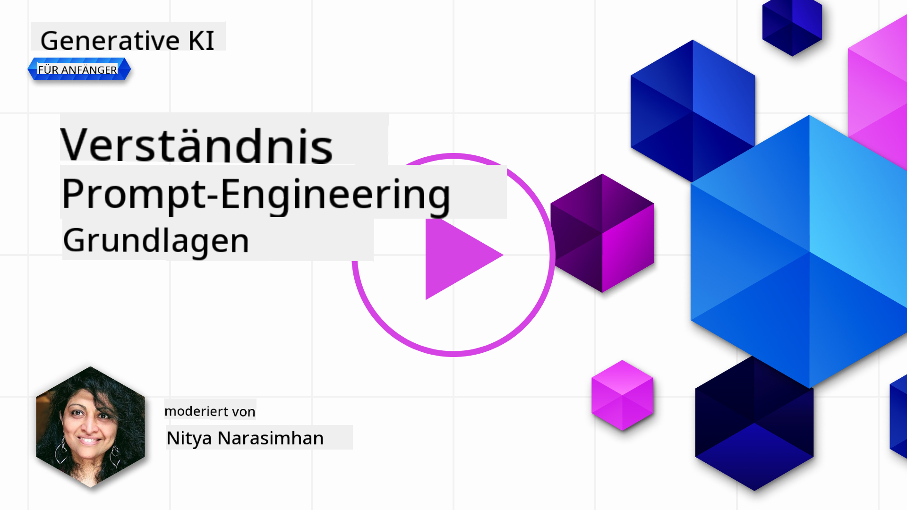
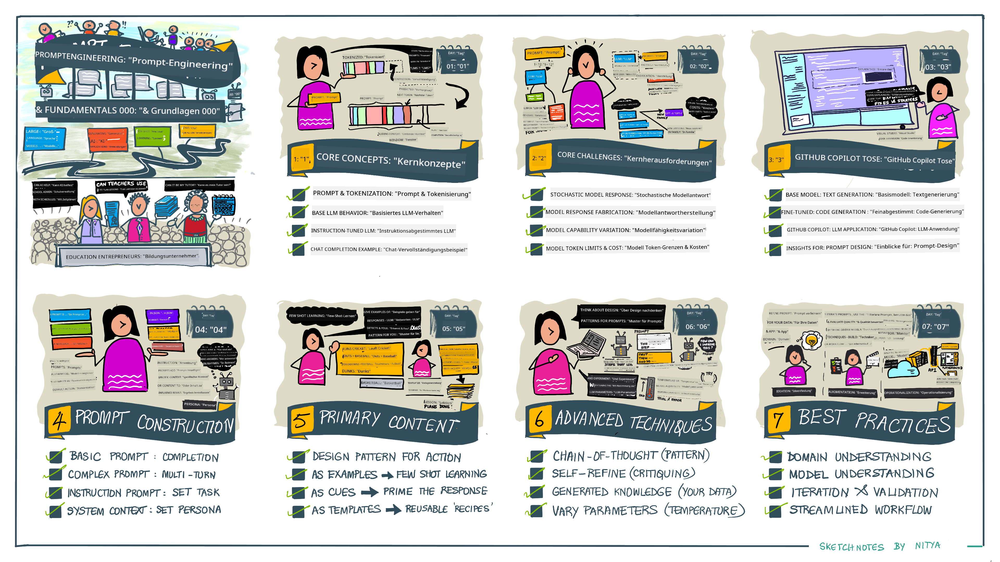
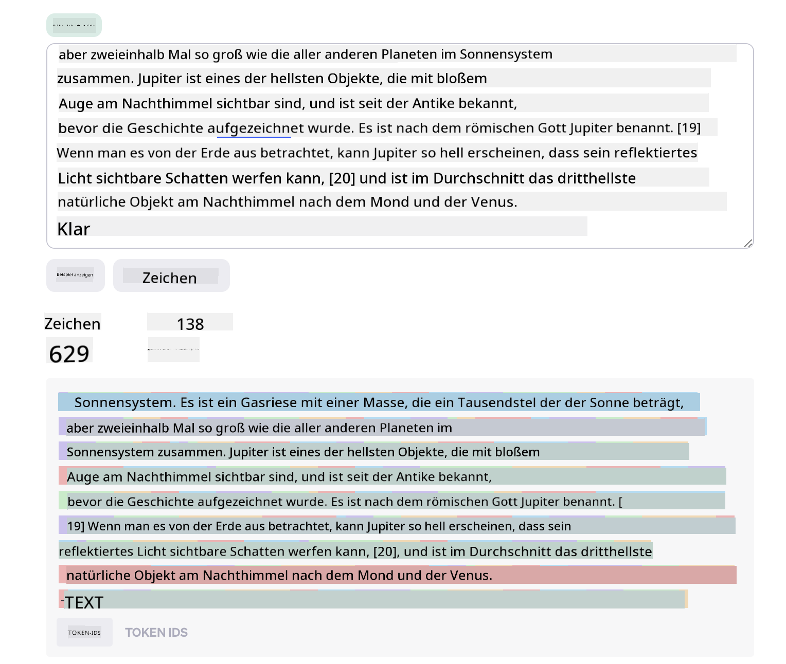
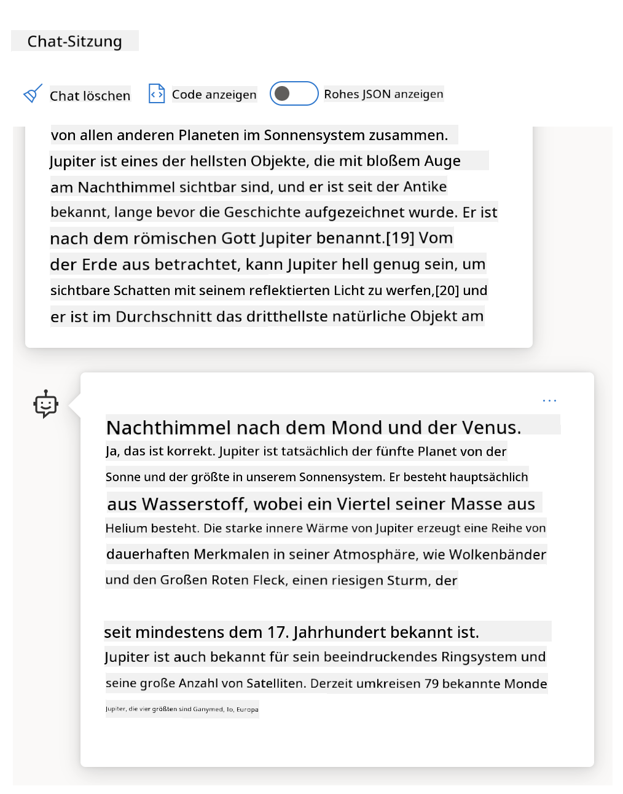
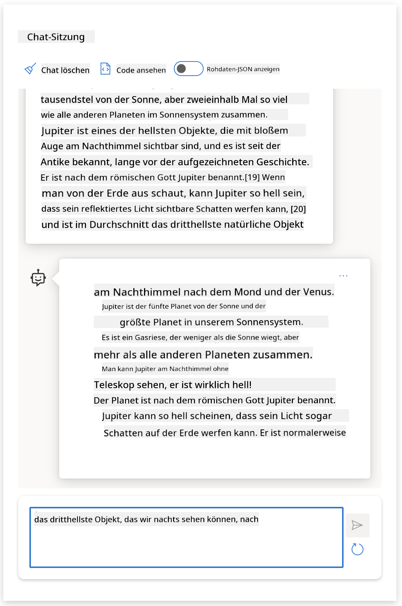
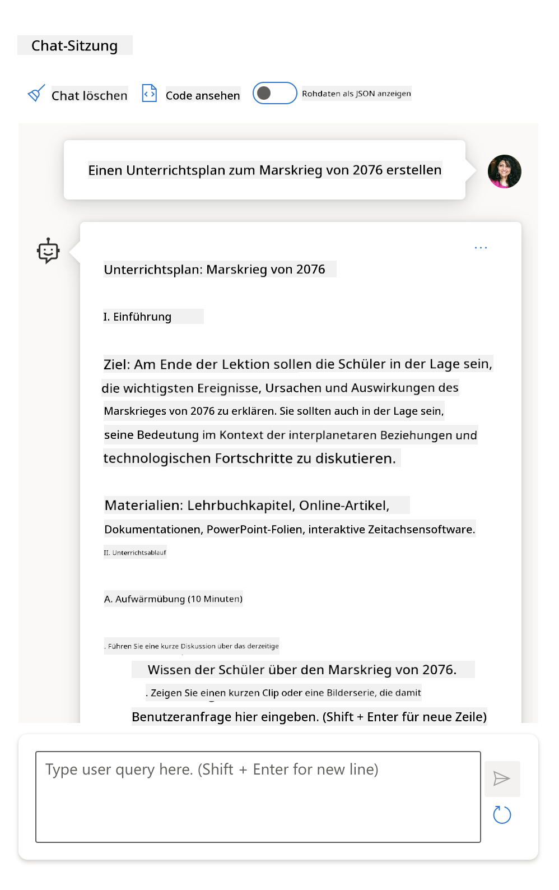
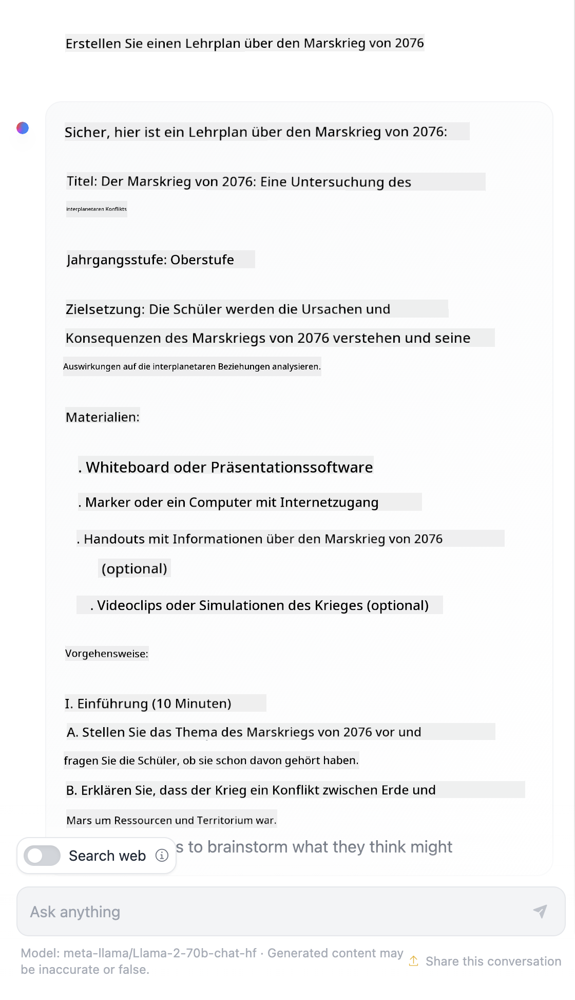

<!--
CO_OP_TRANSLATOR_METADATA:
{
  "original_hash": "dcbaaae026cb50fee071e690685b5843",
  "translation_date": "2025-08-26T13:47:21+00:00",
  "source_file": "04-prompt-engineering-fundamentals/README.md",
  "language_code": "de"
}
-->
# Grundlagen des Prompt Engineering

[](https://aka.ms/gen-ai-lesson4-gh?WT.mc_id=academic-105485-koreyst)

## Einführung
In diesem Modul lernst du die wichtigsten Konzepte und Techniken, um effektive Prompts für generative KI-Modelle zu erstellen. Es kommt darauf an, wie du deinen Prompt für ein LLM formulierst. Ein sorgfältig gestalteter Prompt kann die Qualität der Antwort deutlich verbessern. Aber was bedeuten Begriffe wie _Prompt_ und _Prompt Engineering_ eigentlich? Und wie kann ich die _Eingabe_ meines Prompts für das LLM optimieren? Diese Fragen wollen wir in diesem und im nächsten Kapitel beantworten.

_Generative KI_ kann neue Inhalte (z. B. Text, Bilder, Audio, Code usw.) auf Anfrage erstellen. Sie nutzt dazu _Large Language Models_ wie die GPT-Serie ("Generative Pre-trained Transformer") von OpenAI, die für den Umgang mit natürlicher Sprache und Code trainiert wurden.

Nutzer können jetzt mit diesen Modellen über bekannte Schnittstellen wie Chat interagieren, ohne technisches Vorwissen oder Training zu benötigen. Die Modelle sind _prompt-basiert_ – Nutzer senden einen Texteingabe (Prompt) und erhalten eine KI-Antwort (Completion). Sie können dann in mehreren Durchgängen mit der KI chatten und ihren Prompt so lange verfeinern, bis die Antwort ihren Erwartungen entspricht.

"Prompts" sind damit die zentrale _Programmierschnittstelle_ für generative KI-Anwendungen. Sie geben den Modellen Anweisungen und beeinflussen die Qualität der Antworten. "Prompt Engineering" ist ein schnell wachsendes Forschungsfeld, das sich mit der _Gestaltung und Optimierung_ von Prompts beschäftigt, um konsistente und hochwertige Antworten in großem Maßstab zu ermöglichen.

## Lernziele

In dieser Lektion erfährst du, was Prompt Engineering ist, warum es wichtig ist und wie du effektivere Prompts für ein bestimmtes Modell und Ziel formulieren kannst. Wir lernen die wichtigsten Konzepte und Best Practices für Prompt Engineering kennen – und entdecken eine interaktive Jupyter Notebook-Umgebung, in der wir diese Konzepte an echten Beispielen ausprobieren können.

Am Ende dieser Lektion kannst du:

1. Erklären, was Prompt Engineering ist und warum es wichtig ist.
2. Die Bestandteile eines Prompts beschreiben und wie sie verwendet werden.
3. Best Practices und Techniken für Prompt Engineering kennenlernen.
4. Die erlernten Techniken an echten Beispielen anwenden, mit einem OpenAI-Endpunkt.

## Wichtige Begriffe

Prompt Engineering: Die Praxis, Eingaben so zu gestalten und zu verfeinern, dass KI-Modelle gezielt gewünschte Ergebnisse liefern.
Tokenisierung: Der Prozess, Text in kleinere Einheiten (Tokens) umzuwandeln, die ein Modell verstehen und verarbeiten kann.
Instruction-Tuned LLMs: Große Sprachmodelle (LLMs), die mit spezifischen Anweisungen feinabgestimmt wurden, um die Genauigkeit und Relevanz ihrer Antworten zu verbessern.

## Lern-Sandbox

Prompt Engineering ist aktuell eher eine Kunst als eine Wissenschaft. Die beste Möglichkeit, ein Gefühl dafür zu bekommen, ist _viel Übung_ und ein Trial-and-Error-Ansatz, der Fachwissen aus dem Anwendungsbereich mit empfohlenen Techniken und modell-spezifischen Optimierungen kombiniert.

Das Jupyter Notebook zu dieser Lektion bietet dir eine _Sandbox_, in der du das Gelernte direkt ausprobieren kannst – entweder während der Lektion oder als Teil der Code-Challenge am Ende. Um die Übungen auszuführen, brauchst du:

1. **Einen Azure OpenAI API-Schlüssel** – den Service-Endpunkt für ein bereitgestelltes LLM.
2. **Eine Python-Laufzeitumgebung** – damit das Notebook ausgeführt werden kann.
3. **Lokale Umgebungsvariablen** – _führe jetzt die [SETUP](./../00-course-setup/02-setup-local.md?WT.mc_id=academic-105485-koreyst) Schritte aus, um alles vorzubereiten_.

Das Notebook enthält _Starter-Übungen_ – du kannst aber gerne eigene _Markdown_- (Beschreibung) und _Code_- (Prompt-Anfragen) Abschnitte hinzufügen, um weitere Beispiele oder Ideen auszuprobieren und dein Gespür für gutes Prompt-Design zu entwickeln.

## Illustrierte Übersicht

Möchtest du dir vorab einen Überblick verschaffen, was diese Lektion behandelt? Schau dir diese illustrierte Übersicht an – sie zeigt die wichtigsten Themen und die zentralen Erkenntnisse, die du dir zu jedem Punkt merken solltest. Die Roadmap führt dich von den grundlegenden Konzepten und Herausforderungen bis hin zu passenden Prompt Engineering-Techniken und Best Practices. Beachte, dass der Abschnitt "Advanced Techniques" in dieser Übersicht auf Inhalte im _nächsten_ Kapitel verweist.



## Unser Startup

Schauen wir uns an, wie _dieses Thema_ zu unserer Startup-Mission passt, [KI-Innovationen in die Bildung zu bringen](https://educationblog.microsoft.com/2023/06/collaborating-to-bring-ai-innovation-to-education?WT.mc_id=academic-105485-koreyst). Wir wollen KI-gestützte Anwendungen für _personalisiertes Lernen_ entwickeln – also überlegen wir, wie verschiedene Nutzer unserer Anwendung Prompts "gestalten" könnten:

- **Administratoren** könnten die KI bitten, _Curriculum-Daten zu analysieren, um Lücken in der Abdeckung zu erkennen_. Die KI kann die Ergebnisse zusammenfassen oder mit Code visualisieren.
- **Lehrkräfte** könnten die KI bitten, _einen Unterrichtsplan für eine bestimmte Zielgruppe und ein Thema zu erstellen_. Die KI kann den personalisierten Plan in einem gewünschten Format ausgeben.
- **Schüler:innen** könnten die KI bitten, _sie in einem schwierigen Fach zu unterstützen_. Die KI kann sie dann mit passenden Lektionen, Tipps und Beispielen auf ihrem Niveau begleiten.

Das ist nur der Anfang. Schau dir [Prompts For Education](https://github.com/microsoft/prompts-for-edu/tree/main?WT.mc_id=academic-105485-koreyst) an – eine Open-Source-Bibliothek mit Prompts, die von Bildungsexpert:innen zusammengestellt wurde. So bekommst du einen Eindruck von den Möglichkeiten! _Probiere einige dieser Prompts in der Sandbox oder im OpenAI Playground aus und sieh, was passiert!_

<!--
LESSON TEMPLATE:
This unit should cover core concept #1.
Reinforce the concept with examples and references.

CONCEPT #1:
Prompt Engineering.
Define it and explain why it is needed.
-->

## Was ist Prompt Engineering?

Wir haben diese Lektion mit der Definition von **Prompt Engineering** begonnen: Es ist der Prozess, _Texteingaben (Prompts) zu gestalten und zu optimieren_, um für ein bestimmtes Ziel und Modell konsistente und hochwertige Antworten (Completions) zu erhalten. Man kann sich das als einen zweistufigen Prozess vorstellen:

- _Gestaltung_ des ersten Prompts für ein bestimmtes Modell und Ziel
- _Iterative Verfeinerung_ des Prompts, um die Antwortqualität zu verbessern

Das ist zwangsläufig ein Trial-and-Error-Prozess, der Nutzerintuition und Einsatz erfordert, um optimale Ergebnisse zu erzielen. Aber warum ist das wichtig? Um das zu beantworten, müssen wir drei Konzepte verstehen:

- _Tokenisierung_ = wie das Modell den Prompt "sieht"
- _Base LLMs_ = wie das Grundmodell einen Prompt "verarbeitet"
- _Instruction-Tuned LLMs_ = wie das Modell jetzt "Aufgaben" erkennen kann

### Tokenisierung

Ein LLM sieht Prompts als _Folge von Tokens_, wobei verschiedene Modelle (oder Modellversionen) denselben Prompt unterschiedlich tokenisieren können. Da LLMs auf Tokens (und nicht auf Rohtext) trainiert werden, beeinflusst die Art der Tokenisierung direkt die Qualität der generierten Antwort.

Um ein Gefühl für die Tokenisierung zu bekommen, probiere Tools wie den [OpenAI Tokenizer](https://platform.openai.com/tokenizer?WT.mc_id=academic-105485-koreyst) aus. Kopiere deinen Prompt hinein und sieh, wie er in Tokens umgewandelt wird – achte darauf, wie Leerzeichen und Satzzeichen behandelt werden. Das Beispiel zeigt ein älteres LLM (GPT-3) – mit einem neueren Modell kann das Ergebnis anders ausfallen.



### Konzept: Foundation Models

Nachdem ein Prompt tokenisiert wurde, besteht die Hauptfunktion des ["Base LLM"](https://blog.gopenai.com/an-introduction-to-base-and-instruction-tuned-large-language-models-8de102c785a6?WT.mc_id=academic-105485-koreyst) (oder Foundation Model) darin, das nächste Token in der Sequenz vorherzusagen. Da LLMs auf riesigen Textdatensätzen trainiert wurden, kennen sie die statistischen Zusammenhänge zwischen Tokens und können diese Vorhersage mit gewisser Sicherheit treffen. Sie verstehen aber nicht die _Bedeutung_ der Wörter oder Tokens im Prompt; sie erkennen lediglich ein Muster, das sie mit ihrer nächsten Vorhersage "vervollständigen" können. Sie können die Sequenz fortsetzen, bis der Nutzer eingreift oder eine festgelegte Bedingung erreicht ist.

Möchtest du sehen, wie Prompt-basierte Completions funktionieren? Gib den oben genannten Prompt in das Azure OpenAI Studio [_Chat Playground_](https://oai.azure.com/playground?WT.mc_id=academic-105485-koreyst) mit den Standardeinstellungen ein. Das System behandelt Prompts als Informationsanfragen – du solltest eine Completion erhalten, die zu diesem Kontext passt.

Aber was, wenn der Nutzer etwas Spezielles sehen möchte, das bestimmte Kriterien oder ein Aufgaben-Ziel erfüllt? Hier kommen _Instruction-Tuned_ LLMs ins Spiel.



### Konzept: Instruction Tuned LLMs

Ein [Instruction Tuned LLM](https://blog.gopenai.com/an-introduction-to-base-and-instruction-tuned-large-language-models-8de102c785a6?WT.mc_id=academic-105485-koreyst) baut auf dem Foundation Model auf und wird mit Beispielen oder Input/Output-Paaren (z. B. mehrstufigen "Nachrichten") feinabgestimmt, die klare Anweisungen enthalten – und die KI versucht, diese Anweisungen zu befolgen.

Dabei kommen Techniken wie Reinforcement Learning mit menschlichem Feedback (RLHF) zum Einsatz, die das Modell darauf trainieren, _Anweisungen zu befolgen_ und _aus Feedback zu lernen_, sodass die Antworten besser für praktische Anwendungen und Nutzerziele geeignet sind.

Probieren wir es aus – nimm den oben genannten Prompt, ändere aber jetzt die _Systemnachricht_, um folgende Anweisung als Kontext zu geben:

> _Fasse die bereitgestellten Inhalte für eine Zweitklässlerin/einen Zweitklässler zusammen. Halte das Ergebnis in einem Absatz mit 3-5 Stichpunkten._

Siehst du, wie das Ergebnis jetzt auf das gewünschte Ziel und Format abgestimmt ist? Eine Lehrkraft kann diese Antwort direkt für ihre Unterrichtsfolien verwenden.



## Warum brauchen wir Prompt Engineering?

Jetzt, wo wir wissen, wie Prompts von LLMs verarbeitet werden, schauen wir uns an, _warum_ Prompt Engineering nötig ist. Der Grund ist, dass aktuelle LLMs einige Herausforderungen mit sich bringen, die _zuverlässige und konsistente Completions_ erschweren, wenn man nicht gezielt Zeit in die Gestaltung und Optimierung der Prompts investiert. Zum Beispiel:

1. **Modellantworten sind stochastisch.** Der _gleiche Prompt_ kann mit verschiedenen Modellen oder Modellversionen unterschiedliche Antworten liefern. Und sogar mit _dem gleichen Modell_ kann das Ergebnis zu verschiedenen Zeitpunkten variieren. _Prompt Engineering-Techniken helfen, diese Schwankungen zu minimieren, indem sie bessere Leitplanken bieten._

1. **Modelle können Antworten erfinden.** Modelle sind mit _großen, aber begrenzten_ Datensätzen vortrainiert und kennen daher keine Konzepte außerhalb dieses Trainingsbereichs. Sie können Completions erzeugen, die ungenau, erfunden oder sogar widersprüchlich zu bekannten Fakten sind. _Prompt Engineering-Techniken helfen, solche Erfindungen zu erkennen und zu vermeiden, z. B. indem man die KI um Quellenangaben oder Begründungen bittet._

1. **Modellfähigkeiten variieren.** Neuere Modelle oder Generationen bieten mehr Möglichkeiten, bringen aber auch eigene Eigenheiten und Kompromisse bei Kosten und Komplexität mit. _Prompt Engineering hilft, Best Practices und Workflows zu entwickeln, die Unterschiede abstrahieren und sich flexibel an modell-spezifische Anforderungen anpassen lassen._

Probiere das im OpenAI oder Azure OpenAI Playground aus:

- Verwende denselben Prompt mit verschiedenen LLM-Deployments (z. B. OpenAI, Azure OpenAI, Hugging Face) – siehst du die Unterschiede?
- Verwende denselben Prompt mehrfach mit _dem gleichen_ LLM-Deployment (z. B. Azure OpenAI Playground) – wie unterscheiden sich die Ergebnisse?

### Beispiel für Fabrications

In diesem Kurs verwenden wir den Begriff **"Fabrication"** für das Phänomen, dass LLMs manchmal faktisch falsche Informationen generieren – sei es durch Einschränkungen im Training oder andere Gründe. In Artikeln oder Forschungsarbeiten wird das oft als _"Halluzination"_ bezeichnet. Wir empfehlen aber ausdrücklich den Begriff _"Fabrication"_, damit wir dem Verhalten keine menschlichen Eigenschaften zuschreiben. Das entspricht auch den [Responsible AI-Richtlinien](https://www.microsoft.com/ai/responsible-ai?WT.mc_id=academic-105485-koreyst) und vermeidet Begriffe, die in manchen Kontexten als verletzend oder nicht inklusiv gelten.

Möchtest du sehen, wie Fabrications entstehen? Überlege dir einen Prompt, der die KI auffordert, Inhalte zu einem nicht existierenden Thema zu generieren (damit es sicher nicht im Trainingsdatensatz enthalten ist). Zum Beispiel habe ich diesen Prompt ausprobiert:
# Unterrichtsplan: Der Marskrieg von 2076

## Lernziele

- Die Schüler*innen verstehen die Ursachen, den Verlauf und die Folgen des Marskriegs von 2076.
- Die Schüler*innen analysieren die politischen, technologischen und gesellschaftlichen Auswirkungen des Krieges auf die Erde und den Mars.
- Die Schüler*innen entwickeln kritisches Denken durch Diskussionen und Gruppenarbeit.

## Einführung (15 Minuten)

- Kurze Einführung in die Kolonisierung des Mars und die Beziehungen zwischen Erde und Mars vor 2076.
- Überblick über die wichtigsten Ereignisse, die zum Ausbruch des Krieges führten.

## Hauptteil

### 1. Ursachen des Marskriegs (20 Minuten)

- Diskussion über die politischen Spannungen zwischen den Marskolonien und der Erde.
- Analyse der wirtschaftlichen Interessen und Ressourcenknappheit.
- Technologische Entwicklungen, die den Krieg ermöglichten.

### 2. Verlauf des Krieges (25 Minuten)

- Chronologischer Überblick über die wichtigsten Schlachten und Wendepunkte.
- Vorstellung bedeutender Persönlichkeiten und Fraktionen.
- Einsatz neuer Waffentechnologien und Strategien.

### 3. Folgen und Auswirkungen (20 Minuten)

- Politische Veränderungen auf Mars und Erde nach dem Krieg.
- Gesellschaftliche und kulturelle Auswirkungen auf beide Planeten.
- Langfristige technologische Entwicklungen, die aus dem Krieg hervorgingen.

## Gruppenarbeit (20 Minuten)

- Die Klasse wird in Gruppen aufgeteilt. Jede Gruppe bearbeitet eine der folgenden Aufgaben:
  - Eine Nachrichtensendung aus dem Jahr 2076 zum Marskrieg gestalten.
  - Eine Debatte zwischen einem Marskolonisten und einem Erdbewohner nachspielen.
  - Einen Zeitungsartikel über die Nachkriegszeit verfassen.

## Abschlussdiskussion (10 Minuten)

- Präsentation der Gruppenergebnisse.
- Gemeinsame Reflexion: Was können wir aus dem Marskrieg von 2076 für die Zukunft lernen?

## Hausaufgabe

- Verfasse einen Tagebucheintrag aus der Sicht einer Person, die den Marskrieg miterlebt hat. Beschreibe ihre Gefühle, Erlebnisse und Hoffnungen für die Zukunft.

## Materialien

- Arbeitsblätter mit Zeitleisten und Karten
- Zugang zu digitalen Quellen und Videos über den Marskrieg von 2076
- Whiteboard und Marker

## Hinweise für Lehrkräfte

- Achten Sie darauf, dass alle Schüler*innen aktiv eingebunden werden.
- Fördern Sie kritisches Denken und unterschiedliche Perspektiven.
- Passen Sie die Aufgaben je nach Leistungsstand der Klasse an.
Eine Websuche zeigte mir, dass es fiktive Berichte (z. B. Fernsehserien oder Bücher) über Marskriege gibt – aber keinen im Jahr 2076. Der gesunde Menschenverstand sagt uns außerdem, dass 2076 _in der Zukunft_ liegt und daher nicht mit einem realen Ereignis in Verbindung gebracht werden kann.

Was passiert also, wenn wir diesen Prompt mit verschiedenen LLM-Anbietern testen?

> **Antwort 1**: OpenAI Playground (GPT-35)


> **Antwort 2**: Azure OpenAI Playground (GPT-35)



> **Antwort 3**: Hugging Face Chat Playground (LLama-2)



Wie erwartet liefert jedes Modell (bzw. jede Modellversion) leicht unterschiedliche Antworten, was auf stochastisches Verhalten und Unterschiede in den Modellfähigkeiten zurückzuführen ist. Zum Beispiel richtet sich ein Modell an Achtklässler, während ein anderes von Oberstufenschülern ausgeht. Aber alle drei Modelle erzeugten Antworten, die einen uninformierten Nutzer davon überzeugen könnten, dass das Ereignis echt war.

Prompt-Engineering-Techniken wie _Metaprompting_ und _Temperature-Konfiguration_ können Modell-Fiktionen bis zu einem gewissen Grad reduzieren. Neue Prompt-Engineering-_Architekturen_ integrieren zudem neue Tools und Methoden nahtlos in den Prompt-Flow, um einige dieser Effekte abzumildern oder zu verringern.

## Fallstudie: GitHub Copilot

Schließen wir diesen Abschnitt ab, indem wir uns anschauen, wie Prompt Engineering in echten Lösungen eingesetzt wird – am Beispiel von [GitHub Copilot](https://github.com/features/copilot?WT.mc_id=academic-105485-koreyst).

GitHub Copilot ist dein „KI-Pair-Programmierer“ – er wandelt Text-Prompts in Code-Vervollständigungen um und ist in deine Entwicklungsumgebung (z. B. Visual Studio Code) integriert, um ein nahtloses Nutzererlebnis zu bieten. Wie in den untenstehenden Blogbeiträgen dokumentiert, basierte die erste Version auf dem OpenAI Codex-Modell – die Entwickler erkannten jedoch schnell, dass das Modell feinjustiert und bessere Prompt-Engineering-Techniken entwickelt werden mussten, um die Codequalität zu verbessern. Im Juli [stellten sie ein verbessertes KI-Modell vor, das über Codex hinausgeht](https://github.blog/2023-07-28-smarter-more-efficient-coding-github-copilot-goes-beyond-codex-with-improved-ai-model/?WT.mc_id=academic-105485-koreyst) und noch schnellere Vorschläge liefert.

Lies die Beiträge in der angegebenen Reihenfolge, um ihre Lernreise nachzuvollziehen.

- **Mai 2023** | [GitHub Copilot versteht deinen Code immer besser](https://github.blog/2023-05-17-how-github-copilot-is-getting-better-at-understanding-your-code/?WT.mc_id=academic-105485-koreyst)
- **Mai 2023** | [Inside GitHub: Zusammenarbeit mit den LLMs hinter GitHub Copilot](https://github.blog/2023-05-17-inside-github-working-with-the-llms-behind-github-copilot/?WT.mc_id=academic-105485-koreyst).
- **Juni 2023** | [Wie man bessere Prompts für GitHub Copilot schreibt](https://github.blog/2023-06-20-how-to-write-better-prompts-for-github-copilot/?WT.mc_id=academic-105485-koreyst).
- **Juli 2023** | [.. GitHub Copilot geht mit verbessertem KI-Modell über Codex hinaus](https://github.blog/2023-07-28-smarter-more-efficient-coding-github-copilot-goes-beyond-codex-with-improved-ai-model/?WT.mc_id=academic-105485-koreyst)
- **Juli 2023** | [Ein Entwicklerleitfaden für Prompt Engineering und LLMs](https://github.blog/2023-07-17-prompt-engineering-guide-generative-ai-llms/?WT.mc_id=academic-105485-koreyst)
- **September 2023** | [Wie man eine Enterprise-LLM-App baut: Lektionen von GitHub Copilot](https://github.blog/2023-09-06-how-to-build-an-enterprise-llm-application-lessons-from-github-copilot/?WT.mc_id=academic-105485-koreyst)

Du kannst auch im [Engineering-Blog](https://github.blog/category/engineering/?WT.mc_id=academic-105485-koreyst) stöbern, um weitere Beiträge wie [diesen hier](https://github.blog/2023-09-27-how-i-used-github-copilot-chat-to-build-a-reactjs-gallery-prototype/?WT.mc_id=academic-105485-koreyst) zu finden, die zeigen, wie diese Modelle und Techniken _praktisch_ für echte Anwendungen eingesetzt werden.

---

## Prompt-Konstruktion

Wir haben gesehen, warum Prompt Engineering wichtig ist – jetzt wollen wir verstehen, wie Prompts _aufgebaut_ werden, damit wir verschiedene Techniken für ein effektiveres Prompt-Design bewerten können.

### Basis-Prompt

Beginnen wir mit dem Basis-Prompt: eine Texteingabe, die ohne weiteren Kontext an das Modell gesendet wird. Hier ein Beispiel – wenn wir die ersten Wörter der US-Nationalhymne an die OpenAI [Completion API](https://platform.openai.com/docs/api-reference/completions?WT.mc_id=academic-105485-koreyst) schicken, vervollständigt sie die Antwort sofort mit den nächsten Zeilen und zeigt so das grundlegende Vorhersageverhalten.

| Prompt (Eingabe)     | Completion (Ausgabe)                                                                                                                        |
| :------------------- | :----------------------------------------------------------------------------------------------------------------------------------------- |
| Oh say can you see   | Es klingt, als würdest du die Zeilen von „The Star-Spangled Banner“, der Nationalhymne der Vereinigten Staaten, beginnen. Der vollständige Text lautet ... |

### Komplexer Prompt

Nun fügen wir Kontext und Anweisungen zum Basis-Prompt hinzu. Die [Chat Completion API](https://learn.microsoft.com/azure/ai-services/openai/how-to/chatgpt?WT.mc_id=academic-105485-koreyst) ermöglicht es, einen komplexen Prompt als Sammlung von _Nachrichten_ zu gestalten mit:

- Eingabe-/Ausgabe-Paaren, die die _Benutzereingabe_ und die _Antwort des Assistenten_ widerspiegeln.
- Systemnachricht, die den Kontext für das Verhalten oder die Persönlichkeit des Assistenten festlegt.

Die Anfrage sieht jetzt wie unten aus, wobei die _Tokenisierung_ relevante Informationen aus Kontext und Konversation erfasst. Die Änderung des Systemkontexts kann nun genauso großen Einfluss auf die Qualität der Antworten haben wie die Benutzereingaben.

```python
response = openai.chat.completions.create(
    model="gpt-3.5-turbo",
    messages=[
        {"role": "system", "content": "You are a helpful assistant."},
        {"role": "user", "content": "Who won the world series in 2020?"},
        {"role": "assistant", "content": "The Los Angeles Dodgers won the World Series in 2020."},
        {"role": "user", "content": "Where was it played?"}
    ]
)
```

### Anweisungs-Prompt

In den obigen Beispielen war der Benutzer-Prompt eine einfache Textanfrage, die als Informationsanfrage interpretiert werden kann. Mit _Anweisungs_-Prompts können wir diesen Text nutzen, um eine Aufgabe genauer zu beschreiben und der KI bessere Hinweise zu geben. Hier ein Beispiel:

| Prompt (Eingabe)                                                                                                                                                                                                                         | Completion (Ausgabe)                                                                                                        | Anweisungstyp       |
| :--------------------------------------------------------------------------------------------------------------------------------------------------------------------------------------------------------------------------------------- | :------------------------------------------------------------------------------------------------------------------------- | :------------------ |
| Schreibe eine Beschreibung des Bürgerkriegs                                                                                                                                                                                              | _gab einen einfachen Absatz zurück_                                                                                         | Einfach             |
| Schreibe eine Beschreibung des Bürgerkriegs. Füge wichtige Daten und Ereignisse hinzu und beschreibe deren Bedeutung.                                                                                                                    | _gab einen Absatz und eine Liste mit wichtigen Ereignisdaten und Beschreibungen zurück_                                     | Komplex             |
| Schreibe eine Beschreibung des Bürgerkriegs in 1 Absatz. Füge 3 Stichpunkte mit wichtigen Daten und deren Bedeutung hinzu. Füge 3 weitere Stichpunkte mit wichtigen historischen Persönlichkeiten und deren Beiträgen hinzu. Gib die Ausgabe als JSON-Datei zurück. | _gibt ausführlichere Details in einer Textbox zurück, formatiert als JSON, das du kopieren und bei Bedarf validieren kannst_ | Komplex. Formatiert.|

## Primärinhalt

In den obigen Beispielen war der Prompt immer noch recht offen, sodass das LLM selbst entscheiden konnte, welcher Teil seines vortrainierten Datensatzes relevant ist. Beim _Primärinhalt_-Designmuster wird der Eingabetext in zwei Teile geteilt:

- eine Anweisung (Aktion)
- relevanter Inhalt (der die Aktion beeinflusst)

Hier ein Beispiel, bei dem die Anweisung lautet: „Fasse das in 2 Sätzen zusammen“.

| Prompt (Eingabe)                                                                                                                                                                                                                                                                                                                                                                                                                                                                                                                                                                                                                                                                                      | Completion (Ausgabe)                                                                                                                                                                                                                                                                             |
| :-------------------------------------------------------------------------------------------------------------------------------------------------------------------------------------------------------------------------------------------------------------------------------------------------------------------------------------------------------------------------------------------------------------------------------------------------------------------------------------------------------------------------------------------------------------------------------------------------------------------------------------------------------------------------------------------------- | :---------------------------------------------------------------------------------------------------------------------------------------------------------------------------------------------------------------------------------------------------------------------------------------------- |
| Jupiter ist der fünfte Planet von der Sonne und der größte im Sonnensystem. Es ist ein Gasriese mit einer Masse, die ein Tausendstel der Sonne beträgt, aber zweieinhalbmal so groß ist wie die aller anderen Planeten im Sonnensystem zusammen. Jupiter ist eines der hellsten Objekte, die mit bloßem Auge am Nachthimmel sichtbar sind, und ist seit der Antike bekannt. Er ist nach dem römischen Gott Jupiter benannt.[19] Von der Erde aus betrachtet kann Jupiter so hell sein, dass sein reflektiertes Licht sichtbare Schatten wirft,[20] und ist im Durchschnitt das dritthellste natürliche Objekt am Nachthimmel nach dem Mond und der Venus. <br/> **Fasse das in 2 kurzen Sätzen zusammen** | Jupiter, der fünfte Planet von der Sonne, ist der größte im Sonnensystem und eines der hellsten Objekte am Nachthimmel. Benannt nach dem römischen Gott Jupiter, ist er ein Gasriese mit einer Masse, die zweieinhalbmal so groß ist wie die aller anderen Planeten zusammen. |

Das Primärinhalt-Segment kann auf verschiedene Weise genutzt werden, um effektivere Anweisungen zu geben:

- **Beispiele** – statt dem Modell explizit zu sagen, was es tun soll, gib ihm Beispiele für die gewünschte Ausgabe und lass es das Muster ableiten.
- **Cues** – folge der Anweisung mit einem „Cue“, der die Vervollständigung anstößt und das Modell zu relevanteren Antworten führt.
- **Vorlagen** – das sind wiederverwendbare „Rezepte“ für Prompts mit Platzhaltern (Variablen), die mit Daten für bestimmte Anwendungsfälle angepasst werden können.

Schauen wir uns das in der Praxis an.

### Beispiele verwenden

Bei diesem Ansatz nutzt du den Primärinhalt, um dem Modell einige Beispiele für die gewünschte Ausgabe zu geben, und lässt es das Muster für die gewünschte Antwort ableiten. Je nach Anzahl der Beispiele spricht man von Zero-Shot-, One-Shot-, Few-Shot-Prompting usw.

Der Prompt besteht jetzt aus drei Komponenten:

- einer Aufgabenbeschreibung
- einigen Beispielen für die gewünschte Ausgabe
- dem Beginn eines neuen Beispiels (der zur impliziten Aufgabenbeschreibung wird)

| Lerntyp      | Prompt (Eingabe)                                                                                                                                        | Completion (Ausgabe)         |
| :----------- | :------------------------------------------------------------------------------------------------------------------------------------------------------ | :--------------------------- |
| Zero-shot    | „The Sun is Shining“. Translate to Spanish                                                                                                              | „El Sol está brillando“.     |
| One-shot     | „The Sun is Shining“ => „El Sol está brillando“. <br> „It's a Cold and Windy Day“ =>                                                                    | „Es un día frío y ventoso“.  |
| Few-shot     | The player ran the bases => Baseball <br/> The player hit an ace => Tennis <br/> The player hit a six => Cricket <br/> The player made a slam-dunk =>   | Basketball                   |
|              |                                                                                                                                                         |                             |

Beachte, dass wir beim Zero-Shot-Prompting eine explizite Anweisung („Translate to Spanish“) geben mussten, während sie beim One-Shot-Prompting aus dem Beispiel abgeleitet wird. Das Few-Shot-Beispiel zeigt, wie mehr Beispiele dem Modell helfen, genauere Schlüsse zu ziehen – ganz ohne zusätzliche Anweisungen.

### Prompt-Cues

Eine weitere Technik für Primärinhalt ist das Geben von _Cues_ statt Beispielen. Hier gibst du dem Modell einen kleinen Anstoß in die richtige Richtung, indem du mit einem Ausschnitt beginnst, der das gewünschte Antwortformat widerspiegelt. Das Modell „nimmt den Cue“ und macht in diesem Stil weiter.

| Anzahl der Cues | Prompt (Eingabe)                                                                                                                                                                                                                                                                                                                                                                                                                                               | Completion (Ausgabe)                                                                                                                                                                                                                                                                                       |
| :-------------- | :----------------------------------------------------------------------------------------------------------------------------------------------------------------------------------------------------------------------------------------------------------------------------------------------------------------------------------------------------------------------------------------------------------------------------------------------------------- | :-------------------------------------------------------------------------------------------------------------------------------------------------------------------------------------------------------------------------------------------------------------------------------------------------------- |
| 0               | Jupiter ist der fünfte Planet von der Sonne und der größte im Sonnensystem. Es ist ein Gasriese mit einer Masse, die ein Tausendstel der Sonne beträgt, aber zweieinhalbmal so groß ist wie die aller anderen Planeten im Sonnensystem zusammen. Jupiter ist eines der hellsten Objekte, die mit bloßem Auge am Nachthimmel sichtbar sind, und ist seit der Antike bekannt.

**Fasse das zusammen**                                       | Jupiter ist der größte Planet in unserem Sonnensystem und der fünfte von der Sonne aus gesehen. Es ist ein Gasriese mit einer Masse von 1/1000 der Sonne, aber schwerer als alle anderen Planeten zusammen. Alte Zivilisationen kannten Jupiter schon lange, und er ist leicht am Nachthimmel zu sehen. |
| 1              | Jupiter ist der fünfte Planet von der Sonne und der größte im Sonnensystem. Es ist ein Gasriese mit einer Masse, die ein Tausendstel der Sonne beträgt, aber zweieinhalb Mal so groß ist wie die aller anderen Planeten im Sonnensystem zusammen. Jupiter ist eines der hellsten Objekte, die mit bloßem Auge am Nachthimmel sichtbar sind, und ist schon seit der Antike bekannt. <br/>**Fasse das zusammen** <br/> Was wir gelernt haben, ist, dass Jupiter | der fünfte Planet von der Sonne und der größte im Sonnensystem ist. Es ist ein Gasriese mit einer Masse von einem Tausendstel der Sonne, aber zweieinhalb Mal so groß wie alle anderen Planeten zusammen. Er ist mit bloßem Auge gut sichtbar und schon seit der Antike bekannt.                        |
| 2              | Jupiter ist der fünfte Planet von der Sonne und der größte im Sonnensystem. Es ist ein Gasriese mit einer Masse, die ein Tausendstel der Sonne beträgt, aber zweieinhalb Mal so groß ist wie die aller anderen Planeten im Sonnensystem zusammen. Jupiter ist eines der hellsten Objekte, die mit bloßem Auge am Nachthimmel sichtbar sind, und ist schon seit der Antike bekannt. <br/>**Fasse das zusammen** <br/> Top 3 Fakten, die wir gelernt haben:         | 1. Jupiter ist der fünfte Planet von der Sonne und der größte im Sonnensystem. <br/> 2. Es ist ein Gasriese mit einer Masse von einem Tausendstel der Sonne...<br/> 3. Jupiter ist schon seit der Antike mit bloßem Auge sichtbar ...                                                                       |
|                |                                                                                                                                                                                                                                                                                                                                                                                                                                                              |                                                                                                                                                                                                                                                                                                           |

### Prompt-Vorlagen

Eine Prompt-Vorlage ist ein _vordefiniertes Rezept für einen Prompt_, das gespeichert und bei Bedarf wiederverwendet werden kann, um konsistentere Nutzererfahrungen im großen Maßstab zu ermöglichen. In der einfachsten Form ist es einfach eine Sammlung von Prompt-Beispielen wie [dieses von OpenAI](https://platform.openai.com/examples?WT.mc_id=academic-105485-koreyst), das sowohl die interaktiven Prompt-Komponenten (Nutzer- und Systemnachrichten) als auch das API-gesteuerte Anfrageformat bereitstellt – zur Unterstützung der Wiederverwendung.

In einer komplexeren Form wie [diesem Beispiel von LangChain](https://python.langchain.com/docs/concepts/prompt_templates/?WT.mc_id=academic-105485-koreyst) enthält es _Platzhalter_, die mit Daten aus verschiedenen Quellen (Nutzereingaben, Systemkontext, externe Datenquellen usw.) ersetzt werden können, um einen Prompt dynamisch zu generieren. So können wir eine Bibliothek wiederverwendbarer Prompts erstellen, die genutzt werden kann, um konsistente Nutzererfahrungen **programmatisch** im großen Maßstab zu ermöglichen.

Der eigentliche Wert von Vorlagen liegt schließlich darin, _Prompt-Bibliotheken_ für vertikale Anwendungsbereiche zu erstellen und zu veröffentlichen – wobei die Prompt-Vorlage nun _optimiert_ ist, um anwendungsspezifischen Kontext oder Beispiele widerzuspiegeln, die die Antworten für die jeweilige Zielgruppe relevanter und genauer machen. Das [Prompts For Edu](https://github.com/microsoft/prompts-for-edu?WT.mc_id=academic-105485-koreyst) Repository ist ein gutes Beispiel für diesen Ansatz und kuratiert eine Prompt-Bibliothek für den Bildungsbereich mit Schwerpunkt auf Schlüsselzielen wie Unterrichtsplanung, Curriculum-Design, Nachhilfe für Schüler usw.

## Unterstützende Inhalte

Wenn wir die Erstellung von Prompts als eine Aufgabe mit einer Anweisung (Task) und einem Ziel (Hauptinhalt) betrachten, dann ist _sekundärer Inhalt_ wie zusätzlicher Kontext, den wir bereitstellen, um **die Ausgabe in gewisser Weise zu beeinflussen**. Das können Tuning-Parameter, Formatierungsanweisungen, Themen-Taxonomien usw. sein, die dem Modell helfen, seine Antwort _anzupassen_, damit sie den gewünschten Nutzerzielen oder Erwartungen entspricht.

Beispiel: Angenommen, wir haben ein Kursverzeichnis mit umfangreichen Metadaten (Name, Beschreibung, Niveau, Metadaten-Tags, Dozent usw.) zu allen verfügbaren Kursen im Curriculum:

- Wir können eine Anweisung definieren wie „Fasse das Kursverzeichnis für das Wintersemester 2023 zusammen“
- Wir können den Hauptinhalt nutzen, um einige Beispiele für das gewünschte Ergebnis zu geben
- Wir können den sekundären Inhalt nutzen, um die fünf wichtigsten „Tags“ zu identifizieren.

Nun kann das Modell eine Zusammenfassung im durch die Beispiele vorgegebenen Format liefern – aber wenn ein Ergebnis mehrere Tags hat, kann es die fünf im sekundären Inhalt identifizierten Tags priorisieren.

---

<!--
LEKTIONSVORLAGE:
Diese Einheit sollte das Kernkonzept #1 abdecken.
Festige das Konzept mit Beispielen und Verweisen.

KONZEPT #3:
Prompt Engineering Techniken.
Was sind einige grundlegende Techniken für Prompt Engineering?
Veranschauliche es mit einigen Übungen.
-->

## Best Practices für Prompts

Jetzt, da wir wissen, wie Prompts _erstellt_ werden können, können wir uns Gedanken darüber machen, wie wir sie _gestalten_, um Best Practices zu berücksichtigen. Wir können das in zwei Teile gliedern – die richtige _Einstellung_ und die Anwendung der richtigen _Techniken_.

### Prompt Engineering Mindset

Prompt Engineering ist ein Prozess des Ausprobierens, daher sollte man drei grundlegende Leitgedanken im Kopf behalten:

1. **Domänenverständnis ist wichtig.** Die Genauigkeit und Relevanz der Antwort hängt vom _Anwendungsbereich_ ab, in dem die Anwendung oder der Nutzer agiert. Nutze deine Intuition und Fachexpertise, um **Techniken individuell anzupassen**. Definiere zum Beispiel _domänenspezifische Persönlichkeiten_ in deinen Systemprompts oder verwende _domänenspezifische Vorlagen_ in deinen Nutzerprompts. Gib sekundäre Inhalte an, die domänenspezifische Kontexte widerspiegeln, oder nutze _domänenspezifische Hinweise und Beispiele_, um das Modell auf vertraute Nutzungsmuster zu lenken.

2. **Modellverständnis ist wichtig.** Wir wissen, dass Modelle von Natur aus stochastisch sind. Aber Modellimplementierungen können sich auch hinsichtlich des Trainingsdatensatzes (vortrainiertes Wissen), der bereitgestellten Fähigkeiten (z. B. über API oder SDK) und der Art der Inhalte, für die sie optimiert sind (z. B. Code vs. Bilder vs. Text), unterscheiden. Verstehe die Stärken und Schwächen des von dir verwendeten Modells und nutze dieses Wissen, um _Aufgaben zu priorisieren_ oder _individuelle Vorlagen_ zu erstellen, die auf die Fähigkeiten des Modells zugeschnitten sind.

3. **Iteration & Validierung sind wichtig.** Modelle entwickeln sich schnell weiter, ebenso wie die Techniken für Prompt Engineering. Als Fachexperte hast du vielleicht weiteren Kontext oder Kriterien für _deine_ spezifische Anwendung, die nicht für die breite Community gelten. Nutze Tools & Techniken des Prompt Engineerings, um den Prompt-Aufbau zu „beschleunigen“, dann iteriere und validiere die Ergebnisse mit deiner eigenen Intuition und Fachexpertise. Halte deine Erkenntnisse fest und erstelle eine **Wissensbasis** (z. B. Prompt-Bibliotheken), die von anderen als neuer Ausgangspunkt für schnellere Iterationen genutzt werden kann.

## Best Practices

Schauen wir uns nun gängige Best Practices an, die von [OpenAI](https://help.openai.com/en/articles/6654000-best-practices-for-prompt-engineering-with-openai-api?WT.mc_id=academic-105485-koreyst) und [Azure OpenAI](https://learn.microsoft.com/azure/ai-services/openai/concepts/prompt-engineering#best-practices?WT.mc_id=academic-105485-koreyst) empfohlen werden.

| Was                              | Warum                                                                                                                                                                                                                                               |
| :-------------------------------- | :------------------------------------------------------------------------------------------------------------------------------------------------------------------------------------------------------------------------------------------------ |
| Prüfe die neuesten Modelle.       | Neue Modellgenerationen bieten wahrscheinlich verbesserte Funktionen und Qualität – können aber auch höhere Kosten verursachen. Prüfe sie auf ihre Auswirkungen und entscheide dann über eine Migration.                                                                                |
| Trenne Anweisungen & Kontext      | Prüfe, ob dein Modell/Anbieter _Trennzeichen_ definiert, um Anweisungen, Haupt- und Nebeninhalte klarer zu unterscheiden. Das kann helfen, dass Modelle Token genauer gewichten.                                                         |
| Sei spezifisch und klar           | Gib mehr Details zum gewünschten Kontext, Ergebnis, zur Länge, zum Format, Stil usw. an. Das verbessert sowohl die Qualität als auch die Konsistenz der Antworten. Halte Rezepte in wiederverwendbaren Vorlagen fest.                                                          |
| Sei beschreibend, nutze Beispiele | Modelle reagieren oft besser auf einen „Zeigen und Erklären“-Ansatz. Starte mit einem `Zero-Shot`-Ansatz, bei dem du nur eine Anweisung gibst (ohne Beispiele), und probiere dann `Few-Shot` als Verfeinerung, indem du einige Beispiele für das gewünschte Ergebnis gibst. Nutze Analogien. |
| Nutze Hinweise für den Einstieg   | Gib dem Modell einige einleitende Wörter oder Phrasen, die es als Ausgangspunkt für die Antwort nutzen kann, um es in die gewünschte Richtung zu lenken.                                                                                                               |
| Wiederhole dich                   | Manchmal musst du dich beim Modell wiederholen. Gib Anweisungen vor und nach deinem Hauptinhalt, nutze eine Anweisung und einen Hinweis usw. Iteriere & validiere, was funktioniert.                                                         |
| Reihenfolge ist wichtig           | Die Reihenfolge, in der du dem Modell Informationen präsentierst, kann die Ausgabe beeinflussen – auch in den Lernbeispielen, Stichwort Recency Bias. Probiere verschiedene Optionen aus, um zu sehen, was am besten funktioniert.                                                               |
| Gib dem Modell eine „Ausweichmöglichkeit“ | Gib dem Modell eine _Fallback_-Antwort, die es liefern kann, wenn es die Aufgabe aus irgendeinem Grund nicht erfüllen kann. Das kann die Wahrscheinlichkeit verringern, dass Modelle falsche oder erfundene Antworten generieren.                                                         |
|                                   |                                                                                                                                                                                                                                                   |

Wie bei jeder Best Practice gilt: _Deine Erfahrungen können variieren_, je nach Modell, Aufgabe und Anwendungsbereich. Nutze diese als Ausgangspunkt und finde durch Ausprobieren heraus, was für dich am besten funktioniert. Überprüfe deinen Prompt-Engineering-Prozess regelmäßig, wenn neue Modelle und Tools verfügbar werden – mit Fokus auf Skalierbarkeit und Antwortqualität.

<!--
LEKTIONSVORLAGE:
Diese Einheit sollte eine Code-Challenge enthalten, falls zutreffend

CHALLENGE:
Link zu einem Jupyter Notebook, in dem nur die Code-Kommentare in den Anweisungen stehen (Code-Abschnitte sind leer).

LÖSUNG:
Link zu einer Kopie dieses Notebooks, in dem die Prompts ausgefüllt und ausgeführt wurden, um ein Beispiel zu zeigen.
-->

## Aufgabe

Glückwunsch! Du hast das Ende der Lektion erreicht! Jetzt ist es Zeit, einige dieser Konzepte und Techniken mit echten Beispielen zu testen!

Für unsere Aufgabe nutzen wir ein Jupyter Notebook mit Übungen, die du interaktiv bearbeiten kannst. Du kannst das Notebook auch mit eigenen Markdown- und Codezellen erweitern, um eigene Ideen und Techniken zu erforschen.

### So startest du: Forke das Repository, dann

- (Empfohlen) Starte GitHub Codespaces
- (Alternativ) Klone das Repository auf dein lokales Gerät und nutze es mit Docker Desktop
- (Alternativ) Öffne das Notebook mit deiner bevorzugten Notebook-Umgebung.

### Als Nächstes: Konfiguriere deine Umgebungsvariablen

- Kopiere die Datei `.env.copy` im Repo-Root zu `.env` und trage die Werte für `AZURE_OPENAI_API_KEY`, `AZURE_OPENAI_ENDPOINT` und `AZURE_OPENAI_DEPLOYMENT` ein. Kehre zum [Learning Sandbox Abschnitt](../../../04-prompt-engineering-fundamentals/04-prompt-engineering-fundamentals) zurück, um zu erfahren, wie das geht.

### Dann öffne das Jupyter Notebook

- Wähle den Runtime-Kernel aus. Wenn du Option 1 oder 2 nutzt, wähle einfach den Standard-Python-3.10.x-Kernel, der vom Dev-Container bereitgestellt wird.

Jetzt kannst du die Übungen ausführen. Beachte, dass es hier keine _richtigen oder falschen_ Antworten gibt – es geht darum, durch Ausprobieren Optionen zu erkunden und ein Gefühl dafür zu bekommen, was für ein bestimmtes Modell und einen bestimmten Anwendungsbereich funktioniert.

_Aus diesem Grund gibt es in dieser Lektion keine Code-Lösungsteile. Stattdessen enthält das Notebook Markdown-Zellen mit dem Titel „Meine Lösung:“, die ein Beispielergebnis als Referenz zeigen._

 <!--
LEKTIONSVORLAGE:
Fasse den Abschnitt zusammen und gib Ressourcen für selbstgesteuertes Lernen an.
-->

## Wissenscheck

Welcher der folgenden Prompts entspricht einigen sinnvollen Best Practices?

1. Zeig mir ein Bild von einem roten Auto
2. Zeig mir ein Bild von einem roten Auto der Marke Volvo und des Modells XC90, das an einer Klippe mit Sonnenuntergang parkt
3. Zeig mir ein Bild von einem roten Auto der Marke Volvo und des Modells XC90

A: 2, das ist der beste Prompt, da er Details zum „Was“ liefert und ins Detail geht (nicht einfach irgendein Auto, sondern eine bestimmte Marke und ein bestimmtes Modell) und auch die Gesamtszenerie beschreibt. 3 ist der nächstbeste, da er ebenfalls viele Beschreibungen enthält.

## 🚀 Challenge

Versuche, die „Hinweis“-Technik mit folgendem Prompt zu nutzen: Vervollständige den Satz „Zeig mir ein Bild von einem roten Auto der Marke Volvo und “. Was antwortet das Modell, und wie würdest du es verbessern?

## Super gemacht! Lerne weiter

Du möchtest mehr über verschiedene Prompt Engineering Konzepte erfahren? Besuche die [Seite für weiterführendes Lernen](https://aka.ms/genai-collection?WT.mc_id=academic-105485-koreyst), um weitere tolle Ressourcen zu diesem Thema zu finden.

Gehe weiter zu Lektion 5, in der wir uns [fortgeschrittene Prompting-Techniken](../05-advanced-prompts/README.md?WT.mc_id=academic-105485-koreyst) anschauen!

---

**Haftungsausschluss**:  
Dieses Dokument wurde mit dem KI-Übersetzungsdienst [Co-op Translator](https://github.com/Azure/co-op-translator) übersetzt. Obwohl wir uns um Genauigkeit bemühen, beachten Sie bitte, dass automatisierte Übersetzungen Fehler oder Ungenauigkeiten enthalten können. Das Originaldokument in seiner Ausgangssprache sollte als maßgebliche Quelle betrachtet werden. Für kritische Informationen wird eine professionelle menschliche Übersetzung empfohlen. Wir übernehmen keine Haftung für Missverständnisse oder Fehlinterpretationen, die sich aus der Nutzung dieser Übersetzung ergeben.