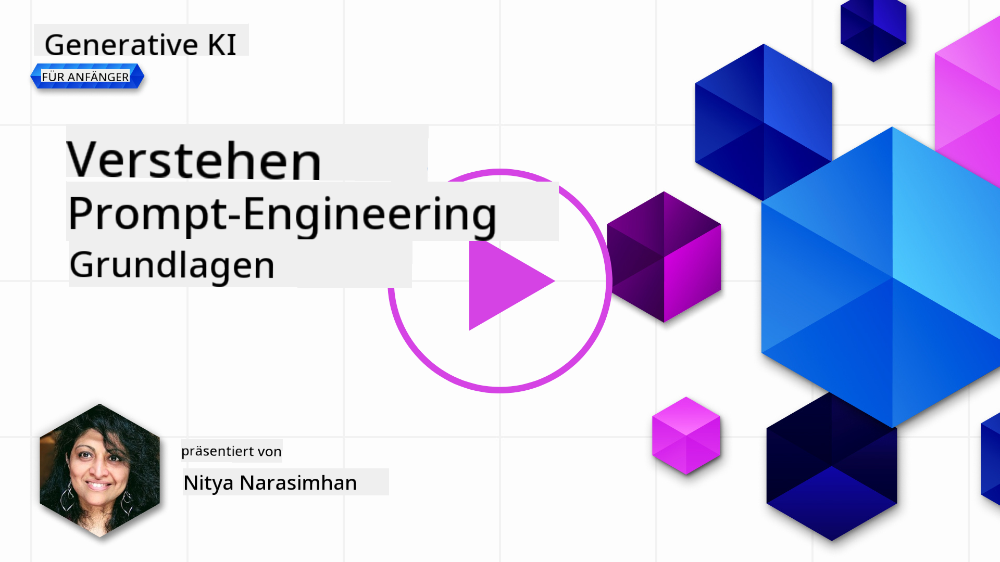
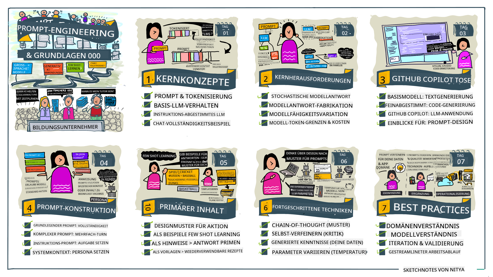
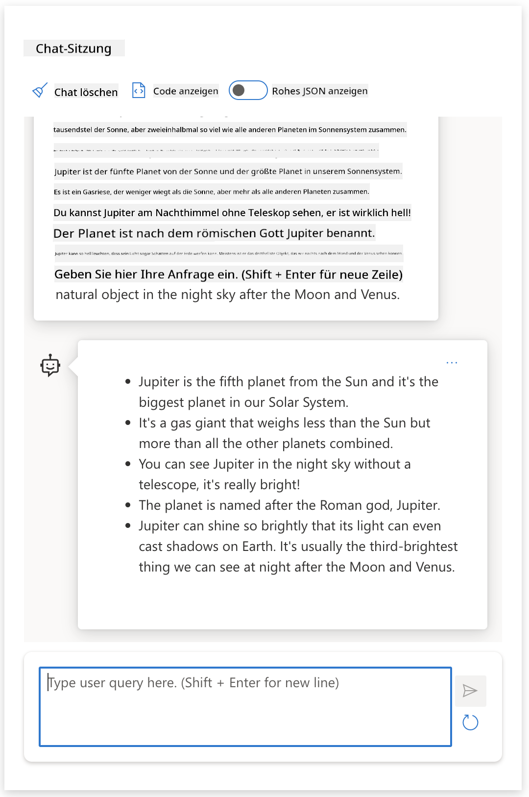
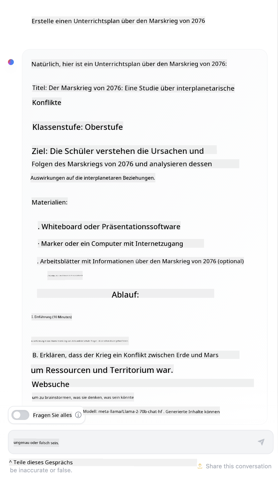

<!--
CO_OP_TRANSLATOR_METADATA:
{
  "original_hash": "a45c318dc6ebc2604f35b8b829f93af2",
  "translation_date": "2025-07-09T09:15:47+00:00",
  "source_file": "04-prompt-engineering-fundamentals/README.md",
  "language_code": "de"
}
-->
# Grundlagen des Prompt Engineerings

[](https://aka.ms/gen-ai-lesson4-gh?WT.mc_id=academic-105485-koreyst)

## Einführung  
Dieses Modul behandelt grundlegende Konzepte und Techniken zur Erstellung effektiver Prompts für generative KI-Modelle. Wie Sie Ihren Prompt an ein LLM formulieren, ist ebenfalls entscheidend. Ein sorgfältig gestalteter Prompt kann eine bessere Antwortqualität erzielen. Aber was genau bedeuten Begriffe wie _Prompt_ und _Prompt Engineering_? Und wie verbessere ich den Prompt-_Input_, den ich an das LLM sende? Diese Fragen wollen wir in diesem und im nächsten Kapitel beantworten.

_Generative KI_ ist in der Lage, neue Inhalte (z. B. Text, Bilder, Audio, Code usw.) als Antwort auf Benutzeranfragen zu erstellen. Dies geschieht mithilfe von _Large Language Models_ wie der GPT-Serie von OpenAI („Generative Pre-trained Transformer“), die für die Nutzung natürlicher Sprache und Code trainiert wurden.

Benutzer können jetzt mit diesen Modellen über vertraute Paradigmen wie Chat interagieren, ohne technische Vorkenntnisse oder Schulungen zu benötigen. Die Modelle sind _promptbasiert_ – Benutzer senden eine Texteingabe (Prompt) und erhalten die KI-Antwort (Completion) zurück. Sie können dann iterativ „mit der KI chatten“ in mehrstufigen Gesprächen und ihren Prompt so lange verfeinern, bis die Antwort ihren Erwartungen entspricht.

„Prompts“ werden somit zur primären _Programmierschnittstelle_ für generative KI-Anwendungen, die den Modellen sagen, was sie tun sollen, und die Qualität der zurückgegebenen Antworten beeinflussen. „Prompt Engineering“ ist ein schnell wachsendes Forschungsfeld, das sich auf das _Design und die Optimierung_ von Prompts konzentriert, um konsistente und qualitativ hochwertige Antworten in großem Maßstab zu liefern.

## Lernziele

In dieser Lektion lernen wir, was Prompt Engineering ist, warum es wichtig ist und wie wir effektivere Prompts für ein bestimmtes Modell und Anwendungsziel erstellen können. Wir verstehen die Kernkonzepte und bewährte Methoden des Prompt Engineerings – und lernen eine interaktive Jupyter-Notebook-„Sandbox“-Umgebung kennen, in der wir diese Konzepte an realen Beispielen anwenden können.

Am Ende dieser Lektion werden wir in der Lage sein:

1. Zu erklären, was Prompt Engineering ist und warum es wichtig ist.  
2. Die Bestandteile eines Prompts zu beschreiben und wie sie verwendet werden.  
3. Best Practices und Techniken des Prompt Engineerings zu erlernen.  
4. Gelernte Techniken an realen Beispielen anzuwenden, unter Verwendung eines OpenAI-Endpunkts.

## Schlüsselbegriffe

Prompt Engineering: Die Praxis, Eingaben so zu gestalten und zu verfeinern, dass KI-Modelle gewünschte Ausgaben erzeugen.  
Tokenisierung: Der Prozess, Text in kleinere Einheiten, sogenannte Tokens, umzuwandeln, die ein Modell verstehen und verarbeiten kann.  
Instruction-Tuned LLMs: Große Sprachmodelle (LLMs), die mit spezifischen Anweisungen feinabgestimmt wurden, um ihre Antwortgenauigkeit und Relevanz zu verbessern.

## Lern-Sandbox

Prompt Engineering ist derzeit eher Kunst als Wissenschaft. Der beste Weg, unsere Intuition dafür zu verbessern, ist es, _mehr zu üben_ und einen Trial-and-Error-Ansatz zu verfolgen, der Fachwissen aus dem Anwendungsbereich mit empfohlenen Techniken und modell-spezifischen Optimierungen kombiniert.

Das zu dieser Lektion gehörende Jupyter Notebook bietet eine _Sandbox_-Umgebung, in der Sie das Gelernte ausprobieren können – entweder direkt oder im Rahmen der Code-Herausforderung am Ende. Um die Übungen auszuführen, benötigen Sie:

1. **Einen Azure OpenAI API-Schlüssel** – den Service-Endpunkt für ein bereitgestelltes LLM.  
2. **Eine Python-Laufzeitumgebung** – in der das Notebook ausgeführt werden kann.  
3. **Lokale Umgebungsvariablen** – _schließen Sie jetzt die [SETUP](./../00-course-setup/SETUP.md?WT.mc_id=academic-105485-koreyst)-Schritte ab, um bereit zu sein_.

Das Notebook enthält _Starter_-Übungen – Sie sind jedoch eingeladen, eigene _Markdown_- (Beschreibungen) und _Code_- (Prompt-Anfragen) Abschnitte hinzuzufügen, um weitere Beispiele oder Ideen auszuprobieren und Ihre Intuition für das Prompt-Design zu stärken.

## Illustrierter Leitfaden

Möchten Sie einen Überblick über die Themen dieser Lektion erhalten, bevor Sie tiefer einsteigen? Schauen Sie sich diesen illustrierten Leitfaden an, der Ihnen die Hauptthemen und die wichtigsten Erkenntnisse für jedes Thema vermittelt. Die Roadmap der Lektion führt Sie vom Verständnis der Kernkonzepte und Herausforderungen bis hin zur Anwendung relevanter Techniken und Best Practices des Prompt Engineerings. Beachten Sie, dass der Abschnitt „Fortgeschrittene Techniken“ in diesem Leitfaden auf Inhalte verweist, die im _nächsten_ Kapitel dieses Curriculums behandelt werden.



## Unser Startup

Kommen wir nun dazu, wie _dieses Thema_ mit unserer Startup-Mission zusammenhängt, [KI-Innovationen in die Bildung zu bringen](https://educationblog.microsoft.com/2023/06/collaborating-to-bring-ai-innovation-to-education?WT.mc_id=academic-105485-koreyst). Wir wollen KI-gestützte Anwendungen für _personalisiertes Lernen_ entwickeln – also denken wir darüber nach, wie verschiedene Nutzer unserer Anwendung Prompts „gestalten“ könnten:

- **Administratoren** könnten die KI bitten, _Lehrpläne zu analysieren, um Lücken in der Abdeckung zu identifizieren_. Die KI kann Ergebnisse zusammenfassen oder sie mit Code visualisieren.  
- **Lehrkräfte** könnten die KI bitten, _einen Unterrichtsplan für eine Zielgruppe und ein Thema zu erstellen_. Die KI kann den personalisierten Plan in einem vorgegebenen Format erstellen.  
- **Schüler** könnten die KI bitten, _sie in einem schwierigen Fach zu unterrichten_. Die KI kann Schüler nun mit Lektionen, Hinweisen und Beispielen auf ihrem Niveau unterstützen.

Das ist nur die Spitze des Eisbergs. Schauen Sie sich [Prompts For Education](https://github.com/microsoft/prompts-for-edu/tree/main?WT.mc_id=academic-105485-koreyst) an – eine Open-Source-Prompt-Bibliothek, kuratiert von Bildungsexperten – um ein breiteres Spektrum der Möglichkeiten zu entdecken! _Probieren Sie einige dieser Prompts in der Sandbox oder im OpenAI Playground aus, um zu sehen, was passiert!_

<!--  
LESSON TEMPLATE:  
This unit should cover core concept #1.  
Reinforce the concept with examples and references.

CONCEPT #1:  
Prompt Engineering.  
Define it and explain why it is needed.  
-->

## Was ist Prompt Engineering?

Wir haben diese Lektion damit begonnen, **Prompt Engineering** als den Prozess des _Gestaltens und Optimierens_ von Texteingaben (Prompts) zu definieren, um konsistente und qualitativ hochwertige Antworten (Completions) für ein bestimmtes Anwendungsziel und Modell zu liefern. Man kann sich das als einen zweistufigen Prozess vorstellen:

- den initialen Prompt für ein bestimmtes Modell und Ziel _gestalten_  
- den Prompt iterativ _verfeinern_, um die Antwortqualität zu verbessern

Dies ist zwangsläufig ein Trial-and-Error-Prozess, der Benutzerintuition und Aufwand erfordert, um optimale Ergebnisse zu erzielen. Warum ist das wichtig? Um diese Frage zu beantworten, müssen wir zunächst drei Konzepte verstehen:

- _Tokenisierung_ = wie das Modell den Prompt „sieht“  
- _Basis-LLMs_ = wie das Grundmodell einen Prompt „verarbeitet“  
- _Instruction-Tuned LLMs_ = wie das Modell jetzt „Aufgaben“ erkennen kann

### Tokenisierung

Ein LLM sieht Prompts als _Sequenz von Tokens_, wobei verschiedene Modelle (oder Modellversionen) denselben Prompt unterschiedlich tokenisieren können. Da LLMs auf Tokens (und nicht auf rohem Text) trainiert werden, hat die Art der Tokenisierung direkten Einfluss auf die Qualität der generierten Antwort.

Um ein Gefühl dafür zu bekommen, wie Tokenisierung funktioniert, probieren Sie Tools wie den [OpenAI Tokenizer](https://platform.openai.com/tokenizer?WT.mc_id=academic-105485-koreyst) aus, der unten gezeigt wird. Kopieren Sie Ihren Prompt hinein und sehen Sie, wie dieser in Tokens umgewandelt wird, achten Sie darauf, wie Leerzeichen und Satzzeichen behandelt werden. Beachten Sie, dass dieses Beispiel ein älteres LLM (GPT-3) zeigt – bei neueren Modellen kann das Ergebnis anders ausfallen.


### Konzept: Foundation Models

Nachdem ein Prompt tokenisiert wurde, besteht die Hauptfunktion des ["Base LLM"](https://blog.gopenai.com/an-introduction-to-base-and-instruction-tuned-large-language-models-8de102c785a6?WT.mc_id=academic-105485-koreyst) (oder Foundation-Modells) darin, das nächste Token in der Sequenz vorherzusagen. Da LLMs auf riesigen Textdatensätzen trainiert sind, haben sie ein gutes Verständnis der statistischen Zusammenhänge zwischen Tokens und können diese Vorhersage mit gewisser Sicherheit treffen. Beachten Sie, dass sie die _Bedeutung_ der Wörter im Prompt oder Token nicht verstehen; sie erkennen lediglich ein Muster, das sie mit ihrer nächsten Vorhersage „vervollständigen“ können. Sie können die Sequenz so lange vorhersagen, bis die Vorhersage durch Benutzereingriff oder eine vorgegebene Bedingung beendet wird.

Möchten Sie sehen, wie promptbasierte Completion funktioniert? Geben Sie den obigen Prompt im Azure OpenAI Studio [_Chat Playground_](https://oai.azure.com/playground?WT.mc_id=academic-105485-koreyst) mit den Standardeinstellungen ein. Das System ist so konfiguriert, dass Prompts als Informationsanfragen behandelt werden – Sie sollten also eine Antwort erhalten, die diesem Kontext entspricht.

Aber was, wenn der Benutzer etwas Spezifisches sehen möchte, das bestimmte Kriterien oder ein Aufgaben-Ziel erfüllt? Hier kommen _instruction-tuned_ LLMs ins Spiel.


### Konzept: Instruction Tuned LLMs

Ein [Instruction Tuned LLM](https://blog.gopenai.com/an-introduction-to-base-and-instruction-tuned-large-language-models-8de102c785a6?WT.mc_id=academic-105485-koreyst) baut auf dem Foundation-Modell auf und wird mit Beispielen oder Eingabe-/Ausgabe-Paaren (z. B. mehrstufigen „Nachrichten“) feinabgestimmt, die klare Anweisungen enthalten können – und die Antwort der KI versucht, dieser Anweisung zu folgen.

Dabei kommen Techniken wie Reinforcement Learning mit menschlichem Feedback (RLHF) zum Einsatz, die das Modell darin trainieren, _Anweisungen zu befolgen_ und _aus Feedback zu lernen_, sodass es Antworten liefert, die besser für praktische Anwendungen geeignet und relevanter für die Ziele der Nutzer sind.

Probieren wir es aus – nehmen Sie den oben genannten Prompt und ändern Sie nun die _Systemnachricht_, um folgende Anweisung als Kontext zu geben:

> _Fasse den bereitgestellten Inhalt für eine Zweitklässlerin/einen Zweitklässler zusammen. Halte das Ergebnis in einem Absatz mit 3-5 Stichpunkten._

Sehen Sie, wie das Ergebnis nun auf das gewünschte Ziel und Format abgestimmt ist? Eine Lehrkraft kann diese Antwort direkt in ihren Folien für den Unterricht verwenden.



## Warum brauchen wir Prompt Engineering?

Jetzt, wo wir wissen, wie Prompts von LLMs verarbeitet werden, sprechen wir darüber, _warum_ wir Prompt Engineering brauchen. Die Antwort liegt darin, dass aktuelle LLMs eine Reihe von Herausforderungen mit sich bringen, die es erschweren, _zuverlässige und konsistente Completions_ zu erzielen, ohne Aufwand in die Konstruktion und Optimierung der Prompts zu stecken. Zum Beispiel:

1. **Modellantworten sind stochastisch.** Derselbe Prompt wird wahrscheinlich mit verschiedenen Modellen oder Modellversionen unterschiedliche Antworten erzeugen. Und er kann sogar mit _dem gleichen Modell_ zu unterschiedlichen Zeiten verschiedene Ergebnisse liefern. _Prompt Engineering-Techniken können helfen, diese Variationen zu minimieren, indem sie bessere Leitplanken setzen_.

2. **Modelle können Antworten erfinden.** Modelle sind mit _großen, aber begrenzten_ Datensätzen vortrainiert, was bedeutet, dass ihnen Wissen über Konzepte außerhalb dieses Trainings fehlt. Daher können sie Antworten erzeugen, die ungenau, erfunden oder direkt widersprüchlich zu bekannten Fakten sind. _Prompt Engineering-Techniken helfen Nutzern, solche Erfindungen zu erkennen und zu mindern, z. B. indem die KI nach Quellenangaben oder Begründungen gefragt wird_.

3. **Modelle unterscheiden sich in ihren Fähigkeiten.** Neuere Modelle oder Modellgenerationen verfügen über umfangreichere Fähigkeiten, bringen aber auch eigene Besonderheiten und Kompromisse bei Kosten und Komplexität mit sich. _Prompt Engineering kann uns helfen, Best Practices und Workflows zu entwickeln, die Unterschiede abstrahieren und sich modell-spezifischen Anforderungen skalierbar und nahtlos anpassen_.

Sehen wir uns das im OpenAI- oder Azure OpenAI Playground an:

- Verwenden Sie denselben Prompt mit verschiedenen LLM-Bereitstellungen (z. B. OpenAI, Azure OpenAI, Hugging Face) – haben Sie die Unterschiede bemerkt?  
- Verwenden Sie denselben Prompt mehrfach mit _dem gleichen_ LLM (z. B. Azure OpenAI Playground) – wie unterschieden sich diese Variationen?

### Beispiel für Erfindungen

In diesem Kurs verwenden wir den Begriff **„Fabrication“** (Erfindung), um das Phänomen zu beschreiben, dass LLMs manchmal faktisch falsche Informationen generieren, bedingt durch Einschränkungen im Training oder andere Faktoren. In populären Artikeln oder Forschungsarbeiten wird dies oft als _„Halluzinationen“_ bezeichnet. Wir empfehlen jedoch ausdrücklich, den Begriff _„Fabrication“_ zu verwenden, um eine unbeabsichtigte Vermenschlichung des Verhaltens zu vermeiden, indem man einer maschinengesteuerten Ausgabe menschliche Eigenschaften zuschreibt. Dies unterstützt auch die [Richtlinien für verantwortungsvolle KI](https://www.microsoft.com/ai/responsible-ai?WT.mc_id=academic-105485-koreyst) aus terminologischer Sicht, indem Begriffe vermieden werden, die in manchen Kontexten als anstößig oder nicht inklusiv gelten könnten.

Möchten Sie ein Gefühl dafür bekommen, wie Erfindungen entstehen? Denken Sie an einen Prompt, der die KI anweist, Inhalte zu einem nicht existierenden Thema zu generieren (um sicherzustellen, dass es nicht im Trainingsdatensatz enthalten ist). Zum Beispiel habe ich diesen Prompt ausprobiert:
# Unterrichtsplan: Der Marskrieg von 2076

## Zielsetzung
Die Schüler sollen ein Verständnis für die Ursachen, den Verlauf und die Folgen des Marskriegs von 2076 entwickeln. Außerdem sollen sie die Bedeutung dieses Konflikts für die Zukunft der Menschheit im Weltraum reflektieren.

## Dauer
2 Unterrichtsstunden (je 45 Minuten)

## Materialien
- Lehrbuchkapitel zum Marskrieg von 2076
- Karten und Diagramme des Marsgebiets
- Videos und Zeitzeugenberichte (sofern verfügbar)
- Arbeitsblätter mit Fragen und Aufgaben

## Ablauf

### Stunde 1

#### 1. Einführung (10 Minuten)
- Kurze Vorstellung des Themas: Was war der Marskrieg von 2076?
- Diskussion: Warum könnte es zu einem Krieg auf dem Mars gekommen sein?

#### 2. Ursachen des Kriegs (15 Minuten)
- Gemeinsames Erarbeiten der politischen, wirtschaftlichen und sozialen Hintergründe
- Analyse der Ressourcenknappheit und territorialen Streitigkeiten

#### 3. Verlauf des Kriegs (20 Minuten)
- Überblick über die wichtigsten Ereignisse und Schlachten
- Vorstellung der beteiligten Parteien und ihrer Strategien

### Stunde 2

#### 4. Folgen des Kriegs (15 Minuten)
- Auswirkungen auf die Marskolonien und die Erde
- Technologische und gesellschaftliche Veränderungen

#### 5. Diskussion und Reflexion (20 Minuten)
- Welche Lehren können aus dem Marskrieg gezogen werden?
- Wie könnte die Zukunft der Marsbesiedlung aussehen?

#### 6. Abschluss (10 Minuten)
- Zusammenfassung der wichtigsten Punkte
- Hausaufgabe: Kurzer Aufsatz über die Bedeutung des Marskriegs für die Menschheit

## Bewertung
- Mitarbeit in der Diskussion
- Qualität der Hausaufgabe
- Verständnis der Zusammenhänge in einem kurzen Test in der nächsten Stunde
Eine Websuche zeigte mir, dass es fiktive Berichte (z. B. Fernsehserien oder Bücher) über Marskriege gibt – aber keine aus dem Jahr 2076. Der gesunde Menschenverstand sagt uns auch, dass 2076 _in der Zukunft_ liegt und daher nicht mit einem realen Ereignis in Verbindung gebracht werden kann.

Was passiert also, wenn wir diese Eingabeaufforderung bei verschiedenen LLM-Anbietern ausführen?

> **Antwort 1**: OpenAI Playground (GPT-35)


> **Antwort 2**: Azure OpenAI Playground (GPT-35)


> **Antwort 3**: : Hugging Face Chat Playground (LLama-2)



Wie erwartet liefert jedes Modell (bzw. jede Modellversion) aufgrund stochastischen Verhaltens und unterschiedlicher Modellfähigkeiten leicht unterschiedliche Antworten. Zum Beispiel richtet sich ein Modell an ein Publikum der 8. Klasse, während das andere einen Schüler der Oberstufe annimmt. Aber alle drei Modelle erzeugten Antworten, die einen uninformierten Nutzer davon überzeugen könnten, dass das Ereignis real war.

Techniken des Prompt Engineerings wie _Metaprompting_ und _Temperature-Konfiguration_ können Modell-Fälschungen bis zu einem gewissen Grad reduzieren. Neue Prompt-Engineering-_Architekturen_ integrieren zudem nahtlos neue Werkzeuge und Techniken in den Prompt-Ablauf, um einige dieser Effekte zu mildern oder zu verringern.

## Fallstudie: GitHub Copilot

Schließen wir diesen Abschnitt ab, indem wir uns ansehen, wie Prompt Engineering in realen Lösungen eingesetzt wird, anhand einer Fallstudie: [GitHub Copilot](https://github.com/features/copilot?WT.mc_id=academic-105485-koreyst).

GitHub Copilot ist dein „KI-Paarprogrammierer“ – es wandelt Texteingaben in Code-Vervollständigungen um und ist in deine Entwicklungsumgebung (z. B. Visual Studio Code) integriert, um ein nahtloses Nutzererlebnis zu bieten. Wie in der untenstehenden Blogserie dokumentiert, basierte die erste Version auf dem OpenAI Codex-Modell – wobei die Entwickler schnell erkannten, dass das Modell feinjustiert und bessere Prompt-Engineering-Techniken entwickelt werden müssen, um die Codequalität zu verbessern. Im Juli stellten sie ein verbessertes KI-Modell vor, das über Codex hinausgeht, um noch schnellere Vorschläge zu liefern: [debuted an improved AI model that goes beyond Codex](https://github.blog/2023-07-28-smarter-more-efficient-coding-github-copilot-goes-beyond-codex-with-improved-ai-model/?WT.mc_id=academic-105485-koreyst).

Lies die Beiträge der Reihe nach, um ihre Lernreise nachzuvollziehen.

- **Mai 2023** | [GitHub Copilot wird besser darin, deinen Code zu verstehen](https://github.blog/2023-05-17-how-github-copilot-is-getting-better-at-understanding-your-code/?WT.mc_id=academic-105485-koreyst)
- **Mai 2023** | [Inside GitHub: Arbeit mit den LLMs hinter GitHub Copilot](https://github.blog/2023-05-17-inside-github-working-with-the-llms-behind-github-copilot/?WT.mc_id=academic-105485-koreyst)
- **Jun 2023** | [Wie man bessere Prompts für GitHub Copilot schreibt](https://github.blog/2023-06-20-how-to-write-better-prompts-for-github-copilot/?WT.mc_id=academic-105485-koreyst)
- **Jul 2023** | [GitHub Copilot geht mit verbessertem KI-Modell über Codex hinaus](https://github.blog/2023-07-28-smarter-more-efficient-coding-github-copilot-goes-beyond-codex-with-improved-ai-model/?WT.mc_id=academic-105485-koreyst)
- **Jul 2023** | [Ein Entwicklerleitfaden für Prompt Engineering und LLMs](https://github.blog/2023-07-17-prompt-engineering-guide-generative-ai-llms/?WT.mc_id=academic-105485-koreyst)
- **Sep 2023** | [Wie man eine Enterprise-LLM-App baut: Lektionen von GitHub Copilot](https://github.blog/2023-09-06-how-to-build-an-enterprise-llm-application-lessons-from-github-copilot/?WT.mc_id=academic-105485-koreyst)

Du kannst auch ihren [Engineering-Blog](https://github.blog/category/engineering/?WT.mc_id=academic-105485-koreyst) durchstöbern, um weitere Beiträge wie [diesen](https://github.blog/2023-09-27-how-i-used-github-copilot-chat-to-build-a-reactjs-gallery-prototype/?WT.mc_id=academic-105485-koreyst) zu finden, der zeigt, wie diese Modelle und Techniken _angewendet_ werden, um reale Anwendungen voranzutreiben.

---

<!--
LEKTIONSVORLAGE:
Diese Einheit sollte das Kernkonzept #2 abdecken.
Das Konzept mit Beispielen und Referenzen vertiefen.

KONZEPT #2:
Prompt Design.
Illustriert mit Beispielen.
-->

## Prompt-Konstruktion

Wir haben gesehen, warum Prompt Engineering wichtig ist – jetzt wollen wir verstehen, wie Prompts _aufgebaut_ werden, damit wir verschiedene Techniken für ein effektiveres Prompt-Design bewerten können.

### Einfacher Prompt

Beginnen wir mit dem einfachen Prompt: eine Texteingabe, die ohne weiteren Kontext an das Modell gesendet wird. Hier ein Beispiel – wenn wir die ersten Worte der US-Nationalhymne an die OpenAI [Completion API](https://platform.openai.com/docs/api-reference/completions?WT.mc_id=academic-105485-koreyst) senden, vervollständigt sie sofort die Antwort mit den nächsten Zeilen und zeigt so das grundlegende Vorhersageverhalten.

| Prompt (Eingabe)     | Vervollständigung (Ausgabe)                                                                                                                        |
| :------------------- | :------------------------------------------------------------------------------------------------------------------------------------------------- |
| Oh say can you see   | Es klingt, als würdest du die Liedtexte von „The Star-Spangled Banner“, der Nationalhymne der Vereinigten Staaten, beginnen. Der vollständige Text lautet ... |

### Komplexer Prompt

Fügen wir nun Kontext und Anweisungen zu diesem einfachen Prompt hinzu. Die [Chat Completion API](https://learn.microsoft.com/azure/ai-services/openai/how-to/chatgpt?WT.mc_id=academic-105485-koreyst) erlaubt es uns, einen komplexen Prompt als Sammlung von _Nachrichten_ zu erstellen mit:

- Eingabe-/Ausgabepaaren, die den _Nutzer_-Input und die _Assistent_-Antwort widerspiegeln.
- Systemnachricht, die den Kontext für das Verhalten oder die Persönlichkeit des Assistenten festlegt.

Die Anfrage sieht nun wie folgt aus, wobei die _Tokenisierung_ relevante Informationen aus Kontext und Gespräch effektiv erfasst. Das Ändern des Systemkontexts kann die Qualität der Vervollständigungen genauso stark beeinflussen wie die vom Nutzer gelieferten Eingaben.

```python
response = openai.chat.completions.create(
    model="gpt-3.5-turbo",
    messages=[
        {"role": "system", "content": "You are a helpful assistant."},
        {"role": "user", "content": "Who won the world series in 2020?"},
        {"role": "assistant", "content": "The Los Angeles Dodgers won the World Series in 2020."},
        {"role": "user", "content": "Where was it played?"}
    ]
)
```

### Instruktions-Prompt

In den obigen Beispielen war der Nutzer-Prompt eine einfache Textanfrage, die als Informationsanfrage interpretiert werden kann. Mit _Instruktions-Prompts_ können wir diesen Text nutzen, um eine Aufgabe genauer zu spezifizieren und der KI bessere Anweisungen zu geben. Hier ein Beispiel:

| Prompt (Eingabe)                                                                                                                                                                                                                         | Vervollständigung (Ausgabe)                                                                                                        | Instruktionstyp     |
| :------------------------------------------------------------------------------------------------------------------------------------------------------------------------------------------------------------------------------------- | :------------------------------------------------------------------------------------------------------------------------- | :------------------ |
| Schreibe eine Beschreibung des Bürgerkriegs                                                                                                                                                                                           | _gab einen einfachen Absatz zurück_                                                                                              | Einfach             |
| Schreibe eine Beschreibung des Bürgerkriegs. Nenne wichtige Daten und Ereignisse und beschreibe deren Bedeutung                                                                                                                      | _gab einen Absatz gefolgt von einer Liste wichtiger Ereignisdaten mit Beschreibungen zurück_                                   | Komplex             |
| Schreibe eine Beschreibung des Bürgerkriegs in 1 Absatz. Gib 3 Stichpunkte mit wichtigen Daten und deren Bedeutung. Gib 3 weitere Stichpunkte mit wichtigen historischen Persönlichkeiten und deren Beiträgen. Gib die Ausgabe als JSON-Datei zurück | _gibt ausführlichere Details in einem Textfeld zurück, formatiert als JSON, das du kopieren, einfügen und bei Bedarf validieren kannst_ | Komplex. Formatiert. |

## Primärer Inhalt

In den obigen Beispielen war der Prompt noch recht offen, sodass das LLM selbst entscheiden konnte, welcher Teil seines vortrainierten Datensatzes relevant ist. Beim Designmuster _primärer Inhalt_ wird der Eingabetext in zwei Teile geteilt:

- eine Anweisung (Aktion)
- relevanter Inhalt (der die Aktion beeinflusst)

Hier ein Beispiel, bei dem die Anweisung lautet: „Fasse das in 2 Sätzen zusammen“.

| Prompt (Eingabe)                                                                                                                                                                                                                                                                                                                                                                                                                                                                                                                                                                                                                                                                                      | Vervollständigung (Ausgabe)                                                                                                                                                                                                                                                                             |
| :-------------------------------------------------------------------------------------------------------------------------------------------------------------------------------------------------------------------------------------------------------------------------------------------------------------------------------------------------------------------------------------------------------------------------------------------------------------------------------------------------------------------------------------------------------------------------------------------------------------------------------------------------------------------------------------------------- | :---------------------------------------------------------------------------------------------------------------------------------------------------------------------------------------------------------------------------------------------------------------------------------------------- |
| Jupiter ist der fünfte Planet von der Sonne und der größte im Sonnensystem. Er ist ein Gasriese mit einer Masse von einem Tausendstel der Sonne, aber zweieinhalbmal so groß wie alle anderen Planeten im Sonnensystem zusammen. Jupiter ist eines der hellsten Objekte, die mit bloßem Auge am Nachthimmel sichtbar sind, und war schon den alten Zivilisationen vor der aufgezeichneten Geschichte bekannt. Er ist nach dem römischen Gott Jupiter benannt.[19] Von der Erde aus betrachtet kann Jupiter hell genug sein, dass sein reflektiertes Licht sichtbare Schatten wirft,[20] und ist im Durchschnitt das dritthellste natürliche Objekt am Nachthimmel nach Mond und Venus. <br/> **Fasse das in 2 kurzen Sätzen zusammen** | Jupiter, der fünfte Planet von der Sonne, ist der größte im Sonnensystem und bekannt als eines der hellsten Objekte am Nachthimmel. Benannt nach dem römischen Gott Jupiter, ist er ein Gasriese, dessen Masse zweieinhalbmal so groß ist wie die aller anderen Planeten im Sonnensystem zusammen. |

Der primäre Inhaltsabschnitt kann auf verschiedene Weise genutzt werden, um effektivere Anweisungen zu geben:

- **Beispiele** – statt dem Modell eine explizite Anweisung zu geben, zeige ihm Beispiele, was zu tun ist, und lass es das Muster ableiten.
- **Hinweise** – folge der Anweisung mit einem „Hinweis“, der die Vervollständigung vorbereitet und das Modell zu relevanteren Antworten lenkt.
- **Vorlagen** – das sind wiederholbare „Rezepte“ für Prompts mit Platzhaltern (Variablen), die mit Daten für spezifische Anwendungsfälle angepasst werden können.

Schauen wir uns diese in der Praxis an.

### Verwendung von Beispielen

Dies ist ein Ansatz, bei dem du den primären Inhalt nutzt, um dem Modell einige Beispiele der gewünschten Ausgabe für eine bestimmte Anweisung zu „füttern“ und es das Muster für die gewünschte Ausgabe ableiten lässt. Je nach Anzahl der Beispiele spricht man von Zero-Shot-, One-Shot- oder Few-Shot-Prompting.

Der Prompt besteht nun aus drei Komponenten:

- einer Aufgabenbeschreibung
- einigen Beispielen der gewünschten Ausgabe
- dem Beginn eines neuen Beispiels (das zur impliziten Aufgabenbeschreibung wird)

| Lernart      | Prompt (Eingabe)                                                                                                                                        | Vervollständigung (Ausgabe)         |
| :----------- | :---------------------------------------------------------------------------------------------------------------------------------------------------- | :--------------------------------- |
| Zero-Shot    | „The Sun is Shining“. Übersetze ins Spanische                                                                                                        | „El Sol está brillando“.            |
| One-Shot     | „The Sun is Shining“ => „El Sol está brillando“. <br> „It's a Cold and Windy Day“ =>                                                                 | „Es un día frío y ventoso“.         |
| Few-Shot     | Der Spieler lief die Bases => Baseball <br/> Der Spieler schlug ein Ass => Tennis <br/> Der Spieler schlug eine Sechs => Cricket <br/> Der Spieler machte einen Slam-Dunk => | Basketball                        |
|              |                                                                                                                                                       |                                   |

Beachte, dass wir beim Zero-Shot-Prompting eine explizite Anweisung („Übersetze ins Spanische“) geben mussten, die beim One-Shot-Prompting-Beispiel implizit abgeleitet wird. Das Few-Shot-Beispiel zeigt, wie mehr Beispiele dem Modell erlauben, genauere Schlüsse ohne zusätzliche Anweisungen zu ziehen.

### Prompt-Hinweise

Eine weitere Technik zur Nutzung des primären Inhalts ist, _Hinweise_ statt Beispiele zu geben. Dabei geben wir dem Modell einen Anstoß in die richtige Richtung, indem wir mit einem Ausschnitt beginnen, der das gewünschte Antwortformat widerspiegelt. Das Modell „nimmt den Hinweis auf“ und setzt in diesem Stil fort.

| Anzahl der Hinweise | Prompt (Eingabe)                                                                                                                                                                                                                                                                                                                                                                                                                                               | Vervollständigung (Ausgabe)                                                                                                                                                                                                                                                                                       |
| :------------------ | :----------------------------------------------------------------------------------------------------------------------------------------------------------------------------------------------------------------------------------------------------------------------------------------------------------------------------------------------------------------------------------------------------------------------------------------------------------- | :-------------------------------------------------------------------------------------------------------------------------------------------------------------------------------------------------------------------------------------------------------------------------------------------------------- |
| 0                   | Jupiter ist der fünfte Planet von der Sonne und der größte im Sonnensystem. Er ist ein Gasriese mit einer Masse von einem Tausendstel der Sonne, aber zweieinhalbmal so groß wie alle anderen Planeten im Sonnensystem zusammen. Jupiter ist eines der hellsten Objekte, die mit bloßem Auge am Nachthimmel sichtbar sind, und war schon den alten Zivilisationen vor der aufgezeichneten Geschichte bekannt.

**Zusammenfassung**                                       | Jupiter ist der größte Planet in unserem Sonnensystem und der fünfte von der Sonne aus gesehen. Er ist ein Gasriese mit einer Masse von 1/1000 der Sonnenmasse, aber schwerer als alle anderen Planeten zusammen. Alte Zivilisationen kennen Jupiter schon lange, und er ist leicht am Nachthimmel zu sehen. |
| 1              | Jupiter ist der fünfte Planet von der Sonne und der größte im Sonnensystem. Er ist ein Gasriese mit einer Masse von einem Tausendstel der Sonne, aber zweieinhalbmal so schwer wie alle anderen Planeten im Sonnensystem zusammen. Jupiter ist eines der hellsten Objekte, die mit bloßem Auge am Nachthimmel sichtbar sind, und war schon den alten Zivilisationen vor der schriftlichen Geschichte bekannt. <br/>**Zusammenfassung** <br/> Was wir gelernt haben, ist, dass Jupiter | der fünfte Planet von der Sonne und der größte im Sonnensystem ist. Er ist ein Gasriese mit einer Masse von einem Tausendstel der Sonne, aber zweieinhalbmal so schwer wie alle anderen Planeten zusammen. Er ist mit bloßem Auge leicht sichtbar und seit der Antike bekannt.                        |
| 2              | Jupiter ist der fünfte Planet von der Sonne und der größte im Sonnensystem. Er ist ein Gasriese mit einer Masse von einem Tausendstel der Sonne, aber zweieinhalbmal so schwer wie alle anderen Planeten im Sonnensystem zusammen. Jupiter ist eines der hellsten Objekte, die mit bloßem Auge am Nachthimmel sichtbar sind, und war schon den alten Zivilisationen vor der schriftlichen Geschichte bekannt. <br/>**Zusammenfassung** <br/> Die Top 3 Fakten, die wir gelernt haben:         | 1. Jupiter ist der fünfte Planet von der Sonne und der größte im Sonnensystem. <br/> 2. Er ist ein Gasriese mit einer Masse von einem Tausendstel der Sonne...<br/> 3. Jupiter ist seit der Antike mit bloßem Auge sichtbar ...                                                                       |
|                |                                                                                                                                                                                                                                                                                                                                                                                                                                                              |                                                                                                                                                                                                                                                                                                           |

### Prompt-Vorlagen

Eine Prompt-Vorlage ist ein _vordefiniertes Rezept für einen Prompt_, das gespeichert und bei Bedarf wiederverwendet werden kann, um konsistentere Nutzererfahrungen in großem Maßstab zu ermöglichen. In seiner einfachsten Form ist es einfach eine Sammlung von Prompt-Beispielen wie [dieses von OpenAI](https://platform.openai.com/examples?WT.mc_id=academic-105485-koreyst), das sowohl die interaktiven Prompt-Komponenten (Benutzer- und Systemnachrichten) als auch das API-gesteuerte Anfrageformat bereitstellt – zur Unterstützung der Wiederverwendung.

In einer komplexeren Form wie [dieses Beispiel von LangChain](https://python.langchain.com/docs/concepts/prompt_templates/?WT.mc_id=academic-105485-koreyst) enthält es _Platzhalter_, die mit Daten aus verschiedenen Quellen (Benutzereingaben, Systemkontext, externe Datenquellen usw.) ersetzt werden können, um einen Prompt dynamisch zu erzeugen. So können wir eine Bibliothek wiederverwendbarer Prompts erstellen, die **programmatisch** konsistente Nutzererfahrungen in großem Maßstab ermöglichen.

Der eigentliche Wert von Vorlagen liegt schließlich in der Möglichkeit, _Prompt-Bibliotheken_ für vertikale Anwendungsbereiche zu erstellen und zu veröffentlichen – wobei die Prompt-Vorlage nun _optimiert_ ist, um anwendungsspezifischen Kontext oder Beispiele widerzuspiegeln, die die Antworten für die Zielgruppe relevanter und genauer machen. Das [Prompts For Edu](https://github.com/microsoft/prompts-for-edu?WT.mc_id=academic-105485-koreyst) Repository ist ein hervorragendes Beispiel für diesen Ansatz, da es eine Sammlung von Prompts für den Bildungsbereich mit Schwerpunkt auf wichtigen Zielen wie Unterrichtsplanung, Lehrplanentwicklung, Schülerbetreuung usw. kuratiert.

## Unterstützende Inhalte

Wenn wir den Prompt-Aufbau als eine Anweisung (Aufgabe) und ein Ziel (primärer Inhalt) betrachten, dann ist _sekundärer Inhalt_ wie zusätzlicher Kontext, den wir bereitstellen, um die Ausgabe **auf irgendeine Weise zu beeinflussen**. Das können Einstellungsparameter, Formatierungsanweisungen, Themen-Taxonomien usw. sein, die dem Modell helfen, seine Antwort besser auf die gewünschten Nutzerziele oder Erwartungen abzustimmen.

Beispiel: Angenommen, wir haben einen Kurskatalog mit umfangreichen Metadaten (Name, Beschreibung, Niveau, Metadaten-Tags, Dozent usw.) zu allen verfügbaren Kursen im Lehrplan:

- Wir können eine Anweisung definieren, um den Kurskatalog für Herbst 2023 zusammenzufassen
- Wir können den primären Inhalt nutzen, um einige Beispiele für die gewünschte Ausgabe bereitzustellen
- Wir können den sekundären Inhalt verwenden, um die Top 5 „Tags“ von Interesse zu identifizieren.

Das Modell kann dann eine Zusammenfassung im Format der Beispiele liefern – aber wenn ein Ergebnis mehrere Tags hat, kann es die 5 im sekundären Inhalt identifizierten Tags priorisieren.

---

<!--
UNTERRICHTSVORLAGE:
Diese Einheit sollte das Kernkonzept #1 abdecken.
Das Konzept mit Beispielen und Verweisen vertiefen.

KONZEPT #3:
Techniken des Prompt Engineerings.
Was sind einige grundlegende Techniken des Prompt Engineerings?
Mit Übungen veranschaulichen.
-->

## Best Practices beim Prompting

Jetzt, wo wir wissen, wie Prompts _aufgebaut_ werden können, können wir darüber nachdenken, wie man sie _gestaltet_, um Best Practices zu berücksichtigen. Wir können das in zwei Teile gliedern – die richtige _Einstellung_ und die passenden _Techniken_.

### Einstellung zum Prompt Engineering

Prompt Engineering ist ein Prozess von Versuch und Irrtum, daher sollten drei grundlegende Leitlinien beachtet werden:

1. **Domänenverständnis ist entscheidend.** Die Genauigkeit und Relevanz der Antwort hängt von der _Domäne_ ab, in der die Anwendung oder der Nutzer tätig ist. Nutze deine Intuition und dein Fachwissen, um die **Techniken weiter anzupassen**. Definiere zum Beispiel _domänenspezifische Persönlichkeiten_ in deinen System-Prompts oder verwende _domänenspezifische Vorlagen_ in den Nutzer-Prompts. Stelle sekundäre Inhalte bereit, die domänenspezifische Kontexte widerspiegeln, oder nutze _domänenspezifische Hinweise und Beispiele_, um das Modell auf vertraute Nutzungsmuster zu lenken.

2. **Modellverständnis ist wichtig.** Wir wissen, dass Modelle von Natur aus stochastisch sind. Aber auch die Implementierungen können sich hinsichtlich des Trainingsdatensatzes (vortrainiertes Wissen), der bereitgestellten Fähigkeiten (z. B. über API oder SDK) und des optimierten Inhalts (z. B. Code vs. Bilder vs. Text) unterscheiden. Verstehe die Stärken und Grenzen des verwendeten Modells und nutze dieses Wissen, um _Aufgaben zu priorisieren_ oder _angepasste Vorlagen_ zu erstellen, die auf die Fähigkeiten des Modells optimiert sind.

3. **Iteration & Validierung sind entscheidend.** Modelle entwickeln sich schnell weiter, ebenso die Techniken des Prompt Engineerings. Als Fachexperte hast du möglicherweise weitere Kontexte oder Kriterien für _deine_ spezifische Anwendung, die für die breite Community nicht gelten. Nutze Tools und Techniken des Prompt Engineerings, um den Prompt-Aufbau „anzustoßen“, iteriere dann und validiere die Ergebnisse mit deiner eigenen Intuition und deinem Fachwissen. Dokumentiere deine Erkenntnisse und erstelle eine **Wissensbasis** (z. B. Prompt-Bibliotheken), die von anderen als neue Grundlage für schnellere Iterationen genutzt werden kann.

## Best Practices

Schauen wir uns nun gängige Best Practices an, die von [OpenAI](https://help.openai.com/en/articles/6654000-best-practices-for-prompt-engineering-with-openai-api?WT.mc_id=academic-105485-koreyst) und [Azure OpenAI](https://learn.microsoft.com/azure/ai-services/openai/concepts/prompt-engineering#best-practices?WT.mc_id=academic-105485-koreyst) empfohlen werden.

| Was                              | Warum                                                                                                                                                                                                                                               |
| :-------------------------------- | :------------------------------------------------------------------------------------------------------------------------------------------------------------------------------------------------------------------------------------------------ |
| Die neuesten Modelle evaluieren. | Neue Modellgenerationen bieten wahrscheinlich verbesserte Funktionen und Qualität – können aber auch höhere Kosten verursachen. Bewerte sie hinsichtlich ihres Nutzens und entscheide dann über eine Migration.                                                                                 |
| Anweisungen & Kontext trennen     | Prüfe, ob dein Modell/Anbieter _Begrenzer_ definiert, um Anweisungen, primäre und sekundäre Inhalte klarer zu unterscheiden. Das hilft Modellen, Token-Gewichte genauer zuzuordnen.                                                                 |
| Sei spezifisch und klar           | Gib mehr Details zum gewünschten Kontext, Ergebnis, Länge, Format, Stil usw. Das verbessert sowohl Qualität als auch Konsistenz der Antworten. Halte Rezepte in wiederverwendbaren Vorlagen fest.                                                  |
| Sei beschreibend, nutze Beispiele | Modelle reagieren oft besser auf eine „zeigen und erzählen“-Methode. Beginne mit einem `Zero-Shot`-Ansatz, bei dem du nur eine Anweisung gibst (ohne Beispiele), und verfeinere dann mit `Few-Shot`, indem du einige Beispiele für die gewünschte Ausgabe lieferst. Nutze Analogien. |
| Nutze Hinweise, um Antworten anzustoßen | Lenke das Modell auf ein gewünschtes Ergebnis, indem du ihm einige einleitende Wörter oder Phrasen gibst, die es als Ausgangspunkt für die Antwort verwenden kann.                                                                                 |
| Wiederhole dich                   | Manchmal muss man sich gegenüber dem Modell wiederholen. Gib Anweisungen vor und nach dem primären Inhalt, nutze eine Anweisung und einen Hinweis usw. Iteriere und validiere, was am besten funktioniert.                                         |
| Reihenfolge ist wichtig           | Die Reihenfolge, in der du Informationen präsentierst, kann die Ausgabe beeinflussen, auch bei Lernbeispielen, wegen des „Recency Bias“. Probiere verschiedene Optionen aus, um das beste Ergebnis zu finden.                                      |
| Gib dem Modell eine „Ausweichmöglichkeit“ | Gib dem Modell eine _Fallback_-Antwort, die es liefern kann, falls es die Aufgabe aus irgendeinem Grund nicht erfüllen kann. Das reduziert die Wahrscheinlichkeit, dass das Modell falsche oder erfundene Antworten generiert.                     |
|                                   |                                                                                                                                                                                                                                                   |

Wie bei jeder Best Practice gilt: _Deine Erfahrungen können je nach Modell, Aufgabe und Domäne variieren_. Nutze diese Empfehlungen als Ausgangspunkt und iteriere, um das für dich Beste zu finden. Überprüfe deinen Prompt-Engineering-Prozess regelmäßig neu, wenn neue Modelle und Tools verfügbar werden, mit Fokus auf Skalierbarkeit und Antwortqualität.

<!--
UNTERRICHTSVORLAGE:
Diese Einheit sollte eine Programmieraufgabe enthalten, falls zutreffend.

AUFGABE:
Link zu einem Jupyter Notebook mit nur den Code-Kommentaren in den Anweisungen (Codeabschnitte sind leer).

LÖSUNG:
Link zu einer Kopie dieses Notebooks mit ausgefüllten Prompts und ausgeführt, die ein Beispiel zeigt.
-->

## Aufgabe

Herzlichen Glückwunsch! Du hast das Ende der Lektion erreicht! Jetzt ist es Zeit, einige der Konzepte und Techniken mit echten Beispielen zu testen!

Für unsere Aufgabe verwenden wir ein Jupyter Notebook mit Übungen, die du interaktiv bearbeiten kannst. Du kannst das Notebook auch mit eigenen Markdown- und Code-Zellen erweitern, um Ideen und Techniken selbstständig zu erkunden.

### Zum Start, fork das Repository und dann

- (Empfohlen) Starte GitHub Codespaces
- (Alternativ) Klone das Repository auf dein lokales Gerät und nutze es mit Docker Desktop
- (Alternativ) Öffne das Notebook mit deiner bevorzugten Notebook-Laufzeitumgebung.

### Als Nächstes konfiguriere deine Umgebungsvariablen

- Kopiere die Datei `.env.copy` im Repository-Stammverzeichnis nach `.env` und fülle die Werte für `AZURE_OPENAI_API_KEY`, `AZURE_OPENAI_ENDPOINT` und `AZURE_OPENAI_DEPLOYMENT` aus. Kehre dann zum Abschnitt [Learning Sandbox](../../../04-prompt-engineering-fundamentals/04-prompt-engineering-fundamentals) zurück, um zu erfahren, wie es geht.

### Öffne dann das Jupyter Notebook

- Wähle den Laufzeit-Kernel aus. Wenn du Option 1 oder 2 nutzt, wähle einfach den standardmäßigen Python 3.10.x Kernel, der vom Dev-Container bereitgestellt wird.

Du bist bereit, die Übungen auszuführen. Beachte, dass es hier keine _richtigen oder falschen_ Antworten gibt – es geht darum, Optionen durch Ausprobieren zu erkunden und ein Gespür dafür zu entwickeln, was für ein bestimmtes Modell und eine bestimmte Anwendungsdomäne funktioniert.

_Aus diesem Grund gibt es in dieser Lektion keine Code-Lösungsabschnitte. Stattdessen enthält das Notebook Markdown-Zellen mit dem Titel „Meine Lösung:“, die ein Beispielergebnis zur Orientierung zeigen._

 <!--
UNTERRICHTSVORLAGE:
Fasse den Abschnitt mit einer Zusammenfassung und Ressourcen für selbstgesteuertes Lernen zusammen.
-->

## Wissenscheck

Welcher der folgenden Prompts entspricht guten Best Practices?

1. Zeig mir ein Bild von einem roten Auto  
2. Zeig mir ein Bild von einem roten Auto der Marke Volvo und Modell XC90, das an einer Klippe mit Sonnenuntergang geparkt ist  
3. Zeig mir ein Bild von einem roten Auto der Marke Volvo und Modell XC90

Antwort: 2, es ist der beste Prompt, da er Details zum „Was“ liefert und ins Detail geht (nicht irgendein Auto, sondern eine bestimmte Marke und Modell) und auch die Umgebung beschreibt. 3 ist der zweitbeste, da es ebenfalls viele Beschreibungen enthält.

## 🚀 Herausforderung

Versuche, die „Hinweis“-Technik mit dem Prompt zu nutzen: Vervollständige den Satz „Zeig mir ein Bild von einem roten Auto der Marke Volvo und “. Wie antwortet das Modell, und wie würdest du den Prompt verbessern?

## Großartige Arbeit! Setze dein Lernen fort

Möchtest du mehr über verschiedene Konzepte des Prompt Engineerings erfahren? Besuche die [Seite für weiterführendes Lernen](https://aka.ms/genai-collection?WT.mc_id=academic-105485-koreyst), um weitere großartige Ressourcen zu diesem Thema zu finden.

Gehe weiter zu Lektion 5, wo wir uns [fortgeschrittene Prompt-Techniken](../05-advanced-prompts/README.md?WT.mc_id=academic-105485-koreyst) ansehen!

**Haftungsausschluss**:  
Dieses Dokument wurde mit dem KI-Übersetzungsdienst [Co-op Translator](https://github.com/Azure/co-op-translator) übersetzt. Obwohl wir uns um Genauigkeit bemühen, beachten Sie bitte, dass automatisierte Übersetzungen Fehler oder Ungenauigkeiten enthalten können. Das Originaldokument in seiner Ursprungssprache gilt als maßgebliche Quelle. Für wichtige Informationen wird eine professionelle menschliche Übersetzung empfohlen. Wir übernehmen keine Haftung für Missverständnisse oder Fehlinterpretationen, die aus der Nutzung dieser Übersetzung entstehen.