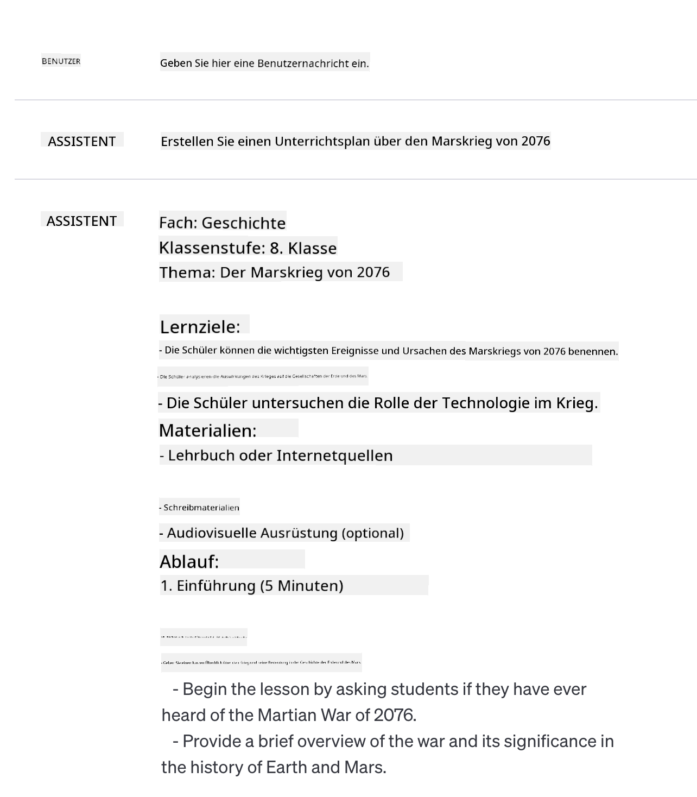
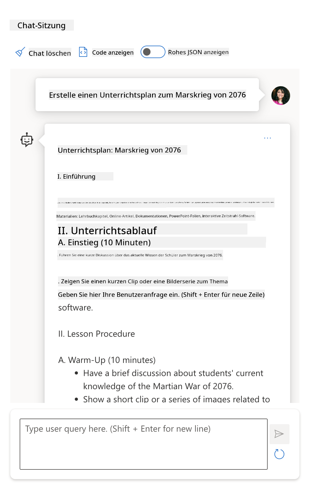

<!--
CO_OP_TRANSLATOR_METADATA:
{
  "original_hash": "8b3cb38518cf4fe7714d2f5e74dfa3eb",
  "translation_date": "2025-10-03T08:11:56+00:00",
  "source_file": "04-prompt-engineering-fundamentals/README.md",
  "language_code": "de"
}
-->
# Grundlagen des Prompt Engineering

[](https://aka.ms/gen-ai-lesson4-gh?WT.mc_id=academic-105485-koreyst)

## Einführung
Dieses Modul behandelt grundlegende Konzepte und Techniken zur Erstellung effektiver Prompts für generative KI-Modelle. Die Art und Weise, wie Sie Ihren Prompt an ein LLM schreiben, ist entscheidend. Ein sorgfältig gestalteter Prompt kann die Qualität der Antwort erheblich verbessern. Aber was genau bedeuten Begriffe wie _Prompt_ und _Prompt Engineering_? Und wie kann ich den _Eingabe_-Prompt, den ich an das LLM sende, verbessern? Diese Fragen werden wir in diesem Kapitel und im nächsten beantworten.

_Generative KI_ ist in der Lage, neue Inhalte (z. B. Texte, Bilder, Audio, Code usw.) als Antwort auf Benutzeranfragen zu erstellen. Dies wird durch _Large Language Models_ wie die GPT-Serie ("Generative Pre-trained Transformer") von OpenAI ermöglicht, die für die Verarbeitung natürlicher Sprache und Code trainiert wurden.

Benutzer können jetzt mit diesen Modellen über vertraute Paradigmen wie Chat interagieren, ohne technische Vorkenntnisse oder Schulungen zu benötigen. Die Modelle sind _promptbasiert_ – Benutzer senden eine Texteingabe (Prompt) und erhalten eine KI-Antwort (Completion). Sie können dann iterativ mit der KI "chatten", in mehrstufigen Gesprächen ihren Prompt verfeinern, bis die Antwort ihren Erwartungen entspricht.

"Prompts" werden somit zur primären _Programmierschnittstelle_ für generative KI-Anwendungen, die den Modellen mitteilen, was zu tun ist, und die Qualität der zurückgegebenen Antworten beeinflussen. "Prompt Engineering" ist ein schnell wachsendes Forschungsfeld, das sich auf die _Gestaltung und Optimierung_ von Prompts konzentriert, um konsistente und qualitativ hochwertige Antworten in großem Maßstab zu liefern.

## Lernziele

In dieser Lektion lernen wir, was Prompt Engineering ist, warum es wichtig ist und wie wir effektivere Prompts für ein bestimmtes Modell und ein bestimmtes Anwendungsziel erstellen können. Wir werden grundlegende Konzepte und Best Practices für das Prompt Engineering verstehen – und erfahren von einer interaktiven Jupyter-Notebook-Umgebung, in der wir diese Konzepte anhand realer Beispiele anwenden können.

Am Ende dieser Lektion werden wir in der Lage sein:

1. Zu erklären, was Prompt Engineering ist und warum es wichtig ist.
2. Die Bestandteile eines Prompts zu beschreiben und wie sie verwendet werden.
3. Best Practices und Techniken für das Prompt Engineering zu erlernen.
4. Gelernte Techniken auf reale Beispiele anzuwenden, unter Verwendung eines OpenAI-Endpunkts.

## Schlüsselbegriffe

Prompt Engineering: Die Praxis, Eingaben so zu gestalten und zu verfeinern, dass KI-Modelle gewünschte Ausgaben erzeugen.
Tokenisierung: Der Prozess, Text in kleinere Einheiten, sogenannte Tokens, umzuwandeln, die ein Modell verstehen und verarbeiten kann.
Instruction-Tuned LLMs: Große Sprachmodelle (LLMs), die mit spezifischen Anweisungen feinabgestimmt wurden, um die Genauigkeit und Relevanz ihrer Antworten zu verbessern.

## Lernumgebung

Prompt Engineering ist derzeit mehr Kunst als Wissenschaft. Der beste Weg, unser Gespür dafür zu verbessern, ist _mehr Übung_ und ein Trial-and-Error-Ansatz, der Fachwissen aus dem Anwendungsbereich mit empfohlenen Techniken und modellbezogenen Optimierungen kombiniert.

Das Jupyter-Notebook, das diese Lektion begleitet, bietet eine _Sandbox_-Umgebung, in der Sie das Gelernte ausprobieren können – entweder während der Lektion oder im Rahmen der Code-Challenge am Ende. Um die Übungen auszuführen, benötigen Sie:

1. **Einen Azure OpenAI API-Schlüssel** – den Service-Endpunkt für ein bereitgestelltes LLM.
2. **Eine Python-Laufzeitumgebung** – in der das Notebook ausgeführt werden kann.
3. **Lokale Umgebungsvariablen** – _führen Sie die [EINRICHTUNG](./../00-course-setup/02-setup-local.md?WT.mc_id=academic-105485-koreyst) jetzt durch, um sich vorzubereiten_.

Das Notebook enthält _Starter_-Übungen – Sie werden jedoch ermutigt, Ihre eigenen _Markdown_- (Beschreibung) und _Code_- (Prompt-Anfragen) Abschnitte hinzuzufügen, um weitere Beispiele oder Ideen auszuprobieren – und Ihr Gespür für die Gestaltung von Prompts zu entwickeln.

## Illustrierter Leitfaden

Möchten Sie sich einen Überblick über die Inhalte dieser Lektion verschaffen, bevor Sie eintauchen? Schauen Sie sich diesen illustrierten Leitfaden an, der Ihnen die Hauptthemen und die wichtigsten Erkenntnisse vermittelt, die Sie in jedem Abschnitt berücksichtigen sollten. Der Lehrplan führt Sie von der Einführung in die grundlegenden Konzepte und Herausforderungen bis hin zu deren Bewältigung mit relevanten Techniken und Best Practices des Prompt Engineering. Beachten Sie, dass der Abschnitt "Fortgeschrittene Techniken" in diesem Leitfaden Inhalte behandelt, die im _nächsten_ Kapitel dieses Lehrplans behandelt werden.


## Unser Startup

Nun wollen wir darüber sprechen, wie _dieses Thema_ mit unserer Startup-Mission zusammenhängt, [KI-Innovationen in die Bildung zu bringen](https://educationblog.microsoft.com/2023/06/collaborating-to-bring-ai-innovation-to-education?WT.mc_id=academic-105485-koreyst). Wir möchten KI-gestützte Anwendungen für _personalisiertes Lernen_ entwickeln – denken wir also darüber nach, wie verschiedene Benutzer unserer Anwendung "Prompts" gestalten könnten:

- **Administratoren** könnten die KI bitten, _Lehrplandaten zu analysieren, um Lücken in der Abdeckung zu identifizieren_. Die KI kann Ergebnisse zusammenfassen oder sie mit Code visualisieren.
- **Lehrkräfte** könnten die KI bitten, _einen Unterrichtsplan für eine Zielgruppe und ein Thema zu erstellen_. Die KI kann den personalisierten Plan in einem bestimmten Format erstellen.
- **Schüler** könnten die KI bitten, _sie in einem schwierigen Fach zu unterrichten_. Die KI kann Schüler nun mit Lektionen, Hinweisen und Beispielen unterstützen, die auf ihr Niveau zugeschnitten sind.

Das ist nur die Spitze des Eisbergs. Schauen Sie sich [Prompts For Education](https://github.com/microsoft/prompts-for-edu/tree/main?WT.mc_id=academic-105485-koreyst) an – eine Open-Source-Bibliothek mit Prompts, die von Bildungsexperten kuratiert wurde – um ein breiteres Verständnis der Möglichkeiten zu bekommen! _Probieren Sie einige dieser Prompts in der Sandbox oder im OpenAI Playground aus, um zu sehen, was passiert!_

<!--
LEKTIONSVORLAGE:
Diese Einheit sollte das Kernkonzept #1 abdecken.
Verstärken Sie das Konzept mit Beispielen und Referenzen.

KONZEPT #1:
Prompt Engineering.
Definieren Sie es und erklären Sie, warum es benötigt wird.
-->

## Was ist Prompt Engineering?

Wir haben diese Lektion begonnen, indem wir **Prompt Engineering** als den Prozess definiert haben, _Texteingaben (Prompts) zu gestalten und zu optimieren_, um konsistente und qualitativ hochwertige Antworten (Completions) für ein bestimmtes Anwendungsziel und Modell zu liefern. Wir können dies als einen zweistufigen Prozess betrachten:

- _Gestaltung_ des initialen Prompts für ein bestimmtes Modell und Ziel
- _Verfeinerung_ des Prompts in Iterationen, um die Qualität der Antwort zu verbessern

Dies ist notwendigerweise ein Trial-and-Error-Prozess, der Benutzerintuition und Aufwand erfordert, um optimale Ergebnisse zu erzielen. Warum ist das wichtig? Um diese Frage zu beantworten, müssen wir zunächst drei Konzepte verstehen:

- _Tokenisierung_ = wie das Modell den Prompt "sieht"
- _Basis-LLMs_ = wie das Grundmodell einen Prompt "verarbeitet"
- _Instruction-Tuned LLMs_ = wie das Modell jetzt "Aufgaben" sehen kann

### Tokenisierung

Ein LLM sieht Prompts als eine _Sequenz von Tokens_, wobei verschiedene Modelle (oder Versionen eines Modells) denselben Prompt unterschiedlich tokenisieren können. Da LLMs auf Tokens (und nicht auf Rohtext) trainiert werden, hat die Art und Weise, wie Prompts tokenisiert werden, direkten Einfluss auf die Qualität der generierten Antwort.

Um ein Gespür dafür zu bekommen, wie Tokenisierung funktioniert, probieren Sie Tools wie den [OpenAI Tokenizer](https://platform.openai.com/tokenizer?WT.mc_id=academic-105485-koreyst) aus, der unten gezeigt wird. Kopieren Sie Ihren Prompt hinein – und sehen Sie, wie dieser in Tokens umgewandelt wird, wobei Sie darauf achten, wie Leerzeichen und Satzzeichen behandelt werden. Beachten Sie, dass dieses Beispiel ein älteres LLM (GPT-3) zeigt – das Ausprobieren mit einem neueren Modell könnte ein anderes Ergebnis liefern.


### Konzept: Grundmodelle

Sobald ein Prompt tokenisiert ist, besteht die Hauptfunktion des ["Basis-LLM"](https://blog.gopenai.com/an-introduction-to-base-and-instruction-tuned-large-language-models-8de102c785a6?WT.mc_id=academic-105485-koreyst) (oder Grundmodells) darin, das nächste Token in dieser Sequenz vorherzusagen. Da LLMs auf riesigen Textdatensätzen trainiert werden, haben sie ein gutes Verständnis für die statistischen Beziehungen zwischen Tokens und können diese Vorhersage mit einer gewissen Sicherheit treffen. Beachten Sie, dass sie die _Bedeutung_ der Wörter im Prompt oder Token nicht verstehen; sie sehen lediglich ein Muster, das sie mit ihrer nächsten Vorhersage "vervollständigen" können. Sie können die Sequenz weiter vorhersagen, bis sie durch Benutzereingriff oder eine vorab festgelegte Bedingung beendet wird.

Möchten Sie sehen, wie promptbasierte Completion funktioniert? Geben Sie den obigen Prompt in das Azure OpenAI Studio [_Chat Playground_](https://oai.azure.com/playground?WT.mc_id=academic-105485-koreyst) mit den Standardeinstellungen ein. Das System ist so konfiguriert, dass Prompts als Informationsanfragen behandelt werden – Sie sollten also eine Completion sehen, die diesen Kontext erfüllt.

Aber was, wenn der Benutzer etwas Spezifisches sehen möchte, das bestimmte Kriterien oder ein Aufgaben-Ziel erfüllt? Hier kommen _instruction-tuned_ LLMs ins Spiel.


### Konzept: Instruction-Tuned LLMs

Ein [Instruction-Tuned LLM](https://blog.gopenai.com/an-introduction-to-base-and-instruction-tuned-large-language-models-8de102c785a6?WT.mc_id=academic-105485-koreyst) beginnt mit dem Grundmodell und wird mit Beispielen oder Eingabe-/Ausgabe-Paaren (z. B. mehrstufigen "Nachrichten") feinabgestimmt, die klare Anweisungen enthalten können – und die Antwort der KI versucht, diese Anweisung zu befolgen.

Dies nutzt Techniken wie Reinforcement Learning mit menschlichem Feedback (RLHF), die das Modell trainieren können, _Anweisungen zu folgen_ und _aus Feedback zu lernen_, sodass es Antworten liefert, die besser für praktische Anwendungen geeignet und relevanter für Benutzerziele sind.

Probieren wir es aus – gehen Sie zurück zum obigen Prompt, ändern Sie jedoch jetzt die _Systemnachricht_, um die folgende Anweisung als Kontext bereitzustellen:

> _Fassen Sie Inhalte, die Ihnen bereitgestellt werden, für einen Zweitklässler zusammen. Halten Sie das Ergebnis in einem Absatz mit 3-5 Aufzählungspunkten._

Sehen Sie, wie das Ergebnis jetzt auf das gewünschte Ziel und Format abgestimmt ist? Ein Lehrer kann diese Antwort nun direkt in seinen Folien für diese Klasse verwenden.


## Warum brauchen wir Prompt Engineering?

Jetzt, da wir wissen, wie Prompts von LLMs verarbeitet werden, sprechen wir darüber, _warum_ wir Prompt Engineering benötigen. Die Antwort liegt in der Tatsache, dass aktuelle LLMs eine Reihe von Herausforderungen darstellen, die es schwieriger machen, _zuverlässige und konsistente Completions_ zu erzielen, ohne Aufwand in die Gestaltung und Optimierung von Prompts zu investieren. Zum Beispiel:

1. **Modellantworten sind stochastisch.** Der _gleiche Prompt_ wird wahrscheinlich unterschiedliche Antworten mit verschiedenen Modellen oder Modellversionen erzeugen. Und er kann sogar mit demselben Modell zu unterschiedlichen Zeiten unterschiedliche Ergebnisse liefern. _Prompt Engineering-Techniken können uns helfen, diese Variationen zu minimieren, indem sie bessere Leitplanken bieten_.

1. **Modelle können Antworten erfinden.** Modelle sind mit _großen, aber endlichen_ Datensätzen vortrainiert, was bedeutet, dass sie kein Wissen über Konzepte außerhalb dieses Trainingsumfangs haben. Infolgedessen können sie Completions erzeugen, die ungenau, erfunden oder direkt widersprüchlich zu bekannten Fakten sind. _Prompt Engineering-Techniken helfen Benutzern, solche Erfindungen zu identifizieren und zu mindern, z. B. indem sie die KI um Zitate oder Begründungen bitten_.

1. **Modellfähigkeiten variieren.** Neuere Modelle oder Modellgenerationen haben umfangreichere Fähigkeiten, bringen aber auch einzigartige Eigenheiten und Kompromisse in Bezug auf Kosten und Komplexität mit sich. _Prompt Engineering kann uns helfen, Best Practices und Workflows zu entwickeln, die Unterschiede abstrahieren und sich nahtlos an modellbezogene Anforderungen anpassen_.

Sehen wir uns dies in Aktion im OpenAI- oder Azure OpenAI-Playground an:

- Verwenden Sie denselben Prompt mit verschiedenen LLM-Bereitstellungen (z. B. OpenAI, Azure OpenAI, Hugging Face) – haben Sie die Variationen bemerkt?
- Verwenden Sie denselben Prompt wiederholt mit derselben LLM-Bereitstellung (z. B. Azure OpenAI-Playground) – wie unterschieden sich diese Variationen?

### Beispiel für Erfindungen

In diesem Kurs verwenden wir den Begriff **"Erfindung"**, um das Phänomen zu beschreiben, bei dem LLMs manchmal faktisch falsche Informationen generieren, aufgrund von Einschränkungen in ihrem Training oder anderen Beschränkungen. Sie haben dies möglicherweise auch als _"Halluzinationen"_ in populären Artikeln oder Forschungspapieren gehört. Wir empfehlen jedoch dringend, den Begriff _"Erfindung"_ zu verwenden, um das Verhalten nicht zu vermenschlichen, indem wir ihm eine menschliche Eigenschaft zuschreiben. Dies stärkt auch die [Richtlinien für verantwortungsvolle KI](https://www.microsoft.com/ai/responsible-ai?WT.mc_id=academic-105485-koreyst) aus terminologischer Sicht, indem Begriffe entfernt werden, die in einigen Kontexten als beleidigend oder nicht inklusiv angesehen werden könnten.

Möchten Sie ein Gefühl dafür bekommen, wie Erfindungen funktionieren? Denken Sie an einen Prompt, der die KI anweist, Inhalte zu einem nicht existierenden Thema zu generieren (um sicherzustellen, dass es nicht im Trainingsdatensatz enthalten ist). Zum Beispiel habe ich diesen Prompt ausprobiert:

> **Prompt:** Erstellen Sie einen Unterrichtsplan über den Marskrieg von 2076.
Eine Websuche zeigte, dass es fiktive Darstellungen (z. B. Fernsehserien oder Bücher) über Kriege auf dem Mars gab – jedoch keine im Jahr 2076. Der gesunde Menschenverstand sagt uns außerdem, dass 2076 _in der Zukunft_ liegt und daher nicht mit einem realen Ereignis in Verbindung gebracht werden kann.

Was passiert also, wenn wir diesen Prompt mit verschiedenen LLM-Anbietern testen?

> **Antwort 1**: OpenAI Playground (GPT-35)



> **Antwort 2**: Azure OpenAI Playground (GPT-35)



> **Antwort 3**: Hugging Face Chat Playground (LLama-2)


Wie erwartet, erzeugt jedes Modell (oder jede Modellversion) leicht unterschiedliche Antworten, was auf stochastisches Verhalten und Unterschiede in den Modellfähigkeiten zurückzuführen ist. Beispielsweise richtet sich ein Modell an ein Publikum der 8. Klasse, während ein anderes von Schülern der Oberstufe ausgeht. Aber alle drei Modelle generierten Antworten, die einen uninformierten Nutzer davon überzeugen könnten, dass das Ereignis real ist.

Techniken des Prompt-Engineerings wie _Metaprompting_ und _Temperaturkonfiguration_ können Modellfälschungen bis zu einem gewissen Grad reduzieren. Neue Architekturen des Prompt-Engineerings integrieren auch nahtlos neue Werkzeuge und Techniken in den Prompt-Fluss, um einige dieser Effekte zu mindern oder zu reduzieren.

## Fallstudie: GitHub Copilot

Lassen Sie uns diesen Abschnitt abschließen, indem wir uns ansehen, wie Prompt-Engineering in realen Lösungen eingesetzt wird, und zwar anhand einer Fallstudie: [GitHub Copilot](https://github.com/features/copilot?WT.mc_id=academic-105485-koreyst).

GitHub Copilot ist Ihr "KI-Paarprogrammierer" – er wandelt Text-Prompts in Code-Vervollständigungen um und ist in Ihre Entwicklungsumgebung (z. B. Visual Studio Code) integriert, um ein nahtloses Benutzererlebnis zu bieten. Wie in der unten stehenden Blog-Serie dokumentiert, basierte die früheste Version auf dem OpenAI Codex-Modell – wobei die Ingenieure schnell erkannten, dass das Modell feinabgestimmt und bessere Prompt-Engineering-Techniken entwickelt werden mussten, um die Codequalität zu verbessern. Im Juli [stellten sie ein verbessertes KI-Modell vor, das über Codex hinausgeht](https://github.blog/2023-07-28-smarter-more-efficient-coding-github-copilot-goes-beyond-codex-with-improved-ai-model/?WT.mc_id=academic-105485-koreyst) und noch schnellere Vorschläge liefert.

Lesen Sie die Beiträge in der Reihenfolge, um ihre Lernreise zu verfolgen.

- **Mai 2023** | [GitHub Copilot wird besser darin, Ihren Code zu verstehen](https://github.blog/2023-05-17-how-github-copilot-is-getting-better-at-understanding-your-code/?WT.mc_id=academic-105485-koreyst)
- **Mai 2023** | [Inside GitHub: Zusammenarbeit mit den LLMs hinter GitHub Copilot](https://github.blog/2023-05-17-inside-github-working-with-the-llms-behind-github-copilot/?WT.mc_id=academic-105485-koreyst).
- **Juni 2023** | [Wie man bessere Prompts für GitHub Copilot schreibt](https://github.blog/2023-06-20-how-to-write-better-prompts-for-github-copilot/?WT.mc_id=academic-105485-koreyst).
- **Juli 2023** | [.. GitHub Copilot geht über Codex hinaus mit verbessertem KI-Modell](https://github.blog/2023-07-28-smarter-more-efficient-coding-github-copilot-goes-beyond-codex-with-improved-ai-model/?WT.mc_id=academic-105485-koreyst)
- **Juli 2023** | [Ein Leitfaden für Entwickler zu Prompt-Engineering und LLMs](https://github.blog/2023-07-17-prompt-engineering-guide-generative-ai-llms/?WT.mc_id=academic-105485-koreyst)
- **September 2023** | [Wie man eine Unternehmens-LLM-App erstellt: Lektionen von GitHub Copilot](https://github.blog/2023-09-06-how-to-build-an-enterprise-llm-application-lessons-from-github-copilot/?WT.mc_id=academic-105485-koreyst)

Sie können auch ihren [Engineering-Blog](https://github.blog/category/engineering/?WT.mc_id=academic-105485-koreyst) für weitere Beiträge wie [diesen hier](https://github.blog/2023-09-27-how-i-used-github-copilot-chat-to-build-a-reactjs-gallery-prototype/?WT.mc_id=academic-105485-koreyst) durchsuchen, der zeigt, wie diese Modelle und Techniken _angewendet_ werden, um reale Anwendungen voranzutreiben.

---

## Prompt-Konstruktion

Wir haben gesehen, warum Prompt-Engineering wichtig ist – jetzt wollen wir verstehen, wie Prompts _konstruiert_ werden, damit wir verschiedene Techniken für ein effektiveres Prompt-Design bewerten können.

### Basis-Prompt

Beginnen wir mit dem Basis-Prompt: einer Texteingabe, die ohne weiteren Kontext an das Modell gesendet wird. Hier ist ein Beispiel – wenn wir die ersten Wörter der US-amerikanischen Nationalhymne an die OpenAI [Completion API](https://platform.openai.com/docs/api-reference/completions?WT.mc_id=academic-105485-koreyst) senden, vervollständigt sie die Antwort sofort mit den nächsten Zeilen, was das grundlegende Vorhersageverhalten veranschaulicht.

| Prompt (Eingabe)     | Completion (Ausgabe)                                                                                                                        |
| :------------------- | :----------------------------------------------------------------------------------------------------------------------------------------- |
| Oh say can you see   | Es klingt, als würden Sie die ersten Zeilen von "The Star-Spangled Banner", der Nationalhymne der Vereinigten Staaten, zitieren. Der vollständige Text lautet ... |

### Komplexer Prompt

Nun fügen wir Kontext und Anweisungen zu diesem Basis-Prompt hinzu. Die [Chat Completion API](https://learn.microsoft.com/azure/ai-services/openai/how-to/chatgpt?WT.mc_id=academic-105485-koreyst) ermöglicht es uns, einen komplexen Prompt als Sammlung von _Nachrichten_ zu erstellen mit:

- Eingabe-/Ausgabe-Paaren, die die _Benutzereingabe_ und die _Antwort des Assistenten_ widerspiegeln.
- Systemnachrichten, die den Kontext für das Verhalten oder die Persönlichkeit des Assistenten festlegen.

Die Anfrage hat nun die folgende Form, wobei die _Tokenisierung_ relevante Informationen aus Kontext und Konversation effektiv erfasst. Das Ändern des Systemkontexts kann genauso wirkungsvoll für die Qualität der Vervollständigungen sein wie die bereitgestellten Benutzereingaben.

```python
response = openai.chat.completions.create(
    model="gpt-3.5-turbo",
    messages=[
        {"role": "system", "content": "You are a helpful assistant."},
        {"role": "user", "content": "Who won the world series in 2020?"},
        {"role": "assistant", "content": "The Los Angeles Dodgers won the World Series in 2020."},
        {"role": "user", "content": "Where was it played?"}
    ]
)
```


### Anweisungs-Prompt

In den obigen Beispielen war der Benutzer-Prompt eine einfache Textanfrage, die als Informationsanfrage interpretiert werden kann. Mit _Anweisungs_-Prompts können wir diesen Text verwenden, um eine Aufgabe detaillierter zu spezifizieren und der KI eine bessere Orientierung zu geben. Hier ist ein Beispiel:

| Prompt (Eingabe)                                                                                                                                                                                                                         | Completion (Ausgabe)                                                                                                        | Anweisungstyp       |
| :------------------------------------------------------------------------------------------------------------------------------------------------------------------------------------------------------------------------------------- | :------------------------------------------------------------------------------------------------------------------------- | :------------------ |
| Schreibe eine Beschreibung des Bürgerkriegs                                                                                                                                                                                             | _gab einen einfachen Absatz zurück_                                                                                         | Einfach             |
| Schreibe eine Beschreibung des Bürgerkriegs. Nenne wichtige Daten und Ereignisse und beschreibe deren Bedeutung                                                                                                                         | _gab einen Absatz zurück, gefolgt von einer Liste wichtiger Ereignisdaten mit Beschreibungen_                               | Komplex             |
| Schreibe eine Beschreibung des Bürgerkriegs in einem Absatz. Nenne 3 Stichpunkte mit wichtigen Daten und deren Bedeutung. Nenne 3 weitere Stichpunkte mit wichtigen historischen Persönlichkeiten und deren Beiträgen. Gib die Ausgabe als JSON-Datei zurück. | _gab umfangreichere Details in einer Textbox zurück, formatiert als JSON, das kopiert und in eine Datei eingefügt werden kann_ | Komplex. Formatiert |

## Primärinhalt

In den obigen Beispielen war der Prompt immer noch ziemlich offen, sodass das LLM entscheiden konnte, welcher Teil seines vortrainierten Datensatzes relevant war. Mit dem Designmuster des _Primärinhalts_ wird der Eingabetext in zwei Teile unterteilt:

- eine Anweisung (Aktion)
- relevanter Inhalt (der die Aktion beeinflusst)

Hier ist ein Beispiel, bei dem die Anweisung lautet: "Fasse dies in 2 Sätzen zusammen".

| Prompt (Eingabe)                                                                                                                                                                                                                                                                                                                                                                                                                                                                                                                                                                                                                                                                                      | Completion (Ausgabe)                                                                                                                                                                                                                                                                             |
| :-------------------------------------------------------------------------------------------------------------------------------------------------------------------------------------------------------------------------------------------------------------------------------------------------------------------------------------------------------------------------------------------------------------------------------------------------------------------------------------------------------------------------------------------------------------------------------------------------------------------------------------------------------------------------------------------------- | :---------------------------------------------------------------------------------------------------------------------------------------------------------------------------------------------------------------------------------------------------------------------------------------------- |
| Jupiter ist der fünfte Planet von der Sonne und der größte im Sonnensystem. Es ist ein Gasriese mit einer Masse, die ein Tausendstel der Sonne beträgt, aber zweieinhalb Mal so groß ist wie die aller anderen Planeten im Sonnensystem zusammen. Jupiter ist eines der hellsten Objekte, die mit bloßem Auge am Nachthimmel sichtbar sind, und ist seit der Antike bekannt. Er ist nach dem römischen Gott Jupiter benannt. Wenn man ihn von der Erde aus betrachtet, kann Jupiter so hell sein, dass sein reflektiertes Licht sichtbare Schatten werfen kann und im Durchschnitt das dritthellste natürliche Objekt am Nachthimmel nach dem Mond und der Venus ist. <br/> **Fasse dies in 2 kurzen Sätzen zusammen** | Jupiter, der fünfte Planet von der Sonne, ist der größte im Sonnensystem und bekannt dafür, eines der hellsten Objekte am Nachthimmel zu sein. Benannt nach dem römischen Gott Jupiter, ist er ein Gasriese, dessen Masse zweieinhalb Mal so groß ist wie die aller anderen Planeten im Sonnensystem zusammen. |

Das Segment des Primärinhalts kann auf verschiedene Weise verwendet werden, um effektivere Anweisungen zu geben:

- **Beispiele** – anstatt dem Modell explizit zu sagen, was es tun soll, geben Sie ihm Beispiele dafür, was es tun soll, und lassen Sie es das Muster ableiten.
- **Hinweise** – folgen Sie der Anweisung mit einem "Hinweis", der die Vervollständigung anregt und das Modell zu relevanteren Antworten führt.
- **Vorlagen** – dies sind wiederholbare "Rezepte" für Prompts mit Platzhaltern (Variablen), die mit Daten für spezifische Anwendungsfälle angepasst werden können.

Lassen Sie uns diese in Aktion sehen.

### Verwendung von Beispielen

Dies ist ein Ansatz, bei dem Sie den Primärinhalt verwenden, um dem Modell einige Beispiele für die gewünschte Ausgabe für eine gegebene Anweisung zu "füttern" und es das Muster für die gewünschte Ausgabe ableiten lassen. Je nach Anzahl der bereitgestellten Beispiele können wir Zero-Shot-Prompting, One-Shot-Prompting, Few-Shot-Prompting usw. haben.

Der Prompt besteht nun aus drei Komponenten:

- Einer Aufgabenbeschreibung
- Einigen Beispielen der gewünschten Ausgabe
- Dem Beginn eines neuen Beispiels (das zu einer impliziten Aufgabenbeschreibung wird)

| Lerntyp       | Prompt (Eingabe)                                                                                                                                        | Completion (Ausgabe)         |
| :------------ | :---------------------------------------------------------------------------------------------------------------------------------------------------- | :-------------------------- |
| Zero-Shot     | "Die Sonne scheint". Übersetze ins Spanische                                                                                                            | "El Sol está brillando".    |
| One-Shot      | "Die Sonne scheint" => ""El Sol está brillando". <br> "Es ist ein kalter und windiger Tag" =>                                                           | "Es un día frío y ventoso". |
| Few-Shot      | Der Spieler lief die Bases ab => Baseball <br/> Der Spieler schlug ein Ass => Tennis <br/> Der Spieler schlug eine Sechs => Cricket <br/> Der Spieler machte einen Slam-Dunk => | Basketball                  |
|               |                                                                                                                                                       |                             |

Beachten Sie, wie wir im Zero-Shot-Prompting eine explizite Anweisung ("Übersetze ins Spanische") geben mussten, die im One-Shot-Prompting abgeleitet wird. Das Few-Shot-Beispiel zeigt, wie das Hinzufügen weiterer Beispiele es den Modellen ermöglicht, genauere Ableitungen ohne zusätzliche Anweisungen zu treffen.

### Prompt-Hinweise

Eine weitere Technik zur Verwendung von Primärinhalt ist das Bereitstellen von _Hinweisen_ anstelle von Beispielen. In diesem Fall geben wir dem Modell einen Schubs in die richtige Richtung, indem wir es mit einem Ausschnitt starten, der das gewünschte Antwortformat widerspiegelt. Das Modell "nimmt den Hinweis" und setzt in diesem Stil fort.

| Anzahl der Hinweise | Prompt (Eingabe)                                                                                                                                                                                                                                                                                                                                                                                                                                               | Completion (Ausgabe)                                                                                                                                                                                                                                                                                       |
| :------------------ | :----------------------------------------------------------------------------------------------------------------------------------------------------------------------------------------------------------------------------------------------------------------------------------------------------------------------------------------------------------------------------------------------------------------------------------------------------------- | :-------------------------------------------------------------------------------------------------------------------------------------------------------------------------------------------------------------------------------------------------------------------------------------------------------- |
| 0                   | Jupiter ist der fünfte Planet von der Sonne und der größte im Sonnensystem. Es ist ein Gasriese mit einer Masse, die ein Tausendstel der Sonne beträgt, aber zweieinhalb Mal so groß ist wie die aller anderen Planeten im Sonnensystem zusammen. Jupiter ist eines der hellsten Objekte, die mit bloßem Auge am Nachthimmel sichtbar sind, und ist seit der Antike bekannt. <br/>**Fasse dies zusammen**                                       | Jupiter ist der größte Planet in unserem Sonnensystem und der fünfte von der Sonne. Es ist ein Gasriese mit einer Masse, die 1/1000 der Sonne beträgt, aber schwerer ist als alle anderen Planeten zusammen. Antike Zivilisationen kennen Jupiter seit langem, und er ist leicht am Nachthimmel sichtbar. |
| 1              | Jupiter ist der fünfte Planet von der Sonne und der größte im Sonnensystem. Es ist ein Gasriese mit einer Masse, die nur ein Tausendstel der Sonne beträgt, aber zweieinhalb Mal so groß ist wie die aller anderen Planeten im Sonnensystem zusammen. Jupiter ist eines der hellsten Objekte, die mit bloßem Auge am Nachthimmel sichtbar sind, und war bereits vor der aufgezeichneten Geschichte den antiken Zivilisationen bekannt. <br/>**Zusammenfassung** <br/> Was wir gelernt haben, ist, dass Jupiter | der fünfte Planet von der Sonne und der größte im Sonnensystem ist. Es ist ein Gasriese mit einer Masse, die nur ein Tausendstel der Sonne beträgt, aber zweieinhalb Mal so groß ist wie die aller anderen Planeten zusammen. Es ist leicht mit bloßem Auge sichtbar und seit der Antike bekannt.                        |
| 2              | Jupiter ist der fünfte Planet von der Sonne und der größte im Sonnensystem. Es ist ein Gasriese mit einer Masse, die nur ein Tausendstel der Sonne beträgt, aber zweieinhalb Mal so groß ist wie die aller anderen Planeten im Sonnensystem zusammen. Jupiter ist eines der hellsten Objekte, die mit bloßem Auge am Nachthimmel sichtbar sind, und war bereits vor der aufgezeichneten Geschichte den antiken Zivilisationen bekannt. <br/>**Zusammenfassung** <br/> Die Top 3 Fakten, die wir gelernt haben:         | 1. Jupiter ist der fünfte Planet von der Sonne und der größte im Sonnensystem. <br/> 2. Es ist ein Gasriese mit einer Masse, die nur ein Tausendstel der Sonne beträgt...<br/> 3. Jupiter ist seit der Antike mit bloßem Auge sichtbar ...                                                                       |
|                |                                                                                                                                                                                                                                                                                                                                                                                                                                                              |                                                                                                                                                                                                                                                                                                           |

### Prompt-Vorlagen

Eine Prompt-Vorlage ist ein _vordefiniertes Rezept für einen Prompt_, das gespeichert und bei Bedarf wiederverwendet werden kann, um konsistentere Benutzererfahrungen in großem Maßstab zu ermöglichen. In seiner einfachsten Form ist es einfach eine Sammlung von Prompt-Beispielen wie [dieses von OpenAI](https://platform.openai.com/examples?WT.mc_id=academic-105485-koreyst), das sowohl die interaktiven Prompt-Komponenten (Benutzer- und Systemnachrichten) als auch das API-gesteuerte Anfrageformat bereitstellt – zur Unterstützung der Wiederverwendung.

In seiner komplexeren Form wie [dieses Beispiel von LangChain](https://python.langchain.com/docs/concepts/prompt_templates/?WT.mc_id=academic-105485-koreyst) enthält es _Platzhalter_, die durch Daten aus verschiedenen Quellen (Benutzereingaben, Systemkontext, externe Datenquellen usw.) ersetzt werden können, um einen Prompt dynamisch zu generieren. Dies ermöglicht es uns, eine Bibliothek wiederverwendbarer Prompts zu erstellen, die verwendet werden können, um konsistente Benutzererfahrungen **programmatisch** in großem Maßstab zu ermöglichen.

Der eigentliche Wert von Vorlagen liegt schließlich in der Fähigkeit, _Prompt-Bibliotheken_ für vertikale Anwendungsbereiche zu erstellen und zu veröffentlichen – wobei die Prompt-Vorlage jetzt _optimiert_ ist, um anwendungsspezifischen Kontext oder Beispiele widerzuspiegeln, die die Antworten für die Zielgruppe relevanter und genauer machen. Das [Prompts For Edu](https://github.com/microsoft/prompts-for-edu?WT.mc_id=academic-105485-koreyst)-Repository ist ein großartiges Beispiel für diesen Ansatz, da es eine Bibliothek von Prompts für den Bildungsbereich kuratiert, mit Schwerpunkt auf Schlüsselzielen wie Unterrichtsplanung, Lehrplangestaltung, Schülerbetreuung usw.

## Unterstützende Inhalte

Wenn wir die Konstruktion von Prompts als eine Aufgabe mit einer Anweisung (Aufgabe) und einem Ziel (primärer Inhalt) betrachten, dann ist _sekundärer Inhalt_ wie zusätzlicher Kontext, den wir bereitstellen, um **die Ausgabe in irgendeiner Weise zu beeinflussen**. Es könnten Abstimmungsparameter, Formatierungsanweisungen, Themenklassifikationen usw. sein, die dem Modell helfen können, seine Antwort an die gewünschten Benutzerziele oder Erwartungen anzupassen.

Beispiel: Angenommen, wir haben einen Kurskatalog mit umfangreichen Metadaten (Name, Beschreibung, Niveau, Metadaten-Tags, Dozent usw.) zu allen verfügbaren Kursen im Lehrplan:

- Wir können eine Anweisung definieren, um "den Kurskatalog für Herbst 2023 zusammenzufassen".
- Wir können den primären Inhalt verwenden, um einige Beispiele für die gewünschte Ausgabe bereitzustellen.
- Wir können den sekundären Inhalt verwenden, um die Top 5 "Tags" von Interesse zu identifizieren.

Nun kann das Modell eine Zusammenfassung im Format der gezeigten Beispiele bereitstellen – aber wenn ein Ergebnis mehrere Tags hat, kann es die 5 im sekundären Inhalt identifizierten Tags priorisieren.

---

<!--
LEKTIONSVORLAGE:
Diese Einheit sollte das Kernkonzept #1 abdecken.
Verstärken Sie das Konzept mit Beispielen und Referenzen.

KONZEPT #3:
Techniken des Prompt-Engineerings.
Was sind einige grundlegende Techniken für das Prompt-Engineering?
Veranschaulichen Sie es mit einigen Übungen.
-->

## Best Practices für Prompts

Jetzt, da wir wissen, wie Prompts _konstruiert_ werden können, können wir darüber nachdenken, wie man sie _gestaltet_, um Best Practices widerzuspiegeln. Wir können dies in zwei Teile unterteilen – die richtige _Einstellung_ haben und die richtigen _Techniken_ anwenden.

### Einstellung für Prompt-Engineering

Prompt-Engineering ist ein Trial-and-Error-Prozess, daher sollten Sie drei allgemeine Leitfaktoren im Auge behalten:

1. **Domänenverständnis ist entscheidend.** Die Genauigkeit und Relevanz der Antwort hängt von der _Domäne_ ab, in der die Anwendung oder der Benutzer operiert. Nutzen Sie Ihre Intuition und Fachkenntnisse, um **Techniken weiter anzupassen**. Definieren Sie beispielsweise _domänenspezifische Persönlichkeiten_ in Ihren System-Prompts oder verwenden Sie _domänenspezifische Vorlagen_ in Ihren Benutzer-Prompts. Stellen Sie sekundäre Inhalte bereit, die domänenspezifische Kontexte widerspiegeln, oder verwenden Sie _domänenspezifische Hinweise und Beispiele_, um das Modell zu vertrauten Nutzungsmustern zu führen.

2. **Modellverständnis ist entscheidend.** Wir wissen, dass Modelle von Natur aus stochastisch sind. Aber Modellimplementierungen können auch in Bezug auf den Trainingsdatensatz, den sie verwenden (vortrainiertes Wissen), die Fähigkeiten, die sie bieten (z. B. über API oder SDK), und die Art des Inhalts, für den sie optimiert sind (z. B. Code vs. Bilder vs. Text), variieren. Verstehen Sie die Stärken und Schwächen des Modells, das Sie verwenden, und nutzen Sie dieses Wissen, um _Aufgaben zu priorisieren_ oder _angepasste Vorlagen_ zu erstellen, die für die Fähigkeiten des Modells optimiert sind.

3. **Iteration und Validierung sind entscheidend.** Modelle entwickeln sich schnell weiter, ebenso wie die Techniken für das Prompt-Engineering. Als Domänenexperte haben Sie möglicherweise anderen Kontext oder Kriterien für _Ihre_ spezifische Anwendung, die möglicherweise nicht auf die breitere Community zutreffen. Verwenden Sie Tools und Techniken des Prompt-Engineerings, um den Prompt-Aufbau zu "beschleunigen", und iterieren und validieren Sie die Ergebnisse dann mit Ihrer eigenen Intuition und Fachkenntnis. Dokumentieren Sie Ihre Erkenntnisse und erstellen Sie eine **Wissensdatenbank** (z. B. Prompt-Bibliotheken), die von anderen als neue Basis für schnellere Iterationen in der Zukunft verwendet werden kann.

## Best Practices

Schauen wir uns nun gängige Best Practices an, die von [OpenAI](https://help.openai.com/en/articles/6654000-best-practices-for-prompt-engineering-with-openai-api?WT.mc_id=academic-105485-koreyst) und [Azure OpenAI](https://learn.microsoft.com/azure/ai-services/openai/concepts/prompt-engineering#best-practices?WT.mc_id=academic-105485-koreyst)-Praktikern empfohlen werden.

| Was                               | Warum                                                                                                                                                                                                                                               |
| :-------------------------------- | :------------------------------------------------------------------------------------------------------------------------------------------------------------------------------------------------------------------------------------------------ |
| Evaluieren Sie die neuesten Modelle.       | Neue Modellgenerationen haben wahrscheinlich verbesserte Funktionen und Qualität – können jedoch auch höhere Kosten verursachen. Bewerten Sie sie hinsichtlich ihrer Auswirkungen und treffen Sie dann Migrationsentscheidungen.                                                                                |
| Trennen Sie Anweisungen und Kontext   | Überprüfen Sie, ob Ihr Modell/Anbieter _Trennzeichen_ definiert, um Anweisungen, primäre und sekundäre Inhalte klarer zu unterscheiden. Dies kann Modellen helfen, Token genauer zu gewichten.                                                         |
| Seien Sie spezifisch und klar             | Geben Sie mehr Details über den gewünschten Kontext, das Ergebnis, die Länge, das Format, den Stil usw. an. Dies verbessert sowohl die Qualität als auch die Konsistenz der Antworten. Erfassen Sie Rezepte in wiederverwendbaren Vorlagen.                                                          |
| Seien Sie beschreibend, verwenden Sie Beispiele      | Modelle reagieren möglicherweise besser auf einen "zeigen und erzählen"-Ansatz. Beginnen Sie mit einem `Zero-Shot`-Ansatz, bei dem Sie ihm eine Anweisung geben (aber keine Beispiele), und versuchen Sie dann `Few-Shot` als Verfeinerung, indem Sie einige Beispiele für die gewünschte Ausgabe bereitstellen. Verwenden Sie Analogien. |
| Verwenden Sie Hinweise, um Abschlüsse zu starten | Stoßen Sie es in Richtung eines gewünschten Ergebnisses, indem Sie ihm einige führende Wörter oder Phrasen geben, die es als Ausgangspunkt für die Antwort verwenden kann.                                                                                                               |
| Wiederholen Sie sich                       | Manchmal müssen Sie sich dem Modell gegenüber wiederholen. Geben Sie Anweisungen vor und nach Ihrem primären Inhalt, verwenden Sie eine Anweisung und einen Hinweis usw. Iterieren und validieren Sie, um zu sehen, was funktioniert.                                                         |
| Reihenfolge ist wichtig                     | Die Reihenfolge, in der Sie Informationen dem Modell präsentieren, kann die Ausgabe beeinflussen, selbst in den Lernbeispielen, dank des Recency-Bias. Probieren Sie verschiedene Optionen aus, um zu sehen, was am besten funktioniert.                                                               |
| Geben Sie dem Modell eine „Ausweichmöglichkeit“           | Geben Sie dem Modell eine _Fallback_-Antwort, die es bereitstellen kann, wenn es die Aufgabe aus irgendeinem Grund nicht abschließen kann. Dies kann die Wahrscheinlichkeit verringern, dass Modelle falsche oder erfundene Antworten generieren.                                                         |
|                                   |                                                                                                                                                                                                                                                   |

Wie bei jeder Best Practice gilt: _Ihre Ergebnisse können variieren_, je nach Modell, Aufgabe und Domäne. Verwenden Sie diese als Ausgangspunkt und iterieren Sie, um herauszufinden, was für Sie am besten funktioniert. Bewerten Sie Ihren Prompt-Engineering-Prozess ständig neu, wenn neue Modelle und Tools verfügbar werden, mit Fokus auf Prozessskalierbarkeit und Antwortqualität.

<!--
LEKTIONSVORLAGE:
Diese Einheit sollte eine Code-Herausforderung bereitstellen, falls zutreffend.

HERAUSFORDERUNG:
Link zu einem Jupyter Notebook mit nur den Code-Kommentaren in den Anweisungen (Code-Abschnitte sind leer).

LÖSUNG:
Link zu einer Kopie dieses Notebooks mit den ausgefüllten und ausgeführten Prompts, die ein Beispiel zeigen.
-->

## Aufgabe

Herzlichen Glückwunsch! Sie haben das Ende der Lektion erreicht! Es ist Zeit, einige dieser Konzepte und Techniken mit echten Beispielen zu testen!

Für unsere Aufgabe verwenden wir ein Jupyter Notebook mit Übungen, die Sie interaktiv durchführen können. Sie können das Notebook auch mit Ihren eigenen Markdown- und Code-Zellen erweitern, um Ideen und Techniken selbst zu erkunden.

### Um loszulegen, forken Sie das Repository, dann

- (Empfohlen) Starten Sie GitHub Codespaces
- (Alternativ) Klonen Sie das Repository auf Ihr lokales Gerät und verwenden Sie es mit Docker Desktop
- (Alternativ) Öffnen Sie das Notebook mit Ihrer bevorzugten Notebook-Laufzeitumgebung.

### Als Nächstes konfigurieren Sie Ihre Umgebungsvariablen

- Kopieren Sie die Datei `.env.copy` im Repository-Stamm nach `.env` und füllen Sie die Werte für `AZURE_OPENAI_API_KEY`, `AZURE_OPENAI_ENDPOINT` und `AZURE_OPENAI_DEPLOYMENT` aus. Kehren Sie zum Abschnitt [Learning Sandbox](../../../04-prompt-engineering-fundamentals/04-prompt-engineering-fundamentals) zurück, um zu erfahren, wie.

### Als Nächstes öffnen Sie das Jupyter Notebook

- Wählen Sie den Laufzeit-Kernel aus. Wenn Sie Option 1 oder 2 verwenden, wählen Sie einfach den Standard-Python 3.10.x-Kernel aus, der vom Entwicklungscontainer bereitgestellt wird.

Sie sind bereit, die Übungen auszuführen. Beachten Sie, dass es hier keine _richtigen und falschen_ Antworten gibt – es geht nur darum, Optionen durch Trial-and-Error zu erkunden und ein Gefühl dafür zu entwickeln, was für ein bestimmtes Modell und Anwendungsbereich funktioniert.

_Aus diesem Grund gibt es in dieser Lektion keine Code-Lösungssegmente. Stattdessen enthält das Notebook Markdown-Zellen mit dem Titel "Meine Lösung:", die ein Beispielergebnis zur Orientierung zeigen._

 <!--
LEKTIONSVORLAGE:
Schließen Sie den Abschnitt mit einer Zusammenfassung und Ressourcen für selbstgesteuertes Lernen ab.
-->

## Wissensüberprüfung

Welcher der folgenden Prompts ist ein guter Prompt, der einigen vernünftigen Best Practices folgt?

1. Zeige mir ein Bild von einem roten Auto
2. Zeige mir ein Bild von einem roten Auto der Marke Volvo und Modell XC90, geparkt an einer Klippe mit Sonnenuntergang
3. Zeige mir ein Bild von einem roten Auto der Marke Volvo und Modell XC90

A: 2, es ist der beste Prompt, da er Details darüber enthält, "was" gezeigt werden soll, und ins Detail geht (nicht irgendein Auto, sondern eine bestimmte Marke und ein bestimmtes Modell). Außerdem beschreibt er die gesamte Umgebung. 3 ist der nächstbeste, da er ebenfalls viele Beschreibungen enthält.

## 🚀 Herausforderung

Versuchen Sie, die Technik des "Hinweises" mit dem Prompt zu nutzen: Vervollständigen Sie den Satz "Zeige mir ein Bild von einem roten Auto der Marke Volvo und ". Was antwortet es, und wie würden Sie es verbessern?

## Großartige Arbeit! Setzen Sie Ihr Lernen fort

Möchten Sie mehr über verschiedene Konzepte des Prompt-Engineerings erfahren? Besuchen Sie die [Seite für weiterführendes Lernen](https://aka.ms/genai-collection?WT.mc_id=academic-105485-koreyst), um weitere großartige Ressourcen zu diesem Thema zu finden.

Gehen Sie zu Lektion 5, wo wir uns [fortgeschrittene Prompt-Techniken](../05-advanced-prompts/README.md?WT.mc_id=academic-105485-koreyst) ansehen!

---

**Haftungsausschluss**:  
Dieses Dokument wurde mit dem KI-Übersetzungsdienst [Co-op Translator](https://github.com/Azure/co-op-translator) übersetzt. Obwohl wir uns um Genauigkeit bemühen, beachten Sie bitte, dass automatisierte Übersetzungen Fehler oder Ungenauigkeiten enthalten können. Das Originaldokument in seiner ursprünglichen Sprache sollte als maßgebliche Quelle betrachtet werden. Für kritische Informationen wird eine professionelle menschliche Übersetzung empfohlen. Wir übernehmen keine Haftung für Missverständnisse oder Fehlinterpretationen, die sich aus der Nutzung dieser Übersetzung ergeben.