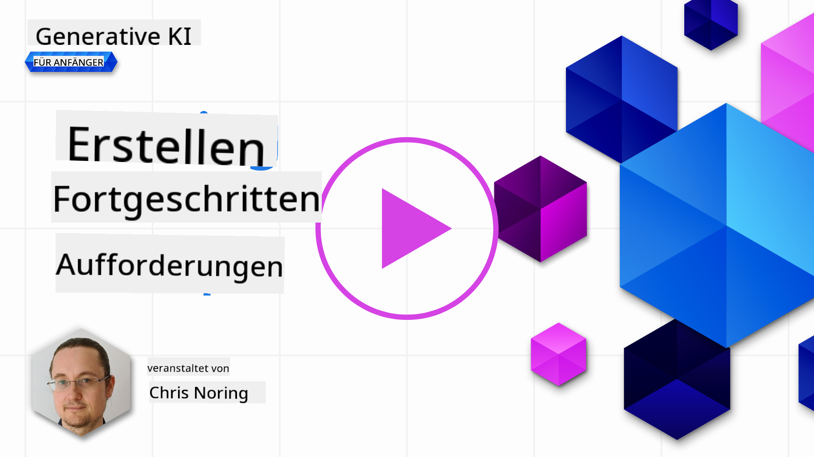

<!--
CO_OP_TRANSLATOR_METADATA:
{
  "original_hash": "b2651fb16bcfbc62b8e518751ed90fdb",
  "translation_date": "2025-10-17T22:52:43+00:00",
  "source_file": "05-advanced-prompts/README.md",
  "language_code": "de"
}
-->
# Erstellen von fortgeschrittenen Prompts

[](https://youtu.be/BAjzkaCdRok?si=NmUIyRf7-cDgbjtt)

Lassen Sie uns einige Erkenntnisse aus dem vorherigen Kapitel zusammenfassen:

> Prompt _Engineering_ ist der Prozess, mit dem wir **das Modell zu relevanteren Antworten führen**, indem wir nützlichere Anweisungen oder Kontext bereitstellen.

Es gibt auch zwei Schritte beim Schreiben von Prompts: das Konstruieren des Prompts durch Bereitstellung relevanten Kontexts und die _Optimierung_, also die schrittweise Verbesserung des Prompts.

An diesem Punkt haben wir ein grundlegendes Verständnis dafür, wie man Prompts schreibt, aber wir müssen tiefer gehen. In diesem Kapitel werden Sie von der bloßen Erprobung verschiedener Prompts dazu übergehen, zu verstehen, warum ein Prompt besser ist als ein anderer. Sie werden lernen, wie man Prompts nach einigen grundlegenden Techniken erstellt, die auf jedes LLM angewendet werden können.

## Einführung

In diesem Kapitel behandeln wir die folgenden Themen:

- Vertiefung Ihres Wissens über Prompt Engineering durch Anwendung verschiedener Techniken auf Ihre Prompts.
- Konfiguration Ihrer Prompts, um die Ausgabe zu variieren.

## Lernziele

Nach Abschluss dieser Lektion können Sie:

- Techniken des Prompt Engineering anwenden, die das Ergebnis Ihrer Prompts verbessern.
- Prompts durchführen, die entweder variabel oder deterministisch sind.

## Prompt Engineering

Prompt Engineering ist der Prozess des Erstellens von Prompts, die das gewünschte Ergebnis liefern. Es geht dabei um mehr als nur das Schreiben eines Text-Prompts. Prompt Engineering ist keine Ingenieursdisziplin, sondern vielmehr eine Sammlung von Techniken, die angewendet werden können, um das gewünschte Ergebnis zu erzielen.

### Ein Beispiel für einen Prompt

Nehmen wir einen einfachen Prompt wie diesen:

> Erstelle 10 Fragen zur Geografie.

In diesem Prompt wenden Sie tatsächlich eine Reihe verschiedener Prompt-Techniken an.

Lassen Sie uns das aufschlüsseln.

- **Kontext**, Sie geben an, dass es um "Geografie" gehen soll.
- **Begrenzung der Ausgabe**, Sie möchten nicht mehr als 10 Fragen.

### Einschränkungen einfacher Prompts

Möglicherweise erhalten Sie nicht das gewünschte Ergebnis. Es werden zwar Fragen generiert, aber Geografie ist ein großes Thema, und Sie erhalten möglicherweise nicht das, was Sie möchten, aus den folgenden Gründen:

- **Großes Thema**, Sie wissen nicht, ob es um Länder, Hauptstädte, Flüsse usw. geht.
- **Format**, was ist, wenn Sie möchten, dass die Fragen in einer bestimmten Weise formatiert sind?

Wie Sie sehen können, gibt es viel zu beachten, wenn man Prompts erstellt.

Bisher haben wir ein einfaches Prompt-Beispiel gesehen, aber generative KI ist zu viel mehr fähig, um Menschen in verschiedenen Rollen und Branchen zu helfen. Lassen Sie uns als Nächstes einige grundlegende Techniken erkunden.

### Techniken für Prompts

Zunächst müssen wir verstehen, dass das Erstellen von Prompts eine _emergente_ Eigenschaft eines LLM ist, was bedeutet, dass dies keine Funktion ist, die im Modell eingebaut ist, sondern etwas, das wir entdecken, während wir das Modell verwenden.

Es gibt einige grundlegende Techniken, die wir verwenden können, um ein LLM zu prompten. Lassen Sie uns diese erkunden.

- **Zero-shot Prompting**, dies ist die einfachste Form des Prompting. Es handelt sich um einen einzelnen Prompt, der eine Antwort vom LLM basierend ausschließlich auf seinen Trainingsdaten anfordert.
- **Few-shot Prompting**, diese Art des Prompting leitet das LLM, indem es 1 oder mehrere Beispiele bereitstellt, auf die es sich stützen kann, um seine Antwort zu generieren.
- **Chain-of-Thought**, diese Art des Prompting zeigt dem LLM, wie ein Problem in Schritte unterteilt werden kann.
- **Generiertes Wissen**, um die Antwort eines Prompts zu verbessern, können Sie zusätzlich zu Ihrem Prompt generierte Fakten oder Wissen bereitstellen.
- **Least to Most**, ähnlich wie Chain-of-Thought, geht es bei dieser Technik darum, ein Problem in eine Reihe von Schritten zu unterteilen und diese Schritte dann in der Reihenfolge ausführen zu lassen.
- **Self-refine**, diese Technik besteht darin, die Ausgabe des LLM zu kritisieren und es dann zu bitten, sie zu verbessern.
- **Maieutisches Prompting**, hier möchten Sie sicherstellen, dass die Antwort des LLM korrekt ist, und bitten es, verschiedene Teile der Antwort zu erklären. Dies ist eine Form von Self-refine.

### Zero-shot Prompting

Dieser Stil des Prompting ist sehr einfach und besteht aus einem einzigen Prompt. Diese Technik verwenden Sie wahrscheinlich, wenn Sie anfangen, sich mit LLMs vertraut zu machen. Hier ist ein Beispiel:

- Prompt: "Was ist Algebra?"
- Antwort: "Algebra ist ein Zweig der Mathematik, der mathematische Symbole und die Regeln für deren Manipulation untersucht."

### Few-shot Prompting

Dieser Stil des Prompting hilft dem Modell, indem es einige Beispiele zusammen mit der Anfrage bereitstellt. Es besteht aus einem einzigen Prompt mit zusätzlichen aufgabenspezifischen Daten. Hier ist ein Beispiel:

- Prompt: "Schreibe ein Gedicht im Stil von Shakespeare. Hier sind einige Beispiele für Shakespeare-Sonette:
  Sonett 18: 'Soll ich dich mit einem Sommertag vergleichen? Du bist lieblicher und milder...'
  Sonett 116: 'Lass mich nicht die Ehe wahrer Geister behindern. Liebe ist nicht Liebe, die sich verändert, wenn sie Veränderung findet...'
  Sonett 132: 'Deine Augen liebe ich, und sie, als ob sie mich bemitleiden, quälen mein Herz mit Verachtung,...'
  Nun schreibe ein Sonett über die Schönheit des Mondes."
- Antwort: "Am Himmel glänzt der Mond so sanft, In silbernem Licht, das seine zarte Anmut wirft,..."

Beispiele geben dem LLM den Kontext, das Format oder den Stil der gewünschten Ausgabe. Sie helfen dem Modell, die spezifische Aufgabe zu verstehen und genauere und relevantere Antworten zu generieren.

### Chain-of-Thought

Chain-of-Thought ist eine sehr interessante Technik, da es darum geht, das LLM durch eine Reihe von Schritten zu führen. Die Idee ist, das LLM so zu instruieren, dass es versteht, wie man etwas macht. Betrachten Sie das folgende Beispiel, mit und ohne Chain-of-Thought:

    - Prompt: "Alice hat 5 Äpfel, wirft 3 Äpfel, gibt 2 an Bob und Bob gibt einen zurück, wie viele Äpfel hat Alice?"
    - Antwort: 5

Das LLM antwortet mit 5, was falsch ist. Die richtige Antwort ist 1 Apfel, basierend auf der Berechnung (5 -3 -2 + 1 = 1).

Wie können wir dem LLM beibringen, dies korrekt zu machen?

Versuchen wir Chain-of-Thought. Chain-of-Thought anzuwenden bedeutet:

1. Geben Sie dem LLM ein ähnliches Beispiel.
1. Zeigen Sie die Berechnung und wie man sie korrekt berechnet.
1. Geben Sie den ursprünglichen Prompt an.

So sieht das aus:

- Prompt: "Lisa hat 7 Äpfel, wirft 1 Apfel, gibt 4 Äpfel an Bart und Bart gibt einen zurück:
  7 -1 = 6
  6 -4 = 2
  2 +1 = 3  
  Alice hat 5 Äpfel, wirft 3 Äpfel, gibt 2 an Bob und Bob gibt einen zurück, wie viele Äpfel hat Alice?"
  Antwort: 1

Beachten Sie, wie wir wesentlich längere Prompts schreiben, mit einem weiteren Beispiel, einer Berechnung und dann dem ursprünglichen Prompt, und wir kommen zur richtigen Antwort 1.

Wie Sie sehen können, ist Chain-of-Thought eine sehr leistungsstarke Technik.

### Generiertes Wissen

Oftmals, wenn Sie einen Prompt erstellen möchten, möchten Sie dies mit den Daten Ihres eigenen Unternehmens tun. Ein Teil des Prompts soll aus dem Unternehmen stammen, und der andere Teil sollte der eigentliche Prompt sein, an dem Sie interessiert sind.

Als Beispiel könnte Ihr Prompt so aussehen, wenn Sie im Versicherungswesen tätig sind:

```text
{{company}}: {{company_name}}
{{products}}:
{{products_list}}
Please suggest an insurance given the following budget and requirements:
Budget: {{budget}}
Requirements: {{requirements}}
```

Oben sehen Sie, wie der Prompt mithilfe einer Vorlage erstellt wird. In der Vorlage gibt es eine Reihe von Variablen, die durch `{{variable}}` gekennzeichnet sind und durch tatsächliche Werte aus einer Unternehmens-API ersetzt werden.

Hier ist ein Beispiel, wie der Prompt aussehen könnte, nachdem die Variablen durch Inhalte Ihres Unternehmens ersetzt wurden:

```text
Insurance company: ACME Insurance
Insurance products (cost per month):
- Car, cheap, 500 USD
- Car, expensive, 1100 USD
- Home, cheap, 600 USD
- Home, expensive, 1200 USD
- Life, cheap, 100 USD

Please suggest an insurance given the following budget and requirements:
Budget: $1000
Requirements: Car, Home, and Life insurance
```

Wenn Sie diesen Prompt durch ein LLM laufen lassen, wird eine Antwort wie diese erzeugt:

```output
Given the budget and requirements, we suggest the following insurance package from ACME Insurance:
- Car, cheap, 500 USD
- Home, cheap, 600 USD
- Life, cheap, 100 USD
Total cost: $1,200 USD
```

Wie Sie sehen können, schlägt es auch die Lebensversicherung vor, was es nicht sollte. Dieses Ergebnis deutet darauf hin, dass wir den Prompt optimieren müssen, indem wir ihn klarer machen, was er zulassen kann. Nach einigen _Versuchen und Irrtümern_ kommen wir zu folgendem Prompt:

```text
Insurance company: ACME Insurance
Insurance products (cost per month):
- type: Car, cheap, cost: 500 USD
- type: Car, expensive, cost: 1100 USD
- type: Home, cheap, cost: 600 USD
- type: Home, expensive, cost: 1200 USD
- type: Life, cheap, cost: 100 USD

Please suggest an insurance given the following budget and requirements:
Budget: $1000 restrict choice to types: Car, Home
```

Beachten Sie, wie das Hinzufügen von _Typ_ und _Kosten_ sowie die Verwendung des Schlüsselworts _einschränken_ dem LLM hilft, zu verstehen, was wir wollen.

Jetzt erhalten wir die folgende Antwort:

```output
Given the budget and requirements, we suggest the Car, Cheap insurance product which costs 500 USD per month.
```

Der Punkt dieses Beispiels war zu zeigen, dass wir, obwohl wir eine grundlegende Technik wie _generiertes Wissen_ verwenden, in den meisten Fällen den Prompt optimieren müssen, um das gewünschte Ergebnis zu erzielen.

### Least-to-Most

Die Idee hinter Least-to-Most Prompting ist, ein größeres Problem in Teilprobleme zu zerlegen. Auf diese Weise helfen Sie dem LLM, das größere Problem zu "bewältigen". Ein gutes Beispiel könnte für Data Science sein, wo Sie das LLM bitten können, ein Problem wie folgt aufzuteilen:

> Prompt: Wie führt man Datenanalyse in 5 Schritten durch?

Mit der Antwort Ihres KI-Assistenten:

1. Daten sammeln
1. Daten bereinigen
1. Daten analysieren
1. Daten visualisieren
1. Daten präsentieren

### Self-refine, Ergebnisse kritisieren

Bei generativen KIs und LLMs können Sie der Ausgabe nicht blind vertrauen. Sie müssen sie überprüfen. Schließlich präsentiert Ihnen das LLM nur das, was als nächstes am wahrscheinlichsten gesagt wird, nicht unbedingt das, was korrekt ist. Daher ist es eine gute Idee, das LLM zu bitten, sich selbst zu kritisieren, was uns zur Self-refine-Technik führt.

So funktioniert es:

1. Anfangsprompt, der das LLM auffordert, ein Problem zu lösen
1. LLM antwortet
1. Sie kritisieren die Antwort und bitten die KI, sie zu verbessern
1. LLM antwortet erneut, diesmal unter Berücksichtigung der Kritik und schlägt Lösungen vor, die es sich ausgedacht hat

Diesen Prozess können Sie so oft wiederholen, wie Sie möchten.

Hier ist ein Beispiel für die Verwendung dieser Technik:

> Prompt: "Erstelle eine Python-Web-API mit den Routen Produkte und Kunden"

KI-Antwort:

```python
import flask
app = Flask(__name__)

@app.route('/products')
def products():
    return 'Products'

@app.route('/customers')
def customers():
    return 'Customers'
```

> Prompt: Schlage 3 Verbesserungen für den obigen Code vor

KI-Antwort:

```text
Sure, here are three suggestions to improve the code:

Import the correct module: The first line should import Flask instead of flask. The correct import statement should be from flask import Flask.

Add a main function: Add a if __name__ == '__main__': block to the end of the file to run the application when the file is executed.

Use f-strings: Use f-strings to format the return statements in the route functions. For example, return 'Products' can be changed to return f'This is the {request.path} page'.
```

```python
from flask import Flask, request

app = Flask(__name__)

@app.route('/products')
def products():
    return f'This is the {request.path} page'

@app.route('/customers')
def customers():
    return f'This is the {request.path} page'

if __name__ == '__main__':
    app.run()
```

Wie Sie sehen können, verbessert die obige KI-Antwort den zuerst vorgeschlagenen Code dank der Kritik an der ersten Antwort.

### Maieutisches Prompting

Maieutisches Prompting ist eine Technik, die der Self-refine-Technik ähnlich ist, aber mehr darauf abzielt, das LLM zu bitten, sich selbst zu erklären. Das Ziel ist es, Inkonsistenzen in der Ausgabe des LLM zu reduzieren, um sicherzustellen, dass es zur richtigen Antwort gelangt. Der Arbeitsablauf, dem Sie folgen sollten, ist:

1. Bitten Sie das LLM, eine Frage zu beantworten.
1. Bitten Sie das LLM, jeden Teil der Antwort genauer zu erklären.
1. Wenn es Inkonsistenzen gibt, verwerfen Sie die Teile, die inkonsistent sind.

Wiederholen Sie Schritt 2 und 3, bis Sie alle Teile durchgegangen sind und mit der Antwort zufrieden sind.

Hier ist ein Beispiel-Prompt:

> Prompt: Wie kann ich einen Krisenplan erstellen, um eine Pandemie in 5 Schritten zu bewältigen?
> LLM-Antwort:

```text
1. Identify the risks
1. Identify the stakeholders
1. Identify the resources
1. Identify the actions
1. Identify the communication channels
```

Es hat 5 Schritte identifiziert, aber können wir feststellen, ob dies korrekt ist? Lassen Sie uns das LLM bitten, jeden Schritt genauer zu erklären:

> Prompt: Erklären Sie den ersten Schritt genauer, was sind die Risiken im Detail bei einer Pandemie?

```text
The risks are the following:

- Loss of life
- Loss of business
- Loss of reputation
- Loss of customers
- Loss of employees
```

An diesem Punkt möchten wir sicherstellen, dass das LLM korrekt ist, also bitten wir es, das erste Risiko genauer zu erklären, und hoffen, dass es mit der obigen Antwort übereinstimmt:

> Prompt: Was ist das größte Risiko in einer Pandemie und warum?

```text
The biggest risk is loss of life because it's the most important thing to protect.
```

> Was sind die zwei größten Risiken in einer Pandemie?

```text
The two biggest risks are loss of life and loss of business.
```

An diesem Punkt ist das LLM konsistent und nennt "Leben" und "Geschäft" als die beiden größten Risiken. Wir können nun mit dem nächsten Schritt fortfahren und uns relativ sicher fühlen. Dennoch sollten wir dem LLM nicht blind vertrauen, sondern die Ausgabe immer überprüfen.

## Variieren Sie Ihre Ausgabe

LLMs sind von Natur aus nicht deterministisch, was bedeutet, dass Sie jedes Mal, wenn Sie denselben Prompt ausführen, unterschiedliche Ergebnisse erhalten. Probieren Sie zum Beispiel den folgenden Prompt aus:

> "Generiere Code für eine Python-Web-API"

```python
# Import necessary modules
import flask
from flask import request, jsonify

# Create a Flask app
app = flask.Flask(__name__)

# Create a route for the API
@app.route('/api', methods=['GET'])
def api():
    # Get the data from the request
    data = request.args

    # Process the data
    result = process_data(data)

    # Return the result as JSON
    return jsonify(result)

# Function to process the data
def process_data(data):
    # Do something with the data
    result = data + 1

    # Return the result
    return result

# Run the app
if __name__ == '__main__':
    app.run()

```

Wenn Sie denselben Prompt erneut ausführen, wird eine leicht unterschiedliche Antwort generiert:

```python
#import necessary packages
import flask
from flask import request, jsonify

#create the Flask application
app = flask.Flask(__name__)
app.config["DEBUG"] = True

#create a list of books
books = [
    {'id': 0,
     'title': 'A Fire Upon the Deep',
     'author': 'Vernor Vinge',
     'first_sentence': 'The coldsleep itself was dreamless.',
     'year_published': '1992'},
    {'id': 1,
     'title': 'The Ones Who Walk Away From Omelas',
     'author': 'Ursula K. Le Guin',
     'first_sentence': 'With a clamor of bells that set the swallows soaring, the Festival of Summer came to the city Omelas, bright-towered by the sea.',
     'published': '1973'},
    {'id': 2,
     'title': 'Dhalgren',
     'author': 'Samuel R. Delany',
     'first_sentence': 'to wound the autumnal city.',
     'published': '1975'}
]

#create an endpoint for the API
@app.route('/', methods=['GET'])
def home():
    return '''<h1>Books API</h1>
<p>A prototype API for retrieving books.</p>'''

#create an endpoint to return all books
@app.route('/api/v1/resources/books/all', methods=['GET'])
def api_all():
    return jsonify(books)

#create an endpoint to return a single book
@app.route('/api/v1/resources/books', methods=['GET'])
def api_id():
    #check if an ID was provided as part of the URL
    #if ID is provided, assign it to a variable
    #if no ID is provided, display an error
    if 'id' in request.args:
        id = int(request.args['id'])
    else:
        return "Error: No id field provided. Please specify an id."

    #create an empty list for our results
    results = []

    #loop through the data and match results that fit the requested ID
    #IDs are unique, but other fields might return many results
    for book in books:
        if book['id'] == id:
            results.append(book)

    #use the jsonify function from Flask to convert our list of
    #Python dictionaries to the JSON format
    return jsonify(results)

app.run()
```

> Ist die variierte Ausgabe also ein Problem?

Das hängt davon ab, was Sie erreichen möchten. Wenn Sie eine spezifische Antwort wünschen, ist es ein Problem. Wenn Sie mit einer variablen Ausgabe wie "Generiere beliebige 3 Fragen zur Geografie" einverstanden sind, dann ist es kein Problem.

### Verwendung von Temperatur zur Variation der Ausgabe

Okay, wir haben entschieden, dass wir die Ausgabe begrenzen möchten, um sie vorhersehbarer zu machen, also deterministischer. Wie machen wir das?

Temperatur ist ein Wert zwischen 0 und 1, wobei 0 am deterministischsten und 1 am variabelsten ist. Der Standardwert ist 0,7. Lassen Sie uns sehen, was passiert, wenn wir denselben Prompt mit einer Temperatur von 0,1 zweimal ausführen:

> "Generiere Code für eine Python-Web-API"

```python
#import necessary libraries
import flask
from flask import request, jsonify

#create an instance of the Flask class
app = flask.Flask(__name__)

#create an endpoint for the API
@app.route('/api/v1/endpoint', methods=['GET'])
def api_endpoint():
    #get the request data
    data = request.get_json()

    #process the data
    result = process_data(data)

    #return the result
    return jsonify(result)

#function to process the data
def process_data(data):
    #process the data
    result = {'result': 'success'}

    #return the result
    return result

#run the Flask app
if __name__ == '__main__':
    app.run()

```

Wenn wir den Prompt erneut ausführen, erhalten wir dieses Ergebnis:

```python
#import necessary libraries
import flask
from flask import request, jsonify

#create a Flask app
app = flask.Flask(__name__)

#create a route for the API
@app.route('/api', methods=['GET'])
def api_call():
    #get the data from the request
    data = request.get_json()

    #process the data
    result = process_data(data)

    #return the result
    return jsonify(result)

#define the process_data function
def process_data(data):
    #do something with the data
    result = data + 1

    #return the result
    return result

#run the app
if __name__ == '__main__':
    app.run()

```

Es gibt nur einen kleinen Unterschied zwischen diesen beiden Ausgaben. Machen wir diesmal das Gegenteil und setzen die Temperatur auf 0,9:

```python
# Import necessary libraries
import flask
from flask import request, jsonify

# Create a Flask app
app = flask.Flask(__name__)

# Create a route for the API
@app.route('/api', methods=['GET'])
def api_call():
    # Get the data from the request
    data = request.args

    # Process the data
    result = process_data(data)

    # Return the result
    return jsonify(result)

# Function to process the data
def process_data(data):
    # Do something with the data
    result = data + 1

    # Return the result
    return result

# Run the app
if __name__ == '__main__':
    app.run()

```

und der zweite Versuch mit einem Temperaturwert von 0,9:

```python
import flask
from flask import request, jsonify

# create the Flask app
app = flask.Flask(__name__)
app.config['DEBUG'] = True

# create some test data
books = [
    {'id': 0, 'title': 'A Fire Upon The Deep', 'author': 'Vernor Vinge', 'first_sentence': 'The coldsleep itself was dreamless.', 'year_published': '1992'},
    {'id': 1, 'title': 'The Ones Who Walk Away From Omelas', 'author': 'Ursula K. Le Guin', 'first_sentence': 'With a clamor of bells that set the swallows soaring, the Festival of Summer came to the city Omelas, bright-towered by the sea.', 'published': '1973'},
    {'id': 2, 'title': 'Dhalgren', 'author': 'Samuel R. Delany', 'first_sentence': 'to wound the autumnal city.', 'published': '1975'}
]

# create an endpoint
@app.route('/', methods=['GET'])
def home():
    return '''<h1>Welcome to our book API!</h1>'''

@app.route('/api/v1/resources/books

```

Wie Sie sehen können, könnten die Ergebnisse nicht unterschiedlicher sein.

> Beachten Sie, dass es weitere Parameter gibt, die Sie ändern können, um die Ausgabe zu variieren, wie top-k, top-p, Wiederholungsstrafe, Längenstrafe und Diversitätsstrafe, aber diese liegen außerhalb des Umfangs dieses Lehrplans.

## Gute Praktiken

Es gibt viele Vorgehensweisen, die Sie anwenden können, um das gewünschte Ergebnis zu erzielen. Mit zunehmender Nutzung des Promptings werden Sie Ihren eigenen Stil entwickeln.

Zusätzlich zu den Techniken, die wir behandelt haben, gibt es einige gute Praktiken, die Sie beim Prompting eines LLM berücksichtigen sollten.

Hier sind einige gute Praktiken, die Sie beachten sollten:

- **Kontext spezifizieren**. Kontext ist wichtig – je mehr Sie angeben können, wie z. B. Domain, Thema usw., desto besser.
- Begrenzen Sie die Ausgabe. Wenn Sie eine bestimmte Anzahl von Elementen oder eine bestimmte Länge wünschen, geben Sie dies an.
- **Spezifizieren Sie sowohl das Was als auch das Wie**. Denken Sie daran, sowohl das, was Sie möchten, als auch wie Sie es möchten, zu erwähnen, z. B. "Erstellen Sie eine Python-Web-API mit den Routen Produkte und Kunden, teilen Sie sie in 3 Dateien auf".
- **Verwenden Sie Vorlagen**. Oft möchten Sie Ihre Prompts mit Daten aus Ihrem Unternehmen anreichern. Verwenden Sie Vorlagen, um dies zu tun. Vorlagen können Variablen enthalten, die Sie durch tatsächliche Daten ersetzen.
- **Richtig schreiben**. LLMs können Ihnen möglicherweise eine korrekte Antwort geben, aber wenn Sie korrekt schreiben, erhalten Sie eine bessere Antwort.

## Aufgabe

Hier ist ein Python-Code, der zeigt, wie man eine einfache API mit Flask erstellt:

```python
from flask import Flask, request

app = Flask(__name__)

@app.route('/')
def hello():
    name = request.args.get('name', 'World')
    return f'Hello, {name}!'

if __name__ == '__main__':
    app.run()
```

Verwenden Sie einen KI-Assistenten wie GitHub Copilot oder ChatGPT und wenden Sie die Technik "Selbstverfeinerung" an, um den Code zu verbessern.

## Lösung

Versuchen Sie, die Aufgabe zu lösen, indem Sie geeignete Prompts zum Code hinzufügen.

> [!TIP]
> Formulieren Sie einen Prompt, um nach Verbesserungen zu fragen. Es ist eine gute Idee, die Anzahl der Verbesserungen zu begrenzen. Sie können auch nach Verbesserungen in einer bestimmten Hinsicht fragen, z. B. Architektur, Leistung, Sicherheit usw.

[Lösung](../../../05-advanced-prompts/python/aoai-solution.py)

## Wissensüberprüfung

Warum sollte ich Chain-of-Thought-Prompting verwenden? Zeigen Sie mir 1 richtige Antwort und 2 falsche Antworten.

1. Um dem LLM beizubringen, wie man ein Problem löst.
1. B, Um dem LLM beizubringen, Fehler im Code zu finden.
1. C, Um dem LLM zu sagen, dass es verschiedene Lösungen entwickeln soll.

A: 1, weil es bei Chain-of-Thought darum geht, dem LLM zu zeigen, wie man ein Problem löst, indem man ihm eine Reihe von Schritten und ähnliche Probleme sowie deren Lösungen bereitstellt.

## 🚀 Herausforderung

Sie haben gerade die Technik der Selbstverfeinerung in der Aufgabe angewendet. Nehmen Sie ein beliebiges Programm, das Sie erstellt haben, und überlegen Sie, welche Verbesserungen Sie daran vornehmen möchten. Wenden Sie nun die Technik der Selbstverfeinerung an, um die vorgeschlagenen Änderungen umzusetzen. Was halten Sie vom Ergebnis – besser oder schlechter?

## Großartige Arbeit! Setzen Sie Ihr Lernen fort

Nachdem Sie diese Lektion abgeschlossen haben, schauen Sie sich unsere [Generative AI Learning Collection](https://aka.ms/genai-collection?WT.mc_id=academic-105485-koreyst) an, um Ihr Wissen über Generative AI weiter zu vertiefen!

Gehen Sie zu Lektion 6, in der wir unser Wissen über Prompt Engineering anwenden, indem wir [Textgenerierungs-Apps erstellen](../06-text-generation-apps/README.md?WT.mc_id=academic-105485-koreyst).

---

**Haftungsausschluss**:  
Dieses Dokument wurde mit dem KI-Übersetzungsdienst [Co-op Translator](https://github.com/Azure/co-op-translator) übersetzt. Obwohl wir uns um Genauigkeit bemühen, beachten Sie bitte, dass automatisierte Übersetzungen Fehler oder Ungenauigkeiten enthalten können. Das Originaldokument in seiner ursprünglichen Sprache sollte als maßgebliche Quelle betrachtet werden. Für kritische Informationen wird eine professionelle menschliche Übersetzung empfohlen. Wir übernehmen keine Haftung für Missverständnisse oder Fehlinterpretationen, die sich aus der Nutzung dieser Übersetzung ergeben.