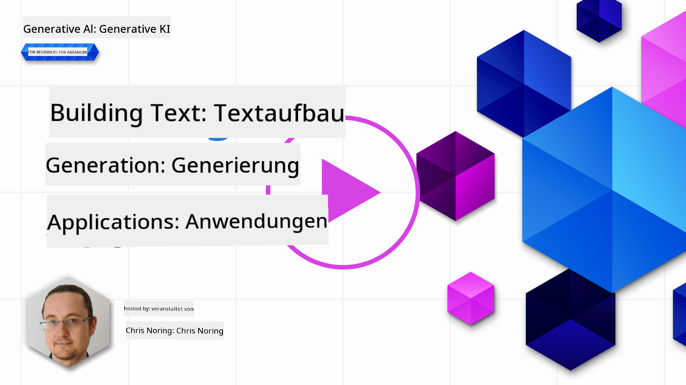

<!--
CO_OP_TRANSLATOR_METADATA:
{
  "original_hash": "5ec6c92b629564538ef397c550adb73e",
  "translation_date": "2025-05-19T10:06:19+00:00",
  "source_file": "06-text-generation-apps/README.md",
  "language_code": "de"
}
-->
# Erstellung von Anwendungen zur Textgenerierung

[](https://aka.ms/gen-ai-lesson6-gh?WT.mc_id=academic-105485-koreyst)

> _(Klicken Sie auf das Bild oben, um das Video zu dieser Lektion anzusehen)_

Bisher haben Sie in diesem Lehrplan festgestellt, dass es Kernkonzepte wie Prompts gibt und sogar eine ganze Disziplin namens "Prompt Engineering". Viele Tools, mit denen Sie interagieren können, wie ChatGPT, Office 365, Microsoft Power Platform und mehr, unterstützen Sie dabei, Prompts zu verwenden, um etwas zu erreichen.

Um eine solche Erfahrung zu einer App hinzuzufügen, müssen Sie Konzepte wie Prompts, Completions verstehen und eine Bibliothek auswählen, mit der Sie arbeiten möchten. Genau das werden Sie in diesem Kapitel lernen.

## Einführung

In diesem Kapitel werden Sie:

- Die openai-Bibliothek und ihre Kernkonzepte kennenlernen.
- Eine Textgenerierungs-App mit openai erstellen.
- Verstehen, wie man Konzepte wie Prompt, Temperatur und Tokens verwendet, um eine Textgenerierungs-App zu erstellen.

## Lernziele

Am Ende dieser Lektion werden Sie in der Lage sein:

- Erklären, was eine Textgenerierungs-App ist.
- Eine Textgenerierungs-App mit openai erstellen.
- Ihre App so konfigurieren, dass sie mehr oder weniger Tokens verwendet und auch die Temperatur ändert, für ein variierendes Ergebnis.

## Was ist eine Textgenerierungs-App?

Normalerweise hat eine App, die Sie erstellen, eine Art Schnittstelle wie die folgende:

- Befehlsbasiert. Konsolen-Apps sind typische Apps, bei denen Sie einen Befehl eingeben und eine Aufgabe ausgeführt wird. Zum Beispiel ist `git` eine befehlsbasierte App.
- Benutzeroberfläche (UI). Einige Apps haben grafische Benutzeroberflächen (GUIs), bei denen Sie Schaltflächen klicken, Text eingeben, Optionen auswählen und mehr.

### Konsolen- und UI-Apps sind begrenzt

Vergleichen Sie dies mit einer befehlsbasierten App, bei der Sie einen Befehl eingeben:

- **Es ist begrenzt**. Sie können nicht einfach jeden Befehl eingeben, sondern nur die, die die App unterstützt.
- **Sprachspezifisch**. Einige Apps unterstützen viele Sprachen, aber standardmäßig ist die App für eine bestimmte Sprache entwickelt, auch wenn Sie mehr Sprachunterstützung hinzufügen können.

### Vorteile von Textgenerierungs-Apps

Wie unterscheidet sich eine Textgenerierungs-App?

In einer Textgenerierungs-App haben Sie mehr Flexibilität, Sie sind nicht auf eine Reihe von Befehlen oder eine bestimmte Eingabesprache beschränkt. Stattdessen können Sie natürliche Sprache verwenden, um mit der App zu interagieren. Ein weiterer Vorteil ist, dass Sie bereits mit einer Datenquelle interagieren, die auf einem umfangreichen Korpus von Informationen trainiert wurde, während eine traditionelle App möglicherweise auf das beschränkt ist, was sich in einer Datenbank befindet.

### Was kann ich mit einer Textgenerierungs-App erstellen?

Es gibt viele Dinge, die Sie erstellen können. Zum Beispiel:

- **Ein Chatbot**. Ein Chatbot, der Fragen zu Themen beantwortet, wie Ihr Unternehmen und seine Produkte, könnte eine gute Wahl sein.
- **Helfer**. LLMs sind hervorragend darin, Texte zusammenzufassen, Einblicke aus Texten zu gewinnen, Texte wie Lebensläufe zu erstellen und mehr.
- **Code-Assistent**. Je nach Sprachmodell, das Sie verwenden, können Sie einen Code-Assistenten erstellen, der Ihnen beim Schreiben von Code hilft. Zum Beispiel können Sie ein Produkt wie GitHub Copilot sowie ChatGPT verwenden, um Ihnen beim Schreiben von Code zu helfen.

## Wie kann ich anfangen?

Nun, Sie müssen einen Weg finden, sich mit einem LLM zu integrieren, was normalerweise die folgenden zwei Ansätze umfasst:

- Verwenden Sie eine API. Hier erstellen Sie Webanfragen mit Ihrem Prompt und erhalten generierten Text zurück.
- Verwenden Sie eine Bibliothek. Bibliotheken helfen, die API-Aufrufe zu kapseln und sie einfacher zu verwenden.

## Bibliotheken/SDKs

Es gibt einige bekannte Bibliotheken für die Arbeit mit LLMs wie:

- **openai**, diese Bibliothek macht es einfach, sich mit Ihrem Modell zu verbinden und Prompts zu senden.

Dann gibt es Bibliotheken, die auf einer höheren Ebene arbeiten, wie:

- **Langchain**. Langchain ist bekannt und unterstützt Python.
- **Semantic Kernel**. Semantic Kernel ist eine Bibliothek von Microsoft, die die Sprachen C#, Python und Java unterstützt.

## Erste App mit openai

Schauen wir mal, wie wir unsere erste App erstellen können, welche Bibliotheken wir benötigen, wie viel erforderlich ist und so weiter.

### openai installieren

Es gibt viele Bibliotheken da draußen, um mit OpenAI oder Azure OpenAI zu interagieren. Es ist möglich, zahlreiche Programmiersprachen zu verwenden, wie C#, Python, JavaScript, Java und mehr. Wir haben uns entschieden, die `openai` Python-Bibliothek zu verwenden, also werden wir `pip` verwenden, um sie zu installieren.

```bash
pip install openai
```

### Eine Ressource erstellen

Sie müssen die folgenden Schritte ausführen:

- Erstellen Sie ein Konto auf Azure [https://azure.microsoft.com/free/](https://azure.microsoft.com/free/?WT.mc_id=academic-105485-koreyst).
- Zugriff auf Azure OpenAI erhalten. Gehen Sie zu [https://learn.microsoft.com/azure/ai-services/openai/overview#how-do-i-get-access-to-azure-openai](https://learn.microsoft.com/azure/ai-services/openai/overview#how-do-i-get-access-to-azure-openai?WT.mc_id=academic-105485-koreyst) und beantragen Sie Zugang.

  > [!NOTE]
  > Zum Zeitpunkt des Schreibens müssen Sie Zugang zu Azure OpenAI beantragen.

- Python installieren <https://www.python.org/>
- Eine Azure OpenAI Service-Ressource erstellt haben. Siehe diese Anleitung, wie man [eine Ressource erstellt](https://learn.microsoft.com/azure/ai-services/openai/how-to/create-resource?pivots=web-portal?WT.mc_id=academic-105485-koreyst).

### API-Schlüssel und Endpunkt finden

An diesem Punkt müssen Sie Ihrer `openai` Bibliothek mitteilen, welchen API-Schlüssel sie verwenden soll. Um Ihren API-Schlüssel zu finden, gehen Sie zum Abschnitt "Keys and Endpoint" Ihrer Azure OpenAI-Ressource und kopieren Sie den Wert "Key 1".


Jetzt, da Sie diese Informationen kopiert haben, lassen Sie uns die Bibliotheken anweisen, sie zu verwenden.

> [!NOTE]
> Es lohnt sich, Ihren API-Schlüssel von Ihrem Code zu trennen. Sie können dies tun, indem Sie Umgebungsvariablen verwenden.
>
> - Setzen Sie die Umgebungsvariable `OPENAI_API_KEY` to your API key.
>   `export OPENAI_API_KEY='sk-...'`

### Azure-Konfiguration einrichten

Wenn Sie Azure OpenAI verwenden, erfahren Sie hier, wie Sie die Konfiguration einrichten:

```python
openai.api_type = 'azure'
openai.api_key = os.environ["OPENAI_API_KEY"]
openai.api_version = '2023-05-15'
openai.api_base = os.getenv("API_BASE")
```

Oben setzen wir Folgendes:

- `api_type` to `azure`. This tells the library to use Azure OpenAI and not OpenAI.
- `api_key`, this is your API key found in the Azure Portal.
- `api_version`, this is the version of the API you want to use. At the time of writing, the latest version is `2023-05-15`.
- `api_base`, this is the endpoint of the API. You can find it in the Azure Portal next to your API key.

> [!NOTE] > `os.getenv` is a function that reads environment variables. You can use it to read environment variables like `OPENAI_API_KEY` and `API_BASE`. Set these environment variables in your terminal or by using a library like `dotenv`.

## Generate text

The way to generate text is to use the `Completion`-Klasse. Hier ist ein Beispiel:

```python
prompt = "Complete the following: Once upon a time there was a"

completion = openai.Completion.create(model="davinci-002", prompt=prompt)
print(completion.choices[0].text)
```

Im obigen Code erstellen wir ein Completion-Objekt und übergeben das Modell, das wir verwenden möchten, und den Prompt. Dann drucken wir den generierten Text aus.

### Chat Completions

Bisher haben Sie gesehen, wie wir `Completion` to generate text. But there's another class called `ChatCompletion` verwendet haben, das besser für Chatbots geeignet ist. Hier ist ein Beispiel für die Verwendung:

```python
import openai

openai.api_key = "sk-..."

completion = openai.ChatCompletion.create(model="gpt-3.5-turbo", messages=[{"role": "user", "content": "Hello world"}])
print(completion.choices[0].message.content)
```

Mehr zu dieser Funktionalität in einem kommenden Kapitel.

## Übung - Ihre erste Textgenerierungs-App

Jetzt, da wir gelernt haben, wie man openai einrichtet und konfiguriert, ist es an der Zeit, Ihre erste Textgenerierungs-App zu erstellen. Um Ihre App zu erstellen, befolgen Sie diese Schritte:

1. Erstellen Sie eine virtuelle Umgebung und installieren Sie openai:

   ```bash
   python -m venv venv
   source venv/bin/activate
   pip install openai
   ```

   > [!NOTE]
   > Wenn Sie Windows verwenden, geben Sie `venv\Scripts\activate` instead of `source venv/bin/activate`.

   > [!NOTE]
   > Locate your Azure OpenAI key by going to [https://portal.azure.com/](https://portal.azure.com/?WT.mc_id=academic-105485-koreyst) and search for `Open AI` and select the `Open AI resource` and then select `Keys and Endpoint` and copy the `Key 1`-Wert ein.

1. Erstellen Sie eine _app.py_-Datei und geben Sie ihr den folgenden Code:

   ```python
   import openai

   openai.api_key = "<replace this value with your open ai key or Azure OpenAI key>"

   openai.api_type = 'azure'
   openai.api_version = '2023-05-15'
   openai.api_base = "<endpoint found in Azure Portal where your API key is>"
   deployment_name = "<deployment name>"

   # add your completion code
   prompt = "Complete the following: Once upon a time there was a"
   messages = [{"role": "user", "content": prompt}]

   # make completion
   completion = openai.chat.completions.create(model=deployment_name, messages=messages)

   # print response
   print(completion.choices[0].message.content)
   ```

   > [!NOTE]
   > Wenn Sie Azure OpenAI verwenden, müssen Sie `api_type` to `azure` and set the `api_key` auf Ihren Azure OpenAI-Schlüssel setzen.

   Sie sollten eine Ausgabe wie die folgende sehen:

   ```output
    very unhappy _____.

   Once upon a time there was a very unhappy mermaid.
   ```

## Verschiedene Arten von Prompts für verschiedene Dinge

Jetzt haben Sie gesehen, wie man Text mit einem Prompt generiert. Sie haben sogar ein Programm am Laufen, das Sie modifizieren und ändern können, um verschiedene Arten von Text zu generieren.

Prompts können für alle möglichen Aufgaben verwendet werden. Zum Beispiel:

- **Eine Art von Text generieren**. Zum Beispiel können Sie ein Gedicht, Fragen für ein Quiz usw. generieren.
- **Informationen abrufen**. Sie können Prompts verwenden, um nach Informationen zu suchen, wie im folgenden Beispiel: "Was bedeutet CORS in der Webentwicklung?".
- **Code generieren**. Sie können Prompts verwenden, um Code zu generieren, zum Beispiel eine reguläre Ausdrucksvalidierung für E-Mails zu entwickeln oder warum nicht ein ganzes Programm, wie eine Web-App, generieren?

## Ein praktischerer Anwendungsfall: ein Rezeptgenerator

Stellen Sie sich vor, Sie haben Zutaten zu Hause und möchten etwas kochen. Dafür benötigen Sie ein Rezept. Eine Möglichkeit, Rezepte zu finden, ist die Verwendung einer Suchmaschine oder Sie könnten ein LLM verwenden.

Sie könnten einen Prompt wie folgt schreiben:

> "Zeige mir 5 Rezepte für ein Gericht mit den folgenden Zutaten: Hähnchen, Kartoffeln und Karotten. Pro Rezept liste alle verwendeten Zutaten auf"

Angesichts des obigen Prompts könnten Sie eine Antwort ähnlich der folgenden erhalten:

```output
1. Roasted Chicken and Vegetables:
Ingredients:
- 4 chicken thighs
- 2 potatoes, cut into cubes
- 2 carrots, cut into cubes
- 2 tablespoons olive oil
- 2 cloves garlic, minced
- 1 teaspoon dried thyme
- 1 teaspoon dried oregano
- Salt and pepper, to taste

2. Chicken and Potato Stew:
Ingredients:
- 2 tablespoons olive oil
- 1 onion, diced
- 2 cloves garlic, minced
- 2 chicken breasts, cut into cubes
- 2 potatoes, cut into cubes
- 2 carrots, cut into cubes
- 1 teaspoon dried oregano
- 1 teaspoon dried thyme
- 1 cup chicken broth
- Salt and pepper, to taste

3. Chicken and Potato Bake:
Ingredients:
- 2 tablespoons olive oil
- 2 chicken breasts, cut into cubes
- 2 potatoes, cut into cubes
- 2 carrots, cut into cubes
- 1 onion, diced
- 2 cloves garlic, minced
- 1 teaspoon dried oregano
- 1 teaspoon dried thyme
- 1 cup chicken broth
- Salt and pepper, to taste

4. Chicken and Potato Soup:
Ingredients:
- 2 tablespoons olive oil
- 1 onion, diced
- 2 cloves garlic, minced
- 2 chicken breasts, cut into cubes
- 2 potatoes, cut into cubes
- 2 carrots, cut into cubes
- 1 teaspoon dried oregano
- 1 teaspoon dried thyme
- 4 cups chicken broth
- Salt and pepper, to taste

5. Chicken and Potato Hash:
Ingredients:
- 2 tablespoons olive oil
- 2 chicken breasts, cut into cubes
- 2 potatoes, cut into cubes
- 2 carrots, cut into cubes
- 1 onion, diced
- 2 cloves garlic, minced
- 1 teaspoon dried oregano
```

Dieses Ergebnis ist großartig, ich weiß, was ich kochen soll. An diesem Punkt könnten nützliche Verbesserungen sein:

- Zutaten herausfiltern, die ich nicht mag oder gegen die ich allergisch bin.
- Eine Einkaufsliste erstellen, falls ich nicht alle Zutaten zu Hause habe.

Für die oben genannten Fälle fügen wir einen zusätzlichen Prompt hinzu:

> "Bitte entferne Rezepte mit Knoblauch, da ich allergisch bin, und ersetze ihn durch etwas anderes. Erstelle auch eine Einkaufsliste für die Rezepte, wobei ich bereits Hähnchen, Kartoffeln und Karotten zu Hause habe."

Jetzt haben Sie ein neues Ergebnis, nämlich:

```output
1. Roasted Chicken and Vegetables:
Ingredients:
- 4 chicken thighs
- 2 potatoes, cut into cubes
- 2 carrots, cut into cubes
- 2 tablespoons olive oil
- 1 teaspoon dried thyme
- 1 teaspoon dried oregano
- Salt and pepper, to taste

2. Chicken and Potato Stew:
Ingredients:
- 2 tablespoons olive oil
- 1 onion, diced
- 2 chicken breasts, cut into cubes
- 2 potatoes, cut into cubes
- 2 carrots, cut into cubes
- 1 teaspoon dried oregano
- 1 teaspoon dried thyme
- 1 cup chicken broth
- Salt and pepper, to taste

3. Chicken and Potato Bake:
Ingredients:
- 2 tablespoons olive oil
- 2 chicken breasts, cut into cubes
- 2 potatoes, cut into cubes
- 2 carrots, cut into cubes
- 1 onion, diced
- 1 teaspoon dried oregano
- 1 teaspoon dried thyme
- 1 cup chicken broth
- Salt and pepper, to taste

4. Chicken and Potato Soup:
Ingredients:
- 2 tablespoons olive oil
- 1 onion, diced
- 2 chicken breasts, cut into cubes
- 2 potatoes, cut into cubes
- 2 carrots, cut into cubes
- 1 teaspoon dried oregano
- 1 teaspoon dried thyme
- 4 cups chicken broth
- Salt and pepper, to taste

5. Chicken and Potato Hash:
Ingredients:
- 2 tablespoons olive oil
- 2 chicken breasts, cut into cubes
- 2 potatoes, cut into cubes
- 2 carrots, cut into cubes
- 1 onion, diced
- 1 teaspoon dried oregano

Shopping List:
- Olive oil
- Onion
- Thyme
- Oregano
- Salt
- Pepper
```

Das sind Ihre fünf Rezepte, ohne Knoblauch erwähnt, und Sie haben auch eine Einkaufsliste unter Berücksichtigung dessen, was Sie bereits zu Hause haben.

## Übung - einen Rezeptgenerator erstellen

Jetzt, da wir ein Szenario durchgespielt haben, schreiben wir Code, um das demonstrierte Szenario zu erfüllen. Gehen Sie dazu wie folgt vor:

1. Verwenden Sie die vorhandene _app.py_-Datei als Ausgangspunkt
1. Finden Sie die `prompt`-Variable und ändern Sie ihren Code wie folgt:

   ```python
   prompt = "Show me 5 recipes for a dish with the following ingredients: chicken, potatoes, and carrots. Per recipe, list all the ingredients used"
   ```

   Wenn Sie jetzt den Code ausführen, sollten Sie eine Ausgabe ähnlich der folgenden sehen:

   ```output
   -Chicken Stew with Potatoes and Carrots: 3 tablespoons oil, 1 onion, chopped, 2 cloves garlic, minced, 1 carrot, peeled and chopped, 1 potato, peeled and chopped, 1 bay leaf, 1 thyme sprig, 1/2 teaspoon salt, 1/4 teaspoon black pepper, 1 1/2 cups chicken broth, 1/2 cup dry white wine, 2 tablespoons chopped fresh parsley, 2 tablespoons unsalted butter, 1 1/2 pounds boneless, skinless chicken thighs, cut into 1-inch pieces
   -Oven-Roasted Chicken with Potatoes and Carrots: 3 tablespoons extra-virgin olive oil, 1 tablespoon Dijon mustard, 1 tablespoon chopped fresh rosemary, 1 tablespoon chopped fresh thyme, 4 cloves garlic, minced, 1 1/2 pounds small red potatoes, quartered, 1 1/2 pounds carrots, quartered lengthwise, 1/2 teaspoon salt, 1/4 teaspoon black pepper, 1 (4-pound) whole chicken
   -Chicken, Potato, and Carrot Casserole: cooking spray, 1 large onion, chopped, 2 cloves garlic, minced, 1 carrot, peeled and shredded, 1 potato, peeled and shredded, 1/2 teaspoon dried thyme leaves, 1/4 teaspoon salt, 1/4 teaspoon black pepper, 2 cups fat-free, low-sodium chicken broth, 1 cup frozen peas, 1/4 cup all-purpose flour, 1 cup 2% reduced-fat milk, 1/4 cup grated Parmesan cheese

   -One Pot Chicken and Potato Dinner: 2 tablespoons olive oil, 1 pound boneless, skinless chicken thighs, cut into 1-inch pieces, 1 large onion, chopped, 3 cloves garlic, minced, 1 carrot, peeled and chopped, 1 potato, peeled and chopped, 1 bay leaf, 1 thyme sprig, 1/2 teaspoon salt, 1/4 teaspoon black pepper, 2 cups chicken broth, 1/2 cup dry white wine

   -Chicken, Potato, and Carrot Curry: 1 tablespoon vegetable oil, 1 large onion, chopped, 2 cloves garlic, minced, 1 carrot, peeled and chopped, 1 potato, peeled and chopped, 1 teaspoon ground coriander, 1 teaspoon ground cumin, 1/2 teaspoon ground turmeric, 1/2 teaspoon ground ginger, 1/4 teaspoon cayenne pepper, 2 cups chicken broth, 1/2 cup dry white wine, 1 (15-ounce) can chickpeas, drained and rinsed, 1/2 cup raisins, 1/2 cup chopped fresh cilantro
   ```

   > NOTE, Ihr LLM ist nicht deterministisch, sodass Sie bei jedem Ausführen des Programms unterschiedliche Ergebnisse erhalten können.

   Großartig, sehen wir, wie wir die Dinge verbessern können. Um die Dinge zu verbessern, möchten wir sicherstellen, dass der Code flexibel ist, sodass Zutaten und Anzahl der Rezepte verbessert und geändert werden können.

1. Ändern wir den Code auf folgende Weise:

   ```python
   no_recipes = input("No of recipes (for example, 5): ")

   ingredients = input("List of ingredients (for example, chicken, potatoes, and carrots): ")

   # interpolate the number of recipes into the prompt an ingredients
   prompt = f"Show me {no_recipes} recipes for a dish with the following ingredients: {ingredients}. Per recipe, list all the ingredients used"
   ```

   Ein Testlauf des Codes könnte so aussehen:

   ```output
   No of recipes (for example, 5): 3
   List of ingredients (for example, chicken, potatoes, and carrots): milk,strawberries

   -Strawberry milk shake: milk, strawberries, sugar, vanilla extract, ice cubes
   -Strawberry shortcake: milk, flour, baking powder, sugar, salt, unsalted butter, strawberries, whipped cream
   -Strawberry milk: milk, strawberries, sugar, vanilla extract
   ```

### Verbesserung durch Hinzufügen von Filter und Einkaufsliste

Wir haben jetzt eine funktionierende App, die Rezepte erstellen kann, und sie ist flexibel, da sie auf Eingaben des Benutzers angewiesen ist, sowohl in Bezug auf die Anzahl der Rezepte als auch auf die verwendeten Zutaten.

Um es weiter zu verbessern, möchten wir Folgendes hinzufügen:

- **Zutaten herausfiltern**. Wir möchten in der Lage sein, Zutaten herauszufiltern, die wir nicht mögen oder gegen die wir allergisch sind. Um diese Änderung zu erreichen, können wir unseren bestehenden Prompt bearbeiten und am Ende eine Filterbedingung hinzufügen, wie folgt:

  ```python
  filter = input("Filter (for example, vegetarian, vegan, or gluten-free): ")

  prompt = f"Show me {no_recipes} recipes for a dish with the following ingredients: {ingredients}. Per recipe, list all the ingredients used, no {filter}"
  ```

  Oben fügen wir `{filter}` am Ende des Prompts hinzu und erfassen auch den Filterwert vom Benutzer.

  Ein Beispiel für die Eingabe beim Ausführen des Programms könnte jetzt so aussehen:

  ```output
  No of recipes (for example, 5): 3
  List of ingredients (for example, chicken, potatoes, and carrots): onion,milk
  Filter (for example, vegetarian, vegan, or gluten-free): no milk

  1. French Onion Soup

  Ingredients:

  -1 large onion, sliced
  -3 cups beef broth
  -1 cup milk
  -6 slices french bread
  -1/4 cup shredded Parmesan cheese
  -1 tablespoon butter
  -1 teaspoon dried thyme
  -1/4 teaspoon salt
  -1/4 teaspoon black pepper

  Instructions:

  1. In a large pot, sauté onions in butter until golden brown.
  2. Add beef broth, milk, thyme, salt, and pepper. Bring to a boil.
  3. Reduce heat and simmer for 10 minutes.
  4. Place french bread slices on soup bowls.
  5. Ladle soup over bread.
  6. Sprinkle with Parmesan cheese.

  2. Onion and Potato Soup

  Ingredients:

  -1 large onion, chopped
  -2 cups potatoes, diced
  -3 cups vegetable broth
  -1 cup milk
  -1/4 teaspoon black pepper

  Instructions:

  1. In a large pot, sauté onions in butter until golden brown.
  2. Add potatoes, vegetable broth, milk, and pepper. Bring to a boil.
  3. Reduce heat and simmer for 10 minutes.
  4. Serve hot.

  3. Creamy Onion Soup

  Ingredients:

  -1 large onion, chopped
  -3 cups vegetable broth
  -1 cup milk
  -1/4 teaspoon black pepper
  -1/4 cup all-purpose flour
  -1/2 cup shredded Parmesan cheese

  Instructions:

  1. In a large pot, sauté onions in butter until golden brown.
  2. Add vegetable broth, milk, and pepper. Bring to a boil.
  3. Reduce heat and simmer for 10 minutes.
  4. In a small bowl, whisk together flour and Parmesan cheese until smooth.
  5. Add to soup and simmer for an additional 5 minutes, or until soup has thickened.
  ```

  Wie Sie sehen, wurden alle Rezepte mit Milch herausgefiltert. Aber wenn Sie laktoseintolerant sind, möchten Sie vielleicht auch Rezepte mit Käse herausfiltern, sodass es notwendig ist, klar zu sein.

- **Eine Einkaufsliste erstellen**. Wir möchten eine Einkaufsliste erstellen, unter Berücksichtigung dessen, was wir bereits zu Hause haben.

  Für diese Funktionalität könnten wir entweder versuchen, alles in einem Prompt zu lösen oder wir könnten es in zwei Prompts aufteilen. Lassen Sie uns den letzteren Ansatz ausprobieren. Hier schlagen wir vor, einen zusätzlichen Prompt hinzuzufügen, aber damit das funktioniert, müssen wir das Ergebnis des ersten Prompts als Kontext für den zweiten Prompt verwenden.

  Finden Sie den Teil im Code, der das Ergebnis des ersten Prompts ausgibt, und fügen Sie den folgenden Code darunter hinzu:

  ```python
  old_prompt_result = completion.choices[0].message.content
  prompt = "Produce a shopping list for the generated recipes and please don't include ingredients that I already have."

  new_prompt = f"{old_prompt_result} {prompt}"
  messages = [{"role": "user", "content": new_prompt}]
  completion = openai.Completion.create(engine=deployment_name, messages=messages, max_tokens=1200)

  # print response
  print("Shopping list:")
  print(completion.choices[0].message.content)
  ```

  Beachten Sie Folgendes:

  1. Wir erstellen einen neuen Prompt, indem wir das Ergebnis des ersten Prompts zum neuen Prompt hinzufügen:

     ```python
     new_prompt = f"{old_prompt_result} {prompt}"
     ```

  1. Wir machen eine neue Anfrage, berücksichtigen aber auch die Anzahl der Tokens, die wir im ersten Prompt angefordert haben, sodass wir diesmal sagen, `max_tokens` ist 1200.

     ```python
     completion = openai.Completion.create(engine=deployment_name, prompt=new_prompt, max_tokens=1200)
     ```

     Nehmen wir diesen Code für einen Testlauf, erhalten wir nun die folgende Ausgabe:

     ```output
     No of recipes (for example, 5): 2
     List of ingredients (for example, chicken, potatoes, and carrots): apple,flour
     Filter (for example, vegetarian, vegan, or gluten-free): sugar


     -Apple and flour pancakes: 1 cup flour, 1/2 tsp baking powder, 1/2 tsp baking soda, 1/4 tsp salt, 1 tbsp sugar, 1 egg, 1 cup buttermilk or sour milk, 1/4 cup melted butter, 1 Granny Smith apple, peeled and grated
     -Apple fritters: 1-1/2 cups flour, 1 tsp baking powder, 1/4 tsp salt, 1/4 tsp baking soda, 1/4 tsp nutmeg, 1/4 tsp cinnamon, 1/4 tsp allspice, 1/4 cup sugar, 1/4 cup vegetable shortening, 1/4 cup milk, 1 egg, 2 cups shredded, peeled apples
     Shopping list:
     -Flour, baking powder, baking soda, salt, sugar, egg, buttermilk, butter, apple, nutmeg, cinnamon, allspice
     ```

## Verbessern Sie Ihre Einrichtung

Was wir bisher haben, ist Code, der funktioniert, aber es gibt einige Anpassungen, die wir vornehmen sollten, um die Dinge weiter zu verbessern. Einige Dinge, die wir tun sollten, sind:

- **Geheimnisse vom Code trennen**, wie den API-Schlüssel. Geheimnisse gehören nicht in den Code und sollten an einem sicheren Ort gespeichert werden. Um Geheimnisse vom Code zu trennen, können wir Umgebungsvariablen und Bibliotheken wie `python-dotenv` to load them from a file. Here's how that would look like in code:

  1. Create a `.env`-Datei mit folgendem Inhalt verwenden:

     ```bash
     OPENAI_API_KEY=sk-...
     ```

     > Hinweis, für Azure müssen Sie die folgenden Umgebungsvariablen setzen:

     ```bash
     OPENAI_API_TYPE=azure
     OPENAI_API_VERSION=2023-05-15
     OPENAI_API_BASE=<replace>
     ```

     Im Code würden Sie die Umgebungsvariablen wie folgt laden:

     ```python
     from dotenv import load_dotenv

     load_dotenv()

     openai.api_key = os.environ["OPENAI_API_KEY"]
     ```

- **Ein Wort zur Tokenlänge**. Wir sollten überlegen, wie viele Tokens wir benötigen, um den Text zu generieren, den wir wollen. Tokens kosten Geld, daher sollten wir, wo möglich, versuchen, wirtschaftlich mit der Anzahl der verwendeten Tokens umzugehen. Zum Beispiel, können wir den Prompt so formulieren, dass wir weniger Tokens verwenden können?

  Um die verwendeten Tokens zu ändern, können Sie den `max_tokens`-Parameter verwenden. Zum Beispiel, wenn Sie 100 Tokens verwenden möchten, würden Sie tun:

  ```python
  completion = client.chat.completions.create(model=deployment, messages=messages, max_tokens=100)
  ```

- **Experimentieren mit der Temperatur**. Temperatur ist etwas, das wir bisher nicht erwähnt haben, aber ein wichtiger Kontext dafür, wie unser Programm funktioniert. Je höher der Temperaturwert, desto zufälliger wird das Ergebnis sein. Umgekehrt, je niedriger der Temperaturwert, desto vorhersehbarer wird das Ergebnis sein. Überlegen Sie, ob Sie Variation in Ihrem Ergebnis wünschen oder nicht.

  Um die Temperatur zu ändern, können Sie den `temperature`-Parameter verwenden. Zum Beispiel, wenn Sie eine Temperatur von 0,5 verwenden möchten, würden Sie tun:

  ```python
  completion = client.chat.completions.create(model=deployment, messages=messages, temperature=0.5)
  ```

  > Hinweis, je näher an 1.0, desto variierter das Ergebnis.

## Aufgabe

Für diese Aufgabe können Sie wählen, was Sie bauen möchten.

Hier sind einige Vorschläge:

- Optimieren Sie die Rezeptgenerator-App, um sie weiter zu verbessern. Spielen Sie mit Temperaturwerten und den Prompts, um zu sehen, was Sie erreichen können.
- Erstellen Sie einen "Study Buddy". Diese App sollte in der Lage sein, Fragen zu einem Thema zu beantworten, zum Beispiel Python. Sie könnten Prompts haben wie "Was ist ein bestimmtes Thema in Python?", oder Sie könnten einen Prompt haben, der sagt, zeigen Sie mir Code zu einem bestimmten Thema usw.
- Geschichtsbot, lassen Sie die Geschichte lebendig werden, weisen Sie den Bot an, einen bestimmten historischen Charakter zu spielen und stellen Sie ihm Fragen zu seinem Leben und seiner Zeit.

## Lösung

### Study Buddy

Unten ist ein Starter-Prompt, sehen Sie, wie Sie ihn verwenden und nach Ihrem Geschmack anpassen können.

```text
- "You're an expert on the Python language

    Suggest a beginner lesson for Python in the following format:

    Format:
    - concepts:
    - brief explanation of the lesson:
    - exercise in code with solutions"
```

### Geschichtsbot

Hier sind einige Prompts, die Sie verwenden könnten:

```text
- "You are Abe Lincoln, tell me about yourself in 3 sentences, and respond using grammar and words like Abe would have used"
- "You are Abe Lincoln, respond using grammar and words like Abe would have used:

   Tell me about your greatest accomplishments, in 300 words"
```

## Wissenstest

Was bewirkt das Konzept der Temperatur?

1. Es steuert, wie zufällig das Ergebnis ist.
1. Es steuert, wie groß die Antwort ist.
1. Es steuert, wie viele Tokens verwendet werden.

## 🚀 Herausforderung

Versuchen Sie bei der Arbeit an der Aufgabe, die Temperatur zu variieren, setzen Sie sie auf 0, 0,5 und 1. Denken Sie daran, dass 0 am wenigsten variabel ist und 1 am variabelsten, welcher Wert funktioniert am besten für Ihre App?

## Großartige Arbeit! Setzen Sie Ihr Lernen fort

Nachdem Sie diese Lektion abgeschlossen haben, sehen Sie sich unsere [Generative AI Learning collection](https://aka.ms/genai-collection?WT.mc_id=academic-105485-koreyst) an, um Ihr Wissen über generative KI weiter zu vertiefen!

Gehen Sie zu Lektion 7

**Haftungsausschluss**:  
Dieses Dokument wurde mit dem KI-Übersetzungsdienst [Co-op Translator](https://github.com/Azure/co-op-translator) übersetzt. Obwohl wir uns um Genauigkeit bemühen, beachten Sie bitte, dass automatisierte Übersetzungen Fehler oder Ungenauigkeiten enthalten können. Das Originaldokument in seiner ursprünglichen Sprache sollte als maßgebliche Quelle angesehen werden. Für wichtige Informationen wird eine professionelle menschliche Übersetzung empfohlen. Wir haften nicht für Missverständnisse oder Fehlinterpretationen, die sich aus der Nutzung dieser Übersetzung ergeben.