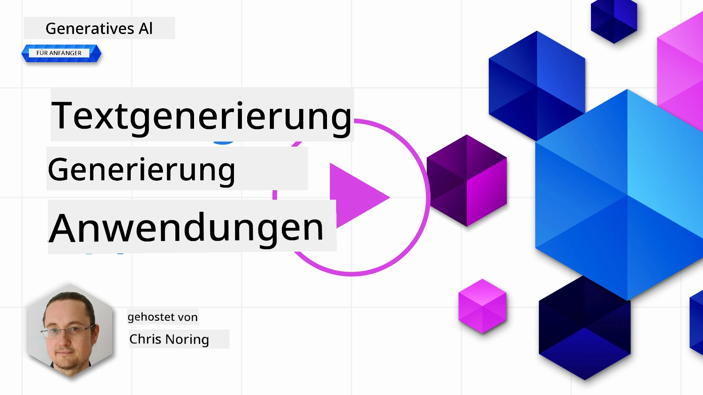

# Erstellen von Textgenerierungsanwendungen

[](https://youtu.be/0Y5Luf5sRQA?si=t_xVg0clnAI4oUFZ)

> _(Klicken Sie auf das obige Bild, um das Video zu dieser Lektion anzusehen)_

Bisher haben Sie in diesem Curriculum gesehen, dass es Kernkonzepte wie Prompts gibt und sogar eine ganze Disziplin namens "Prompt Engineering". Viele Tools, mit denen Sie interagieren können, wie ChatGPT, Office 365, Microsoft Power Platform und mehr, unterstützen Sie bei der Verwendung von Prompts, um etwas zu erreichen.

Um eine solche Erfahrung in eine App einzubauen, müssen Sie Konzepte wie Prompts, Completions verstehen und eine Bibliothek auswählen, mit der Sie arbeiten. Genau das lernen Sie in diesem Kapitel.

## Einführung

In diesem Kapitel werden Sie:

- Die openai-Bibliothek und ihre Kernkonzepte kennenlernen.
- Eine Textgenerierungs-App mit openai bauen.
- Verstehen, wie man Konzepte wie Prompt, Temperatur und Tokens verwendet, um eine Textgenerierungs-App zu erstellen.

## Lernziele

Am Ende dieser Lektion werden Sie in der Lage sein:

- Erklären, was eine Textgenerierungs-App ist.
- Eine Textgenerierungs-App mit openai bauen.
- Ihre App so konfigurieren, dass mehr oder weniger Tokens verwendet werden und auch die Temperatur ändern, um eine unterschiedliche Ausgabe zu erhalten.

## Was ist eine Textgenerierungs-App?

Normalerweise hat eine App, die Sie bauen, eine Art Benutzeroberfläche wie die folgende:

- Befehlsbasiert. Konsolen-Apps sind typische Apps, bei denen Sie einen Befehl eintippen und eine Aufgabe ausgeführt wird. Zum Beispiel ist `git` eine befehlsbasierte App.
- Benutzeroberfläche (UI). Manche Apps haben grafische Benutzeroberflächen (GUIs), bei denen Sie Schaltflächen anklicken, Text eingeben, Optionen auswählen und mehr.

### Konsolen- und UI-Apps sind eingeschränkt

Vergleichen Sie es mit einer befehlsbasierten App, bei der Sie einen Befehl eintippen:

- **Sie ist eingeschränkt**. Sie können nicht einfach beliebige Befehle eintippen, nur die, die die App unterstützt.
- **Sprachspezifisch**. Manche Apps unterstützen viele Sprachen, aber standardmäßig ist die App für eine bestimmte Sprache gebaut, auch wenn Sie zusätzliche Sprachunterstützung hinzufügen können.

### Vorteile von Textgenerierungs-Apps

Wie unterscheidet sich also eine Textgenerierungs-App?

Bei einer Textgenerierungs-App haben Sie mehr Flexibilität, Sie sind nicht auf eine Menge Befehle oder eine bestimmte Eingabesprache beschränkt. Stattdessen können Sie natürliche Sprache verwenden, um mit der App zu interagieren. Ein weiterer Vorteil ist, dass Sie bereits mit einer Datenquelle interagieren, die auf einem riesigen Korpus von Informationen trainiert wurde, während eine traditionelle App möglicherweise durch den Datenbankinhalt eingeschränkt ist.

### Was kann ich mit einer Textgenerierungs-App bauen?

Es gibt viele Dinge, die Sie bauen können. Zum Beispiel:

- **Einen Chatbot**. Ein Chatbot, der Fragen zu Themen wie Ihrem Unternehmen und dessen Produkten beantwortet, wäre eine gute Wahl.
- **Helfer**. LLMs sind hervorragend darin, Texte zusammenzufassen, Erkenntnisse aus Texten zu gewinnen, Texte wie Lebensläufe zu erstellen und mehr.
- **Codeassistent**. Je nachdem, welches Sprachmodell Sie verwenden, können Sie einen Codeassistenten bauen, der Ihnen beim Schreiben von Code hilft. Zum Beispiel können Sie Produkte wie GitHub Copilot sowie ChatGPT nutzen, um beim Programmieren zu helfen.

## Wie kann ich anfangen?

Nun, Sie müssen eine Möglichkeit finden, sich mit einem LLM zu integrieren, was normalerweise die folgenden zwei Ansätze beinhaltet:

- Verwenden Sie eine API. Hierbei erstellen Sie Webanfragen mit Ihrem Prompt und erhalten generierten Text zurück.
- Verwenden Sie eine Bibliothek. Bibliotheken kapseln die API-Aufrufe ein und machen die Nutzung leichter.

## Bibliotheken/SDKs

Es gibt einige bekannte Bibliotheken für die Arbeit mit LLMs wie:

- **openai**, diese Bibliothek erleichtert die Verbindung zu Ihrem Modell und das Senden von Prompts.

Dann gibt es Bibliotheken, die auf einer höheren Ebene operieren wie:

- **Langchain**. Langchain ist bekannt und unterstützt Python.
- **Semantic Kernel**. Semantic Kernel ist eine Bibliothek von Microsoft, die die Sprachen C#, Python und Java unterstützt.

## Erste App mit openai

Sehen wir uns an, wie wir unsere erste App bauen können, welche Bibliotheken wir benötigen, wie viel Aufwand erforderlich ist und so weiter.

### openai installieren

Es gibt viele Bibliotheken zum Interagieren mit OpenAI oder Azure OpenAI. Es ist möglich, zahlreiche Programmiersprachen zu verwenden, wie C#, Python, JavaScript, Java und mehr. Wir haben uns entschieden, die `openai` Python-Bibliothek zu verwenden, daher installieren wir sie mit `pip`.

```bash
pip install openai
```

### Eine Ressource erstellen

Sie müssen die folgenden Schritte ausführen:

- Erstellen Sie ein Konto bei Azure [https://azure.microsoft.com/free/](https://azure.microsoft.com/free/?WT.mc_id=academic-105485-koreyst).
- Erhalten Sie Zugriff auf Azure OpenAI. Gehen Sie zu [https://learn.microsoft.com/azure/ai-services/openai/overview#how-do-i-get-access-to-azure-openai](https://learn.microsoft.com/azure/ai-services/openai/overview#how-do-i-get-access-to-azure-openai?WT.mc_id=academic-105485-koreyst) und beantragen Sie Zugriff.

  > [!NOTE]
  > Zum Zeitpunkt des Schreibens müssen Sie Zugriff auf Azure OpenAI beantragen.

- Installieren Sie Python <https://www.python.org/>
- Erstellen Sie eine Azure OpenAI Service-Ressource. Diese Anleitung zeigt, wie man [eine Ressource erstellt](https://learn.microsoft.com/azure/ai-services/openai/how-to/create-resource?pivots=web-portal?WT.mc_id=academic-105485-koreyst).

### API-Schlüssel und Endpunkt finden

An diesem Punkt müssen Sie Ihrer `openai` Bibliothek mitteilen, welchen API-Schlüssel sie verwenden soll. Um Ihren API-Schlüssel zu finden, gehen Sie zum Abschnitt "Schlüssel und Endpunkt" Ihrer Azure OpenAI-Ressource und kopieren Sie den Wert von "Schlüssel 1".


Nun, da Sie diese Information kopiert haben, weisen wir die Bibliotheken an, sie zu verwenden.

> [!NOTE]
> Es ist ratsam, Ihren API-Schlüssel von Ihrem Code zu trennen. Sie können dies mit Umgebungsvariablen tun.
>
> - Setzen Sie die Umgebungsvariable `OPENAI_API_KEY` auf Ihren API-Schlüssel.
>   `export OPENAI_API_KEY='sk-...'`

### Azure-Konfiguration einrichten

Wenn Sie Azure OpenAI verwenden (jetzt Teil von Microsoft Foundry), so richten Sie die Konfiguration ein. Wir verwenden den Standard-`OpenAI`-Client, der auf den Azure OpenAI `/openai/v1/` Endpoint zeigt, der mit der Responses API funktioniert und keine `api_version` benötigt:

```python
import os
from openai import OpenAI

client = OpenAI(
    api_key=os.environ["AZURE_OPENAI_API_KEY"],
    base_url=f"{os.environ['AZURE_OPENAI_ENDPOINT'].rstrip('/')}/openai/v1/",
)
```

Oben setzen wir Folgendes:

- `api_key`, dies ist Ihr API-Schlüssel, den Sie im Azure Portal oder Microsoft Foundry Portal finden.
- `base_url`, dies ist Ihr Foundry-Ressourcenendpunkt mit angehängtem `/openai/v1/`. Der stabile v1-Endpunkt funktioniert sowohl mit OpenAI als auch Azure OpenAI ohne Verwaltung der `api_version`.

> [!NOTE] > `os.environ` liest Umgebungsvariablen aus. Sie können es verwenden, um Variablen wie `AZURE_OPENAI_API_KEY` und `AZURE_OPENAI_ENDPOINT` zu lesen. Setzen Sie diese Umgebungsvariablen im Terminal oder mit Bibliotheken wie `dotenv`.

## Text generieren

Der Weg, Text zu generieren, besteht darin, die Responses API über die Methode `responses.create` zu nutzen. Hier ein Beispiel:

```python
prompt = "Complete the following: Once upon a time there was a"

response = client.responses.create(
    model="gpt-4o-mini",  # dies ist Ihr Modellbereitstellungsname
    input=prompt,
    store=False,
)
print(response.output_text)
```

Im obigen Code erzeugen wir eine Antwort und übergeben das Modell, das wir verwenden möchten, sowie den Prompt. Dann geben wir den generierten Text über `response.output_text` aus.

### Mehrstufige Unterhaltungen

Die Responses API ist sowohl für Einzelrunden-Textgenerierung wie auch für mehrstufige Chatbots gut geeignet – Sie geben eine Liste von Nachrichten in `input` ein, um eine Konversation aufzubauen:

```python
from openai import OpenAI

client = OpenAI(api_key="sk-...")

response = client.responses.create(model="gpt-4o-mini", input="Hello world", store=False)
print(response.output_text)
```

Mehr zu dieser Funktionalität in einem kommenden Kapitel.

## Übung – Ihre erste Textgenerierungs-App

Jetzt, da wir gelernt haben, wie man openai einrichtet und konfiguriert, ist es Zeit, Ihre erste Textgenerierungs-App zu bauen. Folgen Sie diesen Schritten:

1. Erstellen Sie eine virtuelle Umgebung und installieren Sie openai:

   ```bash
   python -m venv venv
   source venv/bin/activate
   pip install openai
   ```

   > [!NOTE]
   > Wenn Sie Windows verwenden, tippen Sie `venv\Scripts\activate` anstelle von `source venv/bin/activate`.

   > [!NOTE]
   > Finden Sie Ihren Azure OpenAI-Schlüssel, indem Sie zu [https://portal.azure.com/](https://portal.azure.com/?WT.mc_id=academic-105485-koreyst) gehen, nach `Open AI` suchen, die `Open AI resource` auswählen und dann `Keys and Endpoint` auswählen, um den Wert von `Key 1` zu kopieren.

1. Erstellen Sie eine Datei _app.py_ und fügen Sie folgenden Code hinein:

   ```python
   import os
   from openai import OpenAI

   client = OpenAI(
       api_key="<replace this value with your Azure OpenAI key>",
       base_url="<endpoint found in Azure Portal>/openai/v1/",
   )
   deployment_name = "<deployment name>"

   # Fügen Sie Ihren Abschlusscode hinzu
   prompt = "Complete the following: Once upon a time there was a"

   # Machen Sie eine Anfrage mit der Responses-API
   response = client.responses.create(model=deployment_name, input=prompt, store=False)

   # Antwort ausdrucken
   print(response.output_text)
   ```

   > [!NOTE]
   > Wenn Sie reines OpenAI (kein Azure) verwenden, benutzen Sie `client = OpenAI(api_key="<ersetzen Sie diesen Wert durch Ihren OpenAI-Schlüssel>")` (ohne `base_url`) und übergeben Sie einen Modellnamen wie `gpt-4o-mini` anstelle eines Bereitstellungsnamens.

   Sie sollten eine Ausgabe wie die folgende sehen:

   ```output
    very unhappy _____.

   Once upon a time there was a very unhappy mermaid.
   ```

## Verschiedene Arten von Prompts für verschiedene Zwecke

Nun haben Sie gesehen, wie man Text mit einem Prompt generiert. Sie haben sogar ein Programm zum Laufen gebracht, das Sie modifizieren und ändern können, um verschiedene Textarten zu generieren.

Prompts können für alle möglichen Aufgaben verwendet werden. Zum Beispiel:

- **Einen Texttyp generieren**. Zum Beispiel können Sie ein Gedicht, Fragen für ein Quiz usw. generieren.
- **Informationen nachschlagen**. Sie können Prompts verwenden, um Informationen wie im folgenden Beispiel zu suchen: 'Was bedeutet CORS in der Webentwicklung?'.
- **Code generieren**. Sie können Prompts verwenden, um Code zu generieren, z.B. eine reguläre Expression für die Validierung von E-Mails oder sogar ein komplettes Programm, wie eine Webanwendung.

## Ein praktischerer Anwendungsfall: Ein Rezeptgenerator

Stellen Sie sich vor, Sie haben Zutaten zu Hause und wollen etwas kochen. Dafür brauchen Sie ein Rezept. Eine Möglichkeit, Rezepte zu finden, ist eine Suchmaschine zu verwenden oder Sie nutzen ein LLM dafür.

Sie könnten einen Prompt so schreiben:

> "Zeige mir 5 Rezepte für ein Gericht mit den folgenden Zutaten: Hähnchen, Kartoffeln und Karotten. Listen Sie zu jedem Rezept alle verwendeten Zutaten auf."

Basierend auf diesem Prompt könnten Sie eine Antwort ähnlich der folgenden erhalten:

```output
1. Roasted Chicken and Vegetables:
Ingredients:
- 4 chicken thighs
- 2 potatoes, cut into cubes
- 2 carrots, cut into cubes
- 2 tablespoons olive oil
- 2 cloves garlic, minced
- 1 teaspoon dried thyme
- 1 teaspoon dried oregano
- Salt and pepper, to taste

2. Chicken and Potato Stew:
Ingredients:
- 2 tablespoons olive oil
- 1 onion, diced
- 2 cloves garlic, minced
- 2 chicken breasts, cut into cubes
- 2 potatoes, cut into cubes
- 2 carrots, cut into cubes
- 1 teaspoon dried oregano
- 1 teaspoon dried thyme
- 1 cup chicken broth
- Salt and pepper, to taste

3. Chicken and Potato Bake:
Ingredients:
- 2 tablespoons olive oil
- 2 chicken breasts, cut into cubes
- 2 potatoes, cut into cubes
- 2 carrots, cut into cubes
- 1 onion, diced
- 2 cloves garlic, minced
- 1 teaspoon dried oregano
- 1 teaspoon dried thyme
- 1 cup chicken broth
- Salt and pepper, to taste

4. Chicken and Potato Soup:
Ingredients:
- 2 tablespoons olive oil
- 1 onion, diced
- 2 cloves garlic, minced
- 2 chicken breasts, cut into cubes
- 2 potatoes, cut into cubes
- 2 carrots, cut into cubes
- 1 teaspoon dried oregano
- 1 teaspoon dried thyme
- 4 cups chicken broth
- Salt and pepper, to taste

5. Chicken and Potato Hash:
Ingredients:
- 2 tablespoons olive oil
- 2 chicken breasts, cut into cubes
- 2 potatoes, cut into cubes
- 2 carrots, cut into cubes
- 1 onion, diced
- 2 cloves garlic, minced
- 1 teaspoon dried oregano
```

Dieses Ergebnis ist großartig, ich weiß, was ich kochen kann. An dieser Stelle könnten nützliche Verbesserungen sein:

- Zutaten herausfiltern, die ich nicht mag oder auf die ich allergisch reagiere.
- Eine Einkaufsliste erzeugen, falls ich nicht alle Zutaten zu Hause habe.

Für die obigen Fälle fügen wir einen zusätzlichen Prompt hinzu:

> "Bitte entfernen Sie Rezepte mit Knoblauch, da ich allergisch darauf reagiere, und ersetzen Sie ihn durch etwas anderes. Erstellen Sie außerdem bitte eine Einkaufsliste für die Rezepte, wobei Sie berücksichtigen, dass ich bereits Hähnchen, Kartoffeln und Karotten zu Hause habe."

Jetzt haben Sie ein neues Ergebnis, und zwar:

```output
1. Roasted Chicken and Vegetables:
Ingredients:
- 4 chicken thighs
- 2 potatoes, cut into cubes
- 2 carrots, cut into cubes
- 2 tablespoons olive oil
- 1 teaspoon dried thyme
- 1 teaspoon dried oregano
- Salt and pepper, to taste

2. Chicken and Potato Stew:
Ingredients:
- 2 tablespoons olive oil
- 1 onion, diced
- 2 chicken breasts, cut into cubes
- 2 potatoes, cut into cubes
- 2 carrots, cut into cubes
- 1 teaspoon dried oregano
- 1 teaspoon dried thyme
- 1 cup chicken broth
- Salt and pepper, to taste

3. Chicken and Potato Bake:
Ingredients:
- 2 tablespoons olive oil
- 2 chicken breasts, cut into cubes
- 2 potatoes, cut into cubes
- 2 carrots, cut into cubes
- 1 onion, diced
- 1 teaspoon dried oregano
- 1 teaspoon dried thyme
- 1 cup chicken broth
- Salt and pepper, to taste

4. Chicken and Potato Soup:
Ingredients:
- 2 tablespoons olive oil
- 1 onion, diced
- 2 chicken breasts, cut into cubes
- 2 potatoes, cut into cubes
- 2 carrots, cut into cubes
- 1 teaspoon dried oregano
- 1 teaspoon dried thyme
- 4 cups chicken broth
- Salt and pepper, to taste

5. Chicken and Potato Hash:
Ingredients:
- 2 tablespoons olive oil
- 2 chicken breasts, cut into cubes
- 2 potatoes, cut into cubes
- 2 carrots, cut into cubes
- 1 onion, diced
- 1 teaspoon dried oregano

Shopping List:
- Olive oil
- Onion
- Thyme
- Oregano
- Salt
- Pepper
```

Das sind Ihre fünf Rezepte, bei denen kein Knoblauch enthalten ist, und Sie haben auch eine Einkaufsliste, die berücksichtigt, was Sie bereits zu Hause haben.

## Übung – bauen Sie einen Rezeptgenerator

Jetzt, da wir ein Szenario durchgespielt haben, schreiben wir Code, der zum demonstrierten Szenario passt. Befolgen Sie dazu diese Schritte:

1. Verwenden Sie die bestehende _app.py_-Datei als Ausgangspunkt.
1. Suchen Sie die Variable `prompt` und ändern Sie den Code folgendermaßen:

   ```python
   prompt = "Show me 5 recipes for a dish with the following ingredients: chicken, potatoes, and carrots. Per recipe, list all the ingredients used"
   ```

   Wenn Sie nun den Code ausführen, sollten Sie eine ähnliche Ausgabe sehen:

   ```output
   -Chicken Stew with Potatoes and Carrots: 3 tablespoons oil, 1 onion, chopped, 2 cloves garlic, minced, 1 carrot, peeled and chopped, 1 potato, peeled and chopped, 1 bay leaf, 1 thyme sprig, 1/2 teaspoon salt, 1/4 teaspoon black pepper, 1 1/2 cups chicken broth, 1/2 cup dry white wine, 2 tablespoons chopped fresh parsley, 2 tablespoons unsalted butter, 1 1/2 pounds boneless, skinless chicken thighs, cut into 1-inch pieces
   -Oven-Roasted Chicken with Potatoes and Carrots: 3 tablespoons extra-virgin olive oil, 1 tablespoon Dijon mustard, 1 tablespoon chopped fresh rosemary, 1 tablespoon chopped fresh thyme, 4 cloves garlic, minced, 1 1/2 pounds small red potatoes, quartered, 1 1/2 pounds carrots, quartered lengthwise, 1/2 teaspoon salt, 1/4 teaspoon black pepper, 1 (4-pound) whole chicken
   -Chicken, Potato, and Carrot Casserole: cooking spray, 1 large onion, chopped, 2 cloves garlic, minced, 1 carrot, peeled and shredded, 1 potato, peeled and shredded, 1/2 teaspoon dried thyme leaves, 1/4 teaspoon salt, 1/4 teaspoon black pepper, 2 cups fat-free, low-sodium chicken broth, 1 cup frozen peas, 1/4 cup all-purpose flour, 1 cup 2% reduced-fat milk, 1/4 cup grated Parmesan cheese

   -One Pot Chicken and Potato Dinner: 2 tablespoons olive oil, 1 pound boneless, skinless chicken thighs, cut into 1-inch pieces, 1 large onion, chopped, 3 cloves garlic, minced, 1 carrot, peeled and chopped, 1 potato, peeled and chopped, 1 bay leaf, 1 thyme sprig, 1/2 teaspoon salt, 1/4 teaspoon black pepper, 2 cups chicken broth, 1/2 cup dry white wine

   -Chicken, Potato, and Carrot Curry: 1 tablespoon vegetable oil, 1 large onion, chopped, 2 cloves garlic, minced, 1 carrot, peeled and chopped, 1 potato, peeled and chopped, 1 teaspoon ground coriander, 1 teaspoon ground cumin, 1/2 teaspoon ground turmeric, 1/2 teaspoon ground ginger, 1/4 teaspoon cayenne pepper, 2 cups chicken broth, 1/2 cup dry white wine, 1 (15-ounce) can chickpeas, drained and rinsed, 1/2 cup raisins, 1/2 cup chopped fresh cilantro
   ```

   > HINWEIS: Ihr LLM ist nicht deterministisch, daher können die Ergebnisse bei jedem Programmlauf unterschiedlich sein.

   Großartig, sehen wir uns an, wie wir die Dinge verbessern können. Zur Verbesserung soll der Code flexibler werden, sodass die Zutaten und die Anzahl der Rezepte angepasst werden können.

1. Ändern wir den Code folgendermaßen:

   ```python
   no_recipes = input("No of recipes (for example, 5): ")

   ingredients = input("List of ingredients (for example, chicken, potatoes, and carrots): ")

   # die Anzahl der Rezepte in die Eingabeaufforderung und Zutaten interpolieren
   prompt = f"Show me {no_recipes} recipes for a dish with the following ingredients: {ingredients}. Per recipe, list all the ingredients used"
   ```

   Ein Testlauf des Codes könnte dann so aussehen:

   ```output
   No of recipes (for example, 5): 3
   List of ingredients (for example, chicken, potatoes, and carrots): milk,strawberries

   -Strawberry milk shake: milk, strawberries, sugar, vanilla extract, ice cubes
   -Strawberry shortcake: milk, flour, baking powder, sugar, salt, unsalted butter, strawberries, whipped cream
   -Strawberry milk: milk, strawberries, sugar, vanilla extract
   ```

### Verbesserung durch Filtern und Einkaufsliste

Wir haben jetzt eine funktionierende App, die Rezepte erzeugt und flexibel ist, weil sie Eingaben vom Benutzer verwendet, sowohl zur Anzahl der Rezepte als auch zu den verwendeten Zutaten.

Um sie weiter zu verbessern, wollen wir Folgendes hinzufügen:

- **Zutaten filtern**. Wir wollen Zutaten herausfiltern können, die wir nicht mögen oder auf die wir allergisch sind. Um diese Änderung umzusetzen, können wir unseren bestehenden Prompt bearbeiten und am Ende eine Filterbedingung hinzufügen, etwa so:

  ```python
  filter = input("Filter (for example, vegetarian, vegan, or gluten-free): ")

  prompt = f"Show me {no_recipes} recipes for a dish with the following ingredients: {ingredients}. Per recipe, list all the ingredients used, no {filter}"
  ```

  Oben fügen wir `{filter}` ans Ende des Prompts an und erfassen ebenfalls den Filterwert vom Nutzer.

  Ein Beispiel für die Eingabe beim Ausführen des Programms könnte nun so aussehen:

  ```output
  No of recipes (for example, 5): 3
  List of ingredients (for example, chicken, potatoes, and carrots): onion,milk
  Filter (for example, vegetarian, vegan, or gluten-free): no milk

  1. French Onion Soup

  Ingredients:

  -1 large onion, sliced
  -3 cups beef broth
  -1 cup milk
  -6 slices french bread
  -1/4 cup shredded Parmesan cheese
  -1 tablespoon butter
  -1 teaspoon dried thyme
  -1/4 teaspoon salt
  -1/4 teaspoon black pepper

  Instructions:

  1. In a large pot, sauté onions in butter until golden brown.
  2. Add beef broth, milk, thyme, salt, and pepper. Bring to a boil.
  3. Reduce heat and simmer for 10 minutes.
  4. Place french bread slices on soup bowls.
  5. Ladle soup over bread.
  6. Sprinkle with Parmesan cheese.

  2. Onion and Potato Soup

  Ingredients:

  -1 large onion, chopped
  -2 cups potatoes, diced
  -3 cups vegetable broth
  -1 cup milk
  -1/4 teaspoon black pepper

  Instructions:

  1. In a large pot, sauté onions in butter until golden brown.
  2. Add potatoes, vegetable broth, milk, and pepper. Bring to a boil.
  3. Reduce heat and simmer for 10 minutes.
  4. Serve hot.

  3. Creamy Onion Soup

  Ingredients:

  -1 large onion, chopped
  -3 cups vegetable broth
  -1 cup milk
  -1/4 teaspoon black pepper
  -1/4 cup all-purpose flour
  -1/2 cup shredded Parmesan cheese

  Instructions:

  1. In a large pot, sauté onions in butter until golden brown.
  2. Add vegetable broth, milk, and pepper. Bring to a boil.
  3. Reduce heat and simmer for 10 minutes.
  4. In a small bowl, whisk together flour and Parmesan cheese until smooth.
  5. Add to soup and simmer for an additional 5 minutes, or until soup has thickened.
  ```

  Wie Sie sehen, wurden Rezepte mit Milch herausgefiltert. Aber wenn Sie laktoseintolerant sind, möchten Sie vielleicht auch Rezepte mit Käse herausfiltern, daher ist es wichtig, klar zu sein.


- **Erstelle eine Einkaufsliste**. Wir möchten eine Einkaufsliste erstellen, dabei berücksichtigen, was wir bereits zu Hause haben.

  Für diese Funktionalität könnten wir entweder versuchen, alles in einem Prompt zu lösen, oder wir teilen es in zwei Prompts auf. Versuchen wir Letzteres. Hier schlagen wir vor, einen zusätzlichen Prompt hinzuzufügen, aber damit das funktioniert, müssen wir das Ergebnis des ersten Prompts als Kontext zum zweiten Prompt hinzufügen.

  Finde den Teil im Code, der das Ergebnis des ersten Prompts ausgibt, und füge den folgenden Code darunter ein:

  ```python
  old_prompt_result = response.output_text
  prompt = "Produce a shopping list for the generated recipes and please don't include ingredients that I already have."

  new_prompt = f"{old_prompt_result} {prompt}"
  response = client.responses.create(model=deployment_name, input=new_prompt, max_output_tokens=1200, store=False)

  # Antwort drucken
  print("Shopping list:")
  print(response.output_text)
  ```

  Beachte Folgendes:

  1. Wir erstellen einen neuen Prompt, indem wir das Ergebnis des ersten Prompts an den neuen Prompt anhängen:

     ```python
     new_prompt = f"{old_prompt_result} {prompt}"
     ```

  1. Wir machen eine neue Anfrage, berücksichtigen dabei aber auch die Anzahl der Tokens, die wir im ersten Prompt angefragt hatten, sodass wir diesmal `max_output_tokens` auf 1200 setzen.

     ```python
     response = client.responses.create(model=deployment_name, input=new_prompt, max_output_tokens=1200, store=False)
     ```

     Wenn wir diesen Code ausprobieren, erhalten wir nun folgendes Ergebnis:

     ```output
     No of recipes (for example, 5): 2
     List of ingredients (for example, chicken, potatoes, and carrots): apple,flour
     Filter (for example, vegetarian, vegan, or gluten-free): sugar


     -Apple and flour pancakes: 1 cup flour, 1/2 tsp baking powder, 1/2 tsp baking soda, 1/4 tsp salt, 1 tbsp sugar, 1 egg, 1 cup buttermilk or sour milk, 1/4 cup melted butter, 1 Granny Smith apple, peeled and grated
     -Apple fritters: 1-1/2 cups flour, 1 tsp baking powder, 1/4 tsp salt, 1/4 tsp baking soda, 1/4 tsp nutmeg, 1/4 tsp cinnamon, 1/4 tsp allspice, 1/4 cup sugar, 1/4 cup vegetable shortening, 1/4 cup milk, 1 egg, 2 cups shredded, peeled apples
     Shopping list:
     -Flour, baking powder, baking soda, salt, sugar, egg, buttermilk, butter, apple, nutmeg, cinnamon, allspice
     ```

## Verbessere dein Setup

Was wir bisher haben, ist funktionierender Code, aber es gibt einige Anpassungen, die wir machen sollten, um die Sache weiter zu verbessern. Einige Dinge, die wir machen sollten, sind:

- **Trenne Geheimnisse vom Code**, wie den API-Schlüssel. Geheimnisse gehören nicht in den Code und sollten an einem sicheren Ort gespeichert werden. Um Geheimnisse vom Code zu trennen, können wir Umgebungsvariablen verwenden und Bibliotheken wie `python-dotenv`, um sie aus einer Datei zu laden. So könnte das im Code aussehen:

  1. Erstelle eine `.env`-Datei mit folgendem Inhalt:

     ```bash
     OPENAI_API_KEY=sk-...
     ```

     > Hinweis: Für Azure OpenAI in Microsoft Foundry musst du stattdessen folgende Umgebungsvariablen setzen:

     ```bash
     AZURE_OPENAI_API_KEY=<replace>
     AZURE_OPENAI_ENDPOINT=<replace>
     AZURE_OPENAI_API_VERSION=2024-10-21
     ```

     Im Code würdest du die Umgebungsvariablen so laden:

     ```python
     import os
     from dotenv import load_dotenv
     from openai import OpenAI

     load_dotenv()

     client = OpenAI(api_key=os.environ["OPENAI_API_KEY"])
     ```

- **Ein Wort zur Token-Länge**. Wir sollten berücksichtigen, wie viele Tokens wir brauchen, um den gewünschten Text zu erzeugen. Tokens kosten Geld, daher sollten wir, wo möglich, sparsam mit der Anzahl der verwendeten Tokens umgehen. Zum Beispiel, können wir den Prompt so formulieren, dass wir weniger Tokens verwenden?

  Um die verwendeten Tokens zu ändern, kannst du den Parameter `max_output_tokens` benutzen. Wenn du beispielsweise 100 Tokens verwenden möchtest, dann machst du das so:

  ```python
  response = client.responses.create(model=deployment, input=prompt, max_output_tokens=100, store=False)
  ```

- **Experimentieren mit der Temperatur**. Die Temperatur haben wir bisher nicht erwähnt, sie ist aber ein wichtiger Kontext dafür, wie unser Programm arbeitet. Je höher der Temperaturwert, desto zufälliger ist die Ausgabe. Umgekehrt gilt: Je niedriger der Temperaturwert, desto vorhersehbarer ist die Ausgabe. Überlege, ob du Variation in deiner Ausgabe haben möchtest oder nicht.

  Um die Temperatur zu ändern, kannst du den Parameter `temperature` verwenden. Zum Beispiel, wenn du eine Temperatur von 0,5 nutzen möchtest, machst du es so:

  ```python
  response = client.responses.create(model=deployment, input=prompt, temperature=0.5, store=False)
  ```

  > Hinweis: Je näher an 1,0, desto vielfältiger die Ausgabe.

## Aufgabe

Für diese Aufgabe kannst du wählen, was du bauen möchtest.

Hier einige Vorschläge:

- Optimiere die Rezeptgenerator-App weiter. Experimentiere mit Temperaturwerten und Prompts, um zu sehen, was du erstellen kannst.
- Baue einen "Study Buddy". Diese App sollte in der Lage sein, Fragen zu einem Thema zu beantworten, zum Beispiel Python. Du könntest Prompts haben wie „Was ist ein bestimmtes Thema in Python?“, oder einen Prompt, der sagt, zeig mir Code zu einem bestimmten Thema, etc.
- History Bot: Lass Geschichte lebendig werden, weise den Bot an, eine bestimmte historische Figur zu spielen und stelle ihm Fragen zu Leben und Zeiten dieser Person.

## Lösung

### Study Buddy

Unten ist ein Starter-Prompt, schau, wie du ihn verwenden und nach Belieben anpassen kannst.

```text
- "You're an expert on the Python language

    Suggest a beginner lesson for Python in the following format:

    Format:
    - concepts:
    - brief explanation of the lesson:
    - exercise in code with solutions"
```

### History Bot

Hier sind einige Prompts, die du verwenden könntest:

```text
- "You are Abe Lincoln, tell me about yourself in 3 sentences, and respond using grammar and words like Abe would have used"
- "You are Abe Lincoln, respond using grammar and words like Abe would have used:

   Tell me about your greatest accomplishments, in 300 words"
```

## Wissensabfrage

Was bewirkt das Konzept der Temperatur?

1. Sie steuert, wie zufällig die Ausgabe ist.
1. Sie steuert, wie groß die Antwort ist.
1. Sie steuert, wie viele Tokens verwendet werden.

## 🚀 Herausforderung

Arbeite an der Aufgabe und variiere die Temperatur, setze sie auf 0, 0,5 und 1. Denke daran, dass 0 die geringste Variation und 1 die höchste Variation bedeutet. Welcher Wert eignet sich am besten für deine App?

## Großartige Arbeit! Setze dein Lernen fort

Nach Abschluss dieser Lektion, sieh dir unsere [Generative AI Learning collection](https://aka.ms/genai-collection?WT.mc_id=academic-105485-koreyst) an, um dein Wissen im Bereich Generative AI weiter zu vertiefen!

Gehe zu Lektion 7, wo wir uns ansehen, wie man [Chat-Anwendungen baut](../07-building-chat-applications/README.md?WT.mc_id=academic-105485-koreyst)!

---

<!-- CO-OP TRANSLATOR DISCLAIMER START -->
**Haftungsausschluss**:
Dieses Dokument wurde mit dem KI-Übersetzungsdienst [Co-op Translator](https://github.com/Azure/co-op-translator) übersetzt. Obwohl wir uns um Genauigkeit bemühen, beachten Sie bitte, dass automatisierte Übersetzungen Fehler oder Ungenauigkeiten enthalten können. Das Originaldokument in seiner Ursprungssprache gilt als maßgebliche Quelle. Bei kritischen Informationen wird eine professionelle menschliche Übersetzung empfohlen. Wir übernehmen keine Haftung für Missverständnisse oder Fehlinterpretationen, die aus der Verwendung dieser Übersetzung entstehen.
<!-- CO-OP TRANSLATOR DISCLAIMER END -->