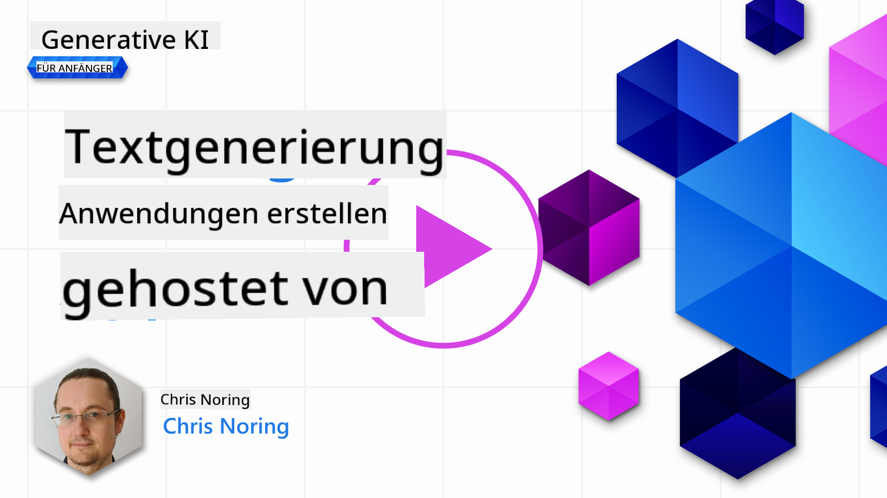

<!--
CO_OP_TRANSLATOR_METADATA:
{
  "original_hash": "df027997f1448323d6159b78a1b669bf",
  "translation_date": "2025-10-17T22:53:13+00:00",
  "source_file": "06-text-generation-apps/README.md",
  "language_code": "de"
}
-->
# Erstellung von Anwendungen zur Textgenerierung

[](https://youtu.be/0Y5Luf5sRQA?si=t_xVg0clnAI4oUFZ)

> _(Klicken Sie auf das Bild oben, um das Video zu dieser Lektion anzusehen)_

Im Verlauf dieses Lehrplans haben Sie bereits festgestellt, dass es grundlegende Konzepte wie Prompts gibt und sogar eine ganze Disziplin namens "Prompt Engineering". Viele Tools, mit denen Sie interagieren können, wie ChatGPT, Office 365, Microsoft Power Platform und mehr, unterstützen Sie dabei, Prompts zu verwenden, um etwas zu erreichen.

Um eine solche Erfahrung in eine App einzubinden, müssen Sie Konzepte wie Prompts, Completions verstehen und eine geeignete Bibliothek auswählen. Genau das werden Sie in diesem Kapitel lernen.

## Einführung

In diesem Kapitel werden Sie:

- Die openai-Bibliothek und ihre Kernkonzepte kennenlernen.
- Eine Textgenerierungs-App mit openai erstellen.
- Verstehen, wie Sie Konzepte wie Prompt, Temperatur und Tokens nutzen können, um eine Textgenerierungs-App zu erstellen.

## Lernziele

Am Ende dieser Lektion werden Sie in der Lage sein:

- Erklären, was eine Textgenerierungs-App ist.
- Eine Textgenerierungs-App mit openai erstellen.
- Ihre App so konfigurieren, dass sie mehr oder weniger Tokens verwendet und die Temperatur ändert, um unterschiedliche Ergebnisse zu erzielen.

## Was ist eine Textgenerierungs-App?

Normalerweise hat eine App, die Sie erstellen, eine Art Benutzeroberfläche wie die folgende:

- Befehlsbasiert. Konsolenanwendungen sind typische Apps, bei denen Sie einen Befehl eingeben und eine Aufgabe ausgeführt wird. Zum Beispiel ist `git` eine befehlsbasierte App.
- Benutzeroberfläche (UI). Einige Apps haben grafische Benutzeroberflächen (GUIs), bei denen Sie Schaltflächen anklicken, Text eingeben, Optionen auswählen und mehr.

### Konsolen- und UI-Apps sind begrenzt

Vergleichen Sie dies mit einer befehlsbasierten App, bei der Sie einen Befehl eingeben:

- **Es ist begrenzt**. Sie können nicht einfach jeden beliebigen Befehl eingeben, sondern nur die, die die App unterstützt.
- **Sprachspezifisch**. Einige Apps unterstützen viele Sprachen, aber standardmäßig ist die App für eine bestimmte Sprache entwickelt, auch wenn Sie weitere Sprachunterstützung hinzufügen können.

### Vorteile von Textgenerierungs-Apps

Wie unterscheidet sich also eine Textgenerierungs-App?

In einer Textgenerierungs-App haben Sie mehr Flexibilität, Sie sind nicht auf eine Reihe von Befehlen oder eine bestimmte Eingabesprache beschränkt. Stattdessen können Sie natürliche Sprache verwenden, um mit der App zu interagieren. Ein weiterer Vorteil ist, dass Sie bereits mit einer Datenquelle interagieren, die auf einem umfangreichen Informationskorpus trainiert wurde, während eine traditionelle App möglicherweise auf das beschränkt ist, was in einer Datenbank enthalten ist.

### Was kann ich mit einer Textgenerierungs-App erstellen?

Es gibt viele Dinge, die Sie erstellen können. Zum Beispiel:

- **Einen Chatbot**. Ein Chatbot, der Fragen zu Themen wie Ihrem Unternehmen und seinen Produkten beantwortet, könnte eine gute Wahl sein.
- **Helfer**. LLMs eignen sich hervorragend für Aufgaben wie das Zusammenfassen von Texten, das Gewinnen von Erkenntnissen aus Texten, das Erstellen von Texten wie Lebensläufen und mehr.
- **Code-Assistent**. Abhängig vom verwendeten Sprachmodell können Sie einen Code-Assistenten erstellen, der Ihnen beim Schreiben von Code hilft. Zum Beispiel können Sie ein Produkt wie GitHub Copilot sowie ChatGPT verwenden, um Ihnen beim Schreiben von Code zu helfen.

## Wie kann ich anfangen?

Nun, Sie müssen einen Weg finden, sich mit einem LLM zu integrieren, was normalerweise die folgenden zwei Ansätze umfasst:

- Verwendung einer API. Hierbei erstellen Sie Webanfragen mit Ihrem Prompt und erhalten generierten Text zurück.
- Verwendung einer Bibliothek. Bibliotheken helfen dabei, die API-Aufrufe zu kapseln und die Nutzung zu vereinfachen.

## Bibliotheken/SDKs

Es gibt einige bekannte Bibliotheken für die Arbeit mit LLMs, wie:

- **openai**, diese Bibliothek erleichtert die Verbindung zu Ihrem Modell und das Senden von Prompts.

Dann gibt es Bibliotheken, die auf einer höheren Ebene arbeiten, wie:

- **Langchain**. Langchain ist bekannt und unterstützt Python.
- **Semantic Kernel**. Semantic Kernel ist eine Bibliothek von Microsoft, die die Sprachen C#, Python und Java unterstützt.

## Erste App mit openai

Schauen wir uns an, wie wir unsere erste App erstellen können, welche Bibliotheken wir benötigen, wie viel erforderlich ist und so weiter.

### openai installieren

Es gibt viele Bibliotheken, um mit OpenAI oder Azure OpenAI zu interagieren. Es ist auch möglich, zahlreiche Programmiersprachen wie C#, Python, JavaScript, Java und mehr zu verwenden. Wir haben uns entschieden, die Python-Bibliothek `openai` zu verwenden, daher installieren wir sie mit `pip`.

```bash
pip install openai
```

### Eine Ressource erstellen

Sie müssen die folgenden Schritte ausführen:

- Erstellen Sie ein Konto bei Azure [https://azure.microsoft.com/free/](https://azure.microsoft.com/free/?WT.mc_id=academic-105485-koreyst).
- Beantragen Sie Zugriff auf Azure OpenAI. Gehen Sie zu [https://learn.microsoft.com/azure/ai-services/openai/overview#how-do-i-get-access-to-azure-openai](https://learn.microsoft.com/azure/ai-services/openai/overview#how-do-i-get-access-to-azure-openai?WT.mc_id=academic-105485-koreyst) und beantragen Sie den Zugriff.

  > [!NOTE]
  > Zum Zeitpunkt des Schreibens müssen Sie den Zugriff auf Azure OpenAI beantragen.

- Installieren Sie Python <https://www.python.org/>
- Erstellen Sie eine Azure OpenAI Service-Ressource. Siehe diese Anleitung, wie Sie [eine Ressource erstellen](https://learn.microsoft.com/azure/ai-services/openai/how-to/create-resource?pivots=web-portal?WT.mc_id=academic-105485-koreyst).

### API-Schlüssel und Endpunkt finden

An diesem Punkt müssen Sie Ihrer `openai`-Bibliothek mitteilen, welchen API-Schlüssel sie verwenden soll. Um Ihren API-Schlüssel zu finden, gehen Sie zum Abschnitt "Keys and Endpoint" Ihrer Azure OpenAI-Ressource und kopieren Sie den Wert von "Key 1".


Nachdem Sie diese Informationen kopiert haben, lassen Sie uns die Bibliotheken anweisen, sie zu verwenden.

> [!NOTE]
> Es ist sinnvoll, Ihren API-Schlüssel von Ihrem Code zu trennen. Sie können dies tun, indem Sie Umgebungsvariablen verwenden.
>
> - Setzen Sie die Umgebungsvariable `OPENAI_API_KEY` auf Ihren API-Schlüssel.
>   `export OPENAI_API_KEY='sk-...'`

### Azure-Konfiguration einrichten

Wenn Sie Azure OpenAI verwenden, richten Sie die Konfiguration wie folgt ein:

```python
openai.api_type = 'azure'
openai.api_key = os.environ["OPENAI_API_KEY"]
openai.api_version = '2023-05-15'
openai.api_base = os.getenv("API_BASE")
```

Hier setzen wir Folgendes:

- `api_type` auf `azure`. Dies weist die Bibliothek an, Azure OpenAI und nicht OpenAI zu verwenden.
- `api_key`, das ist Ihr API-Schlüssel, den Sie im Azure-Portal finden.
- `api_version`, das ist die Version der API, die Sie verwenden möchten. Zum Zeitpunkt des Schreibens ist die neueste Version `2023-05-15`.
- `api_base`, das ist der Endpunkt der API. Sie finden ihn im Azure-Portal neben Ihrem API-Schlüssel.

> [!NOTE] > `os.getenv` ist eine Funktion, die Umgebungsvariablen liest. Sie können sie verwenden, um Umgebungsvariablen wie `OPENAI_API_KEY` und `API_BASE` zu lesen. Setzen Sie diese Umgebungsvariablen in Ihrem Terminal oder verwenden Sie eine Bibliothek wie `dotenv`.

## Text generieren

Um Text zu generieren, verwenden Sie die Klasse `Completion`. Hier ist ein Beispiel:

```python
prompt = "Complete the following: Once upon a time there was a"

completion = openai.Completion.create(model="davinci-002", prompt=prompt)
print(completion.choices[0].text)
```

Im obigen Code erstellen wir ein Completion-Objekt und übergeben das Modell, das wir verwenden möchten, sowie den Prompt. Anschließend drucken wir den generierten Text aus.

### Chat-Completions

Bisher haben Sie gesehen, wie wir `Completion` verwendet haben, um Text zu generieren. Es gibt jedoch eine andere Klasse namens `ChatCompletion`, die besser für Chatbots geeignet ist. Hier ist ein Beispiel für ihre Verwendung:

```python
import openai

openai.api_key = "sk-..."

completion = openai.ChatCompletion.create(model="gpt-3.5-turbo", messages=[{"role": "user", "content": "Hello world"}])
print(completion.choices[0].message.content)
```

Mehr zu dieser Funktionalität in einem kommenden Kapitel.

## Übung - Ihre erste Textgenerierungs-App

Nachdem wir nun gelernt haben, wie man openai einrichtet und konfiguriert, ist es Zeit, Ihre erste Textgenerierungs-App zu erstellen. Um Ihre App zu erstellen, führen Sie die folgenden Schritte aus:

1. Erstellen Sie eine virtuelle Umgebung und installieren Sie openai:

   ```bash
   python -m venv venv
   source venv/bin/activate
   pip install openai
   ```

   > [!NOTE]
   > Wenn Sie Windows verwenden, geben Sie `venv\Scripts\activate` anstelle von `source venv/bin/activate` ein.

   > [!NOTE]
   > Finden Sie Ihren Azure OpenAI-Schlüssel, indem Sie zu [https://portal.azure.com/](https://portal.azure.com/?WT.mc_id=academic-105485-koreyst) gehen, nach `Open AI` suchen, die `Open AI resource` auswählen und dann `Keys and Endpoint` auswählen und den Wert von `Key 1` kopieren.

1. Erstellen Sie eine Datei namens _app.py_ und fügen Sie den folgenden Code ein:

   ```python
   import openai

   openai.api_key = "<replace this value with your open ai key or Azure OpenAI key>"

   openai.api_type = 'azure'
   openai.api_version = '2023-05-15'
   openai.api_base = "<endpoint found in Azure Portal where your API key is>"
   deployment_name = "<deployment name>"

   # add your completion code
   prompt = "Complete the following: Once upon a time there was a"
   messages = [{"role": "user", "content": prompt}]

   # make completion
   completion = openai.chat.completions.create(model=deployment_name, messages=messages)

   # print response
   print(completion.choices[0].message.content)
   ```

   > [!NOTE]
   > Wenn Sie Azure OpenAI verwenden, müssen Sie den `api_type` auf `azure` setzen und den `api_key` auf Ihren Azure OpenAI-Schlüssel setzen.

   Sie sollten eine Ausgabe wie die folgende sehen:

   ```output
    very unhappy _____.

   Once upon a time there was a very unhappy mermaid.
   ```

## Verschiedene Arten von Prompts für unterschiedliche Aufgaben

Nun haben Sie gesehen, wie man mit einem Prompt Text generiert. Sie haben sogar ein funktionierendes Programm, das Sie modifizieren und ändern können, um verschiedene Arten von Text zu generieren.

Prompts können für alle möglichen Aufgaben verwendet werden. Zum Beispiel:

- **Einen bestimmten Text generieren**. Zum Beispiel können Sie ein Gedicht, Fragen für ein Quiz usw. generieren.
- **Informationen abrufen**. Sie können Prompts verwenden, um Informationen zu suchen, wie im folgenden Beispiel: "Was bedeutet CORS in der Webentwicklung?".
- **Code generieren**. Sie können Prompts verwenden, um Code zu generieren, z. B. eine reguläre Ausdrucksprüfung für E-Mails zu entwickeln oder sogar ein vollständiges Programm wie eine Web-App zu erstellen.

## Ein praktischer Anwendungsfall: ein Rezeptgenerator

Stellen Sie sich vor, Sie haben Zutaten zu Hause und möchten etwas kochen. Dafür benötigen Sie ein Rezept. Eine Möglichkeit, Rezepte zu finden, ist die Verwendung einer Suchmaschine, oder Sie könnten ein LLM verwenden.

Sie könnten einen Prompt wie folgt schreiben:

> "Zeige mir 5 Rezepte für ein Gericht mit den folgenden Zutaten: Hähnchen, Kartoffeln und Karotten. Pro Rezept liste alle verwendeten Zutaten auf."

Angesichts des obigen Prompts könnten Sie eine Antwort wie die folgende erhalten:

```output
1. Roasted Chicken and Vegetables:
Ingredients:
- 4 chicken thighs
- 2 potatoes, cut into cubes
- 2 carrots, cut into cubes
- 2 tablespoons olive oil
- 2 cloves garlic, minced
- 1 teaspoon dried thyme
- 1 teaspoon dried oregano
- Salt and pepper, to taste

2. Chicken and Potato Stew:
Ingredients:
- 2 tablespoons olive oil
- 1 onion, diced
- 2 cloves garlic, minced
- 2 chicken breasts, cut into cubes
- 2 potatoes, cut into cubes
- 2 carrots, cut into cubes
- 1 teaspoon dried oregano
- 1 teaspoon dried thyme
- 1 cup chicken broth
- Salt and pepper, to taste

3. Chicken and Potato Bake:
Ingredients:
- 2 tablespoons olive oil
- 2 chicken breasts, cut into cubes
- 2 potatoes, cut into cubes
- 2 carrots, cut into cubes
- 1 onion, diced
- 2 cloves garlic, minced
- 1 teaspoon dried oregano
- 1 teaspoon dried thyme
- 1 cup chicken broth
- Salt and pepper, to taste

4. Chicken and Potato Soup:
Ingredients:
- 2 tablespoons olive oil
- 1 onion, diced
- 2 cloves garlic, minced
- 2 chicken breasts, cut into cubes
- 2 potatoes, cut into cubes
- 2 carrots, cut into cubes
- 1 teaspoon dried oregano
- 1 teaspoon dried thyme
- 4 cups chicken broth
- Salt and pepper, to taste

5. Chicken and Potato Hash:
Ingredients:
- 2 tablespoons olive oil
- 2 chicken breasts, cut into cubes
- 2 potatoes, cut into cubes
- 2 carrots, cut into cubes
- 1 onion, diced
- 2 cloves garlic, minced
- 1 teaspoon dried oregano
```

Dieses Ergebnis ist großartig, ich weiß, was ich kochen kann. An diesem Punkt könnten nützliche Verbesserungen sein:

- Zutaten herausfiltern, die ich nicht mag oder auf die ich allergisch bin.
- Eine Einkaufsliste erstellen, falls ich nicht alle Zutaten zu Hause habe.

Für die oben genannten Fälle fügen wir einen zusätzlichen Prompt hinzu:

> "Bitte entferne Rezepte mit Knoblauch, da ich allergisch bin, und ersetze ihn durch etwas anderes. Erstelle außerdem eine Einkaufsliste für die Rezepte, wobei du berücksichtigst, dass ich bereits Hähnchen, Kartoffeln und Karotten zu Hause habe."

Jetzt haben Sie ein neues Ergebnis, nämlich:

```output
1. Roasted Chicken and Vegetables:
Ingredients:
- 4 chicken thighs
- 2 potatoes, cut into cubes
- 2 carrots, cut into cubes
- 2 tablespoons olive oil
- 1 teaspoon dried thyme
- 1 teaspoon dried oregano
- Salt and pepper, to taste

2. Chicken and Potato Stew:
Ingredients:
- 2 tablespoons olive oil
- 1 onion, diced
- 2 chicken breasts, cut into cubes
- 2 potatoes, cut into cubes
- 2 carrots, cut into cubes
- 1 teaspoon dried oregano
- 1 teaspoon dried thyme
- 1 cup chicken broth
- Salt and pepper, to taste

3. Chicken and Potato Bake:
Ingredients:
- 2 tablespoons olive oil
- 2 chicken breasts, cut into cubes
- 2 potatoes, cut into cubes
- 2 carrots, cut into cubes
- 1 onion, diced
- 1 teaspoon dried oregano
- 1 teaspoon dried thyme
- 1 cup chicken broth
- Salt and pepper, to taste

4. Chicken and Potato Soup:
Ingredients:
- 2 tablespoons olive oil
- 1 onion, diced
- 2 chicken breasts, cut into cubes
- 2 potatoes, cut into cubes
- 2 carrots, cut into cubes
- 1 teaspoon dried oregano
- 1 teaspoon dried thyme
- 4 cups chicken broth
- Salt and pepper, to taste

5. Chicken and Potato Hash:
Ingredients:
- 2 tablespoons olive oil
- 2 chicken breasts, cut into cubes
- 2 potatoes, cut into cubes
- 2 carrots, cut into cubes
- 1 onion, diced
- 1 teaspoon dried oregano

Shopping List:
- Olive oil
- Onion
- Thyme
- Oregano
- Salt
- Pepper
```

Das sind Ihre fünf Rezepte, ohne Erwähnung von Knoblauch, und Sie haben auch eine Einkaufsliste, die berücksichtigt, was Sie bereits zu Hause haben.

## Übung - einen Rezeptgenerator erstellen

Nachdem wir ein Szenario durchgespielt haben, schreiben wir nun Code, der dem demonstrierten Szenario entspricht. Gehen Sie dazu wie folgt vor:

1. Verwenden Sie die vorhandene Datei _app.py_ als Ausgangspunkt.
1. Suchen Sie die Variable `prompt` und ändern Sie ihren Code wie folgt:

   ```python
   prompt = "Show me 5 recipes for a dish with the following ingredients: chicken, potatoes, and carrots. Per recipe, list all the ingredients used"
   ```

   Wenn Sie den Code jetzt ausführen, sollten Sie eine Ausgabe sehen, die etwa so aussieht:

   ```output
   -Chicken Stew with Potatoes and Carrots: 3 tablespoons oil, 1 onion, chopped, 2 cloves garlic, minced, 1 carrot, peeled and chopped, 1 potato, peeled and chopped, 1 bay leaf, 1 thyme sprig, 1/2 teaspoon salt, 1/4 teaspoon black pepper, 1 1/2 cups chicken broth, 1/2 cup dry white wine, 2 tablespoons chopped fresh parsley, 2 tablespoons unsalted butter, 1 1/2 pounds boneless, skinless chicken thighs, cut into 1-inch pieces
   -Oven-Roasted Chicken with Potatoes and Carrots: 3 tablespoons extra-virgin olive oil, 1 tablespoon Dijon mustard, 1 tablespoon chopped fresh rosemary, 1 tablespoon chopped fresh thyme, 4 cloves garlic, minced, 1 1/2 pounds small red potatoes, quartered, 1 1/2 pounds carrots, quartered lengthwise, 1/2 teaspoon salt, 1/4 teaspoon black pepper, 1 (4-pound) whole chicken
   -Chicken, Potato, and Carrot Casserole: cooking spray, 1 large onion, chopped, 2 cloves garlic, minced, 1 carrot, peeled and shredded, 1 potato, peeled and shredded, 1/2 teaspoon dried thyme leaves, 1/4 teaspoon salt, 1/4 teaspoon black pepper, 2 cups fat-free, low-sodium chicken broth, 1 cup frozen peas, 1/4 cup all-purpose flour, 1 cup 2% reduced-fat milk, 1/4 cup grated Parmesan cheese

   -One Pot Chicken and Potato Dinner: 2 tablespoons olive oil, 1 pound boneless, skinless chicken thighs, cut into 1-inch pieces, 1 large onion, chopped, 3 cloves garlic, minced, 1 carrot, peeled and chopped, 1 potato, peeled and chopped, 1 bay leaf, 1 thyme sprig, 1/2 teaspoon salt, 1/4 teaspoon black pepper, 2 cups chicken broth, 1/2 cup dry white wine

   -Chicken, Potato, and Carrot Curry: 1 tablespoon vegetable oil, 1 large onion, chopped, 2 cloves garlic, minced, 1 carrot, peeled and chopped, 1 potato, peeled and chopped, 1 teaspoon ground coriander, 1 teaspoon ground cumin, 1/2 teaspoon ground turmeric, 1/2 teaspoon ground ginger, 1/4 teaspoon cayenne pepper, 2 cups chicken broth, 1/2 cup dry white wine, 1 (15-ounce) can chickpeas, drained and rinsed, 1/2 cup raisins, 1/2 cup chopped fresh cilantro
   ```

   > HINWEIS: Ihr LLM ist nicht deterministisch, sodass Sie jedes Mal unterschiedliche Ergebnisse erhalten können, wenn Sie das Programm ausführen.

   Großartig, sehen wir uns an, wie wir die Dinge verbessern können. Um die Dinge zu verbessern, möchten wir sicherstellen, dass der Code flexibel ist, sodass Zutaten und die Anzahl der Rezepte verbessert und geändert werden können.

1. Ändern Sie den Code wie folgt:

   ```python
   no_recipes = input("No of recipes (for example, 5): ")

   ingredients = input("List of ingredients (for example, chicken, potatoes, and carrots): ")

   # interpolate the number of recipes into the prompt an ingredients
   prompt = f"Show me {no_recipes} recipes for a dish with the following ingredients: {ingredients}. Per recipe, list all the ingredients used"
   ```

   Ein Testlauf des Codes könnte so aussehen:

   ```output
   No of recipes (for example, 5): 3
   List of ingredients (for example, chicken, potatoes, and carrots): milk,strawberries

   -Strawberry milk shake: milk, strawberries, sugar, vanilla extract, ice cubes
   -Strawberry shortcake: milk, flour, baking powder, sugar, salt, unsalted butter, strawberries, whipped cream
   -Strawberry milk: milk, strawberries, sugar, vanilla extract
   ```

### Verbesserung durch Hinzufügen von Filter und Einkaufsliste

Wir haben jetzt eine funktionierende App, die Rezepte erstellen kann, und sie ist flexibel, da sie auf Eingaben des Benutzers angewiesen ist, sowohl hinsichtlich der Anzahl der Rezepte als auch der verwendeten Zutaten.

Um dies weiter zu verbessern, möchten wir Folgendes hinzufügen:

- **Zutaten herausfiltern**. Wir möchten in der Lage sein, Zutaten herauszufiltern, die wir nicht mögen oder auf die wir allergisch sind. Um diese Änderung umzusetzen, können wir unseren bestehenden Prompt bearbeiten und am Ende eine Filterbedingung hinzufügen, wie folgt:

  ```python
  filter = input("Filter (for example, vegetarian, vegan, or gluten-free): ")

  prompt = f"Show me {no_recipes} recipes for a dish with the following ingredients: {ingredients}. Per recipe, list all the ingredients used, no {filter}"
  ```

  Oben fügen wir `{filter}` am Ende des Prompts hinzu und erfassen auch den Filterwert vom Benutzer.

  Ein Beispiel für die Eingabe beim Ausführen des Programms könnte jetzt so aussehen:

  ```output
  No of recipes (for example, 5): 3
  List of ingredients (for example, chicken, potatoes, and carrots): onion,milk
  Filter (for example, vegetarian, vegan, or gluten-free): no milk

  1. French Onion Soup

  Ingredients:

  -1 large onion, sliced
  -3 cups beef broth
  -1 cup milk
  -6 slices french bread
  -1/4 cup shredded Parmesan cheese
  -1 tablespoon butter
  -1 teaspoon dried thyme
  -1/4 teaspoon salt
  -1/4 teaspoon black pepper

  Instructions:

  1. In a large pot, sauté onions in butter until golden brown.
  2. Add beef broth, milk, thyme, salt, and pepper. Bring to a boil.
  3. Reduce heat and simmer for 10 minutes.
  4. Place french bread slices on soup bowls.
  5. Ladle soup over bread.
  6. Sprinkle with Parmesan cheese.

  2. Onion and Potato Soup

  Ingredients:

  -1 large onion, chopped
  -2 cups potatoes, diced
  -3 cups vegetable broth
  -1 cup milk
  -1/4 teaspoon black pepper

  Instructions:

  1. In a large pot, sauté onions in butter until golden brown.
  2. Add potatoes, vegetable broth, milk, and pepper. Bring to a boil.
  3. Reduce heat and simmer for 10 minutes.
  4. Serve hot.

  3. Creamy Onion Soup

  Ingredients:

  -1 large onion, chopped
  -3 cups vegetable broth
  -1 cup milk
  -1/4 teaspoon black pepper
  -1/4 cup all-purpose flour
  -1/2 cup shredded Parmesan cheese

  Instructions:

  1. In a large pot, sauté onions in butter until golden brown.
  2. Add vegetable broth, milk, and pepper. Bring to a boil.
  3. Reduce heat and simmer for 10 minutes.
  4. In a small bowl, whisk together flour and Parmesan cheese until smooth.
  5. Add to soup and simmer for an additional 5 minutes, or until soup has thickened.
  ```

  Wie Sie sehen können, wurden alle Rezepte mit Milch herausgefiltert. Wenn Sie jedoch laktoseintolerant sind, möchten Sie möglicherweise auch Rezepte mit Käse herausfiltern, sodass Klarheit erforderlich ist.

- **Eine Einkaufsliste erstellen**. Wir möchten eine Einkaufsliste erstellen, die berücksichtigt, was wir bereits zu Hause haben.

  Für diese Funktionalität könnten wir entweder versuchen, alles in einem Prompt zu lösen, oder wir könnten es in zwei Prompts aufteilen. Lassen Sie uns den letzteren Ansatz ausprobieren. Hier schlagen wir vor, einen zusätzlichen Prompt hinzuzufügen, aber damit das funktioniert, müssen wir das Ergebnis des ersten Prompts als Kontext für den zweiten Prompt verwenden.

  Suchen Sie den Teil im Code, der das Ergebnis des ersten Prompts ausgibt, und fügen Sie den folgenden Code darunter hinzu:
  ```python
  old_prompt_result = completion.choices[0].message.content
  prompt = "Produce a shopping list for the generated recipes and please don't include ingredients that I already have."

  new_prompt = f"{old_prompt_result} {prompt}"
  messages = [{"role": "user", "content": new_prompt}]
  completion = openai.Completion.create(engine=deployment_name, messages=messages, max_tokens=1200)

  # print response
  print("Shopping list:")
  print(completion.choices[0].message.content)
  ```

  Beachten Sie Folgendes:

  1. Wir erstellen einen neuen Prompt, indem wir das Ergebnis des ersten Prompts zum neuen Prompt hinzufügen:

     ```python
     new_prompt = f"{old_prompt_result} {prompt}"
     ```

  1. Wir machen eine neue Anfrage, berücksichtigen aber auch die Anzahl der Tokens, die wir im ersten Prompt angefordert haben. Daher setzen wir dieses Mal `max_tokens` auf 1200.

     ```python
     completion = openai.Completion.create(engine=deployment_name, prompt=new_prompt, max_tokens=1200)
     ```

     Wenn wir diesen Code ausprobieren, erhalten wir nun folgendes Ergebnis:

     ```output
     No of recipes (for example, 5): 2
     List of ingredients (for example, chicken, potatoes, and carrots): apple,flour
     Filter (for example, vegetarian, vegan, or gluten-free): sugar


     -Apple and flour pancakes: 1 cup flour, 1/2 tsp baking powder, 1/2 tsp baking soda, 1/4 tsp salt, 1 tbsp sugar, 1 egg, 1 cup buttermilk or sour milk, 1/4 cup melted butter, 1 Granny Smith apple, peeled and grated
     -Apple fritters: 1-1/2 cups flour, 1 tsp baking powder, 1/4 tsp salt, 1/4 tsp baking soda, 1/4 tsp nutmeg, 1/4 tsp cinnamon, 1/4 tsp allspice, 1/4 cup sugar, 1/4 cup vegetable shortening, 1/4 cup milk, 1 egg, 2 cups shredded, peeled apples
     Shopping list:
     -Flour, baking powder, baking soda, salt, sugar, egg, buttermilk, butter, apple, nutmeg, cinnamon, allspice
     ```

## Verbessere dein Setup

Was wir bisher haben, ist funktionierender Code, aber es gibt einige Anpassungen, die wir vornehmen sollten, um die Dinge weiter zu verbessern. Einige Dinge, die wir tun sollten, sind:

- **Trenne Geheimnisse vom Code**, wie den API-Schlüssel. Geheimnisse gehören nicht in den Code und sollten an einem sicheren Ort gespeichert werden. Um Geheimnisse vom Code zu trennen, können wir Umgebungsvariablen und Bibliotheken wie `python-dotenv` verwenden, um sie aus einer Datei zu laden. So könnte das im Code aussehen:

  1. Erstelle eine `.env`-Datei mit folgendem Inhalt:

     ```bash
     OPENAI_API_KEY=sk-...
     ```

     > Hinweis: Für Azure müssen die folgenden Umgebungsvariablen gesetzt werden:

     ```bash
     OPENAI_API_TYPE=azure
     OPENAI_API_VERSION=2023-05-15
     OPENAI_API_BASE=<replace>
     ```

     Im Code würdest du die Umgebungsvariablen wie folgt laden:

     ```python
     from dotenv import load_dotenv

     load_dotenv()

     openai.api_key = os.environ["OPENAI_API_KEY"]
     ```

- **Ein Wort zur Token-Länge**. Wir sollten überlegen, wie viele Tokens wir benötigen, um den gewünschten Text zu generieren. Tokens kosten Geld, daher sollten wir, wo möglich, versuchen, sparsam mit der Anzahl der verwendeten Tokens umzugehen. Zum Beispiel: Können wir den Prompt so formulieren, dass wir weniger Tokens verwenden können?

  Um die verwendeten Tokens zu ändern, kannst du den Parameter `max_tokens` verwenden. Wenn du beispielsweise 100 Tokens verwenden möchtest, würdest du Folgendes tun:

  ```python
  completion = client.chat.completions.create(model=deployment, messages=messages, max_tokens=100)
  ```

- **Experimentieren mit der Temperatur**. Temperatur ist etwas, das wir bisher nicht erwähnt haben, aber es ist ein wichtiger Kontext für die Leistung unseres Programms. Je höher der Temperaturwert, desto zufälliger wird die Ausgabe. Umgekehrt, je niedriger der Temperaturwert, desto vorhersehbarer wird die Ausgabe. Überlege, ob du Variation in deiner Ausgabe möchtest oder nicht.

  Um die Temperatur zu ändern, kannst du den Parameter `temperature` verwenden. Wenn du beispielsweise eine Temperatur von 0.5 verwenden möchtest, würdest du Folgendes tun:

  ```python
  completion = client.chat.completions.create(model=deployment, messages=messages, temperature=0.5)
  ```

  > Hinweis: Je näher an 1.0, desto variierter die Ausgabe.

## Aufgabe

Für diese Aufgabe kannst du wählen, was du erstellen möchtest.

Hier sind einige Vorschläge:

- Optimiere die Rezeptgenerator-App weiter. Experimentiere mit Temperaturwerten und den Prompts, um zu sehen, was du erreichen kannst.
- Baue einen "Study Buddy". Diese App sollte in der Lage sein, Fragen zu einem Thema zu beantworten, z. B. Python. Du könntest Prompts wie "Was ist ein bestimmtes Thema in Python?" verwenden oder einen Prompt, der sagt: "Zeige mir Code für ein bestimmtes Thema" usw.
- Geschichts-Bot: Lass Geschichte lebendig werden, indem du den Bot anweist, eine bestimmte historische Figur zu spielen, und stelle ihm Fragen zu seinem Leben und seiner Zeit.

## Lösung

### Study Buddy

Unten ist ein Starter-Prompt, sieh dir an, wie du ihn verwenden und nach deinen Wünschen anpassen kannst.

```text
- "You're an expert on the Python language

    Suggest a beginner lesson for Python in the following format:

    Format:
    - concepts:
    - brief explanation of the lesson:
    - exercise in code with solutions"
```

### Geschichts-Bot

Hier sind einige Prompts, die du verwenden könntest:

```text
- "You are Abe Lincoln, tell me about yourself in 3 sentences, and respond using grammar and words like Abe would have used"
- "You are Abe Lincoln, respond using grammar and words like Abe would have used:

   Tell me about your greatest accomplishments, in 300 words"
```

## Wissensüberprüfung

Was bewirkt das Konzept der Temperatur?

1. Es steuert, wie zufällig die Ausgabe ist.
1. Es steuert, wie groß die Antwort ist.
1. Es steuert, wie viele Tokens verwendet werden.

## 🚀 Herausforderung

Während du an der Aufgabe arbeitest, versuche, die Temperatur zu variieren. Setze sie auf 0, 0.5 und 1. Denke daran, dass 0 die am wenigsten variierte und 1 die am meisten variierte Ausgabe liefert. Welcher Wert funktioniert am besten für deine App?

## Großartige Arbeit! Setze dein Lernen fort

Nachdem du diese Lektion abgeschlossen hast, sieh dir unsere [Generative AI Learning Collection](https://aka.ms/genai-collection?WT.mc_id=academic-105485-koreyst) an, um dein Wissen über Generative AI weiter zu vertiefen!

Gehe zu Lektion 7, in der wir uns ansehen, wie man [Chat-Anwendungen erstellt](../07-building-chat-applications/README.md?WT.mc_id=academic-105485-koreyst)!

---

**Haftungsausschluss**:  
Dieses Dokument wurde mit dem KI-Übersetzungsdienst [Co-op Translator](https://github.com/Azure/co-op-translator) übersetzt. Obwohl wir uns um Genauigkeit bemühen, beachten Sie bitte, dass automatisierte Übersetzungen Fehler oder Ungenauigkeiten enthalten können. Das Originaldokument in seiner ursprünglichen Sprache sollte als maßgebliche Quelle betrachtet werden. Für kritische Informationen wird eine professionelle menschliche Übersetzung empfohlen. Wir übernehmen keine Haftung für Missverständnisse oder Fehlinterpretationen, die sich aus der Nutzung dieser Übersetzung ergeben.