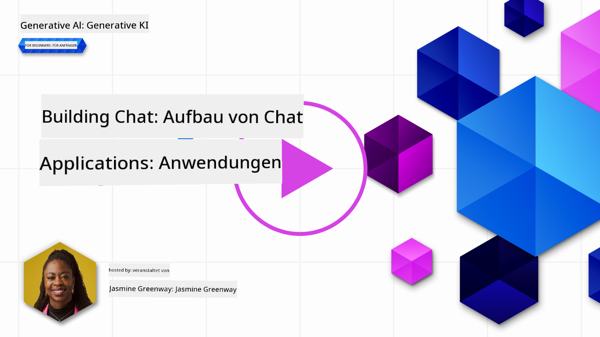
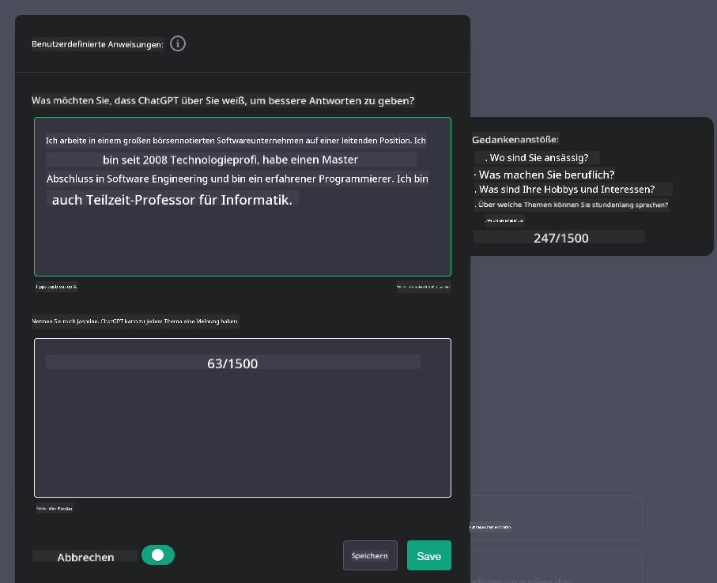
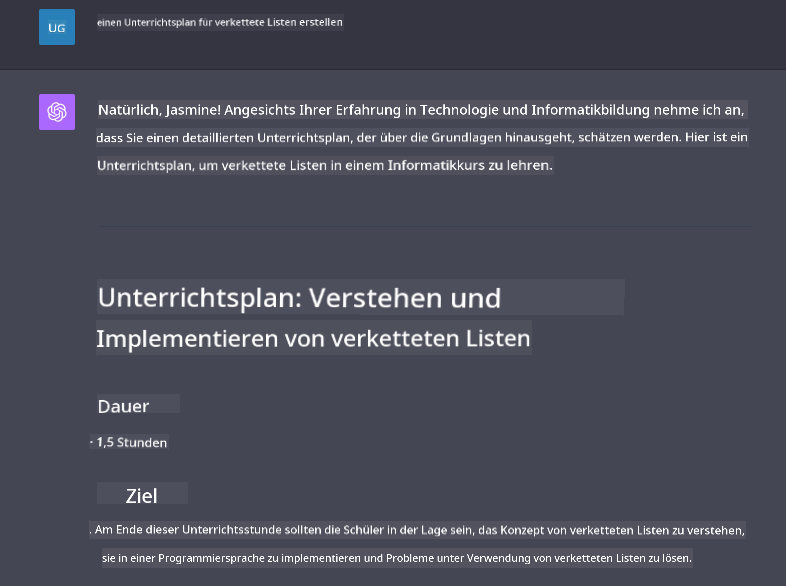

<!--
CO_OP_TRANSLATOR_METADATA:
{
  "original_hash": "ea4bbe640847aafbbba14dae4625e9af",
  "translation_date": "2025-05-19T10:17:08+00:00",
  "source_file": "07-building-chat-applications/README.md",
  "language_code": "de"
}
-->
# Aufbau von generativen KI-gestützten Chat-Anwendungen

[](https://aka.ms/gen-ai-lessons7-gh?WT.mc_id=academic-105485-koreyst)

> _(Klicken Sie auf das Bild oben, um das Video zu dieser Lektion anzusehen)_

Nachdem wir gesehen haben, wie wir Textgenerierungs-Apps erstellen können, werfen wir nun einen Blick auf Chat-Anwendungen.

Chat-Anwendungen sind zu einem integralen Bestandteil unseres täglichen Lebens geworden und bieten weit mehr als nur eine Möglichkeit für zwanglose Gespräche. Sie sind wesentliche Bestandteile des Kundenservice, des technischen Supports und sogar komplexer Beratungssysteme. Es ist wahrscheinlich, dass Sie nicht allzu lange her Hilfe von einer Chat-Anwendung erhalten haben. Wenn wir fortschrittlichere Technologien wie generative KI in diese Plattformen integrieren, nimmt die Komplexität zu und damit auch die Herausforderungen.

Einige Fragen, die beantwortet werden müssen, sind:

- **Die App bauen**. Wie bauen wir effizient und integrieren nahtlos diese KI-gestützten Anwendungen für spezifische Anwendungsfälle?
- **Überwachung**. Sobald sie bereitgestellt sind, wie können wir überwachen und sicherstellen, dass die Anwendungen auf höchstem Qualitätsniveau funktionieren, sowohl in Bezug auf Funktionalität als auch in Übereinstimmung mit den [sechs Prinzipien der verantwortungsvollen KI](https://www.microsoft.com/ai/responsible-ai?WT.mc_id=academic-105485-koreyst)?

Da wir weiter in ein Zeitalter der Automatisierung und nahtlosen Mensch-Maschine-Interaktionen vordringen, wird das Verständnis, wie generative KI den Umfang, die Tiefe und die Anpassungsfähigkeit von Chat-Anwendungen transformiert, unerlässlich. Diese Lektion wird die Aspekte der Architektur untersuchen, die diese komplexen Systeme unterstützen, die Methoden zur Feinabstimmung für domänenspezifische Aufgaben vertiefen und die Metriken und Überlegungen evaluieren, die für die Gewährleistung einer verantwortungsvollen KI-Bereitstellung relevant sind.

## Einführung

Diese Lektion behandelt:

- Techniken zum effizienten Erstellen und Integrieren von Chat-Anwendungen.
- Wie man Anpassungen und Feinabstimmung auf Anwendungen anwendet.
- Strategien und Überlegungen zur effektiven Überwachung von Chat-Anwendungen.

## Lernziele

Am Ende dieser Lektion werden Sie in der Lage sein:

- Überlegungen zum Aufbau und zur Integration von Chat-Anwendungen in bestehende Systeme zu beschreiben.
- Chat-Anwendungen für spezifische Anwendungsfälle anzupassen.
- Schlüsselmetriken und Überlegungen zur effektiven Überwachung und Aufrechterhaltung der Qualität von KI-gestützten Chat-Anwendungen zu identifizieren.
- Sicherzustellen, dass Chat-Anwendungen KI verantwortungsvoll nutzen.

## Integration von generativer KI in Chat-Anwendungen

Die Erhöhung von Chat-Anwendungen durch generative KI dreht sich nicht nur darum, sie intelligenter zu machen; es geht darum, ihre Architektur, Leistung und Benutzeroberfläche zu optimieren, um eine qualitativ hochwertige Benutzererfahrung zu liefern. Dies beinhaltet die Untersuchung der architektonischen Grundlagen, API-Integrationen und Überlegungen zur Benutzeroberfläche. Dieser Abschnitt zielt darauf ab, Ihnen eine umfassende Roadmap für die Navigation in diesen komplexen Landschaften zu bieten, egal ob Sie sie in bestehende Systeme integrieren oder als eigenständige Plattformen aufbauen.

Am Ende dieses Abschnitts sind Sie mit dem Fachwissen ausgestattet, das erforderlich ist, um Chat-Anwendungen effizient zu konstruieren und zu integrieren.

### Chatbot oder Chat-Anwendung?

Bevor wir in den Aufbau von Chat-Anwendungen eintauchen, vergleichen wir 'Chatbots' mit 'KI-gestützten Chat-Anwendungen', die unterschiedliche Rollen und Funktionen erfüllen. Der Hauptzweck eines Chatbots besteht darin, spezifische Gesprächsaufgaben zu automatisieren, wie das Beantworten häufig gestellter Fragen oder das Verfolgen eines Pakets. Er wird typischerweise von regelbasierter Logik oder komplexen KI-Algorithmen gesteuert. Im Gegensatz dazu ist eine KI-gestützte Chat-Anwendung eine weit umfassendere Umgebung, die verschiedene Formen der digitalen Kommunikation erleichtert, wie Text-, Sprach- und Videochats zwischen menschlichen Nutzern. Ihr definierendes Merkmal ist die Integration eines generativen KI-Modells, das nuancierte, menschenähnliche Gespräche simuliert und Antworten basierend auf einer Vielzahl von Eingaben und kontextuellen Hinweisen generiert. Eine generative KI-gestützte Chat-Anwendung kann an offenen Domänendiskussionen teilnehmen, sich an sich entwickelnde Gesprächskontexte anpassen und sogar kreative oder komplexe Dialoge produzieren.

Die folgende Tabelle zeigt die wesentlichen Unterschiede und Gemeinsamkeiten, um uns zu helfen, ihre einzigartigen Rollen in der digitalen Kommunikation zu verstehen.

| Chatbot                               | Generative KI-gestützte Chat-Anwendung |
| ------------------------------------- | -------------------------------------- |
| Aufgabenfokussiert und regelbasiert   | Kontextbewusst                         |
| Oft in größere Systeme integriert     | Kann einen oder mehrere Chatbots hosten |
| Auf programmierte Funktionen beschränkt | Integriert generative KI-Modelle      |
| Spezialisierte & strukturierte Interaktionen | Fähig zu offenen Domänendiskussionen |

### Nutzung vorgefertigter Funktionen mit SDKs und APIs

Beim Aufbau einer Chat-Anwendung ist ein guter erster Schritt die Bewertung dessen, was bereits vorhanden ist. Die Verwendung von SDKs und APIs zum Erstellen von Chat-Anwendungen ist aus verschiedenen Gründen eine vorteilhafte Strategie. Durch die Integration gut dokumentierter SDKs und APIs positionieren Sie Ihre Anwendung strategisch für langfristigen Erfolg und adressieren Skalierbarkeits- und Wartungsbedenken.

- **Beschleunigt den Entwicklungsprozess und reduziert den Aufwand**: Durch die Nutzung vorgefertigter Funktionen anstelle des teuren Prozesses, sie selbst zu erstellen, können Sie sich auf andere Aspekte Ihrer Anwendung konzentrieren, die Sie möglicherweise für wichtiger halten, wie z.B. die Geschäftslogik.
- **Bessere Leistung**: Wenn Sie Funktionalitäten von Grund auf neu erstellen, werden Sie sich schließlich fragen "Wie skaliert es? Ist diese Anwendung in der Lage, einen plötzlichen Benutzeranstieg zu bewältigen?" Gut gepflegte SDKs und APIs haben oft eingebaute Lösungen für diese Bedenken.
- **Einfachere Wartung**: Updates und Verbesserungen sind einfacher zu verwalten, da die meisten APIs und SDKs einfach ein Update einer Bibliothek erfordern, wenn eine neuere Version veröffentlicht wird.
- **Zugriff auf Spitzentechnologie**: Die Nutzung von Modellen, die auf umfangreichen Datensätzen fein abgestimmt und trainiert wurden, bietet Ihrer Anwendung natürliche Sprachfähigkeiten.

Der Zugriff auf die Funktionalität eines SDK oder einer API erfordert normalerweise die Erlaubnis zur Nutzung der bereitgestellten Dienste, was oft durch die Verwendung eines eindeutigen Schlüssels oder Authentifizierungstokens erfolgt. Wir werden die OpenAI Python Library verwenden, um zu erkunden, wie dies aussieht. Sie können es auch selbst ausprobieren im folgenden [Notebook für OpenAI](../../../07-building-chat-applications/python/oai-assignment.ipynb) oder [Notebook für Azure OpenAI Services](../../../07-building-chat-applications/python/aoai-assignment.ipynb) für diese Lektion.

```python
import os
from openai import OpenAI

API_KEY = os.getenv("OPENAI_API_KEY","")

client = OpenAI(
    api_key=API_KEY
    )

chat_completion = client.chat.completions.create(model="gpt-3.5-turbo", messages=[{"role": "user", "content": "Suggest two titles for an instructional lesson on chat applications for generative AI."}])
```

Das obige Beispiel verwendet das GPT-3.5 Turbo-Modell, um die Eingabeaufforderung zu vervollständigen, aber beachten Sie, dass der API-Schlüssel vorher gesetzt wird. Sie würden einen Fehler erhalten, wenn Sie den Schlüssel nicht setzen.

## Benutzererfahrung (UX)

Allgemeine UX-Prinzipien gelten für Chat-Anwendungen, aber hier sind einige zusätzliche Überlegungen, die aufgrund der maschinellen Lernkomponenten besonders wichtig werden.

- **Mechanismus zur Klärung von Mehrdeutigkeiten**: Generative KI-Modelle erzeugen gelegentlich mehrdeutige Antworten. Eine Funktion, die es Benutzern ermöglicht, um Klarstellung zu bitten, kann hilfreich sein, sollten sie auf dieses Problem stoßen.
- **Kontextbeibehaltung**: Fortschrittliche generative KI-Modelle haben die Fähigkeit, Kontext innerhalb eines Gesprächs zu behalten, was ein notwendiges Asset für die Benutzererfahrung sein kann. Benutzern die Möglichkeit zu geben, den Kontext zu kontrollieren und zu verwalten, verbessert die Benutzererfahrung, birgt jedoch das Risiko, sensible Benutzerinformationen zu speichern. Überlegungen dazu, wie lange diese Informationen gespeichert werden, wie z.B. die Einführung einer Aufbewahrungsrichtlinie, können das Bedürfnis nach Kontext gegen die Privatsphäre ausbalancieren.
- **Personalisierung**: Mit der Fähigkeit zu lernen und sich anzupassen, bieten KI-Modelle eine individuelle Erfahrung für einen Benutzer. Die Anpassung der Benutzererfahrung durch Funktionen wie Benutzerprofile lässt den Benutzer nicht nur verstanden fühlen, sondern hilft auch bei der Suche nach spezifischen Antworten und schafft eine effizientere und zufriedenstellendere Interaktion.

Ein solches Beispiel für Personalisierung ist die Einstellung "Benutzerdefinierte Anweisungen" in OpenAI's ChatGPT. Sie ermöglicht es Ihnen, Informationen über sich selbst bereitzustellen, die möglicherweise wichtiger Kontext für Ihre Eingaben sind. Hier ist ein Beispiel für eine benutzerdefinierte Anweisung.



Diese "Profil"-Eingabeaufforderung veranlasst ChatGPT, einen Unterrichtsplan zu verlinkten Listen zu erstellen. Beachten Sie, dass ChatGPT berücksichtigt, dass der Benutzer möglicherweise einen tiefergehenden Unterrichtsplan basierend auf ihrer Erfahrung wünscht.



### Microsoft's System Message Framework für große Sprachmodelle

[Microsoft hat Leitlinien bereitgestellt](https://learn.microsoft.com/azure/ai-services/openai/concepts/system-message#define-the-models-output-format?WT.mc_id=academic-105485-koreyst) für das Schreiben effektiver Systemnachrichten beim Generieren von Antworten aus LLMs, unterteilt in 4 Bereiche:

1. Definition, für wen das Modell bestimmt ist, sowie seine Fähigkeiten und Einschränkungen.
2. Definition des Ausgabeformats des Modells.
3. Bereitstellung spezifischer Beispiele, die das beabsichtigte Verhalten des Modells demonstrieren.
4. Bereitstellung zusätzlicher Verhaltensrichtlinien.

### Barrierefreiheit

Egal, ob ein Benutzer visuelle, auditive, motorische oder kognitive Beeinträchtigungen hat, eine gut gestaltete Chat-Anwendung sollte für alle nutzbar sein. Die folgende Liste bricht spezifische Funktionen herunter, die darauf abzielen, die Barrierefreiheit für verschiedene Benutzerbeeinträchtigungen zu verbessern.

- **Funktionen für Sehbehinderte**: Hochkontrast-Themen und anpassbare Textgrößen, Bildschirmleserkompatibilität.
- **Funktionen für Hörbehinderte**: Text-zu-Sprache und Sprache-zu-Text-Funktionen, visuelle Hinweise für Audiobenachrichtigungen.
- **Funktionen für motorische Beeinträchtigungen**: Unterstützung für Tastaturnavigation, Sprachbefehle.
- **Funktionen für kognitive Beeinträchtigungen**: Vereinfachte Sprachoptionen.

## Anpassung und Feinabstimmung für domänenspezifische Sprachmodelle

Stellen Sie sich eine Chat-Anwendung vor, die den Jargon Ihres Unternehmens versteht und die spezifischen Anfragen seiner Benutzerbasis antizipiert. Es gibt ein paar Ansätze, die erwähnenswert sind:

- **Nutzung von DSL-Modellen**. DSL steht für domänenspezifische Sprache. Sie können ein sogenanntes DSL-Modell nutzen, das auf einem spezifischen Bereich trainiert wurde, um dessen Konzepte und Szenarien zu verstehen.
- **Feinabstimmung anwenden**. Feinabstimmung ist der Prozess der weiteren Ausbildung Ihres Modells mit spezifischen Daten.

## Anpassung: Verwendung eines DSL

Die Nutzung von domänenspezifischen Sprachmodellen (DSL-Modellen) kann die Benutzerinteraktion verbessern, indem sie spezialisierte, kontextuell relevante Interaktionen bieten. Es ist ein Modell, das trainiert oder feinabgestimmt wurde, um Text zu verstehen und zu generieren, der sich auf ein spezifisches Feld, eine Branche oder ein Thema bezieht. Optionen zur Nutzung eines DSL-Modells können von der Ausbildung eines Modells von Grund auf bis zur Nutzung vorhandener Modelle über SDKs und APIs variieren. Eine weitere Option ist die Feinabstimmung, die darin besteht, ein vorhandenes vortrainiertes Modell zu nehmen und es für einen spezifischen Bereich anzupassen.

## Anpassung: Feinabstimmung anwenden

Feinabstimmung wird oft in Betracht gezogen, wenn ein vortrainiertes Modell in einem spezialisierten Bereich oder einer spezifischen Aufgabe nicht ausreicht.

Zum Beispiel sind medizinische Anfragen komplex und erfordern viel Kontext. Wenn ein medizinischer Fachmann einen Patienten diagnostiziert, basiert dies auf einer Vielzahl von Faktoren wie Lebensstil oder Vorerkrankungen und kann sogar auf kürzlich veröffentlichte medizinische Fachzeitschriften zurückgreifen, um seine Diagnose zu validieren. In solchen nuancierten Szenarien kann eine allgemeine KI-Chat-Anwendung keine zuverlässige Quelle sein.

### Szenario: eine medizinische Anwendung

Betrachten Sie eine Chat-Anwendung, die darauf ausgelegt ist, medizinische Fachleute zu unterstützen, indem sie schnelle Referenzen zu Behandlungsempfehlungen, Medikamenteninteraktionen oder aktuellen Forschungsergebnissen bietet.

Ein allgemeines Modell könnte ausreichend sein, um grundlegende medizinische Fragen zu beantworten oder allgemeine Ratschläge zu geben, aber es könnte bei den folgenden Punkten Schwierigkeiten haben:

- **Hochspezifische oder komplexe Fälle**. Zum Beispiel könnte ein Neurologe die Anwendung fragen: "Was sind die aktuellen Best Practices für das Management von medikamentenresistenter Epilepsie bei pädiatrischen Patienten?"
- **Fehlende aktuelle Fortschritte**. Ein allgemeines Modell könnte Schwierigkeiten haben, eine aktuelle Antwort zu geben, die die neuesten Fortschritte in der Neurologie und Pharmakologie berücksichtigt.

In solchen Fällen kann die Feinabstimmung des Modells mit einem spezialisierten medizinischen Datensatz seine Fähigkeit, diese komplexen medizinischen Anfragen genauer und zuverlässiger zu bearbeiten, erheblich verbessern. Dies erfordert den Zugriff auf einen großen und relevanten Datensatz, der die domänenspezifischen Herausforderungen und Fragen repräsentiert, die angegangen werden müssen.

## Überlegungen für eine qualitativ hochwertige KI-gestützte Chat-Erfahrung

Dieser Abschnitt skizziert die Kriterien für "hochwertige" Chat-Anwendungen, die die Erfassung von umsetzbaren Metriken und die Einhaltung eines Rahmens beinhalten, der verantwortungsbewusst KI-Technologie nutzt.

### Schlüsselmetriken

Um die qualitativ hochwertige Leistung einer Anwendung aufrechtzuerhalten, ist es wichtig, Schlüsselmetriken und Überlegungen im Auge zu behalten. Diese Messungen gewährleisten nicht nur die Funktionalität der Anwendung, sondern bewerten auch die Qualität des KI-Modells und der Benutzererfahrung. Im Folgenden finden Sie eine Liste, die grundlegende, KI- und Benutzererfahrungsmetriken enthält, die berücksichtigt werden sollten.

| Metrik                        | Definition                                                                                                             | Überlegungen für Chat-Entwickler                                         |
| ----------------------------- | ---------------------------------------------------------------------------------------------------------------------- | ------------------------------------------------------------------------- |
| **Betriebszeit**              | Misst die Zeit, in der die Anwendung betriebsbereit und für Benutzer zugänglich ist.                                   | Wie werden Sie Ausfallzeiten minimieren?                                  |
| **Antwortzeit**               | Die Zeit, die die Anwendung benötigt, um auf die Anfrage eines Benutzers zu antworten.                                 | Wie können Sie die Abfrageverarbeitung optimieren, um die Antwortzeit zu verbessern? |
| **Präzision**                 | Das Verhältnis von echten positiven Vorhersagen zur Gesamtzahl der positiven Vorhersagen.                              | Wie werden Sie die Präzision Ihres Modells validieren?                    |
| **Recall (Empfindlichkeit)**  | Das Verhältnis von echten positiven Vorhersagen zur tatsächlichen Anzahl der positiven Fälle.                          | Wie werden Sie Recall messen und verbessern?                              |
| **F1-Score**                  | Das harmonische Mittel von Präzision und Recall, das den Kompromiss zwischen beiden ausgleicht.                        | Was ist Ihr Ziel-F1-Score? Wie werden Sie Präzision und Recall ausbalancieren? |
| **Perplexität**               | Misst, wie gut die von dem Modell vorhergesagte Wahrscheinlichkeitsverteilung mit der tatsächlichen Verteilung der Daten übereinstimmt. | Wie werden Sie die Perplexität minimieren?                                |
| **Benutzerzufriedenheitsmetriken** | Misst die Wahrnehmung des Benutzers von der Anwendung. Oft durch Umfragen erfasst.                                    | Wie oft werden Sie Benutzerfeedback sammeln? Wie werden Sie sich darauf anpassen? |
| **Fehlerrate**                | Die Rate, mit der das Modell Fehler beim Verständnis oder bei der Ausgabe macht.                                       | Welche Strategien haben Sie, um Fehlerraten zu reduzieren?                |
| **Neulernzyklen**             | Die Häufigkeit, mit der das Modell aktualisiert wird, um neue Daten und Erkenntnisse zu integrieren.                   | Wie oft werden Sie das Modell neu trainieren? Was löst einen Neulernzyklus aus? |
| **Anomalieerkennung**         | Werkzeuge und Techniken zur Identifizierung ungewöhnlicher Muster, die nicht dem erwarteten Verhalten entsprechen.    | Wie werden Sie auf Anomalien reagieren?                                   |

### Implementierung verantwortungsvoller KI-Praktiken in Chat-Anwendungen

Microsofts Ansatz für verantwortungsvolle KI hat sechs Prinzipien identifiziert, die die Entwicklung und Nutzung von KI leiten sollten. Im Folgenden sind die Prinzipien, ihre Definition und Dinge, die ein Chat-Entwickler berücksichtigen sollte, sowie warum sie wichtig sind.

| Prinzipien             | Microsofts Definition                                | Überlegungen für Chat-Entwickler                                      | Warum es wichtig ist                                                                     |
| ---------------------- | ----------------------------------------------------- | ---------------------------------------------------------------------- | -------------------------------------------------------------------------------------- |
| Fairness               | KI-Systeme sollten alle Menschen fair behandeln.      | Sicherstellen, dass die Chat-Anwendung nicht basierend auf Benutzerdaten diskriminiert. | Um Vertrauen und Inklusivität unter den Benutzern aufzubauen; vermeidet rechtliche Konsequenzen. |
| Zuverlässigkeit und Sicherheit | KI-Systeme sollten zuverlässig und sicher funktionieren. | Implementieren Sie Tests und Sicherheitsvorkehrungen, um Fehler und Risiken zu minimieren. | Sichert die Benutzerzufriedenheit und verhindert potenziellen Schaden.                 |
| Privatsphäre und Sicherheit | KI-Systeme sollten sicher sein und die Privatsphäre respektieren. | Implementieren Sie

**Haftungsausschluss**:  
Dieses Dokument wurde mit dem KI-Übersetzungsdienst [Co-op Translator](https://github.com/Azure/co-op-translator) übersetzt. Obwohl wir uns um Genauigkeit bemühen, beachten Sie bitte, dass automatisierte Übersetzungen Fehler oder Ungenauigkeiten enthalten können. Das Originaldokument in seiner ursprünglichen Sprache sollte als maßgebliche Quelle betrachtet werden. Für kritische Informationen wird eine professionelle menschliche Übersetzung empfohlen. Wir haften nicht für Missverständnisse oder Fehlinterpretationen, die sich aus der Verwendung dieser Übersetzung ergeben.