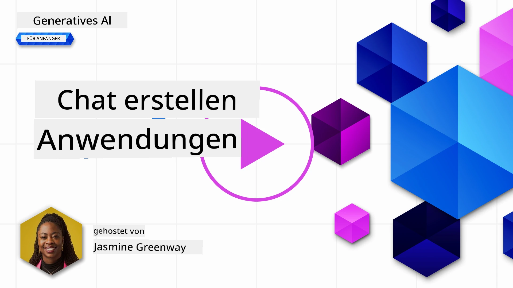
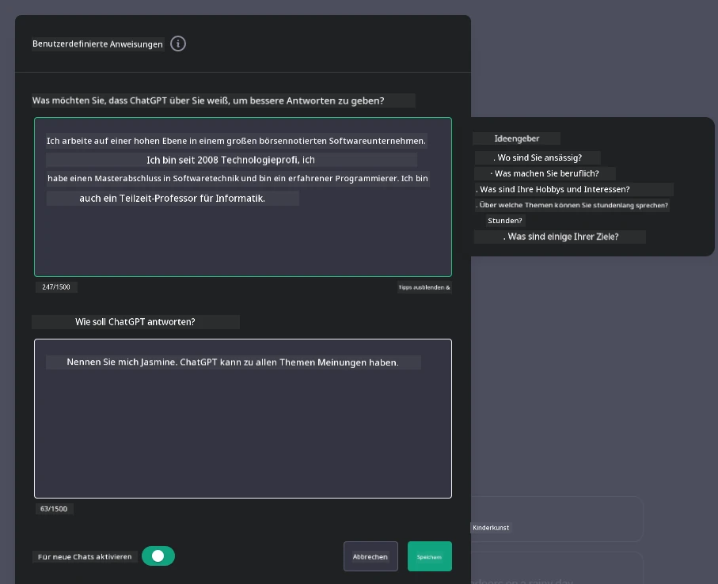
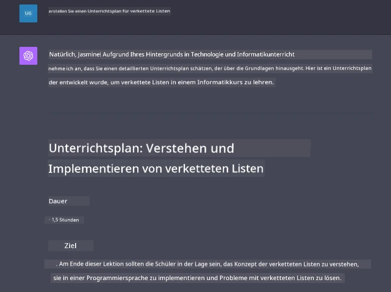

# Erstellung von generativen KI-gestützten Chat-Anwendungen

[](https://youtu.be/R9V0ZY1BEQo?si=IHuU-fS9YWT8s4sA)

> _(Klicken Sie auf das obige Bild, um das Video zu dieser Lektion anzusehen)_

Nun, da wir gesehen haben, wie wir Text-Generierungs-Apps erstellen können, schauen wir uns Chat-Anwendungen an.

Chat-Anwendungen sind in unserem Alltag integriert und bieten mehr als nur eine Möglichkeit der ungezwungenen Unterhaltung. Sie sind wesentliche Bestandteile des Kundenservices, technischen Supports und sogar anspruchsvoller Beratungssysteme. Wahrscheinlich haben Sie vor Kurzem schon einmal Hilfe durch eine Chat-Anwendung erhalten. Mit der Integration fortgeschrittener Technologien wie generativer KI in diese Plattformen steigt die Komplexität und damit auch die Herausforderungen.

Einige der Fragen, die wir beantworten müssen, sind:

- **Entwicklung der App**. Wie bauen wir diese KI-gestützten Anwendungen effizient und integrieren sie nahtlos für spezifische Anwendungsfälle?
- **Überwachung**. Nach dem Einsatz, wie können wir überwachen und sicherstellen, dass die Anwendungen auf höchstem Qualitätsniveau operieren, sowohl funktional als auch hinsichtlich der Einhaltung der [sechs Prinzipien verantwortungsvoller KI](https://www.microsoft.com/ai/responsible-ai?WT.mc_id=academic-105485-koreyst)?

Da wir uns zunehmend in einem Zeitalter bewegen, das von Automatisierung und nahtlosen Mensch-Maschine-Interaktionen definiert wird, ist es essentiell zu verstehen, wie generative KI den Umfang, die Tiefe und die Anpassungsfähigkeit von Chat-Anwendungen verändert. Diese Lektion wird Aspekte der Architektur untersuchen, die diese komplexen Systeme unterstützen, Methoden zur Feinabstimmung für domänenspezifische Aufgaben vorstellen und die Metriken und Überlegungen bewerten, die für eine verantwortungsvolle KI-Einführung relevant sind.

## Einführung

Diese Lektion behandelt:

- Techniken zum effizienten Erstellen und Integrieren von Chat-Anwendungen.
- Wie man Anpassungen und Feinabstimmung auf Anwendungen anwendet.
- Strategien und Überlegungen zur effektiven Überwachung von Chat-Anwendungen.

## Lernziele

Am Ende dieser Lektion werden Sie in der Lage sein:

- Überlegungen zu beschreiben, wie man Chat-Anwendungen in bestehende Systeme baut und integriert.
- Chat-Anwendungen für spezifische Anwendungsfälle anzupassen.
- Wichtige Metriken und Überlegungen zu identifizieren, um die Qualität von KI-gestützten Chat-Anwendungen effektiv zu überwachen und zu pflegen.
- Sicherzustellen, dass Chat-Anwendungen KI verantwortungsvoll nutzen.

## Integration von generativer KI in Chat-Anwendungen

Die Verbesserung von Chat-Anwendungen durch generative KI besteht nicht nur darin, sie intelligenter zu machen; es geht darum, ihre Architektur, Leistung und Benutzeroberfläche zu optimieren, um eine qualitativ hochwertige Benutzererfahrung zu bieten. Dies beinhaltet die Untersuchung architektonischer Grundlagen, API-Integrationen und Überlegungen zur Benutzeroberfläche. Dieser Abschnitt zielt darauf ab, Ihnen eine umfassende Roadmap für die Navigation in diesen komplexen Bereichen zu bieten, egal ob Sie sie in bestehende Systeme einbinden oder als eigenständige Plattformen aufbauen.

Am Ende dieses Abschnitts sind Sie mit dem nötigen Fachwissen ausgestattet, um Chat-Anwendungen effizient zu erstellen und zu integrieren.

### Chatbot oder Chat-Anwendung?

Bevor wir mit dem Bau von Chat-Anwendungen beginnen, vergleichen wir „Chatbots“ mit „KI-gestützten Chat-Anwendungen“, die unterschiedliche Rollen und Funktionalitäten erfüllen. Ein Chatbot hat die Hauptfunktion, spezifische Konversationsaufgaben zu automatisieren, wie zum Beispiel häufig gestellte Fragen zu beantworten oder ein Paket zu verfolgen. Er wird meist durch regelbasierte Logik oder komplexe KI-Algorithmen gesteuert. Im Gegensatz dazu ist eine KI-gestützte Chat-Anwendung eine deutlich umfassendere Umgebung, die verschiedene Formen digitaler Kommunikation ermöglicht, wie Text-, Sprach- und Videochats zwischen menschlichen Nutzern. Ihr charakteristisches Merkmal ist die Integration eines generativen KI-Modells, das nuancierte, menschenähnliche Gespräche simuliert und Antworten auf Basis einer Vielzahl von Eingaben und Kontextinformationen generiert. Eine generative KI-gestützte Chat-Anwendung kann offene Diskussionen führen, sich an sich entwickelnde Gesprächskontexte anpassen und sogar kreative oder komplexe Dialoge erzeugen.

Die folgende Tabelle zeigt die wichtigsten Unterschiede und Gemeinsamkeiten, um ihre einzigartigen Rollen in der digitalen Kommunikation zu verdeutlichen.

| Chatbot                               | Generative KI-gestützte Chat-Anwendung       |
| ------------------------------------- | -------------------------------------------- |
| Aufgabenorientiert und regelbasiert   | Kontextbewusst                              |
| Oft in größere Systeme integriert      | Kann einen oder mehrere Chatbots beherbergen |
| Auf programmierte Funktionen beschränkt | Beinhaltet generative KI-Modelle             |
| Spezialisierte & strukturierte Interaktionen | Fähig zu offenen Diskussionen             |

### Nutzung vorgefertigter Funktionen mit SDKs und APIs

Beim Bau einer Chat-Anwendung ist ein guter erster Schritt, zu überprüfen, was es bereits gibt. Die Nutzung von SDKs und APIs zum Erstellen von Chat-Anwendungen ist aus verschiedenen Gründen eine vorteilhafte Strategie. Durch die Integration gut dokumentierter SDKs und APIs positionieren Sie Ihre Anwendung strategisch für langfristigen Erfolg und berücksichtigen Skalierbarkeit und Wartungsaspekte.

- **Beschleunigt den Entwicklungsprozess und reduziert Aufwand**: Die Nutzung vorgefertigter Funktionen anstelle des kostenintensiven selbstständigen Aufbaus erlaubt es Ihnen, sich auf andere Aspekte Ihrer Anwendung zu konzentrieren, die Ihnen möglicherweise wichtiger sind, wie die Geschäftslogik.
- **Bessere Performance**: Wenn Sie Funktionen von Grund auf neu entwickeln, stellen Sie sich irgendwann die Frage: „Wie skaliert das? Kann diese Anwendung eine plötzliche Nutzerflut bewältigen?“ Gut gepflegte SDKs und APIs enthalten oft eingebaute Lösungen für diese Anforderungen.
- **Einfachere Wartung**: Updates und Verbesserungen sind leichter handhabbar, da die meisten APIs und SDKs einfach ein Update der Bibliothek erfordern, wenn eine neue Version veröffentlicht wird.
- **Zugang zu modernster Technologie**: Die Nutzung von Modellen, die feinabgestimmt und auf umfangreichen Datensätzen trainiert wurden, verschafft Ihrer Anwendung natürliche Sprachfähigkeiten.

Der Zugriff auf Funktionen eines SDK oder einer API erfolgt in der Regel durch das Einholen einer Erlaubnis zur Nutzung der bereitgestellten Services, oft mittels eines einzigartigen Schlüssels oder Authentifizierungs-Tokens. Wir verwenden die OpenAI Python-Bibliothek, um zu zeigen, wie das aussieht. Sie können es auch selbst ausprobieren im folgenden [Notebook für OpenAI](./python/oai-assignment.ipynb?WT.mc_id=academic-105485-koreyst) oder [Notebook für Azure OpenAI Services](./python/aoai-assignment.ipynb?WT.mc_id=academic-105485-koreys) für diese Lektion.

```python
import os
from openai import OpenAI

API_KEY = os.getenv("OPENAI_API_KEY","")

client = OpenAI(
    api_key=API_KEY
    )

response = client.responses.create(model="gpt-4o-mini", input="Suggest two titles for an instructional lesson on chat applications for generative AI.", store=False)
print(response.output_text)
```

Das obige Beispiel verwendet das GPT-4o mini Modell mit der Responses API, um die Eingabe zu vervollständigen, aber beachten Sie, dass der API-Schlüssel davor gesetzt wird. Ohne die Schlüsselsetzung erhalten Sie einen Fehler.

## Benutzererfahrung (UX)

Allgemeine UX-Prinzipien gelten auch für Chat-Anwendungen, aber hier sind einige zusätzliche Überlegungen, die aufgrund der eingesetzten maschinellen Lernkomponenten besonders wichtig werden.

- **Mechanismus zum Umgang mit Mehrdeutigkeit**: Generative KI-Modelle erzeugen gelegentlich mehrdeutige Antworten. Eine Funktion, die es Nutzern erlaubt, um Klarstellungen zu bitten, kann hilfreich sein, wenn sie auf dieses Problem stoßen.
- **Kontextbeibehaltung**: Fortschrittliche generative KI-Modelle können den Kontext innerhalb eines Gesprächs speichern, was ein notwendiger Nutzen für die Benutzererfahrung sein kann. Nutzern die Kontrolle und Verwaltung des Kontexts zu geben, verbessert die User Experience, birgt aber auch das Risiko, sensible Informationen zu speichern. Überlegungen dazu, wie lange diese Informationen gespeichert werden, z.B. durch eine Aufbewahrungsrichtlinie, können den Bedarf nach Kontext mit dem Schutz der Privatsphäre in Einklang bringen.
- **Personalisierung**: Mit der Fähigkeit zu lernen und sich anzupassen, bieten KI-Modelle ein individuelles Erlebnis für den Nutzer. Das Anpassen der Benutzererfahrung durch Funktionen wie Benutzerprofile lässt den Nutzer sich verstanden fühlen und unterstützt ihn bei der gezielten Suche nach Antworten, was eine effizientere und zufriedenstellendere Interaktion schafft.

Ein Beispiel für Personalisierung sind die „Custom instructions“ in OpenAI's ChatGPT. Sie ermöglichen es, Informationen über sich selbst zu geben, die für die Eingaben wichtig sein können. Hier ein Beispiel einer benutzerdefinierten Anweisung.



Dieses „Profil“ veranlasst ChatGPT, einen Lehrplan zum Thema verkettete Listen zu erstellen. Dabei berücksichtigt ChatGPT, dass die Nutzerin möglicherweise einen tiefergehenden Lehrplan aufgrund ihrer Erfahrung wünscht.



### Microsofts Systemnachrichten-Framework für Large Language Models

[Microsoft hat Leitlinien bereitgestellt](https://learn.microsoft.com/azure/ai-services/openai/concepts/system-message#define-the-models-output-format?WT.mc_id=academic-105485-koreyst) für das Schreiben effektiver Systemnachrichten bei der Erzeugung von Antworten aus LLMs, die in 4 Bereiche unterteilt sind:

1. Definition, für wen das Modell gedacht ist, sowie seiner Fähigkeiten und Beschränkungen.
2. Definition des Ausgabeformats des Modells.
3. Bereitstellung spezifischer Beispiele, die das beabsichtigte Verhalten des Modells demonstrieren.
4. Bereitstellung zusätzlicher Verhaltensrichtlinien.

### Barrierefreiheit

Ganz gleich, ob ein Nutzer visuelle, auditive, motorische oder kognitive Beeinträchtigungen hat, eine gut gestaltete Chat-Anwendung sollte für alle nutzbar sein. Die folgende Liste führt spezifische Funktionen auf, die darauf abzielen, die Barrierefreiheit für verschiedene Nutzerbeeinträchtigungen zu verbessern.

- **Funktionen für Sehbeeinträchtigung**: Hochkontrast-Themen und skalierbarer Text, Bildschirmleser-Kompatibilität.
- **Funktionen für Hörbeeinträchtigung**: Text-zu-Sprache- und Sprache-zu-Text-Funktionen, visuelle Hinweise für Audio-Benachrichtigungen.
- **Funktionen für motorische Beeinträchtigung**: Unterstützung für Tastaturnavigation, Sprachbefehle.
- **Funktionen für kognitive Beeinträchtigung**: Optionen für vereinfachte Sprache.

## Anpassung und Feinabstimmung für Domänenspezifische Sprachmodelle

Stellen Sie sich eine Chat-Anwendung vor, die den Jargon Ihres Unternehmens versteht und die typischen Anfragen seiner Nutzerbasis antizipiert. Es gibt ein paar erwähnenswerte Ansätze:

- **Nutzung von DSL-Modellen**. DSL steht für domänenspezifische Sprache. Sie können ein sogenanntes DSL-Modell verwenden, das auf einem bestimmten Fachgebiet trainiert ist, um dessen Konzepte und Szenarien zu verstehen.
- **Anwendung von Feinabstimmung**. Feinabstimmung ist der Prozess, Ihr Modell mit spezifischen Daten weiter zu trainieren.

## Anpassung: Nutzung eines DSL

Die Nutzung domänenspezifischer Sprachmodelle (DSL-Modelle) kann die Nutzerbindung verbessern, indem spezialisierte, kontextuell relevante Interaktionen bereitgestellt werden. Es ist ein Modell, das so trainiert oder feinabgestimmt ist, dass es Texte aus einem bestimmten Feld, einer Branche oder einem Fachgebiet versteht und generiert. Optionen zur Nutzung eines DSL-Modells reichen vom Training eines eigenen Modells von Grund auf bis zur Verwendung bereits existierender über SDKs und APIs. Eine weitere Option ist das Fine-Tuning, bei dem ein bestehendes vortrainiertes Modell für eine spezielle Domäne angepasst wird.

## Anpassung: Feinabstimmung anwenden

Feinabstimmung wird oft in Erwägung gezogen, wenn ein vortrainiertes Modell in einer spezialisierten Domäne oder bestimmten Aufgabe nicht ausreicht.

Zum Beispiel sind medizinische Anfragen komplex und benötigen viel Kontext. Wenn ein Mediziner einen Patienten diagnostiziert, basiert dies auf einer Vielzahl von Faktoren wie Lebensstil oder bestehenden Erkrankungen und kann sogar auf aktuelle medizinische Fachzeitschriften zurückgreifen, um die Diagnose zu bestätigen. In solch nuancierten Szenarien kann eine allgemein einsetzbare KI-Chat-Anwendung keine verlässliche Quelle sein.

### Szenario: eine medizinische Anwendung

Stellen Sie sich eine Chat-Anwendung vor, die medizinische Fachkräfte unterstützt, indem sie schnellen Zugriff auf Behandlungsempfehlungen, Wechselwirkungen von Medikamenten oder aktuelle Forschungsergebnisse bietet.

Ein allgemein einsetzbares Modell könnte ausreichend sein, um grundlegende medizinische Fragen zu beantworten oder allgemeine Ratschläge zu geben, aber es könnte Schwierigkeiten haben bei:

- **Sehr spezifischen oder komplexen Fällen**. Zum Beispiel könnte ein Neurologe die Anwendung fragen: „Was sind die aktuellen Best-Practices für die Behandlung von medikamentenresistenter Epilepsie bei pädiatrischen Patienten?“
- **Fehlenden aktuellen Fortschritten**. Ein allgemeines Modell könnte Schwierigkeiten haben, eine aktuelle Antwort zu liefern, die die jüngsten Fortschritte in Neurologie und Pharmakologie berücksichtigt.

In solchen Fällen kann die Feinabstimmung des Modells mit einem spezialisierten medizinischen Datensatz seine Fähigkeit signifikant verbessern, diese komplexen medizinischen Anfragen genauer und zuverlässiger zu bearbeiten. Dazu wird der Zugang zu einem großen und relevanten Datensatz benötigt, der die domänenspezifischen Herausforderungen und Fragen repräsentiert, die beantwortet werden sollen.

## Überlegungen für eine hochwertige KI-gesteuerte Chat-Erfahrung

Dieser Abschnitt beschreibt die Kriterien für „hochwertige“ Chat-Anwendungen, die die Erfassung umsetzbarer Metriken und die Einhaltung eines Rahmens umfassen, der KI-Technologie verantwortungsbewusst nutzt.

### Wichtige Metriken

Um die hohe Leistungsqualität einer Anwendung aufrechtzuerhalten, ist es unerlässlich, wichtige Metriken und Überlegungen zu verfolgen. Diese Messwerte gewährleisten nicht nur die Funktionalität der Anwendung, sondern bewerten auch die Qualität des KI-Modells und der Nutzererfahrung. Nachfolgend eine Liste von grundlegenden, KI- und UX-Metriken, die zu berücksichtigen sind.

| Metrik                       | Definition                                                                                                             | Überlegungen für Entwickler von Chat-Anwendungen                         |
| ---------------------------- | ---------------------------------------------------------------------------------------------------------------------- | ------------------------------------------------------------------------- |
| **Betriebszeit (Uptime)**     | Misst die Zeit, in der die Anwendung betriebsbereit und für Nutzer erreichbar ist.                                     | Wie minimieren Sie Ausfallzeiten?                                         |
| **Antwortzeit**              | Die Zeit, die die Anwendung benötigt, um auf eine Nutzeranfrage zu reagieren.                                           | Wie optimieren Sie die Verarbeitung der Anfragen zur Verbesserung der Antwortzeit? |
| **Präzision**                | Das Verhältnis der echten positiven Vorhersagen zur Gesamtzahl positiver Vorhersagen                                    | Wie validieren Sie die Präzision Ihres Modells?                           |
| **Recall (Sensitivität)**    | Das Verhältnis der echten positiven Vorhersagen zur tatsächlichen Anzahl positiver Fälle                                | Wie messen und verbessern Sie den Recall?                                 |
| **F1-Score**                | Das harmonische Mittel von Präzision und Recall, das den Kompromiss zwischen beiden ausgleicht.                         | Was ist Ihr Zielwert für den F1-Score? Wie balancieren Sie Präzision und Recall? |
| **Perplexity**              | Misst, wie gut die vom Modell vorhergesagte Wahrscheinlichkeitsverteilung mit der tatsächlichen Verteilung der Daten übereinstimmt. | Wie minimieren Sie die Perplexity?                                        |
| **Nutzerzufriedenheitsmetriken** | Misst die Wahrnehmung der Anwendung durch den Nutzer. Wird oft durch Umfragen erfasst.                                | Wie oft sammeln Sie Nutzerfeedback? Wie passen Sie die Anwendung darauf an? |
| **Fehlerrate**              | Die Rate, mit der das Modell Fehler beim Verstehen oder bei der Ausgabe macht.                                         | Welche Strategien haben Sie, um die Fehlerrate zu reduzieren?             |
| **Retrainingszyklen**       | Die Häufigkeit, mit der das Modell aktualisiert wird, um neue Daten und Erkenntnisse einzubeziehen.                     | Wie oft trainieren Sie das Modell neu? Was löst einen Retrainingszyklus aus? |

| **Anomalieerkennung**         | Werkzeuge und Techniken zur Identifizierung ungewöhnlicher Muster, die nicht dem erwarteten Verhalten entsprechen.                        | Wie werden Sie auf Anomalien reagieren?                                        |

### Umsetzung verantwortungsvoller KI-Praktiken in Chat-Anwendungen

Der Ansatz von Microsoft zu Responsible AI hat sechs Prinzipien identifiziert, die die Entwicklung und Nutzung von KI leiten sollten. Nachfolgend sind die Prinzipien, ihre Definition und Aspekte aufgeführt, die ein Chat-Entwickler berücksichtigen sollte und warum er sie ernst nehmen sollte.

| Prinzipien             | Definition von Microsoft                                | Überlegungen für Chat-Entwickler                                      | Warum es wichtig ist                                                                     |
| ---------------------- | ----------------------------------------------------- | ---------------------------------------------------------------------- | ---------------------------------------------------------------------------------------- |
| Fairness               | KI-Systeme sollten alle Menschen fair behandeln.      | Sicherstellen, dass die Chat-Anwendung nicht aufgrund von Nutzerdaten diskriminiert.  | Um Vertrauen und Inklusion unter den Nutzern aufzubauen; vermeidet rechtliche Folgen.    |
| Zuverlässigkeit und Sicherheit | KI-Systeme sollten zuverlässig und sicher arbeiten.        | Tests und Sicherheitsmechanismen implementieren, um Fehler und Risiken zu minimieren.         | Gewährleistet Nutzerzufriedenheit und verhindert potenziellen Schaden.                   |
| Datenschutz und Sicherheit   | KI-Systeme sollten sicher sein und die Privatsphäre respektieren.      | Starke Verschlüsselung und Datenschutzmaßnahmen implementieren.              | Zum Schutz sensibler Nutzerdaten und Einhaltung von Datenschutzgesetzen.                |
| Inklusivität          | KI-Systeme sollten alle Menschen befähigen und einbinden. | UI/UX so gestalten, dass sie zugänglich und benutzerfreundlich für verschiedene Zielgruppen ist. | Sicherstellt, dass eine breitere Nutzergruppe die Anwendung effektiv nutzen kann.       |
| Transparenz           | KI-Systeme sollten nachvollziehbar sein.                  | Klare Dokumentation und Begründung für KI-Antworten bereitstellen.            | Nutzer vertrauen einem System eher, wenn sie verstehen, wie Entscheidungen getroffen werden. |
| Verantwortlichkeit         | Menschen sollten für KI-Systeme verantwortlich sein.          | Einen klaren Prozess für das Auditieren und Verbessern von KI-Entscheidungen etablieren.     | Ermöglicht kontinuierliche Verbesserungen und Korrekturmaßnahmen bei Fehlern.           |

## Aufgabe

Siehe [assignment](../../../07-building-chat-applications/python). Die Aufgabe führt Sie durch eine Reihe von Übungen – vom Ausführen Ihrer ersten Chat-Eingaben, bis zum Klassifizieren und Zusammenfassen von Texten und mehr. Beachten Sie, dass die Aufgaben in verschiedenen Programmiersprachen verfügbar sind!

## Großartige Arbeit! Fahren Sie mit der Reise fort

Nach Abschluss dieser Lektion sehen Sie sich unsere [Generative AI Learning collection](https://aka.ms/genai-collection?WT.mc_id=academic-105485-koreyst) an, um Ihr Wissen in Generativer KI weiter zu vertiefen!

Gehen Sie weiter zu Lektion 8, um zu sehen, wie Sie mit dem [Erstellen von Suchanwendungen](../08-building-search-applications/README.md?WT.mc_id=academic-105485-koreyst) beginnen können!

---

<!-- CO-OP TRANSLATOR DISCLAIMER START -->
**Haftungsausschluss**:
Dieses Dokument wurde mit dem KI-Übersetzungsdienst [Co-op Translator](https://github.com/Azure/co-op-translator) übersetzt. Obwohl wir uns um Genauigkeit bemühen, beachten Sie bitte, dass automatisierte Übersetzungen Fehler oder Ungenauigkeiten enthalten können. Das Originaldokument in seiner Ursprungssprache gilt als maßgebliche Quelle. Bei kritischen Informationen wird eine professionelle menschliche Übersetzung empfohlen. Wir übernehmen keine Haftung für Missverständnisse oder Fehlinterpretationen, die aus der Verwendung dieser Übersetzung entstehen.
<!-- CO-OP TRANSLATOR DISCLAIMER END -->