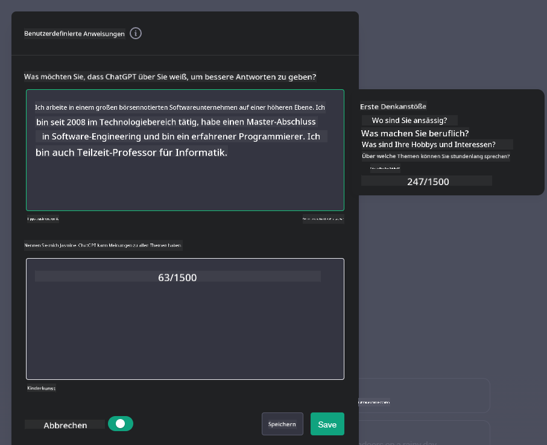
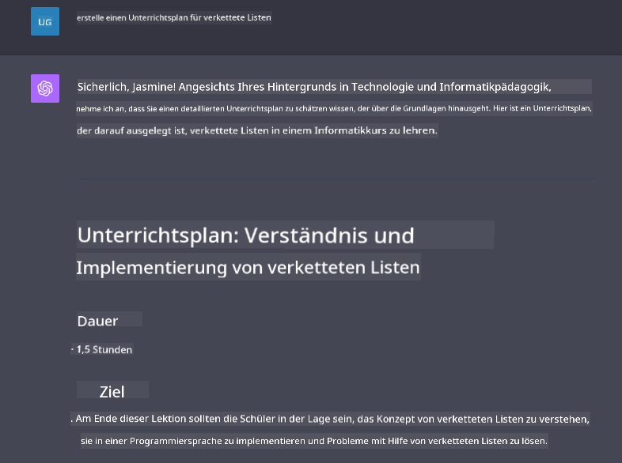

<!--
CO_OP_TRANSLATOR_METADATA:
{
  "original_hash": "ea4bbe640847aafbbba14dae4625e9af",
  "translation_date": "2025-06-25T15:05:25+00:00",
  "source_file": "07-building-chat-applications/README.md",
  "language_code": "de"
}
-->
# Aufbau von Chat-Anwendungen mit Generativer KI

[](https://aka.ms/gen-ai-lessons7-gh?WT.mc_id=academic-105485-koreyst)

> _(Klicken Sie auf das obige Bild, um das Video zu dieser Lektion anzusehen)_

Nachdem wir gesehen haben, wie wir Textgenerierungs-Apps entwickeln können, werfen wir nun einen Blick auf Chat-Anwendungen.

Chat-Anwendungen sind in unseren Alltag integriert und bieten mehr als nur eine Möglichkeit zur lockeren Konversation. Sie sind integrale Bestandteile des Kundenservice, technischer Support und sogar komplexer Beratungssysteme. Wahrscheinlich haben Sie vor nicht allzu langer Zeit Unterstützung von einer Chat-Anwendung erhalten. Während wir fortschrittlichere Technologien wie generative KI in diese Plattformen integrieren, steigt die Komplexität und damit auch die Herausforderungen.

Einige Fragen, die wir beantworten müssen, sind:

- **Die App entwickeln**. Wie bauen wir diese KI-gestützten Anwendungen effizient und integrieren sie nahtlos für spezifische Anwendungsfälle?
- **Überwachung**. Wie können wir nach der Bereitstellung überwachen und sicherstellen, dass die Anwendungen auf höchstem Qualitätsniveau arbeiten, sowohl in Bezug auf Funktionalität als auch auf die Einhaltung der [sechs Prinzipien verantwortungsvoller KI](https://www.microsoft.com/ai/responsible-ai?WT.mc_id=academic-105485-koreyst)?

Da wir uns weiter in ein Zeitalter bewegen, das durch Automatisierung und nahtlose Mensch-Maschine-Interaktionen definiert ist, wird das Verständnis, wie generative KI den Umfang, die Tiefe und die Anpassungsfähigkeit von Chat-Anwendungen transformiert, unerlässlich. Diese Lektion wird die Aspekte der Architektur untersuchen, die diese komplexen Systeme unterstützen, die Methoden zur Feinabstimmung für domänenspezifische Aufgaben vertiefen und die Metriken und Überlegungen bewerten, die für die Sicherstellung einer verantwortungsvollen KI-Bereitstellung relevant sind.

## Einführung

Diese Lektion behandelt:

- Techniken für den effizienten Aufbau und die Integration von Chat-Anwendungen.
- Wie man Anpassung und Feinabstimmung auf Anwendungen anwendet.
- Strategien und Überlegungen zur effektiven Überwachung von Chat-Anwendungen.

## Lernziele

Am Ende dieser Lektion werden Sie in der Lage sein:

- Überlegungen zum Aufbau und zur Integration von Chat-Anwendungen in bestehende Systeme zu beschreiben.
- Chat-Anwendungen für spezifische Anwendungsfälle anzupassen.
- Wichtige Metriken und Überlegungen zu identifizieren, um die Qualität von KI-gestützten Chat-Anwendungen effektiv zu überwachen und zu erhalten.
- Sicherzustellen, dass Chat-Anwendungen KI verantwortungsvoll nutzen.

## Integration von Generativer KI in Chat-Anwendungen

Die Verbesserung von Chat-Anwendungen durch generative KI dreht sich nicht nur darum, sie intelligenter zu machen; es geht darum, ihre Architektur, Leistung und Benutzeroberfläche zu optimieren, um eine qualitativ hochwertige Benutzererfahrung zu bieten. Dies umfasst die Untersuchung der architektonischen Grundlagen, API-Integrationen und Überlegungen zur Benutzeroberfläche. Dieser Abschnitt soll Ihnen eine umfassende Roadmap bieten, um diese komplexen Landschaften zu navigieren, egal ob Sie sie in bestehende Systeme einfügen oder als eigenständige Plattformen aufbauen.

Am Ende dieses Abschnitts sind Sie mit dem Fachwissen ausgestattet, um Chat-Anwendungen effizient zu konstruieren und zu integrieren.

### Chatbot oder Chat-Anwendung?

Bevor wir in den Aufbau von Chat-Anwendungen eintauchen, vergleichen wir 'Chatbots' mit 'KI-gestützten Chat-Anwendungen', die unterschiedliche Rollen und Funktionen erfüllen. Der Hauptzweck eines Chatbots besteht darin, bestimmte Konversationsaufgaben zu automatisieren, wie z. B. häufig gestellte Fragen zu beantworten oder ein Paket zu verfolgen. Er wird typischerweise durch regelbasierte Logik oder komplexe KI-Algorithmen gesteuert. Im Gegensatz dazu ist eine KI-gestützte Chat-Anwendung eine weitaus umfassendere Umgebung, die verschiedene Formen der digitalen Kommunikation wie Text-, Sprach- und Video-Chats zwischen menschlichen Benutzern erleichtert. Ihr herausragendes Merkmal ist die Integration eines generativen KI-Modells, das nuancierte, menschenähnliche Gespräche simuliert und Antworten basierend auf einer Vielzahl von Eingaben und kontextuellen Hinweisen generiert. Eine generative KI-gestützte Chat-Anwendung kann an offenen Diskussionen teilnehmen, sich an sich entwickelnde Konversationskontexte anpassen und sogar kreative oder komplexe Dialoge erzeugen.

Die folgende Tabelle zeigt die wichtigsten Unterschiede und Gemeinsamkeiten, um uns zu helfen, ihre einzigartigen Rollen in der digitalen Kommunikation zu verstehen.

| Chatbot                               | Generative KI-gestützte Chat-Anwendung |
| ------------------------------------- | -------------------------------------- |
| Aufgabenorientiert und regelbasiert   | Kontextbewusst                         |
| Oft in größere Systeme integriert     | Kann einen oder mehrere Chatbots hosten|
| Beschränkt auf programmierte Funktionen| Integriert generative KI-Modelle       |
| Spezialisierte & strukturierte Interaktionen | Fähig zu offenen Diskussionen       |

### Nutzung vorgefertigter Funktionen mit SDKs und APIs

Beim Aufbau einer Chat-Anwendung ist ein guter erster Schritt, zu beurteilen, was bereits vorhanden ist. Die Verwendung von SDKs und APIs zum Aufbau von Chat-Anwendungen ist eine vorteilhafte Strategie aus verschiedenen Gründen. Durch die Integration gut dokumentierter SDKs und APIs positionieren Sie Ihre Anwendung strategisch für langfristigen Erfolg und adressieren Skalierbarkeits- und Wartungsprobleme.

- **Beschleunigt den Entwicklungsprozess und reduziert den Aufwand**: Auf vorgefertigte Funktionen zu setzen, anstatt den teuren Prozess des Eigenbaus zu durchlaufen, ermöglicht es Ihnen, sich auf andere Aspekte Ihrer Anwendung zu konzentrieren, die Sie möglicherweise für wichtiger halten, wie z. B. Geschäftslogik.
- **Bessere Leistung**: Wenn Sie Funktionen von Grund auf neu erstellen, werden Sie sich irgendwann fragen: "Wie skaliert das? Ist diese Anwendung in der Lage, einen plötzlichen Anstieg der Nutzerzahlen zu bewältigen?" Gut gepflegte SDKs und APIs haben oft eingebaute Lösungen für diese Bedenken.
- **Einfachere Wartung**: Updates und Verbesserungen sind einfacher zu verwalten, da die meisten APIs und SDKs einfach ein Update einer Bibliothek erfordern, wenn eine neuere Version veröffentlicht wird.
- **Zugang zu Spitzentechnologie**: Die Nutzung von Modellen, die fein abgestimmt und auf umfangreichen Datensätzen trainiert wurden, verleiht Ihrer Anwendung natürliche Sprachfähigkeiten.

Der Zugriff auf die Funktionalität eines SDK oder einer API beinhaltet typischerweise das Einholen der Erlaubnis zur Nutzung der bereitgestellten Dienste, was oft durch die Verwendung eines einzigartigen Schlüssels oder Authentifizierungstokens erfolgt. Wir werden die OpenAI Python Library verwenden, um zu erkunden, wie das aussieht. Sie können es auch selbst in dem folgenden [Notebook für OpenAI](../../../07-building-chat-applications/python/oai-assignment.ipynb) oder [Notebook für Azure OpenAI Services](../../../07-building-chat-applications/python/aoai-assignment.ipynb) für diese Lektion ausprobieren.

```python
import os
from openai import OpenAI

API_KEY = os.getenv("OPENAI_API_KEY","")

client = OpenAI(
    api_key=API_KEY
    )

chat_completion = client.chat.completions.create(model="gpt-3.5-turbo", messages=[{"role": "user", "content": "Suggest two titles for an instructional lesson on chat applications for generative AI."}])
```

Das obige Beispiel verwendet das GPT-3.5 Turbo-Modell, um den Prompt zu vervollständigen, aber beachten Sie, dass der API-Schlüssel vor der Ausführung festgelegt wird. Sie würden einen Fehler erhalten, wenn Sie den Schlüssel nicht setzen.

## Benutzererfahrung (UX)

Allgemeine UX-Prinzipien gelten für Chat-Anwendungen, aber hier sind einige zusätzliche Überlegungen, die aufgrund der maschinellen Lernkomponenten besonders wichtig werden.

- **Mechanismus zur Adressierung von Mehrdeutigkeit**: Generative KI-Modelle erzeugen gelegentlich mehrdeutige Antworten. Eine Funktion, die es Benutzern ermöglicht, nach Klarstellungen zu fragen, kann hilfreich sein, wenn sie auf dieses Problem stoßen.
- **Kontextbeibehaltung**: Fortgeschrittene generative KI-Modelle haben die Fähigkeit, den Kontext innerhalb eines Gesprächs zu erinnern, was ein notwendiges Gut für die Benutzererfahrung sein kann. Benutzern die Möglichkeit zu geben, den Kontext zu kontrollieren und zu verwalten, verbessert die Benutzererfahrung, birgt jedoch das Risiko, sensible Benutzerinformationen zu speichern. Überlegungen, wie lange diese Informationen gespeichert werden, wie z. B. die Einführung einer Aufbewahrungsrichtlinie, können das Bedürfnis nach Kontext gegen die Privatsphäre ausbalancieren.
- **Personalisierung**: Mit der Fähigkeit zu lernen und sich anzupassen, bieten KI-Modelle eine individuelle Erfahrung für einen Benutzer. Die Benutzererfahrung durch Funktionen wie Benutzerprofile zu personalisieren, lässt den Benutzer nicht nur verstanden fühlen, sondern hilft ihm auch bei der Suche nach spezifischen Antworten, was zu einer effizienteren und zufriedenstellenderen Interaktion führt.

Ein solches Beispiel für Personalisierung ist die Einstellung "Benutzerdefinierte Anweisungen" in OpenAIs ChatGPT. Es ermöglicht Ihnen, Informationen über sich selbst bereitzustellen, die möglicherweise wichtiger Kontext für Ihre Prompts sind. Hier ist ein Beispiel für eine benutzerdefinierte Anweisung.



Dieses "Profil" fordert ChatGPT auf, einen Lehrplan zu verketteten Listen zu erstellen. Beachten Sie, dass ChatGPT berücksichtigt, dass der Benutzer möglicherweise einen detaillierteren Lehrplan basierend auf ihrer Erfahrung möchte.



### Microsofts Systemnachrichten-Framework für große Sprachmodelle

[Microsoft hat Leitlinien bereitgestellt](https://learn.microsoft.com/azure/ai-services/openai/concepts/system-message#define-the-models-output-format?WT.mc_id=academic-105485-koreyst) für das Schreiben effektiver Systemnachrichten beim Generieren von Antworten aus großen Sprachmodellen, unterteilt in 4 Bereiche:

1. Definieren, für wen das Modell ist, sowie seine Fähigkeiten und Einschränkungen.
2. Definieren des Ausgabeformats des Modells.
3. Bereitstellung spezifischer Beispiele, die das beabsichtigte Verhalten des Modells demonstrieren.
4. Bereitstellung zusätzlicher Verhaltensschutzmaßnahmen.

### Barrierefreiheit

Egal, ob ein Benutzer visuelle, auditive, motorische oder kognitive Beeinträchtigungen hat, eine gut gestaltete Chat-Anwendung sollte für alle nutzbar sein. Die folgende Liste bricht spezifische Funktionen herunter, die darauf abzielen, die Barrierefreiheit für verschiedene Benutzerbeeinträchtigungen zu verbessern.

- **Funktionen für Sehbehinderungen**: Hohe Kontrastthemen und anpassbare Textgröße, Kompatibilität mit Bildschirmlesegeräten.
- **Funktionen für Hörbehinderungen**: Text-to-Speech- und Speech-to-Text-Funktionen, visuelle Hinweise für Audio-Benachrichtigungen.
- **Funktionen für motorische Beeinträchtigungen**: Unterstützung der Tastaturnavigation, Sprachbefehle.
- **Funktionen für kognitive Beeinträchtigungen**: Vereinfachte Sprachoptionen.

## Anpassung und Feinabstimmung für domänenspezifische Sprachmodelle

Stellen Sie sich eine Chat-Anwendung vor, die den Jargon Ihres Unternehmens versteht und die spezifischen Anfragen seiner Benutzerbasis antizipiert. Es gibt ein paar erwähnenswerte Ansätze:

- **Nutzung von DSL-Modellen**. DSL steht für domänenspezifische Sprache. Sie können ein sogenanntes DSL-Modell verwenden, das auf einem bestimmten Bereich trainiert ist, um seine Konzepte und Szenarien zu verstehen.
- **Feinabstimmung anwenden**. Feinabstimmung ist der Prozess der weiteren Schulung Ihres Modells mit spezifischen Daten.

## Anpassung: Verwendung eines DSL

Die Nutzung domänenspezifischer Sprachmodelle (DSL-Modelle) kann das Benutzerengagement verbessern, indem sie spezialisierte, kontextuell relevante Interaktionen bieten. Es ist ein Modell, das trainiert oder feinabgestimmt ist, um Text zu einem bestimmten Bereich, einer Branche oder einem Thema zu verstehen und zu generieren. Optionen zur Nutzung eines DSL-Modells können von der Erstellung eines Modells von Grund auf bis zur Nutzung bereits bestehender Modelle über SDKs und APIs reichen. Eine weitere Option ist die Feinabstimmung, bei der ein bereits vortrainiertes Modell für einen bestimmten Bereich angepasst wird.

## Anpassung: Feinabstimmung anwenden

Feinabstimmung wird oft in Betracht gezogen, wenn ein vortrainiertes Modell in einem spezialisierten Bereich oder einer bestimmten Aufgabe nicht ausreicht.

Zum Beispiel sind medizinische Anfragen komplex und erfordern viel Kontext. Wenn ein medizinischer Fachmann einen Patienten diagnostiziert, basiert dies auf einer Vielzahl von Faktoren wie Lebensstil oder Vorerkrankungen und kann sogar auf aktuellen medizinischen Fachzeitschriften beruhen, um seine Diagnose zu validieren. In solchen nuancierten Szenarien kann eine allgemeine KI-Chat-Anwendung keine zuverlässige Quelle sein.

### Szenario: eine medizinische Anwendung

Betrachten Sie eine Chat-Anwendung, die medizinischen Fachkräften hilft, indem sie schnelle Referenzen zu Behandlungsrichtlinien, Wechselwirkungen von Medikamenten oder aktuellen Forschungsergebnissen bietet.

Ein allgemeines Modell könnte für die Beantwortung grundlegender medizinischer Fragen oder die Bereitstellung allgemeiner Ratschläge ausreichend sein, könnte jedoch bei den folgenden Punkten Schwierigkeiten haben:

- **Hochspezifische oder komplexe Fälle**. Zum Beispiel könnte ein Neurologe die Anwendung fragen: "Was sind die aktuellen Best Practices für das Management von medikamentenresistenter Epilepsie bei pädiatrischen Patienten?"
- **Fehlende aktuelle Fortschritte**. Ein allgemeines Modell könnte Schwierigkeiten haben, eine aktuelle Antwort zu geben, die die neuesten Fortschritte in der Neurologie und Pharmakologie berücksichtigt.

In solchen Fällen kann die Feinabstimmung des Modells mit einem spezialisierten medizinischen Datensatz seine Fähigkeit, diese komplexen medizinischen Anfragen genauer und zuverlässiger zu bearbeiten, erheblich verbessern. Dies erfordert den Zugang zu einem großen und relevanten Datensatz, der die domänenspezifischen Herausforderungen und Fragen repräsentiert, die angesprochen werden müssen.

## Überlegungen für ein hochwertiges KI-gesteuertes Chat-Erlebnis

Dieser Abschnitt skizziert die Kriterien für "hochwertige" Chat-Anwendungen, die die Erfassung von umsetzbaren Metriken und die Einhaltung eines Rahmens umfassen, der KI-Technologie verantwortungsvoll nutzt.

### Wichtige Metriken

Um die hohe Leistungsqualität einer Anwendung aufrechtzuerhalten, ist es wichtig, wichtige Metriken und Überlegungen zu verfolgen. Diese Messungen stellen nicht nur die Funktionalität der Anwendung sicher, sondern bewerten auch die Qualität des KI-Modells und der Benutzererfahrung. Im Folgenden finden Sie eine Liste, die grundlegende, KI- und Benutzererfahrungsmetriken enthält, die berücksichtigt werden sollten.

| Metrik                        | Definition                                                                                                             | Überlegungen für Chat-Entwickler                                         |
| ----------------------------- | ---------------------------------------------------------------------------------------------------------------------- | ------------------------------------------------------------------------ |
| **Betriebszeit**              | Misst die Zeit, in der die Anwendung betriebsbereit und für Benutzer zugänglich ist.                                   | Wie werden Sie Ausfallzeiten minimieren?                                 |
| **Antwortzeit**               | Die Zeit, die die Anwendung benötigt, um auf eine Benutzeranfrage zu antworten.                                        | Wie können Sie die Anfrageverarbeitung optimieren, um die Antwortzeit zu verbessern? |
| **Präzision**                 | Das Verhältnis der wahren positiven Vorhersagen zur Gesamtzahl der positiven Vorhersagen                               | Wie werden Sie die Präzision Ihres Modells validieren?                   |
| **Recall (Sensitivität)**     | Das Verhältnis der wahren positiven Vorhersagen zur tatsächlichen Anzahl der Positiven                                | Wie werden Sie Recall messen und verbessern?                             |
| **F1-Score**                  | Das harmonische Mittel von Präzision und Recall, das den Kompromiss zwischen beiden ausbalanciert.                     | Was ist Ihr Ziel-F1-Score? Wie werden Sie Präzision und Recall ausbalancieren? |
| **Perplexität**               | Misst, wie gut die vom Modell vorhergesagte Wahrscheinlichkeitsverteilung mit der tatsächlichen Verteilung der Daten übereinstimmt. | Wie werden Sie die Perplexität minimieren?                               |
| **Benutzerzufriedenheitsmetriken** | Misst die Wahrnehmung des Benutzers von der Anwendung. Oft durch Umfragen erfasst.                                | Wie oft werden Sie Benutzerfeedback sammeln? Wie werden Sie sich basierend darauf anpassen? |
| **Fehlerrate**                | Die Rate, mit der das Modell Fehler beim Verständnis oder der Ausgabe macht.                                           | Welche Strategien haben Sie, um Fehlerraten zu reduzieren?               |
| **Neutrainingszyklen**        | Die Häufigkeit, mit der das Modell aktualisiert wird, um neue Daten und Erkenntnisse zu integrieren.                   | Wie oft werden Sie das Modell neu trainieren? Was löst einen Neutrainingszyklus aus? |
| **Anomalieerkennung**         | Werkzeuge und Techniken zur Identifizierung ungewöhnlicher Muster, die nicht dem erwarteten Verhalten entsprechen.     | Wie werden Sie auf Anomalien reagieren?                                  |

### Implementierung verantwortungsvoller KI-Praktiken in Chat-Anwendungen

Der Ansatz von Microsoft für verantwortungsvolle KI hat sechs Prinzipien identifiziert, die die Entwicklung und Nutzung von KI leiten sollten. Unten sind die Prinzipien, ihre Definition und Dinge, die ein Chat-Entwickler berücksichtigen sollte, und warum sie sie ernst nehmen sollten.

| Prinzipien               | Microsofts Definition                                     | Überlegungen für Chat-Entwickler                                       | Warum es wichtig ist                                                                 |
| ------------------------ | --------------------------------------------------------- | ---------------------------------------------------------------------- | ------------------------------------------------------------------------------------ |
| Fairness                 | KI-Systeme sollten alle Menschen fair behandeln.          | Sicherstellen, dass die Chat-Anwendung nicht auf Grundlage von Benutzerdaten diskriminiert. | Um Vertrauen und Inklusivität bei den Benutzern aufzubauen; vermeidet rechtliche Konsequenzen. |
| Zuverlässigkeit und Sicherheit | KI-Systeme sollten zuverlässig und sicher funktionieren. | Tests und Sicherheitsmaßnahmen implementieren, um Fehler und Risiken zu minimieren. | Sichert Benutzerzufriedenheit und verhindert potenziellen Schaden.                   |
| Datenschutz und Sicherheit | KI-Systeme sollten sicher sein und die Privatsphäre respektieren. | Starke Verschlüsselung und Datenschutzmaßnahmen implementieren.       | Um sensible Benutzerdaten zu schützen und die Datenschutzgesetze einzuhalten.       |
| Inklusivität            | KI-Systeme sollten alle Menschen befähigen und einbeziehen. | UI/UX gestalten,

**Haftungsausschluss**:  
Dieses Dokument wurde mit dem KI-Übersetzungsdienst [Co-op Translator](https://github.com/Azure/co-op-translator) übersetzt. Obwohl wir uns um Genauigkeit bemühen, beachten Sie bitte, dass automatisierte Übersetzungen Fehler oder Ungenauigkeiten enthalten können. Das Originaldokument in seiner ursprünglichen Sprache sollte als maßgebliche Quelle betrachtet werden. Für kritische Informationen wird eine professionelle menschliche Übersetzung empfohlen. Wir übernehmen keine Haftung für Missverständnisse oder Fehlinterpretationen, die sich aus der Verwendung dieser Übersetzung ergeben.