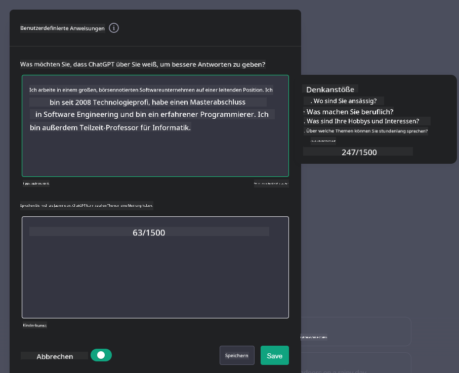
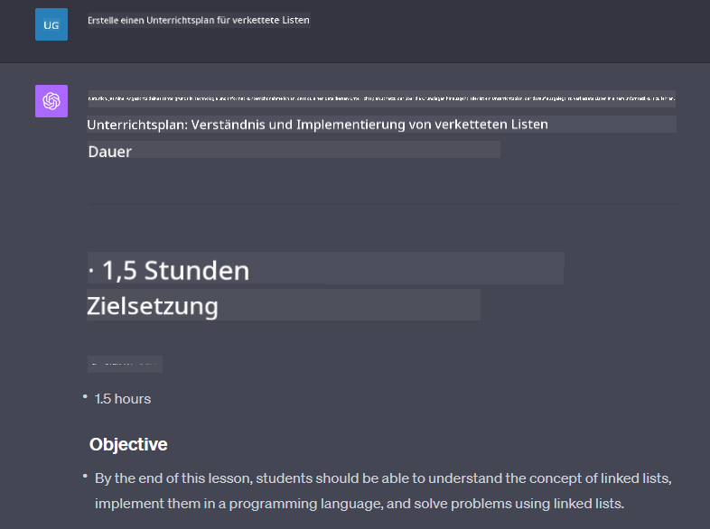

<!--
CO_OP_TRANSLATOR_METADATA:
{
  "original_hash": "ea4bbe640847aafbbba14dae4625e9af",
  "translation_date": "2025-07-09T12:15:06+00:00",
  "source_file": "07-building-chat-applications/README.md",
  "language_code": "de"
}
-->
# Entwicklung von Chat-Anwendungen mit generativer KI

[](https://aka.ms/gen-ai-lessons7-gh?WT.mc_id=academic-105485-koreyst)

> _(Klicken Sie auf das Bild oben, um das Video zu dieser Lektion anzusehen)_

Nachdem wir gesehen haben, wie man Textgenerierungs-Apps erstellt, werfen wir nun einen Blick auf Chat-Anwendungen.

Chat-Anwendungen sind in unserem Alltag fest verankert und bieten weit mehr als nur eine Möglichkeit für zwanglose Gespräche. Sie sind integraler Bestandteil von Kundenservice, technischem Support und sogar komplexen Beratungssystemen. Wahrscheinlich haben Sie erst vor Kurzem Hilfe von einer Chat-Anwendung erhalten. Mit der Integration fortschrittlicher Technologien wie generativer KI in diese Plattformen steigen sowohl die Komplexität als auch die Herausforderungen.

Einige Fragen, die wir beantworten müssen, sind:

- **Entwicklung der App**. Wie bauen wir diese KI-gestützten Anwendungen effizient und nahtlos für spezifische Anwendungsfälle ein?
- **Überwachung**. Nach der Bereitstellung: Wie können wir sicherstellen, dass die Anwendungen sowohl funktional als auch im Einklang mit den [sechs Prinzipien verantwortungsvoller KI](https://www.microsoft.com/ai/responsible-ai?WT.mc_id=academic-105485-koreyst) auf höchstem Qualitätsniveau arbeiten?

In einer Zeit, die von Automatisierung und nahtloser Mensch-Maschine-Interaktion geprägt ist, wird es immer wichtiger zu verstehen, wie generative KI den Umfang, die Tiefe und die Anpassungsfähigkeit von Chat-Anwendungen verändert. Diese Lektion untersucht die Architektur, die solche komplexen Systeme unterstützt, beleuchtet Methoden zur Feinabstimmung für domänenspezifische Aufgaben und bewertet Metriken sowie Überlegungen für eine verantwortungsvolle KI-Nutzung.

## Einführung

Diese Lektion behandelt:

- Techniken zum effizienten Aufbau und zur Integration von Chat-Anwendungen.
- Wie man Anwendungen anpasst und feinabstimmt.
- Strategien und Überlegungen zur effektiven Überwachung von Chat-Anwendungen.

## Lernziele

Am Ende dieser Lektion können Sie:

- Überlegungen zum Aufbau und zur Integration von Chat-Anwendungen in bestehende Systeme beschreiben.
- Chat-Anwendungen für spezifische Anwendungsfälle anpassen.
- Wichtige Metriken und Aspekte identifizieren, um die Qualität von KI-gestützten Chat-Anwendungen effektiv zu überwachen und zu erhalten.
- Sicherstellen, dass Chat-Anwendungen KI verantwortungsvoll nutzen.

## Integration von generativer KI in Chat-Anwendungen

Die Verbesserung von Chat-Anwendungen durch generative KI bedeutet nicht nur, sie „intelligenter“ zu machen, sondern auch ihre Architektur, Leistung und Benutzeroberfläche zu optimieren, um eine hochwertige Nutzererfahrung zu bieten. Das umfasst die Untersuchung der architektonischen Grundlagen, API-Integrationen und UI-Aspekte. Dieser Abschnitt bietet Ihnen eine umfassende Orientierungshilfe, um sich in diesen komplexen Bereichen zurechtzufinden – egal, ob Sie bestehende Systeme erweitern oder eigenständige Plattformen entwickeln.

Am Ende dieses Abschnitts verfügen Sie über das nötige Wissen, um Chat-Anwendungen effizient zu erstellen und zu integrieren.

### Chatbot oder Chat-Anwendung?

Bevor wir mit dem Bau von Chat-Anwendungen beginnen, vergleichen wir „Chatbots“ mit „KI-gestützten Chat-Anwendungen“, die unterschiedliche Rollen und Funktionen erfüllen. Ein Chatbot automatisiert in der Regel spezifische Gesprächsaufgaben, wie das Beantworten häufig gestellter Fragen oder das Verfolgen von Paketen. Er arbeitet meist regelbasiert oder mit komplexen KI-Algorithmen. Im Gegensatz dazu ist eine KI-gestützte Chat-Anwendung eine deutlich umfassendere Umgebung, die verschiedene Formen digitaler Kommunikation ermöglicht, etwa Text-, Sprach- und Videochats zwischen Menschen. Ihr zentrales Merkmal ist die Integration eines generativen KI-Modells, das nuancierte, menschenähnliche Gespräche simuliert und Antworten auf Basis vielfältiger Eingaben und Kontextinformationen generiert. Eine solche Anwendung kann offene Diskussionen führen, sich an wechselnde Gesprächskontexte anpassen und sogar kreative oder komplexe Dialoge erzeugen.

Die folgende Tabelle zeigt die wichtigsten Unterschiede und Gemeinsamkeiten, um ihre jeweiligen Rollen in der digitalen Kommunikation besser zu verstehen.

| Chatbot                               | Generative KI-gestützte Chat-Anwendung |
| ------------------------------------- | -------------------------------------- |
| Aufgabenorientiert und regelbasiert   | Kontextbewusst                         |
| Oft in größere Systeme integriert     | Kann einen oder mehrere Chatbots beherbergen |
| Auf programmierte Funktionen beschränkt | Nutzt generative KI-Modelle           |
| Spezialisierte & strukturierte Interaktionen | Ermöglicht offene Diskussionen        |

### Nutzung vorgefertigter Funktionen mit SDKs und APIs

Beim Aufbau einer Chat-Anwendung ist es sinnvoll, zunächst zu prüfen, was bereits verfügbar ist. Die Verwendung von SDKs und APIs ist aus verschiedenen Gründen eine vorteilhafte Strategie. Durch die Integration gut dokumentierter SDKs und APIs positionieren Sie Ihre Anwendung strategisch für langfristigen Erfolg und adressieren Skalierbarkeits- sowie Wartungsfragen.

- **Beschleunigt die Entwicklung und reduziert Aufwand**: Die Nutzung vorgefertigter Funktionen erspart den aufwändigen Eigenbau und ermöglicht es Ihnen, sich auf andere wichtige Aspekte wie die Geschäftslogik zu konzentrieren.
- **Bessere Leistung**: Wenn Sie Funktionen selbst entwickeln, stellen Sie sich irgendwann die Frage: „Wie skaliert das? Kann die Anwendung plötzliche Nutzeranstiege bewältigen?“ Gut gepflegte SDKs und APIs bieten oft integrierte Lösungen für solche Herausforderungen.
- **Einfachere Wartung**: Updates und Verbesserungen sind leichter zu handhaben, da meist nur eine Bibliothek aktualisiert werden muss, wenn eine neue Version erscheint.
- **Zugang zu modernster Technologie**: Durch die Nutzung feinabgestimmter und auf umfangreichen Datensätzen trainierter Modelle erhält Ihre Anwendung natürliche Sprachfähigkeiten.

Der Zugriff auf SDK- oder API-Funktionen erfolgt in der Regel durch eine Berechtigung, meist über einen eindeutigen Schlüssel oder Authentifizierungstoken. Wir verwenden die OpenAI Python Library, um zu zeigen, wie das funktioniert. Sie können es auch selbst ausprobieren in den folgenden [Notebooks für OpenAI](../../../07-building-chat-applications/python/oai-assignment.ipynb) oder [Azure OpenAI Services](../../../07-building-chat-applications/python/aoai-assignment.ipynb) für diese Lektion.

```python
import os
from openai import OpenAI

API_KEY = os.getenv("OPENAI_API_KEY","")

client = OpenAI(
    api_key=API_KEY
    )

chat_completion = client.chat.completions.create(model="gpt-3.5-turbo", messages=[{"role": "user", "content": "Suggest two titles for an instructional lesson on chat applications for generative AI."}])
```

Das obige Beispiel nutzt das GPT-3.5 Turbo Modell, um die Eingabe zu vervollständigen. Beachten Sie, dass der API-Schlüssel vorher gesetzt wird. Ohne Schlüssel erhalten Sie eine Fehlermeldung.

## Benutzererfahrung (UX)

Allgemeine UX-Prinzipien gelten auch für Chat-Anwendungen, aber hier sind einige zusätzliche Aspekte, die aufgrund der eingesetzten maschinellen Lernkomponenten besonders wichtig sind.

- **Mechanismus zur Klärung von Mehrdeutigkeiten**: Generative KI-Modelle erzeugen gelegentlich mehrdeutige Antworten. Eine Funktion, mit der Nutzer um Klarstellung bitten können, ist hilfreich, wenn sie auf dieses Problem stoßen.
- **Kontextbeibehaltung**: Fortgeschrittene generative KI-Modelle können den Gesprächskontext speichern, was für die Nutzererfahrung sehr wertvoll sein kann. Nutzern die Kontrolle über die Verwaltung des Kontexts zu geben, verbessert die Erfahrung, birgt aber auch das Risiko, sensible Daten zu speichern. Überlegungen zur Speicherdauer, etwa durch eine Aufbewahrungsrichtlinie, helfen, den Bedarf an Kontext mit Datenschutz zu vereinbaren.
- **Personalisierung**: KI-Modelle, die lernen und sich anpassen können, bieten eine individuelle Nutzererfahrung. Die Anpassung durch Funktionen wie Nutzerprofile lässt den Nutzer sich verstanden fühlen und unterstützt ihn dabei, gezielt Antworten zu finden – für eine effizientere und zufriedenstellendere Interaktion.

Ein Beispiel für Personalisierung sind die „Custom instructions“ in OpenAIs ChatGPT. Dort können Sie Informationen über sich selbst angeben, die für Ihre Eingaben wichtig sein könnten. Hier ein Beispiel für eine solche individuelle Anweisung.



Dieses „Profil“ veranlasst ChatGPT, einen Unterrichtsplan zu verketteten Listen zu erstellen. Beachten Sie, dass ChatGPT berücksichtigt, dass die Nutzerin aufgrund ihrer Erfahrung einen detaillierteren Plan wünscht.



### Microsofts System Message Framework für Large Language Models

[Microsoft gibt Empfehlungen](https://learn.microsoft.com/azure/ai-services/openai/concepts/system-message#define-the-models-output-format?WT.mc_id=academic-105485-koreyst) zum Verfassen effektiver Systemnachrichten für LLMs, unterteilt in 4 Bereiche:

1. Definition, für wen das Modell gedacht ist, sowie seiner Fähigkeiten und Grenzen.
2. Festlegung des Ausgabeformats des Modells.
3. Bereitstellung konkreter Beispiele, die das gewünschte Verhalten demonstrieren.
4. Zusätzliche Verhaltensrichtlinien.

### Barrierefreiheit

Unabhängig davon, ob Nutzer visuelle, auditive, motorische oder kognitive Einschränkungen haben, sollte eine gut gestaltete Chat-Anwendung für alle nutzbar sein. Die folgende Liste zeigt spezifische Funktionen zur Verbesserung der Barrierefreiheit für verschiedene Beeinträchtigungen.

- **Funktionen für Sehbehinderte**: Hochkontrast-Themen, skalierbarer Text, Kompatibilität mit Screenreadern.
- **Funktionen für Hörbehinderte**: Text-zu-Sprache und Sprache-zu-Text, visuelle Hinweise bei Audio-Benachrichtigungen.
- **Funktionen für motorische Einschränkungen**: Unterstützung der Tastaturnavigation, Sprachbefehle.
- **Funktionen für kognitive Einschränkungen**: Vereinfachte Sprachoptionen.

## Anpassung und Feinabstimmung für domänenspezifische Sprachmodelle

Stellen Sie sich eine Chat-Anwendung vor, die die Fachsprache Ihres Unternehmens versteht und die häufigsten Fragen der Nutzer antizipiert. Es gibt zwei wichtige Ansätze:

- **Nutzung von DSL-Modellen**. DSL steht für domain specific language (domänenspezifische Sprache). Sie können ein DSL-Modell verwenden, das auf eine bestimmte Domäne trainiert wurde, um deren Konzepte und Szenarien zu verstehen.
- **Feinabstimmung anwenden**. Feinabstimmung bedeutet, Ihr Modell mit spezifischen Daten weiter zu trainieren.

## Anpassung: Einsatz eines DSL-Modells

Der Einsatz domänenspezifischer Sprachmodelle (DSL-Modelle) kann die Nutzerbindung verbessern, indem spezialisierte, kontextbezogene Interaktionen ermöglicht werden. Ein solches Modell ist darauf trainiert oder feinabgestimmt, Texte zu einem bestimmten Fachgebiet, einer Branche oder einem Thema zu verstehen und zu generieren. Optionen reichen vom Training eines eigenen Modells bis zur Nutzung vorgefertigter Modelle über SDKs und APIs. Eine weitere Möglichkeit ist die Feinabstimmung, bei der ein bereits vortrainiertes Modell für eine spezifische Domäne angepasst wird.

## Anpassung: Feinabstimmung anwenden

Feinabstimmung wird oft dann in Betracht gezogen, wenn ein vortrainiertes Modell in einem spezialisierten Bereich oder für eine bestimmte Aufgabe nicht ausreicht.

Beispielsweise sind medizinische Anfragen komplex und erfordern viel Kontext. Wenn ein Arzt einen Patienten diagnostiziert, berücksichtigt er viele Faktoren wie Lebensstil oder Vorerkrankungen und stützt sich möglicherweise auf aktuelle medizinische Fachliteratur. In solchen differenzierten Fällen kann eine allgemeine KI-Chat-Anwendung keine verlässliche Quelle sein.

### Szenario: eine medizinische Anwendung

Denken Sie an eine Chat-Anwendung, die medizinisches Fachpersonal unterstützt, indem sie schnelle Verweise auf Behandlungsrichtlinien, Wechselwirkungen von Medikamenten oder aktuelle Forschungsergebnisse bietet.

Ein allgemeines Modell mag für einfache medizinische Fragen oder allgemeine Ratschläge ausreichen, hat aber Schwierigkeiten bei:

- **Sehr spezifischen oder komplexen Fällen**. Zum Beispiel könnte ein Neurologe fragen: „Was sind die aktuellen Best Practices zur Behandlung von medikamentenresistenter Epilepsie bei Kindern?“
- **Fehlenden aktuellen Erkenntnissen**. Ein allgemeines Modell könnte Schwierigkeiten haben, eine Antwort zu geben, die die neuesten Fortschritte in Neurologie und Pharmakologie berücksichtigt.

In solchen Fällen kann die Feinabstimmung mit einem spezialisierten medizinischen Datensatz die Fähigkeit des Modells, komplexe medizinische Anfragen präzise und zuverlässig zu beantworten, deutlich verbessern. Dafür ist der Zugang zu einem großen und relevanten Datensatz erforderlich, der die domänenspezifischen Herausforderungen und Fragestellungen abbildet.

## Überlegungen für eine hochwertige KI-gestützte Chat-Erfahrung

Dieser Abschnitt beschreibt Kriterien für „hochwertige“ Chat-Anwendungen, darunter die Erfassung aussagekräftiger Metriken und die Einhaltung eines Rahmens für den verantwortungsvollen Einsatz von KI-Technologie.

### Wichtige Metriken

Um die hohe Leistungsqualität einer Anwendung zu gewährleisten, ist es wichtig, zentrale Metriken und Aspekte zu verfolgen. Diese Messgrößen sichern nicht nur die Funktionalität, sondern bewerten auch die Qualität des KI-Modells und der Nutzererfahrung. Nachfolgend eine Liste mit grundlegenden, KI- und UX-bezogenen Metriken, die berücksichtigt werden sollten.

| Metrik                        | Definition                                                                                                             | Überlegungen für den Chat-Entwickler                                  |
| ----------------------------- | ---------------------------------------------------------------------------------------------------------------------- | --------------------------------------------------------------------- |
| **Verfügbarkeit (Uptime)**    | Misst die Zeit, in der die Anwendung betriebsbereit und für Nutzer zugänglich ist.                                    | Wie minimieren Sie Ausfallzeiten?                                     |
| **Antwortzeit**               | Die Zeit, die die Anwendung benötigt, um auf eine Nutzeranfrage zu reagieren.                                         | Wie optimieren Sie die Verarbeitung, um die Antwortzeit zu verkürzen?|
| **Präzision**                 | Verhältnis der korrekt positiven Vorhersagen zur Gesamtzahl positiver Vorhersagen.                                    | Wie validieren Sie die Präzision Ihres Modells?                      |
| **Recall (Sensitivität)**     | Verhältnis der korrekt positiven Vorhersagen zur tatsächlichen Anzahl positiver Fälle.                                | Wie messen und verbessern Sie den Recall?                            |
| **F1-Score**                 | Harmonisches Mittel von Präzision und Recall, das den Kompromiss zwischen beiden ausgleicht.                           | Welchen F1-Score streben Sie an? Wie balancieren Sie Präzision und Recall? |
| **Perplexity**                | Misst, wie gut die vom Modell vorhergesagte Wahrscheinlichkeitsverteilung mit der tatsächlichen Datenverteilung übereinstimmt. | Wie minimieren Sie die Perplexity?                                   |
| **Nutzerzufriedenheitsmetriken** | Erfasst die Wahrnehmung der Anwendung durch die Nutzer, oft über Umfragen.                                         | Wie häufig sammeln Sie Nutzerfeedback? Wie passen Sie sich daran an? |
| **Fehlerrate**                | Rate, mit der das Modell Fehler bei Verständnis oder Ausgabe macht.                                                   | Welche Strategien haben Sie zur Reduzierung der Fehlerrate?          |
| **Retrainingszyklen**         | Häufigkeit, mit der das Modell aktualisiert wird, um neue Daten und Erkenntnisse einzubeziehen.                      | Wie oft trainieren Sie das Modell neu? Was löst einen Retraining-Zyklus aus? |
| **Anomalieerkennung**         | Werkzeuge und Techniken zur Identifizierung ungewöhnlicher Muster, die nicht dem erwarteten Verhalten entsprechen.                        | Wie wirst du auf Anomalien reagieren?                                        |

### Umsetzung verantwortungsvoller KI-Praktiken in Chat-Anwendungen

Der Ansatz von Microsoft zu Responsible AI hat sechs Prinzipien definiert, die die Entwicklung und Nutzung von KI leiten sollten. Nachfolgend sind die Prinzipien, ihre Definition sowie Überlegungen für Chat-Entwickler aufgeführt und warum diese ernst genommen werden sollten.

| Prinzipien             | Definition von Microsoft                              | Überlegungen für Chat-Entwickler                                        | Warum es wichtig ist                                                                    |
| ---------------------- | ----------------------------------------------------- | ---------------------------------------------------------------------- | -------------------------------------------------------------------------------------- |
| Fairness               | KI-Systeme sollten alle Menschen fair behandeln.      | Sicherstellen, dass die Chat-Anwendung keine Diskriminierung aufgrund von Nutzerdaten vornimmt.  | Um Vertrauen und Inklusivität unter den Nutzern zu schaffen; vermeidet rechtliche Folgen.                |
| Zuverlässigkeit und Sicherheit | KI-Systeme sollten zuverlässig und sicher arbeiten. | Tests und Sicherheitsmechanismen implementieren, um Fehler und Risiken zu minimieren.         | Gewährleistet Nutzerzufriedenheit und verhindert potenzielle Schäden.                                 |
| Datenschutz und Sicherheit   | KI-Systeme sollten sicher sein und die Privatsphäre respektieren.      | Starke Verschlüsselung und Datenschutzmaßnahmen umsetzen.              | Zum Schutz sensibler Nutzerdaten und zur Einhaltung von Datenschutzgesetzen.                         |
| Inklusivität          | KI-Systeme sollten alle Menschen befähigen und einbeziehen. | UI/UX so gestalten, dass sie für unterschiedliche Zielgruppen zugänglich und benutzerfreundlich ist. | Stellt sicher, dass eine breitere Nutzergruppe die Anwendung effektiv nutzen kann.                   |
| Transparenz           | KI-Systeme sollten nachvollziehbar sein.                  | Klare Dokumentation und Begründungen für KI-Antworten bereitstellen.            | Nutzer vertrauen einem System eher, wenn sie verstehen, wie Entscheidungen getroffen werden. |
| Verantwortlichkeit         | Menschen sollten für KI-Systeme verantwortlich sein.          | Einen klaren Prozess für Audits und Verbesserungen von KI-Entscheidungen etablieren.     | Ermöglicht kontinuierliche Verbesserungen und Korrekturmaßnahmen bei Fehlern.               |

## Aufgabe

Siehe [assignment](../../../07-building-chat-applications/python) – dort wirst du durch eine Reihe von Übungen geführt, von den ersten Chat-Prompts über das Klassifizieren und Zusammenfassen von Texten bis hin zu weiteren Aufgaben. Beachte, dass die Aufgaben in verschiedenen Programmiersprachen verfügbar sind!

## Großartige Arbeit! Setze die Reise fort

Nach Abschluss dieser Lektion schau dir unsere [Generative AI Learning collection](https://aka.ms/genai-collection?WT.mc_id=academic-105485-koreyst) an, um dein Wissen über Generative KI weiter auszubauen!

Gehe zu Lektion 8, um zu sehen, wie du mit dem [Erstellen von Suchanwendungen](../08-building-search-applications/README.md?WT.mc_id=academic-105485-koreyst) beginnen kannst!

**Haftungsausschluss**:  
Dieses Dokument wurde mit dem KI-Übersetzungsdienst [Co-op Translator](https://github.com/Azure/co-op-translator) übersetzt. Obwohl wir uns um Genauigkeit bemühen, beachten Sie bitte, dass automatisierte Übersetzungen Fehler oder Ungenauigkeiten enthalten können. Das Originaldokument in seiner Ursprungssprache ist als maßgebliche Quelle zu betrachten. Für wichtige Informationen wird eine professionelle menschliche Übersetzung empfohlen. Wir übernehmen keine Haftung für Missverständnisse oder Fehlinterpretationen, die aus der Nutzung dieser Übersetzung entstehen.