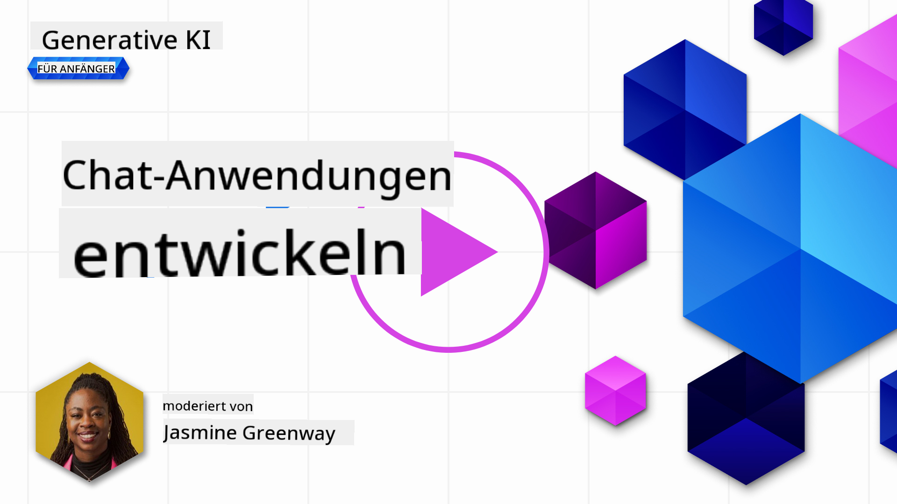

<!--
CO_OP_TRANSLATOR_METADATA:
{
  "original_hash": "a5308963a56cfbad2d73b0fa99fe84b3",
  "translation_date": "2025-10-17T22:58:38+00:00",
  "source_file": "07-building-chat-applications/README.md",
  "language_code": "de"
}
-->
# Aufbau von Chat-Anwendungen mit generativer KI

[](https://youtu.be/R9V0ZY1BEQo?si=IHuU-fS9YWT8s4sA)

> _(Klicken Sie auf das obige Bild, um das Video zu dieser Lektion anzusehen)_

Nachdem wir nun gesehen haben, wie wir Textgenerierungsanwendungen erstellen können, werfen wir einen Blick auf Chat-Anwendungen.

Chat-Anwendungen sind ein fester Bestandteil unseres täglichen Lebens geworden und bieten weit mehr als nur eine Möglichkeit zur lockeren Kommunikation. Sie sind integraler Bestandteil von Kundenservice, technischem Support und sogar von hochentwickelten Beratungssystemen. Wahrscheinlich haben Sie vor nicht allzu langer Zeit Hilfe von einer Chat-Anwendung erhalten. Mit der Integration fortschrittlicher Technologien wie generativer KI in diese Plattformen steigt jedoch nicht nur die Komplexität, sondern auch die Herausforderungen.

Einige Fragen, die beantwortet werden müssen, sind:

- **Erstellung der Anwendung**. Wie können wir diese KI-gestützten Anwendungen effizient erstellen und nahtlos für spezifische Anwendungsfälle integrieren?
- **Überwachung**. Wie können wir nach der Bereitstellung sicherstellen, dass die Anwendungen auf höchstem Qualitätsniveau arbeiten, sowohl in Bezug auf die Funktionalität als auch auf die Einhaltung der [sechs Prinzipien verantwortungsvoller KI](https://www.microsoft.com/ai/responsible-ai?WT.mc_id=academic-105485-koreyst)?

Da wir uns immer weiter in ein Zeitalter bewegen, das von Automatisierung und nahtlosen Mensch-Maschine-Interaktionen geprägt ist, wird es essenziell, zu verstehen, wie generative KI den Umfang, die Tiefe und die Anpassungsfähigkeit von Chat-Anwendungen transformiert. Diese Lektion untersucht die architektonischen Aspekte, die diese komplexen Systeme unterstützen, beleuchtet die Methoden zur Feinabstimmung für domänenspezifische Aufgaben und bewertet die Metriken und Überlegungen, die für eine verantwortungsvolle KI-Bereitstellung relevant sind.

## Einführung

Diese Lektion behandelt:

- Techniken für den effizienten Aufbau und die Integration von Chat-Anwendungen.
- Wie man Anwendungen anpasst und feinabstimmt.
- Strategien und Überlegungen zur effektiven Überwachung von Chat-Anwendungen.

## Lernziele

Am Ende dieser Lektion werden Sie in der Lage sein:

- Überlegungen zum Aufbau und zur Integration von Chat-Anwendungen in bestehende Systeme zu beschreiben.
- Chat-Anwendungen für spezifische Anwendungsfälle anzupassen.
- Wichtige Metriken und Überlegungen zu identifizieren, um die Qualität von KI-gestützten Chat-Anwendungen effektiv zu überwachen und aufrechtzuerhalten.
- Sicherzustellen, dass Chat-Anwendungen KI verantwortungsvoll nutzen.

## Integration von generativer KI in Chat-Anwendungen

Die Weiterentwicklung von Chat-Anwendungen durch generative KI dreht sich nicht nur darum, sie intelligenter zu machen; es geht auch darum, ihre Architektur, Leistung und Benutzeroberfläche zu optimieren, um ein qualitativ hochwertiges Benutzererlebnis zu bieten. Dies erfordert eine Untersuchung der architektonischen Grundlagen, der API-Integrationen und der Überlegungen zur Benutzeroberfläche. Dieser Abschnitt soll Ihnen eine umfassende Roadmap bieten, um sich in diesen komplexen Landschaften zurechtzufinden, unabhängig davon, ob Sie sie in bestehende Systeme integrieren oder als eigenständige Plattformen aufbauen.

Am Ende dieses Abschnitts werden Sie über das Wissen verfügen, das erforderlich ist, um Chat-Anwendungen effizient zu erstellen und zu integrieren.

### Chatbot oder Chat-Anwendung?

Bevor wir uns mit dem Aufbau von Chat-Anwendungen befassen, vergleichen wir 'Chatbots' mit 'KI-gestützten Chat-Anwendungen', die unterschiedliche Rollen und Funktionen erfüllen. Der Hauptzweck eines Chatbots besteht darin, spezifische Konversationsaufgaben zu automatisieren, wie z. B. das Beantworten häufig gestellter Fragen oder das Verfolgen eines Pakets. Er wird typischerweise durch regelbasierte Logik oder komplexe KI-Algorithmen gesteuert. Im Gegensatz dazu ist eine KI-gestützte Chat-Anwendung eine weitaus umfassendere Umgebung, die verschiedene Formen der digitalen Kommunikation wie Text-, Sprach- und Videochats zwischen menschlichen Nutzern ermöglicht. Ihr Hauptmerkmal ist die Integration eines generativen KI-Modells, das nuancierte, menschenähnliche Gespräche simuliert und Antworten auf der Grundlage einer Vielzahl von Eingaben und Kontexten generiert. Eine generative KI-gestützte Chat-Anwendung kann offene Diskussionen führen, sich an sich entwickelnde Gesprächskontexte anpassen und sogar kreative oder komplexe Dialoge erzeugen.

Die folgende Tabelle zeigt die wichtigsten Unterschiede und Gemeinsamkeiten, um uns zu helfen, ihre einzigartigen Rollen in der digitalen Kommunikation zu verstehen.

| Chatbot                               | Generative KI-gestützte Chat-Anwendung |
| ------------------------------------- | -------------------------------------- |
| Aufgabenorientiert und regelbasiert   | Kontextbewusst                         |
| Oft in größere Systeme integriert     | Kann einen oder mehrere Chatbots hosten |
| Auf programmierte Funktionen beschränkt | Integriert generative KI-Modelle       |
| Spezialisierte & strukturierte Interaktionen | Fähig zu offenen Diskussionen         |

### Nutzung vorgefertigter Funktionen mit SDKs und APIs

Beim Aufbau einer Chat-Anwendung ist ein guter erster Schritt, zu bewerten, was bereits verfügbar ist. Die Verwendung von SDKs und APIs zum Erstellen von Chat-Anwendungen ist aus verschiedenen Gründen eine vorteilhafte Strategie. Durch die Integration gut dokumentierter SDKs und APIs positionieren Sie Ihre Anwendung strategisch für langfristigen Erfolg und adressieren Skalierbarkeits- und Wartungsprobleme.

- **Beschleunigt den Entwicklungsprozess und reduziert den Aufwand**: Sich auf vorgefertigte Funktionen zu verlassen, anstatt den teuren Prozess des Eigenbaus zu durchlaufen, ermöglicht es Ihnen, sich auf andere Aspekte Ihrer Anwendung zu konzentrieren, die Sie möglicherweise für wichtiger halten, wie z. B. die Geschäftslogik.
- **Bessere Leistung**: Wenn Sie Funktionen von Grund auf neu erstellen, werden Sie sich irgendwann fragen: "Wie skaliert das? Kann diese Anwendung einen plötzlichen Benutzeranstieg bewältigen?" Gut gepflegte SDKs und APIs haben oft bereits Lösungen für diese Bedenken integriert.
- **Einfachere Wartung**: Updates und Verbesserungen sind einfacher zu verwalten, da die meisten APIs und SDKs lediglich ein Update einer Bibliothek erfordern, wenn eine neuere Version veröffentlicht wird.
- **Zugang zu modernster Technologie**: Die Nutzung von Modellen, die auf umfangreichen Datensätzen trainiert und feinabgestimmt wurden, bietet Ihrer Anwendung natürliche Sprachfähigkeiten.

Der Zugriff auf die Funktionalität eines SDKs oder einer API erfordert in der Regel die Erlaubnis zur Nutzung der bereitgestellten Dienste, was oft durch die Verwendung eines eindeutigen Schlüssels oder Authentifizierungstokens erfolgt. Wir werden die OpenAI Python-Bibliothek verwenden, um zu untersuchen, wie dies aussieht. Sie können dies auch selbst in dem folgenden [Notebook für OpenAI](./python/oai-assignment.ipynb?WT.mc_id=academic-105485-koreyst) oder [Notebook für Azure OpenAI Services](./python/aoai-assignment.ipynb?WT.mc_id=academic-105485-koreys) für diese Lektion ausprobieren.

```python
import os
from openai import OpenAI

API_KEY = os.getenv("OPENAI_API_KEY","")

client = OpenAI(
    api_key=API_KEY
    )

chat_completion = client.chat.completions.create(model="gpt-3.5-turbo", messages=[{"role": "user", "content": "Suggest two titles for an instructional lesson on chat applications for generative AI."}])
```

Das obige Beispiel verwendet das GPT-3.5 Turbo-Modell, um die Eingabeaufforderung zu vervollständigen. Beachten Sie jedoch, dass der API-Schlüssel vorab festgelegt wird. Sie würden einen Fehler erhalten, wenn Sie den Schlüssel nicht setzen.

## Benutzererfahrung (UX)

Allgemeine UX-Prinzipien gelten auch für Chat-Anwendungen, aber hier sind einige zusätzliche Überlegungen, die aufgrund der maschinellen Lernkomponenten besonders wichtig werden.

- **Mechanismus zur Klärung von Mehrdeutigkeiten**: Generative KI-Modelle erzeugen gelegentlich mehrdeutige Antworten. Eine Funktion, die es Benutzern ermöglicht, um Klarstellung zu bitten, kann hilfreich sein, falls sie auf dieses Problem stoßen.
- **Kontextbeibehaltung**: Fortschrittliche generative KI-Modelle können sich den Kontext innerhalb eines Gesprächs merken, was ein notwendiger Vorteil für die Benutzererfahrung sein kann. Den Benutzern die Möglichkeit zu geben, den Kontext zu steuern und zu verwalten, verbessert die Benutzererfahrung, birgt jedoch das Risiko, sensible Benutzerinformationen zu speichern. Überlegungen dazu, wie lange diese Informationen gespeichert werden, wie z. B. die Einführung einer Aufbewahrungsrichtlinie, können das Bedürfnis nach Kontext mit dem Datenschutz in Einklang bringen.
- **Personalisierung**: Mit der Fähigkeit zu lernen und sich anzupassen, bieten KI-Modelle eine individualisierte Erfahrung für den Benutzer. Die Anpassung der Benutzererfahrung durch Funktionen wie Benutzerprofile lässt den Benutzer nicht nur verstanden fühlen, sondern hilft ihm auch, spezifische Antworten zu finden, was eine effizientere und zufriedenstellendere Interaktion schafft.

Ein Beispiel für Personalisierung ist die Einstellung "Benutzerdefinierte Anweisungen" in OpenAI's ChatGPT. Sie ermöglicht es Ihnen, Informationen über sich selbst bereitzustellen, die für Ihre Eingabeaufforderungen wichtig sein könnten. Hier ist ein Beispiel für eine benutzerdefinierte Anweisung.


Dieses "Profil" fordert ChatGPT auf, einen Lehrplan zu verketteten Listen zu erstellen. Beachten Sie, dass ChatGPT berücksichtigt, dass der Benutzer möglicherweise einen detaillierteren Lehrplan basierend auf ihrer Erfahrung wünscht.


### Microsofts Systemnachrichten-Framework für große Sprachmodelle

[Microsoft hat Leitlinien bereitgestellt](https://learn.microsoft.com/azure/ai-services/openai/concepts/system-message#define-the-models-output-format?WT.mc_id=academic-105485-koreyst) für das Schreiben effektiver Systemnachrichten bei der Generierung von Antworten aus großen Sprachmodellen, unterteilt in vier Bereiche:

1. Definition, für wen das Modell gedacht ist, sowie seiner Fähigkeiten und Einschränkungen.
2. Definition des Ausgabeformats des Modells.
3. Bereitstellung spezifischer Beispiele, die das beabsichtigte Verhalten des Modells demonstrieren.
4. Bereitstellung zusätzlicher Verhaltensrichtlinien.

### Barrierefreiheit

Egal, ob ein Benutzer eine Seh-, Hör-, Bewegungs- oder kognitive Beeinträchtigung hat, eine gut gestaltete Chat-Anwendung sollte für alle nutzbar sein. Die folgende Liste beschreibt spezifische Funktionen, die darauf abzielen, die Barrierefreiheit für verschiedene Benutzerbeeinträchtigungen zu verbessern.

- **Funktionen für Sehbehinderte**: Hoher Kontrast und anpassbare Textgrößen, Kompatibilität mit Bildschirmlesegeräten.
- **Funktionen für Hörgeschädigte**: Text-zu-Sprache- und Sprache-zu-Text-Funktionen, visuelle Hinweise für Audio-Benachrichtigungen.
- **Funktionen für motorische Beeinträchtigungen**: Unterstützung der Tastaturnavigation, Sprachbefehle.
- **Funktionen für kognitive Beeinträchtigungen**: Optionen für vereinfachte Sprache.

## Anpassung und Feinabstimmung für domänenspezifische Sprachmodelle

Stellen Sie sich eine Chat-Anwendung vor, die den Jargon Ihres Unternehmens versteht und die spezifischen Anfragen seiner Benutzerbasis antizipiert. Es gibt einige erwähnenswerte Ansätze:

- **Nutzung von DSL-Modellen**. DSL steht für domänenspezifische Sprache. Sie können ein sogenanntes DSL-Modell verwenden, das auf einem bestimmten Bereich trainiert wurde, um dessen Konzepte und Szenarien zu verstehen.
- **Anwendung von Feinabstimmung**. Feinabstimmung ist der Prozess des weiteren Trainings Ihres Modells mit spezifischen Daten.

## Anpassung: Verwendung eines DSL

Die Nutzung von domänenspezifischen Sprachmodellen (DSL-Modelle) kann die Benutzerbindung verbessern, indem spezialisierte, kontextuell relevante Interaktionen bereitgestellt werden. Es handelt sich um ein Modell, das trainiert oder feinabgestimmt wurde, um Text zu einem bestimmten Bereich, einer Branche oder einem Thema zu verstehen und zu generieren. Optionen für die Verwendung eines DSL-Modells reichen vom Training eines Modells von Grund auf bis zur Nutzung bereits vorhandener Modelle über SDKs und APIs. Eine weitere Option ist die Feinabstimmung, bei der ein bestehendes vortrainiertes Modell an eine spezifische Domäne angepasst wird.

## Anpassung: Anwendung von Feinabstimmung

Feinabstimmung wird oft in Betracht gezogen, wenn ein vortrainiertes Modell in einem spezialisierten Bereich oder bei einer spezifischen Aufgabe nicht ausreicht.

Zum Beispiel sind medizinische Anfragen komplex und erfordern viel Kontext. Wenn ein Mediziner einen Patienten diagnostiziert, basiert dies auf einer Vielzahl von Faktoren wie Lebensstil oder Vorerkrankungen und kann sogar auf aktuellen medizinischen Fachzeitschriften beruhen, um die Diagnose zu untermauern. In solchen nuancierten Szenarien kann eine allgemeine KI-Chat-Anwendung keine zuverlässige Quelle sein.

### Szenario: Eine medizinische Anwendung

Betrachten wir eine Chat-Anwendung, die medizinischen Fachkräften hilft, schnell auf Behandlungsrichtlinien, Wechselwirkungen von Medikamenten oder aktuelle Forschungsergebnisse zuzugreifen.

Ein allgemeines Modell könnte ausreichen, um grundlegende medizinische Fragen zu beantworten oder allgemeine Ratschläge zu geben, aber es könnte bei Folgendem Schwierigkeiten haben:

- **Hochspezifische oder komplexe Fälle**. Zum Beispiel könnte ein Neurologe die Anwendung fragen: "Was sind die aktuellen Best Practices für das Management von medikamentenresistenter Epilepsie bei pädiatrischen Patienten?"
- **Fehlende aktuelle Fortschritte**. Ein allgemeines Modell könnte Schwierigkeiten haben, eine aktuelle Antwort zu geben, die die neuesten Fortschritte in der Neurologie und Pharmakologie berücksichtigt.

In solchen Fällen kann die Feinabstimmung des Modells mit einem spezialisierten medizinischen Datensatz seine Fähigkeit, diese komplexen medizinischen Anfragen genau und zuverlässig zu bearbeiten, erheblich verbessern. Dies erfordert den Zugang zu einem großen und relevanten Datensatz, der die domänenspezifischen Herausforderungen und Fragen repräsentiert, die adressiert werden müssen.

## Überlegungen für ein qualitativ hochwertiges KI-gestütztes Chat-Erlebnis

Dieser Abschnitt skizziert die Kriterien für "hochwertige" Chat-Anwendungen, einschließlich der Erfassung von umsetzbaren Metriken und der Einhaltung eines Rahmens, der die verantwortungsvolle Nutzung von KI-Technologie sicherstellt.

### Wichtige Metriken

Um die hohe Leistungsqualität einer Anwendung aufrechtzuerhalten, ist es essenziell, wichtige Metriken und Überlegungen im Auge zu behalten. Diese Messungen gewährleisten nicht nur die Funktionalität der Anwendung, sondern bewerten auch die Qualität des KI-Modells und der Benutzererfahrung. Nachfolgend finden Sie eine Liste, die grundlegende, KI- und Benutzererfahrungsmetriken umfasst, die berücksichtigt werden sollten.

| Metrik                        | Definition                                                                                                             | Überlegungen für den Chat-Entwickler                                      |
| ----------------------------- | ---------------------------------------------------------------------------------------------------------------------- | ------------------------------------------------------------------------- |
| **Verfügbarkeit**             | Misst die Zeit, in der die Anwendung betriebsbereit und für Benutzer zugänglich ist.                                   | Wie minimieren Sie Ausfallzeiten?                                         |
| **Antwortzeit**               | Die Zeit, die die Anwendung benötigt, um auf eine Benutzeranfrage zu antworten.                                        | Wie können Sie die Abfrageverarbeitung optimieren, um die Antwortzeit zu verbessern? |
| **Präzision**                 | Das Verhältnis von echten positiven Vorhersagen zur Gesamtzahl der positiven Vorhersagen.                              | Wie validieren Sie die Präzision Ihres Modells?                           |
| **Recall (Sensitivität)**     | Das Verhältnis von echten positiven Vorhersagen zur tatsächlichen Anzahl der Positiven.                                | Wie messen und verbessern Sie den Recall?                                |
| **F1-Score**                  | Der harmonische Mittelwert von Präzision und Recall, der den Kompromiss zwischen beiden ausgleicht.                    | Was ist Ihr Ziel-F1-Score? Wie balancieren Sie Präzision und Recall?      |
| **Perplexität**               | Misst, wie gut die vom Modell vorhergesagte Wahrscheinlichkeitsverteilung mit der tatsächlichen Verteilung der Daten übereinstimmt. | Wie minimieren Sie die Perplexität?                                       |
| **Benutzerzufriedenheitsmetriken** | Misst die Wahrnehmung der Anwendung durch den Benutzer. Oft durch Umfragen erfasst.                                  | Wie oft sammeln Sie Benutzerfeedback? Wie passen Sie sich basierend darauf an? |
| **Fehlerrate**                | Die Rate, mit der das Modell Fehler beim Verstehen oder Ausgeben macht.                                                | Welche Strategien haben Sie, um Fehlerraten zu reduzieren?                |
| **Retraining-Zyklen**         | Die Häufigkeit, mit der das Modell aktualisiert wird, um neue Daten und Erkenntnisse zu integrieren.                   | Wie oft werden Sie das Modell neu trainieren? Was löst einen Retraining-Zyklus aus? |
| **Anomalieerkennung**         | Werkzeuge und Techniken zur Identifizierung ungewöhnlicher Muster, die nicht dem erwarteten Verhalten entsprechen.       | Wie werden Sie auf Anomalien reagieren?                                               |

### Umsetzung verantwortungsvoller KI-Praktiken in Chat-Anwendungen

Microsofts Ansatz für verantwortungsvolle KI hat sechs Prinzipien identifiziert, die die Entwicklung und Nutzung von KI leiten sollten. Nachfolgend sind die Prinzipien, ihre Definition und Überlegungen für Chat-Entwickler sowie die Gründe, warum sie ernst genommen werden sollten.

| Prinzipien             | Microsofts Definition                                 | Überlegungen für Chat-Entwickler                                       | Warum es wichtig ist                                                                  |
| ---------------------- | ----------------------------------------------------- | ---------------------------------------------------------------------- | ------------------------------------------------------------------------------------- |
| Fairness               | KI-Systeme sollten alle Menschen fair behandeln.      | Sicherstellen, dass die Chat-Anwendung nicht auf Grundlage von Benutzerdaten diskriminiert. | Um Vertrauen und Inklusivität unter den Nutzern aufzubauen; vermeidet rechtliche Konsequenzen. |
| Zuverlässigkeit und Sicherheit | KI-Systeme sollten zuverlässig und sicher funktionieren. | Tests und Sicherheitsvorkehrungen implementieren, um Fehler und Risiken zu minimieren. | Sorgt für Zufriedenheit der Nutzer und verhindert potenziellen Schaden.              |
| Datenschutz und Sicherheit | KI-Systeme sollten sicher sein und die Privatsphäre respektieren. | Starke Verschlüsselungs- und Datenschutzmaßnahmen implementieren.      | Zum Schutz sensibler Nutzerdaten und zur Einhaltung von Datenschutzgesetzen.          |
| Inklusivität           | KI-Systeme sollten alle Menschen einbeziehen und befähigen. | UI/UX so gestalten, dass sie für unterschiedliche Zielgruppen zugänglich und benutzerfreundlich ist. | Stellt sicher, dass eine breite Palette von Menschen die Anwendung effektiv nutzen kann. |
| Transparenz            | KI-Systeme sollten verständlich sein.                 | Klare Dokumentation und Begründung für KI-Antworten bereitstellen.     | Nutzer vertrauen einem System eher, wenn sie verstehen, wie Entscheidungen getroffen werden. |
| Verantwortlichkeit     | Menschen sollten für KI-Systeme verantwortlich sein.  | Einen klaren Prozess für die Überprüfung und Verbesserung von KI-Entscheidungen etablieren. | Ermöglicht kontinuierliche Verbesserungen und Korrekturmaßnahmen im Falle von Fehlern. |

## Aufgabe

Siehe [Aufgabe](../../../07-building-chat-applications/python). Sie führt Sie durch eine Reihe von Übungen, von der Ausführung Ihrer ersten Chat-Eingaben bis hin zur Klassifizierung und Zusammenfassung von Text und mehr. Beachten Sie, dass die Aufgaben in verschiedenen Programmiersprachen verfügbar sind!

## Großartige Arbeit! Setzen Sie Ihre Reise fort

Nach Abschluss dieser Lektion schauen Sie sich unsere [Generative AI Learning Collection](https://aka.ms/genai-collection?WT.mc_id=academic-105485-koreyst) an, um Ihr Wissen über generative KI weiter zu vertiefen!

Gehen Sie zu Lektion 8, um zu erfahren, wie Sie [Suchanwendungen erstellen](../08-building-search-applications/README.md?WT.mc_id=academic-105485-koreyst) können!

---

**Haftungsausschluss**:  
Dieses Dokument wurde mit dem KI-Übersetzungsdienst [Co-op Translator](https://github.com/Azure/co-op-translator) übersetzt. Obwohl wir uns um Genauigkeit bemühen, beachten Sie bitte, dass automatisierte Übersetzungen Fehler oder Ungenauigkeiten enthalten können. Das Originaldokument in seiner ursprünglichen Sprache sollte als maßgebliche Quelle betrachtet werden. Für kritische Informationen wird eine professionelle menschliche Übersetzung empfohlen. Wir übernehmen keine Haftung für Missverständnisse oder Fehlinterpretationen, die sich aus der Nutzung dieser Übersetzung ergeben.