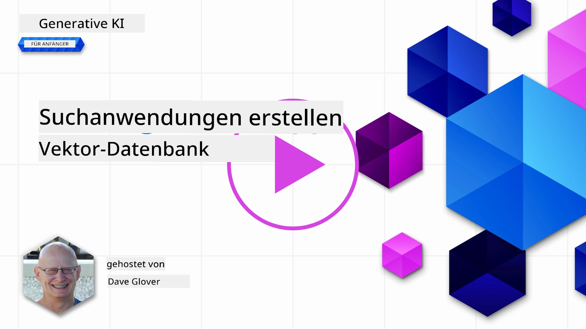
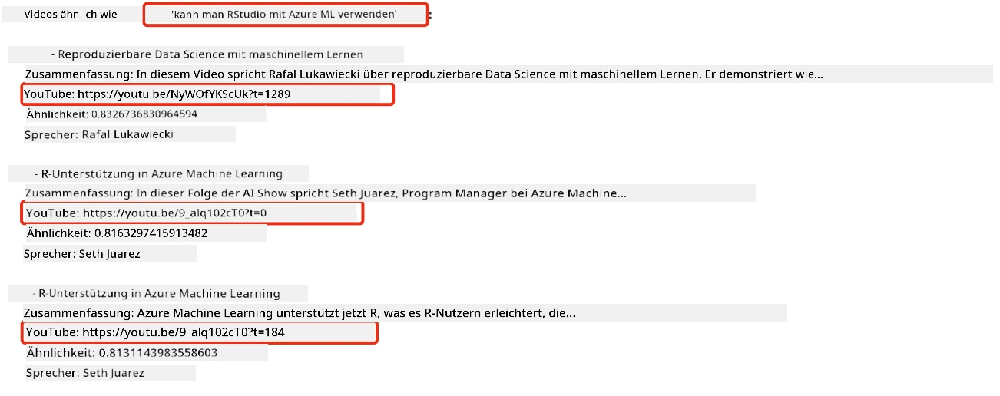
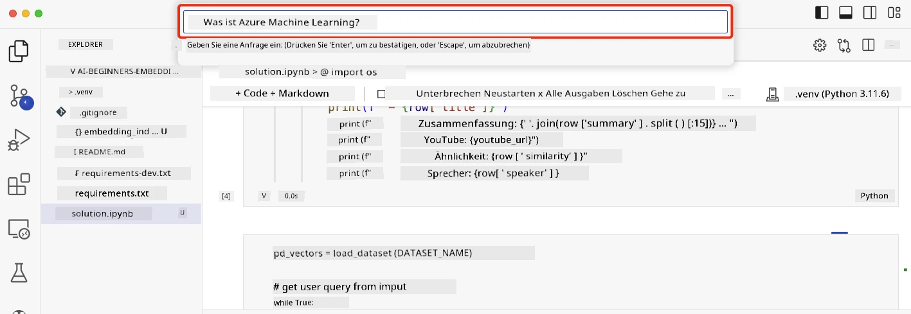

# Erstellen einer Suchanwendung

[](https://youtu.be/W0-nzXjOjr0?si=GcsqiTTvd7RKbo7V)

> > _Klicken Sie auf das obige Bild, um das Video zu dieser Lektion anzusehen_

Große Sprachmodelle bieten mehr als nur Chatbots und Texterzeugung. Es ist auch möglich, Suchanwendungen unter Verwendung von Embeddings zu erstellen. Embeddings sind numerische Darstellungen von Daten, auch als Vektoren bekannt, und können für die semantische Suche in Daten verwendet werden.

In dieser Lektion werden Sie eine Suchanwendung für unser Bildungs-Startup erstellen. Unser Startup ist eine gemeinnützige Organisation, die Studenten in Entwicklungsländern kostenlose Bildung anbietet. Unser Startup verfügt über eine große Anzahl von YouTube-Videos, die Studenten zum Lernen über KI nutzen können. Unser Startup möchte eine Suchanwendung erstellen, die es den Studenten ermöglicht, durch Eingabe einer Frage nach einem YouTube-Video zu suchen.

Zum Beispiel könnte ein Student „Was sind Jupyter Notebooks?“ oder „Was ist Azure ML?“ eingeben, und die Suchanwendung gibt eine Liste von YouTube-Videos zurück, die für die Frage relevant sind. Noch besser ist, dass die Suchanwendung einen Link an die Stelle im Video zurückgibt, an der die Antwort auf die Frage zu finden ist.

## Einführung

In dieser Lektion behandeln wir:

- Semantische Suche vs. Stichwortsuche.
- Was Text-Embeddings sind.
- Erstellen eines Text-Embeddings-Index.
- Durchsuchen eines Text-Embeddings-Index.

## Lernziele

Nach Abschluss dieser Lektion können Sie:

- Den Unterschied zwischen semantischer Suche und Stichwortsuche erläutern.
- Erklären, was Text-Embeddings sind.
- Eine Anwendung erstellen, die Embeddings verwendet, um nach Daten zu suchen.

## Warum eine Suchanwendung erstellen?

Die Erstellung einer Suchanwendung hilft Ihnen zu verstehen, wie man Embeddings verwendet, um nach Daten zu suchen. Außerdem lernen Sie, wie man eine Suchanwendung baut, die Studenten hilft, Informationen schnell zu finden.

Die Lektion beinhaltet einen Embedding-Index der YouTube-Transkripte des Microsoft [AI Show](https://www.youtube.com/playlist?list=PLlrxD0HtieHi0mwteKBOfEeOYf0LJU4O1) YouTube-Kanals. Die AI Show ist ein YouTube-Kanal, der Ihnen KI und maschinelles Lernen näherbringt. Der Embedding-Index enthält die Embeddings für jeden der YouTube-Transkripte bis Oktober 2023. Sie werden den Embedding-Index verwenden, um eine Suchanwendung für unser Startup zu erstellen. Die Suchanwendung gibt einen Link zur Stelle im Video zurück, an der die Antwort auf die Frage zu finden ist. Dies ist eine hervorragende Möglichkeit für Studenten, die benötigten Informationen schnell zu finden.

Im Folgenden sehen Sie ein Beispiel für eine semantische Abfrage mit der Frage „kann man rstudio mit azure ml verwenden?“. Werfen Sie einen Blick auf die YouTube-URL: Darin ist ein Zeitstempel enthalten, der Sie zu der Stelle im Video führt, an der die Antwort auf die Frage gegeben wird.



## Was ist semantische Suche?

Vielleicht fragen Sie sich, was semantische Suche ist? Semantische Suche ist eine Suchtechnik, die die Semantik oder Bedeutung der Wörter einer Abfrage verwendet, um relevante Ergebnisse zurückzugeben.

Hier ist ein Beispiel für semantische Suche. Angenommen, Sie möchten ein Auto kaufen und suchen nach „mein Traumauto“. Die semantische Suche versteht, dass Sie nicht von einem Auto `träumen`, sondern Ihr `ideales` Auto kaufen möchten. Die semantische Suche erkennt Ihre Absicht und liefert relevante Ergebnisse. Die Alternative ist die `Stichwortsuche`, die tatsächlich nach Träumen über Autos sucht und oft irrelevante Ergebnisse liefert.

## Was sind Text-Embeddings?

[Text-Embeddings](https://en.wikipedia.org/wiki/Word_embedding?WT.mc_id=academic-105485-koreyst) sind eine Technik der Textrepräsentation, die in der [Verarbeitung natürlicher Sprache](https://en.wikipedia.org/wiki/Natural_language_processing?WT.mc_id=academic-105485-koreyst) eingesetzt wird. Text-Embeddings sind semantische numerische Darstellungen von Text. Embeddings werden genutzt, um Daten so darzustellen, dass Maschinen diese leichter verstehen können. Es gibt viele Modelle zur Erstellung von Text-Embeddings; in dieser Lektion konzentrieren wir uns auf das Erzeugen von Embeddings mithilfe des OpenAI Embedding-Modells.

Hier ein Beispiel: Stellen Sie sich vor, der folgende Text stammt aus einem Transkript einer Folge des AI Show YouTube-Kanals:

```text
Today we are going to learn about Azure Machine Learning.
```

Wir geben den Text an die OpenAI Embedding API weiter, die eine Embedding zurückgibt, die aus 1536 Zahlen besteht, auch Vektor genannt. Jede Zahl im Vektor repräsentiert einen anderen Aspekt des Textes. Der Übersichtlichkeit halber sind hier die ersten 10 Zahlen des Vektors aufgeführt.

```python
[-0.006655829958617687, 0.0026128944009542465, 0.008792596869170666, -0.02446001023054123, -0.008540431968867779, 0.022071078419685364, -0.010703742504119873, 0.003311325330287218, -0.011632772162556648, -0.02187200076878071, ...]
```

## Wie wird der Embedding-Index erstellt?

Der Embedding-Index für diese Lektion wurde mit einer Reihe von Python-Skripten erstellt. Sie finden die Skripte zusammen mit Anweisungen in der [README](./scripts/README.md?WT.mc_id=academic-105485-koreyst) im Ordner 'scripts' dieser Lektion. Sie müssen diese Skripte nicht ausführen, um die Lektion abzuschließen, da der Embedding-Index für Sie bereitgestellt wird.

Die Skripte führen folgende Schritte aus:

1. Das Transkript jedes YouTube-Videos in der [AI Show](https://www.youtube.com/playlist?list=PLlrxD0HtieHi0mwteKBOfEeOYf0LJU4O1) Wiedergabeliste wird heruntergeladen.
2. Mithilfe von [OpenAI Functions](https://learn.microsoft.com/azure/ai-foundry/openai/how-to/function-calling?WT.mc_id=academic-105485-koreyst) wird versucht, den Namen des Sprechers aus den ersten 3 Minuten des YouTube-Transkripts zu extrahieren. Der Sprechername für jedes Video wird im Embedding-Index namens `embedding_index_3m.json` gespeichert.
3. Der Transkripttext wird dann in **3-minütige Textabschnitte** unterteilt. Der Abschnitt enthält etwa 20 Wörter, die mit dem nächsten Abschnitt überlappen, um sicherzustellen, dass das Embedding für den Abschnitt nicht abgeschnitten wird und um einen besseren Suchkontext zu bieten.
4. Jeder Textabschnitt wird dann an die OpenAI Chat API übergeben, um den Text in 60 Wörter zusammenzufassen. Die Zusammenfassung wird ebenfalls im Embedding-Index `embedding_index_3m.json` gespeichert.
5. Schließlich wird der Abschnittstext an die OpenAI Embedding API übergeben. Die Embedding-API gibt einen Vektor aus 1536 Zahlen zurück, die die semantische Bedeutung des Abschnitts repräsentieren. Der Abschnitt und der OpenAI Embedding-Vektor werden im Embedding-Index `embedding_index_3m.json` gespeichert.

### Vektordatenbanken

Zur Vereinfachung der Lektion wird der Embedding-Index in einer JSON-Datei mit dem Namen `embedding_index_3m.json` gespeichert und in ein Pandas DataFrame geladen. In der Produktion würde der Embedding-Index jedoch in einer Vektordatenbank wie [Azure Cognitive Search](https://learn.microsoft.com/training/modules/improve-search-results-vector-search?WT.mc_id=academic-105485-koreyst), [Redis](https://cookbook.openai.com/examples/vector_databases/redis/readme?WT.mc_id=academic-105485-koreyst), [Pinecone](https://cookbook.openai.com/examples/vector_databases/pinecone/readme?WT.mc_id=academic-105485-koreyst), [Weaviate](https://cookbook.openai.com/examples/vector_databases/weaviate/readme?WT.mc_id=academic-105485-koreyst) und anderen gespeichert.

## Verstehen der Kosinusähnlichkeit

Wir haben etwas über Text-Embeddings gelernt, der nächste Schritt ist zu lernen, wie man Text-Embeddings verwendet, um nach Daten zu suchen und insbesondere die ähnlichsten Embeddings zu einer gegebenen Abfrage mithilfe der Kosinusähnlichkeit zu finden.

### Was ist Kosinusähnlichkeit?

Kosinusähnlichkeit ist ein Maß für die Ähnlichkeit zwischen zwei Vektoren, dies wird auch als `Nearest-Neighbor-Suche` bezeichnet. Um eine Kosinusähnlichkeitssuche durchzuführen, müssen Sie den _Abfrage_-Text unter Verwendung der OpenAI Embedding API _vektorisieren_. Anschließend berechnen Sie die _Kosinusähnlichkeit_ zwischen dem Abfragevektor und jedem Vektor im Embedding-Index. Denken Sie daran, dass der Embedding-Index einen Vektor für jeden Textabschnitt des YouTube-Transkripts enthält. Am Ende sortieren Sie die Ergebnisse nach Kosinusähnlichkeit, und die Textabschnitte mit der höchsten Kosinusähnlichkeit sind am ähnlichsten zur Abfrage.

Aus mathematischer Sicht misst die Kosinusähnlichkeit den Kosinus des Winkels zwischen zwei Vektoren, die in einem mehrdimensionalen Raum projiziert sind. Dieses Maß ist nützlich, denn wenn zwei Dokumente aufgrund ihrer Größe im euklidischen Raum weit auseinanderliegen, können sie dennoch einen kleineren Winkel (und damit eine höhere Kosinusähnlichkeit) haben. Weitere Informationen zu den Gleichungen der Kosinusähnlichkeit finden Sie unter [Kosinusähnlichkeit](https://en.wikipedia.org/wiki/Cosine_similarity?WT.mc_id=academic-105485-koreyst).

## Erstellen Ihrer ersten Suchanwendung

Als Nächstes lernen wir, wie man eine Suchanwendung mit Embeddings erstellt. Die Suchanwendung ermöglicht es Studenten, ein Video durch Eingabe einer Frage zu suchen. Die Suchanwendung gibt eine Liste von Videos zurück, die für die Frage relevant sind. Außerdem liefert die Suchanwendung einen Link zur Stelle im Video, an der die Antwort auf die Frage zu finden ist.

Diese Lösung wurde unter Windows 11, macOS und Ubuntu 22.04 mit Python 3.10 oder höher entwickelt und getestet. Python können Sie von [python.org](https://www.python.org/downloads/?WT.mc_id=academic-105485-koreyst) herunterladen.

## Aufgabe – Erstellen einer Suchanwendung für Studenten

Wir haben unser Startup zu Beginn dieser Lektion vorgestellt. Nun ist es an der Zeit, den Studenten die Möglichkeit zu geben, eine Suchanwendung für ihre Bewertungen zu erstellen.

In dieser Aufgabe erstellen Sie die Azure OpenAI-Dienste, die für den Aufbau der Suchanwendung verwendet werden. Sie werden die folgenden Azure OpenAI-Dienste erstellen. Zur Durchführung dieser Aufgabe benötigen Sie ein Azure-Abonnement.

### Starten der Azure Cloud Shell

1. Melden Sie sich im [Azure-Portal](https://portal.azure.com/?WT.mc_id=academic-105485-koreyst) an.
2. Wählen Sie das Cloud Shell-Symbol in der oberen rechten Ecke des Azure-Portals aus.
3. Wählen Sie **Bash** als Umgebungstyp.

#### Erstellen einer Ressourcengruppe

> Für diese Anweisungen verwenden wir die Ressourcengruppe namens „semantic-video-search“ im Bereich East US.
> Sie können den Namen der Ressourcengruppe ändern, aber wenn Sie den Speicherort der Ressourcen ändern,
> prüfen Sie die [Tabelle zur Modellverfügbarkeit](https://aka.ms/oai/models?WT.mc_id=academic-105485-koreyst).

```shell
az group create --name semantic-video-search --location eastus
```

#### Erstellen einer Azure OpenAI-Dienstressource

Führen Sie in der Azure Cloud Shell den folgenden Befehl aus, um eine Azure OpenAI-Dienstressource zu erstellen.

```shell
az cognitiveservices account create --name semantic-video-openai --resource-group semantic-video-search \
    --location eastus --kind OpenAI --sku s0
```

#### Abrufen des Endpunkts und der Schlüssel für die Verwendung in dieser Anwendung

Führen Sie in der Azure Cloud Shell die folgenden Befehle aus, um den Endpunkt und die Schlüssel für die Azure OpenAI-Dienstressource zu erhalten.

```shell
az cognitiveservices account show --name semantic-video-openai \
   --resource-group  semantic-video-search | jq -r .properties.endpoint
az cognitiveservices account keys list --name semantic-video-openai \
   --resource-group semantic-video-search | jq -r .key1
```

#### Bereitstellen des OpenAI Embedding-Modells

Führen Sie in der Azure Cloud Shell den folgenden Befehl aus, um das OpenAI Embedding-Modell bereitzustellen.

```shell
az cognitiveservices account deployment create \
    --name semantic-video-openai \
    --resource-group  semantic-video-search \
    --deployment-name text-embedding-ada-002 \
    --model-name text-embedding-ada-002 \
    --model-version "2"  \
    --model-format OpenAI \
    --sku-capacity 100 --sku-name "Standard"
```

## Lösung

Öffnen Sie das [Lösungsnotebook](./python/aoai-solution.ipynb?WT.mc_id=academic-105485-koreyst) in GitHub Codespaces und folgen Sie den Anweisungen im Jupyter Notebook.

Wenn Sie das Notebook ausführen, werden Sie aufgefordert, eine Abfrage einzugeben. Das Eingabefeld sieht dann folgendermaßen aus:



## Großartige Arbeit! Setzen Sie Ihr Lernen fort

Nach Abschluss dieser Lektion schauen Sie sich unsere [Generative AI Lernsammlung](https://aka.ms/genai-collection?WT.mc_id=academic-105485-koreyst) an, um Ihr Wissen über Generative KI weiter zu vertiefen!

Gehen Sie zu Lektion 9, wo wir ansehen werden, wie man [Anwendungen zur Bilderzeugung erstellt](../09-building-image-applications/README.md?WT.mc_id=academic-105485-koreyst)!

---

<!-- CO-OP TRANSLATOR DISCLAIMER START -->
**Haftungsausschluss**:
Dieses Dokument wurde mit dem KI-Übersetzungsdienst [Co-op Translator](https://github.com/Azure/co-op-translator) übersetzt. Obwohl wir uns um Genauigkeit bemühen, beachten Sie bitte, dass automatisierte Übersetzungen Fehler oder Ungenauigkeiten enthalten können. Das Originaldokument in seiner Ursprungssprache gilt als maßgebliche Quelle. Bei kritischen Informationen wird eine professionelle menschliche Übersetzung empfohlen. Wir übernehmen keine Haftung für Missverständnisse oder Fehlinterpretationen, die aus der Verwendung dieser Übersetzung entstehen.
<!-- CO-OP TRANSLATOR DISCLAIMER END -->