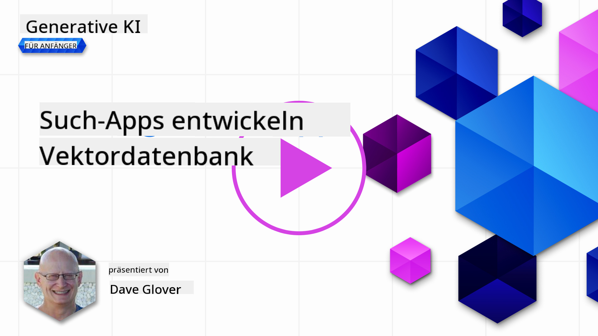
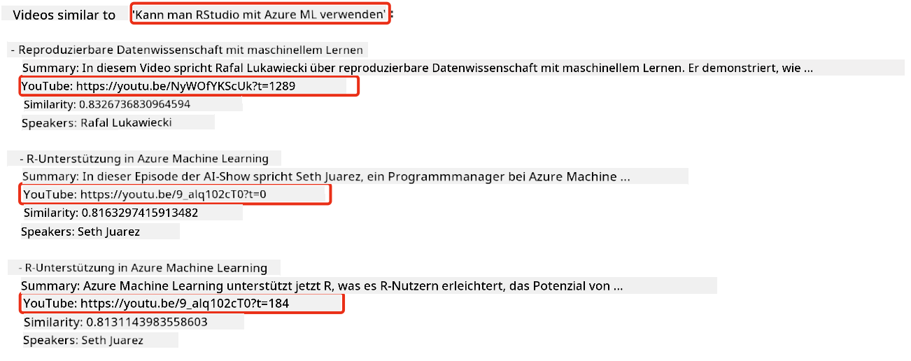
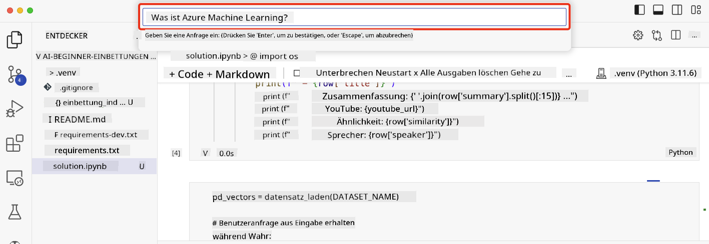

<!--
CO_OP_TRANSLATOR_METADATA:
{
  "original_hash": "d46aad0917a1a342d613e2c13d457da5",
  "translation_date": "2025-06-25T16:11:13+00:00",
  "source_file": "08-building-search-applications/README.md",
  "language_code": "de"
}
-->
# Aufbau von Suchanwendungen

[](https://aka.ms/gen-ai-lesson8-gh?WT.mc_id=academic-105485-koreyst)

> > _Klicken Sie auf das Bild oben, um das Video zu dieser Lektion anzusehen_

LLMs bieten mehr als nur Chatbots und Textgenerierung. Es ist auch möglich, Suchanwendungen mithilfe von Embeddings zu erstellen. Embeddings sind numerische Darstellungen von Daten, auch als Vektoren bekannt, und können für semantische Suchen verwendet werden.

In dieser Lektion werden Sie eine Suchanwendung für unser Bildungs-Startup entwickeln. Unser Startup ist eine gemeinnützige Organisation, die Schülern in Entwicklungsländern kostenlose Bildung bietet. Unser Startup verfügt über eine große Anzahl von YouTube-Videos, die Schüler nutzen können, um mehr über KI zu lernen. Unser Startup möchte eine Suchanwendung erstellen, die es Schülern ermöglicht, ein YouTube-Video durch Eingabe einer Frage zu suchen.

Ein Schüler könnte beispielsweise eingeben: 'Was sind Jupyter Notebooks?' oder 'Was ist Azure ML' und die Suchanwendung wird eine Liste von YouTube-Videos zurückgeben, die relevant für die Frage sind, und noch besser, die Suchanwendung wird einen Link zu der Stelle im Video zurückgeben, an der die Antwort auf die Frage zu finden ist.

## Einführung

In dieser Lektion behandeln wir:

- Semantische vs. Stichwortsuche.
- Was sind Text Embeddings.
- Erstellen eines Text Embeddings Index.
- Durchsuchen eines Text Embeddings Index.

## Lernziele

Nach Abschluss dieser Lektion können Sie:

- Den Unterschied zwischen semantischer und Stichwortsuche erkennen.
- Erklären, was Text Embeddings sind.
- Eine Anwendung mit Embeddings erstellen, um nach Daten zu suchen.

## Warum eine Suchanwendung erstellen?

Das Erstellen einer Suchanwendung wird Ihnen helfen, zu verstehen, wie Sie Embeddings verwenden können, um nach Daten zu suchen. Sie lernen auch, wie man eine Suchanwendung entwickelt, die von Schülern genutzt werden kann, um Informationen schnell zu finden.

Die Lektion enthält einen Embedding Index der YouTube-Transkripte des Microsoft [AI Show](https://www.youtube.com/playlist?list=PLlrxD0HtieHi0mwteKBOfEeOYf0LJU4O1) YouTube-Kanals. Die AI Show ist ein YouTube-Kanal, der Ihnen mehr über KI und maschinelles Lernen beibringt. Der Embedding Index enthält die Embeddings für jedes der YouTube-Transkripte bis Oktober 2023. Sie werden den Embedding Index verwenden, um eine Suchanwendung für unser Startup zu erstellen. Die Suchanwendung gibt einen Link zu der Stelle im Video zurück, an der die Antwort auf die Frage zu finden ist. Dies ist eine großartige Möglichkeit für Schüler, die Informationen, die sie benötigen, schnell zu finden.

Das Folgende ist ein Beispiel für eine semantische Abfrage zur Frage 'Kann man RStudio mit Azure ML verwenden?'. Schauen Sie sich die YouTube-URL an, Sie werden sehen, dass die URL einen Zeitstempel enthält, der Sie zu der Stelle im Video führt, an der die Antwort auf die Frage zu finden ist.



## Was ist semantische Suche?

Jetzt fragen Sie sich vielleicht, was ist semantische Suche? Semantische Suche ist eine Suchtechnik, die die Semantik oder Bedeutung der Wörter in einer Abfrage verwendet, um relevante Ergebnisse zu liefern.

Hier ist ein Beispiel für eine semantische Suche. Angenommen, Sie möchten ein Auto kaufen, könnten Sie nach 'mein Traumauto' suchen, semantische Suche versteht, dass Sie nicht `dreaming` über ein Auto träumen, sondern dass Sie Ihr `ideal` Auto kaufen möchten. Semantische Suche versteht Ihre Absicht und liefert relevante Ergebnisse. Die Alternative ist `keyword search`, die buchstäblich nach Träumen über Autos suchen würde und oft irrelevante Ergebnisse liefert.

## Was sind Text Embeddings?

[Text Embeddings](https://en.wikipedia.org/wiki/Word_embedding?WT.mc_id=academic-105485-koreyst) sind eine Technik zur Textdarstellung, die in der [natürlichen Sprachverarbeitung](https://en.wikipedia.org/wiki/Natural_language_processing?WT.mc_id=academic-105485-koreyst) verwendet wird. Text Embeddings sind semantische numerische Darstellungen von Text. Embeddings werden verwendet, um Daten so darzustellen, dass sie für eine Maschine leicht verständlich sind. Es gibt viele Modelle zum Erstellen von Text Embeddings, in dieser Lektion konzentrieren wir uns darauf, Embeddings mit dem OpenAI Embedding Model zu generieren.

Hier ist ein Beispiel, stellen Sie sich vor, der folgende Text stammt aus einem Transkript einer der Episoden des AI Show YouTube-Kanals:

```text
Today we are going to learn about Azure Machine Learning.
```

Wir würden den Text an die OpenAI Embedding API übergeben und sie würde das folgende Embedding zurückgeben, bestehend aus 1536 Zahlen, auch bekannt als Vektor. Jede Zahl im Vektor repräsentiert einen anderen Aspekt des Textes. Der Kürze halber sind hier die ersten 10 Zahlen im Vektor.

```python
[-0.006655829958617687, 0.0026128944009542465, 0.008792596869170666, -0.02446001023054123, -0.008540431968867779, 0.022071078419685364, -0.010703742504119873, 0.003311325330287218, -0.011632772162556648, -0.02187200076878071, ...]
```

## Wie wird der Embedding-Index erstellt?

Der Embedding-Index für diese Lektion wurde mit einer Reihe von Python-Skripten erstellt. Sie finden die Skripte zusammen mit Anweisungen im [README](./scripts/README.md?WT.mc_id=academic-105485-koreyst) im Ordner 'scripts' für diese Lektion. Sie müssen diese Skripte nicht ausführen, um diese Lektion abzuschließen, da der Embedding-Index für Sie bereitgestellt wird.

Die Skripte führen folgende Operationen aus:

1. Das Transkript für jedes YouTube-Video in der [AI Show](https://www.youtube.com/playlist?list=PLlrxD0HtieHi0mwteKBOfEeOYf0LJU4O1) Playlist wird heruntergeladen.
2. Mit [OpenAI Functions](https://learn.microsoft.com/azure/ai-services/openai/how-to/function-calling?WT.mc_id=academic-105485-koreyst) wird versucht, den Namen des Sprechers aus den ersten 3 Minuten des YouTube-Transkripts zu extrahieren. Der Sprechername für jedes Video wird im Embedding-Index namens `embedding_index_3m.json` gespeichert.
3. Der Transkripttext wird dann in **3-Minuten-Textsegmente** unterteilt. Das Segment enthält etwa 20 Wörter, die sich mit dem nächsten Segment überschneiden, um sicherzustellen, dass das Embedding für das Segment nicht abgeschnitten wird und um einen besseren Suchkontext zu bieten.
4. Jedes Textsegment wird dann an die OpenAI Chat API übergeben, um den Text in 60 Wörter zusammenzufassen. Die Zusammenfassung wird ebenfalls im Embedding-Index `embedding_index_3m.json` gespeichert.
5. Schließlich wird der Segmenttext an die OpenAI Embedding API übergeben. Die Embedding API gibt einen Vektor von 1536 Zahlen zurück, die die semantische Bedeutung des Segments darstellen. Das Segment zusammen mit dem OpenAI Embedding-Vektor wird in einem Embedding-Index `embedding_index_3m.json` gespeichert.

### Vektordatenbanken

Zur Vereinfachung der Lektion wird der Embedding-Index in einer JSON-Datei namens `embedding_index_3m.json` gespeichert und in ein Pandas DataFrame geladen. In der Produktion würde der Embedding-Index jedoch in einer Vektordatenbank wie [Azure Cognitive Search](https://learn.microsoft.com/training/modules/improve-search-results-vector-search?WT.mc_id=academic-105485-koreyst), [Redis](https://cookbook.openai.com/examples/vector_databases/redis/readme?WT.mc_id=academic-105485-koreyst), [Pinecone](https://cookbook.openai.com/examples/vector_databases/pinecone/readme?WT.mc_id=academic-105485-koreyst), [Weaviate](https://cookbook.openai.com/examples/vector_databases/weaviate/readme?WT.mc_id=academic-105485-koreyst), um nur einige zu nennen, gespeichert.

## Verständnis der Kosinusähnlichkeit

Wir haben über Text Embeddings gelernt, der nächste Schritt ist zu lernen, wie man Text Embeddings verwendet, um nach Daten zu suchen und insbesondere die ähnlichsten Embeddings zu einer gegebenen Abfrage mithilfe der Kosinusähnlichkeit zu finden.

### Was ist Kosinusähnlichkeit?

Kosinusähnlichkeit ist ein Maß für die Ähnlichkeit zwischen zwei Vektoren, Sie werden dies auch als `nearest neighbor search` hören. Um eine Kosinusähnlichkeitssuche durchzuführen, müssen Sie den _Vektor_ für _Abfrage_ Text mithilfe der OpenAI Embedding API erstellen. Berechnen Sie dann die _Kosinusähnlichkeit_ zwischen dem Abfragevektor und jedem Vektor im Embedding-Index. Denken Sie daran, der Embedding-Index hat einen Vektor für jedes YouTube-Transkripttextsegment. Sortieren Sie schließlich die Ergebnisse nach Kosinusähnlichkeit und die Textsegmente mit der höchsten Kosinusähnlichkeit sind die ähnlichsten zur Abfrage.

Aus mathematischer Sicht misst die Kosinusähnlichkeit den Kosinus des Winkels zwischen zwei Vektoren, die in einem mehrdimensionalen Raum projiziert werden. Diese Messung ist vorteilhaft, da, wenn zwei Dokumente aufgrund ihrer Größe weit voneinander entfernt sind, sie dennoch einen kleineren Winkel zwischen sich haben und daher eine höhere Kosinusähnlichkeit aufweisen könnten. Weitere Informationen zu Kosinusähnlichkeitsgleichungen finden Sie unter [Kosinusähnlichkeit](https://en.wikipedia.org/wiki/Cosine_similarity?WT.mc_id=academic-105485-koreyst).

## Ihre erste Suchanwendung erstellen

Als Nächstes lernen wir, wie man eine Suchanwendung mit Embeddings erstellt. Die Suchanwendung ermöglicht es Schülern, nach einem Video zu suchen, indem sie eine Frage eingeben. Die Suchanwendung wird eine Liste von Videos zurückgeben, die relevant für die Frage sind. Die Suchanwendung wird auch einen Link zu der Stelle im Video zurückgeben, an der die Antwort auf die Frage zu finden ist.

Diese Lösung wurde auf Windows 11, macOS und Ubuntu 22.04 mit Python 3.10 oder höher entwickelt und getestet. Sie können Python von [python.org](https://www.python.org/downloads/?WT.mc_id=academic-105485-koreyst) herunterladen.

## Aufgabe - eine Suchanwendung erstellen, um Schüler zu befähigen

Wir haben unser Startup zu Beginn dieser Lektion vorgestellt. Jetzt ist es an der Zeit, die Schüler zu befähigen, eine Suchanwendung für ihre Bewertungen zu erstellen.

In dieser Aufgabe werden Sie die Azure OpenAI Services erstellen, die zur Erstellung der Suchanwendung verwendet werden. Sie werden die folgenden Azure OpenAI Services erstellen. Sie benötigen ein Azure-Abonnement, um diese Aufgabe abzuschließen.

### Starten Sie die Azure Cloud Shell

1. Melden Sie sich im [Azure-Portal](https://portal.azure.com/?WT.mc_id=academic-105485-koreyst) an.
2. Wählen Sie das Cloud Shell-Symbol in der oberen rechten Ecke des Azure-Portals.
3. Wählen Sie **Bash** als Umgebungstyp.

#### Erstellen Sie eine Ressourcengruppe

> Für diese Anweisungen verwenden wir die Ressourcengruppe namens "semantic-video-search" in East US.
> Sie können den Namen der Ressourcengruppe ändern, aber beim Ändern des Standorts für die Ressourcen,
> überprüfen Sie die [Modellverfügbarkeitstabelle](https://aka.ms/oai/models?WT.mc_id=academic-105485-koreyst).

```shell
az group create --name semantic-video-search --location eastus
```

#### Erstellen Sie eine Azure OpenAI Service-Ressource

Führen Sie im Azure Cloud Shell den folgenden Befehl aus, um eine Azure OpenAI Service-Ressource zu erstellen.

```shell
az cognitiveservices account create --name semantic-video-openai --resource-group semantic-video-search \
    --location eastus --kind OpenAI --sku s0
```

#### Holen Sie sich den Endpunkt und die Schlüssel für die Nutzung in dieser Anwendung

Führen Sie im Azure Cloud Shell die folgenden Befehle aus, um den Endpunkt und die Schlüssel für die Azure OpenAI Service-Ressource zu erhalten.

```shell
az cognitiveservices account show --name semantic-video-openai \
   --resource-group  semantic-video-search | jq -r .properties.endpoint
az cognitiveservices account keys list --name semantic-video-openai \
   --resource-group semantic-video-search | jq -r .key1
```

#### Das OpenAI Embedding-Modell bereitstellen

Führen Sie im Azure Cloud Shell den folgenden Befehl aus, um das OpenAI Embedding-Modell bereitzustellen.

```shell
az cognitiveservices account deployment create \
    --name semantic-video-openai \
    --resource-group  semantic-video-search \
    --deployment-name text-embedding-ada-002 \
    --model-name text-embedding-ada-002 \
    --model-version "2"  \
    --model-format OpenAI \
    --sku-capacity 100 --sku-name "Standard"
```

## Lösung

Öffnen Sie das [Lösungs-Notebook](../../../08-building-search-applications/python/aoai-solution.ipynb) in GitHub Codespaces und folgen Sie den Anweisungen im Jupyter Notebook.

Wenn Sie das Notebook ausführen, werden Sie aufgefordert, eine Abfrage einzugeben. Das Eingabefeld sieht so aus:



## Großartige Arbeit! Setzen Sie Ihr Lernen fort

Nachdem Sie diese Lektion abgeschlossen haben, schauen Sie sich unsere [Generative KI Lernsammlung](https://aka.ms/genai-collection?WT.mc_id=academic-105485-koreyst) an, um Ihr Wissen über Generative KI weiter zu vertiefen!

Gehen Sie zu Lektion 9, wo wir uns ansehen, wie man [Bildgenerierungsanwendungen erstellt](../09-building-image-applications/README.md?WT.mc_id=academic-105485-koreyst)!

**Haftungsausschluss**:  
Dieses Dokument wurde mit dem KI-Übersetzungsdienst [Co-op Translator](https://github.com/Azure/co-op-translator) übersetzt. Obwohl wir uns um Genauigkeit bemühen, beachten Sie bitte, dass automatisierte Übersetzungen Fehler oder Ungenauigkeiten enthalten können. Das Originaldokument in seiner ursprünglichen Sprache sollte als maßgebliche Quelle betrachtet werden. Für wichtige Informationen wird eine professionelle menschliche Übersetzung empfohlen. Wir haften nicht für Missverständnisse oder Fehlinterpretationen, die sich aus der Nutzung dieser Übersetzung ergeben.