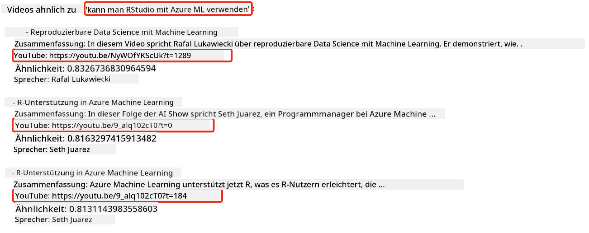

<!--
CO_OP_TRANSLATOR_METADATA:
{
  "original_hash": "d46aad0917a1a342d613e2c13d457da5",
  "translation_date": "2025-07-09T12:46:22+00:00",
  "source_file": "08-building-search-applications/README.md",
  "language_code": "de"
}
-->
# Aufbau einer Suchanwendung

[](https://aka.ms/gen-ai-lesson8-gh?WT.mc_id=academic-105485-koreyst)

> > _Klicken Sie auf das Bild oben, um das Video zu dieser Lektion anzusehen_

LLMs sind mehr als nur Chatbots und Textgenerierung. Es ist auch möglich, Suchanwendungen mit Embeddings zu erstellen. Embeddings sind numerische Darstellungen von Daten, auch Vektoren genannt, und können für semantische Suchen in Daten verwendet werden.

In dieser Lektion bauen Sie eine Suchanwendung für unser Bildungs-Startup. Unser Startup ist eine gemeinnützige Organisation, die Schülern in Entwicklungsländern kostenlose Bildung anbietet. Unser Startup verfügt über eine große Anzahl von YouTube-Videos, die Schüler nutzen können, um mehr über KI zu lernen. Unser Startup möchte eine Suchanwendung entwickeln, mit der Schüler durch Eingabe einer Frage nach einem YouTube-Video suchen können.

Zum Beispiel könnte ein Schüler „Was sind Jupyter Notebooks?“ oder „Was ist Azure ML?“ eingeben, und die Suchanwendung gibt eine Liste von YouTube-Videos zurück, die zur Frage passen. Noch besser: Die Suchanwendung liefert einen Link zu der Stelle im Video, an der die Antwort auf die Frage zu finden ist.

## Einführung

In dieser Lektion behandeln wir:

- Semantische Suche vs. Stichwortsuche.
- Was sind Text-Embeddings.
- Erstellen eines Text-Embeddings-Index.
- Suche in einem Text-Embeddings-Index.

## Lernziele

Nach Abschluss dieser Lektion können Sie:

- Den Unterschied zwischen semantischer Suche und Stichwortsuche erklären.
- Erläutern, was Text-Embeddings sind.
- Eine Anwendung erstellen, die Embeddings verwendet, um Daten zu durchsuchen.

## Warum eine Suchanwendung bauen?

Eine Suchanwendung zu erstellen hilft Ihnen zu verstehen, wie Embeddings zur Datensuche eingesetzt werden. Außerdem lernen Sie, wie man eine Suchanwendung baut, die Schülern hilft, Informationen schnell zu finden.

Die Lektion enthält einen Embedding-Index der YouTube-Transkripte des Microsoft [AI Show](https://www.youtube.com/playlist?list=PLlrxD0HtieHi0mwteKBOfEeOYf0LJU4O1) YouTube-Kanals. Die AI Show ist ein YouTube-Kanal, der Wissen über KI und maschinelles Lernen vermittelt. Der Embedding-Index enthält die Embeddings für alle YouTube-Transkripte bis Oktober 2023. Sie verwenden den Embedding-Index, um eine Suchanwendung für unser Startup zu bauen. Die Suchanwendung liefert einen Link zu der Stelle im Video, an der die Antwort auf die Frage zu finden ist. Das ist eine großartige Möglichkeit für Schüler, schnell die benötigten Informationen zu finden.

Im Folgenden sehen Sie ein Beispiel für eine semantische Abfrage zur Frage „Kann man RStudio mit Azure ML verwenden?“. Schauen Sie sich die YouTube-URL an, dort finden Sie einen Zeitstempel, der Sie direkt zur Stelle im Video führt, an der die Antwort gegeben wird.



## Was ist semantische Suche?

Vielleicht fragen Sie sich jetzt, was semantische Suche ist? Semantische Suche ist eine Suchtechnik, die die Bedeutung der Wörter in einer Anfrage nutzt, um relevante Ergebnisse zu liefern.

Hier ein Beispiel für semantische Suche: Angenommen, Sie möchten ein Auto kaufen und suchen nach „mein Traumauto“. Die semantische Suche versteht, dass Sie nicht von einem Auto träumen, sondern Ihr ideales Auto kaufen möchten. Sie erkennt Ihre Absicht und liefert passende Ergebnisse. Die Alternative ist die Stichwortsuche, die wörtlich nach „Träumen über Autos“ sucht und oft irrelevante Ergebnisse liefert.

## Was sind Text-Embeddings?

[Text-Embeddings](https://en.wikipedia.org/wiki/Word_embedding?WT.mc_id=academic-105485-koreyst) sind eine Technik zur Textdarstellung, die im Bereich der [natürlichen Sprachverarbeitung](https://en.wikipedia.org/wiki/Natural_language_processing?WT.mc_id=academic-105485-koreyst) verwendet wird. Text-Embeddings sind semantische numerische Darstellungen von Text. Embeddings werden genutzt, um Daten so darzustellen, dass Maschinen sie besser verstehen können. Es gibt viele Modelle zur Erstellung von Text-Embeddings; in dieser Lektion konzentrieren wir uns auf die Generierung von Embeddings mit dem OpenAI Embedding Model.

Hier ein Beispiel: Stellen Sie sich vor, der folgende Text stammt aus einem Transkript einer Episode des AI Show YouTube-Kanals:

```text
Today we are going to learn about Azure Machine Learning.
```

Wir übergeben den Text an die OpenAI Embedding API, die dann das folgende Embedding mit 1536 Zahlen (einen Vektor) zurückgibt. Jede Zahl im Vektor repräsentiert einen anderen Aspekt des Textes. Zur Veranschaulichung hier die ersten 10 Zahlen des Vektors.

```python
[-0.006655829958617687, 0.0026128944009542465, 0.008792596869170666, -0.02446001023054123, -0.008540431968867779, 0.022071078419685364, -0.010703742504119873, 0.003311325330287218, -0.011632772162556648, -0.02187200076878071, ...]
```

## Wie wird der Embedding-Index erstellt?

Der Embedding-Index für diese Lektion wurde mit einer Reihe von Python-Skripten erstellt. Die Skripte und Anleitungen finden Sie im [README](./scripts/README.md?WT.mc_id=academic-105485-koreyst) im Ordner `scripts` dieser Lektion. Sie müssen diese Skripte nicht ausführen, um die Lektion abzuschließen, da der Embedding-Index bereitgestellt wird.

Die Skripte führen folgende Schritte aus:

1. Das Transkript jedes YouTube-Videos in der [AI Show](https://www.youtube.com/playlist?list=PLlrxD0HtieHi0mwteKBOfEeOYf0LJU4O1) Playlist wird heruntergeladen.
2. Mit [OpenAI Functions](https://learn.microsoft.com/azure/ai-services/openai/how-to/function-calling?WT.mc_id=academic-105485-koreyst) wird versucht, den Namen des Sprechers aus den ersten 3 Minuten des YouTube-Transkripts zu extrahieren. Der Sprechername jedes Videos wird im Embedding-Index `embedding_index_3m.json` gespeichert.
3. Der Transkripttext wird in **3-minütige Textsegmente** aufgeteilt. Jedes Segment enthält etwa 20 Wörter Überlappung zum nächsten Segment, um sicherzustellen, dass das Embedding nicht abgeschnitten wird und um besseren Suchkontext zu bieten.
4. Jedes Textsegment wird an die OpenAI Chat API übergeben, um den Text auf 60 Wörter zusammenzufassen. Die Zusammenfassung wird ebenfalls im Embedding-Index `embedding_index_3m.json` gespeichert.
5. Schließlich wird der Text des Segments an die OpenAI Embedding API übergeben. Die Embedding API liefert einen Vektor mit 1536 Zahlen, der die semantische Bedeutung des Segments repräsentiert. Das Segment zusammen mit dem OpenAI Embedding-Vektor wird im Embedding-Index `embedding_index_3m.json` gespeichert.

### Vektor-Datenbanken

Zur Vereinfachung der Lektion wird der Embedding-Index in einer JSON-Datei namens `embedding_index_3m.json` gespeichert und in ein Pandas DataFrame geladen. In der Produktion würde der Embedding-Index jedoch in einer Vektor-Datenbank wie [Azure Cognitive Search](https://learn.microsoft.com/training/modules/improve-search-results-vector-search?WT.mc_id=academic-105485-koreyst), [Redis](https://cookbook.openai.com/examples/vector_databases/redis/readme?WT.mc_id=academic-105485-koreyst), [Pinecone](https://cookbook.openai.com/examples/vector_databases/pinecone/readme?WT.mc_id=academic-105485-koreyst), [Weaviate](https://cookbook.openai.com/examples/vector_databases/weaviate/readme?WT.mc_id=academic-105485-koreyst) oder ähnlichen gespeichert.

## Verständnis der Kosinus-Ähnlichkeit

Wir haben Text-Embeddings kennengelernt, der nächste Schritt ist zu lernen, wie man Text-Embeddings verwendet, um Daten zu durchsuchen und insbesondere die ähnlichsten Embeddings zu einer gegebenen Anfrage mit Kosinus-Ähnlichkeit zu finden.

### Was ist Kosinus-Ähnlichkeit?

Kosinus-Ähnlichkeit misst die Ähnlichkeit zwischen zwei Vektoren, man spricht auch von `Nearest Neighbor Search`. Um eine Kosinus-Ähnlichkeitssuche durchzuführen, müssen Sie den Text der Anfrage mit der OpenAI Embedding API _vektorisieren_. Dann berechnen Sie die _Kosinus-Ähnlichkeit_ zwischen dem Anfragevektor und jedem Vektor im Embedding-Index. Denken Sie daran, dass der Embedding-Index für jedes YouTube-Transkript-Textsegment einen Vektor enthält. Abschließend sortieren Sie die Ergebnisse nach Kosinus-Ähnlichkeit, und die Textsegmente mit der höchsten Kosinus-Ähnlichkeit sind am ähnlichsten zur Anfrage.

Mathematisch misst die Kosinus-Ähnlichkeit den Kosinus des Winkels zwischen zwei Vektoren, die in einem mehrdimensionalen Raum projiziert sind. Diese Messung ist nützlich, weil zwei Dokumente, die aufgrund ihrer Größe weit auseinander liegen (gemessen mit euklidischer Distanz), dennoch einen kleineren Winkel zueinander haben können und somit eine höhere Kosinus-Ähnlichkeit aufweisen. Weitere Informationen zu Kosinus-Ähnlichkeitsformeln finden Sie unter [Cosine similarity](https://en.wikipedia.org/wiki/Cosine_similarity?WT.mc_id=academic-105485-koreyst).

## Aufbau Ihrer ersten Suchanwendung

Als nächstes lernen wir, wie man eine Suchanwendung mit Embeddings baut. Die Suchanwendung ermöglicht es Schülern, durch Eingabe einer Frage nach einem Video zu suchen. Die Suchanwendung gibt eine Liste von Videos zurück, die zur Frage passen. Außerdem liefert sie einen Link zu der Stelle im Video, an der die Antwort auf die Frage zu finden ist.

Diese Lösung wurde auf Windows 11, macOS und Ubuntu 22.04 mit Python 3.10 oder höher entwickelt und getestet. Python können Sie von [python.org](https://www.python.org/downloads/?WT.mc_id=academic-105485-koreyst) herunterladen.

## Aufgabe – Suchanwendung bauen, um Schüler zu unterstützen

Wir haben unser Startup zu Beginn der Lektion vorgestellt. Nun ist es an der Zeit, den Schülern zu ermöglichen, eine Suchanwendung für ihre Aufgaben zu erstellen.

In dieser Aufgabe erstellen Sie die Azure OpenAI Services, die für den Bau der Suchanwendung benötigt werden. Sie erstellen die folgenden Azure OpenAI Services. Für diese Aufgabe benötigen Sie ein Azure-Abonnement.

### Starten Sie die Azure Cloud Shell

1. Melden Sie sich im [Azure-Portal](https://portal.azure.com/?WT.mc_id=academic-105485-koreyst) an.
2. Wählen Sie das Cloud Shell-Symbol oben rechts im Azure-Portal aus.
3. Wählen Sie **Bash** als Umgebungstyp.

#### Erstellen einer Ressourcengruppe

> Für diese Anleitung verwenden wir die Ressourcengruppe mit dem Namen „semantic-video-search“ in East US.
> Sie können den Namen der Ressourcengruppe ändern, aber wenn Sie den Standort der Ressourcen ändern,
> prüfen Sie die [Modellverfügbarkeitstabelle](https://aka.ms/oai/models?WT.mc_id=academic-105485-koreyst).

```shell
az group create --name semantic-video-search --location eastus
```

#### Erstellen einer Azure OpenAI Service-Ressource

Führen Sie in der Azure Cloud Shell den folgenden Befehl aus, um eine Azure OpenAI Service-Ressource zu erstellen.

```shell
az cognitiveservices account create --name semantic-video-openai --resource-group semantic-video-search \
    --location eastus --kind OpenAI --sku s0
```

#### Abrufen des Endpunkts und der Schlüssel für die Nutzung in dieser Anwendung

Führen Sie in der Azure Cloud Shell die folgenden Befehle aus, um den Endpunkt und die Schlüssel für die Azure OpenAI Service-Ressource abzurufen.

```shell
az cognitiveservices account show --name semantic-video-openai \
   --resource-group  semantic-video-search | jq -r .properties.endpoint
az cognitiveservices account keys list --name semantic-video-openai \
   --resource-group semantic-video-search | jq -r .key1
```

#### Bereitstellen des OpenAI Embedding-Modells

Führen Sie in der Azure Cloud Shell den folgenden Befehl aus, um das OpenAI Embedding-Modell bereitzustellen.

```shell
az cognitiveservices account deployment create \
    --name semantic-video-openai \
    --resource-group  semantic-video-search \
    --deployment-name text-embedding-ada-002 \
    --model-name text-embedding-ada-002 \
    --model-version "2"  \
    --model-format OpenAI \
    --sku-capacity 100 --sku-name "Standard"
```

## Lösung

Öffnen Sie das [Lösungs-Notebook](../../../08-building-search-applications/python/aoai-solution.ipynb) in GitHub Codespaces und folgen Sie den Anweisungen im Jupyter Notebook.

Wenn Sie das Notebook ausführen, werden Sie aufgefordert, eine Anfrage einzugeben. Das Eingabefeld sieht so aus:


## Gute Arbeit! Lernen Sie weiter

Nach Abschluss dieser Lektion sehen Sie sich unsere [Generative AI Learning Collection](https://aka.ms/genai-collection?WT.mc_id=academic-105485-koreyst) an, um Ihr Wissen über Generative KI weiter zu vertiefen!

Gehen Sie weiter zu Lektion 9, in der wir uns ansehen, wie man [Anwendungen zur Bildgenerierung baut](../09-building-image-applications/README.md?WT.mc_id=academic-105485-koreyst)!

**Haftungsausschluss**:  
Dieses Dokument wurde mit dem KI-Übersetzungsdienst [Co-op Translator](https://github.com/Azure/co-op-translator) übersetzt. Obwohl wir uns um Genauigkeit bemühen, beachten Sie bitte, dass automatisierte Übersetzungen Fehler oder Ungenauigkeiten enthalten können. Das Originaldokument in seiner Ursprungssprache ist als maßgebliche Quelle zu betrachten. Für wichtige Informationen wird eine professionelle menschliche Übersetzung empfohlen. Wir übernehmen keine Haftung für Missverständnisse oder Fehlinterpretationen, die aus der Nutzung dieser Übersetzung entstehen.