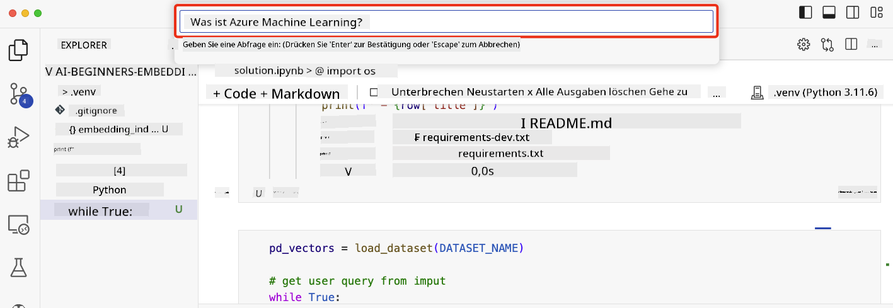

<!--
CO_OP_TRANSLATOR_METADATA:
{
  "original_hash": "58953c08b8ba7073b836d4270ea0fe86",
  "translation_date": "2025-10-17T22:54:02+00:00",
  "source_file": "08-building-search-applications/README.md",
  "language_code": "de"
}
-->
# Aufbau von Suchanwendungen

[](https://youtu.be/W0-nzXjOjr0?si=GcsqiTTvd7RKbo7V)

> > _Klicken Sie auf das Bild oben, um das Video zu dieser Lektion anzusehen_

LLMs können mehr als nur Chatbots und Textgenerierung. Es ist auch möglich, Suchanwendungen mithilfe von Embeddings zu erstellen. Embeddings sind numerische Darstellungen von Daten, auch bekannt als Vektoren, und können für die semantische Suche nach Daten verwendet werden.

In dieser Lektion werden Sie eine Suchanwendung für unser Bildungs-Startup erstellen. Unser Startup ist eine gemeinnützige Organisation, die Schülern in Entwicklungsländern kostenlose Bildung bietet. Unser Startup verfügt über eine große Anzahl von YouTube-Videos, die Schüler nutzen können, um mehr über KI zu lernen. Unser Startup möchte eine Suchanwendung entwickeln, die es Schülern ermöglicht, nach einem YouTube-Video zu suchen, indem sie eine Frage eingeben.

Zum Beispiel könnte ein Schüler eingeben: „Was sind Jupyter Notebooks?“ oder „Was ist Azure ML?“ und die Suchanwendung wird eine Liste von YouTube-Videos zurückgeben, die für die Frage relevant sind. Noch besser: Die Suchanwendung wird einen Link zu der Stelle im Video zurückgeben, an der die Antwort auf die Frage zu finden ist.

## Einführung

In dieser Lektion behandeln wir:

- Semantische vs. Schlüsselwortsuche.
- Was sind Text-Embeddings.
- Erstellen eines Text-Embedding-Index.
- Durchsuchen eines Text-Embedding-Index.

## Lernziele

Nach Abschluss dieser Lektion können Sie:

- Den Unterschied zwischen semantischer und Schlüsselwortsuche erklären.
- Erklären, was Text-Embeddings sind.
- Eine Anwendung erstellen, die Embeddings verwendet, um nach Daten zu suchen.

## Warum eine Suchanwendung erstellen?

Das Erstellen einer Suchanwendung hilft Ihnen zu verstehen, wie Sie Embeddings verwenden können, um nach Daten zu suchen. Sie lernen auch, wie Sie eine Suchanwendung erstellen, die von Schülern genutzt werden kann, um Informationen schnell zu finden.

Die Lektion enthält einen Embedding-Index der YouTube-Transkripte des Microsoft [AI Show](https://www.youtube.com/playlist?list=PLlrxD0HtieHi0mwteKBOfEeOYf0LJU4O1) YouTube-Kanals. Der AI Show ist ein YouTube-Kanal, der Ihnen KI und maschinelles Lernen näherbringt. Der Embedding-Index enthält die Embeddings für jedes der YouTube-Transkripte bis Oktober 2023. Sie werden den Embedding-Index verwenden, um eine Suchanwendung für unser Startup zu erstellen. Die Suchanwendung gibt einen Link zu der Stelle im Video zurück, an der die Antwort auf die Frage zu finden ist. Dies ist eine großartige Möglichkeit für Schüler, die benötigten Informationen schnell zu finden.

Das folgende ist ein Beispiel für eine semantische Abfrage zur Frage „Kann man RStudio mit Azure ML verwenden?“. Schauen Sie sich die YouTube-URL an, Sie werden sehen, dass die URL einen Zeitstempel enthält, der Sie zu der Stelle im Video führt, an der die Antwort auf die Frage zu finden ist.


## Was ist semantische Suche?

Nun fragen Sie sich vielleicht, was semantische Suche ist. Semantische Suche ist eine Suchtechnik, die die Semantik oder Bedeutung der Wörter in einer Abfrage verwendet, um relevante Ergebnisse zurückzugeben.

Hier ist ein Beispiel für eine semantische Suche. Angenommen, Sie möchten ein Auto kaufen, dann könnten Sie nach „mein Traumauto“ suchen. Die semantische Suche versteht, dass Sie nicht von einem Auto träumen, sondern vielmehr Ihr „ideales“ Auto kaufen möchten. Die semantische Suche versteht Ihre Absicht und liefert relevante Ergebnisse. Die Alternative ist die „Schlüsselwortsuche“, die buchstäblich nach Träumen über Autos suchen würde und oft irrelevante Ergebnisse liefert.

## Was sind Text-Embeddings?

[Text-Embeddings](https://en.wikipedia.org/wiki/Word_embedding?WT.mc_id=academic-105485-koreyst) sind eine Technik zur Textdarstellung, die in der [natürlichen Sprachverarbeitung](https://en.wikipedia.org/wiki/Natural_language_processing?WT.mc_id=academic-105485-koreyst) verwendet wird. Text-Embeddings sind semantische numerische Darstellungen von Text. Embeddings werden verwendet, um Daten so darzustellen, dass sie für eine Maschine leicht verständlich sind. Es gibt viele Modelle zur Erstellung von Text-Embeddings. In dieser Lektion konzentrieren wir uns darauf, Embeddings mit dem OpenAI Embedding Model zu generieren.

Hier ist ein Beispiel: Stellen Sie sich vor, der folgende Text stammt aus einem Transkript einer Episode des AI Show YouTube-Kanals:

```text
Today we are going to learn about Azure Machine Learning.
```

Wir würden den Text an die OpenAI Embedding API übergeben, und sie würde das folgende Embedding zurückgeben, bestehend aus 1536 Zahlen, auch bekannt als Vektor. Jede Zahl im Vektor repräsentiert einen anderen Aspekt des Textes. Der Kürze halber sind hier die ersten 10 Zahlen des Vektors.

```python
[-0.006655829958617687, 0.0026128944009542465, 0.008792596869170666, -0.02446001023054123, -0.008540431968867779, 0.022071078419685364, -0.010703742504119873, 0.003311325330287218, -0.011632772162556648, -0.02187200076878071, ...]
```

## Wie wird der Embedding-Index erstellt?

Der Embedding-Index für diese Lektion wurde mit einer Reihe von Python-Skripten erstellt. Sie finden die Skripte zusammen mit Anweisungen im [README](./scripts/README.md?WT.mc_id=academic-105485-koreyst) im Ordner 'scripts' für diese Lektion. Sie müssen diese Skripte nicht ausführen, um diese Lektion abzuschließen, da der Embedding-Index für Sie bereitgestellt wird.

Die Skripte führen die folgenden Operationen aus:

1. Das Transkript für jedes YouTube-Video in der [AI Show](https://www.youtube.com/playlist?list=PLlrxD0HtieHi0mwteKBOfEeOYf0LJU4O1)-Playlist wird heruntergeladen.
2. Mithilfe von [OpenAI-Funktionen](https://learn.microsoft.com/azure/ai-services/openai/how-to/function-calling?WT.mc_id=academic-105485-koreyst) wird versucht, den Namen des Sprechers aus den ersten 3 Minuten des YouTube-Transkripts zu extrahieren. Der Sprechername für jedes Video wird im Embedding-Index namens `embedding_index_3m.json` gespeichert.
3. Der Transkripttext wird dann in **3-Minuten-Textsegmente** unterteilt. Das Segment enthält etwa 20 Wörter, die sich mit dem nächsten Segment überschneiden, um sicherzustellen, dass das Embedding für das Segment nicht abgeschnitten wird und um einen besseren Suchkontext zu bieten.
4. Jedes Textsegment wird dann an die OpenAI Chat API übergeben, um den Text in 60 Wörter zusammenzufassen. Die Zusammenfassung wird ebenfalls im Embedding-Index `embedding_index_3m.json` gespeichert.
5. Schließlich wird der Segmenttext an die OpenAI Embedding API übergeben. Die Embedding API gibt einen Vektor mit 1536 Zahlen zurück, die die semantische Bedeutung des Segments repräsentieren. Das Segment zusammen mit dem OpenAI Embedding-Vektor wird in einem Embedding-Index `embedding_index_3m.json` gespeichert.

### Vektordatenbanken

Der Embedding-Index wird der Einfachheit halber in einer JSON-Datei namens `embedding_index_3m.json` gespeichert und in ein Pandas DataFrame geladen. In der Produktion würde der Embedding-Index jedoch in einer Vektordatenbank wie [Azure Cognitive Search](https://learn.microsoft.com/training/modules/improve-search-results-vector-search?WT.mc_id=academic-105485-koreyst), [Redis](https://cookbook.openai.com/examples/vector_databases/redis/readme?WT.mc_id=academic-105485-koreyst), [Pinecone](https://cookbook.openai.com/examples/vector_databases/pinecone/readme?WT.mc_id=academic-105485-koreyst), [Weaviate](https://cookbook.openai.com/examples/vector_databases/weaviate/readme?WT.mc_id=academic-105485-koreyst) gespeichert werden, um nur einige zu nennen.

## Verständnis von Kosinus-Ähnlichkeit

Wir haben über Text-Embeddings gelernt. Der nächste Schritt ist zu lernen, wie man Text-Embeddings verwendet, um nach Daten zu suchen und insbesondere die ähnlichsten Embeddings zu einer gegebenen Abfrage mithilfe der Kosinus-Ähnlichkeit zu finden.

### Was ist Kosinus-Ähnlichkeit?

Kosinus-Ähnlichkeit ist ein Maß für die Ähnlichkeit zwischen zwei Vektoren. Sie wird auch als `nächster Nachbar-Suche` bezeichnet. Um eine Kosinus-Ähnlichkeitssuche durchzuführen, müssen Sie den _Abfrage_-Text mithilfe der OpenAI Embedding API _vektorisieren_. Berechnen Sie dann die _Kosinus-Ähnlichkeit_ zwischen dem Abfragevektor und jedem Vektor im Embedding-Index. Denken Sie daran, dass der Embedding-Index einen Vektor für jedes YouTube-Transkript-Textsegment enthält. Sortieren Sie schließlich die Ergebnisse nach Kosinus-Ähnlichkeit, und die Textsegmente mit der höchsten Kosinus-Ähnlichkeit sind die ähnlichsten zur Abfrage.

Aus mathematischer Sicht misst die Kosinus-Ähnlichkeit den Kosinus des Winkels zwischen zwei Vektoren, die in einem mehrdimensionalen Raum projiziert werden. Diese Messung ist vorteilhaft, da zwei Dokumente, die aufgrund ihrer Größe weit voneinander entfernt sind, dennoch einen kleineren Winkel zwischen sich haben und daher eine höhere Kosinus-Ähnlichkeit aufweisen können. Weitere Informationen zu Kosinus-Ähnlichkeitsgleichungen finden Sie unter [Cosine similarity](https://en.wikipedia.org/wiki/Cosine_similarity?WT.mc_id=academic-105485-koreyst).

## Ihre erste Suchanwendung erstellen

Als Nächstes lernen wir, wie man eine Suchanwendung mit Embeddings erstellt. Die Suchanwendung ermöglicht es Schülern, ein Video zu suchen, indem sie eine Frage eingeben. Die Suchanwendung gibt eine Liste von Videos zurück, die für die Frage relevant sind. Die Suchanwendung gibt auch einen Link zu der Stelle im Video zurück, an der die Antwort auf die Frage zu finden ist.

Diese Lösung wurde auf Windows 11, macOS und Ubuntu 22.04 mit Python 3.10 oder höher entwickelt und getestet. Sie können Python von [python.org](https://www.python.org/downloads/?WT.mc_id=academic-105485-koreyst) herunterladen.

## Aufgabe - Eine Suchanwendung erstellen, um Schüler zu unterstützen

Wir haben unser Startup zu Beginn dieser Lektion vorgestellt. Jetzt ist es an der Zeit, den Schülern zu ermöglichen, eine Suchanwendung für ihre Aufgaben zu erstellen.

In dieser Aufgabe erstellen Sie die Azure OpenAI-Dienste, die zum Aufbau der Suchanwendung verwendet werden. Sie werden die folgenden Azure OpenAI-Dienste erstellen. Sie benötigen ein Azure-Abonnement, um diese Aufgabe abzuschließen.

### Starten Sie die Azure Cloud Shell

1. Melden Sie sich beim [Azure-Portal](https://portal.azure.com/?WT.mc_id=academic-105485-koreyst) an.
2. Wählen Sie das Cloud Shell-Symbol in der oberen rechten Ecke des Azure-Portals aus.
3. Wählen Sie **Bash** als Umgebungstyp.

#### Erstellen Sie eine Ressourcengruppe

> Für diese Anweisungen verwenden wir die Ressourcengruppe mit dem Namen "semantic-video-search" in East US.
> Sie können den Namen der Ressourcengruppe ändern, aber wenn Sie den Standort für die Ressourcen ändern,
> überprüfen Sie die [Modellverfügbarkeitstabelle](https://aka.ms/oai/models?WT.mc_id=academic-105485-koreyst).

```shell
az group create --name semantic-video-search --location eastus
```

#### Erstellen Sie eine Azure OpenAI Service-Ressource

Führen Sie den folgenden Befehl aus der Azure Cloud Shell aus, um eine Azure OpenAI Service-Ressource zu erstellen.

```shell
az cognitiveservices account create --name semantic-video-openai --resource-group semantic-video-search \
    --location eastus --kind OpenAI --sku s0
```

#### Abrufen des Endpunkts und der Schlüssel für die Verwendung in dieser Anwendung

Führen Sie die folgenden Befehle aus der Azure Cloud Shell aus, um den Endpunkt und die Schlüssel für die Azure OpenAI Service-Ressource abzurufen.

```shell
az cognitiveservices account show --name semantic-video-openai \
   --resource-group  semantic-video-search | jq -r .properties.endpoint
az cognitiveservices account keys list --name semantic-video-openai \
   --resource-group semantic-video-search | jq -r .key1
```

#### Bereitstellen des OpenAI Embedding-Modells

Führen Sie den folgenden Befehl aus der Azure Cloud Shell aus, um das OpenAI Embedding-Modell bereitzustellen.

```shell
az cognitiveservices account deployment create \
    --name semantic-video-openai \
    --resource-group  semantic-video-search \
    --deployment-name text-embedding-ada-002 \
    --model-name text-embedding-ada-002 \
    --model-version "2"  \
    --model-format OpenAI \
    --sku-capacity 100 --sku-name "Standard"
```

## Lösung

Öffnen Sie das [Lösungs-Notebook](./python/aoai-solution.ipynb?WT.mc_id=academic-105485-koreyst) in GitHub Codespaces und folgen Sie den Anweisungen im Jupyter Notebook.

Wenn Sie das Notebook ausführen, werden Sie aufgefordert, eine Abfrage einzugeben. Das Eingabefeld sieht wie folgt aus:



## Großartige Arbeit! Setzen Sie Ihr Lernen fort

Nachdem Sie diese Lektion abgeschlossen haben, schauen Sie sich unsere [Generative AI Learning Collection](https://aka.ms/genai-collection?WT.mc_id=academic-105485-koreyst) an, um Ihr Wissen über Generative KI weiter zu vertiefen!

Gehen Sie zu Lektion 9, in der wir uns ansehen, wie man [Anwendungen zur Bildgenerierung erstellt](../09-building-image-applications/README.md?WT.mc_id=academic-105485-koreyst)!

---

**Haftungsausschluss**:  
Dieses Dokument wurde mit dem KI-Übersetzungsdienst [Co-op Translator](https://github.com/Azure/co-op-translator) übersetzt. Obwohl wir uns um Genauigkeit bemühen, beachten Sie bitte, dass automatisierte Übersetzungen Fehler oder Ungenauigkeiten enthalten können. Das Originaldokument in seiner ursprünglichen Sprache sollte als maßgebliche Quelle betrachtet werden. Für kritische Informationen wird eine professionelle menschliche Übersetzung empfohlen. Wir übernehmen keine Haftung für Missverständnisse oder Fehlinterpretationen, die sich aus der Nutzung dieser Übersetzung ergeben.