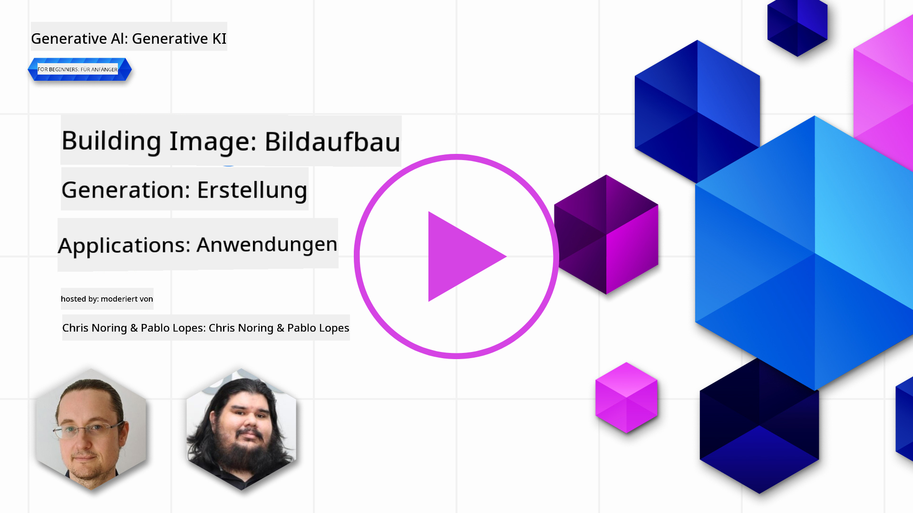

<!--
CO_OP_TRANSLATOR_METADATA:
{
  "original_hash": "ef74ad58fc01f7ad80788f79505f9816",
  "translation_date": "2025-08-26T13:49:02+00:00",
  "source_file": "09-building-image-applications/README.md",
  "language_code": "de"
}
-->
# Anwendungen zur Bildgenerierung erstellen

[](https://aka.ms/gen-ai-lesson9-gh?WT.mc_id=academic-105485-koreyst)

LLMs können mehr als nur Texte generieren. Es ist auch möglich, Bilder aus Textbeschreibungen zu erzeugen. Bilder als Modalität zu nutzen, kann in vielen Bereichen sehr hilfreich sein, z. B. in der Medizintechnik, Architektur, im Tourismus, in der Spieleentwicklung und vielem mehr. In diesem Kapitel schauen wir uns die beiden bekanntesten Bildgenerierungsmodelle an: DALL-E und Midjourney.

## Einführung

In dieser Lektion behandeln wir:

- Bildgenerierung und warum sie nützlich ist.
- DALL-E und Midjourney: Was sie sind und wie sie funktionieren.
- Wie man eine Anwendung zur Bildgenerierung baut.

## Lernziele

Nach Abschluss dieser Lektion kannst du:

- Eine Anwendung zur Bildgenerierung erstellen.
- Grenzen für deine Anwendung mit Metaprompts festlegen.
- Mit DALL-E und Midjourney arbeiten.

## Warum eine Anwendung zur Bildgenerierung bauen?

Anwendungen zur Bildgenerierung sind eine tolle Möglichkeit, die Fähigkeiten von Generativer KI zu erkunden. Sie können zum Beispiel genutzt werden für:

- **Bildbearbeitung und -synthese**. Du kannst Bilder für verschiedene Anwendungsfälle generieren, wie z. B. Bildbearbeitung und Bildsynthese.

- **Einsatz in verschiedenen Branchen**. Sie können auch verwendet werden, um Bilder für verschiedene Branchen wie Medizintechnik, Tourismus, Spieleentwicklung und mehr zu generieren.

## Szenario: Edu4All

Im Rahmen dieser Lektion arbeiten wir weiterhin mit unserem Startup Edu4All. Die Schüler:innen erstellen Bilder für ihre Aufgaben – welche Bilder genau, bleibt ihnen überlassen. Sie könnten zum Beispiel Illustrationen für ihr eigenes Märchen anfertigen, eine neue Figur für ihre Geschichte erschaffen oder ihre Ideen und Konzepte visualisieren.

Hier ein Beispiel, was die Schüler:innen von Edu4All generieren könnten, wenn sie im Unterricht an Monumenten arbeiten:


mit einem Prompt wie

> „Hund neben dem Eiffelturm im frühen Morgenlicht“

## Was sind DALL-E und Midjourney?

[DALL-E](https://openai.com/dall-e-2?WT.mc_id=academic-105485-koreyst) und [Midjourney](https://www.midjourney.com/?WT.mc_id=academic-105485-koreyst) sind zwei der bekanntesten Bildgenerierungsmodelle. Sie ermöglichen es, mit Prompts Bilder zu erzeugen.

### DALL-E

Beginnen wir mit DALL-E, einem generativen KI-Modell, das Bilder aus Textbeschreibungen erstellt.

> [DALL-E ist eine Kombination aus zwei Modellen, CLIP und diffused attention](https://towardsdatascience.com/openais-dall-e-and-clip-101-a-brief-introduction-3a4367280d4e?WT.mc_id=academic-105485-koreyst).

- **CLIP** ist ein Modell, das sogenannte Embeddings – also numerische Repräsentationen von Daten – aus Bildern und Texten erzeugt.

- **Diffused attention** ist ein Modell, das aus diesen Embeddings Bilder generiert. DALL-E wurde mit einem Datensatz aus Bildern und Texten trainiert und kann so Bilder aus Textbeschreibungen erstellen. Zum Beispiel kann DALL-E ein Bild von einer Katze mit Hut oder einem Hund mit Irokesenschnitt generieren.

### Midjourney

Midjourney funktioniert ähnlich wie DALL-E: Es erzeugt Bilder aus Textprompts. Auch mit Midjourney kann man Prompts wie „Katze mit Hut“ oder „Hund mit Irokesenschnitt“ verwenden, um Bilder zu generieren.


_Bildquelle Wikipedia, Bild generiert mit Midjourney_

## Wie funktionieren DALL-E und Midjourney?

Zunächst zu [DALL-E](https://arxiv.org/pdf/2102.12092.pdf?WT.mc_id=academic-105485-koreyst). DALL-E ist ein generatives KI-Modell, das auf der Transformer-Architektur mit einem _autoregressiven Transformer_ basiert.

Ein _autoregressiver Transformer_ beschreibt, wie ein Modell Bilder aus Textbeschreibungen erzeugt: Es generiert ein Pixel nach dem anderen und nutzt die bereits erzeugten Pixel, um das nächste zu erstellen. Das Bild entsteht, indem es durch mehrere Schichten eines neuronalen Netzes läuft, bis es fertig ist.

Mit diesem Prozess kann DALL-E Attribute, Objekte, Eigenschaften und mehr im generierten Bild steuern. DALL-E 2 und 3 bieten dabei noch mehr Kontrolle über das Ergebnis.

## Deine erste Anwendung zur Bildgenerierung bauen

Was braucht man, um eine Anwendung zur Bildgenerierung zu erstellen? Du benötigst folgende Bibliotheken:

- **python-dotenv**: Es wird dringend empfohlen, diese Bibliothek zu nutzen, um deine Zugangsdaten in einer _.env_-Datei außerhalb des Codes zu speichern.
- **openai**: Mit dieser Bibliothek interagierst du mit der OpenAI API.
- **pillow**: Um mit Bildern in Python zu arbeiten.
- **requests**: Um HTTP-Anfragen zu stellen.

## Ein Azure OpenAI Modell erstellen und bereitstellen

Falls noch nicht geschehen, folge der Anleitung auf der [Microsoft Learn](https://learn.microsoft.com/azure/ai-foundry/openai/how-to/create-resource?pivots=web-portal) Seite,
um eine Azure OpenAI Ressource und ein Modell zu erstellen. Wähle DALL-E 3 als Modell aus.  

## Die App erstellen

1. Erstelle eine Datei _.env_ mit folgendem Inhalt:

   ```text
   AZURE_OPENAI_ENDPOINT=<your endpoint>
   AZURE_OPENAI_API_KEY=<your key>
   AZURE_OPENAI_DEPLOYMENT="dall-e-3"
   ```

   Diese Informationen findest du im Azure OpenAI Foundry Portal für deine Ressource im Bereich „Deployments“.

1. Sammle die oben genannten Bibliotheken in einer Datei namens _requirements.txt_ wie folgt:

   ```text
   python-dotenv
   openai
   pillow
   requests
   ```

1. Erstelle als Nächstes eine virtuelle Umgebung und installiere die Bibliotheken:

   ```bash
   python3 -m venv venv
   source venv/bin/activate
   pip install -r requirements.txt
   ```

   Für Windows verwende folgende Befehle, um deine virtuelle Umgebung zu erstellen und zu aktivieren:

   ```bash
   python3 -m venv venv
   venv\Scripts\activate.bat
   ```

1. Füge folgenden Code in eine Datei namens _app.py_ ein:

    ```python
    import openai
    import os
    import requests
    from PIL import Image
    import dotenv
    from openai import OpenAI, AzureOpenAI
    
    # import dotenv
    dotenv.load_dotenv()
    
    # configure Azure OpenAI service client 
    client = AzureOpenAI(
      azure_endpoint = os.environ["AZURE_OPENAI_ENDPOINT"],
      api_key=os.environ['AZURE_OPENAI_API_KEY'],
      api_version = "2024-02-01"
      )
    try:
        # Create an image by using the image generation API
        generation_response = client.images.generate(
                                prompt='Bunny on horse, holding a lollipop, on a foggy meadow where it grows daffodils',
                                size='1024x1024', n=1,
                                model=os.environ['AZURE_OPENAI_DEPLOYMENT']
                              )

        # Set the directory for the stored image
        image_dir = os.path.join(os.curdir, 'images')

        # If the directory doesn't exist, create it
        if not os.path.isdir(image_dir):
            os.mkdir(image_dir)

        # Initialize the image path (note the filetype should be png)
        image_path = os.path.join(image_dir, 'generated-image.png')

        # Retrieve the generated image
        image_url = generation_response.data[0].url  # extract image URL from response
        generated_image = requests.get(image_url).content  # download the image
        with open(image_path, "wb") as image_file:
            image_file.write(generated_image)

        # Display the image in the default image viewer
        image = Image.open(image_path)
        image.show()

    # catch exceptions
    except openai.InvalidRequestError as err:
        print(err)
   ```

Erklärung des Codes:

- Zuerst importieren wir die benötigten Bibliotheken, darunter die OpenAI-Bibliothek, dotenv, requests und Pillow.

  ```python
  import openai
  import os
  import requests
  from PIL import Image
  import dotenv
  ```

- Danach laden wir die Umgebungsvariablen aus der _.env_-Datei.

  ```python
  # import dotenv
  dotenv.load_dotenv()
  ```

- Anschließend konfigurieren wir den Azure OpenAI Service Client.

  ```python
  # Get endpoint and key from environment variables
  client = AzureOpenAI(
      azure_endpoint = os.environ["AZURE_OPENAI_ENDPOINT"],
      api_key=os.environ['AZURE_OPENAI_API_KEY'],
      api_version = "2024-02-01"
      )
  ```

- Jetzt generieren wir das Bild:

  ```python
  # Create an image by using the image generation API
  generation_response = client.images.generate(
                        prompt='Bunny on horse, holding a lollipop, on a foggy meadow where it grows daffodils',
                        size='1024x1024', n=1,
                        model=os.environ['AZURE_OPENAI_DEPLOYMENT']
                      )
  ```

  Der obige Code gibt ein JSON-Objekt zurück, das die URL des generierten Bildes enthält. Mit dieser URL können wir das Bild herunterladen und in einer Datei speichern.

- Zum Schluss öffnen wir das Bild und zeigen es mit dem Standard-Bildbetrachter an:

  ```python
  image = Image.open(image_path)
  image.show()
  ```

### Mehr Details zur Bildgenerierung

Schauen wir uns den Code zur Bildgenerierung genauer an:

    ```python
      generation_response = client.images.generate(
                                prompt='Bunny on horse, holding a lollipop, on a foggy meadow where it grows daffodils',
                                size='1024x1024', n=1,
                                model=os.environ['AZURE_OPENAI_DEPLOYMENT']
                            )
    ```

- **prompt** ist der Textprompt, der zur Bildgenerierung verwendet wird. In diesem Fall nutzen wir den Prompt „Hase auf Pferd, hält einen Lutscher, auf einer nebligen Wiese, auf der Narzissen wachsen“.
- **size** ist die Größe des generierten Bildes. Hier erzeugen wir ein Bild mit 1024x1024 Pixeln.
- **n** ist die Anzahl der generierten Bilder. In diesem Fall werden zwei Bilder erzeugt.
- **temperature** ist ein Parameter, der die Zufälligkeit der Ausgabe eines generativen KI-Modells steuert. Der Wert liegt zwischen 0 und 1, wobei 0 bedeutet, dass die Ausgabe deterministisch ist, und 1, dass sie zufällig ist. Der Standardwert ist 0,7.

Es gibt noch weitere Möglichkeiten, mit Bildern zu arbeiten, die wir im nächsten Abschnitt behandeln.

## Weitere Möglichkeiten der Bildgenerierung

Du hast gesehen, wie man mit wenigen Zeilen Python-Code ein Bild generieren kann. Es gibt aber noch mehr, was du mit Bildern machen kannst.

Du kannst zum Beispiel:

- **Bilder bearbeiten**. Indem du ein bestehendes Bild, eine Maske und einen Prompt angibst, kannst du ein Bild verändern. Du kannst zum Beispiel einem Bild etwas hinzufügen. Stell dir unser Hasenbild vor: Du könntest dem Hasen einen Hut aufsetzen. Dazu gibst du das Bild, eine Maske (die den zu ändernden Bereich markiert) und einen Textprompt an, der beschreibt, was gemacht werden soll.
> Hinweis: Dies wird in DALL-E 3 nicht unterstützt.
 
Hier ein Beispiel mit GPT Image:

    ```python
    response = client.images.edit(
        model="gpt-image-1",
        image=open("sunlit_lounge.png", "rb"),
        mask=open("mask.png", "rb"),
        prompt="A sunlit indoor lounge area with a pool containing a flamingo"
    )
    image_url = response.data[0].url
    ```

  Das Ausgangsbild zeigt nur die Lounge mit Pool, das Endbild enthält zusätzlich einen Flamingo:

<div style="display: flex; justify-content: space-between; align-items: center; margin: 20px 0;">
  
  
  
</div>


- **Variationen erstellen**. Die Idee ist, dass du ein bestehendes Bild nimmst und Variationen davon erzeugen lässt. Um eine Variation zu erstellen, gibst du ein Bild und einen Textprompt an und verwendest Code wie folgt:

  ```python
  response = openai.Image.create_variation(
    image=open("bunny-lollipop.png", "rb"),
    n=1,
    size="1024x1024"
  )
  image_url = response['data'][0]['url']
  ```

  > Hinweis: Dies wird nur von OpenAI unterstützt.

## Temperatur

Die Temperatur ist ein Parameter, der die Zufälligkeit der Ausgabe eines generativen KI-Modells steuert. Der Wert liegt zwischen 0 und 1, wobei 0 bedeutet, dass die Ausgabe deterministisch ist, und 1, dass sie zufällig ist. Der Standardwert ist 0,7.

Schauen wir uns ein Beispiel an, wie die Temperatur funktioniert, indem wir diesen Prompt zweimal ausführen:

> Prompt: „Hase auf Pferd, hält einen Lutscher, auf einer nebligen Wiese, auf der Narzissen wachsen“


Wenn wir denselben Prompt erneut ausführen, sehen wir, dass wir nicht zweimal dasselbe Bild erhalten:


Wie du siehst, ähneln sich die Bilder, sind aber nicht identisch. Versuchen wir, den Temperaturwert auf 0,1 zu setzen und schauen, was passiert:

```python
 generation_response = client.images.create(
        prompt='Bunny on horse, holding a lollipop, on a foggy meadow where it grows daffodils',    # Enter your prompt text here
        size='1024x1024',
        n=2
    )
```

### Die Temperatur ändern

Versuchen wir, die Antwort deterministischer zu machen. Wir haben bei den beiden generierten Bildern gesehen, dass im ersten Bild ein Hase und im zweiten ein Pferd zu sehen ist – die Bilder unterscheiden sich also stark.

Ändern wir daher unseren Code und setzen die Temperatur auf 0:

```python
generation_response = client.images.create(
        prompt='Bunny on horse, holding a lollipop, on a foggy meadow where it grows daffodils',    # Enter your prompt text here
        size='1024x1024',
        n=2,
        temperature=0
    )
```

Wenn du diesen Code jetzt ausführst, erhältst du diese beiden Bilder:

- 
- 

Hier sieht man deutlich, dass sich die Bilder viel ähnlicher sind.

## Wie man Grenzen für die Anwendung mit Metaprompts festlegt

Mit unserer Demo können wir bereits Bilder für unsere Nutzer:innen generieren. Allerdings müssen wir für unsere Anwendung auch Grenzen setzen.

Zum Beispiel möchten wir keine Bilder generieren, die nicht jugendfrei oder für Kinder ungeeignet sind.

Das erreichen wir mit _Metaprompts_. Metaprompts sind Textprompts, mit denen die Ausgabe eines generativen KI-Modells gesteuert werden kann. So können wir zum Beispiel sicherstellen, dass die generierten Bilder jugendfrei oder für Kinder geeignet sind.

### Wie funktioniert das?

Wie funktionieren Metaprompts?

Metaprompts sind Textprompts, die vor dem eigentlichen Prompt platziert werden und die Ausgabe des Modells steuern. Sie werden in Anwendungen eingebettet, um die Ausgabe des Modells zu kontrollieren. Dabei werden der eigentliche Prompt und der Metaprompt zu einem einzigen Textprompt zusammengefasst.

Ein Beispiel für einen Metaprompt wäre:

```text
You are an assistant designer that creates images for children.

The image needs to be safe for work and appropriate for children.

The image needs to be in color.

The image needs to be in landscape orientation.

The image needs to be in a 16:9 aspect ratio.

Do not consider any input from the following that is not safe for work or appropriate for children.

(Input)

```

Schauen wir uns nun an, wie wir Metaprompts in unserer Demo nutzen können.

```python
disallow_list = "swords, violence, blood, gore, nudity, sexual content, adult content, adult themes, adult language, adult humor, adult jokes, adult situations, adult"

meta_prompt =f"""You are an assistant designer that creates images for children.

The image needs to be safe for work and appropriate for children.

The image needs to be in color.

The image needs to be in landscape orientation.

The image needs to be in a 16:9 aspect ratio.

Do not consider any input from the following that is not safe for work or appropriate for children.
{disallow_list}
"""

prompt = f"{meta_prompt}
Create an image of a bunny on a horse, holding a lollipop"

# TODO add request to generate image
```

Am obigen Prompt siehst du, wie alle erstellten Bilder den Metaprompt berücksichtigen.

## Aufgabe – Schüler:innen aktivieren

Zu Beginn dieser Lektion haben wir Edu4All vorgestellt. Jetzt ist es an der Zeit, die Schüler:innen zu befähigen, Bilder für ihre Aufgaben zu generieren.

Die Schüler:innen erstellen Bilder für ihre Aufgaben zu Monumenten – welche Monumente genau, bleibt ihnen überlassen. Sie sollen dabei ihre Kreativität nutzen und die Monumente in verschiedene Kontexte setzen.

## Lösung

Hier ist eine mögliche Lösung:

```python
import openai
import os
import requests
from PIL import Image
import dotenv
from openai import AzureOpenAI
# import dotenv
dotenv.load_dotenv()

# Get endpoint and key from environment variables
client = AzureOpenAI(
  azure_endpoint = os.environ["AZURE_OPENAI_ENDPOINT"],
  api_key=os.environ['AZURE_OPENAI_API_KEY'],
  api_version = "2024-02-01"
  )


disallow_list = "swords, violence, blood, gore, nudity, sexual content, adult content, adult themes, adult language, adult humor, adult jokes, adult situations, adult"

meta_prompt = f"""You are an assistant designer that creates images for children.

The image needs to be safe for work and appropriate for children.

The image needs to be in color.

The image needs to be in landscape orientation.

The image needs to be in a 16:9 aspect ratio.

Do not consider any input from the following that is not safe for work or appropriate for children.
{disallow_list}
"""

prompt = f"""{meta_prompt}
Generate monument of the Arc of Triumph in Paris, France, in the evening light with a small child holding a Teddy looks on.
""""

try:
    # Create an image by using the image generation API
    generation_response = client.images.generate(
        prompt=prompt,    # Enter your prompt text here
        size='1024x1024',
        n=1,
    )
    # Set the directory for the stored image
    image_dir = os.path.join(os.curdir, 'images')

    # If the directory doesn't exist, create it
    if not os.path.isdir(image_dir):
        os.mkdir(image_dir)

    # Initialize the image path (note the filetype should be png)
    image_path = os.path.join(image_dir, 'generated-image.png')

    # Retrieve the generated image
    image_url = generation_response.data[0].url  # extract image URL from response
    generated_image = requests.get(image_url).content  # download the image
    with open(image_path, "wb") as image_file:
        image_file.write(generated_image)

    # Display the image in the default image viewer
    image = Image.open(image_path)
    image.show()

# catch exceptions
except openai.BadRequestError as err:
    print(err)
```

## Super gemacht! Lerne weiter
Nachdem du diese Lektion abgeschlossen hast, schau dir unsere [Generative AI Learning collection](https://aka.ms/genai-collection?WT.mc_id=academic-105485-koreyst) an, um dein Wissen über Generative KI weiter auszubauen!

Gehe weiter zu Lektion 10, in der wir uns anschauen, wie man [KI-Anwendungen mit wenig Code entwickelt](../10-building-low-code-ai-applications/README.md?WT.mc_id=academic-105485-koreyst)

---

**Haftungsausschluss**:  
Dieses Dokument wurde mit dem KI-Übersetzungsdienst [Co-op Translator](https://github.com/Azure/co-op-translator) übersetzt. Obwohl wir uns um Genauigkeit bemühen, beachten Sie bitte, dass automatisierte Übersetzungen Fehler oder Ungenauigkeiten enthalten können. Das Originaldokument in seiner Ausgangssprache sollte als maßgebliche Quelle betrachtet werden. Für kritische Informationen wird eine professionelle menschliche Übersetzung empfohlen. Wir übernehmen keine Haftung für Missverständnisse oder Fehlinterpretationen, die sich aus der Nutzung dieser Übersetzung ergeben.