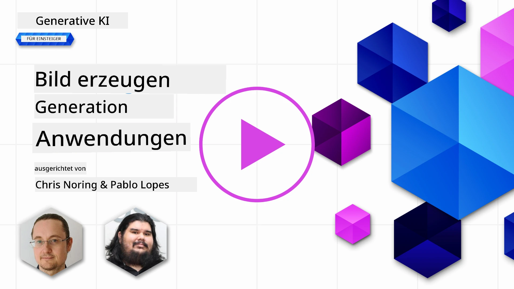

# Erstellung von Bildgenerierungsanwendungen

[](https://aka.ms/gen-ai-lesson9-gh?WT.mc_id=academic-105485-koreyst)

LLMs können mehr als nur Text generieren. Sie können auch Bilder aus Textbeschreibungen erzeugen. Bilder als Modalität sind in der Medizintechnik, Architektur, im Tourismus, in der Spieleentwicklung, im Marketing und mehr nützlich. In dieser Lektion betrachten wir die heutigen **GPT Image**-Modelle und bauen eine Bildgenerierungs-App.

## Einführung

Die Bildgenerierung ermöglicht es Ihnen, einen natürlichsprachlichen Prompt in ein Bild umzuwandeln. In dieser Lektion arbeiten wir mit der **`gpt-image`** Modellfamilie von OpenAI – der aktuellen Generation von Bildmodellen, die auf **[Microsoft Foundry](https://ai.azure.com?WT.mc_id=academic-105485-koreyst)** und der OpenAI-Plattform verfügbar sind. Diese Modelle ersetzen die älteren DALL·E-Modelle (DALL·E 2/3 sind veraltet).

Im gesamten Verlauf der Lektion verwenden wir ein fiktives Startup namens **Edu4All**, das Lernwerkzeuge entwickelt. Das Team möchte Illustrationen für Aufgaben und Lernmaterialien generieren.

## Lernziele

Am Ende dieser Lektion sind Sie in der Lage:

- zu erklären, was Bildgenerierung ist und wo sie nützlich ist.
- die `gpt-image` Modellfamilie zu verstehen und wie sie sich von den veralteten DALL·E-Modellen unterscheidet.
- eine Bildgenerierungs-App in Python (und TypeScript / .NET) zu erstellen.
- Bilder zu bearbeiten und Sicherheitsleitplanken mit Metaprompts anzuwenden.

## Was ist Bildgenerierung?

Bildgenerierungsmodelle erschaffen Bilder aus einem Textprompt. Moderne Modelle wie `gpt-image` basieren auf Transformer- und Diffusionstechniken: Das Modell lernt während des Trainings die Beziehung zwischen Text und Bildern, dann "entstört" es iterativ zufälliges Rauschen zu einem Bild, das der Beschreibung entspricht.

Zwei bekannte Modellfamilien für Bilder sind:

- **`gpt-image` (OpenAI)** - die aktuelle Generation, die in dieser Lektion verwendet wird. Sie unterstützt die Texter-zu-Bild-Generierung und Bildbearbeitung (Inpainting mit Maske).
- **Midjourney** - ein beliebtes Drittanbietermodell mit eigenem Dienst und Discord-basiertem Workflow.

> Ältere OpenAI Bildmodelle - **DALL·E 2** und **DALL·E 3** - sind veraltet. DALL·E 3 ist für neue Bereitstellungen nicht mehr verfügbar, und Funktionen wie `create_variation` gab es nur in DALL·E 2. Verwenden Sie für neue Anwendungen die `gpt-image`-Modelle.

### Welches `gpt-image` Modell sollte ich verwenden?

Auf Microsoft Foundry sind folgende Modelle **Allgemein Verfügbar**:

| Modell | Anmerkungen |
| --- | --- |
| **`gpt-image-2`** | Das neueste und leistungsfähigste Bildmodell – empfohlene Standardwahl. |
| `gpt-image-1.5` | Allgemein verfügbar; gute Qualität zu niedrigeren Kosten. |
| `gpt-image-1-mini` | Allgemein verfügbar; am schnellsten / kostengünstigsten. |
| `gpt-image-1` | Nur Vorschau. |

Prüfen Sie immer die aktuelle [Foundry Bildmodellliste](https://learn.microsoft.com/azure/ai-foundry/openai/concepts/models?WT.mc_id=academic-105485-koreyst) auf Verfügbarkeit und Regionen.

> **Wichtig:** `gpt-image`-Modelle geben das generierte Bild als **base64** (`b64_json`) zurück, nicht als URL. Ihr Code dekodiert die base64-Zeichenfolge in Bytes und speichert sie – es gibt keine Bild-URL zum Herunterladen.

## Einrichtung

Sie können die Beispiele mit **Azure OpenAI in Microsoft Foundry** (die `aoai-*` Beispiele) oder der **OpenAI-Plattform** (die `oai-*` Beispiele) ausführen.

### 1. Erstellen und bereitstellen eines Modells

Folgen Sie der Anleitung zum [Erstellen einer Ressource](https://learn.microsoft.com/azure/ai-foundry/openai/how-to/create-resource?pivots=web-portal&WT.mc_id=academic-105485-koreyst), um eine Microsoft Foundry-Ressource zu erstellen, und stellen Sie dann ein Bildmodell bereit – **`gpt-image-2`** wird empfohlen.

### 2. Konfigurieren Sie Ihre `.env`

```text
AZURE_OPENAI_ENDPOINT=<your endpoint>
AZURE_OPENAI_API_KEY=<your key>
AZURE_OPENAI_DEPLOYMENT="gpt-image-2"
```

Finden Sie diese Werte auf der **Bereitstellungs**-Seite Ihrer Ressource im [Foundry-Portal](https://ai.azure.com?WT.mc_id=academic-105485-koreyst).

### 3. Installieren Sie die Bibliotheken

Erstellen Sie eine `requirements.txt`:

```text
python-dotenv
openai
pillow
```

Erstellen und aktivieren Sie dann eine virtuelle Umgebung und installieren Sie:

```bash
python3 -m venv venv
source venv/bin/activate        # Windows: venv\Scripts\activate
pip install -r requirements.txt
```

## Erstellen der App

Erstellen Sie `app.py` mit folgendem Code. Er generiert ein Bild und speichert es als PNG.

```python
import os
import base64
from openai import AzureOpenAI
from PIL import Image
import dotenv

dotenv.load_dotenv()

# Richten Sie den Client auf Ihre Azure OpenAI (Microsoft Foundry) Ressource aus.
# Bildmodelle benötigen eine aktuelle API-Version – prüfen Sie die Foundry-Dokumentation, welche Ihr Modell benötigt.
client = AzureOpenAI(
    api_key=os.environ["AZURE_OPENAI_API_KEY"],
    api_version="2025-04-01-preview",
    azure_endpoint=os.environ["AZURE_OPENAI_ENDPOINT"],
)

deployment = os.environ["AZURE_OPENAI_DEPLOYMENT"]  # z.B. "gpt-image-2"

result = client.images.generate(
    model=deployment,
    prompt='Bunny on a horse, holding a lollipop, on a foggy meadow where it grows daffodils',
    size="1024x1024",   # ebenfalls 1536x1024 (Querformat), 1024x1536 (Hochformat) oder "auto"
    n=1,
)

# gpt-image Modelle liefern base64 (b64_json), keine URL – dekodieren Sie es in Bytes.
image_bytes = base64.b64decode(result.data[0].b64_json)

os.makedirs("images", exist_ok=True)
image_path = os.path.join("images", "generated-image.png")
with open(image_path, "wb") as f:
    f.write(image_bytes)

Image.open(image_path).show()
```

Führen Sie es mit `python app.py` aus. Ein PNG wird unter `images/` gespeichert.

> Jeder Aufruf von `images.generate` erzeugt ein anderes Bild für denselben Prompt – Bildmodelle verwenden keinen `temperature`-Parameter (das ist eine Steuerung für die Textgenerierung). Um Vielfalt zu erhalten, rufen Sie einfach die API erneut auf; um die Vielfalt zu verringern, machen Sie Ihren Prompt spezifischer.

## Bilder bearbeiten

`gpt-image`-Modelle können ein vorhandenes Bild **bearbeiten**: Geben Sie das Bild, eine optionale **Maske** (die den zu ändernden Bereich markiert) sowie einen Prompt zur Beschreibung der Änderung an. Wie bei der Generierung werden die Bearbeitungen als base64 zurückgegeben.

```python
result = client.images.edit(
    model=deployment,
    image=open("sunlit_lounge.png", "rb"),
    mask=open("mask.png", "rb"),
    prompt="A sunlit indoor lounge area with a pool containing a flamingo",
)
image_bytes = base64.b64decode(result.data[0].b64_json)
with open("images/edited-image.png", "wb") as f:
    f.write(image_bytes)
```

<div style="display: flex; justify-content: space-between; align-items: center; margin: 20px 0;">
  
  
  
</div>

## Grenzen setzen mit Metaprompts

Sobald Sie Bilder generieren können, benötigen Sie Schutzmechanismen, damit Ihre App keine unsicheren oder nicht markenkonformen Inhalte produziert. Ein **Metaprompt** ist ein Text, den Sie dem Prompt des Benutzers voranstellen, um die Ausgabe des Modells einzuschränken.

```python
disallow_list = "swords, violence, blood, gore, nudity, sexual content, adult content, adult themes, adult language"

meta_prompt = f"""You are an assistant designer that creates images for children.

The image needs to be safe for work and appropriate for children.
The image needs to be in color, in landscape orientation, and in a 16:9 aspect ratio.

Do not consider any input that is not safe for work or appropriate for children, including:
{disallow_list}
"""

prompt = f"{meta_prompt}\nCreate an image of a bunny on a horse, holding a lollipop"
# Übergib `prompt` an client.images.generate(...)
```

Jedes Bild wird nun innerhalb der durch den Metaprompt gesetzten Grenzen generiert. Kombinieren Sie dies mit den integrierten Inhaltsfiltern in Microsoft Foundry für eine mehrstufige Verteidigung.

## Aufgabe – Helfen wir den Schülern

Die Schüler von Edu4All benötigen Bilder für ihre Aufgaben. Erstellen Sie eine App, die Bilder von **Denkmalen** generiert (welche Denkmäler, das entscheiden Sie) und diese in verschiedenen, kreativen Kontexten platziert – etwa ein berühmtes Wahrzeichen bei Sonnenuntergang mit einem Kind, das es betrachtet.

Probieren Sie es selbst aus und vergleichen Sie dann mit den Referenzlösungen:

- Python (Azure): [aoai-solution.py](../../../09-building-image-applications/python/aoai-solution.py)
- Python (Azure) vollständige Generierungs-App: [aoai-app.py](../../../09-building-image-applications/python/aoai-app.py)
- Python (OpenAI): [oai-app.py](../../../09-building-image-applications/python/oai-app.py)
- TypeScript (Azure): [typescript/image-generation-app](../../../09-building-image-applications/typescript/image-generation-app)
- .NET (Azure): [dotnet/notebook-azure-openai.dib](../../../09-building-image-applications/dotnet/notebook-azure-openai.dib)

Arbeiten Sie auch die Notebooks in [python/](../../../09-building-image-applications/python) durch (`aoai-assignment.ipynb` für Azure, `oai-assignment.ipynb` für OpenAI).

## Gute Arbeit! Setzen Sie Ihr Lernen fort

Nach Abschluss dieser Lektion sehen Sie sich unsere [Generative AI Learning collection](https://aka.ms/genai-collection?WT.mc_id=academic-105485-koreyst) an, um Ihr Wissen im Bereich generative KI weiter zu vertiefen!

Gehen Sie zu Lektion 10, um weiterzulernen.

---

<!-- CO-OP TRANSLATOR DISCLAIMER START -->
**Haftungsausschluss**:
Dieses Dokument wurde mit dem KI-Übersetzungsdienst [Co-op Translator](https://github.com/Azure/co-op-translator) übersetzt. Obwohl wir uns um Genauigkeit bemühen, beachten Sie bitte, dass automatisierte Übersetzungen Fehler oder Ungenauigkeiten enthalten können. Das Originaldokument in seiner Ursprungssprache gilt als maßgebliche Quelle. Bei kritischen Informationen wird eine professionelle menschliche Übersetzung empfohlen. Wir übernehmen keine Haftung für Missverständnisse oder Fehlinterpretationen, die aus der Verwendung dieser Übersetzung entstehen.
<!-- CO-OP TRANSLATOR DISCLAIMER END -->