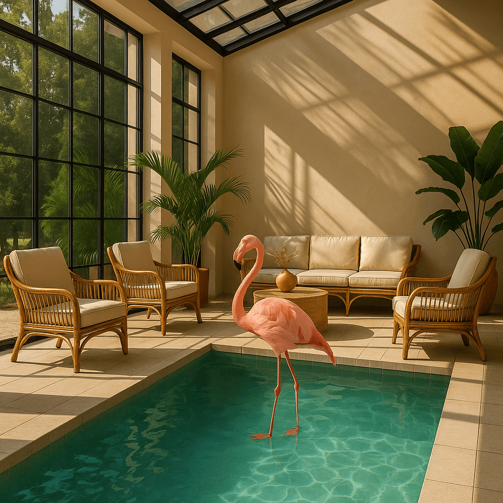

<!--
CO_OP_TRANSLATOR_METADATA:
{
  "original_hash": "063a2ac57d6b71bea0eaa880c68770d2",
  "translation_date": "2025-09-29T21:26:57+00:00",
  "source_file": "09-building-image-applications/README.md",
  "language_code": "de"
}
-->
# Erstellung von Anwendungen zur Bildgenerierung

[](https://aka.ms/gen-ai-lesson9-gh?WT.mc_id=academic-105485-koreyst)

LLMs können mehr als nur Text generieren. Es ist auch möglich, Bilder aus Textbeschreibungen zu erstellen. Bilder als Modalität können in vielen Bereichen äußerst nützlich sein, wie MedTech, Architektur, Tourismus, Spieleentwicklung und mehr. In diesem Kapitel werfen wir einen Blick auf die beiden beliebtesten Modelle zur Bildgenerierung: DALL-E und Midjourney.

## Einführung

In dieser Lektion behandeln wir:

- Bildgenerierung und warum sie nützlich ist.
- DALL-E und Midjourney: Was sie sind und wie sie funktionieren.
- Wie man eine Anwendung zur Bildgenerierung erstellt.

## Lernziele

Nach Abschluss dieser Lektion können Sie:

- Eine Anwendung zur Bildgenerierung erstellen.
- Grenzen für Ihre Anwendung mit Metaprompts definieren.
- Mit DALL-E und Midjourney arbeiten.

## Warum eine Anwendung zur Bildgenerierung erstellen?

Anwendungen zur Bildgenerierung sind eine großartige Möglichkeit, die Fähigkeiten von Generativer KI zu erkunden. Sie können beispielsweise für Folgendes verwendet werden:

- **Bildbearbeitung und Synthese**. Sie können Bilder für eine Vielzahl von Anwendungsfällen generieren, wie Bildbearbeitung und Bildsynthese.

- **Anwendbar in verschiedenen Branchen**. Sie können auch Bilder für verschiedene Branchen wie MedTech, Tourismus, Spieleentwicklung und mehr generieren.

## Szenario: Edu4All

Im Rahmen dieser Lektion arbeiten wir weiterhin mit unserem Startup Edu4All. Die Schüler werden Bilder für ihre Aufgaben erstellen. Welche Bilder sie erstellen, bleibt ihnen überlassen, aber sie könnten beispielsweise Illustrationen für ihr eigenes Märchen erstellen, einen neuen Charakter für ihre Geschichte entwerfen oder ihnen helfen, ihre Ideen und Konzepte zu visualisieren.

Hier ist ein Beispiel dafür, was die Schüler von Edu4All generieren könnten, wenn sie im Unterricht an Denkmälern arbeiten:


mit einem Prompt wie:

> "Hund neben dem Eiffelturm im frühen Morgenlicht"

## Was sind DALL-E und Midjourney?

[DALL-E](https://openai.com/dall-e-2?WT.mc_id=academic-105485-koreyst) und [Midjourney](https://www.midjourney.com/?WT.mc_id=academic-105485-koreyst) sind zwei der beliebtesten Modelle zur Bildgenerierung. Sie ermöglichen es, Bilder mithilfe von Prompts zu erstellen.

### DALL-E

Beginnen wir mit DALL-E, einem Generativen KI-Modell, das Bilder aus Textbeschreibungen generiert.

> [DALL-E ist eine Kombination aus zwei Modellen, CLIP und diffused attention](https://towardsdatascience.com/openais-dall-e-and-clip-101-a-brief-introduction-3a4367280d4e?WT.mc_id=academic-105485-koreyst).

- **CLIP** ist ein Modell, das Einbettungen erzeugt, numerische Darstellungen von Daten, aus Bildern und Text.

- **Diffused attention** ist ein Modell, das Bilder aus Einbettungen generiert. DALL-E wird mit einem Datensatz aus Bildern und Text trainiert und kann verwendet werden, um Bilder aus Textbeschreibungen zu erstellen. Beispielsweise kann DALL-E Bilder von einer Katze mit Hut oder einem Hund mit Irokesen generieren.

### Midjourney

Midjourney funktioniert ähnlich wie DALL-E und generiert Bilder aus Text-Prompts. Midjourney kann ebenfalls verwendet werden, um Bilder mit Prompts wie „eine Katze mit Hut“ oder „ein Hund mit Irokesen“ zu erstellen.


_Bildquelle Wikipedia, Bild generiert von Midjourney_

## Wie funktionieren DALL-E und Midjourney?

Zunächst [DALL-E](https://arxiv.org/pdf/2102.12092.pdf?WT.mc_id=academic-105485-koreyst). DALL-E ist ein Generatives KI-Modell, das auf der Transformer-Architektur basiert und einen _autoregressiven Transformer_ verwendet.

Ein _autoregressiver Transformer_ definiert, wie ein Modell Bilder aus Textbeschreibungen generiert. Es erstellt ein Pixel nach dem anderen und verwendet die generierten Pixel, um das nächste Pixel zu erzeugen. Dabei durchläuft es mehrere Schichten in einem neuronalen Netzwerk, bis das Bild vollständig ist.

Mit diesem Prozess kontrolliert DALL-E Attribute, Objekte, Eigenschaften und mehr im generierten Bild. DALL-E 2 und 3 bieten jedoch mehr Kontrolle über das generierte Bild.

## Erstellung Ihrer ersten Anwendung zur Bildgenerierung

Was benötigen Sie, um eine Anwendung zur Bildgenerierung zu erstellen? Sie brauchen die folgenden Bibliotheken:

- **python-dotenv**, diese Bibliothek wird dringend empfohlen, um Ihre Geheimnisse in einer _.env_-Datei vom Code fernzuhalten.
- **openai**, diese Bibliothek wird verwendet, um mit der OpenAI-API zu interagieren.
- **pillow**, um mit Bildern in Python zu arbeiten.
- **requests**, um HTTP-Anfragen zu stellen.

## Erstellen und Bereitstellen eines Azure OpenAI-Modells

Falls noch nicht geschehen, folgen Sie den Anweisungen auf der [Microsoft Learn](https://learn.microsoft.com/azure/ai-foundry/openai/how-to/create-resource?pivots=web-portal)-Seite, um eine Azure OpenAI-Ressource und ein Modell zu erstellen. Wählen Sie DALL-E 3 als Modell aus.  

## Erstellen der App

1. Erstellen Sie eine Datei _.env_ mit folgendem Inhalt:

   ```text
   AZURE_OPENAI_ENDPOINT=<your endpoint>
   AZURE_OPENAI_API_KEY=<your key>
   AZURE_OPENAI_DEPLOYMENT="dall-e-3"
   ```

   Diese Informationen finden Sie im Azure OpenAI Foundry Portal für Ihre Ressource im Abschnitt "Deployments".

1. Sammeln Sie die oben genannten Bibliotheken in einer Datei namens _requirements.txt_ wie folgt:

   ```text
   python-dotenv
   openai
   pillow
   requests
   ```

1. Erstellen Sie anschließend eine virtuelle Umgebung und installieren Sie die Bibliotheken:

   ```bash
   python3 -m venv venv
   source venv/bin/activate
   pip install -r requirements.txt
   ```

   Für Windows verwenden Sie die folgenden Befehle, um Ihre virtuelle Umgebung zu erstellen und zu aktivieren:

   ```bash
   python3 -m venv venv
   venv\Scripts\activate.bat
   ```

1. Fügen Sie den folgenden Code in eine Datei namens _app.py_ ein:

    ```python
    import openai
    import os
    import requests
    from PIL import Image
    import dotenv
    from openai import OpenAI, AzureOpenAI
    
    # import dotenv
    dotenv.load_dotenv()
    
    # configure Azure OpenAI service client 
    client = AzureOpenAI(
      azure_endpoint = os.environ["AZURE_OPENAI_ENDPOINT"],
      api_key=os.environ['AZURE_OPENAI_API_KEY'],
      api_version = "2024-02-01"
      )
    try:
        # Create an image by using the image generation API
        generation_response = client.images.generate(
                                prompt='Bunny on horse, holding a lollipop, on a foggy meadow where it grows daffodils',
                                size='1024x1024', n=1,
                                model=os.environ['AZURE_OPENAI_DEPLOYMENT']
                              )

        # Set the directory for the stored image
        image_dir = os.path.join(os.curdir, 'images')

        # If the directory doesn't exist, create it
        if not os.path.isdir(image_dir):
            os.mkdir(image_dir)

        # Initialize the image path (note the filetype should be png)
        image_path = os.path.join(image_dir, 'generated-image.png')

        # Retrieve the generated image
        image_url = generation_response.data[0].url  # extract image URL from response
        generated_image = requests.get(image_url).content  # download the image
        with open(image_path, "wb") as image_file:
            image_file.write(generated_image)

        # Display the image in the default image viewer
        image = Image.open(image_path)
        image.show()

    # catch exceptions
    except openai.InvalidRequestError as err:
        print(err)
   ```

Lassen Sie uns diesen Code erklären:

- Zuerst importieren wir die benötigten Bibliotheken, einschließlich der OpenAI-Bibliothek, der dotenv-Bibliothek, der requests-Bibliothek und der Pillow-Bibliothek.

  ```python
  import openai
  import os
  import requests
  from PIL import Image
  import dotenv
  ```

- Als Nächstes laden wir die Umgebungsvariablen aus der _.env_-Datei.

  ```python
  # import dotenv
  dotenv.load_dotenv()
  ```

- Danach konfigurieren wir den Azure OpenAI-Service-Client.

  ```python
  # Get endpoint and key from environment variables
  client = AzureOpenAI(
      azure_endpoint = os.environ["AZURE_OPENAI_ENDPOINT"],
      api_key=os.environ['AZURE_OPENAI_API_KEY'],
      api_version = "2024-02-01"
      )
  ```

- Anschließend generieren wir das Bild:

  ```python
  # Create an image by using the image generation API
  generation_response = client.images.generate(
                        prompt='Bunny on horse, holding a lollipop, on a foggy meadow where it grows daffodils',
                        size='1024x1024', n=1,
                        model=os.environ['AZURE_OPENAI_DEPLOYMENT']
                      )
  ```

  Der obige Code antwortet mit einem JSON-Objekt, das die URL des generierten Bildes enthält. Wir können die URL verwenden, um das Bild herunterzuladen und in einer Datei zu speichern.

- Schließlich öffnen wir das Bild und verwenden den Standard-Bildbetrachter, um es anzuzeigen:

  ```python
  image = Image.open(image_path)
  image.show()
  ```

### Weitere Details zur Bildgenerierung

Schauen wir uns den Code zur Bildgenerierung genauer an:

   ```python
     generation_response = client.images.generate(
                               prompt='Bunny on horse, holding a lollipop, on a foggy meadow where it grows daffodils',
                               size='1024x1024', n=1,
                               model=os.environ['AZURE_OPENAI_DEPLOYMENT']
                           )
   ```

- **prompt** ist der Text-Prompt, der zur Generierung des Bildes verwendet wird. In diesem Fall verwenden wir den Prompt „Hase auf Pferd, hält einen Lutscher, auf einer nebligen Wiese, auf der Narzissen wachsen“.
- **size** ist die Größe des generierten Bildes. In diesem Fall generieren wir ein Bild mit 1024x1024 Pixeln.
- **n** ist die Anzahl der generierten Bilder. In diesem Fall generieren wir zwei Bilder.
- **temperature** ist ein Parameter, der die Zufälligkeit der Ausgabe eines Generativen KI-Modells steuert. Die Temperatur ist ein Wert zwischen 0 und 1, wobei 0 bedeutet, dass die Ausgabe deterministisch ist, und 1 bedeutet, dass die Ausgabe zufällig ist. Der Standardwert ist 0,7.

Es gibt noch mehr, was Sie mit Bildern machen können, das wir im nächsten Abschnitt behandeln.

## Zusätzliche Fähigkeiten der Bildgenerierung

Sie haben bisher gesehen, wie wir mit wenigen Zeilen in Python ein Bild generieren konnten. Es gibt jedoch noch mehr, was Sie mit Bildern machen können.

Sie können auch Folgendes tun:

- **Bearbeitungen durchführen**. Indem Sie ein vorhandenes Bild, eine Maske und einen Prompt bereitstellen, können Sie ein Bild ändern. Beispielsweise können Sie etwas zu einem Teil eines Bildes hinzufügen. Stellen Sie sich unser Hasenbild vor: Sie könnten dem Hasen einen Hut hinzufügen. Dazu geben Sie das Bild, eine Maske (die den Bereich für die Änderung identifiziert) und einen Text-Prompt an, der beschreibt, was getan werden soll. 
> Hinweis: Dies wird in DALL-E 3 nicht unterstützt. 
 
Hier ist ein Beispiel mit GPT Image:

   ```python
   response = client.images.edit(
       model="gpt-image-1",
       image=open("sunlit_lounge.png", "rb"),
       mask=open("mask.png", "rb"),
       prompt="A sunlit indoor lounge area with a pool containing a flamingo"
   )
   image_url = response.data[0].url
   ```

  Das Basisbild würde nur die Lounge mit Pool enthalten, aber das endgültige Bild hätte einen Flamingo:

<div style="display: flex; justify-content: space-between; align-items: center; margin: 20px 0;">
  
  
  
</div>


- **Variationen erstellen**. Die Idee ist, dass Sie ein vorhandenes Bild nehmen und Variationen davon erstellen lassen. Um eine Variation zu erstellen, geben Sie ein Bild und einen Text-Prompt an und verwenden Code wie folgt:

  ```python
  response = openai.Image.create_variation(
    image=open("bunny-lollipop.png", "rb"),
    n=1,
    size="1024x1024"
  )
  image_url = response['data'][0]['url']
  ```

  > Hinweis: Dies wird nur von OpenAI unterstützt.

## Temperatur

Die Temperatur ist ein Parameter, der die Zufälligkeit der Ausgabe eines Generativen KI-Modells steuert. Die Temperatur ist ein Wert zwischen 0 und 1, wobei 0 bedeutet, dass die Ausgabe deterministisch ist, und 1 bedeutet, dass die Ausgabe zufällig ist. Der Standardwert ist 0,7.

Schauen wir uns ein Beispiel an, wie die Temperatur funktioniert, indem wir diesen Prompt zweimal ausführen:

> Prompt: „Hase auf Pferd, hält einen Lutscher, auf einer nebligen Wiese, auf der Narzissen wachsen“


Nun führen wir denselben Prompt erneut aus, um zu sehen, dass wir nicht zweimal dasselbe Bild erhalten:


Wie Sie sehen können, sind die Bilder ähnlich, aber nicht identisch. Lassen Sie uns versuchen, den Temperaturwert auf 0,1 zu ändern und sehen, was passiert:

```python
 generation_response = client.images.create(
        prompt='Bunny on horse, holding a lollipop, on a foggy meadow where it grows daffodils',    # Enter your prompt text here
        size='1024x1024',
        n=2
    )
```

### Änderung der Temperatur

Versuchen wir, die Antwort deterministischer zu machen. Wir konnten aus den beiden generierten Bildern beobachten, dass im ersten Bild ein Hase und im zweiten Bild ein Pferd vorhanden ist, sodass die Bilder stark variieren.

Ändern wir daher unseren Code und setzen die Temperatur auf 0, wie folgt:

```python
generation_response = client.images.create(
        prompt='Bunny on horse, holding a lollipop, on a foggy meadow where it grows daffodils',    # Enter your prompt text here
        size='1024x1024',
        n=2,
        temperature=0
    )
```

Wenn Sie diesen Code jetzt ausführen, erhalten Sie diese beiden Bilder:

- 
- 

Hier können Sie deutlich sehen, wie sich die Bilder stärker ähneln.

## Wie man Grenzen für Ihre Anwendung mit Metaprompts definiert

Mit unserem Demo können wir bereits Bilder für unsere Kunden generieren. Wir müssen jedoch einige Grenzen für unsere Anwendung schaffen.

Beispielsweise möchten wir keine Bilder generieren, die nicht jugendfrei sind oder für Kinder ungeeignet sind.

Das können wir mit _Metaprompts_ tun. Metaprompts sind Text-Prompts, die verwendet werden, um die Ausgabe eines Generativen KI-Modells zu steuern. Beispielsweise können wir Metaprompts verwenden, um die Ausgabe zu steuern und sicherzustellen, dass die generierten Bilder jugendfrei oder für Kinder geeignet sind.

### Wie funktioniert das?

Wie funktionieren Metaprompts?

Metaprompts sind Text-Prompts, die verwendet werden, um die Ausgabe eines Generativen KI-Modells zu steuern. Sie werden vor dem Text-Prompt positioniert und dienen dazu, die Ausgabe des Modells zu steuern und in Anwendungen eingebettet, um die Ausgabe des Modells zu kontrollieren. Dabei werden der Prompt-Eingang und der Metaprompt-Eingang in einem einzigen Text-Prompt zusammengefasst.

Ein Beispiel für einen Metaprompt wäre das Folgende:

```text
You are an assistant designer that creates images for children.

The image needs to be safe for work and appropriate for children.

The image needs to be in color.

The image needs to be in landscape orientation.

The image needs to be in a 16:9 aspect ratio.

Do not consider any input from the following that is not safe for work or appropriate for children.

(Input)

```

Schauen wir uns nun an, wie wir Metaprompts in unserem Demo verwenden können.

```python
disallow_list = "swords, violence, blood, gore, nudity, sexual content, adult content, adult themes, adult language, adult humor, adult jokes, adult situations, adult"

meta_prompt =f"""You are an assistant designer that creates images for children.

The image needs to be safe for work and appropriate for children.

The image needs to be in color.

The image needs to be in landscape orientation.

The image needs to be in a 16:9 aspect ratio.

Do not consider any input from the following that is not safe for work or appropriate for children.
{disallow_list}
"""

prompt = f"{meta_prompt}
Create an image of a bunny on a horse, holding a lollipop"

# TODO add request to generate image
```

Aus dem obigen Prompt können Sie sehen, wie alle erstellten Bilder den Metaprompt berücksichtigen.

## Aufgabe - Schüler aktivieren

Wir haben Edu4All zu Beginn dieser Lektion eingeführt. Jetzt ist es an der Zeit, die Schüler zu befähigen, Bilder für ihre Aufgaben zu generieren.

Die Schüler werden Bilder für ihre Aufgaben erstellen, die Denkmäler enthalten. Welche Denkmäler sie wählen, bleibt ihnen überlassen. Die Schüler werden aufgefordert, ihre Kreativität bei dieser Aufgabe einzusetzen, um diese Denkmäler in verschiedenen Kontexten zu platzieren.

## Lösung

Hier ist eine mögliche Lösung:
```python
import openai
import os
import requests
from PIL import Image
import dotenv
from openai import AzureOpenAI
# import dotenv
dotenv.load_dotenv()

# Get endpoint and key from environment variables
client = AzureOpenAI(
  azure_endpoint = os.environ["AZURE_OPENAI_ENDPOINT"],
  api_key=os.environ['AZURE_OPENAI_API_KEY'],
  api_version = "2024-02-01"
  )


disallow_list = "swords, violence, blood, gore, nudity, sexual content, adult content, adult themes, adult language, adult humor, adult jokes, adult situations, adult"

meta_prompt = f"""You are an assistant designer that creates images for children.

The image needs to be safe for work and appropriate for children.

The image needs to be in color.

The image needs to be in landscape orientation.

The image needs to be in a 16:9 aspect ratio.

Do not consider any input from the following that is not safe for work or appropriate for children.
{disallow_list}
"""

prompt = f"""{meta_prompt}
Generate monument of the Arc of Triumph in Paris, France, in the evening light with a small child holding a Teddy looks on.
""""

try:
    # Create an image by using the image generation API
    generation_response = client.images.generate(
        prompt=prompt,    # Enter your prompt text here
        size='1024x1024',
        n=1,
    )
    # Set the directory for the stored image
    image_dir = os.path.join(os.curdir, 'images')

    # If the directory doesn't exist, create it
    if not os.path.isdir(image_dir):
        os.mkdir(image_dir)

    # Initialize the image path (note the filetype should be png)
    image_path = os.path.join(image_dir, 'generated-image.png')

    # Retrieve the generated image
    image_url = generation_response.data[0].url  # extract image URL from response
    generated_image = requests.get(image_url).content  # download the image
    with open(image_path, "wb") as image_file:
        image_file.write(generated_image)

    # Display the image in the default image viewer
    image = Image.open(image_path)
    image.show()

# catch exceptions
except openai.BadRequestError as err:
    print(err)
```

## Großartige Arbeit! Setzen Sie Ihr Lernen fort

Nachdem Sie diese Lektion abgeschlossen haben, schauen Sie sich unsere [Generative AI Learning Collection](https://aka.ms/genai-collection?WT.mc_id=academic-105485-koreyst) an, um Ihr Wissen über Generative KI weiter zu vertiefen!

Gehen Sie zu Lektion 10, wo wir uns ansehen, wie man [KI-Anwendungen mit Low-Code erstellt](../10-building-low-code-ai-applications/README.md?WT.mc_id=academic-105485-koreyst).

---

**Haftungsausschluss**:  
Dieses Dokument wurde mit dem KI-Übersetzungsdienst [Co-op Translator](https://github.com/Azure/co-op-translator) übersetzt. Obwohl wir uns um Genauigkeit bemühen, beachten Sie bitte, dass automatisierte Übersetzungen Fehler oder Ungenauigkeiten enthalten können. Das Originaldokument in seiner ursprünglichen Sprache sollte als maßgebliche Quelle betrachtet werden. Für kritische Informationen wird eine professionelle menschliche Übersetzung empfohlen. Wir übernehmen keine Haftung für Missverständnisse oder Fehlinterpretationen, die sich aus der Nutzung dieser Übersetzung ergeben.