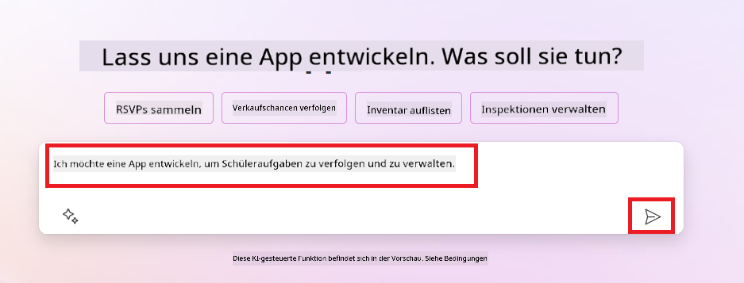
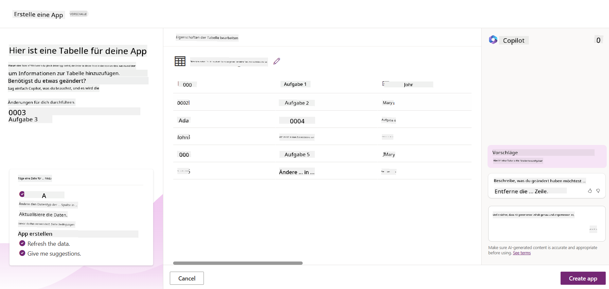
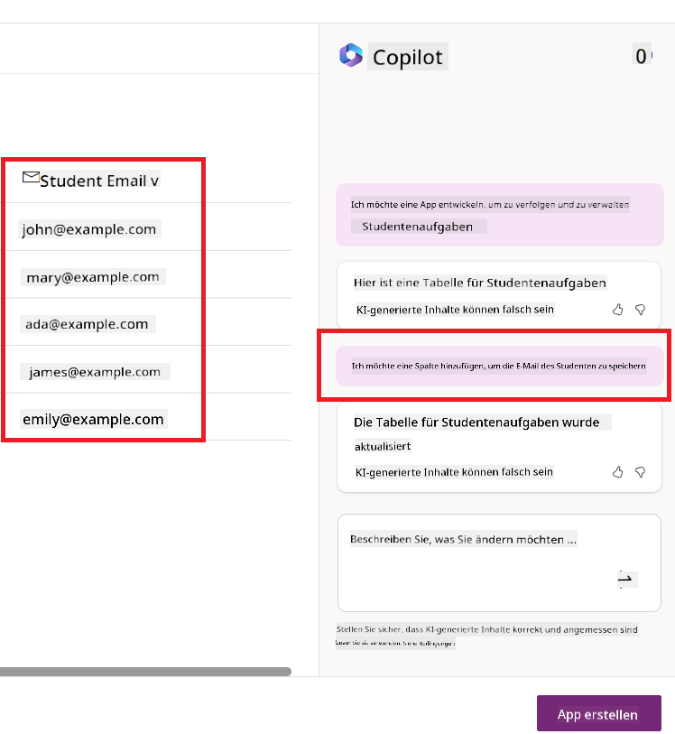
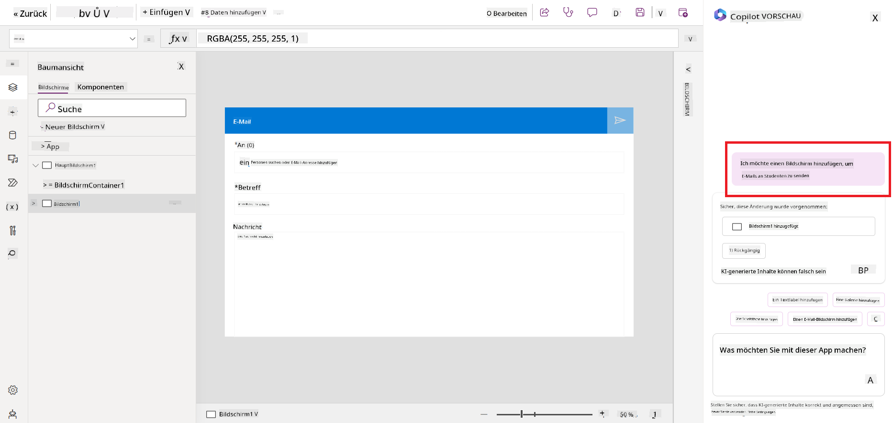
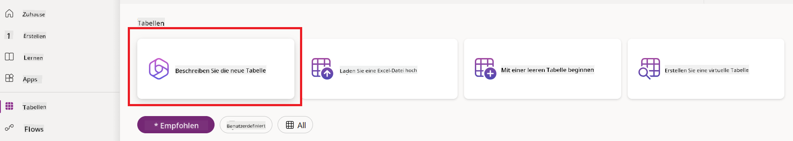
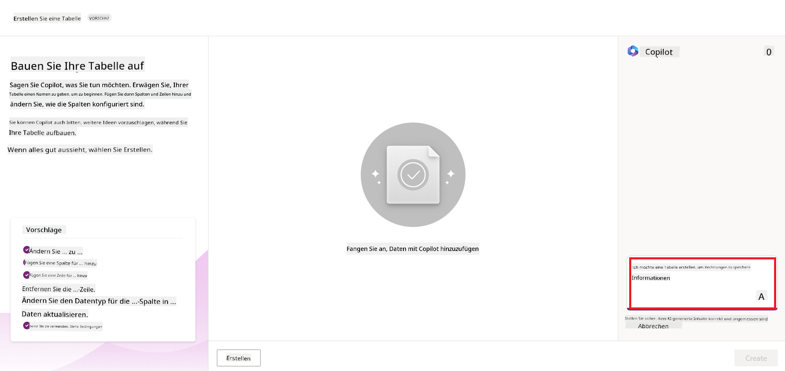
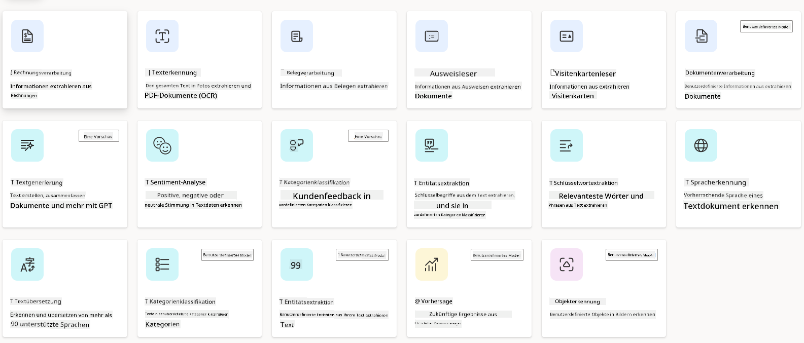
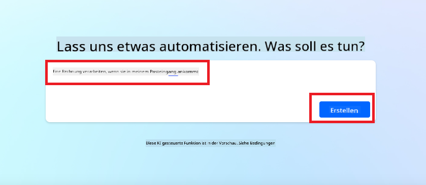
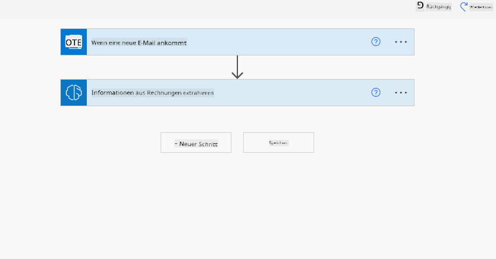
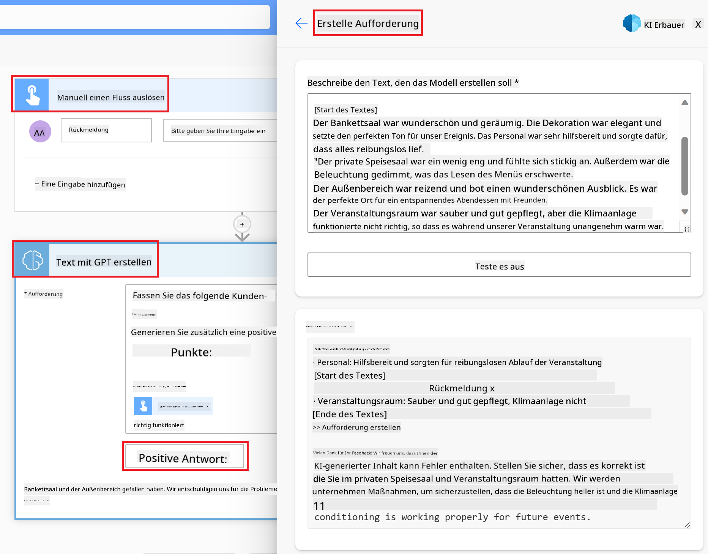

<!--
CO_OP_TRANSLATOR_METADATA:
{
  "original_hash": "f5ff3b6204a695a117d6f452403c95f7",
  "translation_date": "2025-05-19T19:30:42+00:00",
  "source_file": "10-building-low-code-ai-applications/README.md",
  "language_code": "de"
}
-->
# Erstellung von Low-Code-AI-Anwendungen

> _(Klicken Sie auf das Bild oben, um das Video dieser Lektion anzusehen)_

## Einführung

Nachdem wir nun gelernt haben, wie man Bildgenerierungsanwendungen erstellt, sprechen wir über Low Code. Generative KI kann in verschiedenen Bereichen eingesetzt werden, einschließlich Low Code. Aber was ist Low Code und wie können wir KI hinzufügen?

Die Erstellung von Apps und Lösungen ist für traditionelle Entwickler und Nicht-Entwickler durch die Nutzung von Low-Code-Entwicklungsplattformen einfacher geworden. Diese Plattformen ermöglichen es, Apps und Lösungen mit wenig bis gar keinem Code zu erstellen. Dies wird durch eine visuelle Entwicklungsumgebung erreicht, die es Ihnen ermöglicht, Komponenten per Drag-and-Drop zu ziehen, um Apps und Lösungen zu erstellen. Dadurch können Apps und Lösungen schneller und mit weniger Ressourcen erstellt werden. In dieser Lektion tauchen wir tief in die Nutzung von Low Code ein und wie man die Low-Code-Entwicklung mit KI unter Verwendung der Power Platform verbessern kann.

Die Power Platform bietet Organisationen die Möglichkeit, ihre Teams zu befähigen, eigene Lösungen in einer intuitiven Low-Code- oder No-Code-Umgebung zu erstellen. Diese Umgebung vereinfacht den Prozess der Lösungsentwicklung. Mit der Power Platform können Lösungen in Tagen oder Wochen statt in Monaten oder Jahren erstellt werden. Die Power Platform besteht aus fünf Hauptprodukten: Power Apps, Power Automate, Power BI, Power Pages und Copilot Studio.

Diese Lektion behandelt:

- Einführung in generative KI in der Power Platform
- Einführung in Copilot und wie man es nutzt
- Nutzung von generativer KI zum Erstellen von Apps und Flows in der Power Platform
- Verständnis der KI-Modelle in der Power Platform mit AI Builder

## Lernziele

Am Ende dieser Lektion werden Sie in der Lage sein:

- Zu verstehen, wie Copilot in der Power Platform funktioniert.

- Eine App zur Nachverfolgung von Schüleraufgaben für unser Bildungs-Startup zu erstellen.

- Einen Rechnungsverarbeitungs-Flow zu erstellen, der KI verwendet, um Informationen aus Rechnungen zu extrahieren.

- Beste Praktiken bei der Verwendung des Text-erstellen-mit-GPT-KI-Modells anzuwenden.

Die Werkzeuge und Technologien, die Sie in dieser Lektion verwenden werden, sind:

- **Power Apps**, für die App zur Nachverfolgung von Schüleraufgaben, die eine Low-Code-Entwicklungsumgebung für den Bau von Apps bietet, um Daten zu verfolgen, zu verwalten und mit ihnen zu interagieren.

- **Dataverse**, zum Speichern der Daten für die App zur Nachverfolgung von Schüleraufgaben, wobei Dataverse eine Low-Code-Datenplattform für die Speicherung der App-Daten bereitstellt.

- **Power Automate**, für den Rechnungsverarbeitungs-Flow, der eine Low-Code-Entwicklungsumgebung für den Bau von Workflows bietet, um den Rechnungsverarbeitungsprozess zu automatisieren.

- **AI Builder**, für das Rechnungsverarbeitungs-KI-Modell, bei dem Sie vorgefertigte KI-Modelle verwenden, um die Rechnungen für unser Startup zu verarbeiten.

## Generative KI in der Power Platform

Die Verbesserung der Low-Code-Entwicklung und -Anwendung mit generativer KI ist ein zentraler Schwerpunkt der Power Platform. Das Ziel ist es, jedem zu ermöglichen, KI-gestützte Apps, Websites, Dashboards zu erstellen und Prozesse mit KI zu automatisieren, _ohne dass Datenwissenschaftskompetenz erforderlich ist_. Dieses Ziel wird durch die Integration von generativer KI in die Low-Code-Entwicklungserfahrung in der Power Platform in Form von Copilot und AI Builder erreicht.

### Wie funktioniert das?

Copilot ist ein KI-Assistent, der es Ihnen ermöglicht, Power Platform-Lösungen zu erstellen, indem Sie Ihre Anforderungen in einer Reihe von konversationellen Schritten in natürlicher Sprache beschreiben. Sie können beispielsweise Ihren KI-Assistenten anweisen, welche Felder Ihre App verwenden wird, und er erstellt sowohl die App als auch das zugrunde liegende Datenmodell, oder Sie können festlegen, wie ein Flow in Power Automate eingerichtet werden soll.

Sie können Copilot-gesteuerte Funktionen als Feature in Ihren App-Bildschirmen verwenden, um Benutzern zu ermöglichen, durch konversationelle Interaktionen Einblicke zu gewinnen.

AI Builder ist eine Low-Code-KI-Funktionalität in der Power Platform, die es Ihnen ermöglicht, KI-Modelle zu verwenden, um Prozesse zu automatisieren und Ergebnisse vorherzusagen. Mit AI Builder können Sie KI in Ihre Apps und Flows einbringen, die mit Ihren Daten in Dataverse oder in verschiedenen Cloud-Datenquellen wie SharePoint, OneDrive oder Azure verbunden sind.

Copilot ist in allen Produkten der Power Platform verfügbar: Power Apps, Power Automate, Power BI, Power Pages und Power Virtual Agents. AI Builder ist in Power Apps und Power Automate verfügbar. In dieser Lektion konzentrieren wir uns darauf, wie man Copilot und AI Builder in Power Apps und Power Automate verwendet, um eine Lösung für unser Bildungs-Startup zu erstellen.

### Copilot in Power Apps

Als Teil der Power Platform bietet Power Apps eine Low-Code-Entwicklungsumgebung für den Bau von Apps zur Nachverfolgung, Verwaltung und Interaktion mit Daten. Es ist eine Suite von App-Entwicklungsdiensten mit einer skalierbaren Datenplattform und der Fähigkeit, sich mit Cloud-Diensten und lokalen Daten zu verbinden. Power Apps ermöglicht es Ihnen, Apps zu erstellen, die auf Browsern, Tablets und Telefonen laufen und mit Kollegen geteilt werden können. Power Apps erleichtert den Einstieg in die App-Entwicklung mit einer einfachen Benutzeroberfläche, sodass jeder Geschäftsanwender oder professionelle Entwickler benutzerdefinierte Apps erstellen kann. Die App-Entwicklungserfahrung wird auch durch generative KI durch Copilot verbessert.

Die Copilot-KI-Assistentenfunktion in Power Apps ermöglicht es Ihnen, zu beschreiben, welche Art von App Sie benötigen und welche Informationen Ihre App verfolgen, sammeln oder anzeigen soll. Copilot generiert dann eine responsive Canvas-App basierend auf Ihrer Beschreibung. Sie können die App dann an Ihre Bedürfnisse anpassen. Der KI-Copilot generiert und schlägt auch eine Dataverse-Tabelle mit den Feldern vor, die Sie benötigen, um die Daten zu speichern, die Sie verfolgen möchten, sowie einige Beispieldaten. Wir werden uns später in dieser Lektion ansehen, was Dataverse ist und wie Sie es in Power Apps verwenden können. Sie können die Tabelle dann mit der AI-Copilot-Assistentenfunktion durch konversationelle Schritte an Ihre Bedürfnisse anpassen. Diese Funktion ist direkt vom Power Apps-Startbildschirm aus verfügbar.

### Copilot in Power Automate

Als Teil der Power Platform ermöglicht Power Automate Benutzern, automatisierte Workflows zwischen Anwendungen und Diensten zu erstellen. Es hilft, sich wiederholende Geschäftsprozesse wie Kommunikation, Datenerfassung und Entscheidungsfreigaben zu automatisieren. Die einfache Benutzeroberfläche ermöglicht es Benutzern mit jeder technischen Kompetenz (von Anfängern bis zu erfahrenen Entwicklern), Arbeitsaufgaben zu automatisieren. Die Workflow-Entwicklungserfahrung wird auch durch generative KI durch Copilot verbessert.

Die Copilot-KI-Assistentenfunktion in Power Automate ermöglicht es Ihnen, zu beschreiben, welche Art von Flow Sie benötigen und welche Aktionen Ihr Flow ausführen soll. Copilot generiert dann einen Flow basierend auf Ihrer Beschreibung. Sie können den Flow dann an Ihre Bedürfnisse anpassen. Der KI-Copilot generiert und schlägt auch die Aktionen vor, die Sie benötigen, um die Aufgabe zu automatisieren, die Sie ausführen möchten. Wir werden uns später in dieser Lektion ansehen, was Flows sind und wie Sie sie in Power Automate verwenden können. Sie können die Aktionen dann mit der AI-Copilot-Assistentenfunktion durch konversationelle Schritte an Ihre Bedürfnisse anpassen. Diese Funktion ist direkt vom Power Automate-Startbildschirm aus verfügbar.

## Aufgabe: Verwalten Sie Schüleraufgaben und Rechnungen für unser Startup mithilfe von Copilot

Unser Startup bietet Online-Kurse für Studenten an. Das Startup ist schnell gewachsen und hat nun Schwierigkeiten, mit der Nachfrage nach seinen Kursen Schritt zu halten. Das Startup hat Sie als Power Platform-Entwickler eingestellt, um ihnen zu helfen, eine Low-Code-Lösung zu entwickeln, die ihnen hilft, ihre Schüleraufgaben und Rechnungen zu verwalten. Ihre Lösung sollte ihnen helfen, Schüleraufgaben durch eine App zu verfolgen und zu verwalten und den Rechnungsverarbeitungsprozess durch einen Workflow zu automatisieren. Sie wurden gebeten, generative KI zur Entwicklung der Lösung zu verwenden.

Wenn Sie mit der Nutzung von Copilot beginnen, können Sie die [Power Platform Copilot Prompt Library](https://github.com/pnp/powerplatform-prompts?WT.mc_id=academic-109639-somelezediko) verwenden, um mit den Eingabeaufforderungen zu beginnen. Diese Bibliothek enthält eine Liste von Eingabeaufforderungen, die Sie verwenden können, um Apps und Flows mit Copilot zu erstellen. Sie können die Eingabeaufforderungen in der Bibliothek auch verwenden, um eine Vorstellung davon zu bekommen, wie Sie Ihre Anforderungen an Copilot beschreiben können.

### Erstellen Sie eine Schüleraufgaben-Tracker-App für unser Startup

Die Lehrkräfte in unserem Startup hatten Schwierigkeiten, die Schüleraufgaben im Auge zu behalten. Sie haben ein Tabellenblatt verwendet, um die Aufgaben zu verfolgen, aber dies ist schwierig zu verwalten, da die Anzahl der Schüler zugenommen hat. Sie haben Sie gebeten, eine App zu erstellen, die ihnen hilft, Schüleraufgaben zu verfolgen und zu verwalten. Die App sollte es ihnen ermöglichen, neue Aufgaben hinzuzufügen, Aufgaben anzuzeigen, Aufgaben zu aktualisieren und Aufgaben zu löschen. Die App sollte auch Lehrkräften und Schülern ermöglichen, die Aufgaben anzuzeigen, die bewertet wurden, und diejenigen, die nicht bewertet wurden.

Sie werden die App mithilfe von Copilot in Power Apps gemäß den folgenden Schritten erstellen:

1. Navigieren Sie zum [Power Apps](https://make.powerapps.com?WT.mc_id=academic-105485-koreyst) Startbildschirm.

1. Verwenden Sie den Textbereich auf dem Startbildschirm, um die App zu beschreiben, die Sie erstellen möchten. Zum Beispiel: **_Ich möchte eine App erstellen, um Schüleraufgaben zu verfolgen und zu verwalten_**. Klicken Sie auf die **Senden**-Schaltfläche, um die Eingabeaufforderung an den AI Copilot zu senden.

1. Der AI Copilot wird eine Dataverse-Tabelle mit den Feldern vorschlagen, die Sie benötigen, um die Daten zu speichern, die Sie verfolgen möchten, sowie einige Beispieldaten. Sie können die Tabelle dann mithilfe der AI-Copilot-Assistentenfunktion durch konversationelle Schritte an Ihre Bedürfnisse anpassen.

   > **Wichtig**: Dataverse ist die zugrunde liegende Datenplattform für die Power Platform. Es ist eine Low-Code-Datenplattform zum Speichern der App-Daten. Es ist ein vollständig verwalteter Dienst, der Daten sicher in der Microsoft-Cloud speichert und innerhalb Ihrer Power Platform-Umgebung bereitgestellt wird. Es bietet integrierte Datenverwaltungsmöglichkeiten wie Datenklassifizierung, Datenherkunft, feingranulare Zugriffskontrolle und mehr. Sie können mehr über Dataverse [hier erfahren](https://docs.microsoft.com/powerapps/maker/data-platform/data-platform-intro?WT.mc_id=academic-109639-somelezediko).

   

1. Die Lehrkräfte möchten E-Mails an die Schüler senden, die ihre Aufgaben eingereicht haben, um sie über den Fortschritt ihrer Aufgaben auf dem Laufenden zu halten. Sie können Copilot verwenden, um ein neues Feld zur Tabelle hinzuzufügen, um die Schüler-E-Mail zu speichern. Zum Beispiel können Sie die folgende Eingabeaufforderung verwenden, um ein neues Feld zur Tabelle hinzuzufügen: **_Ich möchte eine Spalte hinzufügen, um die Schüler-E-Mail zu speichern_**. Klicken Sie auf die **Senden**-Schaltfläche, um die Eingabeaufforderung an den AI Copilot zu senden.

1. Der AI Copilot wird ein neues Feld generieren, und Sie können das Feld dann an Ihre Bedürfnisse anpassen.

1. Sobald Sie mit der Tabelle fertig sind, klicken Sie auf die **App erstellen**-Schaltfläche, um die App zu erstellen.

1. Der AI Copilot wird eine responsive Canvas-App basierend auf Ihrer Beschreibung generieren. Sie können die App dann an Ihre Bedürfnisse anpassen.

1. Um Lehrkräften das Senden von E-Mails an Schüler zu ermöglichen, können Sie Copilot verwenden, um einen neuen Bildschirm zur App hinzuzufügen. Zum Beispiel können Sie die folgende Eingabeaufforderung verwenden, um einen neuen Bildschirm zur App hinzuzufügen: **_Ich möchte einen Bildschirm hinzufügen, um E-Mails an Schüler zu senden_**. Klicken Sie auf die **Senden**-Schaltfläche, um die Eingabeaufforderung an den AI Copilot zu senden.

1. Der AI Copilot wird einen neuen Bildschirm generieren, und Sie können den Bildschirm dann an Ihre Bedürfnisse anpassen.

1. Sobald Sie mit der App fertig sind, klicken Sie auf die **Speichern**-Schaltfläche, um die App zu speichern.

1. Um die App mit den Lehrkräften zu teilen, klicken Sie auf die **Teilen**-Schaltfläche und dann erneut auf die **Teilen**-Schaltfläche. Sie können die App dann mit den Lehrkräften teilen, indem Sie ihre E-Mail-Adressen eingeben.

> **Ihre Hausaufgabe**: Die App, die Sie gerade erstellt haben, ist ein guter Anfang, kann aber verbessert werden. Mit der E-Mail-Funktion können Lehrkräfte nur manuell E-Mails an Schüler senden, indem sie deren E-Mails eingeben müssen. Können Sie Copilot verwenden, um eine Automatisierung zu erstellen, die es Lehrkräften ermöglicht, E-Mails automatisch an Schüler zu senden, wenn sie ihre Aufgaben einreichen? Ihr Hinweis ist, dass Sie mit der richtigen Eingabeaufforderung Copilot in Power Automate verwenden können, um dies zu erstellen.

### Erstellen Sie eine Rechnungstabelle für unser Startup

Das Finanzteam unseres Startups hatte Schwierigkeiten, den Überblick über Rechnungen zu behalten. Sie haben ein Tabellenblatt verwendet, um die Rechnungen zu verfolgen, aber dies ist schwierig zu verwalten, da die Anzahl der Rechnungen zugenommen hat. Sie haben Sie gebeten, eine Tabelle zu erstellen, die ihnen hilft, die Informationen der erhaltenen Rechnungen zu speichern, zu verfolgen und zu verwalten. Die Tabelle sollte verwendet werden, um eine Automatisierung zu erstellen, die alle Rechnungsinformationen extrahiert und in der Tabelle speichert. Die Tabelle sollte es dem Finanzteam auch ermöglichen, die Rechnungen anzuzeigen, die bezahlt wurden, und diejenigen, die nicht bezahlt wurden.

Die Power Platform hat eine zugrunde liegende Datenplattform namens Dataverse, die es Ihnen ermöglicht, die Daten für Ihre Apps und Lösungen zu speichern. Dataverse bietet eine Low-Code-Datenplattform für die Speicherung der App-Daten. Es ist ein vollständig verwalteter Dienst, der Daten sicher in der Microsoft-Cloud speichert und innerhalb Ihrer Power Platform-Umgebung bereitgestellt wird. Es bietet integrierte Datenverwaltungsmöglichkeiten wie Datenklassifizierung, Datenherkunft, feingranulare Zugriffskontrolle und mehr. Sie können mehr [über Dataverse hier erfahren](https://docs.microsoft.com/powerapps/maker/data-platform/data-platform-intro?WT.mc_id=academic-109639-somelezediko).

Warum sollten wir Dataverse für unser Startup verwenden? Die Standard- und benutzerdefinierten Tabellen innerhalb von Dataverse bieten eine sichere und cloudbasierte Speicheroption für Ihre Daten. Tabellen ermöglichen es Ihnen, verschiedene Arten von Daten zu speichern, ähnlich wie Sie mehrere Arbeitsblätter in einer einzigen Excel-Arbeitsmappe verwenden könnten. Sie können Tabellen verwenden, um Daten zu speichern, die spezifisch für Ihre Organisations- oder Geschäftsanforderungen sind. Einige der Vorteile, die unser Startup durch die Verwendung von Dataverse erhält, umfassen unter anderem:

- **Einfach zu verwalten**: Sowohl die Metadaten als auch die Daten werden in der Cloud gespeichert, sodass Sie sich nicht um die Details kümmern müssen, wie sie gespeichert oder verwaltet werden. Sie können sich darauf konzentrieren, Ihre Apps und Lösungen zu erstellen.

- **Sicher**: Dataverse bietet eine sichere und cloudbasierte Speicheroption für Ihre Daten. Sie können steuern, wer Zugriff auf die Daten in Ihren Tabellen hat und wie sie darauf zugreifen können, indem Sie rollenbasierte Sicherheit verwenden.

- **Reiche Metadaten**: Datentypen und Beziehungen werden direkt innerhalb von Power Apps verwendet.

- **Logik und Validierung**: Sie können Geschäftsregeln, berechnete Felder und Validierungsregeln verwenden, um Geschäftslogik durchzusetzen und die Datenintegrität zu gewährleisten.

Jetzt, da Sie wissen, was Dataverse ist und warum Sie es verwenden sollten, schauen wir uns an, wie Sie Copilot verwenden können, um eine Tabelle in Dataverse zu erstellen, um die Anforderungen unseres Finanzteams zu erfüllen.

> **Hinweis**: Sie werden diese Tabelle im nächsten Abschnitt verwenden, um eine Automatisierung zu erstellen, die alle Rechnungsinformationen extrahiert und in der Tabelle speichert.
Um eine Tabelle in Dataverse mit Copilot zu erstellen, folgen Sie den unten stehenden Schritten: 1. Navigieren Sie zum [Power Apps](https://make.powerapps.com?WT.mc_id=academic-105485-koreyst) Startbildschirm. 2. Wählen Sie in der linken Navigationsleiste **Tabellen** und klicken Sie dann auf **Neue Tabelle beschreiben**.  1. Verwenden Sie auf dem Bildschirm **Neue Tabelle beschreiben** den Textbereich, um die Tabelle zu beschreiben, die Sie erstellen möchten. Zum Beispiel: **_Ich möchte eine Tabelle erstellen, um Rechnungsinformationen zu speichern_**. Klicken Sie auf die **Senden**-Schaltfläche, um die Eingabeaufforderung an den AI Copilot zu senden.  1. Der AI Copilot wird eine Dataverse-Tabelle mit den Feldern vorschlagen, die Sie benötigen, um die Daten zu speichern, die Sie verfolgen möchten, sowie einige Beispield
ein Text. - **Sentimentanalyse**: Dieses Modell erkennt positive, negative, neutrale oder gemischte Stimmungen in Texten. - **Visitenkartenleser**: Dieses Modell extrahiert Informationen von Visitenkarten. - **Texterkennung**: Dieses Modell extrahiert Text aus Bildern. - **Objekterkennung**: Dieses Modell erkennt und extrahiert Objekte aus Bildern. - **Dokumentenverarbeitung**: Dieses Modell extrahiert Informationen aus Formularen. - **Rechnungsverarbeitung**: Dieses Modell extrahiert Informationen aus Rechnungen. Mit benutzerdefinierten KI-Modellen können Sie Ihr eigenes Modell in AI Builder einbringen, sodass es wie jedes benutzerdefinierte Modell von AI Builder funktioniert. Dadurch können Sie das Modell mit Ihren eigenen Daten trainieren. Sie können diese Modelle verwenden, um Prozesse zu automatisieren und Ergebnisse sowohl in Power Apps als auch in Power Automate vorherzusagen. Wenn Sie Ihr eigenes Modell verwenden, gibt es Einschränkungen, die gelten. Lesen Sie mehr über diese [Einschränkungen](https://learn.microsoft.com/ai-builder/byo-model#limitations?WT.mc_id=academic-105485-koreyst). 

## Aufgabe #2 - Erstellen Sie einen Rechnungsverarbeitungs-Flow für unser Startup

Das Finanzteam hat Schwierigkeiten, Rechnungen zu verarbeiten. Sie haben eine Tabelle verwendet, um die Rechnungen zu verfolgen, aber das ist schwierig zu handhaben geworden, da die Anzahl der Rechnungen zugenommen hat. Sie haben Sie gebeten, einen Workflow zu erstellen, der ihnen hilft, Rechnungen mithilfe von KI zu verarbeiten. Der Workflow sollte es ihnen ermöglichen, Informationen aus Rechnungen zu extrahieren und diese Informationen in einer Dataverse-Tabelle zu speichern. Der Workflow sollte es ihnen auch ermöglichen, eine E-Mail mit den extrahierten Informationen an das Finanzteam zu senden.

Da Sie nun wissen, was AI Builder ist und warum Sie es verwenden sollten, schauen wir uns an, wie Sie das Rechnungsverarbeitungs-KI-Modell in AI Builder verwenden können, das wir zuvor behandelt haben, um einen Workflow zu erstellen, der dem Finanzteam bei der Verarbeitung von Rechnungen hilft.

Um einen Workflow zu erstellen, der dem Finanzteam bei der Verarbeitung von Rechnungen mithilfe des Rechnungsverarbeitungs-KI-Modells in AI Builder hilft, folgen Sie den untenstehenden Schritten:

1. Navigieren Sie zur [Power Automate](https://make.powerautomate.com?WT.mc_id=academic-105485-koreyst) Startseite.
2. Verwenden Sie das Textfeld auf der Startseite, um den Workflow zu beschreiben, den Sie erstellen möchten. Zum Beispiel: **_Eine Rechnung verarbeiten, wenn sie in meinem Posteingang ankommt_**. Klicken Sie auf die **Senden**-Schaltfläche, um die Eingabeaufforderung an den KI-Copilot zu senden. 
3. Der KI-Copilot wird die Aktionen vorschlagen, die Sie ausführen müssen, um die Aufgabe zu automatisieren, die Sie durchführen möchten. Sie können auf die **Weiter**-Schaltfläche klicken, um die nächsten Schritte durchzugehen.
4. Im nächsten Schritt wird Power Automate Sie auffordern, die für den Flow erforderlichen Verbindungen einzurichten. Sobald Sie fertig sind, klicken Sie auf die **Flow erstellen**-Schaltfläche, um den Flow zu erstellen.
5. Der KI-Copilot wird einen Flow generieren und Sie können dann den Flow an Ihre Bedürfnisse anpassen.
6. Aktualisieren Sie den Auslöser des Flows und setzen Sie den **Ordner** auf den Ordner, in dem die Rechnungen gespeichert werden. Zum Beispiel können Sie den Ordner auf **Posteingang** setzen. Klicken Sie auf **Erweiterte Optionen anzeigen** und setzen Sie **Nur mit Anlagen** auf **Ja**. Dies stellt sicher, dass der Flow nur ausgeführt wird, wenn eine E-Mail mit Anhang im Ordner empfangen wird.
7. Entfernen Sie die folgenden Aktionen aus dem Flow: **HTML zu Text**, **Zusammensetzen**, **Zusammensetzen 2**, **Zusammensetzen 3** und **Zusammensetzen 4**, da Sie diese nicht verwenden werden.
8. Entfernen Sie die **Bedingung**-Aktion aus dem Flow, da Sie diese nicht verwenden werden. Es sollte wie im folgenden Screenshot aussehen: 
9. Klicken Sie auf die **Aktion hinzufügen**-Schaltfläche und suchen Sie nach **Dataverse**. Wählen Sie die **Neue Zeile hinzufügen**-Aktion aus.
10. Bei der **Informationen aus Rechnungen extrahieren**-Aktion aktualisieren Sie die **Rechnungsdatei**, um auf den **Anhangsinhalt** aus der E-Mail zu verweisen. Dies stellt sicher, dass der Flow Informationen aus dem Rechnungsanhang extrahiert.
11. Wählen Sie die **Tabelle** aus, die Sie zuvor erstellt haben. Zum Beispiel können Sie die **Rechnungsinformationen**-Tabelle auswählen. Wählen Sie den dynamischen Inhalt aus der vorherigen Aktion aus, um die folgenden Felder zu füllen:
    - ID
    - Betrag
    - Datum
    - Name
    - Status
    - Setzen Sie den **Status** auf **Ausstehend**.
    - Lieferanten-E-Mail
    - Verwenden Sie den **Von**-dynamischen Inhalt aus dem **Wenn eine neue E-Mail eintrifft**-Auslöser. 
12. Sobald Sie mit dem Flow fertig sind, klicken Sie auf die **Speichern**-Schaltfläche, um den Flow zu speichern. Sie können den Flow dann testen, indem Sie eine E-Mail mit einer Rechnung an den im Auslöser angegebenen Ordner senden.

> **Ihre Hausaufgabe**: Der Flow, den Sie gerade erstellt haben, ist ein guter Anfang. Jetzt müssen Sie überlegen, wie Sie eine Automatisierung erstellen können, die es unserem Finanzteam ermöglicht, eine E-Mail an den Lieferanten zu senden, um ihn über den aktuellen Status seiner Rechnung zu informieren. Ihr Hinweis: Der Flow muss ausgeführt werden, wenn sich der Status der Rechnung ändert.

## Verwenden eines Textgenerierungs-KI-Modells in Power Automate

Das Erstellen von Text mit dem GPT-KI-Modell in AI Builder ermöglicht es Ihnen, basierend auf einer Eingabeaufforderung Text zu generieren und wird vom Microsoft Azure OpenAI-Dienst unterstützt. Mit dieser Fähigkeit können Sie GPT (Generative Pre-Trained Transformer)-Technologie in Ihre Apps und Flows integrieren, um eine Vielzahl von automatisierten Flows und aufschlussreichen Anwendungen zu erstellen.

GPT-Modelle werden umfassend mit riesigen Datenmengen trainiert, sodass sie Text erzeugen können, der bei Bereitstellung einer Eingabeaufforderung der menschlichen Sprache sehr ähnlich ist. Wenn sie mit der Workflow-Automatisierung integriert sind, können KI-Modelle wie GPT genutzt werden, um eine Vielzahl von Aufgaben zu rationalisieren und zu automatisieren.

Zum Beispiel können Sie Flows erstellen, um automatisch Text für eine Vielzahl von Anwendungsfällen zu generieren, wie z.B.: Entwürfe von E-Mails, Produktbeschreibungen und mehr. Sie können das Modell auch verwenden, um Text für eine Vielzahl von Apps zu generieren, wie z.B. Chatbots und Kundenservice-Apps, die es Kundenservice-Agenten ermöglichen, effektiv und effizient auf Kundenanfragen zu reagieren.

Um zu lernen, wie Sie dieses KI-Modell in Power Automate verwenden können, gehen Sie das Modul [Intelligenz mit AI Builder und GPT hinzufügen](https://learn.microsoft.com/training/modules/ai-builder-text-generation/?WT.mc_id=academic-109639-somelezediko) durch.

## Großartige Arbeit! Setzen Sie Ihr Lernen fort

Nachdem Sie diese Lektion abgeschlossen haben, schauen Sie sich unsere [Generative KI Lernsammlung](https://aka.ms/genai-collection?WT.mc_id=academic-105485-koreyst) an, um Ihr Wissen über generative KI weiter zu vertiefen!

Gehen Sie zu Lektion 11, in der wir uns ansehen, wie man [Generative KI mit Funktionsaufrufen integriert](../11-integrating-with-function-calling/README.md?WT.mc_id=academic-105485-koreyst)!

**Haftungsausschluss**:  
Dieses Dokument wurde mit dem KI-Übersetzungsdienst [Co-op Translator](https://github.com/Azure/co-op-translator) übersetzt. Obwohl wir uns um Genauigkeit bemühen, beachten Sie bitte, dass automatisierte Übersetzungen Fehler oder Ungenauigkeiten enthalten können. Das Originaldokument in seiner ursprünglichen Sprache sollte als maßgebliche Quelle betrachtet werden. Für wichtige Informationen wird eine professionelle menschliche Übersetzung empfohlen. Wir haften nicht für Missverständnisse oder Fehlinterpretationen, die sich aus der Verwendung dieser Übersetzung ergeben.