# Entwicklung von Low Code KI-Anwendungen

[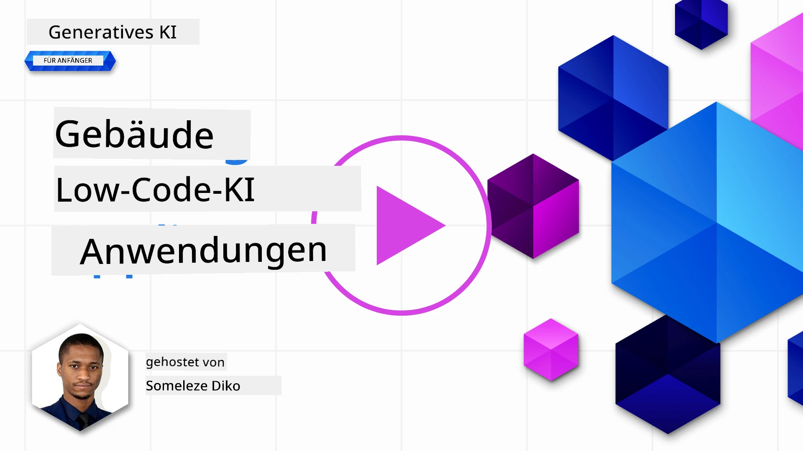](https://youtu.be/1vzq3Nd8GBA?si=h6LHWJXdmqf6mhDg)

> _(Klicken Sie auf das obige Bild, um das Video zu dieser Lektion anzusehen)_

## Einführung

Nachdem wir nun gelernt haben, wie man bildgenerierende Anwendungen erstellt, wollen wir über Low Code sprechen. Generative KI kann in verschiedenen Bereichen verwendet werden, unter anderem auch im Low Code, aber was ist Low Code und wie können wir KI darin integrieren?

Die Erstellung von Apps und Lösungen ist für traditionelle Entwickler und Nicht-Entwickler durch die Nutzung von Low Code Entwicklungsplattformen einfacher geworden. Low Code Entwicklungsplattformen ermöglichen es Ihnen, Apps und Lösungen mit wenig bis gar keinem Code zu erstellen. Dies wird durch eine visuelle Entwicklungsumgebung erreicht, die es Ihnen erlaubt, Komponenten per Drag & Drop zu verschieben, um Apps und Lösungen zu bauen. So können Sie Apps und Lösungen schneller und mit weniger Ressourcen entwickeln. In dieser Lektion tauchen wir tief in die Nutzung von Low Code ein und zeigen, wie man Low Code Entwicklung mit KI durch die Power Platform verbessern kann.

Die Power Platform bietet Organisationen die Möglichkeit, ihre Teams zu befähigen, eigene Lösungen durch eine intuitive Low-Code- oder No-Code-Umgebung zu entwickeln. Diese Umgebung hilft dabei, den Prozess der Lösungsentwicklung zu vereinfachen. Mit der Power Platform können Lösungen in Tagen oder Wochen anstelle von Monaten oder Jahren erstellt werden. Die Power Platform besteht aus fünf Hauptprodukten: Power Apps, Power Automate, Power BI, Power Pages und Copilot Studio.

Diese Lektion behandelt:

- Einführung in Generative KI in der Power Platform
- Einführung in Copilot und wie man es verwendet
- Einsatz von Generativer KI zum Erstellen von Apps und Flows in der Power Platform
- Verständnis der KI-Modelle in der Power Platform mit AI Builder
- Erstellung intelligenter Agenten mit Microsoft Copilot Studio

## Lernziele

Am Ende dieser Lektion werden Sie in der Lage sein:

- Zu verstehen, wie Copilot in der Power Platform funktioniert.

- Eine Student Assignment Tracker App für unser Bildungs-Startup zu erstellen.

- Einen Invoice Processing Flow zu erstellen, der KI verwendet, um Informationen aus Rechnungen zu extrahieren.

- Best Practices bei der Nutzung des Create Text mit GPT KI-Modells anzuwenden.

- Zu verstehen, was Microsoft Copilot Studio ist und wie man damit intelligente Agenten erstellt.

Die Werkzeuge und Technologien, die Sie in dieser Lektion verwenden werden, sind:

- **Power Apps** für die Student Assignment Tracker App, eine Low-Code-Entwicklungsumgebung zum Erstellen von Apps, um Daten zu verfolgen, zu verwalten und mit ihnen zu interagieren.

- **Dataverse** zur Speicherung der Daten für die Student Assignment Tracker App, wo Dataverse eine Low-Code-Datenplattform zur Speicherung der App-Daten bereitstellt.

- **Power Automate** für den Invoice Processing Flow, wo Sie eine Low-Code-Entwicklungsumgebung zur Erstellung von Workflows zur Automatisierung des Rechnungserfassungsprozesses haben.

- **AI Builder** für das Invoice Processing KI-Modell, bei dem vorgefertigte KI-Modelle zur Verarbeitung der Rechnungen für unser Startup eingesetzt werden.

## Generative KI in der Power Platform

Die Verbesserung der Low-Code-Entwicklung und Anwendungen mit generativer KI ist ein Schwerpunkt der Power Platform. Das Ziel ist es, jedem zu ermöglichen, KI-gestützte Apps, Websites, Dashboards zu erstellen und Prozesse mit KI zu automatisieren, _ohne jegliche Datenwissenschaftskenntnisse zu benötigen_. Dieses Ziel wird durch die Integration generativer KI in die Low-Code-Entwicklungserfahrung der Power Platform in Form von Copilot und AI Builder erreicht.

### Wie funktioniert das?

Copilot ist ein KI-Assistent, der es Ihnen ermöglicht, Power Platform Lösungen zu erstellen, indem Sie Ihre Anforderungen in einer Reihe von konversationellen Schritten in natürlicher Sprache beschreiben. Sie können beispielsweise Ihren KI-Assistenten anweisen, welche Felder Ihre App verwenden soll, und er erstellt sowohl die App als auch das zugrundeliegende Datenmodell, oder Sie spezifizieren, wie ein Flow in Power Automate eingerichtet werden soll.

Sie können Copilot-fähige Funktionen als Feature in Ihren App-Bildschirmen nutzen, um Nutzern zu ermöglichen, durch konversationelle Interaktionen Einblicke zu gewinnen.

AI Builder ist eine Low-Code-KI-Funktion in der Power Platform, die es Ihnen erlaubt, KI-Modelle zu verwenden, um Prozesse zu automatisieren und Ergebnisse vorherzusagen. Mit AI Builder können Sie KI in Ihre Apps und Flows integrieren, die mit Ihren Daten in Dataverse oder verschiedenen Cloud-Datenquellen wie SharePoint, OneDrive oder Azure verbunden sind.

Copilot ist in allen Power Platform Produkten verfügbar: Power Apps, Power Automate, Power BI, Power Pages und Copilot Studio (ehemals Power Virtual Agents). AI Builder ist in Power Apps und Power Automate verfügbar. In dieser Lektion konzentrieren wir uns darauf, wie man Copilot und AI Builder in Power Apps und Power Automate verwendet, um eine Lösung für unser Bildungs-Startup zu erstellen.

### Copilot in Power Apps

Als Teil der Power Platform bietet Power Apps eine Low-Code-Entwicklungsumgebung zum Erstellen von Apps, mit denen Daten verfolgt, verwaltet und interagiert werden kann. Es ist eine Suite von App-Entwicklungsdiensten mit einer skalierbaren Datenplattform und der Möglichkeit, sich mit Cloud-Services und lokalen Daten zu verbinden. Power Apps ermöglicht die Erstellung von Apps, die in Browsern, auf Tablets und Telefonen laufen und mit Kollegen geteilt werden können. Power Apps erleichtert Nutzern die App-Entwicklung durch eine einfache Benutzeroberfläche, sodass jeder Geschäftsbenutzer oder Profi-Entwickler maßgeschneiderte Apps erstellen kann. Die App-Entwicklung wird zudem durch Generative KI über Copilot verbessert.

Das Copilot KI-Assistenten-Feature in Power Apps ermöglicht es Ihnen, zu beschreiben, welche Art von App Sie benötigen und welche Informationen Ihre App verfolgen, sammeln oder anzeigen soll. Copilot generiert dann eine responsive Canvas-App basierend auf Ihrer Beschreibung. Anschließend können Sie die App an Ihre Bedürfnisse anpassen. Die KI-Copilot-Funktion erzeugt und schlägt auch eine Dataverse-Tabelle mit den Feldern vor, die Sie benötigen, um die zu verfolgenden Daten zu speichern, sowie einige Beispieldaten. Was Dataverse ist und wie Sie es in Power Apps verwenden können, betrachten wir später in dieser Lektion. Sie können dann die Tabelle mithilfe des AI Copilot Assistenten über konversationelle Schritte anpassen. Dieses Feature ist direkt vom Power Apps Startbildschirm aus verfügbar.

### Copilot in Power Automate

Als Teil der Power Platform ermöglicht Power Automate Nutzern, automatisierte Workflows zwischen Anwendungen und Diensten zu erstellen. Es hilft dabei, sich wiederholende Geschäftsprozesse zu automatisieren, wie Kommunikation, Datensammlung und Entscheidungsgenehmigungen. Die einfache Benutzeroberfläche erlaubt es Nutzern aller technischen Kompetenzen (von Anfängern bis erfahrenen Entwicklern), Arbeitsschritte zu automatisieren. Die Workflow-Entwicklung wird ebenfalls durch Generative KI mittels Copilot verbessert.

Das Copilot KI-Assistenten-Feature in Power Automate ermöglicht es Ihnen zu beschreiben, welche Art von Flow Sie benötigen und welche Aktionen Ihr Flow ausführen soll. Copilot generiert dann einen Flow basierend auf Ihrer Beschreibung. Anschließend können Sie den Flow an Ihre Bedürfnisse anpassen. Die KI-Copilot-Funktion erzeugt und schlägt auch die Aktionen vor, die Sie zur Automatisierung der gewünschten Aufgabe benötigen. Was Flows sind und wie Sie diese in Power Automate nutzen können, betrachten wir später in dieser Lektion. Sie können dann die Aktionen mithilfe des AI Copilot Assistenten über konversationelle Schritte anpassen. Dieses Feature ist direkt vom Power Automate Startbildschirm aus verfügbar.

## Erstellung intelligenter Agenten mit Microsoft Copilot Studio

[Microsoft Copilot Studio](https://learn.microsoft.com/microsoft-copilot-studio/fundamentals-what-is-copilot-studio?WT.mc_id=academic-105485-koreyst) (ehemals Power Virtual Agents) ist das Low-Code-Mitglied der Power Platform zur Erstellung von **KI-Agenten** — konversationellen Copiloten, die Fragen beantworten, Aktionen ausführen und Aufgaben im Auftrag Ihrer Nutzer automatisieren können. Wie bei der restlichen Power Platform erstellen Sie diese Agenten in einer visuellen, auf natürliche Sprache fokussierten Umgebung: Sie beschreiben, was der Agent tun soll, und Copilot Studio unterstützt beim Strukturieren seiner Anweisungen, seines Wissens und seiner Aktionen.

Für unser Bildungs-Startup könnten Sie einen Agenten erstellen, der Student*innenfragen zu Kursen beantwortet, Abgabetermine für Aufgaben überprüft und sogar E-Mails an Lehrende sendet – alles ohne Code zu schreiben.

Hier sind einige der neuesten Funktionen, die Copilot Studio mächtig machen:

- **Generative Antworten aus Ihrem Wissen**. Statt jede Konversation manuell zu verfassen, können Sie **Wissensquellen** verbinden — öffentliche Websites, SharePoint, OneDrive, Dataverse, hochgeladene Dateien oder Unternehmensdaten über Connectoren — und der Agent generiert fundierte Antworten daraus.

- **Generative Orchestrierung**. Statt sich auf starre Auslösephrasen zu verlassen, nutzt der Agent KI, um eine Anfrage zu verstehen und dynamisch zu entscheiden, welches Wissen, welche Themen und Aktionen kombiniert werden, um sie zu erfüllen — inklusive der Verknüpfung mehrerer Schritte.

- **Aktionen und Connectoren**. Agenten können *Handlungen ausführen*, nicht nur chatten. Sie können einem Agenten Aktionen geben, die durch die über 1.500 vorgefertigten Power Platform Connectoren, Power Automate Flows, benutzerdefinierte REST-APIs, Prompts oder **Model Context Protocol (MCP)**-Server unterstützt werden.

- **Autonome Agenten**. Agenten sind nicht auf Antworten im Chatfenster beschränkt. Sie können **autonome Agenten** erstellen, die durch Ereignisse ausgelöst werden — wie eine neue E-Mail, ein neuer Datensatz in Dataverse oder das Hochladen einer Datei — und dann im Hintergrund handeln, um eine Aufgabe abzuschließen.

- **Orchestrierung mehrerer Agenten**. Agenten können andere Agenten aufrufen. Ein Copilot Studio Agent kann an andere Agenten übergeben oder von ihnen erweitert werden, einschließlich Agenten, die in Microsoft 365 Copilot veröffentlicht sind, sowie Agenten, die in Microsoft Foundry gebaut werden.

- **Modellauswahl**. Über die integrierten Modelle hinaus können Sie Modelle aus dem Microsoft Foundry Modellkatalog einbringen, um die Arbeitsweise Ihres Agenten in Bezug auf Argumentation und Antworten anzupassen.

- **Überall veröffentlichen**. Ein einmal erstellter Agent kann auf mehreren Kanälen veröffentlicht werden — Microsoft Teams, Microsoft 365 Copilot, einer Webseite oder App und mehr — mit Sicherheit, Authentifizierung und Analysen, die über die Power Platform Admin-Erfahrung verwaltet werden.

Sie können Ihren ersten Agenten unter [copilotstudio.microsoft.com](https://copilotstudio.microsoft.com?WT.mc_id=academic-105485-koreyst) erstellen und mehr in der [Microsoft Copilot Studio Dokumentation](https://learn.microsoft.com/microsoft-copilot-studio/?WT.mc_id=academic-105485-koreyst) erfahren.

## Aufgabe: Verwaltung von Studentenaufträgen und Rechnungen für unser Startup mit Copilot

Unser Startup bietet Onlinekurse für Studierende an. Das Startup ist schnell gewachsen und hat Schwierigkeiten, mit der Nachfrage nach seinen Kursen Schritt zu halten. Das Startup hat Sie als Power Platform Entwickler engagiert, um eine Low-Code-Lösung zu entwickeln, die bei der Verwaltung von Studentenaufträgen und Rechnungen hilft. Die Lösung soll es ermöglichen, Studentenaufträge über eine App zu verfolgen und zu verwalten sowie den Rechnungsverarbeitungsprozess mittels eines Workflows zu automatisieren. Sie sollen Generative KI einsetzen, um die Lösung zu entwickeln.

Wenn Sie mit der Nutzung von Copilot beginnen, können Sie die [Power Platform Copilot Prompt Bibliothek](https://github.com/pnp/powerplatform-prompts?WT.mc_id=academic-109639-somelezediko) verwenden, um mit den Prompts zu starten. Diese Bibliothek enthält eine Liste von Prompts, die Sie nutzen können, um Apps und Flows mit Copilot zu erstellen. Sie können die Prompts auch verwenden, um eine Vorstellung davon zu bekommen, wie Sie Ihre Anforderungen für Copilot beschreiben können.

### Erstellen Sie eine Student Assignment Tracker App für unser Startup

Die Lehrenden unseres Startups haben Schwierigkeiten, den Überblick über die Studentenaufträge zu behalten. Sie haben eine Tabelle verwendet, um die Aufträge zu verfolgen, aber das ist mit der steigenden Anzahl an Studierenden schwer zu handhaben geworden. Sie haben Sie gebeten, eine App zu erstellen, die ihnen hilft, die Aufträge zu verfolgen und zu verwalten. Die App soll es ermöglichen, neue Aufträge hinzuzufügen, Aufträge anzuzeigen, zu aktualisieren und zu löschen. Zudem soll die App den Lehrenden und Studierenden erlauben, zu sehen, welche Aufträge bewertet wurden und welche nicht.

Sie werden die App mit Copilot in Power Apps erstellen, indem Sie folgenden Schritten folgen:

1. Navigieren Sie zum [Power Apps](https://make.powerapps.com?WT.mc_id=academic-105485-koreyst) Startbildschirm.

1. Verwenden Sie das Textfeld auf dem Startbildschirm, um die App zu beschreiben, die Sie erstellen möchten. Zum Beispiel: **_Ich möchte eine App bauen, um Studentenaufträge zu verfolgen und zu verwalten_**. Klicken Sie auf die **Senden**-Schaltfläche, um die Eingabe an den AI Copilot zu schicken.

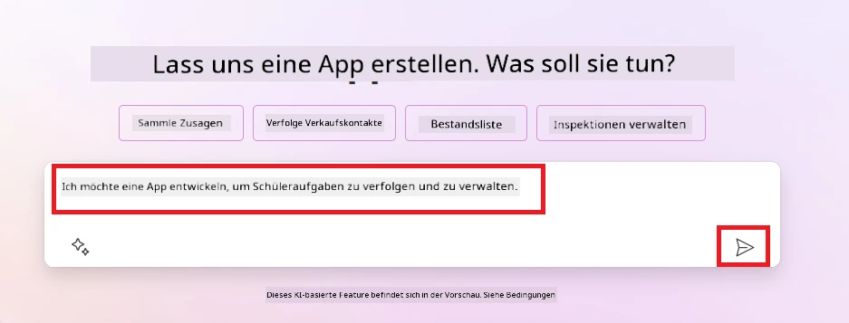

1. Der AI Copilot schlägt eine Dataverse-Tabelle mit den Feldern vor, die Sie benötigen, um die zu verfolgende Daten zu speichern, sowie einige Beispieldaten. Sie können die Tabelle anschließend mit Hilfe der AI Copilot Assistentenfunktion über konversationelle Schritte anpassen.

   > **Wichtig**: Dataverse ist die zugrundeliegende Datenplattform der Power Platform. Es ist eine Low-Code-Datenplattform zur Speicherung der App-Daten. Es handelt sich um einen vollständig verwalteten Service, der Daten sicher in der Microsoft Cloud speichert und innerhalb Ihrer Power Platform Umgebung bereitgestellt wird. Es bietet integrierte Datenverwaltungsfunktionen wie Datenklassifizierung, Datenherkunft, fein abgestufte Zugriffskontrolle und mehr. Mehr über Dataverse erfahren Sie [hier](https://learn.microsoft.com/power-apps/maker/data-platform/data-platform-intro?WT.mc_id=academic-109639-somelezediko).

   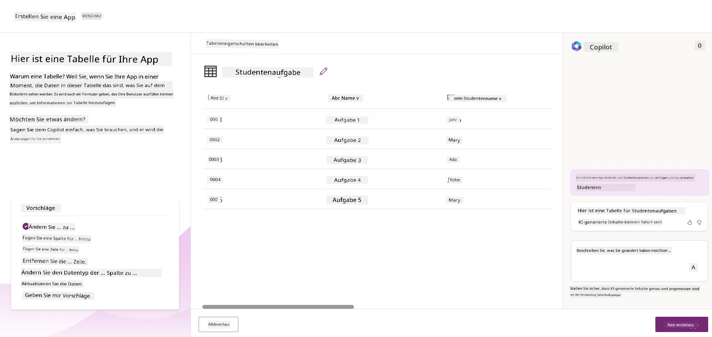

1. Lehrende möchten E-Mails an Studierende senden, die ihre Aufgaben abgegeben haben, um sie über den Fortschritt zu informieren. Sie können Copilot nutzen, um der Tabelle ein neues Feld hinzuzufügen, um die E-Mail-Adresse der Studierenden zu speichern. Beispielsweise können Sie folgenden Prompt verwenden, um der Tabelle eine neue Spalte hinzuzufügen: **_Ich möchte eine Spalte hinzufügen, um die E-Mail der Studierenden zu speichern_**. Klicken Sie auf die **Senden**-Schaltfläche, um den Prompt an den AI Copilot zu senden.

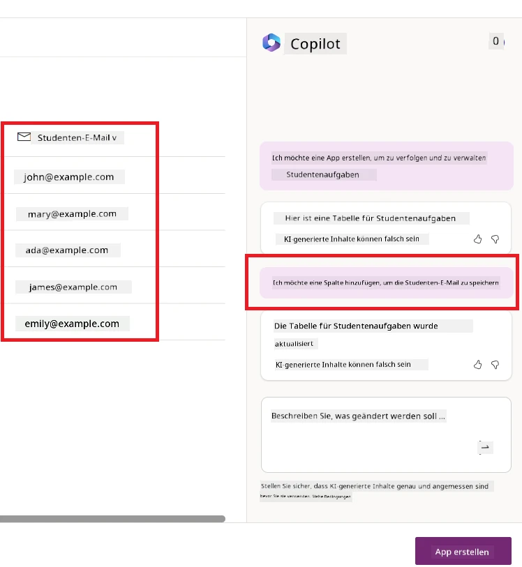

1. Der AI Copilot erstellt ein neues Feld, das Sie dann an Ihre Bedürfnisse anpassen können.

1. Sobald Sie mit der Tabelle fertig sind, klicken Sie auf die Schaltfläche **App erstellen**, um die App zu erstellen.

1. Der KI-CoPilot generiert eine responsive Canvas-App basierend auf Ihrer Beschreibung. Sie können die App dann an Ihre Bedürfnisse anpassen.

1. Lehrkräfte, die E-Mails an Schüler senden möchten, können den CoPilot verwenden, um der App einen neuen Bildschirm hinzuzufügen. Zum Beispiel können Sie die folgende Eingabeaufforderung verwenden, um der App einen neuen Bildschirm hinzuzufügen: **_Ich möchte einen Bildschirm hinzufügen, um E-Mails an Schüler zu senden_**. Klicken Sie auf die Schaltfläche **Senden**, um die Eingabeaufforderung an den KI-CoPilot zu senden.

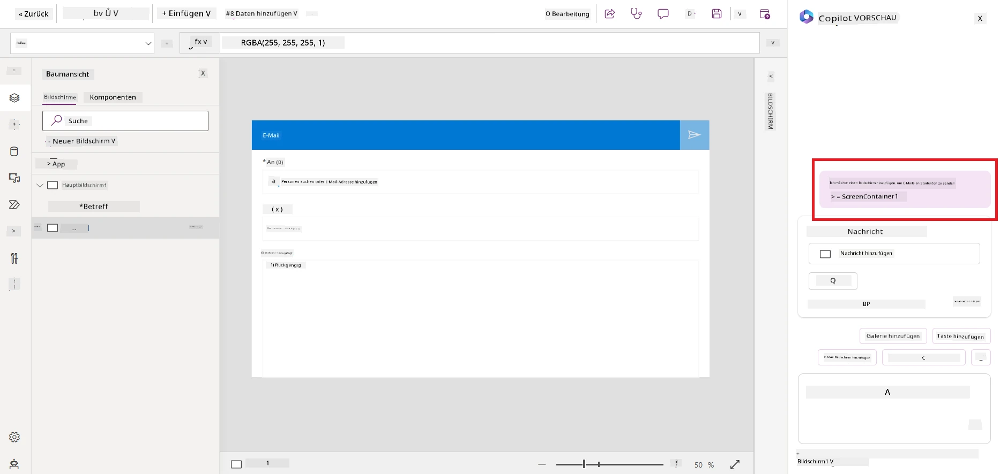

1. Der KI-CoPilot generiert einen neuen Bildschirm, den Sie dann an Ihre Bedürfnisse anpassen können.

1. Sobald Sie mit der App fertig sind, klicken Sie auf die Schaltfläche **Speichern**, um die App zu speichern.

1. Um die App mit den Lehrkräften zu teilen, klicken Sie auf die Schaltfläche **Teilen** und dann erneut auf **Teilen**. Sie können die App dann freigeben, indem Sie die E-Mail-Adressen der Lehrkräfte eingeben.

> **Ihre Hausaufgabe**: Die App, die Sie gerade erstellt haben, ist ein guter Anfang, kann aber verbessert werden. Mit der E-Mail-Funktion können Lehrkräfte nur manuell E-Mails an Schüler senden, indem sie deren E-Mails eintippen müssen. Können Sie den CoPilot verwenden, um eine Automatisierung zu erstellen, die es Lehrkräften ermöglicht, Schülern automatisch E-Mails zu senden, wenn diese ihre Aufgaben einreichen? Ihr Hinweis: Mit der richtigen Eingabeaufforderung können Sie den CoPilot in Power Automate verwenden, um dies zu bauen.

### Erstellen einer Rechnungstabelle für unser Startup

Das Finanzteam unseres Startups hatte Schwierigkeiten, den Überblick über Rechnungen zu behalten. Sie haben eine Tabellenkalkulation verwendet, um die Rechnungen zu verfolgen, aber das wurde mit zunehmender Anzahl der Rechnungen schwer zu verwalten. Sie haben Sie gebeten, eine Tabelle zu erstellen, die ihnen hilft, die Informationen der erhaltenen Rechnungen zu speichern, zu verfolgen und zu verwalten. Die Tabelle soll verwendet werden, um eine Automatisierung zu entwickeln, die alle Rechnungsinformationen extrahiert und in der Tabelle speichert. Die Tabelle soll dem Finanzteam auch ermöglichen, die bezahlten und unbezahlten Rechnungen einzusehen.

Die Power Platform verfügt über eine zugrundeliegende Datenplattform namens Dataverse, die es Ihnen ermöglicht, die Daten für Ihre Apps und Lösungen zu speichern. Dataverse bietet eine Low-Code-Datenplattform für die Speicherung der App-Daten. Es handelt sich um einen vollständig verwalteten Dienst, der Daten sicher in der Microsoft Cloud speichert und innerhalb Ihrer Power Platform-Umgebung bereitgestellt wird. Es verfügt über integrierte Datenverwaltungsmöglichkeiten wie Datenklassifizierung, Datenherkunft, fein abgestufte Zugriffskontrolle und mehr. Mehr dazu können Sie [hier über Dataverse erfahren](https://learn.microsoft.com/power-apps/maker/data-platform/data-platform-intro?WT.mc_id=academic-109639-somelezediko).

Warum sollten wir Dataverse für unser Startup verwenden? Die Standard- und benutzerdefinierten Tabellen in Dataverse bieten eine sichere und cloudbasierte Speichermöglichkeit für Ihre Daten. Tabellen ermöglichen es Ihnen, verschiedene Datentypen zu speichern, ähnlich wie Sie mehrere Arbeitsblätter in einer einzigen Excel-Arbeitsmappe verwenden würden. Sie können Tabellen verwenden, um Daten zu speichern, die spezifisch für Ihre Organisation oder Geschäftsanforderungen sind. Einige der Vorteile, die unser Startup durch die Nutzung von Dataverse erhält, umfassen, sind aber nicht beschränkt auf:

- **Einfach zu verwalten**: Sowohl die Metadaten als auch die Daten werden in der Cloud gespeichert, sodass Sie sich nicht um die Details kümmern müssen, wie sie gespeichert oder verwaltet werden. Sie können sich darauf konzentrieren, Ihre Apps und Lösungen zu erstellen.

- **Sicher**: Dataverse bietet eine sichere und cloudbasierte Speicheroption für Ihre Daten. Sie können kontrollieren, wer Zugriff auf die Daten in Ihren Tabellen hat und wie dieser Zugriff mittels rollenbasierter Sicherheit erfolgen kann.

- **Reiche Metadaten**: Datentypen und Beziehungen werden direkt innerhalb von Power Apps verwendet.

- **Logik und Validierung**: Sie können Geschäftsregeln, berechnete Felder und Validierungsregeln verwenden, um Geschäftslogik durchzusetzen und die Datenqualität zu gewährleisten.

Jetzt, da Sie wissen, was Dataverse ist und warum Sie es verwenden sollten, sehen wir uns an, wie Sie den CoPilot verwenden können, um eine Tabelle in Dataverse zu erstellen, die den Anforderungen unseres Finanzteams entspricht.

> **Hinweis** : Sie werden diese Tabelle im nächsten Abschnitt verwenden, um eine Automatisierung zu erstellen, die alle Rechnungsinformationen extrahiert und in der Tabelle speichert.

Um eine Tabelle in Dataverse mit CoPilot zu erstellen, folgen Sie den untenstehenden Schritten:

1. Navigieren Sie zum [Power Apps](https://make.powerapps.com?WT.mc_id=academic-105485-koreyst) Startbildschirm.

2. Wählen Sie in der linken Navigationsleiste **Tabellen** aus und klicken Sie dann auf **Neue Tabelle beschreiben**.

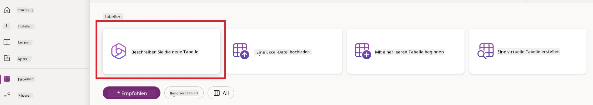

1. Verwenden Sie auf dem Bildschirm **Neue Tabelle beschreiben** das Textfeld, um die Tabelle zu beschreiben, die Sie erstellen möchten. Zum Beispiel: **_Ich möchte eine Tabelle erstellen, um Rechnungsinformationen zu speichern_**. Klicken Sie auf die Schaltfläche **Senden**, um die Eingabeaufforderung an den KI-CoPilot zu senden.

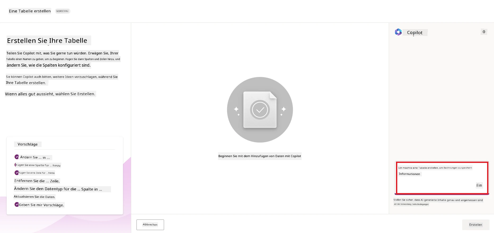

1. Der KI-CoPilot schlägt eine Dataverse-Tabelle mit den Feldern vor, die Sie benötigen, um die zu verfolgenden Daten zu speichern, sowie Beispiel-Daten. Sie können die Tabelle dann mithilfe der CoPilot-Assistenzfunktion über konversationelle Schritte an Ihre Bedürfnisse anpassen.

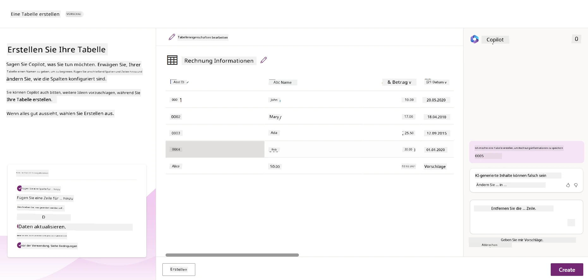

1. Das Finanzteam möchte eine E-Mail an den Lieferanten senden, um ihn über den aktuellen Status seiner Rechnung zu informieren. Sie können CoPilot verwenden, um der Tabelle ein neues Feld hinzuzufügen, um die E-Mail-Adresse des Lieferanten zu speichern. Zum Beispiel können Sie die folgende Eingabeaufforderung verwenden, um der Tabelle ein neues Feld hinzuzufügen: **_Ich möchte eine Spalte hinzufügen, um die Lieferanten-E-Mail zu speichern_**. Klicken Sie auf die Schaltfläche **Senden**, um die Eingabeaufforderung an den KI-CoPilot zu senden.

1. Der KI-CoPilot generiert ein neues Feld, das Sie dann an Ihre Bedürfnisse anpassen können.

1. Sobald Sie mit der Tabelle fertig sind, klicken Sie auf die Schaltfläche **Erstellen**, um die Tabelle zu erstellen.

## KI-Modelle in der Power Platform mit AI Builder

AI Builder ist eine Low-Code-KI-Funktion in der Power Platform, mit der Sie KI-Modelle verwenden können, um Prozesse zu automatisieren und Ergebnisse vorherzusagen. Mit AI Builder können Sie KI in Ihre Apps und Flows integrieren, die mit Ihren Daten in Dataverse oder verschiedenen Cloud-Datenquellen wie SharePoint, OneDrive oder Azure verbunden sind.

## Vorgefertigte KI-Modelle vs. eigene KI-Modelle

AI Builder bietet zwei Arten von KI-Modellen: Vorgefertigte KI-Modelle und eigene KI-Modelle. Vorgefertigte KI-Modelle sind einsatzbereite KI-Modelle, die von Microsoft trainiert und in der Power Platform verfügbar sind. Diese helfen Ihnen dabei, Intelligenz zu Ihren Apps und Flows hinzuzufügen, ohne eigene Daten sammeln und dann eigene Modelle erstellen, trainieren und veröffentlichen zu müssen. Sie können diese Modelle zur Automatisierung von Prozessen und zur Vorhersage von Ergebnissen nutzen.

Einige der in der Power Platform verfügbaren vorgefertigten KI-Modelle umfassen:

- **Schlüsselbegriffextraktion**: Dieses Modell extrahiert Schlüsselbegriffe aus Texten.
- **Spracherkennung**: Dieses Modell erkennt die Sprache eines Textes.
- **Sentiment-Analyse**: Dieses Modell erkennt positive, negative, neutrale oder gemischte Stimmungen in Texten.
- **Visitenkartenerfassung**: Dieses Modell extrahiert Informationen von Visitenkarten.
- **Texterkennung**: Dieses Modell extrahiert Text aus Bildern.
- **Objekterkennung**: Dieses Modell erkennt und extrahiert Objekte aus Bildern.
- **Formularverarbeitung**: Dieses Modell extrahiert Informationen aus Formularen.
- **Rechnungsverarbeitung**: Dieses Modell extrahiert Informationen aus Rechnungen.

Mit eigenen KI-Modellen können Sie Ihr eigenes Modell in AI Builder integrieren, sodass es wie jedes andere benutzerdefinierte AI Builder-Modell funktioniert, das Sie mit Ihren eigenen Daten trainieren können. Sie können diese Modelle in Power Apps und Power Automate verwenden, um Prozesse zu automatisieren und Ergebnisse vorherzusagen. Für die Verwendung eigener Modelle gelten bestimmte Einschränkungen. Lesen Sie mehr über diese [Einschränkungen](https://learn.microsoft.com/ai-builder/byo-model#limitations?WT.mc_id=academic-105485-koreyst).

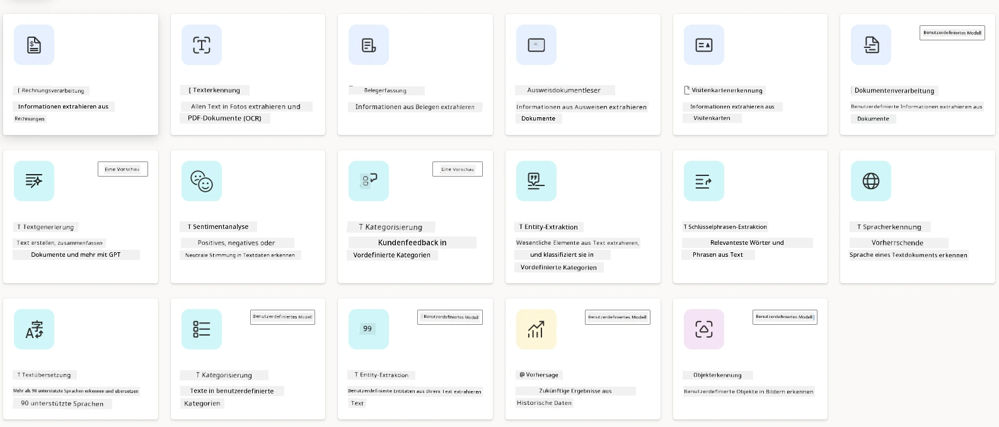

## Aufgabe #2 – Erstellen eines Rechnungsverarbeitungs-Workflows für unser Startup

Das Finanzteam hatte Schwierigkeiten bei der Verarbeitung von Rechnungen. Sie haben eine Tabellenkalkulation zur Verfolgung der Rechnungen verwendet, aber dies wurde mit der steigenden Anzahl der Rechnungen schwer zu verwalten. Sie haben Sie gebeten, einen Workflow zu erstellen, der ihnen bei der Verarbeitung von Rechnungen mit KI hilft. Der Workflow soll ihnen ermöglichen, Informationen aus Rechnungen zu extrahieren und die Informationen in einer Dataverse-Tabelle zu speichern. Der Workflow soll ihnen auch ermöglichen, dem Finanzteam eine E-Mail mit den extrahierten Informationen zu senden.

Jetzt, da Sie wissen, was AI Builder ist und warum Sie es verwenden sollten, sehen wir uns an, wie Sie das zuvor behandelte KI-Modell zur Rechnungsverarbeitung in AI Builder verwenden, um einen Workflow zu erstellen, der dem Finanzteam bei der Verarbeitung von Rechnungen hilft.

Um einen Workflow zu erstellen, der dem Finanzteam hilft, Rechnungen mit dem KI-Modell zur Rechnungsverarbeitung in AI Builder zu verarbeiten, befolgen Sie die untenstehenden Schritte:

1. Navigieren Sie zum [Power Automate](https://make.powerautomate.com?WT.mc_id=academic-105485-koreyst) Startbildschirm.

2. Verwenden Sie das Textfeld auf dem Startbildschirm, um den Workflow zu beschreiben, den Sie erstellen möchten. Zum Beispiel: **_Verarbeite eine Rechnung, wenn sie in meinem Posteingang ankommt_**. Klicken Sie auf die Schaltfläche **Senden**, um die Eingabeaufforderung an den KI-CoPilot zu senden.

   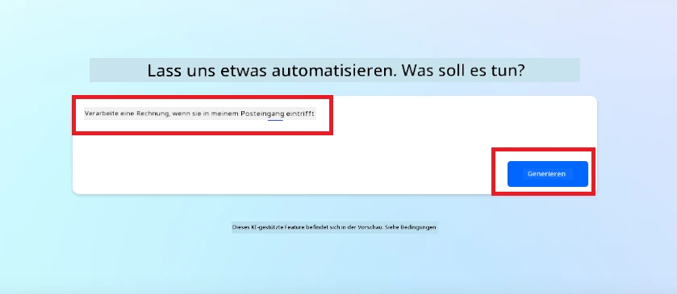

3. Der KI-CoPilot schlägt die Aktionen vor, die Sie benötigen, um die Aufgabe zu automatisieren, die Sie erreichen wollen. Sie können auf die Schaltfläche **Weiter** klicken, um die nächsten Schritte durchzugehen.

4. Im nächsten Schritt fordert Power Automate Sie auf, die Verbindungen einzurichten, die für den Flow erforderlich sind. Sobald Sie fertig sind, klicken Sie auf die Schaltfläche **Flow erstellen**, um den Flow zu erstellen.

5. Der KI-CoPilot generiert einen Flow, den Sie dann an Ihre Bedürfnisse anpassen können.

6. Aktualisieren Sie den Auslöser des Flows und setzen Sie den **Ordner** auf den Ordner, in dem die Rechnungen gespeichert werden. Zum Beispiel können Sie den Ordner auf **Posteingang** setzen. Klicken Sie auf **Erweiterte Optionen anzeigen** und setzen Sie **Nur mit Anlagen** auf **Ja**. Dies stellt sicher, dass der Flow nur ausgeführt wird, wenn eine E-Mail mit Anhang im Ordner eingeht.

7. Entfernen Sie die folgenden Aktionen aus dem Flow: **HTML in Text**, **Zusammenstellen**, **Zusammenstellen 2**, **Zusammenstellen 3** und **Zusammenstellen 4**, da Sie diese nicht verwenden werden.

8. Entfernen Sie die Aktion **Bedingung** aus dem Flow, da Sie diese nicht verwenden werden. Es sollte wie im folgenden Screenshot aussehen:

   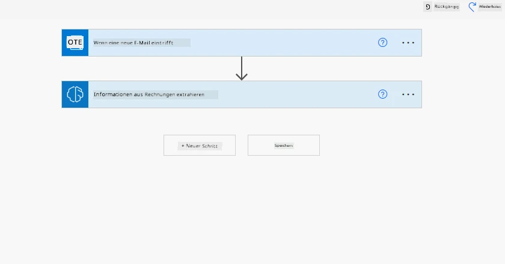

9. Klicken Sie auf die Schaltfläche **Aktion hinzufügen** und suchen Sie nach **Dataverse**. Wählen Sie die Aktion **Neue Zeile hinzufügen** aus.

10. Aktualisieren Sie in der Aktion **Informationen aus Rechnungen extrahieren** die **Rechnungsdatei**, sodass sie auf den **Anhangsinhalt** aus der E-Mail verweist. Dies stellt sicher, dass der Flow Informationen aus dem Rechnungsanhang extrahiert.

11. Wählen Sie die Tabelle aus, die Sie zuvor erstellt haben. Zum Beispiel können Sie die Tabelle **Rechnungsinformationen** auswählen. Wählen Sie die dynamischen Inhalte aus der vorherigen Aktion aus, um die folgenden Felder zu füllen:

    - ID
    - Betrag
    - Datum
    - Name
    - Status – Setzen Sie den **Status** auf **Ausstehend**.
    - Lieferanten-E-Mail – Verwenden Sie den dynamischen Inhalt **Von** aus dem Auslöser **Wenn eine neue E-Mail ankommt**.

    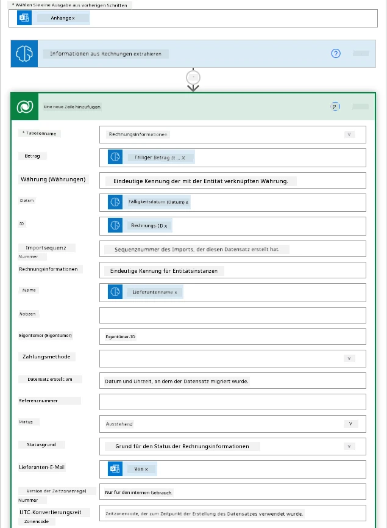

12. Sobald Sie den Flow fertiggestellt haben, klicken Sie auf die Schaltfläche **Speichern**, um den Flow zu speichern. Sie können den Flow dann testen, indem Sie eine E-Mail mit einer Rechnung an den im Auslöser angegebenen Ordner senden.

> **Ihre Hausaufgabe**: Der Flow, den Sie gerade erstellt haben, ist ein guter Anfang, nun müssen Sie überlegen, wie Sie eine Automatisierung bauen können, die unserem Finanzteam ermöglicht, dem Lieferanten eine E-Mail zu senden, um ihn über den aktuellen Status seiner Rechnung zu informieren. Ihr Hinweis: Der Flow muss ausgeführt werden, wenn sich der Status der Rechnung ändert.

## Verwendung eines Textgenerierungs-KI-Modells in Power Automate

Das KI-Modell "Text mit GPT erstellen" in AI Builder ermöglicht es Ihnen, basierend auf einer Eingabeaufforderung Text zu generieren und wird vom Microsoft Azure OpenAI Service unterstützt. Mit dieser Funktionalität können Sie GPT-Technologie (Generative Pre-Trained Transformer) in Ihre Apps und Flows integrieren, um eine Vielzahl automatisierter Flows und aufschlussreicher Anwendungen zu erstellen.

GPT-Modelle werden umfangreich mit großen Datenmengen trainiert, sodass sie Text erzeugen können, der menschlicher Sprache sehr ähnlich ist, wenn sie eine Eingabeaufforderung erhalten. In Kombination mit Workflow-Automatisierung können KI-Modelle wie GPT genutzt werden, um eine breite Palette von Aufgaben zu vereinfachen und zu automatisieren.

Zum Beispiel können Sie Flows erstellen, die automatisch Texte für verschiedene Anwendungsfälle generieren, wie Entwürfe für E-Mails, Produktbeschreibungen und mehr. Sie können das Modell auch verwenden, um Text für verschiedene Apps zu generieren, wie Chatbots und Kundenservice-Apps, die Kundenservice-Mitarbeitern ermöglichen, effektiv und effizient auf Kundenanfragen zu antworten.

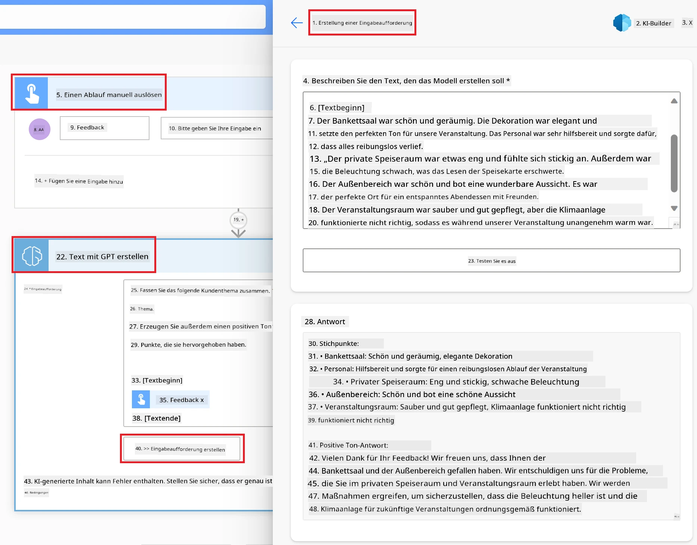

Um zu lernen, wie Sie dieses KI-Modell in Power Automate verwenden, bearbeiten Sie das Modul [Intelligenz mit AI Builder und GPT hinzufügen](https://learn.microsoft.com/training/modules/ai-builder-text-generation/?WT.mc_id=academic-109639-somelezediko).

## Großartige Arbeit! Setzen Sie Ihr Lernen fort

Nachdem Sie diese Lektion abgeschlossen haben, sehen Sie sich unsere [Generative AI Learning Sammlung](https://aka.ms/genai-collection?WT.mc_id=academic-105485-koreyst) an, um Ihr Generative AI-Wissen weiter zu vertiefen!

Möchten Sie Copilot anpassen und mehr herausholen? Entdecken Sie [Awesome Copilot](https://github.com/github/awesome-copilot?WT.mc_id=academic-105485-koreyst) — eine von der Community beigetragene Sammlung von Anweisungen, Agenten, Skills und Konfigurationen, die Ihnen helfen, das Beste aus GitHub Copilot herauszuholen.

Gehen Sie zu Lektion 11, wo wir uns ansehen, wie man [Generative AI mit Function Calling integriert](../11-integrating-with-function-calling/README.md?WT.mc_id=academic-105485-koreyst)!

---

<!-- CO-OP TRANSLATOR DISCLAIMER START -->
**Haftungsausschluss**:
Dieses Dokument wurde mit dem KI-Übersetzungsdienst [Co-op Translator](https://github.com/Azure/co-op-translator) übersetzt. Obwohl wir uns um Genauigkeit bemühen, beachten Sie bitte, dass automatisierte Übersetzungen Fehler oder Ungenauigkeiten enthalten können. Das Originaldokument in seiner Ursprungssprache gilt als maßgebliche Quelle. Bei kritischen Informationen wird eine professionelle menschliche Übersetzung empfohlen. Wir übernehmen keine Haftung für Missverständnisse oder Fehlinterpretationen, die aus der Verwendung dieser Übersetzung entstehen.
<!-- CO-OP TRANSLATOR DISCLAIMER END -->