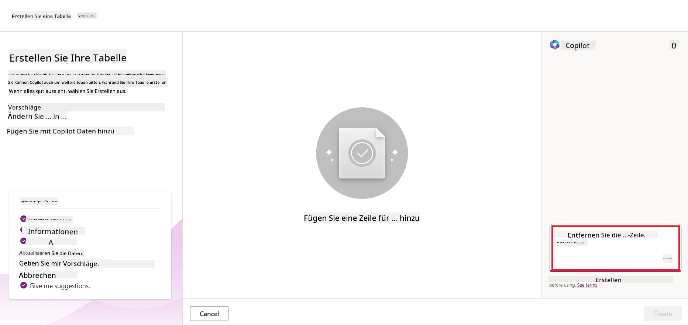
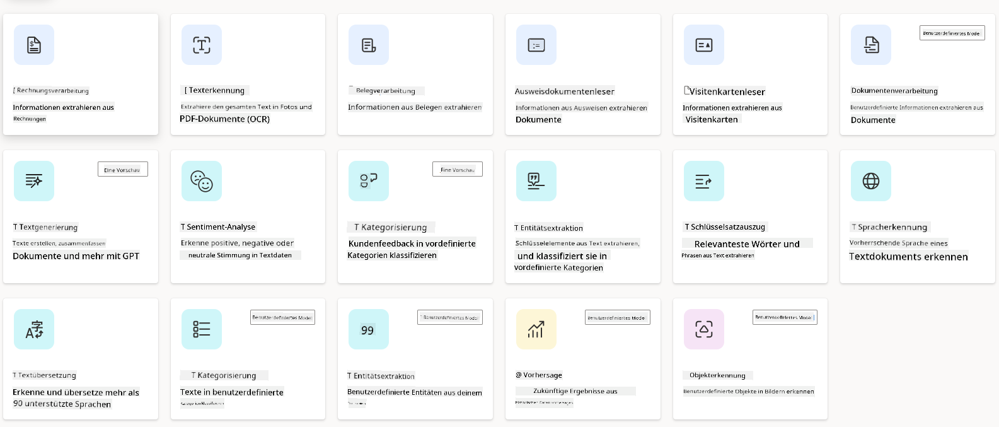
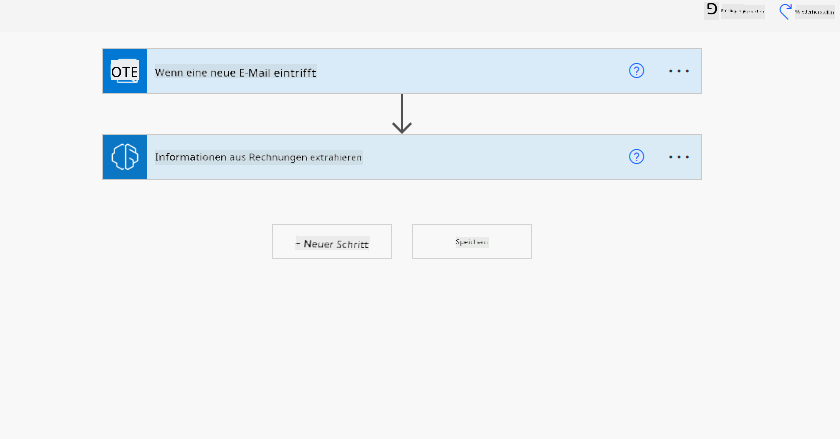

<!--
CO_OP_TRANSLATOR_METADATA:
{
  "original_hash": "f5ff3b6204a695a117d6f452403c95f7",
  "translation_date": "2025-07-09T13:39:57+00:00",
  "source_file": "10-building-low-code-ai-applications/README.md",
  "language_code": "de"
}
-->
# Low-Code KI-Anwendungen entwickeln

> _(Klicken Sie auf das Bild oben, um das Video zu dieser Lektion anzusehen)_

## Einführung

Nachdem wir gelernt haben, wie man Anwendungen zur Bilderzeugung erstellt, sprechen wir nun über Low Code. Generative KI kann in vielen verschiedenen Bereichen eingesetzt werden, unter anderem auch im Low Code-Bereich. Aber was genau ist Low Code und wie können wir KI darin integrieren?

Das Erstellen von Apps und Lösungen ist für traditionelle Entwickler und Nicht-Entwickler durch den Einsatz von Low Code Development Platforms einfacher geworden. Low Code Development Platforms ermöglichen es, Apps und Lösungen mit wenig oder gar keinem Code zu erstellen. Dies wird durch eine visuelle Entwicklungsumgebung erreicht, in der Komponenten per Drag & Drop zusammengefügt werden können. So lassen sich Apps und Lösungen schneller und mit weniger Ressourcen entwickeln. In dieser Lektion tauchen wir tief in die Nutzung von Low Code ein und zeigen, wie man Low Code-Entwicklung mit KI mithilfe der Power Platform verbessern kann.

Die Power Platform bietet Organisationen die Möglichkeit, ihre Teams zu befähigen, eigene Lösungen in einer intuitiven Low-Code- oder No-Code-Umgebung zu erstellen. Diese Umgebung vereinfacht den Prozess der Lösungsentwicklung. Mit der Power Platform können Lösungen in Tagen oder Wochen statt in Monaten oder Jahren erstellt werden. Die Power Platform besteht aus fünf Hauptprodukten: Power Apps, Power Automate, Power BI, Power Pages und Copilot Studio.

Diese Lektion behandelt:

- Einführung in Generative KI in der Power Platform  
- Einführung in Copilot und dessen Nutzung  
- Einsatz von Generative KI zum Erstellen von Apps und Flows in der Power Platform  
- Verständnis der KI-Modelle in der Power Platform mit AI Builder  

## Lernziele

Am Ende dieser Lektion werden Sie in der Lage sein:

- Zu verstehen, wie Copilot in der Power Platform funktioniert.

- Eine App zur Nachverfolgung von Schüleraufgaben für unser Bildungs-Startup zu erstellen.

- Einen Workflow zur Rechnungsverarbeitung zu erstellen, der KI nutzt, um Informationen aus Rechnungen zu extrahieren.

- Best Practices bei der Nutzung des Create Text mit GPT AI-Modells anzuwenden.

Die Werkzeuge und Technologien, die Sie in dieser Lektion verwenden werden, sind:

- **Power Apps**, für die Student Assignment Tracker App, die eine Low-Code-Entwicklungsumgebung zum Erstellen von Apps bietet, mit denen Daten verfolgt, verwaltet und bearbeitet werden können.

- **Dataverse**, zur Speicherung der Daten für die Student Assignment Tracker App, wobei Dataverse eine Low-Code-Datenplattform für die Speicherung der App-Daten bereitstellt.

- **Power Automate**, für den Workflow zur Rechnungsverarbeitung, der eine Low-Code-Entwicklungsumgebung zum Erstellen von Workflows zur Automatisierung des Rechnungsverarbeitungsprozesses bietet.

- **AI Builder**, für das KI-Modell zur Rechnungsverarbeitung, mit dem Sie vorgefertigte KI-Modelle nutzen, um die Rechnungen für unser Startup zu verarbeiten.

## Generative KI in der Power Platform

Die Verbesserung der Low-Code-Entwicklung und -Anwendung durch generative KI ist ein zentraler Schwerpunkt der Power Platform. Das Ziel ist es, jedem zu ermöglichen, KI-gestützte Apps, Websites, Dashboards zu erstellen und Prozesse mit KI zu automatisieren – _ohne dass dafür Datenwissenschaftsexpertise erforderlich ist_. Dieses Ziel wird erreicht, indem generative KI in die Low-Code-Entwicklungserfahrung der Power Platform integriert wird, und zwar in Form von Copilot und AI Builder.

### Wie funktioniert das?

Copilot ist ein KI-Assistent, der es Ihnen ermöglicht, Power Platform-Lösungen zu erstellen, indem Sie Ihre Anforderungen in einer Reihe von Gesprächsschritten in natürlicher Sprache beschreiben. Sie können zum Beispiel Ihrem KI-Assistenten mitteilen, welche Felder Ihre App verwenden soll, und er erstellt sowohl die App als auch das zugrundeliegende Datenmodell. Oder Sie geben an, wie ein Flow in Power Automate eingerichtet werden soll.

Sie können Copilot-gesteuerte Funktionen als Feature in Ihren App-Bildschirmen verwenden, um Nutzern durch konversationelle Interaktionen Einblicke zu ermöglichen.

AI Builder ist eine Low-Code-KI-Funktion in der Power Platform, mit der Sie KI-Modelle nutzen können, um Prozesse zu automatisieren und Ergebnisse vorherzusagen. Mit AI Builder können Sie KI in Ihre Apps und Flows integrieren, die mit Daten in Dataverse oder verschiedenen Cloud-Datenquellen wie SharePoint, OneDrive oder Azure verbunden sind.

Copilot ist in allen Power Platform-Produkten verfügbar: Power Apps, Power Automate, Power BI, Power Pages und Power Virtual Agents. AI Builder ist in Power Apps und Power Automate verfügbar. In dieser Lektion konzentrieren wir uns darauf, wie man Copilot und AI Builder in Power Apps und Power Automate nutzt, um eine Lösung für unser Bildungs-Startup zu erstellen.

### Copilot in Power Apps

Als Teil der Power Platform bietet Power Apps eine Low-Code-Entwicklungsumgebung zum Erstellen von Apps, mit denen Daten verfolgt, verwaltet und bearbeitet werden können. Es ist eine Sammlung von App-Entwicklungsdiensten mit einer skalierbaren Datenplattform und der Möglichkeit, sich mit Cloud-Diensten und lokalen Daten zu verbinden. Power Apps ermöglicht es, Apps zu erstellen, die in Browsern, auf Tablets und Smartphones laufen und mit Kollegen geteilt werden können. Power Apps erleichtert den Einstieg in die App-Entwicklung durch eine einfache Benutzeroberfläche, sodass jeder Business-Nutzer oder Profi-Entwickler individuelle Apps erstellen kann. Die App-Entwicklungserfahrung wird zudem durch generative KI über Copilot verbessert.

Die Copilot-KI-Assistentenfunktion in Power Apps ermöglicht es Ihnen, zu beschreiben, welche Art von App Sie benötigen und welche Informationen Ihre App verfolgen, sammeln oder anzeigen soll. Copilot generiert dann basierend auf Ihrer Beschreibung eine responsive Canvas-App. Sie können die App anschließend an Ihre Bedürfnisse anpassen. Der KI-Copilot erstellt und schlägt außerdem eine Dataverse-Tabelle mit den benötigten Feldern vor, um die Daten zu speichern, die Sie verfolgen möchten, sowie einige Beispieldaten. Was Dataverse ist und wie Sie es in Power Apps nutzen können, sehen wir uns später in dieser Lektion an. Sie können die Tabelle dann mithilfe des KI-Copilot-Assistenten über konversationelle Schritte anpassen. Diese Funktion ist direkt vom Power Apps-Startbildschirm aus verfügbar.

### Copilot in Power Automate

Als Teil der Power Platform ermöglicht Power Automate Nutzern, automatisierte Workflows zwischen Anwendungen und Diensten zu erstellen. Es hilft dabei, sich wiederholende Geschäftsprozesse wie Kommunikation, Datenerfassung und Genehmigungen zu automatisieren. Die einfache Benutzeroberfläche erlaubt es Nutzern aller technischen Erfahrungsstufen (von Anfängern bis zu erfahrenen Entwicklern), Arbeitsschritte zu automatisieren. Die Workflow-Entwicklung wird ebenfalls durch generative KI über Copilot verbessert.

Die Copilot-KI-Assistentenfunktion in Power Automate ermöglicht es Ihnen, zu beschreiben, welche Art von Flow Sie benötigen und welche Aktionen Ihr Flow ausführen soll. Copilot generiert dann basierend auf Ihrer Beschreibung einen Flow. Sie können den Flow anschließend an Ihre Bedürfnisse anpassen. Der KI-Copilot schlägt außerdem die Aktionen vor, die Sie benötigen, um die gewünschte Aufgabe zu automatisieren. Was Flows sind und wie Sie sie in Power Automate nutzen können, sehen wir uns später in dieser Lektion an. Sie können die Aktionen dann mithilfe des KI-Copilot-Assistenten über konversationelle Schritte anpassen. Diese Funktion ist direkt vom Power Automate-Startbildschirm aus verfügbar.

## Aufgabe: Verwaltung von Schüleraufgaben und Rechnungen für unser Startup mit Copilot

Unser Startup bietet Online-Kurse für Schüler an. Das Startup ist schnell gewachsen und hat nun Schwierigkeiten, mit der Nachfrage nach seinen Kursen Schritt zu halten. Das Startup hat Sie als Power Platform-Entwickler engagiert, um eine Low-Code-Lösung zu entwickeln, die ihnen hilft, Schüleraufgaben und Rechnungen zu verwalten. Die Lösung soll es ermöglichen, Schüleraufgaben über eine App zu verfolgen und zu verwalten sowie den Rechnungsverarbeitungsprozess durch einen Workflow zu automatisieren. Sie wurden gebeten, Generative KI zur Entwicklung der Lösung einzusetzen.

Wenn Sie mit Copilot starten, können Sie die [Power Platform Copilot Prompt Library](https://github.com/pnp/powerplatform-prompts?WT.mc_id=academic-109639-somelezediko) nutzen, um mit den Eingabeaufforderungen zu beginnen. Diese Bibliothek enthält eine Liste von Prompts, die Sie verwenden können, um Apps und Flows mit Copilot zu erstellen. Sie können die Prompts auch nutzen, um eine Vorstellung davon zu bekommen, wie Sie Ihre Anforderungen an Copilot formulieren.

### Erstellen Sie eine Student Assignment Tracker App für unser Startup

Die Lehrkräfte unseres Startups haben Schwierigkeiten, den Überblick über die Schüleraufgaben zu behalten. Sie haben bisher eine Tabelle verwendet, um die Aufgaben zu verfolgen, aber das ist mit der steigenden Anzahl der Schüler schwer zu handhaben. Sie haben Sie gebeten, eine App zu erstellen, die ihnen hilft, Schüleraufgaben zu verfolgen und zu verwalten. Die App soll es ermöglichen, neue Aufgaben hinzuzufügen, Aufgaben anzusehen, zu aktualisieren und zu löschen. Außerdem soll die App Lehrkräften und Schülern anzeigen, welche Aufgaben bewertet wurden und welche nicht.

Sie erstellen die App mit Copilot in Power Apps, indem Sie die folgenden Schritte befolgen:

1. Navigieren Sie zum [Power Apps](https://make.powerapps.com?WT.mc_id=academic-105485-koreyst) Startbildschirm.

1. Verwenden Sie das Textfeld auf dem Startbildschirm, um die App zu beschreiben, die Sie erstellen möchten. Zum Beispiel: **_Ich möchte eine App erstellen, um Schüleraufgaben zu verfolgen und zu verwalten_**. Klicken Sie auf die **Senden**-Schaltfläche, um die Eingabeaufforderung an den KI-Copilot zu senden.

1. Der KI-Copilot schlägt eine Dataverse-Tabelle mit den Feldern vor, die Sie benötigen, um die Daten zu speichern, die Sie verfolgen möchten, sowie einige Beispieldaten. Sie können die Tabelle dann mithilfe des KI-Copilot-Assistenten über konversationelle Schritte an Ihre Bedürfnisse anpassen.

   > **Wichtig**: Dataverse ist die zugrundeliegende Datenplattform der Power Platform. Es handelt sich um eine Low-Code-Datenplattform zur Speicherung der App-Daten. Es ist ein vollständig verwalteter Dienst, der Daten sicher in der Microsoft Cloud speichert und innerhalb Ihrer Power Platform-Umgebung bereitgestellt wird. Es bietet integrierte Funktionen zur Datenverwaltung, wie Datenklassifizierung, Datenherkunft, fein abgestufte Zugriffskontrolle und mehr. Mehr Informationen zu Dataverse finden Sie [hier](https://docs.microsoft.com/powerapps/maker/data-platform/data-platform-intro?WT.mc_id=academic-109639-somelezediko).

   

1. Lehrkräfte möchten E-Mails an Schüler senden, die ihre Aufgaben eingereicht haben, um sie über den Fortschritt zu informieren. Sie können Copilot verwenden, um der Tabelle ein neues Feld für die Schüler-E-Mail hinzuzufügen. Zum Beispiel können Sie folgende Eingabeaufforderung verwenden: **_Ich möchte eine Spalte hinzufügen, um die E-Mail der Schüler zu speichern_**. Klicken Sie auf die **Senden**-Schaltfläche, um die Eingabeaufforderung an den KI-Copilot zu senden.

1. Der KI-Copilot erstellt ein neues Feld, das Sie dann an Ihre Bedürfnisse anpassen können.

1. Wenn Sie mit der Tabelle fertig sind, klicken Sie auf die **App erstellen**-Schaltfläche, um die App zu erstellen.

1. Der KI-Copilot generiert basierend auf Ihrer Beschreibung eine responsive Canvas-App. Sie können die App anschließend an Ihre Bedürfnisse anpassen.

1. Damit Lehrkräfte E-Mails an Schüler senden können, können Sie Copilot verwenden, um der App einen neuen Bildschirm hinzuzufügen. Zum Beispiel können Sie folgende Eingabeaufforderung verwenden: **_Ich möchte einen Bildschirm hinzufügen, um E-Mails an Schüler zu senden_**. Klicken Sie auf die **Senden**-Schaltfläche, um die Eingabeaufforderung an den KI-Copilot zu senden.

1. Der KI-Copilot generiert einen neuen Bildschirm, den Sie dann an Ihre Bedürfnisse anpassen können.

1. Wenn Sie mit der App fertig sind, klicken Sie auf die **Speichern**-Schaltfläche, um die App zu speichern.

1. Um die App mit den Lehrkräften zu teilen, klicken Sie auf die **Teilen**-Schaltfläche und dann erneut auf **Teilen**. Sie können die App dann teilen, indem Sie die E-Mail-Adressen der Lehrkräfte eingeben.

> **Ihre Hausaufgabe**: Die App, die Sie gerade erstellt haben, ist ein guter Anfang, kann aber noch verbessert werden. Mit der E-Mail-Funktion können Lehrkräfte E-Mails nur manuell senden, indem sie die E-Mail-Adressen eintippen. Können Sie Copilot nutzen, um eine Automatisierung zu erstellen, die es Lehrkräften ermöglicht, E-Mails automatisch an Schüler zu senden, sobald diese ihre Aufgaben einreichen? Ihr Hinweis: Mit der richtigen Eingabeaufforderung können Sie Copilot in Power Automate dafür nutzen.

### Erstellen Sie eine Tabelle für Rechnungsinformationen für unser Startup

Das Finanzteam unseres Startups hat Schwierigkeiten, den Überblick über Rechnungen zu behalten. Sie haben bisher eine Tabelle verwendet, um die Rechnungen zu verfolgen, aber das ist mit der steigenden Anzahl der Rechnungen schwer zu handhaben. Sie haben Sie gebeten, eine Tabelle zu erstellen, die ihnen hilft, die Informationen der erhaltenen Rechnungen zu speichern, zu verfolgen und zu verwalten. Die Tabelle soll genutzt werden, um eine Automatisierung zu erstellen, die alle Rechnungsinformationen extrahiert und in der Tabelle speichert. Die Tabelle soll dem Finanzteam außerdem ermöglichen, bezahlte und unbezahlte Rechnungen einzusehen.

Die Power Platform verfügt über eine zugrundeliegende Datenplattform namens Dataverse, die es Ihnen ermöglicht, die Daten für Ihre Apps und Lösungen zu speichern. Dataverse bietet eine Low-Code-Datenplattform zur Speicherung der App-Daten. Es ist ein vollständig verwalteter Dienst, der Daten sicher in der Microsoft Cloud speichert und innerhalb Ihrer Power Platform-Umgebung bereitgestellt wird. Es bietet integrierte Funktionen zur Datenverwaltung, wie Datenklassifizierung, Datenherkunft, fein abgestufte Zugriffskontrolle und mehr. Mehr Informationen zu Dataverse finden Sie [hier](https://docs.microsoft.com/powerapps/maker/data-platform/data-platform-intro?WT.mc_id=academic-109639-somelezediko).

Warum sollten wir Dataverse für unser Startup nutzen? Die Standard- und benutzerdefinierten Tabellen in Dataverse bieten eine sichere und cloudbasierte Speicheroption für Ihre Daten. Tabellen ermöglichen es Ihnen, verschiedene Datentypen zu speichern, ähnlich wie Sie mehrere Arbeitsblätter in einer Excel-Arbeitsmappe verwenden würden. Sie können Tabellen nutzen, um Daten zu speichern, die speziell auf Ihre Organisation oder Geschäftsanforderungen zugeschnitten sind. Einige der Vorteile, die unser Startup durch die Nutzung von Dataverse erhält, umfassen unter anderem:
- **Einfach zu verwalten**: Sowohl die Metadaten als auch die Daten werden in der Cloud gespeichert, sodass Sie sich keine Sorgen darüber machen müssen, wie sie gespeichert oder verwaltet werden. Sie können sich darauf konzentrieren, Ihre Apps und Lösungen zu entwickeln.

- **Sicher**: Dataverse bietet eine sichere, cloudbasierte Speicheroption für Ihre Daten. Sie können steuern, wer Zugriff auf die Daten in Ihren Tabellen hat und wie dieser Zugriff über rollenbasierte Sicherheit erfolgt.

- **Umfangreiche Metadaten**: Datentypen und Beziehungen werden direkt in Power Apps verwendet.

- **Logik und Validierung**: Sie können Geschäftsregeln, berechnete Felder und Validierungsregeln verwenden, um Geschäftslogik durchzusetzen und die Datenqualität sicherzustellen.

Jetzt, da Sie wissen, was Dataverse ist und warum Sie es verwenden sollten, schauen wir uns an, wie Sie Copilot nutzen können, um eine Tabelle in Dataverse zu erstellen, die den Anforderungen unseres Finanzteams entspricht.

> **Hinweis** : Sie werden diese Tabelle im nächsten Abschnitt verwenden, um eine Automatisierung zu erstellen, die alle Rechnungsinformationen extrahiert und in der Tabelle speichert.

Um mit Copilot eine Tabelle in Dataverse zu erstellen, gehen Sie wie folgt vor:

1. Navigieren Sie zum [Power Apps](https://make.powerapps.com?WT.mc_id=academic-105485-koreyst) Startbildschirm.

2. Wählen Sie in der linken Navigationsleiste **Tables** aus und klicken Sie dann auf **Describe the new Table**.

3. Verwenden Sie auf dem Bildschirm **Describe the new Table** das Textfeld, um die Tabelle zu beschreiben, die Sie erstellen möchten. Zum Beispiel: **_Ich möchte eine Tabelle erstellen, um Rechnungsinformationen zu speichern_**. Klicken Sie auf die Schaltfläche **Send**, um die Eingabe an den AI Copilot zu senden.

4. Der AI Copilot schlägt eine Dataverse-Tabelle mit den benötigten Feldern vor, um die zu verfolgenden Daten zu speichern, sowie einige Beispieldaten. Sie können die Tabelle anschließend mithilfe der AI Copilot-Assistentenfunktion in mehreren Schritten an Ihre Bedürfnisse anpassen.

5. Das Finanzteam möchte dem Lieferanten eine E-Mail senden, um ihn über den aktuellen Status seiner Rechnung zu informieren. Sie können Copilot verwenden, um der Tabelle ein neues Feld hinzuzufügen, in dem die E-Mail-Adresse des Lieferanten gespeichert wird. Zum Beispiel können Sie folgenden Prompt verwenden, um ein neues Feld hinzuzufügen: **_Ich möchte eine Spalte hinzufügen, um die E-Mail-Adresse des Lieferanten zu speichern_**. Klicken Sie auf die Schaltfläche **Send**, um die Eingabe an den AI Copilot zu senden.

6. Der AI Copilot generiert ein neues Feld, das Sie anschließend an Ihre Anforderungen anpassen können.

7. Wenn Sie mit der Tabelle fertig sind, klicken Sie auf die Schaltfläche **Create**, um die Tabelle zu erstellen.

## AI-Modelle in Power Platform mit AI Builder

AI Builder ist eine Low-Code-KI-Funktion in Power Platform, mit der Sie AI-Modelle nutzen können, um Prozesse zu automatisieren und Ergebnisse vorherzusagen. Mit AI Builder können Sie KI in Ihre Apps und Flows integrieren, die auf Ihre Daten in Dataverse oder verschiedenen Cloud-Datenquellen wie SharePoint, OneDrive oder Azure zugreifen.

## Vorgefertigte AI-Modelle vs. benutzerdefinierte AI-Modelle

AI Builder bietet zwei Arten von AI-Modellen: Vorgefertigte AI-Modelle und benutzerdefinierte AI-Modelle. Vorgefertigte AI-Modelle sind einsatzbereite Modelle, die von Microsoft trainiert wurden und in Power Platform verfügbar sind. Sie helfen Ihnen, Intelligenz in Ihre Apps und Flows einzubauen, ohne dass Sie eigene Daten sammeln, Modelle erstellen, trainieren und veröffentlichen müssen. Sie können diese Modelle verwenden, um Prozesse zu automatisieren und Ergebnisse vorherzusagen.

Einige der in Power Platform verfügbaren vorgefertigten AI-Modelle sind:

- **Key Phrase Extraction**: Dieses Modell extrahiert Schlüsselbegriffe aus Texten.
- **Language Detection**: Dieses Modell erkennt die Sprache eines Textes.
- **Sentiment Analysis**: Dieses Modell erkennt positive, negative, neutrale oder gemischte Stimmungen in Texten.
- **Business Card Reader**: Dieses Modell extrahiert Informationen von Visitenkarten.
- **Text Recognition**: Dieses Modell extrahiert Text aus Bildern.
- **Object Detection**: Dieses Modell erkennt und extrahiert Objekte aus Bildern.
- **Document processing**: Dieses Modell extrahiert Informationen aus Formularen.
- **Invoice Processing**: Dieses Modell extrahiert Informationen aus Rechnungen.

Mit benutzerdefinierten AI-Modellen können Sie Ihr eigenes Modell in AI Builder integrieren, sodass es wie jedes andere benutzerdefinierte AI Builder-Modell funktioniert und Sie es mit Ihren eigenen Daten trainieren können. Diese Modelle können Sie verwenden, um Prozesse in Power Apps und Power Automate zu automatisieren und Ergebnisse vorherzusagen. Bei der Verwendung eigener Modelle gelten bestimmte Einschränkungen. Mehr dazu erfahren Sie unter [limitations](https://learn.microsoft.com/ai-builder/byo-model#limitations?WT.mc_id=academic-105485-koreyst).

## Aufgabe #2 – Erstellen Sie einen Workflow zur Rechnungsverarbeitung für unser Startup

Das Finanzteam hat Schwierigkeiten bei der Verarbeitung von Rechnungen. Sie haben bisher eine Tabelle verwendet, um die Rechnungen zu verfolgen, aber das ist mit der steigenden Anzahl an Rechnungen schwer zu handhaben. Sie haben Sie gebeten, einen Workflow zu erstellen, der ihnen hilft, Rechnungen mithilfe von KI zu verarbeiten. Der Workflow soll es ermöglichen, Informationen aus Rechnungen zu extrahieren und diese in einer Dataverse-Tabelle zu speichern. Außerdem soll der Workflow eine E-Mail an das Finanzteam mit den extrahierten Informationen senden.

Jetzt, da Sie wissen, was AI Builder ist und warum Sie es verwenden sollten, schauen wir uns an, wie Sie das Invoice Processing AI Model in AI Builder nutzen können, um einen Workflow zu erstellen, der dem Finanzteam bei der Rechnungsverarbeitung hilft.

Um einen Workflow zu erstellen, der dem Finanzteam bei der Rechnungsverarbeitung mit dem Invoice Processing AI Model in AI Builder hilft, gehen Sie wie folgt vor:

1. Navigieren Sie zum [Power Automate](https://make.powerautomate.com?WT.mc_id=academic-105485-koreyst) Startbildschirm.

2. Verwenden Sie das Textfeld auf dem Startbildschirm, um den Workflow zu beschreiben, den Sie erstellen möchten. Zum Beispiel: **_Verarbeite eine Rechnung, wenn sie in meinem Posteingang ankommt_**. Klicken Sie auf die Schaltfläche **Send**, um die Eingabe an den AI Copilot zu senden.

   

3. Der AI Copilot schlägt die Aktionen vor, die Sie zur Automatisierung der Aufgabe benötigen. Klicken Sie auf die Schaltfläche **Next**, um die nächsten Schritte durchzugehen.

4. Im nächsten Schritt fordert Power Automate Sie auf, die für den Flow erforderlichen Verbindungen einzurichten. Wenn Sie fertig sind, klicken Sie auf die Schaltfläche **Create flow**, um den Flow zu erstellen.

5. Der AI Copilot generiert einen Flow, den Sie anschließend an Ihre Bedürfnisse anpassen können.

6. Aktualisieren Sie den Trigger des Flows und legen Sie den **Folder** auf den Ordner fest, in dem die Rechnungen gespeichert werden. Zum Beispiel können Sie den Ordner auf **Inbox** setzen. Klicken Sie auf **Show advanced options** und setzen Sie **Only with Attachments** auf **Yes**. So wird sichergestellt, dass der Flow nur ausgeführt wird, wenn eine E-Mail mit Anhang im Ordner eingeht.

7. Entfernen Sie folgende Aktionen aus dem Flow: **HTML to text**, **Compose**, **Compose 2**, **Compose 3** und **Compose 4**, da Sie diese nicht verwenden werden.

8. Entfernen Sie die Aktion **Condition** aus dem Flow, da Sie diese nicht verwenden werden. Der Flow sollte dann wie im folgenden Screenshot aussehen:

   

9. Klicken Sie auf die Schaltfläche **Add an action** und suchen Sie nach **Dataverse**. Wählen Sie die Aktion **Add a new row** aus.

10. Aktualisieren Sie bei der Aktion **Extract Information from invoices** das Feld **Invoice File**, sodass es auf den **Attachment Content** aus der E-Mail verweist. So wird sichergestellt, dass der Flow Informationen aus dem Rechnungsanhang extrahiert.

11. Wählen Sie die Tabelle aus, die Sie zuvor erstellt haben. Zum Beispiel können Sie die Tabelle **Invoice Information** auswählen. Verwenden Sie die dynamischen Inhalte aus der vorherigen Aktion, um die folgenden Felder zu füllen:

    - ID  
    - Amount  
    - Date  
    - Name  
    - Status – Setzen Sie den **Status** auf **Pending**.  
    - Supplier Email – Verwenden Sie den dynamischen Inhalt **From** aus dem Trigger **When a new email arrives**.

    

12. Wenn Sie mit dem Flow fertig sind, klicken Sie auf die Schaltfläche **Save**, um den Flow zu speichern. Sie können den Flow testen, indem Sie eine E-Mail mit einer Rechnung an den im Trigger angegebenen Ordner senden.

> **Ihre Hausaufgabe**: Der Flow, den Sie gerade erstellt haben, ist ein guter Anfang. Nun müssen Sie überlegen, wie Sie eine Automatisierung erstellen können, die es unserem Finanzteam ermöglicht, dem Lieferanten eine E-Mail zu senden, um ihn über den aktuellen Status seiner Rechnung zu informieren. Ihr Tipp: Der Flow muss ausgeführt werden, wenn sich der Status der Rechnung ändert.

## Verwenden Sie ein Textgenerierungs-AI-Modell in Power Automate

Das Create Text with GPT AI Model in AI Builder ermöglicht es Ihnen, basierend auf einer Eingabeaufforderung Text zu generieren und wird vom Microsoft Azure OpenAI Service unterstützt. Mit dieser Funktion können Sie GPT (Generative Pre-Trained Transformer)-Technologie in Ihre Apps und Flows integrieren, um eine Vielzahl automatisierter Abläufe und intelligenter Anwendungen zu erstellen.

GPT-Modelle werden mit großen Datenmengen trainiert und können so Texte erzeugen, die menschlicher Sprache sehr ähnlich sind, wenn sie mit einer Eingabeaufforderung gefüttert werden. In Kombination mit Workflow-Automatisierung können KI-Modelle wie GPT genutzt werden, um eine breite Palette von Aufgaben zu vereinfachen und zu automatisieren.

Beispielsweise können Sie Flows erstellen, die automatisch Texte für verschiedene Anwendungsfälle generieren, wie Entwürfe von E-Mails, Produktbeschreibungen und mehr. Sie können das Modell auch verwenden, um Texte für verschiedene Apps zu generieren, etwa Chatbots und Kundenservice-Apps, die Kundendienstmitarbeitern helfen, effektiv und effizient auf Kundenanfragen zu reagieren.

Um zu lernen, wie Sie dieses AI-Modell in Power Automate verwenden, durchlaufen Sie das Modul [Add intelligence with AI Builder and GPT](https://learn.microsoft.com/training/modules/ai-builder-text-generation/?WT.mc_id=academic-109639-somelezediko).

## Gute Arbeit! Setzen Sie Ihr Lernen fort

Nachdem Sie diese Lektion abgeschlossen haben, schauen Sie sich unsere [Generative AI Learning collection](https://aka.ms/genai-collection?WT.mc_id=academic-105485-koreyst) an, um Ihr Wissen über Generative KI weiter zu vertiefen!

Gehen Sie zu Lektion 11, in der wir uns ansehen, wie man [Generative AI mit Function Calling integriert](../11-integrating-with-function-calling/README.md?WT.mc_id=academic-105485-koreyst)!

**Haftungsausschluss**:  
Dieses Dokument wurde mit dem KI-Übersetzungsdienst [Co-op Translator](https://github.com/Azure/co-op-translator) übersetzt. Obwohl wir uns um Genauigkeit bemühen, beachten Sie bitte, dass automatisierte Übersetzungen Fehler oder Ungenauigkeiten enthalten können. Das Originaldokument in seiner Ursprungssprache gilt als maßgebliche Quelle. Für wichtige Informationen wird eine professionelle menschliche Übersetzung empfohlen. Wir übernehmen keine Haftung für Missverständnisse oder Fehlinterpretationen, die aus der Nutzung dieser Übersetzung entstehen.